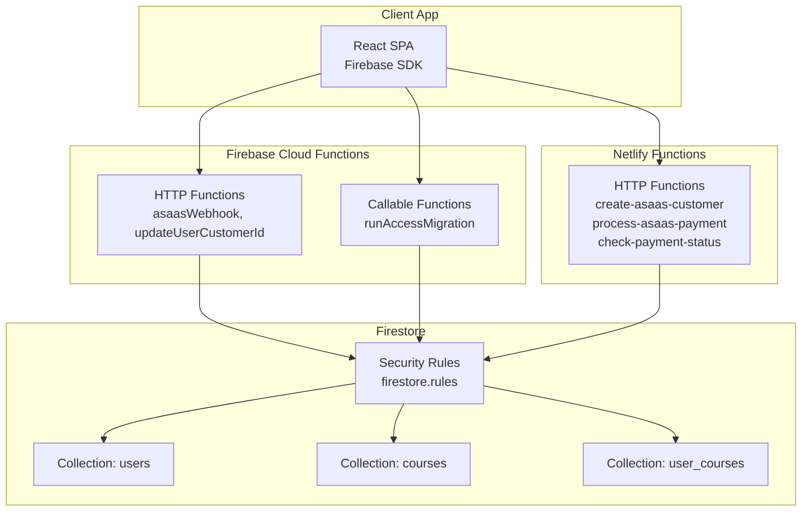
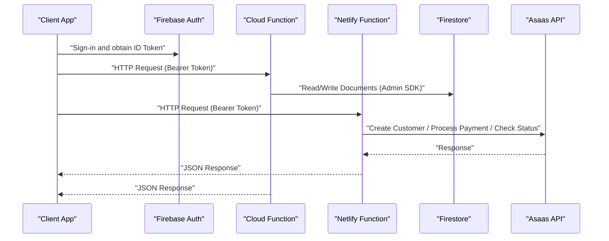
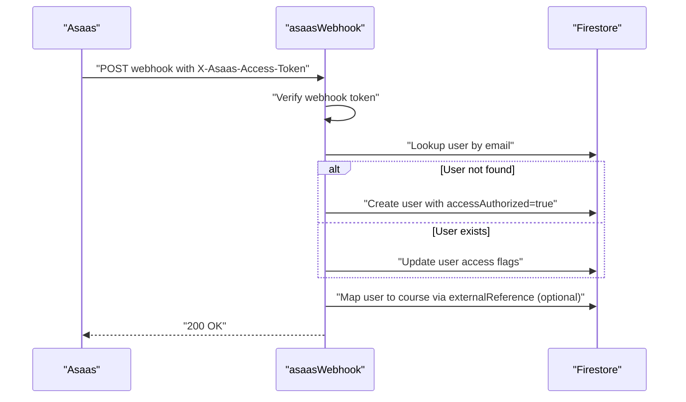
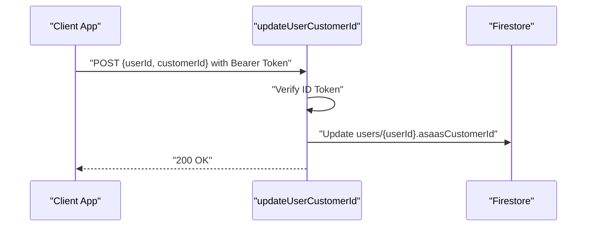
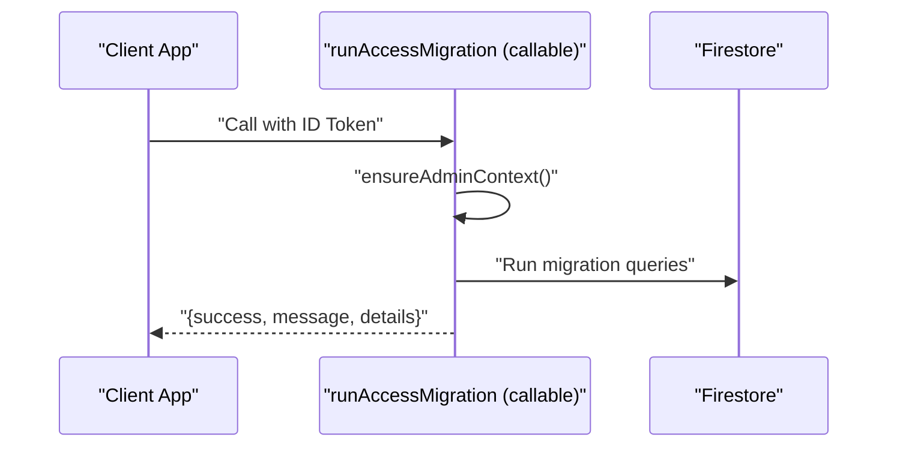
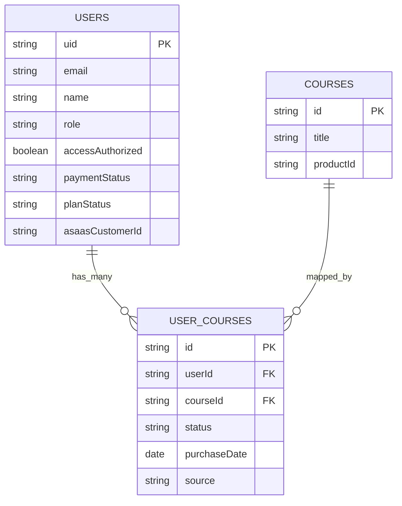
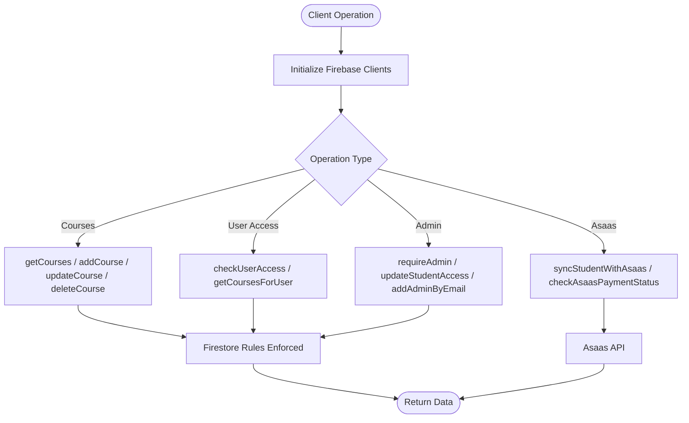
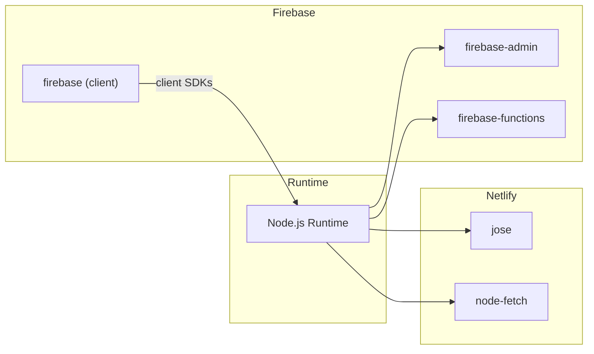

# API Reference

<cite>
**Referenced Files in This Document**
- [functions/src/index.js](file://functions/src/index.js)
- [functions/src/api/updateUserCustomerId.js](file://functions/src/api/updateUserCustomerId.js)
- [netlify/functions/create-asaas-customer.js](file://netlify/functions/create-asaas-customer.js)
- [netlify/functions/process-asaas-payment.js](file://netlify/functions/process-asaas-payment.js)
- [netlify/functions/check-payment-status.js](file://netlify/functions/check-payment-status.js)
- [firebase.json](file://firebase.json)
- [netlify.toml](file://netlify.toml)
- [firestore.rules](file://firestore.rules)
- [lib/firebase.ts](file://lib/firebase.ts)
- [lib/db/index.ts](file://lib/db/index.ts)
- [lib/db/types.ts](file://lib/db/types.ts)
- [lib/db/courses.ts](file://lib/db/courses.ts)
- [lib/db/admin.ts](file://lib/db/admin.ts)
- [functions/package.json](file://functions/package.json)
- [package.json](file://package.json)
</cite>

## Table of Contents
1. [Introduction](#introduction)
2. [Project Structure](#project-structure)
3. [Core Components](#core-components)
4. [Architecture Overview](#architecture-overview)
5. [Detailed Component Analysis](#detailed-component-analysis)
6. [Dependency Analysis](#dependency-analysis)
7. [Performance Considerations](#performance-considerations)
8. [Troubleshooting Guide](#troubleshooting-guide)
9. [Conclusion](#conclusion)
10. [Appendices](#appendices)

## Introduction
This document provides a comprehensive API reference for the serverless functions and database interfaces powering the LMS platform. It covers:
- Firebase Cloud Functions: HTTP-triggered endpoints, callable functions, and webhook handlers
- Netlify Functions: Payment processing, customer management, and payment status checks
- Database interfaces: Firestore collections, security rules, and client-side data access patterns
- Firebase Authentication integration: token verification, custom claims, and role-based access
- Practical usage examples, error handling, rate limiting considerations, security best practices, and API versioning/migration guidance

## Project Structure
The API surface spans two serverless platforms and a Firestore-backed data layer:
- Firebase Cloud Functions: HTTP and callable functions for migrations, webhooks, and user/customer updates
- Netlify Functions: HTTP endpoints for Asaas customer creation, payment processing, and payment status checks
- Firestore: Security rules and client-side data access via typed interfaces

**Diagram sources**
- [functions/src/index.js](file://functions/src/index.js#L144-L387)
- [functions/src/api/updateUserCustomerId.js](file://functions/src/api/updateUserCustomerId.js#L12-L74)
- [netlify/functions/create-asaas-customer.js](file://netlify/functions/create-asaas-customer.js#L20-L146)
- [netlify/functions/process-asaas-payment.js](file://netlify/functions/process-asaas-payment.js#L20-L121)
- [netlify/functions/check-payment-status.js](file://netlify/functions/check-payment-status.js#L20-L152)
- [firestore.rules](file://firestore.rules#L1-L92)

**Section sources**
- [firebase.json](file://firebase.json#L1-L20)
- [netlify.toml](file://netlify.toml#L1-L65)

## Core Components
- Firebase Cloud Functions
  - HTTP-triggered functions: asaasWebhook, updateUserCustomerId
  - Callable function: runAccessMigration
- Netlify Functions
  - create-asaas-customer: creates a customer in Asaas after validating Firebase tokens
  - process-asaas-payment: proxies payment creation to Asaas
  - check-payment-status: verifies active payments for a customer
- Firestore
  - Security rules enforcing authentication, ownership, and admin-only writes
  - Typed client interfaces for courses, admin operations, and subscriptions

**Section sources**
- [functions/src/index.js](file://functions/src/index.js#L144-L387)
- [functions/src/api/updateUserCustomerId.js](file://functions/src/api/updateUserCustomerId.js#L12-L74)
- [netlify/functions/create-asaas-customer.js](file://netlify/functions/create-asaas-customer.js#L20-L146)
- [netlify/functions/process-asaas-payment.js](file://netlify/functions/process-asaas-payment.js#L20-L121)
- [netlify/functions/check-payment-status.js](file://netlify/functions/check-payment-status.js#L20-L152)
- [firestore.rules](file://firestore.rules#L1-L92)
- [lib/db/index.ts](file://lib/db/index.ts#L1-L38)

## Architecture Overview
The system integrates Firebase Authentication, Cloud Functions, Netlify Functions, and Firestore with Asaas for payment orchestration.

**Diagram sources**
- [functions/src/index.js](file://functions/src/index.js#L144-L387)
- [functions/src/api/updateUserCustomerId.js](file://functions/src/api/updateUserCustomerId.js#L12-L74)
- [netlify/functions/create-asaas-customer.js](file://netlify/functions/create-asaas-customer.js#L20-L146)
- [netlify/functions/process-asaas-payment.js](file://netlify/functions/process-asaas-payment.js#L20-L121)
- [netlify/functions/check-payment-status.js](file://netlify/functions/check-payment-status.js#L20-L152)

## Detailed Component Analysis

### Firebase Cloud Functions

#### asaasWebhook (HTTP)
- Purpose: Receive and validate Asaas webhooks; synchronize user access and course mappings
- Authentication: Validates X-Asaas-Access-Token header against Firebase config value
- Request Methods: POST (preflight handled); OPTIONS returns 204
- Response: 200 on success; 401/405/500 on errors
- Behavior:
  - PAYMENT_RECEIVED/CONFIRMED: create or update user with accessAuthorized and planStatus; optionally map user to course via externalReference
  - PAYMENT_OVERDUE: deactivate course access or global access depending on course-specific mapping and manualAuthorization flag
- CORS: Access-Control-Allow-Origin: *, Access-Control-Allow-Methods: POST, Access-Control-Allow-Headers: Content-Type, X-Asaas-Access-Token

**Diagram sources**
- [functions/src/index.js](file://functions/src/index.js#L144-L339)

**Section sources**
- [functions/src/index.js](file://functions/src/index.js#L144-L180)
- [functions/src/index.js](file://functions/src/index.js#L181-L339)

#### updateUserCustomerId (HTTP)
- Purpose: Update a user’s Asaas customer ID in Firestore
- Authentication: Bearer token verified via Firebase Admin SDK
- Authorization: Users can update their own record; admins can update any record
- Request Body: { userId, customerId }
- Response: 200 on success; 400/401/403/500 on errors

**Diagram sources**
- [functions/src/api/updateUserCustomerId.js](file://functions/src/api/updateUserCustomerId.js#L12-L74)

**Section sources**
- [functions/src/api/updateUserCustomerId.js](file://functions/src/api/updateUserCustomerId.js#L12-L74)

#### runAccessMigration (Callable)
- Purpose: Run legacy access migration using Admin SDK (bypasses Firestore client rules)
- Authentication: Firebase callable function requires ID token
- Authorization: Admin-only via ensureAdminContext
- Response: JSON with success message and counts

**Diagram sources**
- [functions/src/index.js](file://functions/src/index.js#L344-L356)

**Section sources**
- [functions/src/index.js](file://functions/src/index.js#L344-L356)

#### runAccessMigrationHttp (HTTP)
- Purpose: HTTP fallback for migration when callable auth fails
- Authentication: Bearer token validated via ensureAdminFromRequest
- Response: JSON with success or error details

**Section sources**
- [functions/src/index.js](file://functions/src/index.js#L358-L387)

### Netlify Functions

#### create-asaas-customer (HTTP)
- Purpose: Create a customer in Asaas after validating Firebase ID token
- Authentication: Bearer token verified using Google JWKS
- Request Body: { name, email, cpfCnpj, phone?, mobilePhone?, address?, addressNumber?, province?, postalCode? }
- Required Fields: name, email, cpfCnpj
- Response: 200 with customerId/customer on success; 400/401/500 on errors
- CORS: Preflight supported

**Section sources**
- [netlify/functions/create-asaas-customer.js](file://netlify/functions/create-asaas-customer.js#L20-L146)

#### process-asaas-payment (HTTP)
- Purpose: Proxy payment creation to Asaas
- Authentication: Bearer token verified using Google JWKS
- Request Body: Asaas payment payload
- Response: 200 with Asaas response; 401/500 on errors
- CORS: Preflight supported

**Section sources**
- [netlify/functions/process-asaas-payment.js](file://netlify/functions/process-asaas-payment.js#L20-L121)

#### check-payment-status (HTTP)
- Purpose: Check if a customer has active/overdue CONFIRMED payments
- Authentication: Bearer token verified using Google JWKS
- Request Body: { customerId }
- Response: 200 with { authorized, status, payments }; 400/401/500 on errors
- CORS: Preflight supported

**Section sources**
- [netlify/functions/check-payment-status.js](file://netlify/functions/check-payment-status.js#L20-L152)

### Database Interfaces

#### Firestore Collections and Security Rules
- Collections:
  - users: user profiles, roles, payment and access flags
  - courses: course catalog
  - mindful_flow: meditative content
  - music: musical content
  - student_completions: completion tracking
  - student_progress: progress per user
  - student_activities: activity logs
  - achievements: achievement records
  - user_courses: mapping of user access to courses
  - adminEmails: pending admin email approvals
- Security Rules:
  - isAuthenticated(), isAdmin(), isOwner() helpers
  - Read/write permissions vary by entity and role
  - Admin-only writes for most entities; authenticated users can read many resources
  - Ownership checks for user-specific documents

**Diagram sources**
- [firestore.rules](file://firestore.rules#L24-L84)
- [lib/db/types.ts](file://lib/db/types.ts#L36-L90)

**Section sources**
- [firestore.rules](file://firestore.rules#L1-L92)
- [lib/db/types.ts](file://lib/db/types.ts#L36-L90)

#### Client-Side Data Access Patterns
- Initialization: Firebase app, auth, Firestore, storage, and functions clients
- Exports: Barrel exports for courses, mindful, music, completions, students, admin, subscriptions, Asaas, user courses, and migration
- Example operations:
  - getCourses(), addCourse(), updateCourse(), deleteCourse()
  - getCoursesForUser(): respects admin privileges and user_course mappings
  - checkUserAccess(): determines authorization based on flags and active course mappings
  - createOrUpdateUser(): initializes user records and assigns roles

**Diagram sources**
- [lib/firebase.ts](file://lib/firebase.ts#L1-L25)
- [lib/db/index.ts](file://lib/db/index.ts#L1-L38)
- [lib/db/courses.ts](file://lib/db/courses.ts#L54-L96)
- [lib/db/admin.ts](file://lib/db/admin.ts#L81-L122)

**Section sources**
- [lib/firebase.ts](file://lib/firebase.ts#L1-L25)
- [lib/db/index.ts](file://lib/db/index.ts#L1-L38)
- [lib/db/courses.ts](file://lib/db/courses.ts#L54-L96)
- [lib/db/admin.ts](file://lib/db/admin.ts#L81-L122)

### Firebase Authentication Integration
- Token Verification:
  - Cloud Functions: verifyIdToken via Firebase Admin SDK
  - Netlify Functions: verify Firebase ID tokens using JWKS from Google securetoken endpoint
- Custom Claims and Roles:
  - Users have a role field in Firestore; helpers determine admin vs student
  - Admin privileges enforced in both Cloud and Netlify functions
- Token Handling:
  - Bearer token in Authorization header
  - Preflight handling for CORS

**Section sources**
- [functions/src/index.js](file://functions/src/index.js#L21-L41)
- [functions/src/api/updateUserCustomerId.js](file://functions/src/api/updateUserCustomerId.js#L28-L60)
- [netlify/functions/create-asaas-customer.js](file://netlify/functions/create-asaas-customer.js#L6-L18)
- [netlify/functions/process-asaas-payment.js](file://netlify/functions/process-asaas-payment.js#L6-L18)
- [netlify/functions/check-payment-status.js](file://netlify/functions/check-payment-status.js#L6-L18)

## Dependency Analysis

**Diagram sources**
- [functions/package.json](file://functions/package.json#L16-L19)
- [package.json](file://package.json#L13-L24)

**Section sources**
- [functions/package.json](file://functions/package.json#L1-L25)
- [package.json](file://package.json#L1-L44)

## Performance Considerations
- Minimize Firestore reads/writes: batch operations where possible; leverage indexes for queries
- Use callable functions for trusted server-side logic to avoid client-side rule bypass attempts
- Cache token verification results when feasible on the client side to reduce repeated JWT verification
- Optimize Asaas API calls: avoid redundant customer creation; reuse customer IDs
- Monitor function cold starts and consider warming strategies for high-priority endpoints

## Troubleshooting Guide
- Authentication Failures
  - Missing or invalid Bearer token: ensure Authorization header is present and valid
  - Token issuer/audience mismatch: verify FIREBASE_PROJECT_ID environment variable
- Webhook Issues
  - Missing X-Asaas-Access-Token or incorrect token: confirm webhook token configuration
  - Event type not handled: log unhandled events for future extension
- Firestore Permission Denied
  - Ensure user has required role or owns the document being accessed
  - Admin-only operations require admin privileges
- Netlify Function Errors
  - Missing required fields in request body
  - Asaas API token not configured
  - Asaas API returned non-OK response; inspect error details and descriptions

**Section sources**
- [functions/src/index.js](file://functions/src/index.js#L160-L179)
- [functions/src/api/updateUserCustomerId.js](file://functions/src/api/updateUserCustomerId.js#L28-L60)
- [netlify/functions/create-asaas-customer.js](file://netlify/functions/create-asaas-customer.js#L64-L86)
- [netlify/functions/process-asaas-payment.js](file://netlify/functions/process-asaas-payment.js#L64-L77)
- [netlify/functions/check-payment-status.js](file://netlify/functions/check-payment-status.js#L64-L86)

## Conclusion
This API reference outlines the serverless function landscape, database interfaces, and authentication mechanisms. By adhering to the documented authentication, authorization, and error-handling patterns, developers can reliably integrate payment workflows, manage user access, and maintain secure data access across Firebase and Netlify environments.

## Appendices

### API Usage Examples
- Create Asaas Customer
  - Method: POST
  - Endpoint: create-asaas-customer
  - Headers: Authorization: Bearer <Firebase ID Token>
  - Body: { name, email, cpfCnpj, phone?, mobilePhone?, address?, addressNumber?, province?, postalCode? }
  - Response: { success, customerId, customer }
- Process Payment
  - Method: POST
  - Endpoint: process-asaas-payment
  - Headers: Authorization: Bearer <Firebase ID Token>
  - Body: Asaas payment payload
  - Response: Asaas payment response
- Check Payment Status
  - Method: POST
  - Endpoint: check-payment-status
  - Headers: Authorization: Bearer <Firebase ID Token>
  - Body: { customerId }
  - Response: { authorized, status, payments }

**Section sources**
- [netlify/functions/create-asaas-customer.js](file://netlify/functions/create-asaas-customer.js#L65-L132)
- [netlify/functions/process-asaas-payment.js](file://netlify/functions/process-asaas-payment.js#L79-L107)
- [netlify/functions/check-payment-status.js](file://netlify/functions/check-payment-status.js#L88-L138)

### Security Best Practices
- Always validate Authorization headers and verify tokens using the appropriate method (Admin SDK or JWKS)
- Enforce CORS preflight handling for all HTTP endpoints
- Restrict write operations to admin-only where applicable
- Log and monitor unauthorized access attempts and webhook token mismatches
- Store secrets in environment variables and avoid embedding them in client code

### Rate Limiting Considerations
- Implement client-side retry with exponential backoff for transient failures
- Use server-side throttling for Asaas API calls to prevent quota exhaustion
- Consider Cloud Functions concurrency limits and adjust as needed

### API Versioning and Migration
- Maintain backward compatibility for client APIs while evolving internal data models
- Use Firestore field defaults and optional fields to support gradual migrations
- Document breaking changes and provide migration scripts (callable functions) for legacy data cleanup