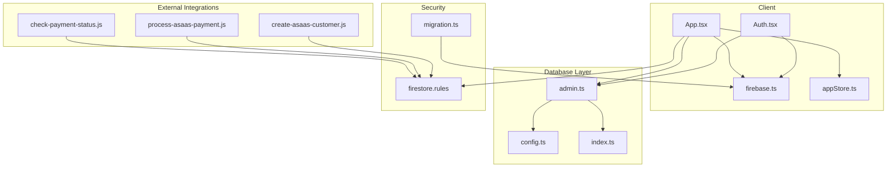
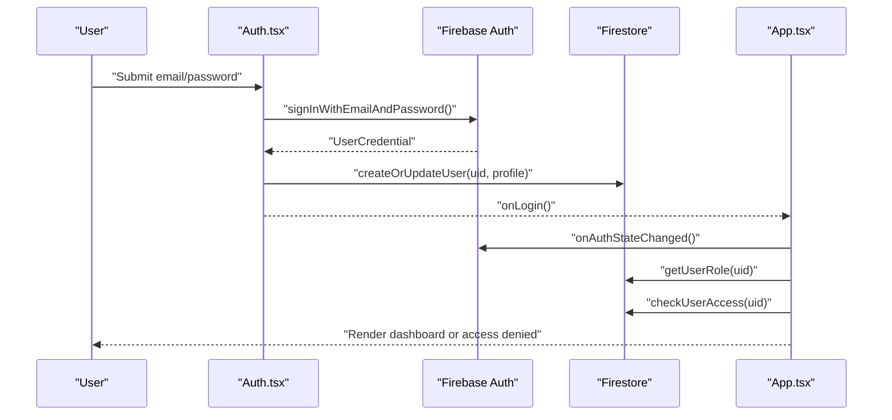
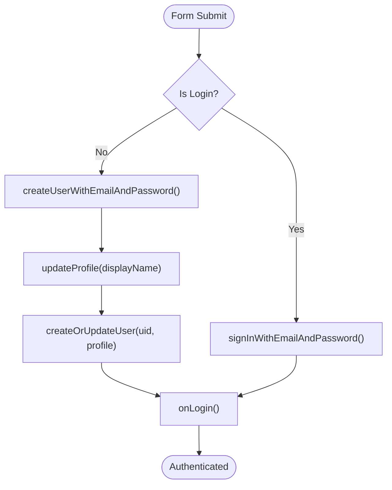
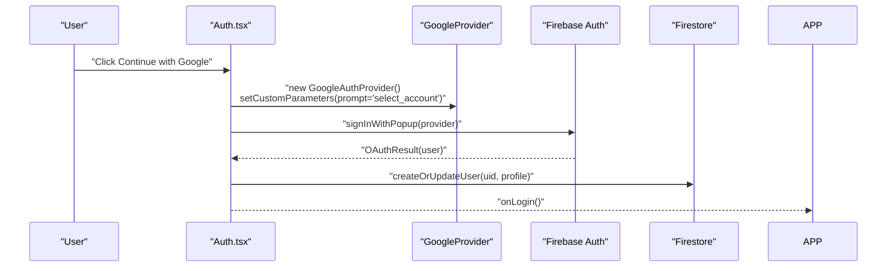
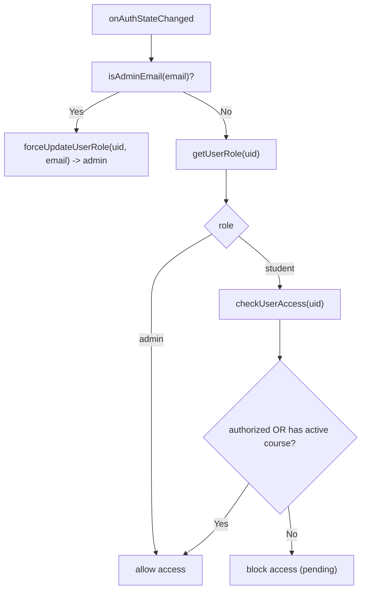
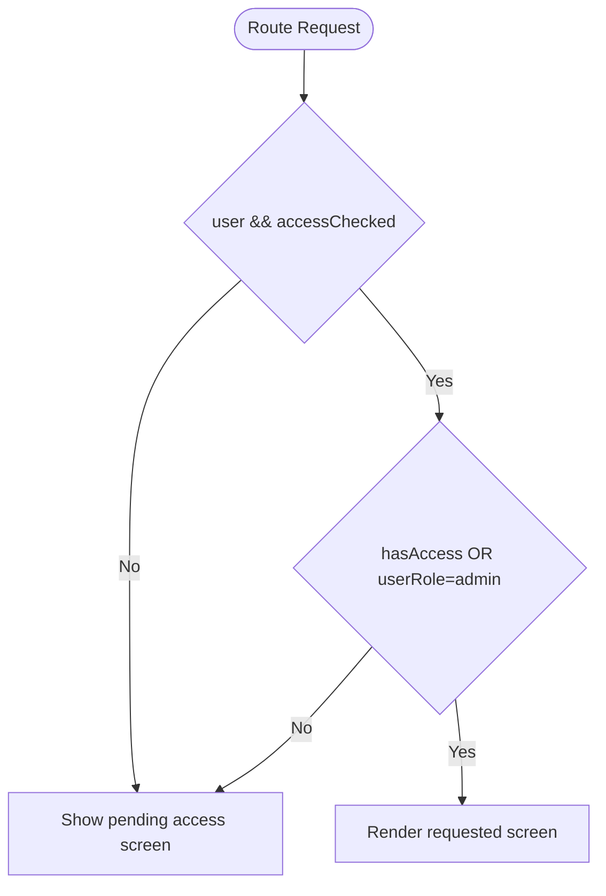
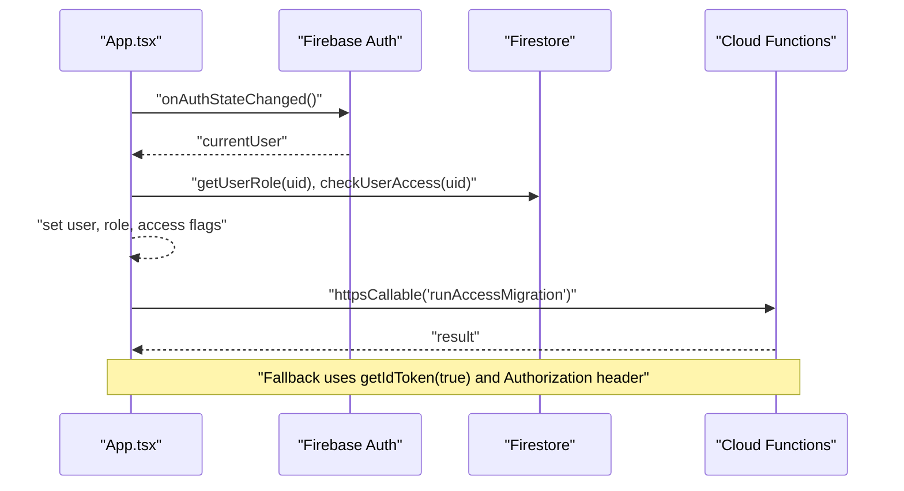
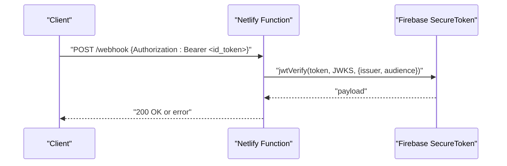
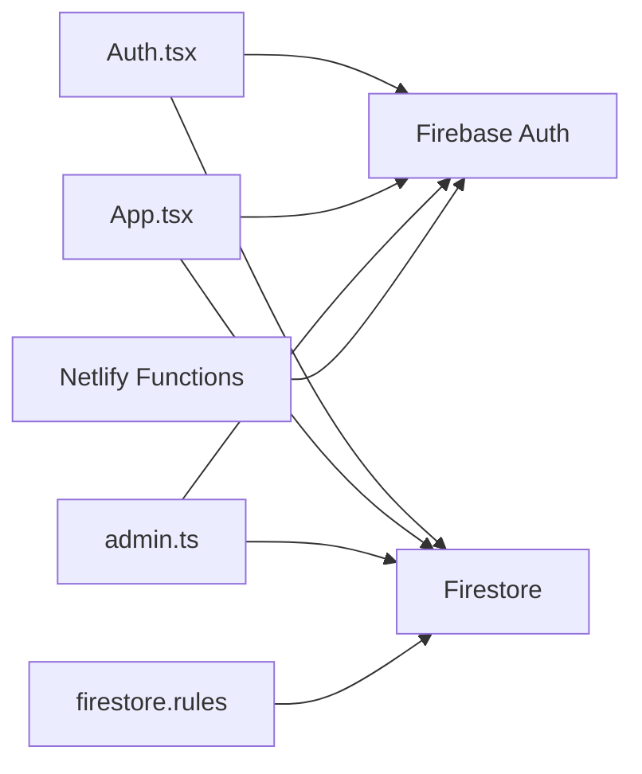

# Authentication API

<cite>
**Referenced Files in This Document**
- [App.tsx](file://App.tsx)
- [Auth.tsx](file://components/Auth.tsx)
- [firebase.ts](file://lib/firebase.ts)
- [admin.ts](file://lib/db/admin.ts)
- [config.ts](file://lib/db/config.ts)
- [appStore.ts](file://lib/stores/appStore.ts)
- [firestore.rules](file://firestore.rules)
- [migration.ts](file://lib/db/migration.ts)
- [index.ts](file://lib/db/index.ts)
- [check-payment-status.js](file://netlify/functions/check-payment-status.js)
- [process-asaas-payment.js](file://netlify/functions/process-asaas-payment.js)
- [create-asaas-customer.js](file://netlify/functions/create-asaas-customer.js)
</cite>

## Table of Contents
1. [Introduction](#introduction)
2. [Project Structure](#project-structure)
3. [Core Components](#core-components)
4. [Architecture Overview](#architecture-overview)
5. [Detailed Component Analysis](#detailed-component-analysis)
6. [Dependency Analysis](#dependency-analysis)
7. [Performance Considerations](#performance-considerations)
8. [Troubleshooting Guide](#troubleshooting-guide)
9. [Conclusion](#conclusion)

## Introduction
This document describes the Firebase Authentication integration and custom claims management for role-based access control (RBAC) in the application. It covers the authentication flows for email/password and Google OAuth, token handling and session lifecycle, and how roles (admin vs student) and access authorization are enforced both in the client and Firestore security rules. It also documents protected route behavior, role-based UI rendering, and guards that prevent unauthorized access.

## Project Structure
The authentication system spans several layers:
- Client-side initialization and auth state management
- UI components for login and registration
- Database helpers for user creation, role retrieval, and access checks
- Centralized admin configuration and RBAC enforcement
- Firestore security rules enforcing access policies
- Netlify functions verifying Firebase ID tokens for external integrations

**Diagram sources**
- [App.tsx](file://App.tsx#L25-L108)
- [Auth.tsx](file://components/Auth.tsx#L1-L265)
- [firebase.ts](file://lib/firebase.ts#L1-L25)
- [admin.ts](file://lib/db/admin.ts#L1-L307)
- [config.ts](file://lib/db/config.ts#L1-L19)
- [appStore.ts](file://lib/stores/appStore.ts#L1-L82)
- [firestore.rules](file://firestore.rules#L1-L97)
- [migration.ts](file://lib/db/migration.ts#L1-L64)
- [index.ts](file://lib/db/index.ts#L1-L38)
- [check-payment-status.js](file://netlify/functions/check-payment-status.js#L1-L44)
- [process-asaas-payment.js](file://netlify/functions/process-asaas-payment.js#L1-L44)
- [create-asaas-customer.js](file://netlify/functions/create-asaas-customer.js#L1-L43)

**Section sources**
- [App.tsx](file://App.tsx#L25-L108)
- [Auth.tsx](file://components/Auth.tsx#L1-L265)
- [firebase.ts](file://lib/firebase.ts#L1-L25)
- [admin.ts](file://lib/db/admin.ts#L1-L307)
- [config.ts](file://lib/db/config.ts#L1-L19)
- [appStore.ts](file://lib/stores/appStore.ts#L1-L82)
- [firestore.rules](file://firestore.rules#L1-L97)
- [migration.ts](file://lib/db/migration.ts#L1-L64)
- [index.ts](file://lib/db/index.ts#L1-L38)

## Core Components
- Firebase initialization and clients: Provides auth, Firestore, Storage, and Cloud Functions clients.
- Auth UI component: Handles email/password and Google OAuth login, displays localized errors, and creates user profiles in Firestore.
- App shell: Listens to auth state changes, loads user role and access status, enforces access control, and routes accordingly.
- Admin helpers: Create/update users, resolve roles, enforce admin-only operations, and manage access flags.
- Store: Centralizes user state, role, access flags, and navigation state.
- Firestore rules: Enforce authenticated access, ownership, and admin-only writes.
- Migration helper: Calls Cloud Functions with ID tokens or falls back to HTTP endpoint verification.

**Section sources**
- [firebase.ts](file://lib/firebase.ts#L1-L25)
- [Auth.tsx](file://components/Auth.tsx#L1-L265)
- [App.tsx](file://App.tsx#L65-L108)
- [admin.ts](file://lib/db/admin.ts#L24-L165)
- [appStore.ts](file://lib/stores/appStore.ts#L1-L82)
- [firestore.rules](file://firestore.rules#L1-L97)
- [migration.ts](file://lib/db/migration.ts#L1-L64)

## Architecture Overview
The authentication architecture integrates Firebase Authentication with Firestore-backed user roles and access flags. The client subscribes to auth state, resolves role and access, and enforces UI and routing guards. Firestore rules complement client-side checks to ensure server-side enforcement.

**Diagram sources**
- [Auth.tsx](file://components/Auth.tsx#L21-L60)
- [admin.ts](file://lib/db/admin.ts#L24-L83)
- [App.tsx](file://App.tsx#L65-L108)

## Detailed Component Analysis

### Firebase Initialization
- Initializes Firebase app and exports auth, Firestore, Storage, and Functions clients.
- Firestore is configured with persistent local cache and multi-tab support.

**Section sources**
- [firebase.ts](file://lib/firebase.ts#L1-L25)

### Email/Password Authentication Flow
- Validates form inputs and calls Firebase to sign in or sign up.
- On sign-up, optionally updates display name and creates/updates user record in Firestore with role derived from email.
- Displays localized error messages mapped from Firebase error codes.

**Diagram sources**
- [Auth.tsx](file://components/Auth.tsx#L21-L60)
- [admin.ts](file://lib/db/admin.ts#L24-L64)

**Section sources**
- [Auth.tsx](file://components/Auth.tsx#L21-L60)
- [admin.ts](file://lib/db/admin.ts#L24-L64)

### Google OAuth Flow
- Uses popup-based Google sign-in with custom parameters.
- Creates or updates user record in Firestore after successful sign-in.
- Displays user-friendly errors for blocked or canceled popups.

**Diagram sources**
- [Auth.tsx](file://components/Auth.tsx#L62-L92)
- [admin.ts](file://lib/db/admin.ts#L24-L64)

**Section sources**
- [Auth.tsx](file://components/Auth.tsx#L62-L92)
- [admin.ts](file://lib/db/admin.ts#L24-L64)

### Role-Based Access Control (RBAC)
- Roles are stored in Firestore under the users collection and resolved on auth state change.
- Admins are determined either by Firestore role or by a predefined primary admin email.
- Access checks combine explicit authorization flags and product/course access mapping.

**Diagram sources**
- [App.tsx](file://App.tsx#L65-L108)
- [admin.ts](file://lib/db/admin.ts#L66-L127)
- [config.ts](file://lib/db/config.ts#L1-L19)

**Section sources**
- [App.tsx](file://App.tsx#L65-L108)
- [admin.ts](file://lib/db/admin.ts#L66-L127)
- [config.ts](file://lib/db/config.ts#L1-L19)

### Protected Routes and Guards
- Unauthorized users (non-admins without access) are shown a pending access screen with payment status and guidance.
- Navigation is controlled by the store; admin-only UI toggles are guarded by the store’s view mode logic.

**Diagram sources**
- [App.tsx](file://App.tsx#L171-L238)
- [appStore.ts](file://lib/stores/appStore.ts#L67-L78)

**Section sources**
- [App.tsx](file://App.tsx#L171-L238)
- [appStore.ts](file://lib/stores/appStore.ts#L67-L78)

### Token Handling and Session Management
- Auth state subscription drives role and access resolution.
- ID token refresh is implicitly handled by Firebase; migration helper demonstrates explicit refresh and HTTP fallback verification.

**Diagram sources**
- [App.tsx](file://App.tsx#L65-L108)
- [migration.ts](file://lib/db/migration.ts#L4-L63)

**Section sources**
- [App.tsx](file://App.tsx#L65-L108)
- [migration.ts](file://lib/db/migration.ts#L4-L63)

### External Integration Token Verification
- Netlify functions verify Firebase ID tokens using JWKS and standard claims (issuer, audience).
- Functions accept Authorization headers and return CORS-compliant responses.

**Diagram sources**
- [check-payment-status.js](file://netlify/functions/check-payment-status.js#L6-L18)
- [process-asaas-payment.js](file://netlify/functions/process-asaas-payment.js#L6-L18)
- [create-asaas-customer.js](file://netlify/functions/create-asaas-customer.js#L6-L18)

**Section sources**
- [check-payment-status.js](file://netlify/functions/check-payment-status.js#L1-L44)
- [process-asaas-payment.js](file://netlify/functions/process-asaas-payment.js#L1-L44)
- [create-asaas-customer.js](file://netlify/functions/create-asaas-customer.js#L1-L43)

## Dependency Analysis
- Client depends on Firebase SDK for auth and Firestore for user data.
- Admin helpers depend on Firestore and the auth client to enforce admin-only operations.
- Firestore rules depend on user documents for role and access decisions.
- Netlify functions depend on Firebase token verification libraries.

**Diagram sources**
- [Auth.tsx](file://components/Auth.tsx#L1-L265)
- [App.tsx](file://App.tsx#L25-L108)
- [admin.ts](file://lib/db/admin.ts#L1-L307)
- [firestore.rules](file://firestore.rules#L1-L97)
- [check-payment-status.js](file://netlify/functions/check-payment-status.js#L1-L44)

**Section sources**
- [Auth.tsx](file://components/Auth.tsx#L1-L265)
- [App.tsx](file://App.tsx#L25-L108)
- [admin.ts](file://lib/db/admin.ts#L1-L307)
- [firestore.rules](file://firestore.rules#L1-L97)
- [check-payment-status.js](file://netlify/functions/check-payment-status.js#L1-L44)

## Performance Considerations
- Auth state subscription runs once and caches role/access per session to avoid redundant network calls.
- Firestore local caching reduces latency for repeated reads during navigation.
- Avoid unnecessary re-renders by using a centralized store for user state and navigation.

## Troubleshooting Guide
Common issues and resolutions:
- Authentication errors: Localized messages are shown for invalid credentials, weak passwords, and duplicate emails.
- Popup blocked/canceled: Guidance is provided when Google OAuth popups are blocked or canceled.
- Access denied: Non-admin users without authorization see a pending screen with payment status and next steps.
- Admin-only operations: Attempts to modify admin lists or access restricted areas trigger permission errors.
- Token verification failures: Netlify functions validate issuer and audience; ensure Authorization headers are present and correct.

**Section sources**
- [Auth.tsx](file://components/Auth.tsx#L45-L91)
- [App.tsx](file://App.tsx#L171-L238)
- [admin.ts](file://lib/db/admin.ts#L7-L22)
- [check-payment-status.js](file://netlify/functions/check-payment-status.js#L43-L44)

## Conclusion
The application implements a robust authentication and RBAC system using Firebase Authentication and Firestore-backed user roles. Client-side guards, store-managed state, and Firestore security rules work together to ensure secure access control. External integrations verify Firebase ID tokens for webhook-style flows. The design balances UX with strong security enforcement across client and server boundaries.