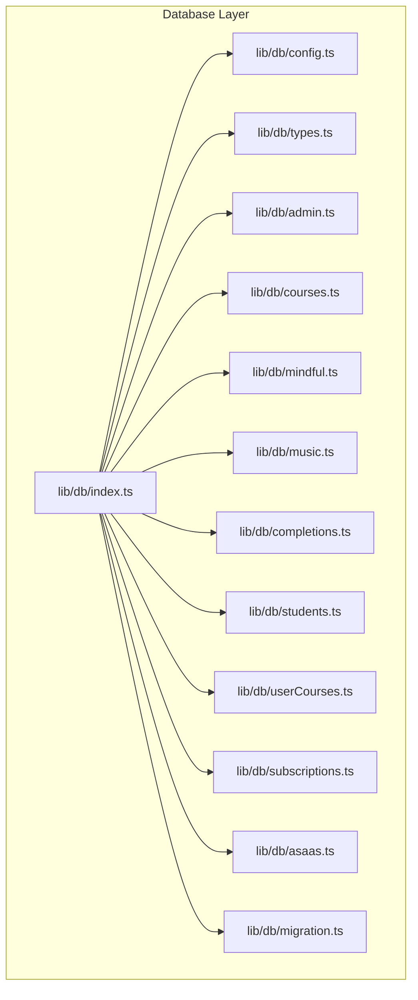
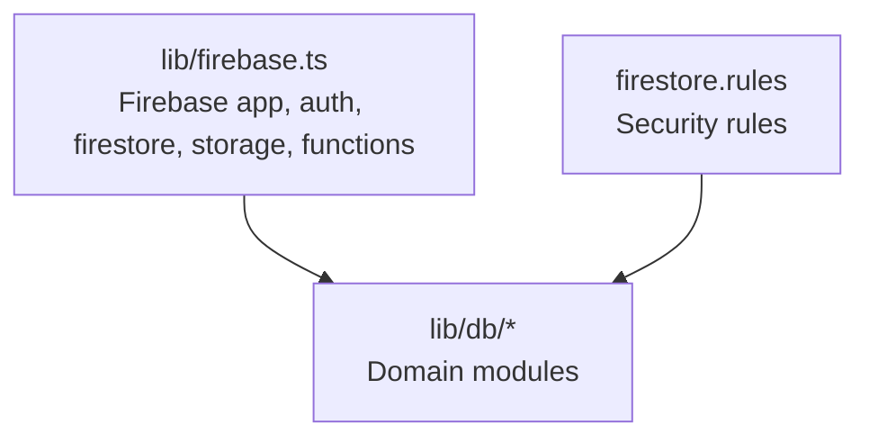
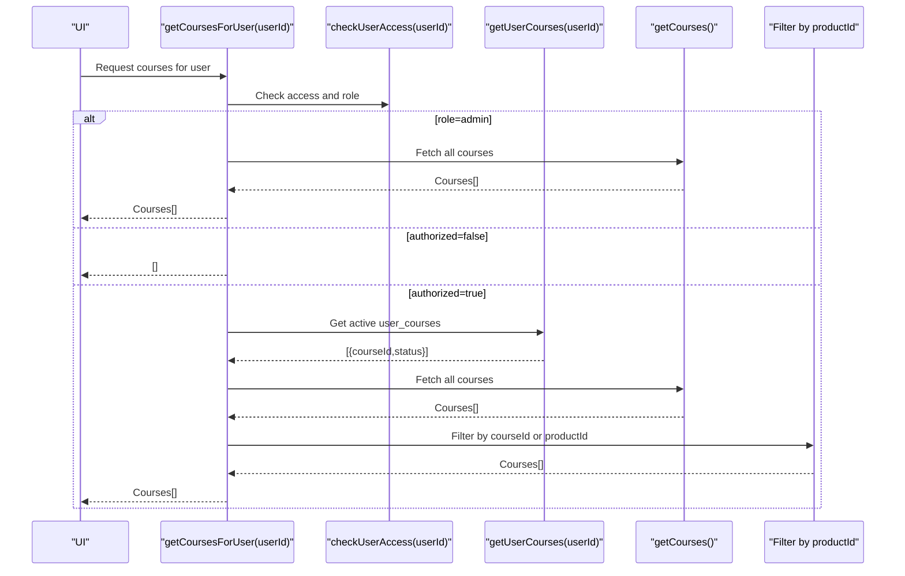
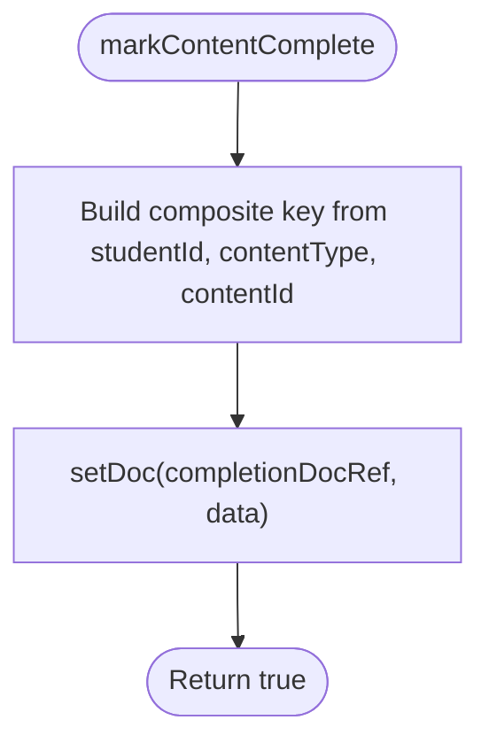
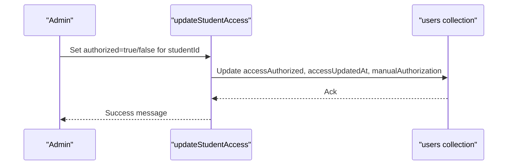
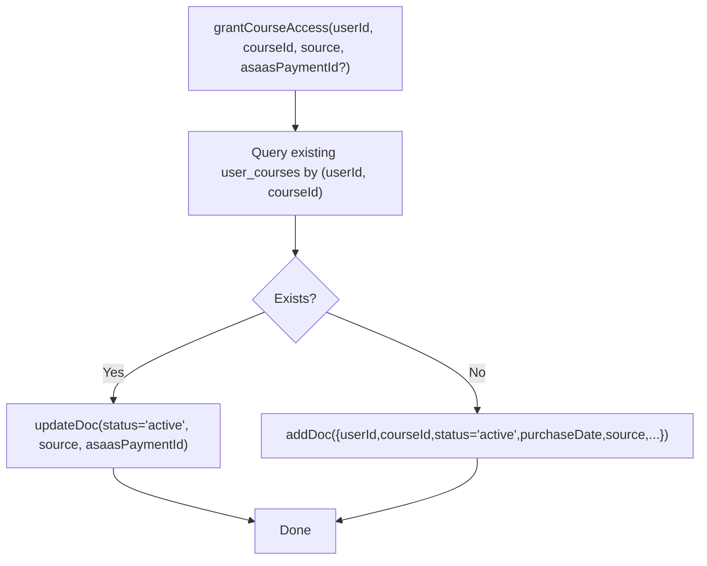
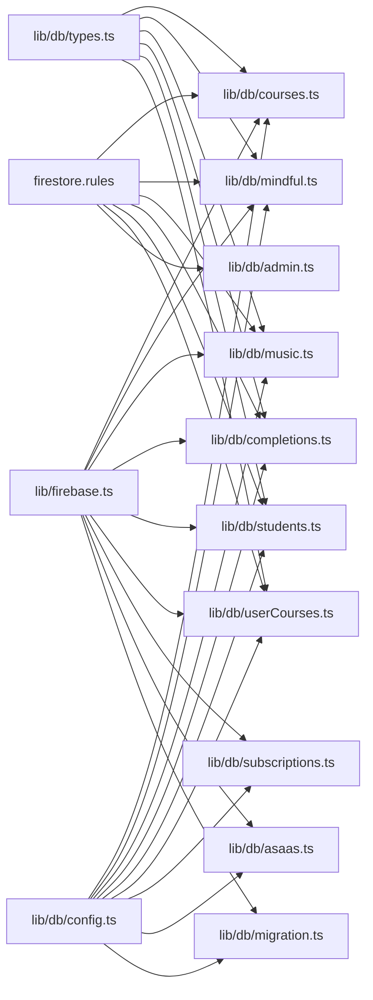

# Database Query API

<cite>
**Referenced Files in This Document**
- [lib/firebase.ts](file://lib/firebase.ts)
- [lib/db/index.ts](file://lib/db/index.ts)
- [lib/db/types.ts](file://lib/db/types.ts)
- [lib/db/config.ts](file://lib/db/config.ts)
- [lib/db/courses.ts](file://lib/db/courses.ts)
- [lib/db/mindful.ts](file://lib/db/mindful.ts)
- [lib/db/music.ts](file://lib/db/music.ts)
- [lib/db/completions.ts](file://lib/db/completions.ts)
- [lib/db/students.ts](file://lib/db/students.ts)
- [lib/db/userCourses.ts](file://lib/db/userCourses.ts)
- [lib/db/admin.ts](file://lib/db/admin.ts)
- [lib/db/subscriptions.ts](file://lib/db/subscriptions.ts)
- [lib/db/asaas.ts](file://lib/db/asaas.ts)
- [lib/db/migration.ts](file://lib/db/migration.ts)
- [firestore.rules](file://firestore.rules)
</cite>

## Table of Contents
1. [Introduction](#introduction)
2. [Project Structure](#project-structure)
3. [Core Components](#core-components)
4. [Architecture Overview](#architecture-overview)
5. [Detailed Component Analysis](#detailed-component-analysis)
6. [Dependency Analysis](#dependency-analysis)
7. [Performance Considerations](#performance-considerations)
8. [Troubleshooting Guide](#troubleshooting-guide)
9. [Conclusion](#conclusion)
10. [Appendices](#appendices)

## Introduction
This document describes the Firestore database query interfaces and data access patterns used by the application. It covers collection schemas, query patterns for course catalog filtering, user progress tracking, and content management. It also documents Firestore security rules, access control mechanisms, and data validation patterns. Examples of CRUD operations, complex queries, and data aggregation patterns are included, along with indexing strategies, performance optimization, and data consistency patterns.

## Project Structure
The database layer is organized under a dedicated module that exposes typed APIs for collections and access control. The module exports a barrel index for convenient imports and groups functionality by domain (courses, mindful content, music, completions, students, admin, subscriptions, Asaas integration, and migrations).

**Diagram sources**
- [lib/db/index.ts](file://lib/db/index.ts#L1-L38)
- [lib/db/config.ts](file://lib/db/config.ts#L1-L19)
- [lib/db/types.ts](file://lib/db/types.ts#L1-L90)
- [lib/db/admin.ts](file://lib/db/admin.ts#L1-L307)
- [lib/db/courses.ts](file://lib/db/courses.ts#L1-L98)
- [lib/db/mindful.ts](file://lib/db/mindful.ts#L1-L93)
- [lib/db/music.ts](file://lib/db/music.ts#L1-L93)
- [lib/db/completions.ts](file://lib/db/completions.ts#L1-L56)
- [lib/db/students.ts](file://lib/db/students.ts#L1-L285)
- [lib/db/userCourses.ts](file://lib/db/userCourses.ts#L1-L112)
- [lib/db/subscriptions.ts](file://lib/db/subscriptions.ts#L1-L93)
- [lib/db/asaas.ts](file://lib/db/asaas.ts#L1-L145)
- [lib/db/migration.ts](file://lib/db/migration.ts#L1-L64)

**Section sources**
- [lib/db/index.ts](file://lib/db/index.ts#L1-L38)

## Core Components
- Firebase initialization and persistence configuration
- Typed models for Course, Lesson, Module, Gallery, UserCourse, StudentCompletion, and Student
- Centralized collection names and admin configuration
- Domain-specific CRUD and query modules for courses, mindful content, music, completions, students, and user-course access
- Admin utilities for access control, role management, and Asaas integration
- Real-time subscriptions for counts and recent completions
- Asaas payment synchronization helpers
- Access migration orchestration

**Section sources**
- [lib/firebase.ts](file://lib/firebase.ts#L1-L25)
- [lib/db/types.ts](file://lib/db/types.ts#L1-L90)
- [lib/db/config.ts](file://lib/db/config.ts#L1-L19)
- [lib/db/admin.ts](file://lib/db/admin.ts#L1-L307)
- [lib/db/subscriptions.ts](file://lib/db/subscriptions.ts#L1-L93)
- [lib/db/asaas.ts](file://lib/db/asaas.ts#L1-L145)
- [lib/db/migration.ts](file://lib/db/migration.ts#L1-L64)

## Architecture Overview
The database layer builds on Firebase Firestore and enforces access control via Firestore security rules. The client-side modules encapsulate CRUD and query logic, while admin utilities centralize access checks and role management. Real-time subscriptions enable reactive UI updates. Asaas integration synchronizes payment status to drive access control.

**Diagram sources**
- [lib/firebase.ts](file://lib/firebase.ts#L1-L25)
- [firestore.rules](file://firestore.rules#L1-L97)
- [lib/db/index.ts](file://lib/db/index.ts#L1-L38)

## Detailed Component Analysis

### Collection Schemas and Field Definitions
- users
  - Purpose: Stores user profiles and access control flags
  - Fields: id (doc), name, displayName, email, photoURL, createdAt, lastLogin, role, accessAuthorized, manualAuthorization, paymentStatus, planType, planStatus, planStartDate, planEndDate, planValue, asaasCustomerId, lastAsaasSync
  - Notes: Role determines access; accessAuthorized and paymentStatus drive entitlements
- courses
  - Purpose: Course catalog entries
  - Fields: id (doc), title, author, duration, launchDate, type, progress, thumbnail, description, videoUrl, modules (backward compatibility), galleries, coverImage, productId
  - Notes: productId links content to a course for access control
- mindful_flow
  - Purpose: Mindfulness content catalog
  - Fields: Same as courses; productId used for access control
- music
  - Purpose: Music content catalog
  - Fields: Same as courses; productId used for access control
- student_completions
  - Purpose: Tracks completion state per user and content
  - Fields: studentId, contentId, contentType ('course'|'mindful'|'music'), completed, completedAt
  - Notes: Composite key formed from studentId_contentType_contentId
- user_courses
  - Purpose: Product/course access mapping
  - Fields: id (doc), userId, courseId, status ('active'|'expired'|'pending'), purchaseDate, source ('asaas'|'manual'), asaasPaymentId?
- adminEmails
  - Purpose: Pending admin email approvals
  - Fields: email, addedAt, status

**Section sources**
- [lib/db/types.ts](file://lib/db/types.ts#L1-L90)
- [lib/db/config.ts](file://lib/db/config.ts#L11-L19)
- [firestore.rules](file://firestore.rules#L23-L94)

### Query Patterns and Data Access

#### Course Catalog Filtering
- Public listing: Ordered by title
- User-scoped listing: Admins see all; non-admins filtered by active user_courses assignments; supports productId-based legacy/default mapping

**Diagram sources**
- [lib/db/courses.ts](file://lib/db/courses.ts#L54-L97)
- [lib/db/admin.ts](file://lib/db/admin.ts#L86-L127)
- [lib/db/userCourses.ts](file://lib/db/userCourses.ts#L7-L23)

**Section sources**
- [lib/db/courses.ts](file://lib/db/courses.ts#L1-L98)

#### Mindful Content Access Control
- Similar to courses but scoped to mindful_flow collection

**Section sources**
- [lib/db/mindful.ts](file://lib/db/mindful.ts#L1-L93)

#### Music Content Access Control
- Similar to courses but scoped to music collection

**Section sources**
- [lib/db/music.ts](file://lib/db/music.ts#L1-L93)

#### User Progress Tracking
- Completion records keyed by composite id
- Mark content complete with timestamps

**Diagram sources**
- [lib/db/completions.ts](file://lib/db/completions.ts#L31-L55)

**Section sources**
- [lib/db/completions.ts](file://lib/db/completions.ts#L1-L56)

#### Student Management and Access Control
- CRUD on users (students)
- Access control checks: role-based, accessAuthorized flag, and active user_courses presence
- Payment status synchronization via Asaas

**Diagram sources**
- [lib/db/admin.ts](file://lib/db/admin.ts#L280-L306)

**Section sources**
- [lib/db/students.ts](file://lib/db/students.ts#L1-L285)
- [lib/db/admin.ts](file://lib/db/admin.ts#L86-L127)
- [lib/db/asaas.ts](file://lib/db/asaas.ts#L87-L144)

#### User-Course Access Grants and Checks
- Grant/revoke access with deduplication and status updates
- Check single-course and any-course access

**Diagram sources**
- [lib/db/userCourses.ts](file://lib/db/userCourses.ts#L25-L68)

**Section sources**
- [lib/db/userCourses.ts](file://lib/db/userCourses.ts#L1-L112)

#### Real-Time Subscriptions
- Subscribe to counts and recent completions with joins to users and courses

**Section sources**
- [lib/db/subscriptions.ts](file://lib/db/subscriptions.ts#L1-L93)

### CRUD Operations and Data Aggregation

- Courses
  - Read: getCourses(), getCoursesForUser()
  - Write: addCourse(), updateCourse(), deleteCourse()
- Mindful Flow
  - Read: getMindfulFlows(), getMindfulFlowsForUser()
  - Write: addMindfulFlow(), updateMindfulFlow(), deleteMindfulFlow()
- Music
  - Read: getMusic(), getMusicForUser()
  - Write: addMusic(), updateMusic(), deleteMusic()
- Completions
  - Read: getStudentCompletion()
  - Write: markContentComplete()
- Students
  - Read: getAllStudents(), getStudentsWithAccessControl()
  - Write: addStudent(), updateStudent(), deleteStudent(), findAndMergeStudentByEmail(), exportStudentData(), importStudentData()
- Admin
  - Access control: checkUserAccess(), getUserRole(), forceUpdateUserRole(), addAdminByEmail(), getAdminEmails(), removeAdmin(), updateStudentAccess()
  - User lifecycle: createOrUpdateUser()
- User-Course Access
  - Read: getUserCourses()
  - Write: grantCourseAccess(), revokeCourseAccess()
  - Checks: hasCourseAccess(), hasAnyCourseAccess()
- Subscriptions
  - subscribeToStudents(), subscribeToCourses(), subscribeToRecentCompletions(), subscribeToAllCompletions()
- Asaas Integration
  - syncStudentWithAsaas(), checkAsaasPaymentStatus(), syncAllStudentsWithAsaas()
- Migration
  - runAccessMigration()

**Section sources**
- [lib/db/courses.ts](file://lib/db/courses.ts#L1-L98)
- [lib/db/mindful.ts](file://lib/db/mindful.ts#L1-L93)
- [lib/db/music.ts](file://lib/db/music.ts#L1-L93)
- [lib/db/completions.ts](file://lib/db/completions.ts#L1-L56)
- [lib/db/students.ts](file://lib/db/students.ts#L1-L285)
- [lib/db/admin.ts](file://lib/db/admin.ts#L1-L307)
- [lib/db/userCourses.ts](file://lib/db/userCourses.ts#L1-L112)
- [lib/db/subscriptions.ts](file://lib/db/subscriptions.ts#L1-L93)
- [lib/db/asaas.ts](file://lib/db/asaas.ts#L1-L145)
- [lib/db/migration.ts](file://lib/db/migration.ts#L1-L64)

## Dependency Analysis
The database module depends on Firebase initialization and security rules. Domain modules depend on shared types and configuration constants. Access control is enforced both in code (requireAdmin, checkUserAccess) and in Firestore rules.

**Diagram sources**
- [lib/firebase.ts](file://lib/firebase.ts#L1-L25)
- [firestore.rules](file://firestore.rules#L1-L97)
- [lib/db/config.ts](file://lib/db/config.ts#L1-L19)
- [lib/db/types.ts](file://lib/db/types.ts#L1-L90)
- [lib/db/admin.ts](file://lib/db/admin.ts#L1-L307)
- [lib/db/courses.ts](file://lib/db/courses.ts#L1-L98)
- [lib/db/mindful.ts](file://lib/db/mindful.ts#L1-L93)
- [lib/db/music.ts](file://lib/db/music.ts#L1-L93)
- [lib/db/completions.ts](file://lib/db/completions.ts#L1-L56)
- [lib/db/students.ts](file://lib/db/students.ts#L1-L285)
- [lib/db/userCourses.ts](file://lib/db/userCourses.ts#L1-L112)
- [lib/db/subscriptions.ts](file://lib/db/subscriptions.ts#L1-L93)
- [lib/db/asaas.ts](file://lib/db/asaas.ts#L1-L145)
- [lib/db/migration.ts](file://lib/db/migration.ts#L1-L64)

**Section sources**
- [lib/db/index.ts](file://lib/db/index.ts#L1-L38)

## Performance Considerations
- Indexing strategies
  - courses: title ordering index recommended for getCourses
  - mindful_flow: title ordering index recommended for getMindfulFlows
  - music: title ordering index recommended for getMusic
  - student_completions: composite index on (completed, completedAt desc) for recent completions feed
  - users: ensure indexes on email for findAndMergeStudentByEmail and on role for student queries
  - user_courses: composite index on (userId, status) and (userId, courseId) for access checks and grants
- Query optimization
  - Prefer targeted queries with where clauses (e.g., active status, user id)
  - Use orderBy and limit for paginated feeds
  - Avoid unnecessary client-side sorting when server-side ordering exists
- Caching and persistence
  - Local cache enabled for Firestore with multi-tab manager to reduce bandwidth and improve responsiveness
- Real-time subscriptions
  - Use onSnapshot for reactive updates; unsubscribe appropriately to prevent leaks
- Data consistency
  - Use atomic writes (setDoc/updateDoc) for completion records
  - Use transactions or batched writes for cross-document updates when needed

[No sources needed since this section provides general guidance]

## Troubleshooting Guide
- Authentication and authorization
  - requireAdmin throws if user is not authenticated or lacks admin role
  - checkUserAccess returns authorized based on role, accessAuthorized flag, or active user_courses
- Common errors
  - Permission denied: ensure user has admin role or meets access criteria
  - Unauthenticated: refresh credentials or re-authenticate
  - Not found: verify document ids and collection names
- Debug tips
  - Log returned arrays and sizes for counts and lists
  - Validate productId mapping for legacy content
  - Confirm Asaas customer id exists before checking status

**Section sources**
- [lib/db/admin.ts](file://lib/db/admin.ts#L6-L22)
- [lib/db/admin.ts](file://lib/db/admin.ts#L86-L127)
- [lib/db/students.ts](file://lib/db/students.ts#L111-L144)
- [lib/db/asaas.ts](file://lib/db/asaas.ts#L6-L37)

## Conclusion
The database layer provides a robust, typed, and secure foundation for course catalogs, mindfulness and music content, progress tracking, and access control. Firestore security rules enforce strict access policies, while client-side modules encapsulate query patterns and real-time updates. Proper indexing and caching strategies ensure performance, and clear separation of concerns simplifies maintenance and extension.

[No sources needed since this section summarizes without analyzing specific files]

## Appendices

### Firestore Security Rules Summary
- Authentication helpers: isAuthenticated(), isAdmin(), isOwner(userId)
- Collections and permissions:
  - users: read allowed to authenticated; create/update/delete controlled by isOwner or isAdmin
  - adminEmails: read/write allowed to admins
  - courses, mindful_flow, music: read allowed to authenticated; write allowed to admins
  - student_completions: read allowed to authenticated; create allowed to authenticated; update/delete allowed to admins
  - student_progress: read/write allowed to authenticated owners or admins
  - student_activities: read/write allowed to authenticated owners or admins; create constrained by ownership; update/delete allowed to admins
  - achievements: read allowed to authenticated; write allowed to admins
  - user_courses: read allowed to authenticated owners or admins; create/update allowed to authenticated; delete allowed to admins

**Section sources**
- [firestore.rules](file://firestore.rules#L1-L97)