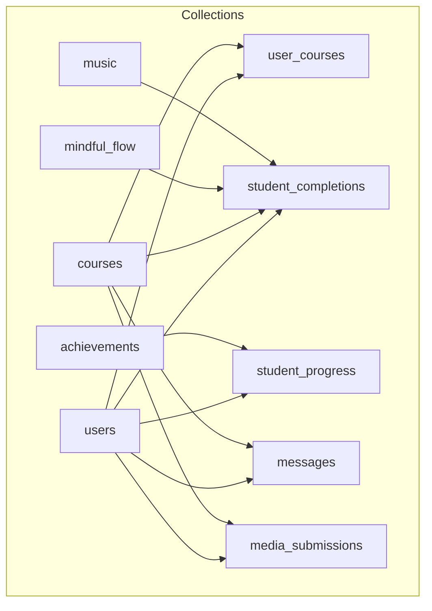
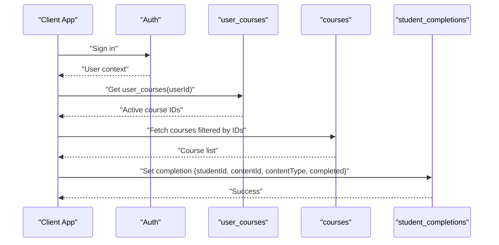
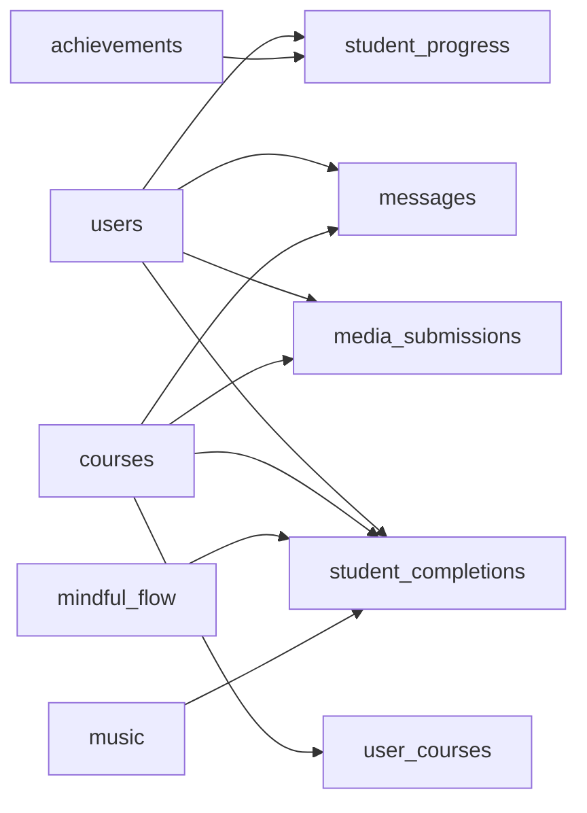

# Firestore Collections

<cite>
**Referenced Files in This Document**
- [firestore.rules](file://firestore.rules)
- [lib/db/types.ts](file://lib/db/types.ts)
- [lib/db/courses.ts](file://lib/db/courses.ts)
- [lib/db/students.ts](file://lib/db/students.ts)
- [lib/db/completions.ts](file://lib/db/completions.ts)
- [lib/db/mindful.ts](file://lib/db/mindful.ts)
- [lib/db/music.ts](file://lib/db/music.ts)
- [lib/db/userCourses.ts](file://lib/db/userCourses.ts)
- [lib/gamification.ts](file://lib/gamification.ts)
- [lib/messages.ts](file://lib/messages.ts)
- [lib/media.ts](file://lib/media.ts)
- [lib/db/config.ts](file://lib/db/config.ts)
- [lib/firebase.ts](file://lib/firebase.ts)
</cite>

## Table of Contents
1. [Introduction](#introduction)
2. [Project Structure](#project-structure)
3. [Core Components](#core-components)
4. [Architecture Overview](#architecture-overview)
5. [Detailed Component Analysis](#detailed-component-analysis)
6. [Dependency Analysis](#dependency-analysis)
7. [Performance Considerations](#performance-considerations)
8. [Troubleshooting Guide](#troubleshooting-guide)
9. [Conclusion](#conclusion)

## Introduction
This document describes the Firestore collection schemas and data models used in Fluentoria. It focuses on the major collections and their relationships, including users, courses, user_courses, mindful_flow, music, completions, and students. It also documents data types, validation rules enforced by Firestore Security Rules, and referential integrity considerations. Indexing requirements are derived from query patterns observed in the client code.

## Project Structure
The Firestore schema is implemented via TypeScript interfaces and enforced by Firestore Security Rules. Client-side code reads and writes to collections using the Firebase SDK. The following diagram shows the primary collections and their relationships.

**Diagram sources**
- [firestore.rules](file://firestore.rules#L23-L89)
- [lib/db/types.ts](file://lib/db/types.ts#L36-L89)
- [lib/db/config.ts](file://lib/db/config.ts#L1-L200)

**Section sources**
- [firestore.rules](file://firestore.rules#L1-L97)
- [lib/db/config.ts](file://lib/db/config.ts#L1-L200)

## Core Components
This section outlines the primary collections, their roles, and the data models used to represent documents.

- users
  - Purpose: Stores user profiles and roles. Used for authentication, authorization, and access control.
  - Key fields (selected): id (documentId), name, email, role, createdAt, displayName, photoURL.
  - Access control: Authenticated users can read; owners can update; admins can manage.
  - Notes: Student financial and payment fields are stored here (planType, planStatus, asaasCustomerId, paymentStatus).

- courses
  - Purpose: Catalog of educational courses. Supports both legacy and new gallery/module structures.
  - Key fields (selected): id (documentId), title, author, duration, type, thumbnail, description, modules, galleries, productId.
  - Access control: Authenticated users can read; admins can write.

- user_courses
  - Purpose: Maps users to courses they are authorized to access. Enables fine-grained access control.
  - Key fields (selected): id (documentId), userId, courseId, status, purchaseDate, source, asaasPaymentId.
  - Access control: Readable by owners or admins; creation/update allowed for authenticated users; deletion requires admin.

- mindful_flow
  - Purpose: Mindfulness content entries.
  - Access control: Authenticated users can read; admins can write.

- music
  - Purpose: Music content entries.
  - Access control: Authenticated users can read; admins can write.

- student_completions
  - Purpose: Tracks completion state per content type for each student.
  - Key fields (selected): id (documentId), studentId, contentId, contentType, completed, completedAt.
  - Access control: Authenticated users can create; admins can read/update/delete.

- student_progress
  - Purpose: Gamification and progress tracking per student.
  - Key fields (selected): id (documentId), studentId, studentName, studentEmail, currentXP, currentLevel, totalCoursesCompleted, totalHoursStudied, currentStreak, longestStreak, unlockedAchievements, rank, lastActivityDate, createdAt, updatedAt.
  - Access control: Owners or admins can read/write; admins can manage.

- achievements
  - Purpose: Defines achievement criteria and rewards.
  - Key fields (selected): id (documentId), title, description, icon, xpReward, condition (type, threshold).
  - Access control: Authenticated users can read; admins can write.

- messages
  - Purpose: Course chat/messages.
  - Key fields (selected): id (documentId), courseId, userId, userName, userEmail, text, timestamp, isInstructor.
  - Access control: Authenticated users can read; admins can manage.

- media_submissions
  - Purpose: Metadata for uploaded media (images, videos, audio, PDFs).
  - Key fields (selected): id (documentId), courseId, studentId, studentName, fileName, fileType, fileUrl, fileSize, uploadedAt, description.
  - Access control: Controlled by client-side logic; typically readable/writable by owners/admins.

**Section sources**
- [firestore.rules](file://firestore.rules#L23-L89)
- [lib/db/types.ts](file://lib/db/types.ts#L36-L89)
- [lib/gamification.ts](file://lib/gamification.ts#L5-L6)

## Architecture Overview
The system uses Firestore collections to model domain entities and enforce access control via Security Rules. Client code interacts with collections through typed interfaces and queries. The following sequence illustrates how a student accesses a course and marks completion.

**Diagram sources**
- [lib/db/courses.ts](file://lib/db/courses.ts#L54-L97)
- [lib/db/completions.ts](file://lib/db/completions.ts#L31-L55)
- [lib/db/userCourses.ts](file://lib/db/userCourses.ts#L1-L200)

## Detailed Component Analysis

### users
- Role and access control
  - Owners can update their profile; admins can manage all users.
  - Read access is restricted to authenticated users.
- Data model highlights
  - Identity: id, name, email, displayName, photoURL.
  - Role: role (student/admin).
  - Audit: createdAt.
  - Financial/Payment: planType, planStatus, planStartDate, planEndDate, planValue, asaasCustomerId, paymentStatus, lastAsaasSync, accessAuthorized, manualAuthorization.
- Referential integrity
  - Used as a parent for student_progress (documentId equals userId).
  - Used as a foreign key in messages (userId), media_submissions (studentId), and student_completions (studentId).

**Section sources**
- [firestore.rules](file://firestore.rules#L23-L29)
- [lib/db/types.ts](file://lib/db/types.ts#L71-L89)
- [lib/db/students.ts](file://lib/db/students.ts#L65-L108)

### courses
- Access control
  - Authenticated users can read; admins can write.
- Data model highlights
  - Content: title, author, duration, type, thumbnail, description, videoUrl, coverImage.
  - Structure: modules (legacy) and galleries/modules (new).
  - Cross-linking: productId can link to a course document for related content (mindful/music).
- Referential integrity
  - Used as a foreign key in user_courses (courseId) and student_completions (contentId when contentType=course).

**Section sources**
- [firestore.rules](file://firestore.rules#L37-L41)
- [lib/db/types.ts](file://lib/db/types.ts#L36-L51)
- [lib/db/courses.ts](file://lib/db/courses.ts#L8-L17)

### user_courses
- Purpose
  - Enforce access control: only active records grant course access.
- Data model highlights
  - Keys: id, userId, courseId.
  - State: status (active/expired/pending), purchaseDate, source (asaas/manual), asaasPaymentId.
- Referential integrity
  - userId references users; courseId references courses.

**Section sources**
- [firestore.rules](file://firestore.rules#L78-L89)
- [lib/db/types.ts](file://lib/db/types.ts#L53-L61)
- [lib/db/userCourses.ts](file://lib/db/userCourses.ts#L1-L200)

### mindful_flow
- Access control
  - Authenticated users can read; admins can write.
- Data model highlights
  - Content entries; cross-linked to courses via productId.

**Section sources**
- [firestore.rules](file://firestore.rules#L43-L47)
- [lib/db/mindful.ts](file://lib/db/mindful.ts#L1-L200)

### music
- Access control
  - Authenticated users can read; admins can write.
- Data model highlights
  - Content entries; cross-linked to courses via productId.

**Section sources**
- [firestore.rules](file://firestore.rules#L49-L53)
- [lib/db/music.ts](file://lib/db/music.ts#L1-L200)

### student_completions
- Purpose
  - Track completion per content type (course, mindful, music) for each student.
- Data model highlights
  - Composite key: studentId_contentType_contentId.
  - Fields: completed, completedAt.
- Referential integrity
  - studentId references users; contentId references courses/mindful_flow/music depending on contentType.

**Section sources**
- [firestore.rules](file://firestore.rules#L55-L60)
- [lib/db/types.ts](file://lib/db/types.ts#L63-L69)
- [lib/db/completions.ts](file://lib/db/completions.ts#L6-L29)

### student_progress
- Purpose
  - Gamification and progress tracking.
- Data model highlights
  - Keys: id equals studentId.
  - Metrics: currentXP, currentLevel, totalCoursesCompleted, totalHoursStudied, currentStreak, longestStreak, unlockedAchievements, rank, lastActivityDate, createdAt, updatedAt.
- Referential integrity
  - Document id equals userId; references achievements by id array.

**Section sources**
- [firestore.rules](file://firestore.rules#L62-L71)
- [lib/db/types.ts](file://lib/db/types.ts#L108-L125)
- [lib/gamification.ts](file://lib/gamification.ts#L43-L98)

### achievements
- Purpose
  - Define achievement criteria and rewards.
- Data model highlights
  - Fields: title, description, icon, xpReward, condition (type, threshold).
- Referential integrity
  - Referenced by student_progress.unlockedAchievements.

**Section sources**
- [firestore.rules](file://firestore.rules#L73-L76)
- [lib/db/types.ts](file://lib/db/types.ts#L95-L106)
- [lib/gamification.ts](file://lib/gamification.ts#L197-L230)

### messages
- Purpose
  - Course chat/messages.
- Data model highlights
  - Fields: courseId, userId, userName, userEmail, text, timestamp, isInstructor.
- Referential integrity
  - userId references users; courseId references courses.

**Section sources**
- [firestore.rules](file://firestore.rules#L1-L97)
- [lib/db/types.ts](file://lib/db/types.ts#L58-L68)
- [lib/messages.ts](file://lib/messages.ts#L7-L32)

### media_submissions
- Purpose
  - Metadata for uploaded media (images, videos, audio, PDFs).
- Data model highlights
  - Fields: courseId, studentId, studentName, fileName, fileType, fileUrl, fileSize, uploadedAt, description.
- Referential integrity
  - studentId references users; courseId references courses.

**Section sources**
- [firestore.rules](file://firestore.rules#L1-L97)
- [lib/db/types.ts](file://lib/db/types.ts#L70-L82)
- [lib/media.ts](file://lib/media.ts#L8-L117)

## Dependency Analysis
The following diagram shows dependencies among collections and how they are queried in client code.

**Diagram sources**
- [lib/db/courses.ts](file://lib/db/courses.ts#L54-L97)
- [lib/db/completions.ts](file://lib/db/completions.ts#L6-L29)
- [lib/db/students.ts](file://lib/db/students.ts#L7-L63)
- [lib/messages.ts](file://lib/messages.ts#L34-L55)
- [lib/media.ts](file://lib/media.ts#L163-L191)
- [lib/gamification.ts](file://lib/gamification.ts#L43-L64)

## Performance Considerations
- Queries and indexes
  - courses: ordered by title; consider an index on title for efficient sorting.
  - messages: filtered by courseId and ordered by timestamp; consider composite index on (courseId, timestamp).
  - media_submissions: filtered by courseId and studentId; consider composite indexes on (courseId, uploadedAt) and (studentId, uploadedAt).
  - student_completions: composite key based on studentId, contentType, contentId; ensure writes are performed with this key format.
  - student_progress: ordered by currentXP for leaderboards; consider an index on currentXP.
- Timestamps
  - Many documents use server-side timestamps; ensure client-side conversion to Date objects where needed.
- Batch operations
  - For bulk updates (e.g., import/export), consider batch writes to reduce latency and improve reliability.

[No sources needed since this section provides general guidance]

## Troubleshooting Guide
- Authentication and authorization
  - Ensure users are authenticated before reading protected collections.
  - Admin-only operations require admin privileges; verify user role and admin email configuration.
- Access control violations
  - If a user cannot read a course, confirm their user_courses record has status active.
  - If a student cannot update their progress, verify ownership or admin role.
- Data consistency
  - student_progress documents use documentId equal to userId; ensure consistency when creating/updating.
  - student_completions uses a composite key; ensure key generation matches the documented format.
- Query errors
  - For messages, ensure courseId is provided and valid.
  - For media_submissions, verify courseId and studentId filters align with uploaded metadata.

**Section sources**
- [firestore.rules](file://firestore.rules#L1-L97)
- [lib/db/courses.ts](file://lib/db/courses.ts#L54-L97)
- [lib/db/completions.ts](file://lib/db/completions.ts#L31-L55)
- [lib/gamification.ts](file://lib/gamification.ts#L43-L98)
- [lib/messages.ts](file://lib/messages.ts#L34-L55)
- [lib/media.ts](file://lib/media.ts#L163-L191)

## Conclusion
Fluentoria’s Firestore schema centers around users, courses, and access control via user_courses, with complementary collections for completions, progress, achievements, messages, and media. Security Rules enforce strict access control, while client code implements query patterns that inform indexing strategies. Adhering to the documented data models and referential integrity rules ensures reliable operation and scalability.