# Query Patterns & Operations

<cite>
**Referenced Files in This Document**
- [lib/firebase.ts](file://lib/firebase.ts)
- [lib/db/index.ts](file://lib/db/index.ts)
- [lib/db/types.ts](file://lib/db/types.ts)
- [lib/db/courses.ts](file://lib/db/courses.ts)
- [lib/db/mindful.ts](file://lib/db/mindful.ts)
- [lib/db/music.ts](file://lib/db/music.ts)
- [lib/db/completions.ts](file://lib/db/completions.ts)
- [lib/db/students.ts](file://lib/db/students.ts)
- [lib/db/admin.ts](file://lib/db/admin.ts)
- [lib/db/subscriptions.ts](file://lib/db/subscriptions.ts)
- [lib/db/userCourses.ts](file://lib/db/userCourses.ts)
- [firestore.rules](file://firestore.rules)
- [firebase.json](file://firebase.json)
</cite>

## Table of Contents
1. [Introduction](#introduction)
2. [Project Structure](#project-structure)
3. [Core Components](#core-components)
4. [Architecture Overview](#architecture-overview)
5. [Detailed Component Analysis](#detailed-component-analysis)
6. [Dependency Analysis](#dependency-analysis)
7. [Performance Considerations](#performance-considerations)
8. [Troubleshooting Guide](#troubleshooting-guide)
9. [Conclusion](#conclusion)
10. [Appendices](#appendices)

## Introduction
This document explains Firestore query patterns and data access operations implemented in the project. It covers CRUD operations across collections, filtering strategies, pagination patterns, complex queries, batch operations, transactions, and real-time subscriptions. It also provides query optimization techniques, performance considerations, and best practices tailored to the application’s data model and security rules.

## Project Structure
The data access layer is organized under lib/db with barrel exports for easy consumption. Collections include courses, mindful flows, music, student completions, users, and user_courses. Security rules enforce access control per collection and per-document.

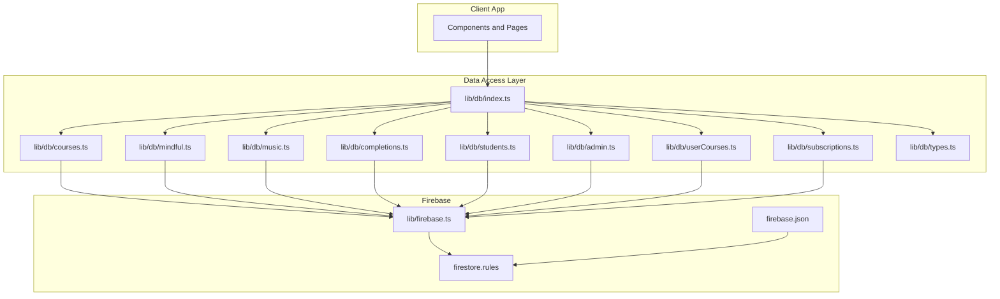

**Diagram sources**
- [lib/db/index.ts](file://lib/db/index.ts#L1-L38)
- [lib/db/courses.ts](file://lib/db/courses.ts#L1-L98)
- [lib/db/mindful.ts](file://lib/db/mindful.ts#L1-L93)
- [lib/db/music.ts](file://lib/db/music.ts#L1-L93)
- [lib/db/completions.ts](file://lib/db/completions.ts#L1-L56)
- [lib/db/students.ts](file://lib/db/students.ts#L1-L285)
- [lib/db/admin.ts](file://lib/db/admin.ts#L1-L307)
- [lib/db/userCourses.ts](file://lib/db/userCourses.ts#L1-L112)
- [lib/db/subscriptions.ts](file://lib/db/subscriptions.ts#L1-L93)
- [lib/db/types.ts](file://lib/db/types.ts#L1-L90)
- [lib/firebase.ts](file://lib/firebase.ts#L1-L25)
- [firestore.rules](file://firestore.rules#L1-L97)
- [firebase.json](file://firebase.json#L1-L20)

**Section sources**
- [lib/db/index.ts](file://lib/db/index.ts#L1-L38)
- [lib/firebase.ts](file://lib/firebase.ts#L1-L25)
- [firestore.rules](file://firestore.rules#L1-L97)
- [firebase.json](file://firebase.json#L1-L20)

## Core Components
- Firebase initialization and persistence configuration
- Collection-specific CRUD and filtered read operations
- Access control helpers and user-role checks
- Real-time subscriptions for counts and recent events
- User-course mapping for access control and content visibility

Key exports and responsibilities:
- Courses: list, create, update, delete, user-scoped filtering
- Mindful flows: list, create, update, delete, user-scoped filtering
- Music: list, create, update, delete, user-scoped filtering
- Student completions: lookup and set completion flags
- Students: list, create, update, delete, import/export, access control
- Admin: role enforcement, user creation/update, access checks, admin management
- User courses: mapping active access per user/course
- Subscriptions: real-time listeners for counts and recent completions

**Section sources**
- [lib/db/index.ts](file://lib/db/index.ts#L1-L38)
- [lib/db/courses.ts](file://lib/db/courses.ts#L1-L98)
- [lib/db/mindful.ts](file://lib/db/mindful.ts#L1-L93)
- [lib/db/music.ts](file://lib/db/music.ts#L1-L93)
- [lib/db/completions.ts](file://lib/db/completions.ts#L1-L56)
- [lib/db/students.ts](file://lib/db/students.ts#L1-L285)
- [lib/db/admin.ts](file://lib/db/admin.ts#L1-L307)
- [lib/db/userCourses.ts](file://lib/db/userCourses.ts#L1-L112)
- [lib/db/subscriptions.ts](file://lib/db/subscriptions.ts#L1-L93)

## Architecture Overview
The client initializes Firestore with local cache and multi-tab persistence. Data access functions encapsulate Firestore operations and apply security checks. Real-time subscriptions stream counts and recent completion events. Security rules govern read/write permissions per collection and per document.

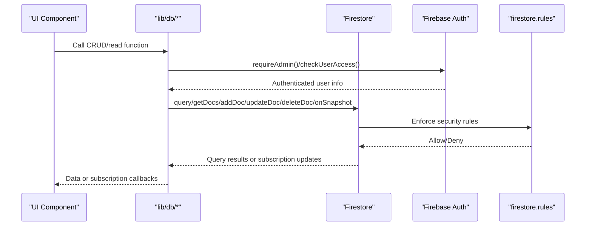

**Diagram sources**
- [lib/firebase.ts](file://lib/firebase.ts#L1-L25)
- [lib/db/admin.ts](file://lib/db/admin.ts#L1-L307)
- [lib/db/subscriptions.ts](file://lib/db/subscriptions.ts#L1-L93)
- [firestore.rules](file://firestore.rules#L1-L97)

## Detailed Component Analysis

### Courses CRUD and Filtering
- Read: List all courses ordered by title
- Write: Admin-only create, update, delete
- Filtered read for users: Combine user access checks with user_courses mapping to return only active course assignments

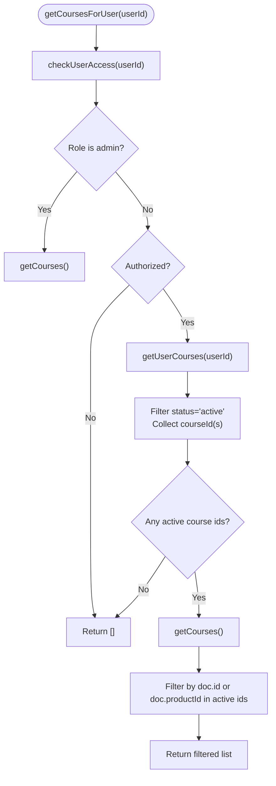

**Diagram sources**
- [lib/db/courses.ts](file://lib/db/courses.ts#L54-L97)
- [lib/db/userCourses.ts](file://lib/db/userCourses.ts#L1-L112)
- [lib/db/admin.ts](file://lib/db/admin.ts#L86-L127)

**Section sources**
- [lib/db/courses.ts](file://lib/db/courses.ts#L1-L98)
- [lib/db/userCourses.ts](file://lib/db/userCourses.ts#L1-L112)
- [lib/db/admin.ts](file://lib/db/admin.ts#L86-L127)

### Mindful Flows CRUD and Filtering
- Read: List all mindful flows ordered by title
- Write: Admin-only create, update, delete
- Filtered read for users: Use productId matching against active user course ids; legacy content falls back to a default product id

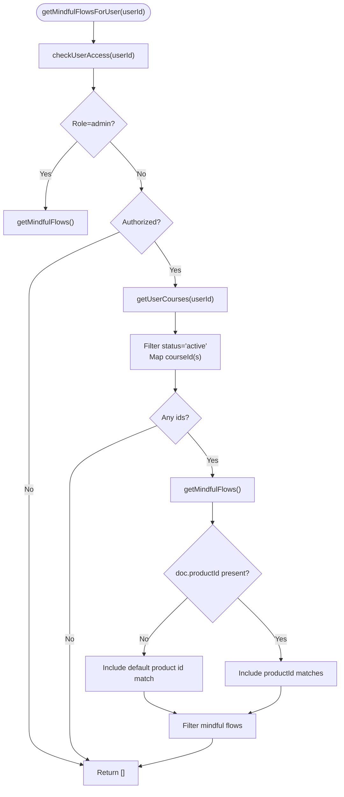

**Diagram sources**
- [lib/db/mindful.ts](file://lib/db/mindful.ts#L54-L92)
- [lib/db/userCourses.ts](file://lib/db/userCourses.ts#L1-L112)
- [lib/db/admin.ts](file://lib/db/admin.ts#L86-L127)

**Section sources**
- [lib/db/mindful.ts](file://lib/db/mindful.ts#L1-L93)
- [lib/db/userCourses.ts](file://lib/db/userCourses.ts#L1-L112)
- [lib/db/admin.ts](file://lib/db/admin.ts#L86-L127)

### Music CRUD and Filtering
- Read: List all music items ordered by title
- Write: Admin-only create, update, delete
- Filtered read for users: Similar productId-based filtering as mindful flows, including default product fallback

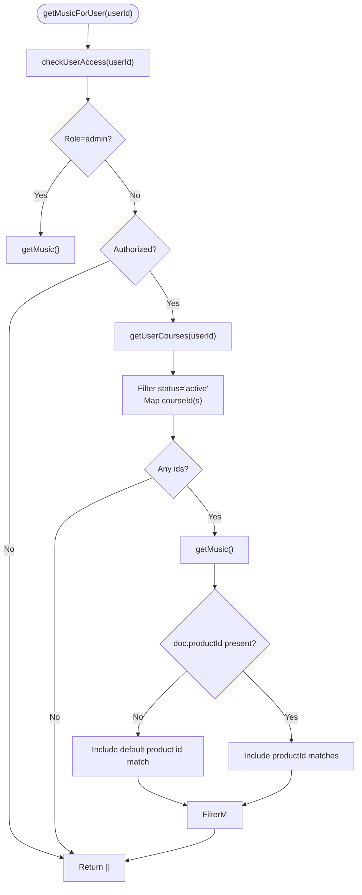

**Diagram sources**
- [lib/db/music.ts](file://lib/db/music.ts#L54-L92)
- [lib/db/userCourses.ts](file://lib/db/userCourses.ts#L1-L112)
- [lib/db/admin.ts](file://lib/db/admin.ts#L86-L127)

**Section sources**
- [lib/db/music.ts](file://lib/db/music.ts#L1-L93)
- [lib/db/userCourses.ts](file://lib/db/userCourses.ts#L1-L112)
- [lib/db/admin.ts](file://lib/db/admin.ts#L86-L127)

### Student Completions: Lookup and Set
- Lookup: Composite key composed from studentId, contentType, and contentId
- Set: Upsert completion flag and timestamp

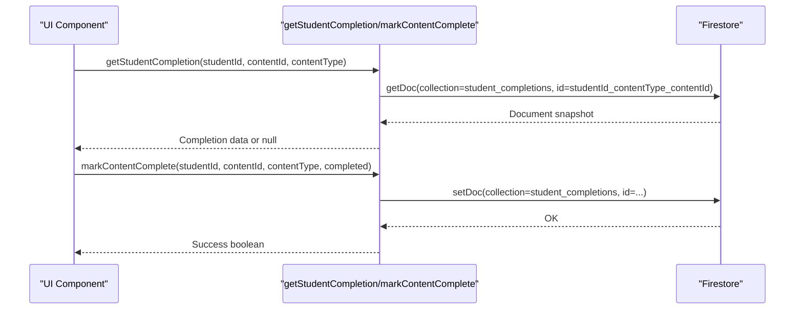

**Diagram sources**
- [lib/db/completions.ts](file://lib/db/completions.ts#L1-L56)

**Section sources**
- [lib/db/completions.ts](file://lib/db/completions.ts#L1-L56)

### Students: CRUD, Search, Import/Export, Access Control
- Read: Admin-only listing with client-side sorting
- Write: Admin-only create, update, delete
- Search/Merge: Find by email and merge Google user data
- Import/Export: CSV import/export with parsing and upsert logic
- Access control: Retrieve access flags and payment status for admin dashboards

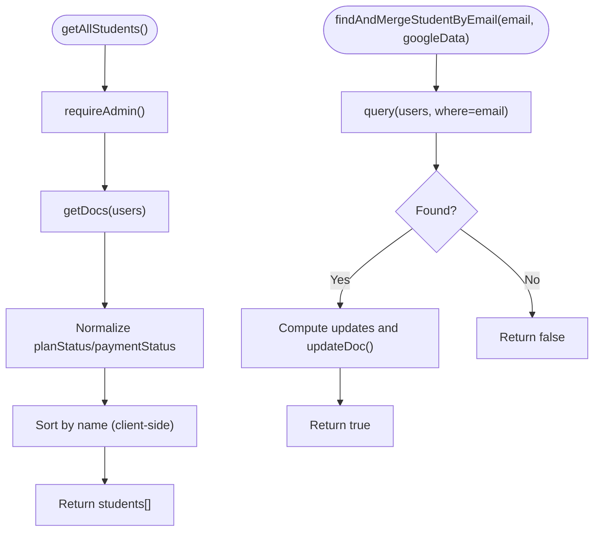

**Diagram sources**
- [lib/db/students.ts](file://lib/db/students.ts#L1-L285)
- [lib/db/admin.ts](file://lib/db/admin.ts#L1-L307)

**Section sources**
- [lib/db/students.ts](file://lib/db/students.ts#L1-L285)
- [lib/db/admin.ts](file://lib/db/admin.ts#L1-L307)

### Admin: Role Enforcement and Access Checks
- Enforce admin: Primary admin bypass and DB role check
- User creation/update: Merge with existing student records, set roles and defaults
- Access checks: Admins always authorized; students authorized via explicit flag or active user_courses entries
- Admin management: Promote/remove admins, maintain admin email lists

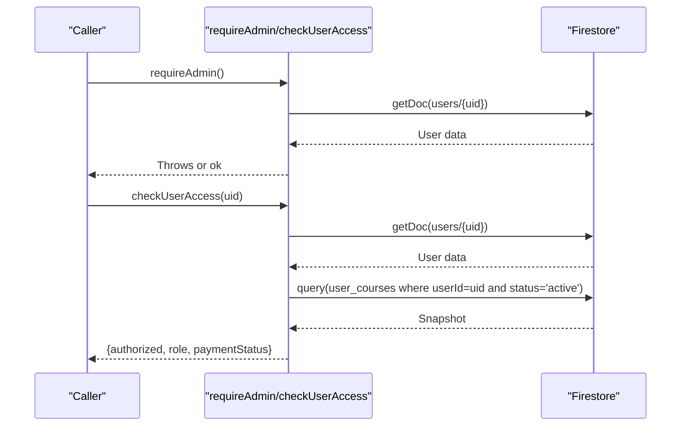

**Diagram sources**
- [lib/db/admin.ts](file://lib/db/admin.ts#L1-L307)

**Section sources**
- [lib/db/admin.ts](file://lib/db/admin.ts#L1-L307)

### User Courses: Access Mapping
- Read: List a user’s course access records
- Grant: Create or update active access with source and optional payment id
- Revoke: Delete the access record
- Checks: Has any course access and has specific course access

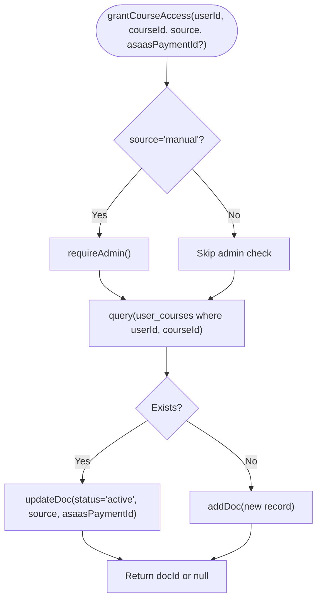

**Diagram sources**
- [lib/db/userCourses.ts](file://lib/db/userCourses.ts#L1-L112)
- [lib/db/admin.ts](file://lib/db/admin.ts#L1-L307)

**Section sources**
- [lib/db/userCourses.ts](file://lib/db/userCourses.ts#L1-L112)
- [lib/db/admin.ts](file://lib/db/admin.ts#L1-L307)

### Real-Time Subscriptions
- Counts: Subscribe to total number of students and courses
- Recent completions: Subscribe to recent completion events with student and content metadata resolution

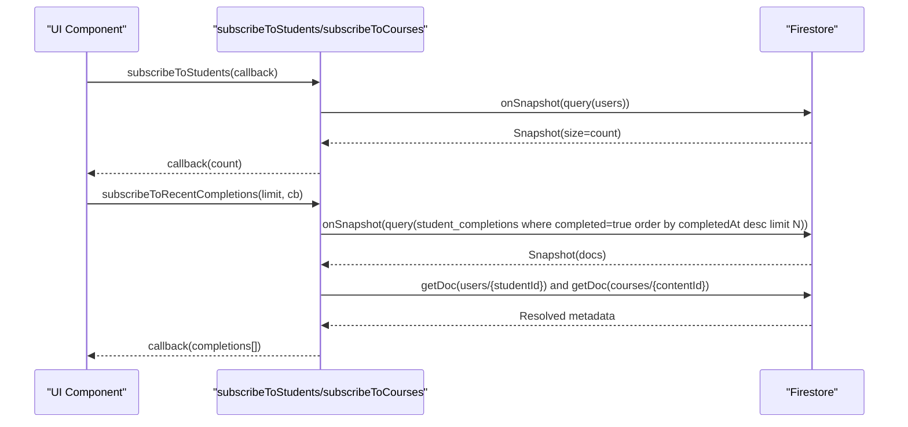

**Diagram sources**
- [lib/db/subscriptions.ts](file://lib/db/subscriptions.ts#L1-L93)

**Section sources**
- [lib/db/subscriptions.ts](file://lib/db/subscriptions.ts#L1-L93)

## Dependency Analysis
- Data model types shared across modules
- All CRUD modules depend on Firebase initialization and security helpers
- User-scoped reads depend on user_courses mapping and access checks
- Subscriptions depend on query composition with filters and ordering

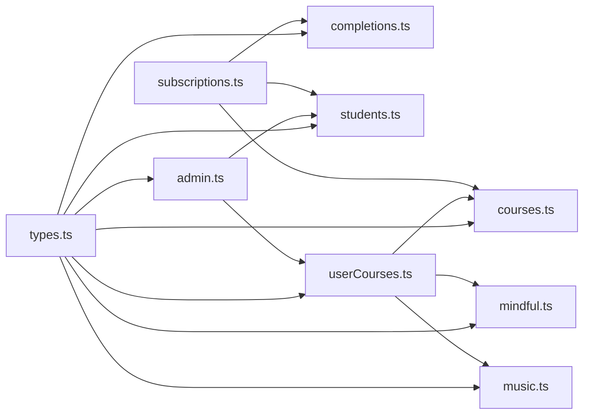

**Diagram sources**
- [lib/db/types.ts](file://lib/db/types.ts#L1-L90)
- [lib/db/courses.ts](file://lib/db/courses.ts#L1-L98)
- [lib/db/mindful.ts](file://lib/db/mindful.ts#L1-L93)
- [lib/db/music.ts](file://lib/db/music.ts#L1-L93)
- [lib/db/completions.ts](file://lib/db/completions.ts#L1-L56)
- [lib/db/students.ts](file://lib/db/students.ts#L1-L285)
- [lib/db/userCourses.ts](file://lib/db/userCourses.ts#L1-L112)
- [lib/db/admin.ts](file://lib/db/admin.ts#L1-L307)
- [lib/db/subscriptions.ts](file://lib/db/subscriptions.ts#L1-L93)

**Section sources**
- [lib/db/types.ts](file://lib/db/types.ts#L1-L90)
- [lib/db/courses.ts](file://lib/db/courses.ts#L1-L98)
- [lib/db/mindful.ts](file://lib/db/mindful.ts#L1-L93)
- [lib/db/music.ts](file://lib/db/music.ts#L1-L93)
- [lib/db/completions.ts](file://lib/db/completions.ts#L1-L56)
- [lib/db/students.ts](file://lib/db/students.ts#L1-L285)
- [lib/db/userCourses.ts](file://lib/db/userCourses.ts#L1-L112)
- [lib/db/admin.ts](file://lib/db/admin.ts#L1-L307)
- [lib/db/subscriptions.ts](file://lib/db/subscriptions.ts#L1-L93)

## Performance Considerations
- Indexes and composite indexes
  - Courses, mindful flows, music: queries order by title; ensure an index on title for efficient ordering
  - Student completions: queries filter by completed and order by completedAt desc; ensure a compound index on (completed, completedAt desc)
  - Students: queries filter by role; ensure an index on role
  - User courses: queries filter by userId and optionally courseId; ensure compound indexes on (userId) and (userId, courseId)
- Client-side vs server-side sorting
  - getAllStudents sorts client-side; consider adding an index on name to offload sorting to the backend
- Real-time listeners
  - onSnapshot listeners automatically leverage local cache; keep listeners scoped to minimize bandwidth and CPU
- Batch writes and transactions
  - Use writeBatch for multiple related updates; use runTransaction for atomic reads-modify-writes
- Pagination
  - Use limit and cursor-based pagination for large datasets; combine with orderBy for stable cursors
- Filtering strategies
  - Prefer single-field equality filters where possible; combine with orderBy for index usage
  - Use array-contains/array-contains-any on indexed arrays for membership checks
- Caching and persistence
  - Local cache and multi-tab manager reduce cold-start latency and improve reliability across tabs

[No sources needed since this section provides general guidance]

## Troubleshooting Guide
- Authentication and authorization errors
  - requireAdmin throws when unauthenticated or insufficient role
  - checkUserAccess returns authorized=false if neither accessAuthorized nor active user_courses exist
- Permission denied by rules
  - Ensure documents are created under correct collections and adhere to read/write rules
  - Admin-only operations must originate from authenticated admin accounts
- Query errors and missing data
  - Verify indexes exist for queries with where + orderBy combinations
  - Confirm collection names match constants used in queries
- Real-time listener issues
  - onSnapshot handlers receive an error callback; log and handle gracefully
  - Ensure subscriptions are unsubscribed when components unmount to prevent leaks

**Section sources**
- [lib/db/admin.ts](file://lib/db/admin.ts#L1-L307)
- [lib/db/subscriptions.ts](file://lib/db/subscriptions.ts#L1-L93)
- [firestore.rules](file://firestore.rules#L1-L97)

## Conclusion
The project implements a clear separation of concerns around Firestore data access, with strong security enforced by rules and helper functions. CRUD operations are collection-focused, with user-scoped filtering built on access control and user_courses mappings. Real-time subscriptions enable responsive dashboards, while the codebase demonstrates practical patterns for filtering, pagination, and performance-conscious querying. Adopting recommended indexing and batching strategies will further enhance responsiveness and scalability.

[No sources needed since this section summarizes without analyzing specific files]

## Appendices

### CRUD Reference by Collection
- Courses
  - Read: list ordered by title
  - Write: admin-only create/update/delete
  - Filtered read: user-scoped via access checks and user_courses
- Mindful flows
  - Read: list ordered by title
  - Write: admin-only create/update/delete
  - Filtered read: user-scoped via productId and user_courses
- Music
  - Read: list ordered by title
  - Write: admin-only create/update/delete
  - Filtered read: user-scoped via productId and user_courses
- Student completions
  - Read: lookup by composite key
  - Write: upsert completion flag and timestamp
- Students
  - Read: admin-only list with client-side sort
  - Write: admin-only create/update/delete
  - Search/Merge: find by email and merge profile
  - Import/Export: CSV-based bulk operations
- User courses
  - Read: list user’s access records
  - Write: grant/revoke access with status and source
  - Checks: has any or specific course access
- Admin
  - Enforce admin, create/update user, check access, manage admins

**Section sources**
- [lib/db/courses.ts](file://lib/db/courses.ts#L1-L98)
- [lib/db/mindful.ts](file://lib/db/mindful.ts#L1-L93)
- [lib/db/music.ts](file://lib/db/music.ts#L1-L93)
- [lib/db/completions.ts](file://lib/db/completions.ts#L1-L56)
- [lib/db/students.ts](file://lib/db/students.ts#L1-L285)
- [lib/db/userCourses.ts](file://lib/db/userCourses.ts#L1-L112)
- [lib/db/admin.ts](file://lib/db/admin.ts#L1-L307)

### Security Rules Highlights
- Users: read allowed to authenticated; create/update restricted to owner or admin; delete restricted to admin
- Admin emails: read/write restricted to admin
- Courses, mindful_flow, music: read allowed to authenticated; write restricted to admin
- Student completions: read allowed to authenticated; create allowed to authenticated; update/delete restricted to admin
- Gamification and activities: read/write allowed to owner or admin
- User courses: read allowed to owner or admin; create/update allowed to authenticated; delete restricted to admin

**Section sources**
- [firestore.rules](file://firestore.rules#L1-L97)