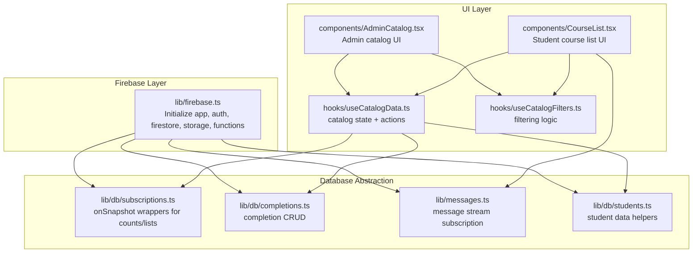
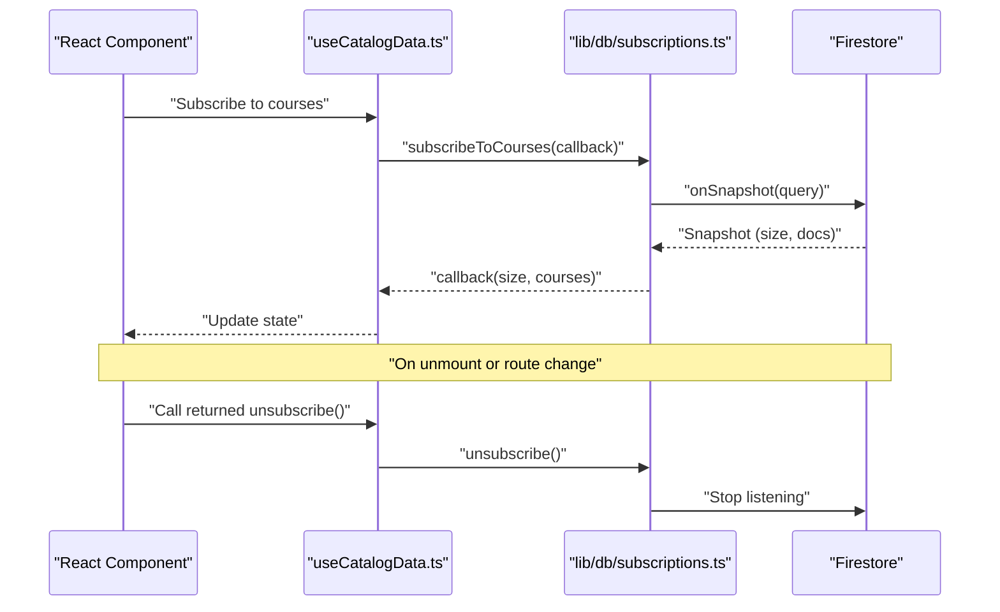
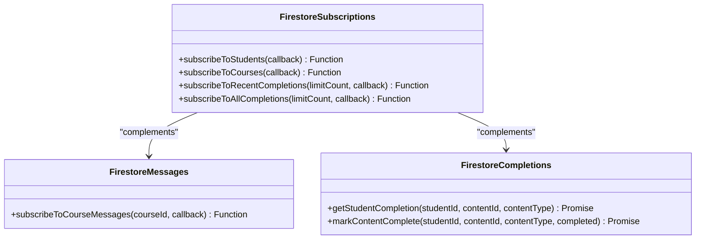
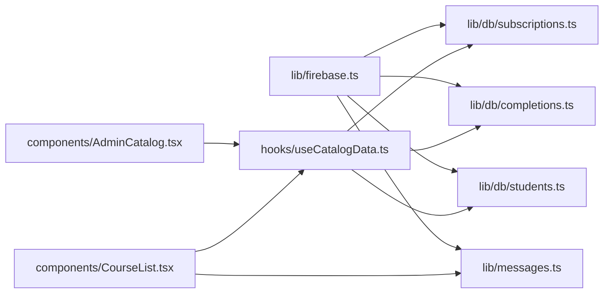

# Real-time Subscriptions

<cite>
**Referenced Files in This Document**
- [firebase.ts](file://lib/firebase.ts)
- [subscriptions.ts](file://lib/db/subscriptions.ts)
- [completions.ts](file://lib/db/completions.ts)
- [messages.ts](file://lib/messages.ts)
- [students.ts](file://lib/db/students.ts)
- [AdminCatalog.tsx](file://components/AdminCatalog.tsx)
- [CourseList.tsx](file://components/CourseList.tsx)
- [useCatalogData.ts](file://hooks/useCatalogData.ts)
- [useCatalogFilters.ts](file://hooks/useCatalogFilters.ts)
</cite>

## Table of Contents
1. [Introduction](#introduction)
2. [Project Structure](#project-structure)
3. [Core Components](#core-components)
4. [Architecture Overview](#architecture-overview)
5. [Detailed Component Analysis](#detailed-component-analysis)
6. [Dependency Analysis](#dependency-analysis)
7. [Performance Considerations](#performance-considerations)
8. [Troubleshooting Guide](#troubleshooting-guide)
9. [Conclusion](#conclusion)

## Introduction
This document explains real-time data subscription patterns and implementation in Fluentoria. It focuses on Firestore listener management, subscription lifecycle, and cleanup strategies. It also documents subscription patterns for courses, completions, user data, and administrative updates, along with reactive data patterns, state synchronization, performance optimization, memory management, error handling, and connection resilience.

## Project Structure
Real-time subscriptions are implemented using Firestore’s onSnapshot listeners exported from a central database module and consumed by React components and hooks. The Firebase app initialization and persistence configuration are centralized, while subscription functions encapsulate query construction and listener lifecycle.

**Diagram sources**
- [firebase.ts](file://lib/firebase.ts#L1-L25)
- [subscriptions.ts](file://lib/db/subscriptions.ts#L1-L93)
- [completions.ts](file://lib/db/completions.ts#L1-L56)
- [messages.ts](file://lib/messages.ts#L47-L97)
- [students.ts](file://lib/db/students.ts#L1-L285)
- [AdminCatalog.tsx](file://components/AdminCatalog.tsx#L1-L430)
- [CourseList.tsx](file://components/CourseList.tsx#L1-L216)
- [useCatalogData.ts](file://hooks/useCatalogData.ts#L1-L157)
- [useCatalogFilters.ts](file://hooks/useCatalogFilters.ts#L1-L86)

**Section sources**
- [firebase.ts](file://lib/firebase.ts#L1-L25)
- [subscriptions.ts](file://lib/db/subscriptions.ts#L1-L93)
- [messages.ts](file://lib/messages.ts#L47-L97)
- [AdminCatalog.tsx](file://components/AdminCatalog.tsx#L1-L430)
- [CourseList.tsx](file://components/CourseList.tsx#L1-L216)
- [useCatalogData.ts](file://hooks/useCatalogData.ts#L1-L157)
- [useCatalogFilters.ts](file://hooks/useCatalogFilters.ts#L1-L86)

## Core Components
- Firebase initialization and persistence:
  - Centralized initialization of Firebase app, auth, Firestore, Storage, and Cloud Functions.
  - Firestore configured with persistent local cache and multi-tab manager for shared state across tabs.
- Subscription utilities:
  - Count-only subscriptions for users and courses.
  - Recent and all completions streams enriched with related document lookups.
  - Message stream subscription per course with timestamp normalization.
- Domain-specific helpers:
  - Completion CRUD for student progress tracking.
  - Student data helpers including financial and access control fields.

Key implementation references:
- [firebase.ts](file://lib/firebase.ts#L1-L25)
- [subscriptions.ts](file://lib/db/subscriptions.ts#L1-L93)
- [messages.ts](file://lib/messages.ts#L47-L97)
- [completions.ts](file://lib/db/completions.ts#L1-L56)
- [students.ts](file://lib/db/students.ts#L1-L285)

**Section sources**
- [firebase.ts](file://lib/firebase.ts#L1-L25)
- [subscriptions.ts](file://lib/db/subscriptions.ts#L1-L93)
- [messages.ts](file://lib/messages.ts#L47-L97)
- [completions.ts](file://lib/db/completions.ts#L1-L56)
- [students.ts](file://lib/db/students.ts#L1-L285)

## Architecture Overview
Real-time updates flow from Firestore to UI components through subscription functions. Components receive unsubscribe functions to clean up listeners when components unmount or when navigation changes.

**Diagram sources**
- [useCatalogData.ts](file://hooks/useCatalogData.ts#L1-L157)
- [subscriptions.ts](file://lib/db/subscriptions.ts#L15-L23)

## Detailed Component Analysis

### Firestore Listener Management and Lifecycle
- Pattern: Each subscription function returns an unsubscribe function from onSnapshot.
- Lifecycle:
  - Subscribe on mount or when dependencies change.
  - Unsubscribe on unmount or when navigation changes to prevent leaks.
  - Error callbacks log issues without crashing the app.
- Cleanup strategies:
  - Store the unsubscribe function from the subscription hook.
  - Call it inside useEffect cleanup or component teardown.
  - Avoid holding references to stale queries or callbacks.

References:
- [subscriptions.ts](file://lib/db/subscriptions.ts#L6-L13)
- [subscriptions.ts](file://lib/db/subscriptions.ts#L15-L23)
- [subscriptions.ts](file://lib/db/subscriptions.ts#L25-L73)
- [messages.ts](file://lib/messages.ts#L57-L85)

**Section sources**
- [subscriptions.ts](file://lib/db/subscriptions.ts#L6-L13)
- [subscriptions.ts](file://lib/db/subscriptions.ts#L15-L23)
- [subscriptions.ts](file://lib/db/subscriptions.ts#L25-L73)
- [messages.ts](file://lib/messages.ts#L57-L85)

### Subscription Patterns by Feature

#### Courses
- Purpose: Keep course lists and counts synchronized in real time.
- Implementation:
  - subscribeToCourses returns snapshot of documents and total count.
  - Components call this during mount and rely on returned unsubscribe.
- Reactive pattern:
  - UI state updates automatically when Firestore documents change.
  - Filtering and search operate on client-side derived arrays.

References:
- [subscriptions.ts](file://lib/db/subscriptions.ts#L15-L23)
- [AdminCatalog.tsx](file://components/AdminCatalog.tsx#L37-L54)
- [useCatalogData.ts](file://hooks/useCatalogData.ts#L51-L59)

**Section sources**
- [subscriptions.ts](file://lib/db/subscriptions.ts#L15-L23)
- [AdminCatalog.tsx](file://components/AdminCatalog.tsx#L37-L54)
- [useCatalogData.ts](file://hooks/useCatalogData.ts#L51-L59)

#### Completions
- Purpose: Track and display recent student completions with enriched data.
- Implementation:
  - subscribeToRecentCompletions queries recent completions and enriches each with student and content details by fetching related documents.
  - subscribeToAllCompletions provides a simpler stream of raw completion records.
- Reactive pattern:
  - UI updates immediately when completion documents change.
  - Enrichment fetches are performed per snapshot update.

References:
- [subscriptions.ts](file://lib/db/subscriptions.ts#L25-L73)
- [subscriptions.ts](file://lib/db/subscriptions.ts#L75-L92)
- [completions.ts](file://lib/db/completions.ts#L6-L29)
- [completions.ts](file://lib/db/completions.ts#L31-L56)

**Section sources**
- [subscriptions.ts](file://lib/db/subscriptions.ts#L25-L73)
- [subscriptions.ts](file://lib/db/subscriptions.ts#L75-L92)
- [completions.ts](file://lib/db/completions.ts#L6-L29)
- [completions.ts](file://lib/db/completions.ts#L31-L56)

#### User Data (Students)
- Purpose: Monitor user counts and related data for admin views.
- Implementation:
  - subscribeToStudents provides a count of users/documents.
  - Additional helpers in students.ts support admin operations and data exports.
- Reactive pattern:
  - Admin dashboards can react to user count changes.
  - Client-side sorting and filtering applied to fetched data.

References:
- [subscriptions.ts](file://lib/db/subscriptions.ts#L6-L13)
- [students.ts](file://lib/db/students.ts#L7-L63)

**Section sources**
- [subscriptions.ts](file://lib/db/subscriptions.ts#L6-L13)
- [students.ts](file://lib/db/students.ts#L7-L63)

#### Messages (Course Chat)
- Purpose: Stream messages for a specific course in real time.
- Implementation:
  - subscribeToCourseMessages constructs a query by courseId and orders by timestamp.
  - Normalizes Firestore timestamps to JavaScript dates before invoking the callback.
- Reactive pattern:
  - UI scrolls to new messages and updates unread indicators reactively.

References:
- [messages.ts](file://lib/messages.ts#L57-L85)

**Section sources**
- [messages.ts](file://lib/messages.ts#L57-L85)

### Reactive Data Patterns and State Synchronization
- Hooks orchestrate subscription lifecycles:
  - useCatalogData manages active tab, lists, and CRUD actions; it does not itself subscribe to Firestore but coordinates with subscription utilities.
- UI components:
  - AdminCatalog and CourseList trigger initial loads and render filtered/sorted lists.
  - Filtering and search are computed from current lists, ensuring minimal Firestore reads.

References:
- [useCatalogData.ts](file://hooks/useCatalogData.ts#L20-L156)
- [useCatalogFilters.ts](file://hooks/useCatalogFilters.ts#L8-L85)
- [AdminCatalog.tsx](file://components/AdminCatalog.tsx#L37-L54)
- [CourseList.tsx](file://components/CourseList.tsx#L17-L32)

**Section sources**
- [useCatalogData.ts](file://hooks/useCatalogData.ts#L20-L156)
- [useCatalogFilters.ts](file://hooks/useCatalogFilters.ts#L8-L85)
- [AdminCatalog.tsx](file://components/AdminCatalog.tsx#L37-L54)
- [CourseList.tsx](file://components/CourseList.tsx#L17-L32)

### Class Model: Subscription Utilities

**Diagram sources**
- [subscriptions.ts](file://lib/db/subscriptions.ts#L6-L92)
- [messages.ts](file://lib/messages.ts#L57-L85)
- [completions.ts](file://lib/db/completions.ts#L6-L56)

## Dependency Analysis
- Centralized dependency:
  - All subscription functions depend on the initialized Firestore instance from lib/firebase.ts.
- Coupling:
  - Components depend on hooks and subscription utilities rather than direct Firestore imports.
- Cohesion:
  - Subscription logic is cohesive per domain (courses, completions, messages, students).

**Diagram sources**
- [firebase.ts](file://lib/firebase.ts#L1-L25)
- [subscriptions.ts](file://lib/db/subscriptions.ts#L1-L93)
- [messages.ts](file://lib/messages.ts#L47-L97)
- [completions.ts](file://lib/db/completions.ts#L1-L56)
- [students.ts](file://lib/db/students.ts#L1-L285)
- [AdminCatalog.tsx](file://components/AdminCatalog.tsx#L1-L430)
- [CourseList.tsx](file://components/CourseList.tsx#L1-L216)
- [useCatalogData.ts](file://hooks/useCatalogData.ts#L1-L157)

**Section sources**
- [firebase.ts](file://lib/firebase.ts#L1-L25)
- [subscriptions.ts](file://lib/db/subscriptions.ts#L1-L93)
- [messages.ts](file://lib/messages.ts#L47-L97)
- [completions.ts](file://lib/db/completions.ts#L1-L56)
- [students.ts](file://lib/db/students.ts#L1-L285)
- [AdminCatalog.tsx](file://components/AdminCatalog.tsx#L1-L430)
- [CourseList.tsx](file://components/CourseList.tsx#L1-L216)
- [useCatalogData.ts](file://hooks/useCatalogData.ts#L1-L157)

## Performance Considerations
- Efficient queries:
  - Use indexed fields in queries (e.g., where clauses) to minimize server load.
  - Order by frequently-filtered fields to leverage Firestore indexing effectively.
- Client-side enrichment:
  - subscribeToRecentCompletions performs additional document fetches per snapshot; consider caching or batching to reduce network overhead.
- Pagination and limits:
  - Use limit in queries to cap payload sizes for recent streams.
- Timestamp normalization:
  - Convert Firestore timestamps to JS dates once per snapshot to avoid repeated conversions.
- Memory management:
  - Always call unsubscribe when components unmount or routes change.
  - Avoid storing large snapshots in component state; derive UI from smaller normalized payloads.
- Persistence:
  - Firestore local cache reduces network usage and improves resilience; ensure multi-tab manager is enabled for shared state.

[No sources needed since this section provides general guidance]

## Troubleshooting Guide
- Error handling:
  - Subscription functions include error callbacks logging issues; ensure logs are monitored.
- Connection resilience:
  - Firestore handles transient failures; listeners resume automatically after connectivity restoration.
- Cleanup:
  - If UI stops updating after navigation, verify that unsubscribe is called on cleanup.
- Debugging:
  - Confirm that the Firestore instance is initialized before subscriptions are created.
  - Verify that query filters match document fields and indexes.

References:
- [subscriptions.ts](file://lib/db/subscriptions.ts#L10-L12)
- [subscriptions.ts](file://lib/db/subscriptions.ts#L20-L22)
- [subscriptions.ts](file://lib/db/subscriptions.ts#L70-L72)
- [firebase.ts](file://lib/firebase.ts#L16-L24)

**Section sources**
- [subscriptions.ts](file://lib/db/subscriptions.ts#L10-L12)
- [subscriptions.ts](file://lib/db/subscriptions.ts#L20-L22)
- [subscriptions.ts](file://lib/db/subscriptions.ts#L70-L72)
- [firebase.ts](file://lib/firebase.ts#L16-L24)

## Conclusion
Fluentoria’s real-time subscriptions are built around clean, composable Firestore onSnapshot wrappers that return unsubscribe functions. Components coordinate lifecycle management, while hooks orchestrate state updates. The system supports reactive patterns for courses, completions, messages, and user data, with practical strategies for performance, memory management, error handling, and resilience. Adopting consistent unsubscribe patterns and efficient query design ensures scalable, maintainable real-time behavior.