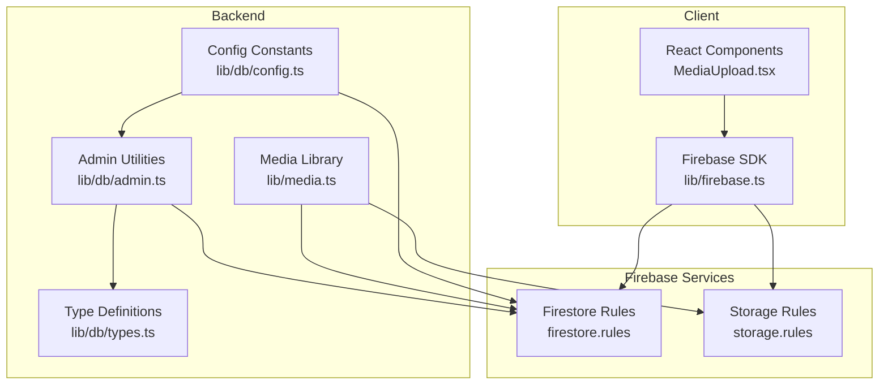
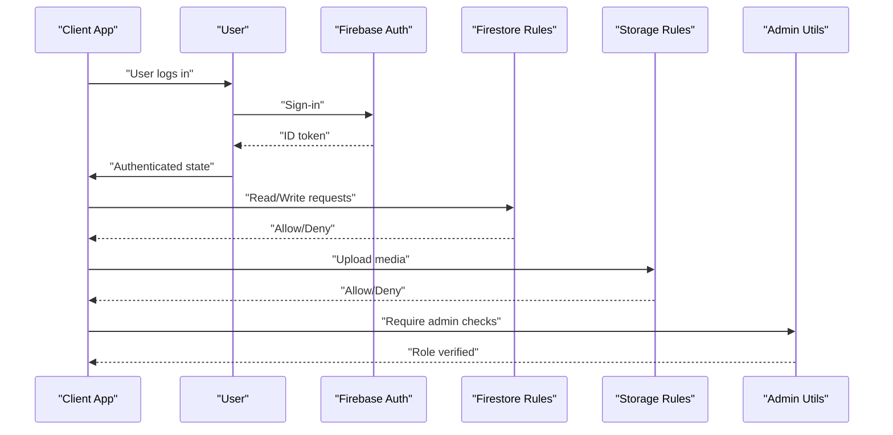
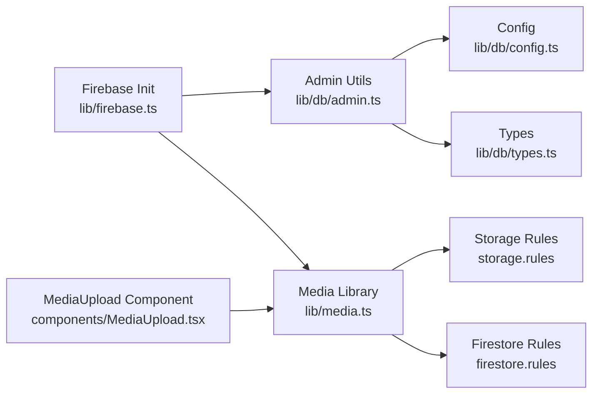

# Security Rules & Access Control

<cite>
**Referenced Files in This Document**
- [firestore.rules](file://firestore.rules)
- [storage.rules](file://storage.rules)
- [lib/firebase.ts](file://lib/firebase.ts)
- [lib/db/admin.ts](file://lib/db/admin.ts)
- [lib/db/config.ts](file://lib/db/config.ts)
- [lib/db/types.ts](file://lib/db/types.ts)
- [lib/media.ts](file://lib/media.ts)
- [components/MediaUpload.tsx](file://components/MediaUpload.tsx)
- [types.ts](file://types.ts)
</cite>

## Table of Contents
1. [Introduction](#introduction)
2. [Project Structure](#project-structure)
3. [Core Components](#core-components)
4. [Architecture Overview](#architecture-overview)
5. [Detailed Component Analysis](#detailed-component-analysis)
6. [Dependency Analysis](#dependency-analysis)
7. [Performance Considerations](#performance-considerations)
8. [Troubleshooting Guide](#troubleshooting-guide)
9. [Conclusion](#conclusion)

## Introduction
This document explains the Firestore security rules and access control mechanisms implemented in the project. It covers:
- Permission models for roles: student, admin, and primary admin
- Rule syntax and conditional logic
- Data validation patterns
- Examples of document-level and collection-level rules
- Storage security rules for media files, upload permissions, and access restrictions
- Best practices for rule maintenance and debugging

## Project Structure
The security model spans Firestore rules, Firebase Storage rules, client-side initialization, and backend utilities that enforce role checks and access control.

**Diagram sources**
- [lib/firebase.ts](file://lib/firebase.ts#L1-L25)
- [lib/db/admin.ts](file://lib/db/admin.ts#L1-L288)
- [lib/db/config.ts](file://lib/db/config.ts#L1-L19)
- [lib/db/types.ts](file://lib/db/types.ts#L1-L90)
- [lib/media.ts](file://lib/media.ts#L1-L369)
- [components/MediaUpload.tsx](file://components/MediaUpload.tsx#L1-L589)
- [firestore.rules](file://firestore.rules#L1-L97)
- [storage.rules](file://storage.rules#L1-L11)

**Section sources**
- [lib/firebase.ts](file://lib/firebase.ts#L1-L25)
- [firestore.rules](file://firestore.rules#L1-L97)
- [storage.rules](file://storage.rules#L1-L11)

## Core Components
- Firestore security rules define who can read/write documents and collections, including helpers for authentication, ownership, and admin checks.
- Storage rules restrict uploads to authenticated users and enforce size limits.
- Admin utilities enforce role checks server-side and manage user roles and access flags.
- Media library handles uploads and metadata persistence with client-side validations and error handling.

**Section sources**
- [firestore.rules](file://firestore.rules#L1-L97)
- [storage.rules](file://storage.rules#L1-L11)
- [lib/db/admin.ts](file://lib/db/admin.ts#L1-L288)
- [lib/media.ts](file://lib/media.ts#L1-L369)

## Architecture Overview
The access control architecture combines:
- Authentication enforcement via request.auth
- Role-based access using Firestore document fields and centralized admin lists
- Ownership checks for user-specific resources
- Collection-level and document-level rules
- Client-side and server-side validations for uploads and access

**Diagram sources**
- [lib/firebase.ts](file://lib/firebase.ts#L1-L25)
- [firestore.rules](file://firestore.rules#L1-L97)
- [storage.rules](file://storage.rules#L1-L11)
- [lib/db/admin.ts](file://lib/db/admin.ts#L1-L288)

## Detailed Component Analysis

### Firestore Security Rules
The rules define:
- Helpers for authentication, admin detection, and ownership checks
- Collection-level rules for users, admin emails, courses, mindful flow, music, achievements, student completions, student progress, activities, and user courses
- A catch-all deny-by-default for unknown paths

Key rule patterns:
- Authentication checks via request.auth != null
- Admin checks via centralized role field or primary admin email
- Ownership checks for user-specific documents
- Conditional reads/writes based on roles and ownership

Examples by collection:
- Users: authenticated read; create/update/delete controlled by ownership and admin
- Admin emails: admin-only read/write
- Courses, mindful flow, music: authenticated read; admin write
- Student completions: authenticated read; admin create/update/delete
- Student progress: authenticated read/write for owner/admin
- Student activities: authenticated read; create/update/delete controlled by ownership and admin
- User courses: authenticated read; create/update/delete controlled by ownership and admin

**Section sources**
- [firestore.rules](file://firestore.rules#L1-L97)

### Storage Security Rules
The storage rules:
- Allow authenticated read
- Allow authenticated write with a 100 MB size limit
- Apply to all paths under the bucket

These rules protect media uploads and downloads while preventing unauthorized access.

**Section sources**
- [storage.rules](file://storage.rules#L1-L11)

### Admin Utilities and Role Management
Admin utilities enforce role checks and manage user roles:
- requireAdmin: verifies current user is admin (via Firestore role or primary admin email)
- createOrUpdateUser: creates or updates user documents with role assignment and access flags
- getUserRole: retrieves user role from Firestore
- checkUserAccess: determines if a student has access based on accessAuthorized flag or active course associations
- forceUpdateUserRole: sets role for a user (admin or student)
- addAdminByEmail: adds admin by email and updates existing user role
- removeAdmin: removes admin privileges and clears pending admin entries
- updateStudentAccess: toggles accessAuthorized flag for students

These utilities centralize admin enforcement and ensure consistent role-based access across the application.

**Section sources**
- [lib/db/admin.ts](file://lib/db/admin.ts#L1-L288)
- [lib/db/config.ts](file://lib/db/config.ts#L1-L19)
- [lib/db/types.ts](file://lib/db/types.ts#L1-L90)

### Media Uploads and Access Controls
Media library:
- Validates inputs and file types
- Uploads to Firebase Storage with progress callbacks
- Persists metadata to Firestore media_submissions collection
- Handles CORS errors and unauthorized upload scenarios
- Supports course cover uploads and support materials

Client component:
- Provides drag-and-drop and recording capabilities
- Filters media by type and ownership
- Enables download and deletion actions for authorized users

Access patterns:
- Storage: authenticated users can upload up to 100 MB
- Firestore: media metadata is stored separately and can be filtered by courseId and studentId
- Ownership: instructors can view all student media; students can only view their own media

**Section sources**
- [lib/media.ts](file://lib/media.ts#L1-L369)
- [components/MediaUpload.tsx](file://components/MediaUpload.tsx#L1-L589)
- [storage.rules](file://storage.rules#L1-L11)
- [firestore.rules](file://firestore.rules#L1-L97)

### Role-Based Access Patterns
- Student
  - Can read courses, mindful flow, music, achievements
  - Can read/write their own student progress
  - Can read/write their own student activities
  - Can read/write their own user courses records
  - Cannot write courses, mindful flow, music, achievements
  - Cannot delete user courses unless admin
- Admin
  - Can read/write all courses, mindful flow, music, achievements
  - Can read/write all student progress and activities
  - Can read/write all user courses
  - Can manage admin emails
  - Can delete user courses
- Primary Admin
  - Bypasses role checks via primary admin email in admin utilities

Ownership checks:
- Users can only modify their own documents unless admin
- Activities and user courses enforce ownership via resource/request data fields

**Section sources**
- [firestore.rules](file://firestore.rules#L1-L97)
- [lib/db/admin.ts](file://lib/db/admin.ts#L1-L288)
- [lib/db/config.ts](file://lib/db/config.ts#L1-L19)

### Rule Syntax and Conditional Logic
Rule helpers:
- isAuthenticated(): ensures request.auth is present
- isAdmin(): checks role field or primary admin email
- isOwner(userId): compares request.auth.uid to target userId

Conditional logic patterns:
- allow read: if isAuthenticated() for public-readable collections
- allow create/update: if isOwner(userId) || isAdmin() for user-owned resources
- allow write: if isAdmin() for admin-managed collections
- allow read: if isAdmin() || (resource == null || resource.data.userId == request.auth.uid) for user-course records

Default deny:
- match /{document=**}: allow read, write: if false

**Section sources**
- [firestore.rules](file://firestore.rules#L1-L97)

### Data Validation Patterns
- Firestore: enforce ownership and admin checks in rules; server-side validation in admin utilities
- Storage: size limits and authenticated access
- Media library: validates file types and sizes before upload; handles CORS and unauthorized errors

**Section sources**
- [storage.rules](file://storage.rules#L1-L11)
- [lib/media.ts](file://lib/media.ts#L1-L369)
- [lib/db/admin.ts](file://lib/db/admin.ts#L1-L288)

### Examples of Document-Level and Collection-Level Rules
- Document-level examples:
  - Users: allow create/update/delete based on ownership and admin
  - Student activities: allow create based on ownership; allow update/delete based on admin
- Collection-level examples:
  - Courses: allow read for authenticated; allow write for admin
  - User courses: allow read for authenticated (with ownership checks); allow create/update for authenticated; allow delete for admin

**Section sources**
- [firestore.rules](file://firestore.rules#L1-L97)

### Storage Security Rules for Media Files
- Authenticated read/write
- 100 MB size limit enforced in rules
- Path-based access patterns managed by client-side logic and Firestore metadata

**Section sources**
- [storage.rules](file://storage.rules#L1-L11)
- [lib/media.ts](file://lib/media.ts#L1-L369)

## Dependency Analysis
The access control system depends on:
- Firebase initialization for Firestore and Storage
- Centralized admin configuration and role constants
- Type definitions for user and course data
- Media library for uploads and metadata persistence

**Diagram sources**
- [lib/db/admin.ts](file://lib/db/admin.ts#L1-L288)
- [lib/db/config.ts](file://lib/db/config.ts#L1-L19)
- [lib/db/types.ts](file://lib/db/types.ts#L1-L90)
- [lib/media.ts](file://lib/media.ts#L1-L369)
- [storage.rules](file://storage.rules#L1-L11)
- [firestore.rules](file://firestore.rules#L1-L97)
- [lib/firebase.ts](file://lib/firebase.ts#L1-L25)
- [components/MediaUpload.tsx](file://components/MediaUpload.tsx#L1-L589)

**Section sources**
- [lib/db/admin.ts](file://lib/db/admin.ts#L1-L288)
- [lib/db/config.ts](file://lib/db/config.ts#L1-L19)
- [lib/db/types.ts](file://lib/db/types.ts#L1-L90)
- [lib/media.ts](file://lib/media.ts#L1-L369)
- [lib/firebase.ts](file://lib/firebase.ts#L1-L25)
- [components/MediaUpload.tsx](file://components/MediaUpload.tsx#L1-L589)

## Performance Considerations
- Prefer collection-level rules to reduce rule complexity
- Use helpers to minimize repeated logic
- Keep rule conditions simple and predictable
- Use server-side validations for sensitive operations
- Monitor upload sizes and adjust limits as needed

## Troubleshooting Guide
Common issues and resolutions:
- Unauthorized access to storage
  - Ensure user is authenticated
  - Verify Storage Rules allow authenticated write
  - Check CORS configuration if encountering CORS errors during upload
- Upload failures
  - Validate file size against Storage Rules limit
  - Confirm media metadata is persisted to Firestore after successful upload
- Role-based access denied
  - Verify user role in Firestore and admin configuration
  - Use requireAdmin for sensitive operations
  - Check user access flags for students

Debugging steps:
- Review Firestore Rules for helper logic and ownership checks
- Inspect Storage Rules for authenticated access and size limits
- Log and verify admin utility functions for role checks
- Check client-side error messages for CORS and unauthorized upload scenarios

**Section sources**
- [storage.rules](file://storage.rules#L1-L11)
- [lib/media.ts](file://lib/media.ts#L1-L369)
- [lib/db/admin.ts](file://lib/db/admin.ts#L1-L288)
- [firestore.rules](file://firestore.rules#L1-L97)

## Conclusion
The project implements a robust, layered access control system:
- Firestore rules define clear, role-based permissions with ownership checks
- Storage rules enforce authenticated access and size limits
- Admin utilities centralize role management and enforce admin-only operations
- Media library integrates client-side validations with secure upload and metadata persistence

This design ensures secure access patterns for students, admins, and primary admins while maintaining simplicity and scalability.