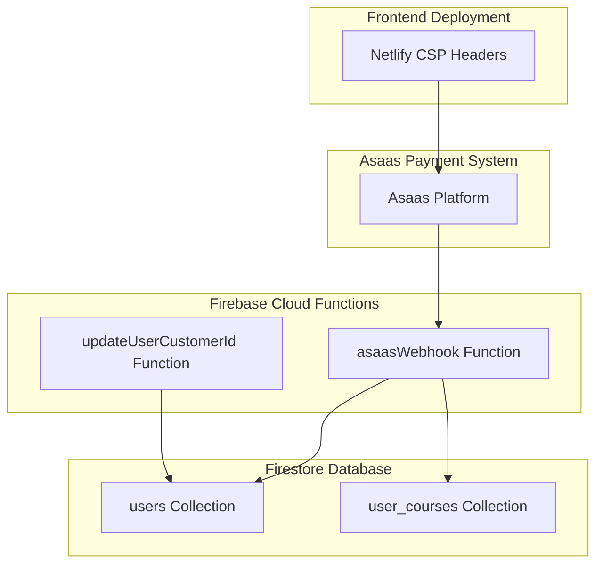
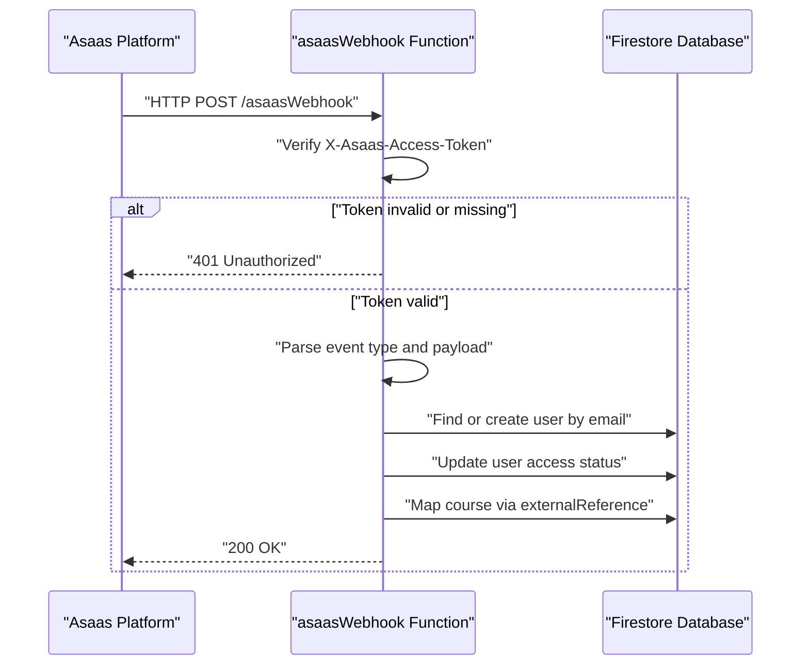
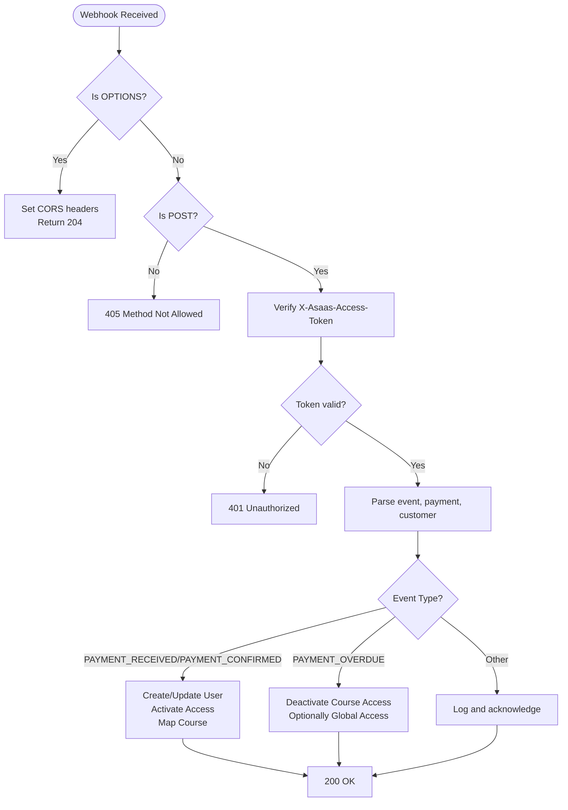
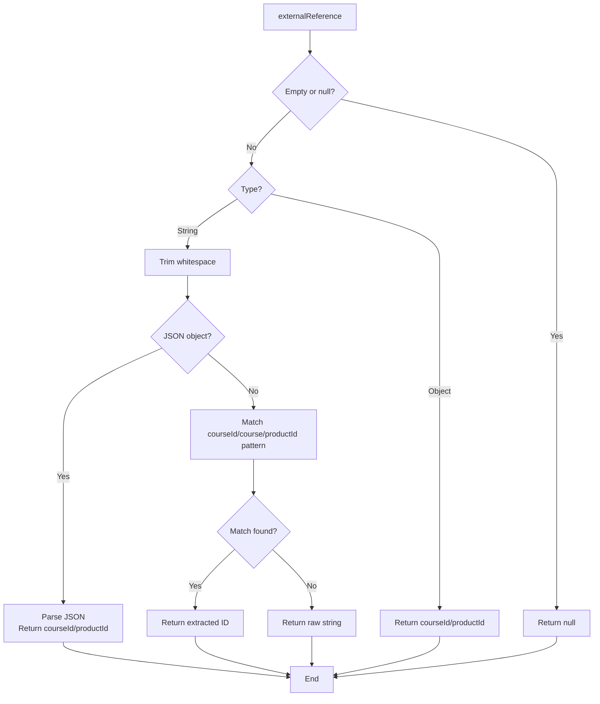
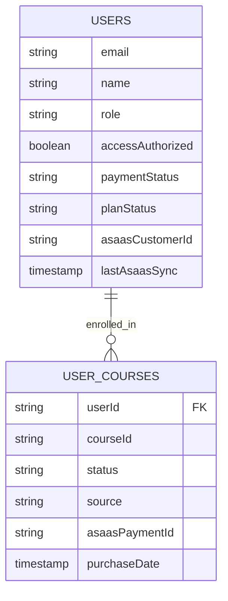
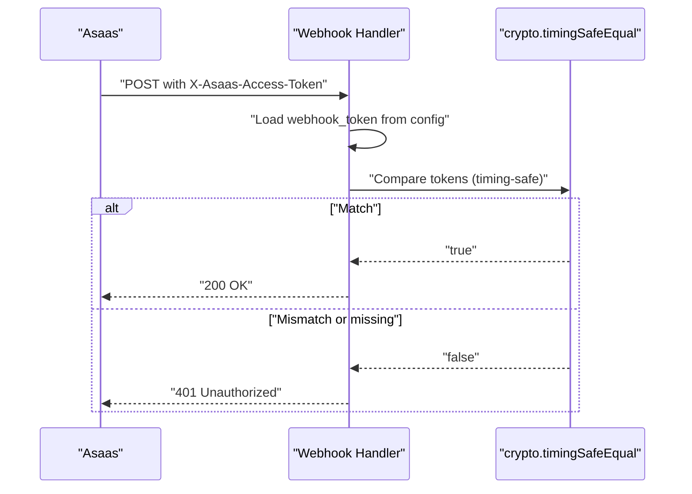
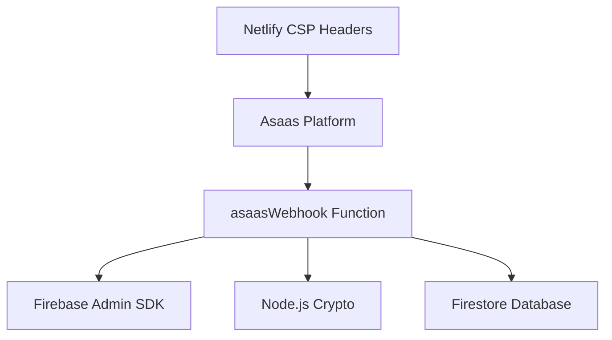

# Asaas Webhook Endpoint

<cite>
**Referenced Files in This Document**
- [functions/src/index.js](file://functions/src/index.js)
- [functions/README.md](file://functions/README.md)
- [functions/package.json](file://functions/package.json)
- [functions/src/api/updateUserCustomerId.js](file://functions/src/api/updateUserCustomerId.js)
- [lib/db/userCourses.ts](file://lib/db/userCourses.ts)
- [test-asass-webhook.js](file://test-asass-webhook.js)
- [netlify.toml](file://netlify.toml)
</cite>

## Table of Contents
1. [Introduction](#introduction)
2. [Project Structure](#project-structure)
3. [Core Components](#core-components)
4. [Architecture Overview](#architecture-overview)
5. [Detailed Component Analysis](#detailed-component-analysis)
6. [Dependency Analysis](#dependency-analysis)
7. [Performance Considerations](#performance-considerations)
8. [Troubleshooting Guide](#troubleshooting-guide)
9. [Conclusion](#conclusion)
10. [Appendices](#appendices)

## Introduction
This document provides comprehensive API documentation for the Asaas webhook endpoint (/asaasWebhook). It covers the HTTP POST endpoint, mandatory webhook token verification using crypto.timingSafeEqual, the webhook payload structure, automatic user creation and updates, course mapping via externalReference parsing, multi-product support, CORS preflight handling, error responses, and the webhook signature validation process. It also includes integration patterns with the Asaas payment system and practical request/response examples.

## Project Structure
The Asaas webhook endpoint is implemented as a Firebase Cloud Function. Supporting components include:
- Webhook handler: processes incoming Asaas events and manages user/course access
- Course mapping utility: parses course/product identifiers from externalReference
- User/customer ID update endpoint: updates user records with Asaas customer IDs
- Frontend deployment configuration: includes CSP headers enabling secure connections to Asaas domains

**Diagram sources**
- [functions/src/index.js](file://functions/src/index.js#L143-L339)
- [functions/src/api/updateUserCustomerId.js](file://functions/src/api/updateUserCustomerId.js#L12-L74)
- [netlify.toml](file://netlify.toml#L39-L65)

**Section sources**
- [functions/src/index.js](file://functions/src/index.js#L1-L387)
- [functions/package.json](file://functions/package.json#L1-L25)
- [netlify.toml](file://netlify.toml#L1-L65)

## Core Components
- Asaas Webhook Handler: Validates webhook token, processes payment events, creates/updates users, and manages course access
- Course ID Parser: Extracts course/product identifiers from externalReference supporting JSON, prefixed, and raw formats
- User Customer ID Updater: Securely updates user records with Asaas customer IDs using ID token verification
- CORS Preflight Support: Handles OPTIONS requests for cross-origin webhook delivery

Key implementation references:
- Webhook handler and token verification: [functions/src/index.js](file://functions/src/index.js#L143-L179)
- Event processing logic: [functions/src/index.js](file://functions/src/index.js#L188-L330)
- Course mapping utility: [functions/src/index.js](file://functions/src/index.js#L106-L138)
- User/customer ID update endpoint: [functions/src/api/updateUserCustomerId.js](file://functions/src/api/updateUserCustomerId.js#L12-L74)

**Section sources**
- [functions/src/index.js](file://functions/src/index.js#L106-L138)
- [functions/src/index.js](file://functions/src/index.js#L143-L339)
- [functions/src/api/updateUserCustomerId.js](file://functions/src/api/updateUserCustomerId.js#L12-L74)

## Architecture Overview
The webhook endpoint integrates with Asaas to synchronize payment events with user and course access states. The flow includes signature verification, user lifecycle management, and course enrollment updates.

**Diagram sources**
- [functions/src/index.js](file://functions/src/index.js#L143-L179)
- [functions/src/index.js](file://functions/src/index.js#L188-L266)

## Detailed Component Analysis

### Webhook Endpoint (/asaasWebhook)
- Method: POST
- Purpose: Receive Asaas payment notifications and synchronize user/course access
- CORS Preflight: OPTIONS requests return 204 with Access-Control-Allow-Origin and Access-Control-Allow-Headers headers
- Required Headers:
  - Content-Type: application/json
  - X-Asaas-Access-Token: Webhook token for signature verification

Security and validation:
- Mandatory token verification using crypto.timingSafeEqual against Firebase Functions config value
- Fail-closed behavior: rejects all requests if webhook token is not configured
- Case-insensitive header support for X-Asaas-Access-Token

Event processing:
- PAYMENT_RECEIVED/PAYMENT_CONFIRMED: Activate user access and optionally enroll in course
- PAYMENT_OVERDUE: Deactivate course access and potentially global access if no other active courses remain

Automatic user creation and update:
- Creates new users with role student, accessAuthorized true, and paymentStatus/planStatus active
- Updates existing users with access activation and synchronization timestamps
- Uses email lookup (case-insensitive) to match customers to users

Multi-product support:
- Parses course/product identifiers from paymentData.externalReference using flexible formats:
  - JSON payloads: {"courseId":"..."} or {"productId":"..."}
  - Prefixed formats: courseId:abc123, course=abc123, productId=...
  - Raw string fallback for backward compatibility

Course mapping:
- Creates or updates user_courses documents with status active and source asaas
- Stores asaasPaymentId for audit trail

Error responses:
- 401 Unauthorized: Invalid or missing webhook token
- 400 Bad Request: Missing required fields (e.g., customer email)
- 405 Method Not Allowed: Non-POST requests
- 500 Internal Server Error: Server misconfiguration or unhandled exceptions

**Diagram sources**
- [functions/src/index.js](file://functions/src/index.js#L143-L179)
- [functions/src/index.js](file://functions/src/index.js#L188-L330)

**Section sources**
- [functions/src/index.js](file://functions/src/index.js#L143-L179)
- [functions/src/index.js](file://functions/src/index.js#L188-L330)

### Course ID Parsing Utility
The externalReference parser supports multiple formats for flexible course/product identification:
- JSON object parsing for courseId or productId
- URL-style parameter extraction (courseId, course, productId)
- Raw string fallback for legacy integrations

**Diagram sources**
- [functions/src/index.js](file://functions/src/index.js#L106-L138)

**Section sources**
- [functions/src/index.js](file://functions/src/index.js#L106-L138)

### User Management and Course Access
The system maintains two primary collections:
- users: Stores user profiles, access flags, and payment status
- user_courses: Tracks per-course enrollment with status and source

Integration patterns:
- Course access granted automatically upon successful payment
- Overdue payments may trigger course deactivation and potential global access revocation
- Manual overrides supported via manualAuthorization flag preventing automatic deactivation

**Diagram sources**
- [functions/src/index.js](file://functions/src/index.js#L207-L233)
- [functions/src/index.js](file://functions/src/index.js#L235-L263)
- [functions/src/index.js](file://functions/src/index.js#L284-L324)

**Section sources**
- [functions/src/index.js](file://functions/src/index.js#L207-L233)
- [functions/src/index.js](file://functions/src/index.js#L235-L263)
- [functions/src/index.js](file://functions/src/index.js#L284-L324)
- [lib/db/userCourses.ts](file://lib/db/userCourses.ts#L25-L68)

### Timing-Safe Comparison Implementation
The webhook validates the X-Asaas-Access-Token header using crypto.timingSafeEqual to prevent timing attacks. The implementation:
- Compares the configured webhook token from Firebase Functions config with the provided token
- Uses length check before timing comparison to avoid trivial bypass attempts
- Returns 401 Unauthorized on mismatch or absence

**Diagram sources**
- [functions/src/index.js](file://functions/src/index.js#L160-L179)

**Section sources**
- [functions/src/index.js](file://functions/src/index.js#L160-L179)

### CORS Preflight Handling
The endpoint responds to OPTIONS requests with appropriate headers to enable cross-origin webhook delivery:
- Access-Control-Allow-Origin: *
- Access-Control-Allow-Methods: POST
- Access-Control-Allow-Headers: Content-Type, X-Asaas-Access-Token

**Section sources**
- [functions/src/index.js](file://functions/src/index.js#L146-L152)

### Error Responses
- 401 Unauthorized: Invalid or missing webhook token
- 400 Bad Request: Missing required fields (e.g., customer email)
- 405 Method Not Allowed: Non-POST requests
- 500 Internal Server Error: Server misconfiguration or unhandled exceptions

**Section sources**
- [functions/src/index.js](file://functions/src/index.js#L155-L158)
- [functions/src/index.js](file://functions/src/index.js#L163-L167)
- [functions/src/index.js](file://functions/src/index.js#L170-L179)
- [functions/src/index.js](file://functions/src/index.js#L193-L196)
- [functions/src/index.js](file://functions/src/index.js#L335-L338)

### Request/Response Examples
Example webhook payloads for testing:
- PAYMENT_RECEIVED event with payment and customer data
- PAYMENT_OVERDUE event with overdue payment details

Example request headers:
- Content-Type: application/json
- X-Asaas-Access-Token: [configured webhook token]

Example response bodies:
- Payment processed successfully
- Payment overdue processed
- Event received

Note: These examples are derived from the test script and webhook handler behavior.

**Section sources**
- [test-asass-webhook.js](file://test-asass-webhook.js#L14-L40)
- [functions/src/index.js](file://functions/src/index.js#L265-L266)
- [functions/src/index.js](file://functions/src/index.js#L328-L329)
- [functions/src/index.js](file://functions/src/index.js#L334-L335)

## Dependency Analysis
The webhook endpoint depends on:
- Firebase Admin SDK for Firestore operations
- Node.js crypto module for timing-safe comparisons
- Firebase Functions runtime for HTTP handling

External dependencies:
- Asaas platform for webhook delivery
- Netlify CSP headers enabling secure connections to Asaas domains

**Diagram sources**
- [functions/src/index.js](file://functions/src/index.js#L1-L8)
- [functions/package.json](file://functions/package.json#L16-L18)
- [netlify.toml](file://netlify.toml#L39-L65)

**Section sources**
- [functions/src/index.js](file://functions/src/index.js#L1-L8)
- [functions/package.json](file://functions/package.json#L16-L18)
- [netlify.toml](file://netlify.toml#L39-L65)

## Performance Considerations
- Minimal synchronous operations: single user lookup, optional course mapping, and targeted updates
- Efficient course mapping: queries limited to userId and courseId filters
- Timing-safe comparison prevents timing attack overhead while maintaining security
- Consider adding rate limiting at the platform level if receiving high-volume webhooks

## Troubleshooting Guide
Common issues and resolutions:
- 401 Unauthorized: Verify webhook token configuration in Firebase Functions config and ensure correct header casing
- 400 Bad Request: Confirm customer email is present in webhook payload
- 405 Method Not Allowed: Ensure webhook is sent as POST request
- 500 Internal Server Error: Check Firebase Functions logs for configuration errors (missing webhook token)
- CORS failures: Verify OPTIONS preflight responses include required headers

Debugging steps:
- Enable Firebase Functions logging during development
- Use the test script to simulate webhook events locally
- Validate externalReference format for course mapping

**Section sources**
- [functions/src/index.js](file://functions/src/index.js#L163-L167)
- [functions/src/index.js](file://functions/src/index.js#L170-L179)
- [functions/src/index.js](file://functions/src/index.js#L193-L196)
- [functions/src/index.js](file://functions/src/index.js#L335-L338)
- [test-asass-webhook.js](file://test-asass-webhook.js#L70-L81)

## Conclusion
The Asaas webhook endpoint provides a secure, automated mechanism for synchronizing payment events with user and course access states. Its robust token verification, flexible course mapping, and comprehensive error handling ensure reliable integration with the Asaas payment system. The implementation supports multi-product scenarios and maintains data consistency through Firestore operations.

## Appendices

### Setup and Configuration
- Configure webhook token in Firebase Functions config
- Deploy functions using Firebase CLI
- Expose endpoint via reverse proxy or cloud provider routing

**Section sources**
- [functions/README.md](file://functions/README.md#L18-L27)
- [functions/README.md](file://functions/README.md#L59-L61)

### Integration Patterns
- Sandbox testing with ngrok for local development
- Production webhook URL configuration in Asaas account settings
- Monitoring and alerting via Firebase Functions logs

**Section sources**
- [functions/README.md](file://functions/README.md#L29-L45)