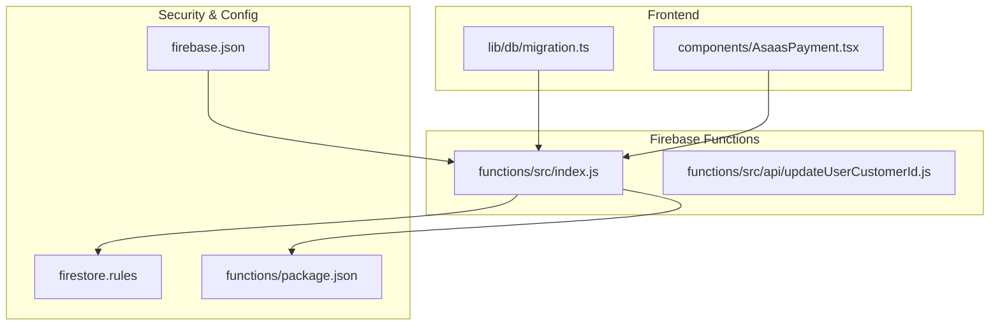
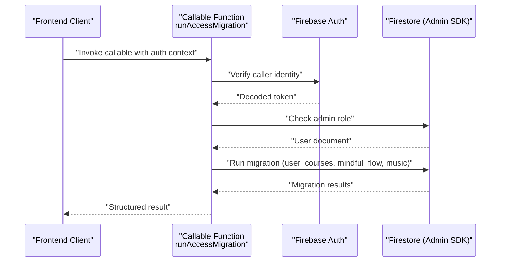
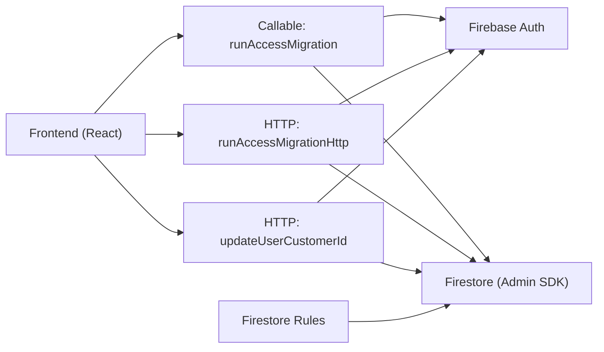

# Callable Functions

<cite>
**Referenced Files in This Document**
- [functions/src/index.js](file://functions/src/index.js)
- [functions/src/api/updateUserCustomerId.js](file://functions/src/api/updateUserCustomerId.js)
- [lib/db/migration.ts](file://lib/db/migration.ts)
- [components/AsaasPayment.tsx](file://components/AsaasPayment.tsx)
- [firestore.rules](file://firestore.rules)
- [firebase.json](file://firebase.json)
- [functions/package.json](file://functions/package.json)
</cite>

## Table of Contents
1. [Introduction](#introduction)
2. [Project Structure](#project-structure)
3. [Core Components](#core-components)
4. [Architecture Overview](#architecture-overview)
5. [Detailed Component Analysis](#detailed-component-analysis)
6. [Dependency Analysis](#dependency-analysis)
7. [Performance Considerations](#performance-considerations)
8. [Troubleshooting Guide](#troubleshooting-guide)
9. [Conclusion](#conclusion)
10. [Appendices](#appendices)

## Introduction
This document provides comprehensive API documentation for Firebase callable functions in the project, focusing on:
- updateUserCustomerId callable function with parameter validation, error handling, and Firestore integration
- runAccessMigration callable function with admin context validation, Bearer token authentication fallback, and data migration capabilities
- Helper functions ensureAdminContext and ensureAdminFromRequest
- Legacy migration process for user_courses, mindful_flow, and music collections
- Invocation patterns, error codes, security considerations, and integration with Firebase Authentication
- Parameter schemas, return value structures, and practical usage examples for both authenticated and unauthenticated scenarios

## Project Structure
The callable functions are implemented in the Firebase Cloud Functions codebase under functions/src/. The project also includes:
- Frontend usage examples in React components
- Firestore security rules enforcing access controls
- Migration orchestration in a dedicated library module

**Diagram sources**
- [functions/src/index.js](file://functions/src/index.js#L1-L387)
- [functions/src/api/updateUserCustomerId.js](file://functions/src/api/updateUserCustomerId.js#L1-L74)
- [lib/db/migration.ts](file://lib/db/migration.ts#L1-L63)
- [components/AsaasPayment.tsx](file://components/AsaasPayment.tsx#L196-L230)
- [firestore.rules](file://firestore.rules#L1-L97)
- [firebase.json](file://firebase.json#L1-L20)
- [functions/package.json](file://functions/package.json#L1-L25)

**Section sources**
- [firebase.json](file://firebase.json#L1-L20)
- [functions/package.json](file://functions/package.json#L1-L25)

## Core Components
- updateUserCustomerId: An HTTP request handler that updates a user’s Asaas customer ID after validating the caller’s identity via ID token and permissions.
- runAccessMigration: A callable function that performs a one-time migration of legacy data into structured access records and product associations.
- runAccessMigrationHttp: An HTTP fallback endpoint for migrations when callable authentication fails.
- Helper functions:
  - ensureAdminContext: Validates admin privileges from callable context.
  - ensureAdminFromRequest: Validates admin privileges from an explicit Bearer token in HTTP requests.

These components integrate with Firebase Authentication and Firestore, leveraging admin privileges to bypass client-side security rules during sensitive operations.

**Section sources**
- [functions/src/index.js](file://functions/src/index.js#L10-L41)
- [functions/src/index.js](file://functions/src/index.js#L344-L387)
- [functions/src/api/updateUserCustomerId.js](file://functions/src/api/updateUserCustomerId.js#L11-L74)

## Architecture Overview
The callable functions operate within the Firebase Functions runtime and interact with:
- Firebase Authentication for user identity verification
- Firestore for data reads/writes
- Frontend clients invoking callable functions and HTTP endpoints

**Diagram sources**
- [functions/src/index.js](file://functions/src/index.js#L10-L19)
- [functions/src/index.js](file://functions/src/index.js#L344-L356)

## Detailed Component Analysis

### updateUserCustomerId
Purpose:
- Update a user’s Asaas customer ID in Firestore after validating the caller’s identity and permissions.

Key behaviors:
- Preflight handling for CORS OPTIONS
- Enforces POST method
- Validates Authorization header presence and format
- Verifies ID token against Firebase Auth
- Validates request body parameters
- Enforces ownership or admin privilege
- Updates Firestore with server timestamp

Parameter schema (HTTP):
- Headers:
  - Authorization: Bearer <ID_TOKEN>
  - Content-Type: application/json
- Body:
  - userId: string (required)
  - customerId: string (required)

Validation rules:
- Missing Authorization header or invalid format returns 401 Unauthorized
- Invalid ID token returns 401 Unauthorized
- Missing userId or customerId returns 400 Bad Request
- Non-admin attempts to modify another user’s record return 403 Forbidden
- Successful update returns 200 OK with a success message

Error handling:
- Throws 401 Unauthorized for unauthenticated requests
- Throws 403 Forbidden for permission violations
- Throws 400 Bad Request for malformed requests
- Throws 500 Internal Server Error for unexpected failures

Security considerations:
- Uses Firebase Auth to verify identity
- Enforces ownership or admin role
- Writes server timestamps to track synchronization

Integration with Firebase Authentication:
- Requires a valid ID token passed in the Authorization header
- Supports admin users and a specific trusted email address

Return value:
- On success: HTTP 200 with a success message
- On failure: HTTP 4xx/5xx with error details

Practical usage examples:
- Authenticated user updates their own customer ID
- Admin updates another user’s customer ID
- Unauthenticated or unauthorized requests are rejected

**Section sources**
- [functions/src/api/updateUserCustomerId.js](file://functions/src/api/updateUserCustomerId.js#L11-L74)
- [firestore.rules](file://firestore.rules#L23-L29)

### runAccessMigration (Callable)
Purpose:
- Perform a one-time migration of legacy data into structured access records and product associations.

Key behaviors:
- Validates admin context from callable context
- Executes migration steps:
  - Discover courses and select a primary course
  - Migrate legacy authorized users into user_courses
  - Migrate mindful_flow items missing productId
  - Migrate music items missing productId
- Returns structured results with counts and details

Admin context validation:
- ensureAdminContext checks:
  - Presence of auth context
  - User document existence
  - Role equals admin

Invocation pattern:
- Callable function invoked from frontend using httpsCallable
- Fallback path: if callable auth fails, the frontend can call the HTTP endpoint with an explicit Bearer token

Return value structure:
- success: boolean
- message: string
- details: object (optional)
  - users: number
  - mindful: number
  - music: number
  - primaryCourseId: string (optional)

Error handling:
- Throws HttpsError with standardized codes:
  - unauthenticated for missing or invalid auth context
  - permission-denied for non-admin users
  - internal for unexpected errors
- Wraps unexpected errors as internal

Security considerations:
- Runs with Admin SDK privileges, bypassing Firestore client rules
- Ensures only admins can trigger the migration

Practical usage examples:
- Admin invokes callable from frontend
- Fallback HTTP endpoint used when callable auth is unreliable

**Section sources**
- [functions/src/index.js](file://functions/src/index.js#L10-L19)
- [functions/src/index.js](file://functions/src/index.js#L43-L104)
- [functions/src/index.js](file://functions/src/index.js#L344-L356)
- [lib/db/migration.ts](file://lib/db/migration.ts#L4-L62)

### runAccessMigrationHttp (HTTP Fallback)
Purpose:
- Provide a Bearer token–authenticated HTTP endpoint for migrations when callable authentication fails.

Key behaviors:
- Preflight handling for CORS OPTIONS
- Enforces POST method
- Validates Authorization header presence and format
- Verifies ID token against Firebase Auth
- Checks admin role via user document
- Executes the same migration logic as the callable function
- Returns structured JSON results

Admin context validation:
- ensureAdminFromRequest checks:
  - Authorization header starts with Bearer
  - ID token verification succeeds
  - User document exists and role equals admin

Return value:
- On success: JSON with success, message, and details
- On failure: JSON with success=false, message, and code

Error handling:
- Throws HttpsError with standardized codes
- Maps HttpsError codes to appropriate HTTP status codes:
  - permission-denied -> 403
  - unauthenticated -> 401
  - other -> 500

Practical usage examples:
- Frontend obtains an ID token and calls the HTTP endpoint directly
- Used as a fallback when callable auth is problematic

**Section sources**
- [functions/src/index.js](file://functions/src/index.js#L21-L41)
- [functions/src/index.js](file://functions/src/index.js#L358-L387)

### Helper Functions: ensureAdminContext and ensureAdminFromRequest
Purpose:
- Centralized admin validation logic reused across callable and HTTP endpoints.

ensureAdminContext:
- Validates callable context
- Throws unauthenticated if no auth context
- Fetches user document and checks role equals admin

ensureAdminFromRequest:
- Validates Authorization header for HTTP requests
- Extracts ID token and verifies with Firebase Auth
- Fetches user document and checks role equals admin
- Returns the admin user ID for downstream use

Error codes:
- unauthenticated for missing/invalid auth
- permission-denied for non-admin users

**Section sources**
- [functions/src/index.js](file://functions/src/index.js#L10-L19)
- [functions/src/index.js](file://functions/src/index.js#L21-L41)

### Legacy Migration Process
Overview:
- Discover courses and select a primary course
- Migrate legacy authorized users into user_courses
- Migrate mindful_flow items missing productId
- Migrate music items missing productId

Data transformations:
- user_courses: Create access records for users with accessAuthorized=true
- mindful_flow: Populate productId with primary course ID if missing
- music: Populate productId with primary course ID if missing

Return value:
- Structured object with counts and details

**Section sources**
- [functions/src/index.js](file://functions/src/index.js#L43-L104)

## Dependency Analysis
The callable functions depend on:
- Firebase Admin SDK for database operations and auth verification
- Firebase Authentication for ID token verification
- Firestore for data reads/writes
- Frontend libraries for invoking callable functions and HTTP endpoints

**Diagram sources**
- [functions/src/index.js](file://functions/src/index.js#L1-L387)
- [functions/src/api/updateUserCustomerId.js](file://functions/src/api/updateUserCustomerId.js#L1-L74)
- [firestore.rules](file://firestore.rules#L1-L97)

**Section sources**
- [functions/src/index.js](file://functions/src/index.js#L1-L387)
- [functions/src/api/updateUserCustomerId.js](file://functions/src/api/updateUserCustomerId.js#L1-L74)
- [firestore.rules](file://firestore.rules#L1-L97)

## Performance Considerations
- Callable functions run with Admin SDK privileges, enabling efficient bulk writes and reads without client-side rule overhead.
- Migration logic iterates over collections; consider batching and indexing for large datasets.
- Use server timestamps to minimize clock skew and ensure consistent ordering.
- Prefer HTTP fallback only when callable auth is unreliable to avoid redundant authentication checks.

## Troubleshooting Guide
Common issues and resolutions:
- Unauthenticated errors:
  - Ensure Authorization header is present and formatted as Bearer <ID_TOKEN>
  - Verify ID token validity and expiration
- Permission denied:
  - Confirm the user has role=admin or meets the trusted email condition
- Bad Request:
  - Verify required fields in request bodies (userId, customerId)
- Internal Server Error:
  - Check function logs for stack traces
  - Validate Firestore rules and indexes
- Callable vs HTTP:
  - If callable auth fails, use the HTTP fallback with an explicit Bearer token

**Section sources**
- [functions/src/index.js](file://functions/src/index.js#L344-L387)
- [functions/src/api/updateUserCustomerId.js](file://functions/src/api/updateUserCustomerId.js#L28-L74)

## Conclusion
The callable functions provide secure, admin-controlled mechanisms for critical data migrations and user profile updates. They leverage Firebase Authentication and Admin SDK privileges to enforce strict access controls while offering robust error handling and fallback strategies. The documented schemas, invocation patterns, and troubleshooting guidance enable reliable integration across frontend clients.

## Appendices

### API Definitions

- Callable: runAccessMigration
  - Invocation: httpsCallable('runAccessMigration')
  - Returns: { success: boolean, message: string, details?: { users: number, mindful: number, music: number, primaryCourseId?: string } }
  - Errors: unauthenticated, permission-denied, internal

- HTTP: runAccessMigrationHttp
  - Method: POST
  - Headers: Authorization: Bearer <ID_TOKEN>, Content-Type: application/json
  - Body: {}
  - Returns: { success: boolean, message: string, details?: { users: number, mindful: number, music: number, primaryCourseId?: string } }
  - Errors: 401 (unauthenticated), 403 (permission-denied), 500 (internal)

- HTTP: updateUserCustomerId
  - Method: POST
  - Headers: Authorization: Bearer <ID_TOKEN>, Content-Type: application/json
  - Body: { userId: string, customerId: string }
  - Returns: 200 OK on success, 400/401/403/500 on error
  - Errors: 400 (bad request), 401 (unauthenticated), 403 (forbidden), 500 (internal)

**Section sources**
- [functions/src/index.js](file://functions/src/index.js#L344-L387)
- [functions/src/api/updateUserCustomerId.js](file://functions/src/api/updateUserCustomerId.js#L11-L74)

### Practical Usage Examples

- Frontend migration invocation:
  - Callable path: Use httpsCallable('runAccessMigration') and handle returned structured result
  - Fallback path: Obtain ID token, construct project-specific URL, and send POST with Authorization header

- Frontend customer ID update:
  - Obtain ID token from current user
  - Send POST to the updateUserCustomerId endpoint with userId and customerId

**Section sources**
- [lib/db/migration.ts](file://lib/db/migration.ts#L4-L62)
- [components/AsaasPayment.tsx](file://components/AsaasPayment.tsx#L211-L221)