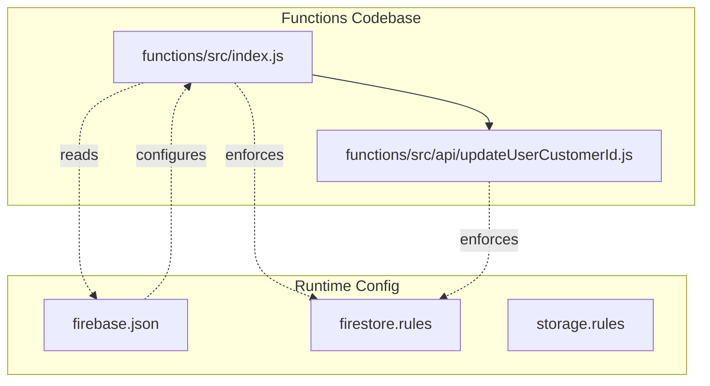
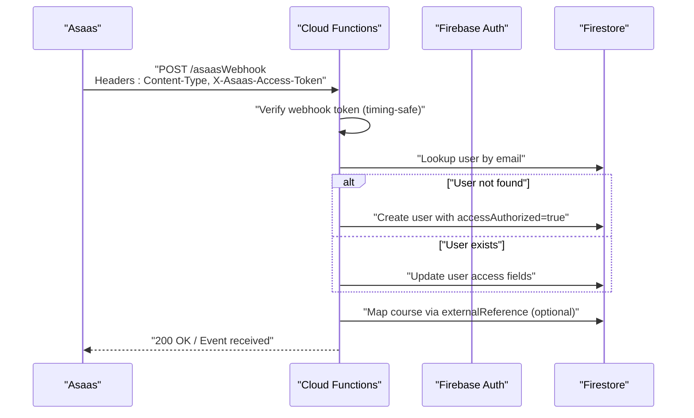
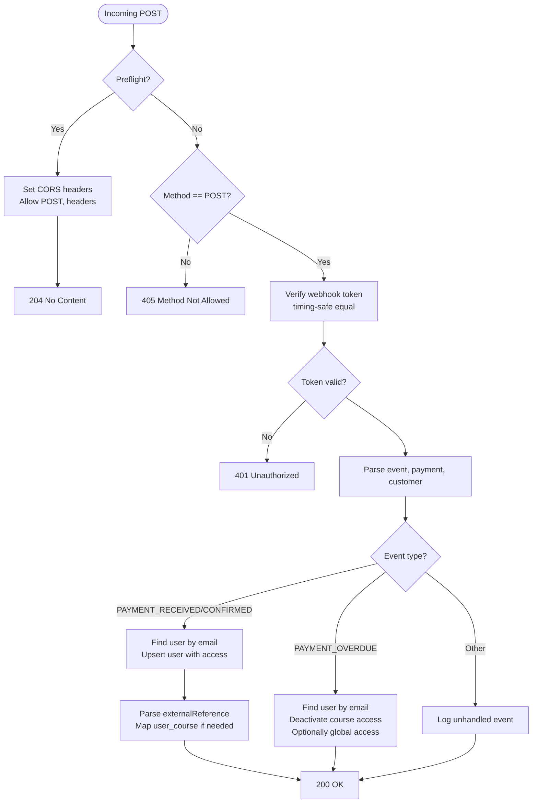
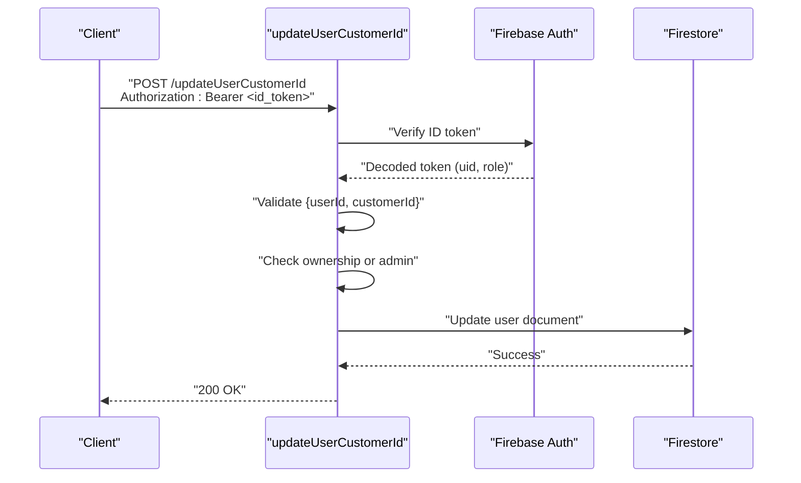
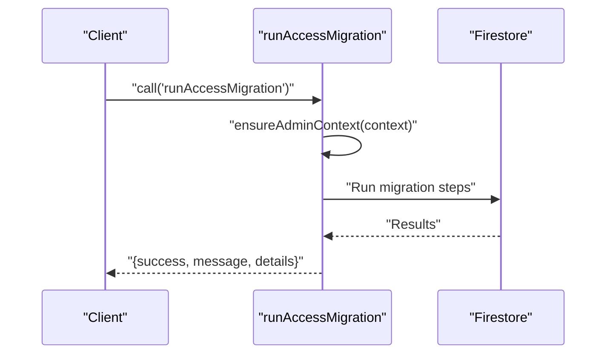
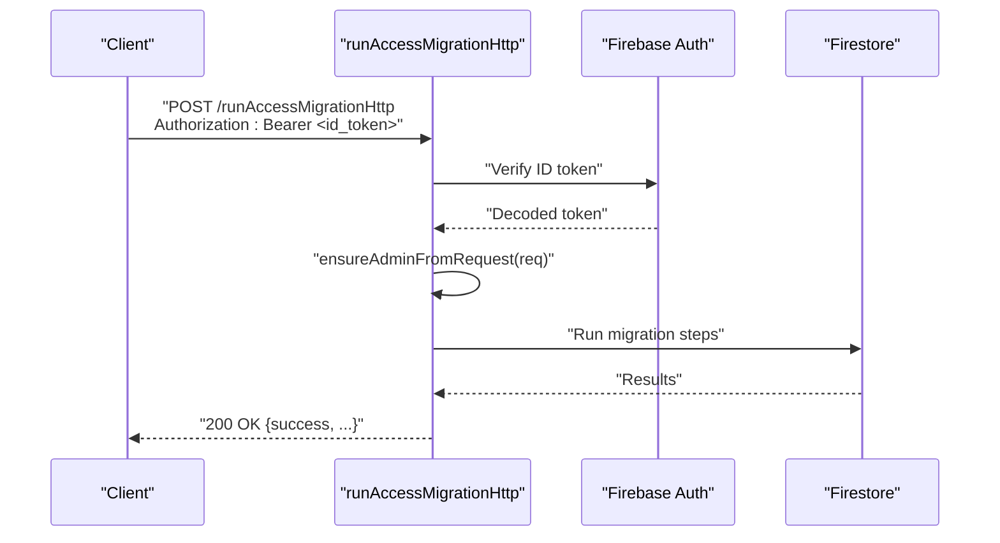
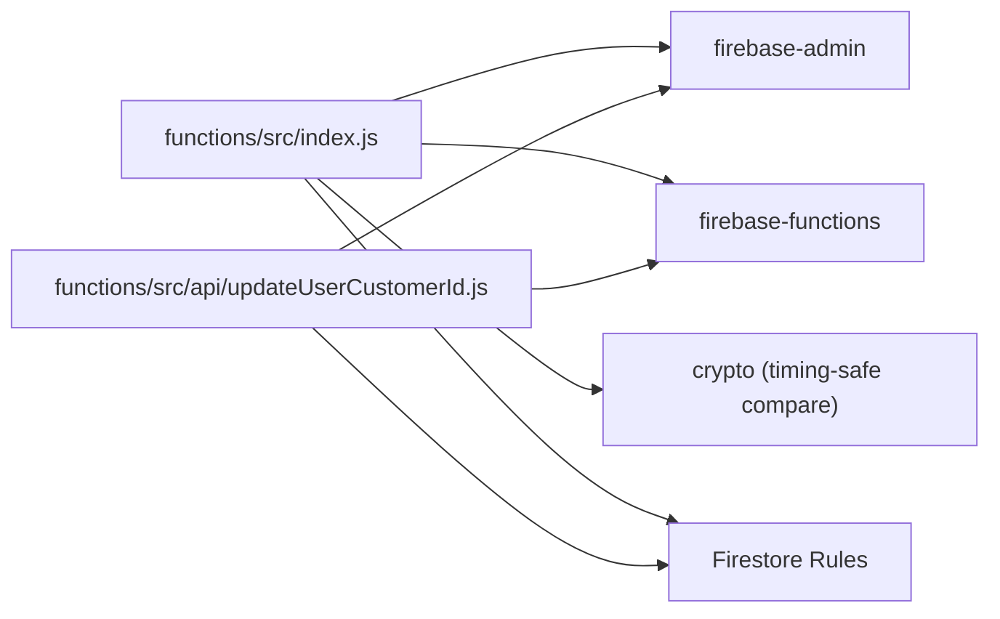

# Firebase Cloud Functions

<cite>
**Referenced Files in This Document**
- [index.js](file://functions/src/index.js)
- [updateUserCustomerId.js](file://functions/src/api/updateUserCustomerId.js)
- [firebase.json](file://firebase.json)
- [firestore.rules](file://firestore.rules)
- [storage.rules](file://storage.rules)
- [functions README](file://functions/README.md)
- [test-asass-webhook.js](file://test-asass-webhook.js)
</cite>

## Table of Contents
1. [Introduction](#introduction)
2. [Project Structure](#project-structure)
3. [Core Components](#core-components)
4. [Architecture Overview](#architecture-overview)
5. [Detailed Component Analysis](#detailed-component-analysis)
6. [Dependency Analysis](#dependency-analysis)
7. [Performance Considerations](#performance-considerations)
8. [Troubleshooting Guide](#troubleshooting-guide)
9. [Conclusion](#conclusion)
10. [Appendices](#appendices)

## Introduction
This document provides comprehensive API documentation for Firebase Cloud Functions in the project. It covers:
- The Asaas webhook endpoint (/asaasWebhook) with HTTP methods, request/response schemas, authentication requirements, and webhook verification process.
- The updateUserCustomerId callable function with parameter validation and error handling.
- The runAccessMigration callable function for administrative data migration with admin context validation and Bearer token authentication fallback.
- Request/response examples, error codes, security considerations, rate limiting, and integration patterns.
- Webhook signature verification, timing-safe comparison, and CORS configuration.

## Project Structure
The Firebase Functions code is organized under the functions directory with a single entry point that exports multiple functions. Supporting API endpoints are modularized under an api subdirectory.

**Diagram sources**
- [index.js](file://functions/src/index.js#L1-L387)
- [updateUserCustomerId.js](file://functions/src/api/updateUserCustomerId.js#L1-L74)
- [firebase.json](file://firebase.json#L1-L20)
- [firestore.rules](file://firestore.rules#L1-L97)
- [storage.rules](file://storage.rules#L1-L11)

**Section sources**
- [index.js](file://functions/src/index.js#L1-L387)
- [updateUserCustomerId.js](file://functions/src/api/updateUserCustomerId.js#L1-L74)
- [firebase.json](file://firebase.json#L1-L20)

## Core Components
- Asaas webhook endpoint: Handles Asaas payment notifications, verifies webhook signatures, and updates user access and course mappings.
- updateUserCustomerId endpoint: Updates a user’s Asaas customer ID with ID token verification and ownership/admin checks.
- runAccessMigration callable: Performs administrative data migration with admin context validation.
- runAccessMigrationHttp fallback: HTTP-based migration endpoint using Bearer token authentication.

**Section sources**
- [index.js](file://functions/src/index.js#L144-L339)
- [index.js](file://functions/src/index.js#L345-L356)
- [index.js](file://functions/src/index.js#L359-L387)
- [updateUserCustomerId.js](file://functions/src/api/updateUserCustomerId.js#L12-L74)

## Architecture Overview
The functions integrate with Firebase Authentication, Firestore, and Asaas. The Asaas webhook endpoint validates incoming requests using a shared secret token and updates user and course access accordingly. The updateUserCustomerId endpoint enforces ID token verification and ownership/admin permissions. Migration endpoints enforce admin-only access via callable context or Bearer tokens.

**Diagram sources**
- [index.js](file://functions/src/index.js#L144-L339)

## Detailed Component Analysis

### Asaas Webhook Endpoint (/asaasWebhook)
- Method: POST
- CORS: Enabled for preflight and POST with allowed headers Content-Type and X-Asaas-Access-Token.
- Authentication: Mandatory webhook token verification using a shared secret stored in Firebase Functions config.
- Request Schema:
  - event: string (PAYMENT_RECEIVED, PAYMENT_CONFIRMED, PAYMENT_OVERDUE)
  - payment: object (id, value, status, externalReference)
  - customer: object (id, name, email)
- Response:
  - 200 OK on successful processing
  - 400 Bad Request if required fields are missing
  - 401 Unauthorized if webhook token verification fails
  - 405 Method Not Allowed for non-POST requests
  - 500 Internal Server Error for server misconfiguration or unhandled errors
- Security:
  - Webhook token verification uses timing-safe comparison to prevent timing attacks.
  - Requires webhook token to be configured in Firebase Functions config; otherwise rejects all requests.
- Integration Patterns:
  - Supports multi-product mapping via externalReference parsing to link user access to specific courses.
  - On overdue payments, deactivates course access and optionally global access if no other active courses remain.

**Diagram sources**
- [index.js](file://functions/src/index.js#L144-L339)

**Section sources**
- [index.js](file://functions/src/index.js#L144-L339)
- [functions README](file://functions/README.md#L47-L61)
- [test-asass-webhook.js](file://test-asass-webhook.js#L14-L40)

### updateUserCustomerId Endpoint
- Method: POST
- CORS: Enabled for preflight and POST with allowed headers Content-Type.
- Authentication: Bearer token verification against Firebase Auth.
- Authorization: Must be the user themselves or an admin.
- Request Schema:
  - Body: { userId: string, customerId: string }
- Response:
  - 200 OK on success
  - 400 Bad Request if missing fields
  - 401 Unauthorized if invalid or missing token
  - 403 Forbidden if attempting to modify another user without admin privileges
  - 500 Internal Server Error for unexpected failures
- Validation:
  - Validates presence of userId and customerId.
  - Enforces ownership or admin role via decoded token claims.

**Diagram sources**
- [updateUserCustomerId.js](file://functions/src/api/updateUserCustomerId.js#L12-L74)

**Section sources**
- [updateUserCustomerId.js](file://functions/src/api/updateUserCustomerId.js#L12-L74)
- [firestore.rules](file://firestore.rules#L24-L29)

### runAccessMigration Callable Function
- Method: Callable (via Firebase Functions SDK)
- Authentication: Requires admin context; throws unauthenticated or permission-denied on failure.
- Request Schema: None (no data payload).
- Response Schema:
  - success: boolean
  - message: string
  - details: object with counts and primary course ID
- Error Handling:
  - Throws HttpsError for known conditions (unauthenticated, permission-denied).
  - Wraps unexpected errors as internal.

**Diagram sources**
- [index.js](file://functions/src/index.js#L345-L356)

**Section sources**
- [index.js](file://functions/src/index.js#L345-L356)

### runAccessMigrationHttp Fallback (HTTP)
- Method: POST
- Authentication: Bearer token verification against Firebase Auth; admin role enforced.
- CORS: Enabled for preflight and POST with allowed headers Content-Type and Authorization.
- Request Schema: None (no body required).
- Response Schema:
  - success: boolean
  - message: string
  - details: object with counts and primary course ID
- Error Handling:
  - Returns structured JSON with success=false and error code/message on failure.

**Diagram sources**
- [index.js](file://functions/src/index.js#L359-L387)

**Section sources**
- [index.js](file://functions/src/index.js#L359-L387)

## Dependency Analysis
- Runtime Dependencies:
  - firebase-admin and firebase-functions are declared in the functions package.
  - Node.js runtime is configured to v20.
- Firestore Rules:
  - Enforce read/write policies for users, courses, mindful_flow, music, student progress, and user_courses collections.
  - Admin-only operations for sensitive collections.
- CORS Configuration:
  - Asaas webhook endpoint allows Content-Type and X-Asaas-Access-Token headers.
  - updateUserCustomerId allows Content-Type.
  - runAccessMigrationHttp allows Content-Type and Authorization.

**Diagram sources**
- [index.js](file://functions/src/index.js#L1-L387)
- [updateUserCustomerId.js](file://functions/src/api/updateUserCustomerId.js#L1-L74)
- [firebase.json](file://firebase.json#L16-L18)

**Section sources**
- [firebase.json](file://firebase.json#L1-L20)
- [firestore.rules](file://firestore.rules#L1-L97)

## Performance Considerations
- Timing-Safe Comparison: Webhook token verification uses crypto.timingSafeEqual to mitigate timing attacks.
- Minimal Firestore Writes: Batch operations are not used; updates occur per user/course mapping as needed.
- External Reference Parsing: Efficient regex and JSON parsing to extract courseId from externalReference.
- CORS Preflight: Preflight requests are handled quickly to reduce latency for cross-origin requests.

[No sources needed since this section provides general guidance]

## Troubleshooting Guide
- Webhook Signature Verification Failures:
  - Ensure asaas.webhook_token is configured in Firebase Functions config.
  - Verify the X-Asaas-Access-Token header matches the configured token length and value.
- Unauthorized Access:
  - For updateUserCustomerId, confirm Authorization header starts with Bearer and contains a valid ID token.
  - For migration endpoints, ensure the user has admin role or callable context.
- CORS Issues:
  - Confirm allowed methods and headers match the request (Content-Type, X-Asaas-Access-Token for webhook; Authorization for migration).
- Testing:
  - Use the provided test script to simulate webhook events locally and verify behavior.

**Section sources**
- [index.js](file://functions/src/index.js#L160-L179)
- [updateUserCustomerId.js](file://functions/src/api/updateUserCustomerId.js#L28-L45)
- [functions README](file://functions/README.md#L47-L61)
- [test-asass-webhook.js](file://test-asass-webhook.js#L1-L81)

## Conclusion
The Firebase Cloud Functions implement secure, robust integrations with Asaas and Firebase services. The Asaas webhook endpoint enforces strict signature verification and updates user access and course mappings. The updateUserCustomerId endpoint validates ownership and admin privileges. Migration endpoints provide admin-only access via callable context or Bearer token fallback, with comprehensive CORS support and error handling.

[No sources needed since this section summarizes without analyzing specific files]

## Appendices

### API Definitions

- Asaas Webhook Endpoint
  - Path: /asaasWebhook
  - Methods: POST
  - Headers:
    - Content-Type: application/json
    - X-Asaas-Access-Token: webhook token (required)
  - Request Body:
    - event: string
    - payment: object with id, value, status, externalReference
    - customer: object with id, name, email
  - Responses:
    - 200 OK: Event received
    - 400 Bad Request: Missing email in customer data
    - 401 Unauthorized: Invalid or missing webhook token
    - 405 Method Not Allowed: Non-POST method
    - 500 Internal Server Error: Server misconfiguration or unhandled error

- updateUserCustomerId Endpoint
  - Path: /updateUserCustomerId
  - Methods: POST
  - Headers:
    - Content-Type: application/json
    - Authorization: Bearer <id_token>
  - Request Body:
    - userId: string
    - customerId: string
  - Responses:
    - 200 OK: Customer ID updated successfully
    - 400 Bad Request: Missing userId or customerId
    - 401 Unauthorized: Invalid or missing token
    - 403 Forbidden: Attempting to modify another user without admin privileges
    - 500 Internal Server Error: Unexpected failure

- runAccessMigration Callable
  - Name: runAccessMigration
  - Call Type: Callable
  - Authentication: Admin context required
  - Request: None
  - Response:
    - success: boolean
    - message: string
    - details: object with counts and primary course ID

- runAccessMigrationHttp Fallback
  - Path: /runAccessMigrationHttp
  - Methods: POST
  - Headers:
    - Content-Type: application/json
    - Authorization: Bearer <id_token>
  - Request: None
  - Response:
    - success: boolean
    - message: string
    - details: object with counts and primary course ID

**Section sources**
- [index.js](file://functions/src/index.js#L144-L339)
- [updateUserCustomerId.js](file://functions/src/api/updateUserCustomerId.js#L12-L74)
- [index.js](file://functions/src/index.js#L345-L356)
- [index.js](file://functions/src/index.js#L359-L387)

### Security Considerations
- Webhook Token Verification:
  - Uses crypto.timingSafeEqual for constant-time comparison.
  - Requires webhook token to be configured; otherwise rejects all requests.
- ID Token Verification:
  - updateUserCustomerId validates Bearer tokens against Firebase Auth.
- Admin Validation:
  - Both callable and HTTP migration endpoints enforce admin-only access.
- CORS:
  - Strictly scoped allowed methods and headers to minimize attack surface.

**Section sources**
- [index.js](file://functions/src/index.js#L160-L179)
- [updateUserCustomerId.js](file://functions/src/api/updateUserCustomerId.js#L28-L45)
- [index.js](file://functions/src/index.js#L10-L19)
- [index.js](file://functions/src/index.js#L21-L41)

### Rate Limiting
- No explicit rate limiting is implemented in the functions. Consider adding rate limiting at the ingress (e.g., CDN or load balancer) or within the functions if traffic spikes are anticipated.

[No sources needed since this section provides general guidance]

### Integration Patterns
- Asaas Webhook:
  - Configure webhook URL in Asaas to point to the deployed function.
  - Enable webhook token verification by setting asaas.webhook_token in Firebase Functions config.
- updateUserCustomerId:
  - Clients should obtain a valid ID token and include Authorization: Bearer <id_token>.
- Migration:
  - Prefer callable for client-side integration; use HTTP fallback if callable auth fails.

**Section sources**
- [functions README](file://functions/README.md#L18-L27)
- [functions README](file://functions/README.md#L47-L61)