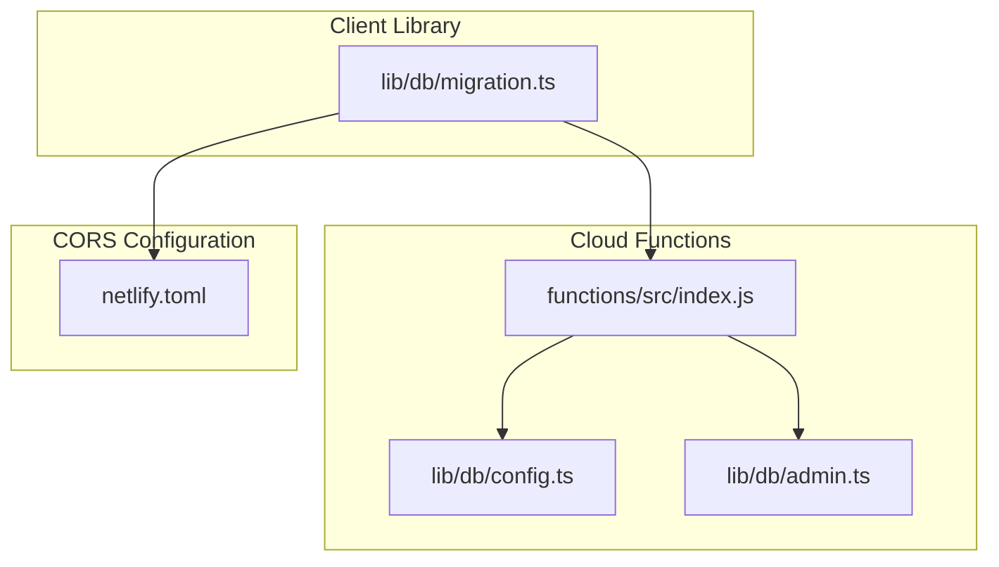
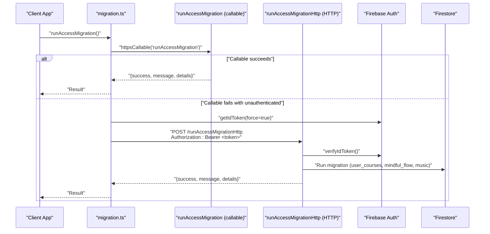
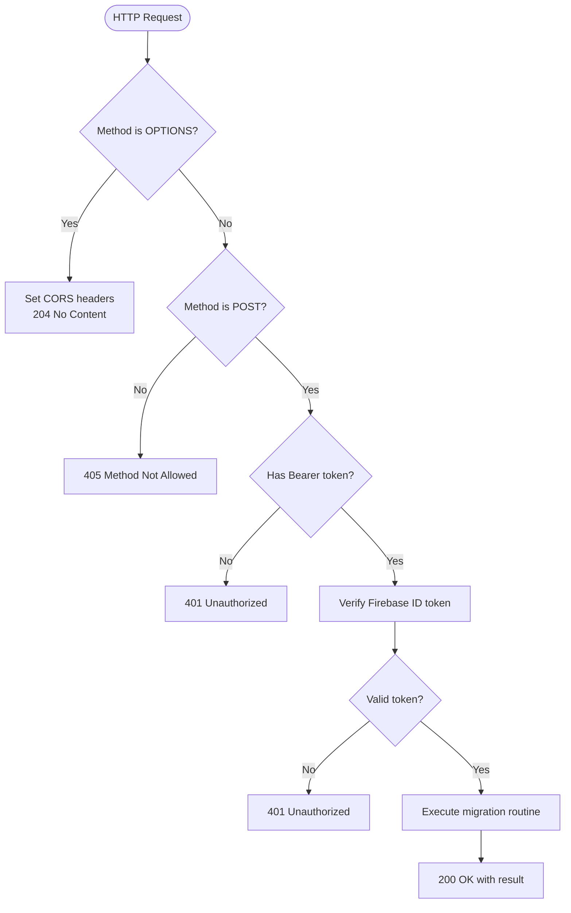
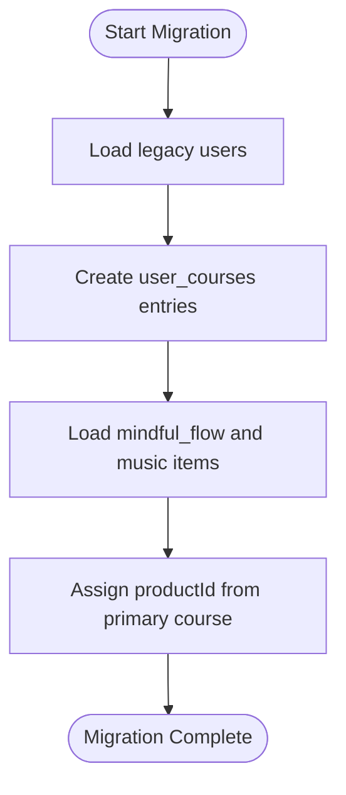
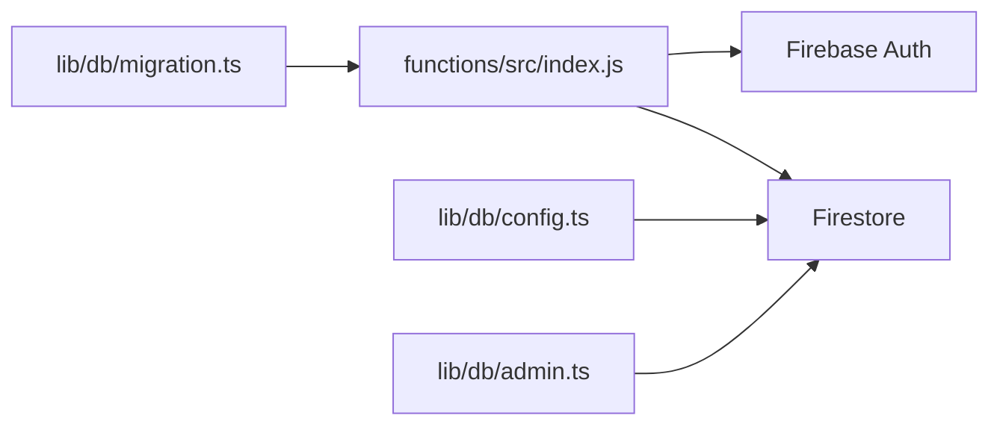

# HTTP Migration Endpoints

<cite>
**Referenced Files in This Document**
- [index.js](file://functions/src/index.js)
- [migration.ts](file://lib/db/migration.ts)
- [config.ts](file://lib/db/config.ts)
- [admin.ts](file://lib/db/admin.ts)
- [implementation_plan.md](file://implementation_plan.md)
- [netlify.toml](file://netlify.toml)
</cite>

## Table of Contents
1. [Introduction](#introduction)
2. [Project Structure](#project-structure)
3. [Core Components](#core-components)
4. [Architecture Overview](#architecture-overview)
5. [Detailed Component Analysis](#detailed-component-analysis)
6. [Dependency Analysis](#dependency-analysis)
7. [Performance Considerations](#performance-considerations)
8. [Troubleshooting Guide](#troubleshooting-guide)
9. [Conclusion](#conclusion)

## Introduction
This document describes the HTTP migration endpoints designed to support administrative data migration tasks with explicit Bearer token authentication and CORS preflight handling. It focuses on the runAccessMigrationHttp endpoint, detailing how it validates admin credentials, handles CORS preflight requests, and executes a one-time migration of legacy data. The migration process includes creating user_courses entries for existing users and assigning productId values to mindful_flow and music items based on the primary course. The document also outlines error handling strategies, status codes, and fallback authentication mechanisms.

## Project Structure
The migration functionality spans two layers:
- Frontend integration and fallback logic in the client library
- Backend Cloud Functions implementing the callable and HTTP endpoints

**Diagram sources**
- [migration.ts](file://lib/db/migration.ts#L1-L64)
- [index.js](file://functions/src/index.js#L1-L387)
- [config.ts](file://lib/db/config.ts#L1-L19)
- [admin.ts](file://lib/db/admin.ts#L1-L307)
- [netlify.toml](file://netlify.toml#L1-L65)

**Section sources**
- [migration.ts](file://lib/db/migration.ts#L1-L64)
- [index.js](file://functions/src/index.js#L1-L387)
- [config.ts](file://lib/db/config.ts#L1-L19)
- [admin.ts](file://lib/db/admin.ts#L1-L307)
- [netlify.toml](file://netlify.toml#L1-L65)

## Core Components
- runAccessMigrationHttp: An HTTP Cloud Function that accepts POST requests with Bearer token authentication and performs the migration workflow.
- runAccessMigration: A callable Cloud Function used as the primary migration trigger; it enforces admin-only access via the Admin SDK.
- Frontend fallback: A client-side migration orchestrator that attempts the callable first and falls back to the HTTP endpoint when authentication fails.
- CORS configuration: Global headers and function-level CORS handling to support cross-origin requests and preflight OPTIONS.

Key behaviors:
- Authentication: Validates Authorization header presence and Bearer token format; verifies tokens against Firebase Auth.
- CORS: Allows POST with Content-Type and Authorization headers; responds to preflight OPTIONS with appropriate headers and 204 status.
- Migration: Creates user_courses entries for legacy users and assigns productId to mindful_flow and music items based on the primary course.

**Section sources**
- [index.js](file://functions/src/index.js#L358-L387)
- [migration.ts](file://lib/db/migration.ts#L4-L63)
- [netlify.toml](file://netlify.toml#L39-L47)

## Architecture Overview
The migration flow integrates client-side orchestration with backend Cloud Functions and Firestore collections.

**Diagram sources**
- [migration.ts](file://lib/db/migration.ts#L4-L63)
- [index.js](file://functions/src/index.js#L344-L387)

## Detailed Component Analysis

### HTTP Migration Endpoint: runAccessMigrationHttp
Purpose:
- Provide a POST-only endpoint for administrators to trigger the migration workflow when callable authentication is unreliable.
- Enforce CORS preflight handling and explicit Bearer token verification.

Behavior:
- Preflight handling: Responds to OPTIONS with Access-Control-Allow-Origin, Access-Control-Allow-Methods, Access-Control-Allow-Headers, and 204 status.
- Method enforcement: Rejects non-POST requests with 405.
- Authentication: Requires Authorization header with Bearer token; verifies token via Firebase Auth; returns 401 for invalid or missing tokens.
- Migration execution: Calls the shared migration routine and returns 200 with structured results.
- Error mapping: Converts HttpsError codes to appropriate HTTP statuses (401, 403, 500).

**Diagram sources**
- [index.js](file://functions/src/index.js#L358-L387)

**Section sources**
- [index.js](file://functions/src/index.js#L358-L387)

### Callable Migration Endpoint: runAccessMigration
Purpose:
- Primary migration trigger using the Admin SDK to enforce admin-only access.
- Wraps migration logic and translates errors to standardized HttpsError instances.

Behavior:
- Admin verification: Ensures caller is authenticated and has admin role.
- Execution: Invokes the shared migration routine.
- Error handling: Propagates HttpsError codes; maps permission-denied to 403, unauthenticated to 401, and internal to 500.

**Section sources**
- [index.js](file://functions/src/index.js#L344-L356)

### Frontend Fallback Orchestration: runAccessMigration
Purpose:
- Attempt callable migration first; if unauthenticated, construct and send an explicit HTTP request with a fresh ID token.

Behavior:
- Callable invocation: Uses httpsCallable('runAccessMigration').
- Fallback path: On unauthenticated error, obtains a fresh ID token, builds the HTTP endpoint URL, and sends a POST with Authorization: Bearer.
- Status mapping: Interprets HTTP responses and error codes to user-friendly messages.

**Section sources**
- [migration.ts](file://lib/db/migration.ts#L4-L63)

### Migration Process Details
The migration routine creates user_courses entries for legacy users and assigns productId to mindful_flow and music items based on the primary course. These behaviors are defined in the implementation plan and enforced by the backend migration function.

- Legacy users: Create user_courses entries for each existing course to grant access.
- Product association: Assign productId to mindful_flow and music items based on the primary course.
- Collection names: user_courses, mindful_flow, music, courses.

**Diagram sources**
- [implementation_plan.md](file://implementation_plan.md#L171-L177)
- [config.ts](file://lib/db/config.ts#L11-L18)

**Section sources**
- [implementation_plan.md](file://implementation_plan.md#L171-L177)
- [config.ts](file://lib/db/config.ts#L11-L18)

### CORS Configuration
Global headers:
- Content-Security-Policy, X-Frame-Options, X-Content-Type-Options, Strict-Transport-Security, Referrer-Policy are applied to all routes.

Function-level CORS:
- runAccessMigrationHttp sets Access-Control-Allow-Origin, Access-Control-Allow-Methods, and Access-Control-Allow-Headers for preflight and actual requests.

Note: While the global headers do not explicitly list the migration endpoint path, the function-level CORS ensures cross-origin POST requests with Content-Type and Authorization are permitted.

**Section sources**
- [netlify.toml](file://netlify.toml#L39-L47)
- [index.js](file://functions/src/index.js#L358-L366)

## Dependency Analysis
The migration endpoints depend on:
- Firebase Auth for token verification
- Firestore for reading and writing user_courses, mindful_flow, music, and courses
- Shared migration logic encapsulated in the backend

**Diagram sources**
- [migration.ts](file://lib/db/migration.ts#L1-L64)
- [index.js](file://functions/src/index.js#L1-L387)
- [config.ts](file://lib/db/config.ts#L1-L19)
- [admin.ts](file://lib/db/admin.ts#L1-L307)

**Section sources**
- [migration.ts](file://lib/db/migration.ts#L1-L64)
- [index.js](file://functions/src/index.js#L1-L387)
- [config.ts](file://lib/db/config.ts#L1-L19)
- [admin.ts](file://lib/db/admin.ts#L1-L307)

## Performance Considerations
- Token verification adds latency; ensure clients reuse tokens when possible and avoid unnecessary retries.
- Batch operations: Group Firestore writes where feasible to reduce round trips during migration.
- Network reliability: The fallback mechanism retries via HTTP with a fresh token, improving resilience in constrained environments.

## Troubleshooting Guide
Common issues and resolutions:
- 401 Unauthorized (missing or invalid token): Ensure Authorization header includes a valid Bearer token issued by Firebase Auth.
- 403 Forbidden (permission denied): Confirm the user has admin role in Firestore; callable migration requires admin-only access.
- 405 Method Not Allowed: Use POST for the migration endpoint; preflight OPTIONS is handled automatically.
- 500 Internal Server Error: Inspect Cloud Function logs; verify environment variables and Firestore permissions.
- CORS failures: Confirm the browser sends Authorization and Content-Type headers; verify function-level CORS headers are applied.

Integration tips:
- Use the frontend fallback to transparently handle authentication failures and retry via HTTP.
- For manual admin verification, ensure the admin user exists in Firestore with role set to admin.

**Section sources**
- [index.js](file://functions/src/index.js#L358-L387)
- [migration.ts](file://lib/db/migration.ts#L14-L63)

## Conclusion
The HTTP migration endpoints provide a robust, authenticated, and CORS-enabled pathway for administrators to migrate legacy data. The callable endpoint offers streamlined admin-only access, while the HTTP endpoint serves as a reliable fallback with explicit Bearer token authentication and preflight handling. Together, they ensure successful migration of user_courses and product associations for mindful_flow and music items, with clear error handling and status mapping.