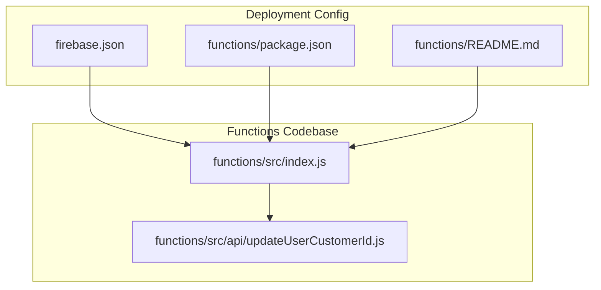
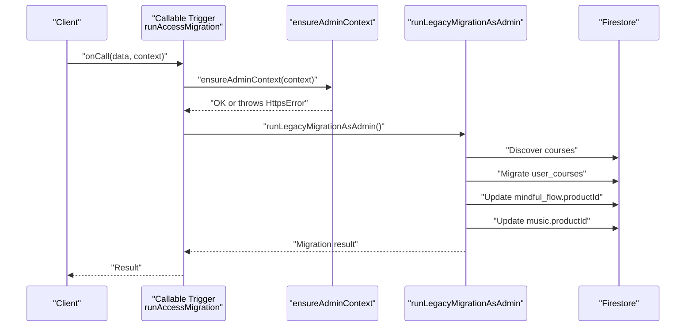
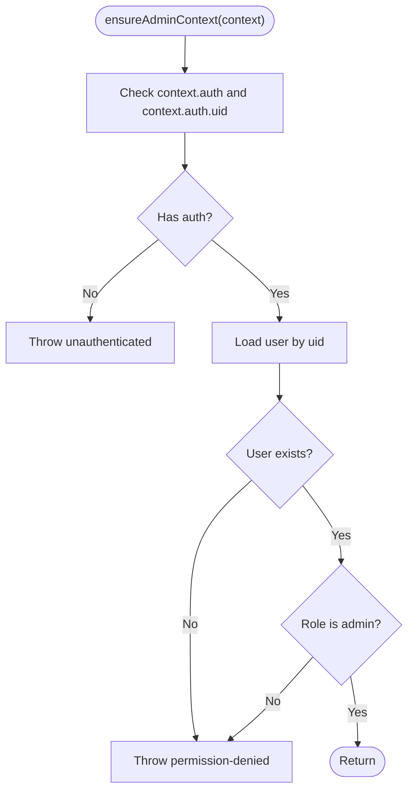
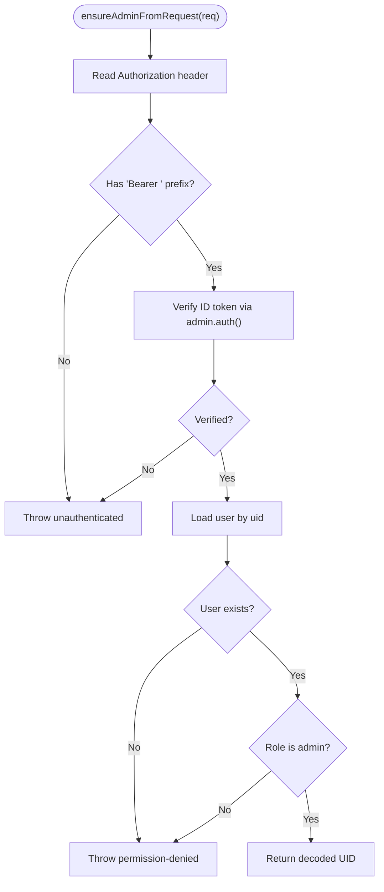
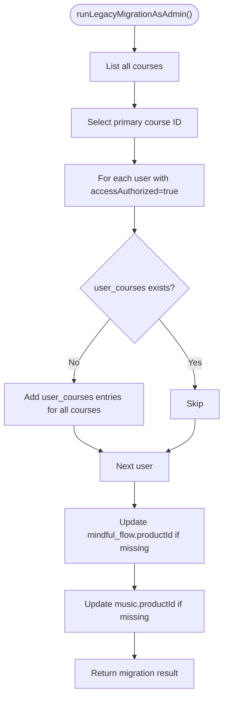
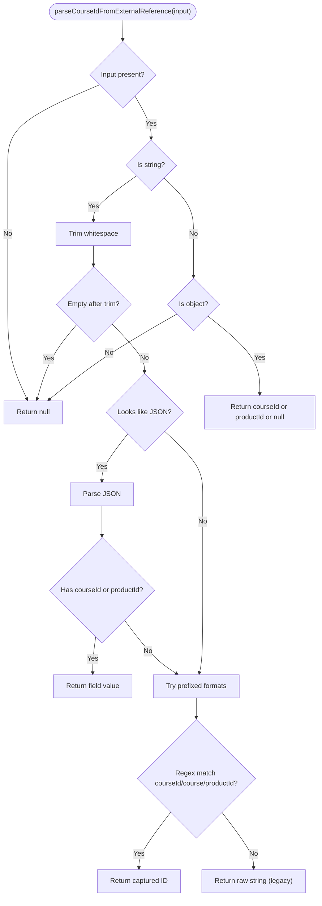
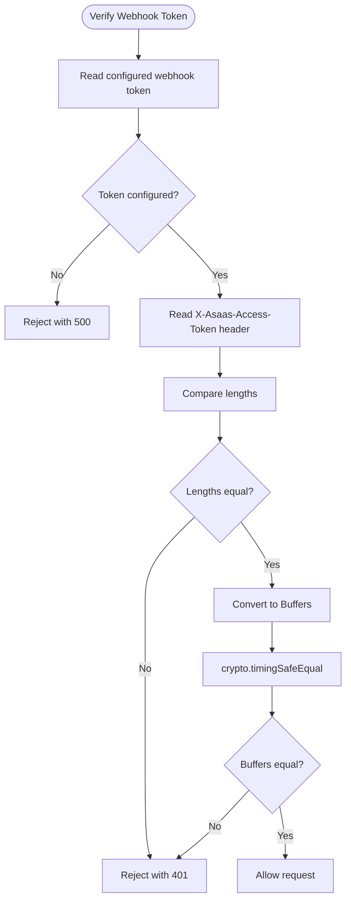
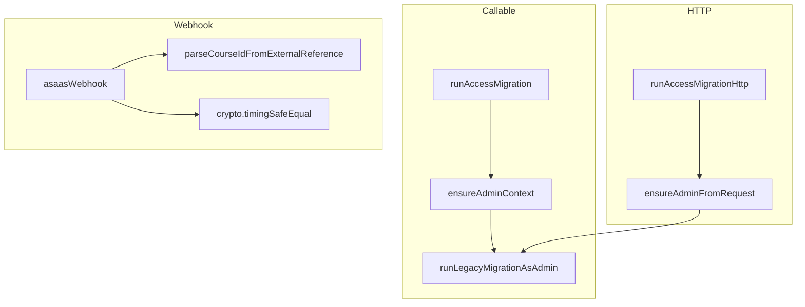
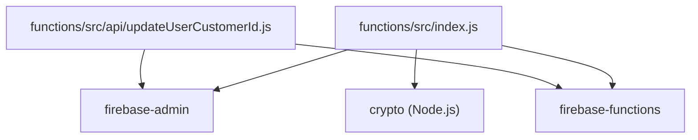

# Utility Functions

<cite>
**Referenced Files in This Document**
- [functions/src/index.js](file://functions/src/index.js)
- [functions/src/api/updateUserCustomerId.js](file://functions/src/api/updateUserCustomerId.js)
- [functions/README.md](file://functions/README.md)
- [functions/package.json](file://functions/package.json)
- [firebase.json](file://firebase.json)
</cite>

## Table of Contents
1. [Introduction](#introduction)
2. [Project Structure](#project-structure)
3. [Core Components](#core-components)
4. [Architecture Overview](#architecture-overview)
5. [Detailed Component Analysis](#detailed-component-analysis)
6. [Dependency Analysis](#dependency-analysis)
7. [Performance Considerations](#performance-considerations)
8. [Troubleshooting Guide](#troubleshooting-guide)
9. [Conclusion](#conclusion)

## Introduction
This document describes utility functions used across Firebase Cloud Functions in the project. It focuses on:
- Context-based admin validation
- Bearer token authentication
- Comprehensive data migration executed as admin
- Course ID extraction from external references with support for JSON payloads, prefixed formats, and backward compatibility
- Timing-safe comparison using crypto.timingSafeEqual
- Integration patterns with other Firebase functions

These utilities are implemented in the Firebase Cloud Functions codebase and are used by HTTP and callable triggers to enforce admin-only operations and to migrate legacy data consistently.

## Project Structure
The Firebase Functions code resides under the functions directory. The main entry point defines shared utilities and HTTP/callable triggers. An auxiliary API endpoint is located under functions/src/api.

**Diagram sources**
- [functions/src/index.js](file://functions/src/index.js#L1-L387)
- [functions/src/api/updateUserCustomerId.js](file://functions/src/api/updateUserCustomerId.js#L1-L74)
- [firebase.json](file://firebase.json#L1-L20)
- [functions/package.json](file://functions/package.json#L1-L25)
- [functions/README.md](file://functions/README.md#L1-L61)

**Section sources**
- [firebase.json](file://firebase.json#L1-L20)
- [functions/package.json](file://functions/package.json#L1-L25)
- [functions/README.md](file://functions/README.md#L1-L61)

## Core Components
This section documents the four key utility functions and related helpers used across Firebase Cloud Functions.

- ensureAdminContext(context)
  - Purpose: Validates that the caller is authenticated and has admin role using the Cloud Functions context.
  - Parameters:
    - context: Cloud Functions HTTPS context object containing auth information.
  - Returns: None (throws on failure).
  - Errors:
    - Unauthenticated if context.auth or context.auth.uid is missing.
    - Permission denied if the user is not an admin.
  - Integration: Used by callable triggers to guard sensitive operations.

- ensureAdminFromRequest(req)
  - Purpose: Validates admin privileges using an Authorization Bearer token from HTTP requests.
  - Parameters:
    - req: HTTP request object with headers.
  - Returns: The decoded UID string upon successful validation.
  - Errors:
    - Unauthenticated if Authorization header is missing or invalid.
    - Permission denied if the user is not an admin.
  - Integration: Used by HTTP triggers to guard sensitive operations.

- runLegacyMigrationAsAdmin()
  - Purpose: Performs a comprehensive migration of legacy data structures to align with current schema and relationships.
  - Parameters: None.
  - Returns: Migration result object with counts and details.
  - Errors: Propagates internal errors as HTTP errors.
  - Integration: Called by both callable and HTTP triggers after admin validation.

- parseCourseIdFromExternalReference(externalReference)
  - Purpose: Extracts a course identifier from various external reference formats.
  - Parameters:
    - externalReference: String or object containing course reference data.
  - Returns: Course ID string or null if unparseable.
  - Supported formats:
    - JSON payload: {"courseId":"..."} or {"productId":"..."}
    - Prefixed formats: courseId:abc123 or course=abc123
    - Raw string fallback (legacy behavior)
  - Integration: Used by webhook handlers to map payments to specific courses.

- Timing-Safe Comparison
  - Purpose: Compares webhook tokens securely to prevent timing attacks.
  - Implementation: Uses crypto.timingSafeEqual with Buffers.
  - Integration: Used in webhook signature verification.

**Section sources**
- [functions/src/index.js](file://functions/src/index.js#L10-L138)
- [functions/src/index.js](file://functions/src/index.js#L172-L175)

## Architecture Overview
The Cloud Functions runtime initializes Firebase Admin and exposes two primary entry points:
- Callable trigger: runAccessMigration
- HTTP trigger: runAccessMigrationHttp

Both triggers validate admin credentials using the shared utilities and then execute the migration routine. The migration function discovers courses, migrates legacy access records, and updates product identifiers for mindful flow and music collections.

**Diagram sources**
- [functions/src/index.js](file://functions/src/index.js#L344-L356)
- [functions/src/index.js](file://functions/src/index.js#L10-L19)
- [functions/src/index.js](file://functions/src/index.js#L43-L104)

## Detailed Component Analysis

### ensureAdminContext(context)
- Purpose: Enforce admin-only access for callable functions.
- Validation steps:
  - Checks presence of context.auth and context.auth.uid.
  - Fetches user document by UID and verifies role equals admin.
- Throws:
  - Unauthenticated for missing auth info.
  - Permission denied for non-admin users.
- Usage: Guard callable triggers that perform destructive or privileged operations.

**Diagram sources**
- [functions/src/index.js](file://functions/src/index.js#L10-L19)

**Section sources**
- [functions/src/index.js](file://functions/src/index.js#L10-L19)

### ensureAdminFromRequest(req)
- Purpose: Enforce admin-only access for HTTP functions using Bearer tokens.
- Validation steps:
  - Reads Authorization header and ensures it starts with "Bearer ".
  - Verifies the ID token against Firebase Auth.
  - Loads user document and checks role equals admin.
- Returns: Decoded UID string on success.
- Throws:
  - Unauthenticated for missing/invalid token or verification failure.
  - Permission denied for non-admin users.

**Diagram sources**
- [functions/src/index.js](file://functions/src/index.js#L21-L41)

**Section sources**
- [functions/src/index.js](file://functions/src/index.js#L21-L41)

### runLegacyMigrationAsAdmin()
- Purpose: Migrate legacy data to align with current schema and relationships.
- Steps:
  - Discover courses and select a primary course ID.
  - Migrate legacy authorized users into user_courses entries for all courses.
  - Update mindful_flow items missing productId to primary course ID.
  - Update music items missing productId to primary course ID.
- Returns: Object with success flag, message, and counts/details.
- Errors: Wrapped as HTTP errors by callers.

**Diagram sources**
- [functions/src/index.js](file://functions/src/index.js#L43-L104)

**Section sources**
- [functions/src/index.js](file://functions/src/index.js#L43-L104)

### parseCourseIdFromExternalReference(externalReference)
- Purpose: Extract a course ID from externalReference in multiple supported formats.
- Supported formats:
  - JSON payload: {"courseId":"..."} or {"productId":"..."}
  - Prefixed formats: courseId:abc123 or course=abc123
  - Raw string fallback (legacy behavior)
- Behavior:
  - Returns null for empty or invalid inputs.
  - Attempts JSON parsing first; falls back to regex match if parsing fails.
  - Returns the extracted ID or the raw string if no format matched.
- Integration: Used by webhook handlers to map payments to specific courses.

**Diagram sources**
- [functions/src/index.js](file://functions/src/index.js#L106-L138)

**Section sources**
- [functions/src/index.js](file://functions/src/index.js#L106-L138)

### Timing-Safe Comparison with crypto.timingSafeEqual
- Purpose: Securely compare webhook tokens to prevent timing attacks.
- Implementation:
  - Ensures both sides are buffers.
  - Uses crypto.timingSafeEqual to compare token bytes.
- Integration: Used in webhook signature verification to reject invalid tokens.

**Diagram sources**
- [functions/src/index.js](file://functions/src/index.js#L162-L179)

**Section sources**
- [functions/src/index.js](file://functions/src/index.js#L162-L179)

### Integration Patterns with Other Firebase Functions
- Callable Migration Trigger
  - Exposed as runAccessMigration.
  - Guards with ensureAdminContext before invoking runLegacyMigrationAsAdmin.
  - Returns structured result or throws HttpsError.

- HTTP Migration Trigger
  - Exposed as runAccessMigrationHttp.
  - Guards with ensureAdminFromRequest before invoking runLegacyMigrationAsAdmin.
  - Supports CORS preflight and returns JSON error responses with appropriate status codes.

- Asaas Webhook Integration
  - Uses parseCourseIdFromExternalReference to map payments to specific courses.
  - Applies timing-safe comparison for webhook signature verification.
  - Creates or updates user_courses entries based on payment events.

**Diagram sources**
- [functions/src/index.js](file://functions/src/index.js#L344-L387)
- [functions/src/index.js](file://functions/src/index.js#L106-L138)
- [functions/src/index.js](file://functions/src/index.js#L162-L179)

**Section sources**
- [functions/src/index.js](file://functions/src/index.js#L344-L387)
- [functions/src/index.js](file://functions/src/index.js#L144-L339)

## Dependency Analysis
- Runtime Dependencies
  - firebase-admin: Provides Firestore and Auth APIs.
  - firebase-functions: Exposes Cloud Functions framework and HttpsError.
  - crypto: Built-in Node.js module for timing-safe comparisons.
- Deployment Configuration
  - firebase.json specifies the functions codebase and ignore patterns.
  - functions/package.json defines Node.js engine and dependencies.

**Diagram sources**
- [functions/src/index.js](file://functions/src/index.js#L1-L3)
- [functions/src/api/updateUserCustomerId.js](file://functions/src/api/updateUserCustomerId.js#L1-L2)
- [functions/package.json](file://functions/package.json#L16-L19)

**Section sources**
- [functions/package.json](file://functions/package.json#L16-L19)
- [firebase.json](file://firebase.json#L8-L18)

## Performance Considerations
- Migration Efficiency
  - Batch operations: Consider batching writes for user_courses creation to reduce transaction overhead.
  - Indexing: Ensure Firestore indexes exist for queries used during migration (e.g., user_courses.userId, user_courses.courseId).
- Token Verification
  - Length check short-circuits early to avoid unnecessary buffer conversion.
  - timingSafeEqual prevents timing leaks while maintaining constant-time comparison.
- Course ID Parsing
  - Prefer JSON payloads when available for predictable extraction.
  - Regex matching is efficient but ensure patterns remain minimal and non-backtracking.

## Troubleshooting Guide
- Admin Validation Failures
  - Unauthenticated: Verify Authorization header format and token validity.
  - Permission Denied: Confirm user role is admin in Firestore users collection.
- Migration Errors
  - Internal errors: Inspect logs for detailed stack traces; callers wrap unexpected errors as HTTP errors.
- Webhook Signature Verification
  - Misconfigured webhook token: Ensure asaas.webhook_token is set in Firebase Functions config.
  - Unauthorized: Verify the X-Asaas-Access-Token header matches the configured token length and value.
- Course ID Extraction Issues
  - Unexpected nulls: Validate externalReference format; ensure JSON payloads are well-formed and contain courseId or productId.

**Section sources**
- [functions/src/index.js](file://functions/src/index.js#L10-L19)
- [functions/src/index.js](file://functions/src/index.js#L21-L41)
- [functions/src/index.js](file://functions/src/index.js#L344-L387)
- [functions/src/index.js](file://functions/src/index.js#L162-L179)
- [functions/src/index.js](file://functions/src/index.js#L106-L138)

## Conclusion
The utility functions provide robust admin validation, secure token verification, comprehensive data migration, and flexible course ID parsing. They integrate seamlessly with callable and HTTP triggers, enabling safe and reliable administrative operations within the Firebase Cloud Functions environment. Proper configuration and adherence to the documented patterns ensure secure and efficient execution of privileged tasks.