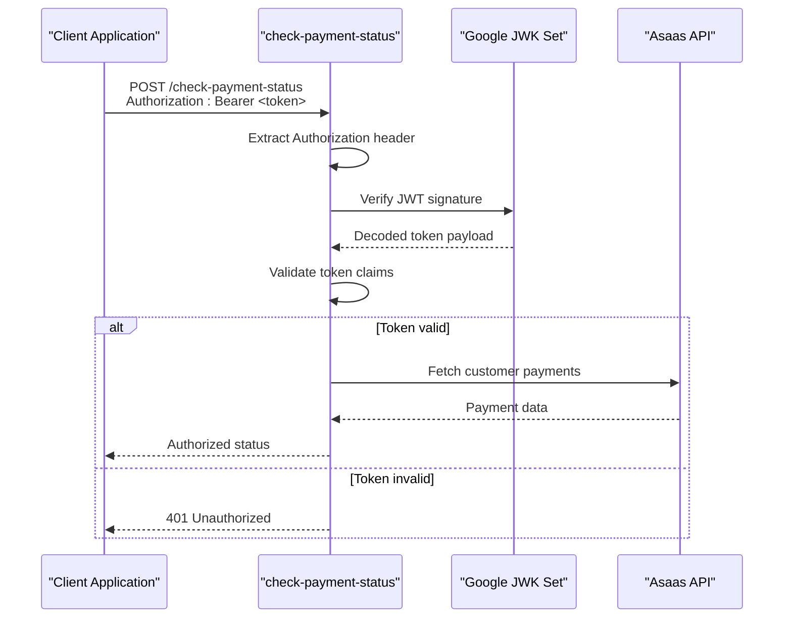
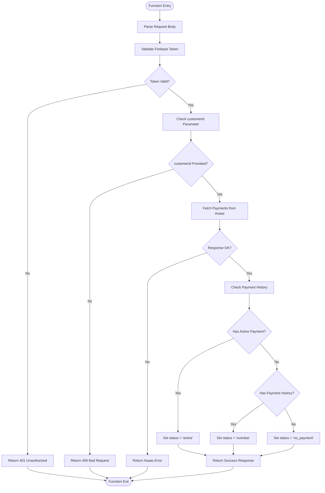

# Check Payment Status Function

<cite>
**Referenced Files in This Document**
- [check-payment-status.js](file://netlify/functions/check-payment-status.js)
- [firebase.ts](file://lib/firebase.ts)
- [asaas.ts](file://lib/db/asaas.ts)
- [AsaasPayment.tsx](file://components/AsaasPayment.tsx)
- [netlify.toml](file://netlify.toml)
</cite>

## Table of Contents
1. [Introduction](#introduction)
2. [API Endpoint Specification](#api-endpoint-specification)
3. [Authentication Flow](#authentication-flow)
4. [Request Parameters](#request-parameters)
5. [Response Schema](#response-schema)
6. [Payment Status Logic](#payment-status-logic)
7. [Error Handling](#error-handling)
8. [Integration Examples](#integration-examples)
9. [Security Considerations](#security-considerations)
10. [Troubleshooting Guide](#troubleshooting-guide)
11. [Conclusion](#conclusion)

## Introduction

The check-payment-status function is a Netlify serverless function that validates Firebase authentication tokens and checks Asaas payment status for customers. This API endpoint serves as a bridge between client applications and the Asaas payment system, providing real-time payment validation for subscription-based access control.

The function implements robust authentication using Google's JWK (JSON Web Key) set for JWT verification, ensuring secure token validation before processing payment requests. It integrates seamlessly with the Asaas payment platform to determine customer authorization status based on payment history and due dates.

## API Endpoint Specification

### Endpoint Details
- **Method**: POST
- **URL**: `/.netlify/functions/check-payment-status`
- **Content-Type**: application/json
- **Authentication**: Required (Bearer Token)

### CORS Configuration
The function supports cross-origin requests with the following configuration:
- Access-Control-Allow-Origin: *
- Access-Control-Allow-Headers: Content-Type, Authorization
- Access-Control-Allow-Methods: POST, OPTIONS

**Section sources**
- [check-payment-status.js](file://netlify/functions/check-payment-status.js#L20-L32)
- [netlify.toml](file://netlify.toml#L39-L46)

## Authentication Flow

### Firebase JWT Verification Process

The authentication flow follows these steps:



**Diagram sources**
- [check-payment-status.js](file://netlify/functions/check-payment-status.js#L6-L18)
- [check-payment-status.js](file://netlify/functions/check-payment-status.js#L44-L62)

### Token Validation Process

The function performs comprehensive token validation:

1. **Header Extraction**: Extracts Authorization header and verifies Bearer token format
2. **JWK Set Retrieval**: Downloads Google's remote JWK set for token verification
3. **JWT Verification**: Validates token signature, issuer, and audience claims
4. **Token Claims**: Extracts user identifier and project information

**Section sources**
- [check-payment-status.js](file://netlify/functions/check-payment-status.js#L6-L18)
- [firebase.ts](file://lib/firebase.ts#L1-L25)

## Request Parameters

### Required Parameters

| Parameter | Type | Description | Example |
|-----------|------|-------------|---------|
| `customerId` | String | Asaas customer identifier | `"cus_123456789"` |

### Request Body Structure

```javascript
{
  "customerId": "cus_123456789"
}
```

### Header Requirements

- **Authorization**: `Bearer <Firebase ID Token>`
- **Content-Type**: `application/json`

**Section sources**
- [check-payment-status.js](file://netlify/functions/check-payment-status.js#L64-L74)

## Response Schema

### Success Response (200 OK)

```javascript
{
  "authorized": boolean,
  "status": "no_payment" | "active" | "overdue",
  "payments": [
    {
      "id": string,
      "customer": string,
      "state": string,
      "dueDate": string,
      "value": number,
      "status": "CONFIRMED",
      "pixQrCode": object,
      "pixUrl": string,
      "externalReference": string,
      "createdAt": string,
      "updated_at": string
    }
  ]
}
```

### Response Fields

| Field | Type | Description |
|-------|------|-------------|
| `authorized` | Boolean | Indicates if user has active payment access |
| `status` | String | Current payment status (`no_payment`, `active`, `overdue`) |
| `payments` | Array | List of confirmed payments for the customer |

### Status Definitions

- **no_payment**: Customer has no payment records
- **active**: Customer has at least one confirmed payment due in the future
- **overdue**: Customer has payment history but no active payments

**Section sources**
- [check-payment-status.js](file://netlify/functions/check-payment-status.js#L123-L138)

## Payment Status Logic

### Payment Evaluation Algorithm



**Diagram sources**
- [check-payment-status.js](file://netlify/functions/check-payment-status.js#L88-L128)

### Payment Determination Criteria

1. **Active Payment**: A confirmed payment exists where due date ≥ current date
2. **Overdue Payment**: Payment history exists but no active payments
3. **No Payment**: No payment records found for the customer

**Section sources**
- [check-payment-status.js](file://netlify/functions/check-payment-status.js#L116-L128)

## Error Handling

### HTTP Status Codes

| Status Code | Error Type | Description |
|-------------|------------|-------------|
| 200 | Success | Payment status retrieved successfully |
| 400 | Bad Request | Missing required customerId parameter |
| 401 | Unauthorized | Missing or invalid Firebase token |
| 405 | Method Not Allowed | Non-POST requests |
| 500 | Internal Server Error | Server configuration or processing errors |
| Asaas Status | Asaas API Error | Asaas API response errors |

### Error Response Format

```javascript
{
  "error": string,
  "details": array
}
```

### Error Categories

1. **Authentication Errors**
   - Missing Authorization header
   - Invalid Bearer token format
   - Failed JWT verification

2. **Configuration Errors**
   - Missing Asaas access token
   - Asaas API URL not configured

3. **Validation Errors**
   - Missing customerId parameter
   - Invalid request body format

4. **External API Errors**
   - Asaas API connectivity issues
   - Asaas API rate limiting
   - Asaas API response errors

**Section sources**
- [check-payment-status.js](file://netlify/functions/check-payment-status.js#L34-L62)
- [check-payment-status.js](file://netlify/functions/check-payment-status.js#L76-L86)
- [check-payment-status.js](file://netlify/functions/check-payment-status.js#L102-L112)

## Integration Examples

### Frontend Integration Pattern

```typescript
// Client-side implementation example
async function checkPaymentStatus(customerId: string): Promise<{
  authorized: boolean;
  status: string;
  payments: any[];
}> {
  try {
    const user = auth.currentUser;
    const idToken = await user?.getIdToken();
    
    const response = await fetch('/.netlify/functions/check-payment-status', {
      method: 'POST',
      headers: {
        'Content-Type': 'application/json',
        'Authorization': `Bearer ${idToken}`
      },
      body: JSON.stringify({ customerId })
    });
    
    if (!response.ok) {
      const error = await response.json();
      throw new Error(error.error);
    }
    
    return await response.json();
  } catch (error) {
    console.error('Payment status check failed:', error);
    throw error;
  }
}
```

### Backend Integration Pattern

```typescript
// Server-side integration example
import { checkAsaasPaymentStatus } from '../lib/db/asaas';

async function validateUserAccess(userId: string): Promise<boolean> {
  try {
    const user = await getUserById(userId);
    if (!user.asaasCustomerId) {
      return false;
    }
    
    const paymentStatus = await checkAsaasPaymentStatus(user.asaasCustomerId);
    return paymentStatus.authorized;
  } catch (error) {
    console.error('Access validation failed:', error);
    return false;
  }
}
```

**Section sources**
- [asaas.ts](file://lib/db/asaas.ts#L7-L37)
- [AsaasPayment.tsx](file://components/AsaasPayment.tsx#L13-L28)

## Security Considerations

### Authentication Security

1. **Token Validation**: Uses Google's official JWK set for JWT verification
2. **Issuer Verification**: Validates token issuer against Firebase project
3. **Audience Validation**: Ensures token intended for the correct Firebase project
4. **Token Expiration**: Automatically handles token expiration detection

### Data Protection

1. **HTTPS Only**: All communication occurs over HTTPS
2. **Minimal Data Exposure**: Only returns necessary payment information
3. **Error Sanitization**: Prevents sensitive error information leakage
4. **CORS Protection**: Configured to prevent cross-site request forgery

### Environment Security

1. **Secret Management**: Asaas access tokens stored in environment variables
2. **API URL Configuration**: Supports both sandbox and production environments
3. **Rate Limiting**: Respects Asaas API rate limits and quotas

**Section sources**
- [check-payment-status.js](file://netlify/functions/check-payment-status.js#L4-L12)
- [netlify.toml](file://netlify.toml#L39-L46)

## Troubleshooting Guide

### Common Issues and Solutions

#### Authentication Failures
**Symptoms**: 401 Unauthorized responses
**Causes**:
- Missing Authorization header
- Expired Firebase token
- Invalid token signature
- Wrong audience/issuer claims

**Solutions**:
1. Ensure client refreshes expired tokens
2. Verify Firebase configuration matches token issuer
3. Check network connectivity to Google JWK endpoints

#### Configuration Errors
**Symptoms**: 500 Internal Server Error with "Server configuration error"
**Causes**:
- Missing `ASAAS_ACCESS_TOKEN` environment variable
- Incorrect Asaas API URL configuration
- Network connectivity issues

**Solutions**:
1. Verify environment variables are set in Netlify
2. Test Asaas API connectivity separately
3. Check firewall and network restrictions

#### Payment API Issues
**Symptoms**: Asaas API errors in response
**Causes**:
- Invalid customer ID format
- Asaas API downtime
- Rate limiting exceeded
- Invalid payment status filters

**Solutions**:
1. Validate customer ID format and existence
2. Implement retry logic with exponential backoff
3. Monitor Asaas API status
4. Check payment status filtering criteria

#### Performance Issues
**Symptoms**: Slow response times or timeouts
**Causes**:
- Network latency to Asaas API
- Large payment histories
- High concurrent request volume

**Solutions**:
1. Implement caching for recent payment statuses
2. Add request timeout configurations
3. Consider pagination for large payment histories
4. Monitor and optimize network routes

**Section sources**
- [check-payment-status.js](file://netlify/functions/check-payment-status.js#L140-L150)
- [netlify.toml](file://netlify.toml#L39-L46)

## Conclusion

The check-payment-status function provides a robust, secure solution for validating customer payment status through the Asaas payment platform. Its implementation demonstrates best practices in authentication, error handling, and API integration while maintaining security and performance standards.

Key strengths of the implementation include comprehensive JWT verification using Google's official JWK set, clear error handling with appropriate HTTP status codes, and flexible payment status evaluation logic. The function serves as a critical component in the payment authorization workflow, enabling subscription-based access control for educational services.

The modular design allows for easy integration with existing frontend and backend systems, while the comprehensive error handling ensures reliable operation in production environments. Future enhancements could include payment status caching, enhanced logging capabilities, and support for additional payment status filters.