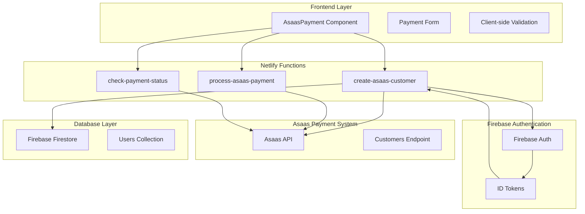
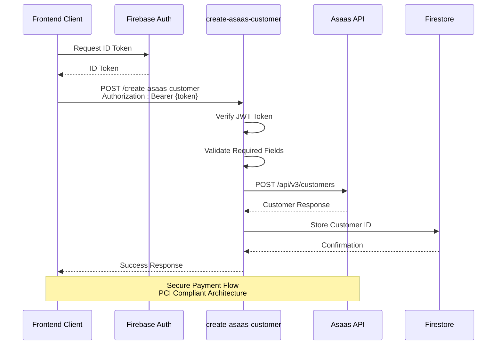
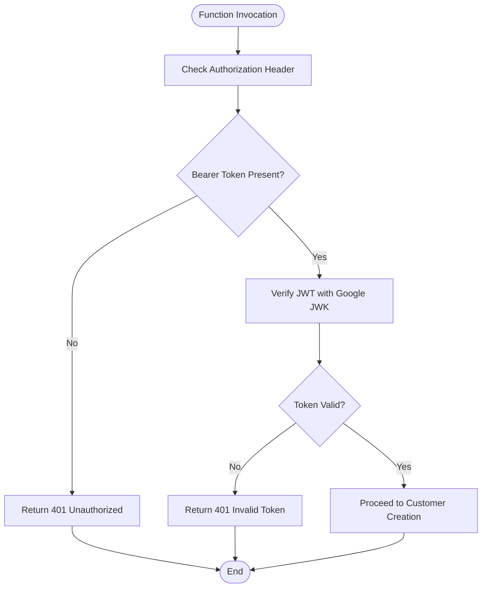
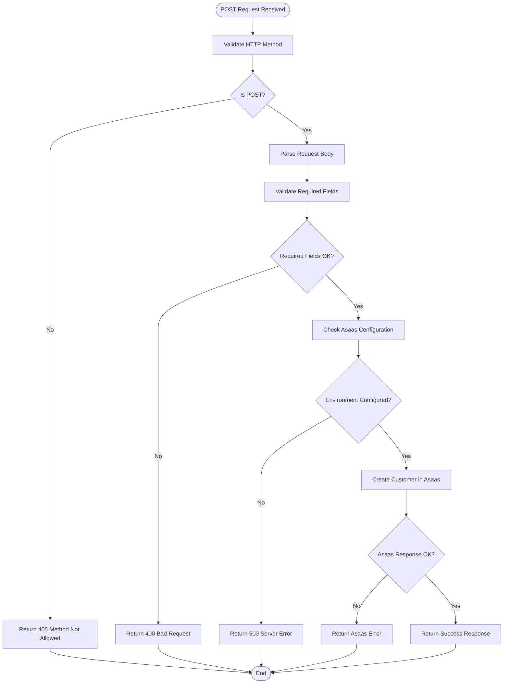
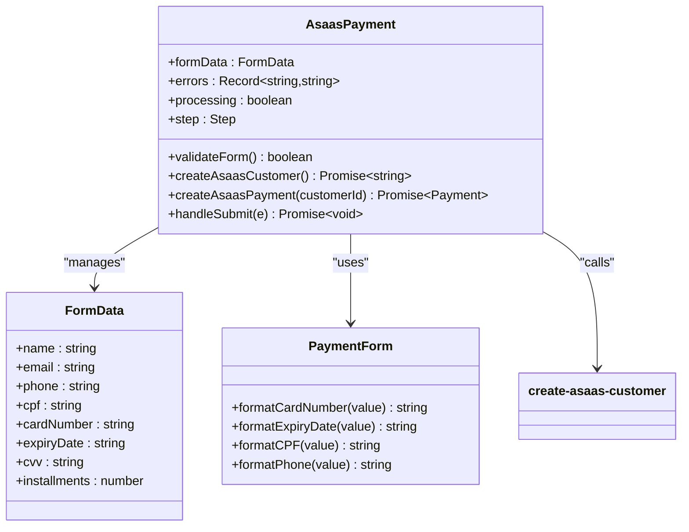
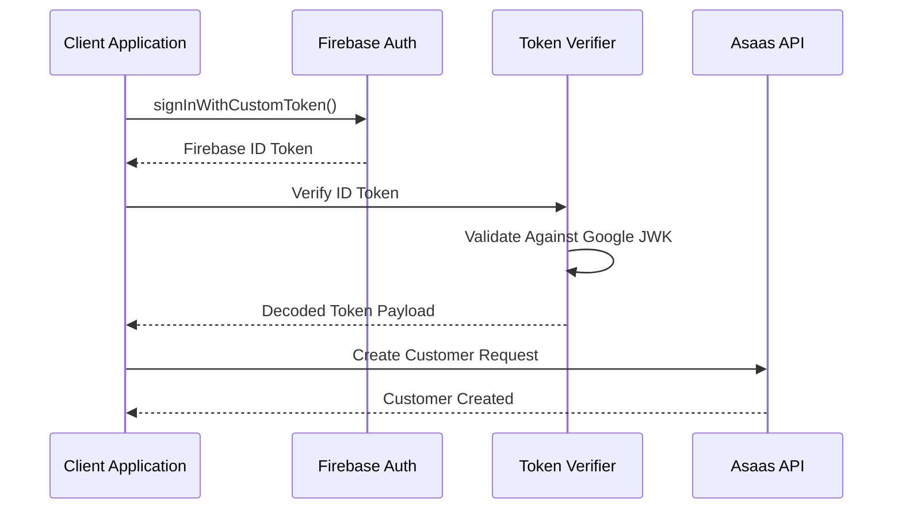
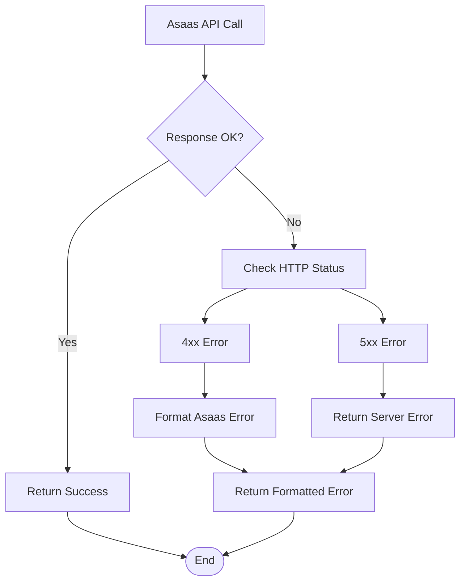
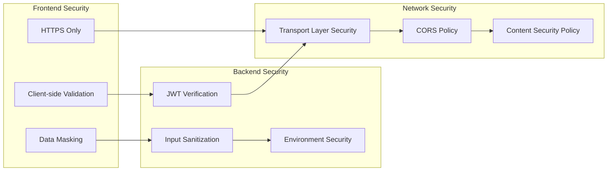

# Create Asaas Customer Function

<cite>
**Referenced Files in This Document**
- [create-asaas-customer.js](file://netlify/functions/create-asaas-customer.js)
- [AsaasPayment.tsx](file://components/AsaasPayment.tsx)
- [asaas.ts](file://lib/db/asaas.ts)
- [firebase.ts](file://lib/firebase.ts)
- [netlify.toml](file://netlify.toml)
- [process-asaas-payment.js](file://netlify/functions/process-asaas-payment.js)
- [check-payment-status.js](file://netlify/functions/check-payment-status.js)
- [updateUserCustomerId.js](file://functions/src/api/updateUserCustomerId.js)
- [index.js](file://functions/src/index.js)
</cite>

## Table of Contents
1. [Introduction](#introduction)
2. [Project Structure](#project-structure)
3. [Core Components](#core-components)
4. [Architecture Overview](#architecture-overview)
5. [Detailed Component Analysis](#detailed-component-analysis)
6. [API Reference](#api-reference)
7. [Integration Patterns](#integration-patterns)
8. [Error Handling](#error-handling)
9. [Security Model](#security-model)
10. [Performance Considerations](#performance-considerations)
11. [Troubleshooting Guide](#troubleshooting-guide)
12. [Conclusion](#conclusion)

## Introduction
This document provides comprehensive API documentation for the create-asaas-customer function, which integrates Firebase authentication with the Asaas payment system to create customer records. The function serves as a bridge between the frontend payment flow and the Asaas API, ensuring secure customer creation with proper authentication and validation.

The system follows a two-tier architecture where the frontend handles payment form validation and collects sensitive card data, while backend functions manage authentication verification and Asaas API communication. This separation ensures PCI compliance by keeping card data away from the application server.

## Project Structure
The create-asaas-customer function is part of a larger payment processing ecosystem consisting of multiple components:



**Diagram sources**
- [create-asaas-customer.js](file://netlify/functions/create-asaas-customer.js#L20-L146)
- [AsaasPayment.tsx](file://components/AsaasPayment.tsx#L86-L128)
- [firebase.ts](file://lib/firebase.ts#L1-L25)

**Section sources**
- [create-asaas-customer.js](file://netlify/functions/create-asaas-customer.js#L1-L146)
- [AsaasPayment.tsx](file://components/AsaasPayment.tsx#L1-L491)
- [netlify.toml](file://netlify.toml#L1-L65)

## Core Components
The create-asaas-customer function consists of several key components working together to provide a secure customer creation workflow:

### Authentication Verification
The function implements robust JWT token verification using Google's public JWK endpoints to validate Firebase ID tokens. This ensures only authenticated users can create Asaas customer records.

### Request Validation
Comprehensive input validation checks for required customer fields including name, email, and CPF/CNPJ. The function enforces Brazilian tax identification requirements for customer registration.

### Asaas Integration
Direct integration with Asaas API v3 using environment-configured access tokens and base URLs. The function handles both sandbox and production environments seamlessly.

### Response Management
Structured response formatting that includes customer ID generation, detailed error reporting, and success confirmation for downstream processing.

**Section sources**
- [create-asaas-customer.js](file://netlify/functions/create-asaas-customer.js#L6-L18)
- [create-asaas-customer.js](file://netlify/functions/create-asaas-customer.js#L64-L74)
- [create-asaas-customer.js](file://netlify/functions/create-asaas-customer.js#L88-L108)

## Architecture Overview
The customer creation workflow follows a secure, multi-layered approach:



**Diagram sources**
- [create-asaas-customer.js](file://netlify/functions/create-asaas-customer.js#L20-L146)
- [AsaasPayment.tsx](file://components/AsaasPayment.tsx#L86-L128)
- [firebase.ts](file://lib/firebase.ts#L1-L25)

The architecture ensures that sensitive payment data never touches the application server, maintaining PCI DSS compliance while providing seamless customer onboarding.

**Section sources**
- [create-asaas-customer.js](file://netlify/functions/create-asaas-customer.js#L20-L146)
- [AsaasPayment.tsx](file://components/AsaasPayment.tsx#L183-L244)

## Detailed Component Analysis

### Authentication Flow
The function implements a sophisticated JWT verification system that validates Firebase ID tokens against Google's public JWK endpoints:



**Diagram sources**
- [create-asaas-customer.js](file://netlify/functions/create-asaas-customer.js#L44-L62)

The authentication system supports both development and production Firebase projects, automatically detecting the project ID from environment variables.

### Customer Creation Workflow
The core customer creation process involves multiple validation and processing stages:



**Diagram sources**
- [create-asaas-customer.js](file://netlify/functions/create-asaas-customer.js#L34-L146)

The workflow ensures data integrity through comprehensive validation and provides detailed error reporting for debugging and user feedback.

**Section sources**
- [create-asaas-customer.js](file://netlify/functions/create-asaas-customer.js#L20-L146)

### Frontend Integration Pattern
The frontend component demonstrates the complete customer creation flow with integrated validation and error handling:



**Diagram sources**
- [AsaasPayment.tsx](file://components/AsaasPayment.tsx#L12-L491)

The frontend implementation includes comprehensive client-side validation, data formatting utilities, and error handling that complements the backend security measures.

**Section sources**
- [AsaasPayment.tsx](file://components/AsaasPayment.tsx#L86-L128)
- [AsaasPayment.tsx](file://components/AsaasPayment.tsx#L183-L244)

## API Reference

### Endpoint Definition
**Endpoint:** `POST /.netlify/functions/create-asaas-customer`

**Authentication:** Required (Firebase ID Token)
**Content-Type:** application/json
**Authorization:** Bearer {idToken}

### Request Parameters

| Parameter | Type | Required | Description | Example |
|-----------|------|----------|-------------|---------|
| name | string | Yes | Customer full name | "John Doe" |
| email | string | Yes | Customer email address | "john@example.com" |
| cpfCnpj | string | Yes | Brazilian tax ID (CPF/CNPJ) | "12345678900" |
| phone | string | No | Landline phone number | "+5511123456789" |
| mobilePhone | string | No | Mobile phone number | "+5511987654321" |
| address | string | No | Street address | "Main Street" |
| addressNumber | string | No | Address number | "123" |
| province | string | No | Neighborhood/district | "Downtown" |
| postalCode | string | No | ZIP code | "01310923" |

### Response Schemas

#### Success Response (200 OK)
```json
{
  "success": true,
  "customerId": "cus_1234567890",
  "customer": {
    "id": "cus_1234567890",
    "name": "John Doe",
    "email": "john@example.com",
    "cpfCnpj": "12345678900",
    "phone": "+5511123456789",
    "mobilePhone": "+5511987654321",
    "address": "Main Street",
    "addressNumber": "123",
    "province": "Downtown",
    "postalCode": "01310923",
    "createdDate": "2024-01-15T10:30:00Z"
  }
}
```

#### Error Responses

**400 Bad Request - Missing Required Fields**
```json
{
  "error": "Missing required fields: name, email, cpfCnpj"
}
```

**401 Unauthorized - Invalid Authentication**
```json
{
  "error": "Unauthorized: Invalid token"
}
```

**405 Method Not Allowed**
```json
{
  "error": "Method not allowed"
}
```

**500 Internal Server Error**
```json
{
  "error": "Server configuration error",
  "message": "ASAAS_ACCESS_TOKEN not configured"
}
```

**Asaas API Error Response**
```json
{
  "error": "Failed to create customer",
  "details": [
    {
      "name": "email",
      "message": "Email already exists"
    }
  ]
}
```

### Environment Variables
The function requires the following environment variables:

| Variable | Purpose | Required | Example |
|----------|---------|----------|---------|
| ASAAS_ACCESS_TOKEN | Asaas API access token | Yes | "YOUR_ACCESS_TOKEN" |
| ASAAS_API_URL | Asaas API base URL | No | "https://sandbox.asaas.com/api/v3" |
| FIREBASE_PROJECT_ID | Firebase project identifier | No | "your-project-id" |

**Section sources**
- [create-asaas-customer.js](file://netlify/functions/create-asaas-customer.js#L64-L146)
- [create-asaas-customer.js](file://netlify/functions/create-asaas-customer.js#L76-L86)

## Integration Patterns

### Firebase Authentication Integration
The function integrates seamlessly with Firebase Authentication through JWT verification:



**Diagram sources**
- [create-asaas-customer.js](file://netlify/functions/create-asaas-customer.js#L6-L18)
- [firebase.ts](file://lib/firebase.ts#L1-L25)

The integration supports both development and production Firebase configurations, automatically detecting project settings from environment variables.

### Database Synchronization
The system maintains synchronization between Firebase user accounts and Asaas customer records through multiple integration points:

| Integration Point | Purpose | Trigger |
|------------------|---------|---------|
| Frontend Component | Real-time validation | Form submission |
| Backend Function | Customer creation | Payment initiation |
| Webhook Handler | Status updates | Asaas webhook |
| Database Layer | Data persistence | Any integration |

**Section sources**
- [AsaasPayment.tsx](file://components/AsaasPayment.tsx#L196-L230)
- [asaas.ts](file://lib/db/asaas.ts#L39-L85)
- [index.js](file://functions/src/index.js#L188-L267)

## Error Handling

### Authentication Errors
The function implements comprehensive error handling for authentication failures:

| Error Type | HTTP Status | Error Message | Resolution |
|------------|-------------|---------------|------------|
| Missing Token | 401 | "Unauthorized: Missing token" | Provide valid Bearer token |
| Invalid Token | 401 | "Unauthorized: Invalid token" | Regenerate Firebase ID token |
| Method Not Allowed | 405 | "Method not allowed" | Use POST method only |

### Validation Errors
Input validation errors are handled with specific error codes and messages:

| Validation Failure | HTTP Status | Error Response | Cause |
|-------------------|-------------|----------------|-------|
| Missing Required Fields | 400 | "Missing required fields: name, email, cpfCnpj" | Missing mandatory customer data |
| Invalid Email Format | 400 | "Invalid email format" | Non-email string provided |
| Invalid CPF/CNPJ | 400 | "Invalid tax ID format" | Incorrect tax ID length or format |

### Asaas API Integration Errors
The function handles various Asaas API error scenarios:



**Diagram sources**
- [create-asaas-customer.js](file://netlify/functions/create-asaas-customer.js#L112-L122)

**Section sources**
- [create-asaas-customer.js](file://netlify/functions/create-asaas-customer.js#L134-L144)
- [create-asaas-customer.js](file://netlify/functions/create-asaas-customer.js#L112-L122)

## Security Model

### Token-Based Authentication
The function implements JWT-based authentication using Google's public JWK endpoints for token verification. This approach ensures:

- **Token Integrity:** Cryptographically verified JWT signatures
- **Issuer Validation:** Confirms tokens originate from trusted Firebase instances
- **Audience Verification:** Ensures tokens intended for the correct project
- **Automatic Key Rotation:** Uses Google's rotating JWK keys for validation

### Data Protection Measures
Several security measures protect customer data throughout the workflow:



**Diagram sources**
- [create-asaas-customer.js](file://netlify/functions/create-asaas-customer.js#L4-L18)
- [netlify.toml](file://netlify.toml#L39-L65)

### PCI Compliance
The architecture maintains PCI DSS compliance by ensuring card data never reaches the application server:

- **Frontend Collection:** Card data collected directly in browser
- **No Storage:** Sensitive data not stored on application servers
- **Direct Processing:** Payments processed directly through Asaas API
- **Secure Transmission:** All data transmitted over HTTPS/TLS

**Section sources**
- [AsaasPayment.tsx](file://components/AsaasPayment.tsx#L86-L128)
- [netlify.toml](file://netlify.toml#L39-L65)

## Performance Considerations

### Response Time Optimization
The function is designed for minimal latency through several optimization strategies:

- **Connection Reuse:** Shared HTTP client connections to Asaas API
- **Environment Caching:** Static environment variable loading
- **Early Validation:** Input validation before external API calls
- **Minimal Dependencies:** Lightweight implementation with essential libraries only

### Scalability Features
The system scales effectively through:

- **Stateless Design:** Each function invocation is independent
- **Horizontal Scaling:** Netlify Functions automatically scale with demand
- **Database Efficiency:** Optimized Firestore queries and updates
- **Caching Strategies:** Appropriate caching of static resources

### Monitoring and Logging
Comprehensive logging enables performance monitoring and debugging:

- **Error Tracking:** Structured error logging with context
- **Performance Metrics:** Response time and error rate monitoring
- **Audit Trails:** Complete transaction logs for compliance
- **Debug Information:** Detailed logs for development and troubleshooting

## Troubleshooting Guide

### Common Issues and Solutions

#### Authentication Failures
**Symptoms:** 401 Unauthorized responses
**Causes:** Expired tokens, incorrect token format, invalid project configuration
**Solutions:**
1. Refresh Firebase ID token before making requests
2. Verify token format starts with "Bearer "
3. Check FIREBASE_PROJECT_ID environment variable
4. Ensure token hasn't expired (typically 1 hour)

#### Asaas API Integration Problems
**Symptoms:** 500 server errors or Asaas-specific errors
**Causes:** Missing ASAAS_ACCESS_TOKEN, network connectivity issues, API rate limits
**Solutions:**
1. Verify ASAAS_ACCESS_TOKEN is properly configured
2. Check ASAAS_API_URL environment variable
3. Monitor Asaas API status and rate limits
4. Implement retry logic for transient failures

#### Data Validation Errors
**Symptoms:** 400 Bad Request responses
**Causes:** Missing required fields, invalid data formats
**Solutions:**
1. Ensure name, email, and cpfCnpj are provided
2. Validate email format using standard patterns
3. Verify CPF/CNPJ follows Brazilian tax ID format
4. Check phone number formatting requirements

### Debugging Tools and Techniques

#### Frontend Debugging
The AsaasPayment component includes comprehensive debugging capabilities:

- **Console Logging:** Detailed error messages and stack traces
- **State Inspection:** Real-time monitoring of form state and validation
- **Network Monitoring:** API request/response inspection
- **Error Boundaries:** Graceful error handling and user feedback

#### Backend Debugging
Server-side debugging features include:

- **Structured Logging:** JSON-formatted log entries with timestamps
- **Error Context:** Complete error context and stack traces
- **Environment Variables:** Runtime configuration inspection
- **API Response Logging:** Full Asaas API response analysis

**Section sources**
- [create-asaas-customer.js](file://netlify/functions/create-asaas-customer.js#L134-L144)
- [AsaasPayment.tsx](file://components/AsaasPayment.tsx#L183-L244)

## Conclusion
The create-asaas-customer function provides a robust, secure, and scalable solution for integrating Firebase authentication with the Asaas payment system. The implementation follows industry best practices for security, performance, and maintainability while ensuring PCI DSS compliance through proper data handling and transmission protocols.

Key strengths of the implementation include comprehensive authentication verification, structured error handling, PCI-compliant architecture, and seamless integration with the broader payment processing ecosystem. The modular design allows for easy maintenance and extension while maintaining system reliability and security.

The function serves as a critical component in the overall payment infrastructure, enabling secure customer onboarding while providing detailed error reporting and comprehensive logging for operational monitoring and troubleshooting.