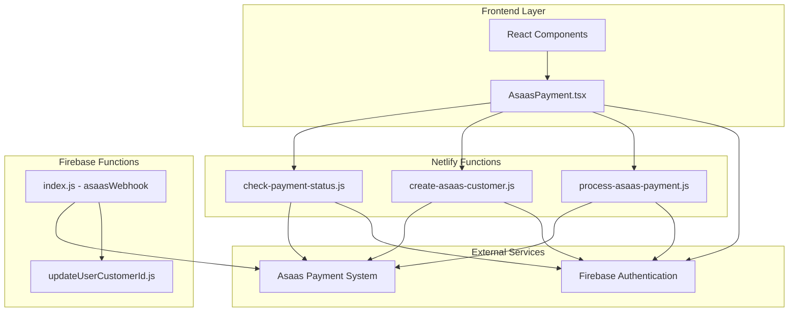
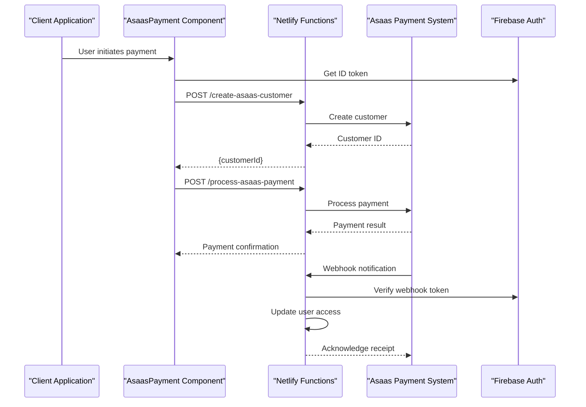
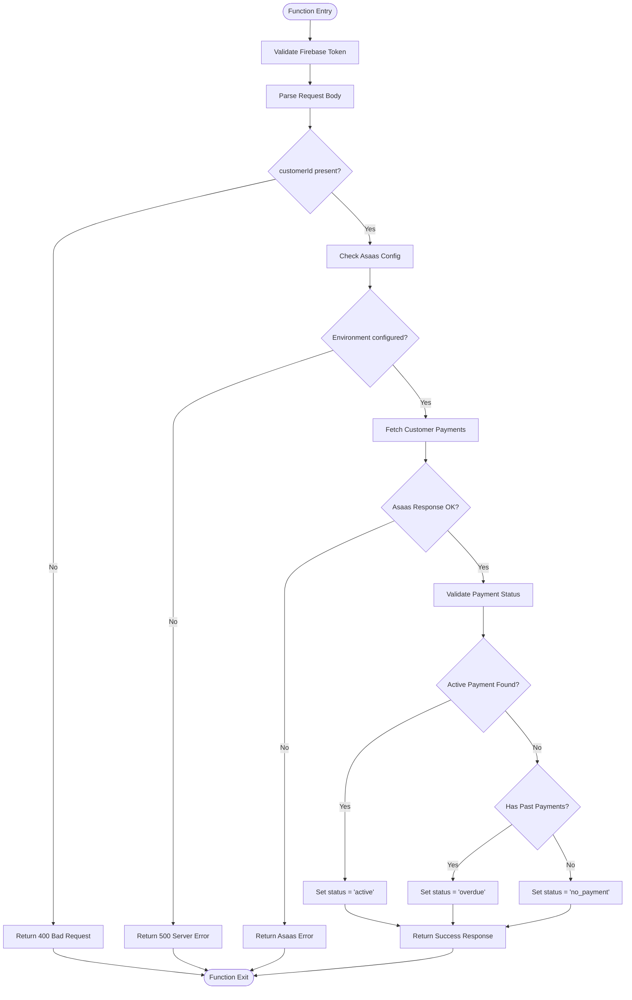
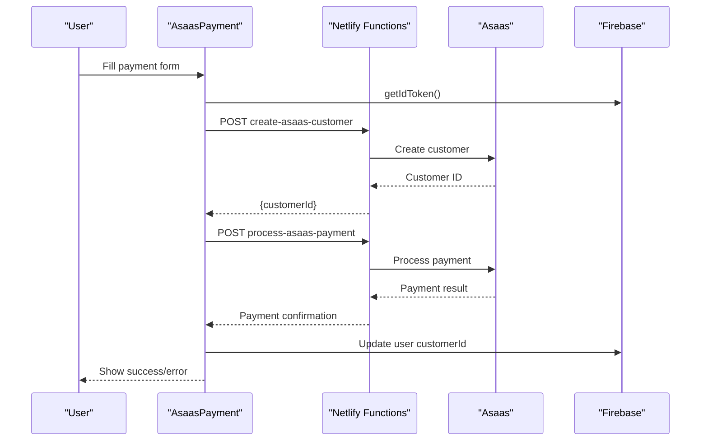
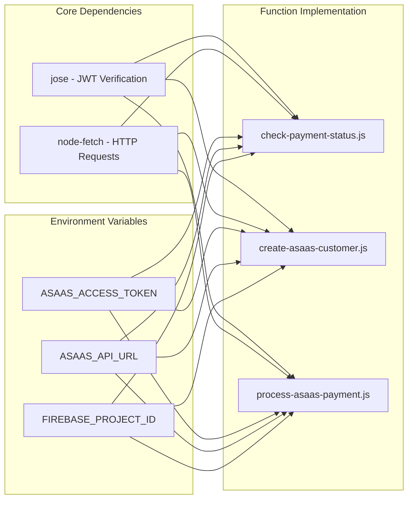
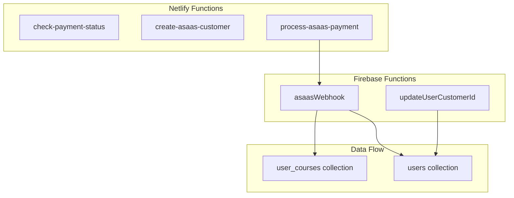
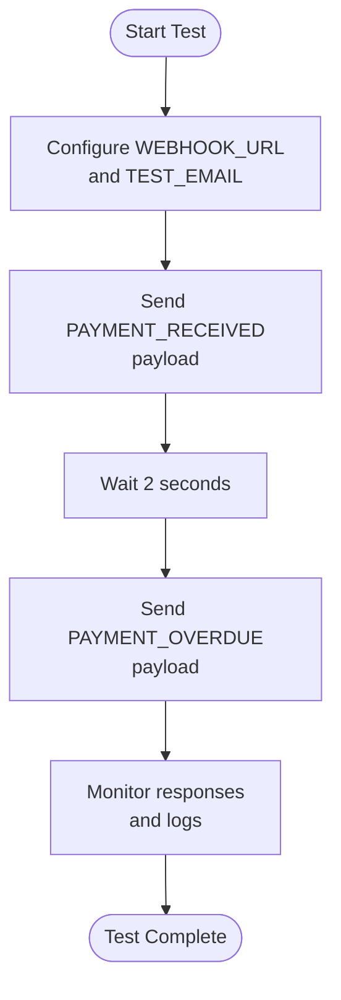

# Netlify Functions API

<cite>
**Referenced Files in This Document**
- [check-payment-status.js](file://netlify/functions/check-payment-status.js)
- [create-asaas-customer.js](file://netlify/functions/create-asaas-customer.js)
- [process-asaas-payment.js](file://netlify/functions/process-asaas-payment.js)
- [AsaasPayment.tsx](file://components/AsaasPayment.tsx)
- [index.js](file://functions/src/index.js)
- [updateUserCustomerId.js](file://functions/src/api/updateUserCustomerId.js)
- [netlify.toml](file://netlify.toml)
- [package.json](file://package.json)
- [test-asass-webhook.js](file://test-asass-webhook.js)
</cite>

## Table of Contents
1. [Introduction](#introduction)
2. [Project Structure](#project-structure)
3. [Core Components](#core-components)
4. [Architecture Overview](#architecture-overview)
5. [Detailed Component Analysis](#detailed-component-analysis)
6. [Dependency Analysis](#dependency-analysis)
7. [Performance Considerations](#performance-considerations)
8. [Troubleshooting Guide](#troubleshooting-guide)
9. [Conclusion](#conclusion)

## Introduction
This document provides comprehensive API documentation for the Netlify serverless functions that power payment processing in the Fluentoria platform. The system integrates with Asaas for payment management and uses Firebase Authentication for secure access control. The documentation covers three primary functions: payment status checking, customer creation, and payment processing, along with webhook handling and error management strategies.

## Project Structure
The payment processing system is organized across multiple layers:

**Diagram sources**
- [check-payment-status.js](file://netlify/functions/check-payment-status.js#L1-L152)
- [create-asaas-customer.js](file://netlify/functions/create-asaas-customer.js#L1-L146)
- [process-asaas-payment.js](file://netlify/functions/process-asaas-payment.js#L1-L121)
- [index.js](file://functions/src/index.js#L144-L339)

**Section sources**
- [netlify.toml](file://netlify.toml#L1-L65)
- [package.json](file://package.json#L1-L44)

## Core Components
The payment processing system consists of three primary Netlify functions that handle different aspects of the payment workflow:

### Authentication and Security Model
All functions implement a robust authentication system using Firebase JWT tokens:
- Token verification against Google's JWK endpoints
- Support for both development (local) and production environments
- CORS policy compliance for cross-origin requests
- Pre-flight request handling for browser compatibility

### Environment Configuration
Functions rely on environment variables for Asaas integration:
- `ASAAS_ACCESS_TOKEN`: API authentication token
- `ASAAS_API_URL`: Asaas API endpoint (defaults to sandbox)
- `FIREBASE_PROJECT_ID`: Firebase project identifier for token verification

**Section sources**
- [check-payment-status.js](file://netlify/functions/check-payment-status.js#L6-L18)
- [create-asaas-customer.js](file://netlify/functions/create-asaas-customer.js#L6-L18)
- [process-asaas-payment.js](file://netlify/functions/process-asaas-payment.js#L6-L18)

## Architecture Overview
The payment processing architecture follows a client-server model with asynchronous webhook notifications:

**Diagram sources**
- [AsaasPayment.tsx](file://components/AsaasPayment.tsx#L86-L181)
- [index.js](file://functions/src/index.js#L144-L339)

## Detailed Component Analysis

### check-payment-status Function
This function validates payment status for customers and determines access authorization.

#### HTTP Endpoint Configuration
- **Method**: POST
- **Endpoint**: `/.netlify/functions/check-payment-status`
- **CORS**: Enabled for all origins
- **Authentication**: Required (Bearer token)

#### Request Parameters
The function expects a JSON payload containing:
- `customerId` (string, required): Asaas customer identifier

#### Response Schema
Successful responses include:
- `authorized` (boolean): True if active payment exists
- `status` (string): One of "no_payment", "active", "overdue"
- `payments` (array): Complete payment history

Error responses include:
- `error` (string): Error description
- `details` (array): Specific error details from Asaas API

#### Payment Validation Logic
The function implements sophisticated payment validation:
1. Fetches all payments for the specified customer
2. Filters for confirmed payments with future due dates
3. Determines status based on payment state and due date comparison
4. Returns comprehensive payment history alongside authorization status

**Diagram sources**
- [check-payment-status.js](file://netlify/functions/check-payment-status.js#L64-L139)

**Section sources**
- [check-payment-status.js](file://netlify/functions/check-payment-status.js#L20-L151)

### create-asaas-customer Function
This function creates new customer records in the Asaas payment system.

#### HTTP Endpoint Configuration
- **Method**: POST
- **Endpoint**: `/.netlify/functions/create-asaas-customer`
- **CORS**: Enabled for all origins
- **Authentication**: Required (Bearer token)

#### Request Parameters
The function expects a comprehensive customer profile:
- `name` (string, required): Customer full name
- `email` (string, required): Customer email address
- `cpfCnpj` (string, required): Brazilian tax identification number
- Additional optional fields: `phone`, `mobilePhone`, `address`, `addressNumber`, `province`, `postalCode`

#### Response Schema
Successful responses include:
- `success` (boolean): True if customer creation succeeds
- `customerId` (string): Asaas-generated customer identifier
- `customer` (object): Full customer data from Asaas

#### Customer Creation Workflow
The function performs the following steps:
1. Validates authentication using Firebase JWT tokens
2. Extracts customer data from request body
3. Performs required field validation
4. Creates customer record in Asaas
5. Returns customer identifier for subsequent payment processing

**Section sources**
- [create-asaas-customer.js](file://netlify/functions/create-asaas-customer.js#L20-L145)

### process-asaas-payment Function
This function handles payment processing by proxying requests to the Asaas API.

#### HTTP Endpoint Configuration
- **Method**: POST
- **Endpoint**: `/.netlify/functions/process-asaas-payment`
- **CORS**: Enabled for all origins
- **Authentication**: Required (Bearer token)

#### Request Parameters
The function accepts Asaas payment request format:
- `customer` (string, required): Asaas customer identifier
- `billingType` (string, required): Payment method type (e.g., "CREDIT_CARD")
- `value` (number, required): Payment amount
- `dueDate` (string, required): Payment due date (YYYY-MM-DD)
- `description` (string): Payment description
- `externalReference` (string): Reference for course mapping
- `creditCard` (object): Card details
- `creditCardHolderInfo` (object): Cardholder information
- `installmentCount` (number): Number of installments

#### Response Schema
Returns the complete Asaas payment response including:
- Payment identifier and status
- Transaction details
- Payment metadata

#### Payment Processing Logic
The function implements a straightforward proxy pattern:
1. Validates Firebase authentication
2. Extracts payment data from request body
3. Proxies request to Asaas API
4. Returns Asaas response to client
5. Handles and reports Asaas API errors

**Section sources**
- [process-asaas-payment.js](file://netlify/functions/process-asaas-payment.js#L20-L120)

### Frontend Integration Component
The React component `AsaasPayment.tsx` orchestrates the complete payment flow:

**Diagram sources**
- [AsaasPayment.tsx](file://components/AsaasPayment.tsx#L86-L244)

**Section sources**
- [AsaasPayment.tsx](file://components/AsaasPayment.tsx#L86-L244)

## Dependency Analysis

### External Dependencies
The payment functions rely on several key dependencies:

**Diagram sources**
- [package.json](file://package.json#L13-L24)
- [check-payment-status.js](file://netlify/functions/check-payment-status.js#L1-L2)
- [create-asaas-customer.js](file://netlify/functions/create-asaas-customer.js#L1-L2)
- [process-asaas-payment.js](file://netlify/functions/process-asaas-payment.js#L1-L2)

### Internal Dependencies
The system includes complementary Firebase functions for webhook handling:

**Diagram sources**
- [index.js](file://functions/src/index.js#L144-L339)
- [updateUserCustomerId.js](file://functions/src/api/updateUserCustomerId.js#L12-L74)

**Section sources**
- [package.json](file://package.json#L13-L24)

## Performance Considerations
The payment functions are designed for optimal performance and reliability:

### Response Time Optimization
- **Direct API Proxying**: Minimal processing overhead by directly forwarding requests to Asaas
- **Efficient Token Verification**: Uses cached JWK sets for JWT validation
- **Connection Reuse**: Leverages Node.js HTTP connection pooling

### Error Handling Strategies
- **Graceful Degradation**: Falls back to descriptive error messages
- **Timeout Management**: Asaas API timeouts handled with proper error codes
- **Logging**: Comprehensive error logging for debugging and monitoring

### Security Measures
- **Token Validation**: All requests require valid Firebase JWT tokens
- **CORS Policy**: Strict cross-origin resource sharing controls
- **Input Validation**: Comprehensive request parameter validation

## Troubleshooting Guide

### Common Authentication Issues
**Problem**: 401 Unauthorized responses
**Causes**:
- Missing or invalid Authorization header
- Expired Firebase ID tokens
- Incorrect token format (missing "Bearer " prefix)

**Solutions**:
- Ensure proper Bearer token format: "Bearer YOUR_TOKEN"
- Refresh Firebase ID tokens before making requests
- Verify token expiration and audience claims

### Asaas Integration Problems
**Problem**: 500 Server Configuration Error
**Causes**:
- Missing `ASAAS_ACCESS_TOKEN` environment variable
- Incorrect Asaas API URL configuration
- Network connectivity issues

**Solutions**:
- Verify environment variable configuration in Netlify
- Test Asaas API connectivity separately
- Check firewall and network restrictions

### Payment Processing Failures
**Problem**: Asaas API errors in payment processing
**Common Error Types**:
- Invalid card details
- Insufficient funds
- Customer not found
- Payment amount validation errors

**Diagnostic Steps**:
1. Check Asaas API response details in error logs
2. Validate payment request format against Asaas documentation
3. Test with Asaas sandbox environment first

### Testing Webhook Integration
The project includes a test script for webhook simulation:

**Diagram sources**
- [test-asass-webhook.js](file://test-asass-webhook.js#L1-L81)

**Section sources**
- [test-asass-webhook.js](file://test-asass-webhook.js#L1-L81)

## Conclusion
The Netlify Functions API provides a robust, secure, and scalable payment processing solution integrated with Asaas and Firebase. The system offers comprehensive error handling, authentication security, and flexible payment workflows suitable for educational platform monetization. The modular architecture allows for easy maintenance and extension while maintaining strong security boundaries and reliable performance characteristics.

Key strengths of the implementation include:
- **Security**: Comprehensive JWT-based authentication with token verification
- **Reliability**: Graceful error handling and fallback mechanisms
- **Scalability**: Stateless function architecture with minimal processing overhead
- **Maintainability**: Clear separation of concerns and well-documented APIs

The system is ready for production deployment with proper environment configuration and monitoring in place.