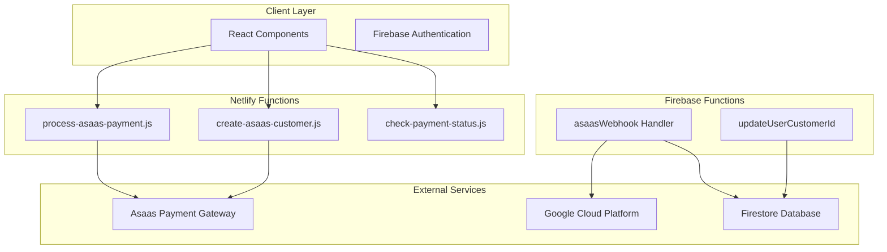
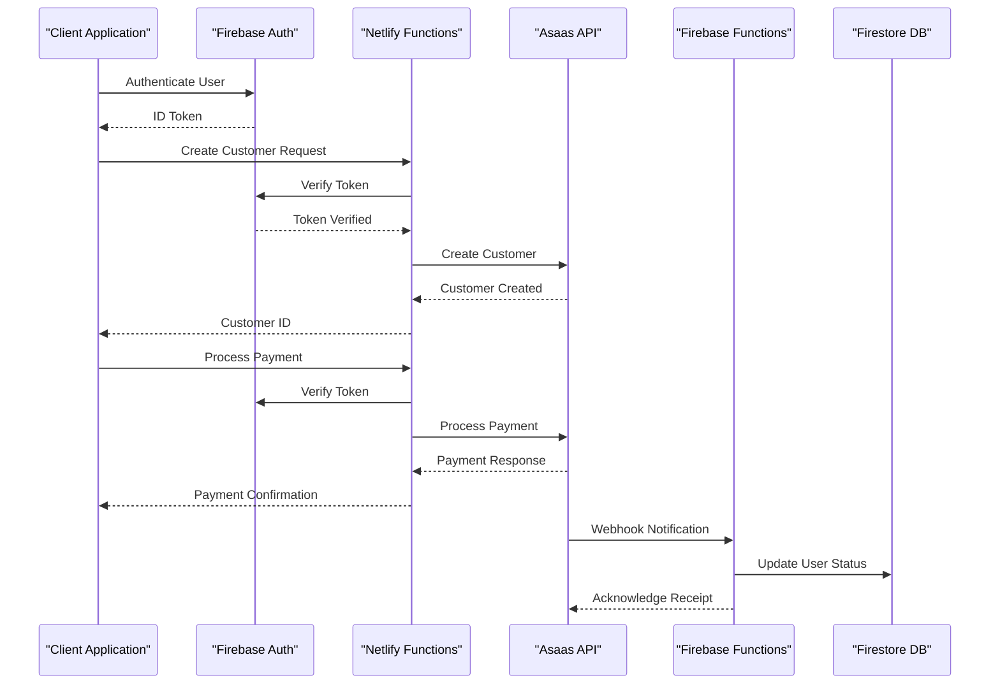
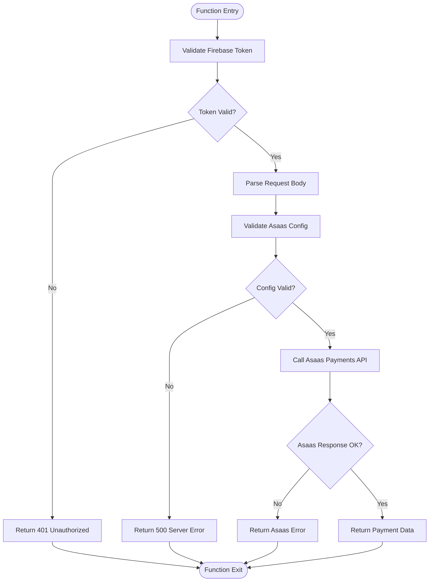
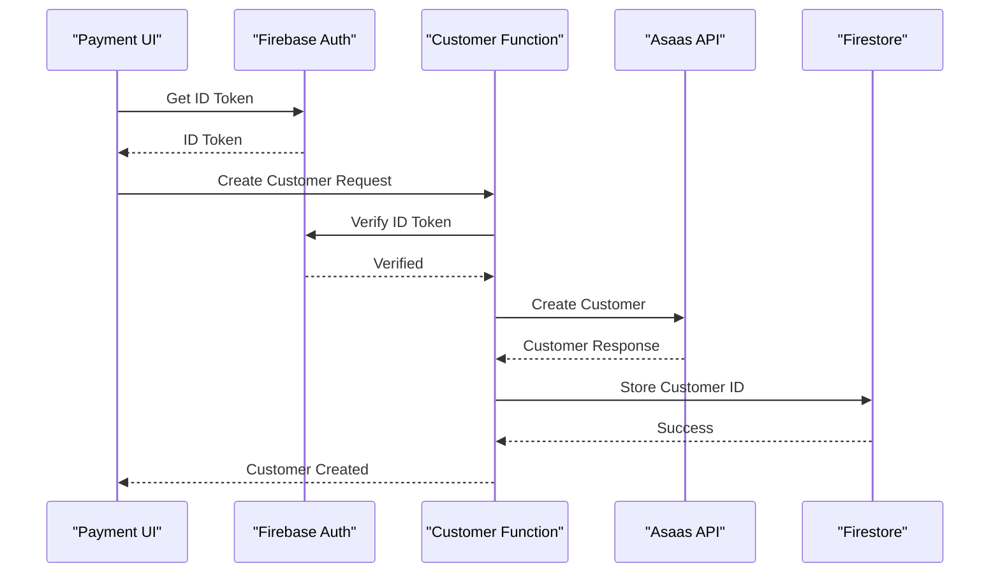
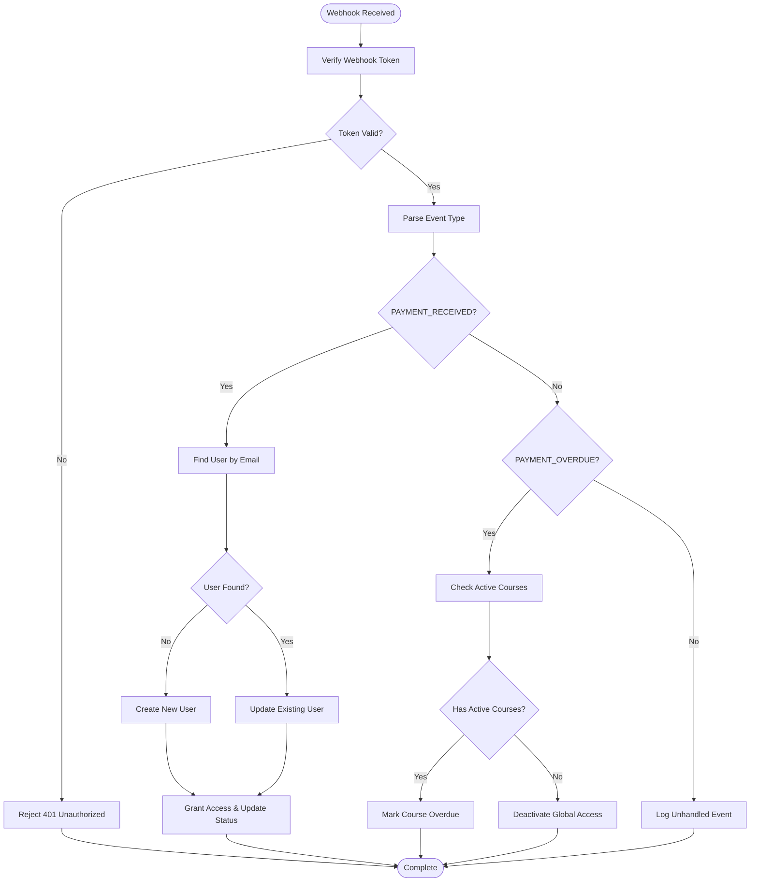
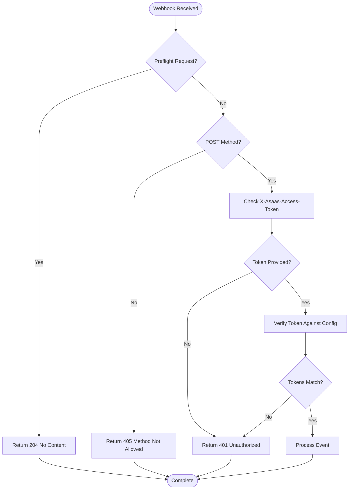
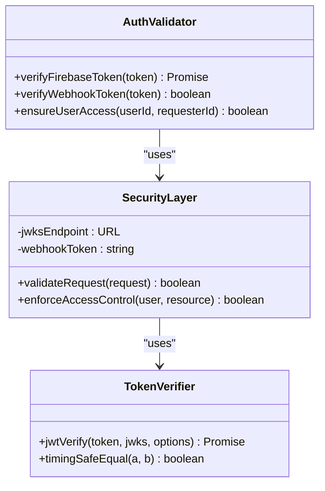

# Process Asaas Payment Function

<cite>
**Referenced Files in This Document**
- [process-asaas-payment.js](file://netlify/functions/process-asaas-payment.js)
- [AsaasPayment.tsx](file://components/AsaasPayment.tsx)
- [index.js](file://functions/src/index.js)
- [updateUserCustomerId.js](file://functions/src/api/updateUserCustomerId.js)
- [create-asaas-customer.js](file://netlify/functions/create-asaas-customer.js)
- [check-payment-status.js](file://netlify/functions/check-payment-status.js)
- [firebase.ts](file://lib/firebase.ts)
- [netlify.toml](file://netlify.toml)
- [test-asass-webhook.js](file://test-asass-webhook.js)
</cite>

## Table of Contents
1. [Introduction](#introduction)
2. [Project Structure](#project-structure)
3. [Core Components](#core-components)
4. [Architecture Overview](#architecture-overview)
5. [Detailed Component Analysis](#detailed-component-analysis)
6. [API Reference](#api-reference)
7. [Webhook Integration](#webhook-integration)
8. [Security Implementation](#security-implementation)
9. [Error Handling](#error-handling)
10. [Performance Considerations](#performance-considerations)
11. [Troubleshooting Guide](#troubleshooting-guide)
12. [Conclusion](#conclusion)

## Introduction

The Process Asaas Payment Function is a comprehensive payment processing solution that integrates Asaas payment gateway with Firebase authentication and user management systems. This system handles complete payment workflows including customer creation, payment processing, webhook validation, and real-time status synchronization.

The implementation consists of two primary deployment targets:
- **Netlify Functions**: Client-side payment processing and customer management
- **Firebase Functions**: Server-side webhook handling and user access control

This documentation provides detailed API specifications, workflow diagrams, and integration guidelines for implementing secure payment processing with Asaas.

## Project Structure

The payment processing system is organized across multiple layers with clear separation of concerns:



**Diagram sources**
- [process-asaas-payment.js](file://netlify/functions/process-asaas-payment.js#L1-L121)
- [AsaasPayment.tsx](file://components/AsaasPayment.tsx#L1-L491)
- [index.js](file://functions/src/index.js#L144-L339)

**Section sources**
- [process-asaas-payment.js](file://netlify/functions/process-asaas-payment.js#L1-L121)
- [AsaasPayment.tsx](file://components/AsaasPayment.tsx#L1-L491)
- [netlify.toml](file://netlify.toml#L1-L65)

## Core Components

### Payment Processing Pipeline

The system implements a multi-stage payment processing pipeline:

1. **Client Authentication**: Firebase JWT token verification
2. **Customer Management**: Asaas customer creation and storage
3. **Payment Execution**: Secure payment processing through Asaas
4. **Status Monitoring**: Real-time payment status verification
5. **Webhook Integration**: Automated payment state synchronization

### Key Features

- **Dual Authentication**: Firebase JWT verification for client requests
- **Secure Payment Processing**: PCI-compliant card data handling
- **Real-time Synchronization**: Automatic payment status updates
- **Multi-product Support**: Course enrollment mapping via external references
- **Error Resilience**: Comprehensive error handling and recovery mechanisms

**Section sources**
- [AsaasPayment.tsx](file://components/AsaasPayment.tsx#L86-L244)
- [process-asaas-payment.js](file://netlify/functions/process-asaas-payment.js#L64-L107)

## Architecture Overview

The payment architecture follows a distributed microservices pattern with clear boundaries between client, server, and external service interactions.



**Diagram sources**
- [AsaasPayment.tsx](file://components/AsaasPayment.tsx#L86-L244)
- [process-asaas-payment.js](file://netlify/functions/process-asaas-payment.js#L64-L107)
- [index.js](file://functions/src/index.js#L144-L339)

## Detailed Component Analysis

### Payment Processing Function

The core payment processing function handles secure payment execution through Asaas while maintaining strict authentication controls.



**Diagram sources**
- [process-asaas-payment.js](file://netlify/functions/process-asaas-payment.js#L20-L120)

**Section sources**
- [process-asaas-payment.js](file://netlify/functions/process-asaas-payment.js#L20-L120)

### Customer Creation Workflow

The customer creation process ensures compliance with Brazilian financial regulations while maintaining user privacy.



**Diagram sources**
- [AsaasPayment.tsx](file://components/AsaasPayment.tsx#L86-L128)
- [create-asaas-customer.js](file://netlify/functions/create-asaas-customer.js#L64-L132)

**Section sources**
- [AsaasPayment.tsx](file://components/AsaasPayment.tsx#L86-L128)
- [create-asaas-customer.js](file://netlify/functions/create-asaas-customer.js#L64-L132)

### Webhook Processing System

The webhook handler provides real-time payment status synchronization with automated user access control.



**Diagram sources**
- [index.js](file://functions/src/index.js#L144-L339)

**Section sources**
- [index.js](file://functions/src/index.js#L144-L339)

## API Reference

### Payment Processing Endpoint

#### Endpoint
`POST /.netlify/functions/process-asaas-payment`

#### Request Headers
- `Content-Type: application/json`
- `Authorization: Bearer <Firebase ID Token>`

#### Request Body Parameters

| Parameter | Type | Required | Description |
|-----------|------|----------|-------------|
| customer | string | Yes | Asaas customer identifier |
| billingType | string | Yes | Payment method type (CREDIT_CARD) |
| value | number | Yes | Payment amount in reais (supports decimals) |
| dueDate | string | Yes | Payment due date (YYYY-MM-DD) |
| description | string | Yes | Payment description |
| externalReference | string | Yes | Unique reference for course mapping |
| creditCard.holderName | string | Yes | Cardholder name |
| creditCard.number | string | Yes | 16-digit card number |
| creditCard.expiryMonth | string | Yes | Card expiration month |
| creditCard.expiryYear | string | Yes | Card expiration year (20YY format) |
| creditCard.ccv | string | Yes | 3-digit security code |
| creditCardHolderInfo.name | string | Yes | Holder name |
| creditCardHolderInfo.email | string | Yes | Holder email |
| creditCardHolderInfo.cpfCnpj | string | Yes | CPF/CNPJ number |
| creditCardHolderInfo.postalCode | string | Yes | Postal code |
| creditCardHolderInfo.addressNumber | string | Yes | Address number |
| creditCardHolderInfo.addressComplement | string | No | Address complement |
| creditCardHolderInfo.mobilePhone | string | Yes | Mobile phone number |
| installmentCount | number | No | Number of installments (default: 1) |

#### Response Schema

**Success Response (200)**
```json
{
  "id": "string",
  "customer": "string",
  "state": "string",
  "status": "string",
  "value": number,
  "dueDate": "string",
  "description": "string",
  "externalReference": "string",
  "billingType": "string",
  "installmentCount": number,
  "creditCard": {
    "number": "string",
    "holderName": "string",
    "expiryMonth": "string",
    "expiryYear": "string"
  },
  "createdAt": "string",
  "updated_at": "string"
}
```

**Error Response (400)**
```json
{
  "error": "string",
  "details": []
}
```

**Section sources**
- [process-asaas-payment.js](file://netlify/functions/process-asaas-payment.js#L64-L107)
- [AsaasPayment.tsx](file://components/AsaasPayment.tsx#L130-L181)

### Customer Creation Endpoint

#### Endpoint
`POST /.netlify/functions/create-asaas-customer`

#### Request Body Parameters

| Parameter | Type | Required | Description |
|-----------|------|----------|-------------|
| name | string | Yes | Full name |
| email | string | Yes | Email address |
| cpfCnpj | string | Yes | CPF or CNPJ number |
| phone | string | No | Phone number |
| mobilePhone | string | No | Mobile phone number |
| address | object | No | Address details |

#### Response Schema

**Success Response (200)**
```json
 {
   "success": true,
   "customerId": "string",
   "customer": {
     "id": "string",
     "name": "string",
     "email": "string",
     "cpfCnpj": "string",
     "phone": "string",
     "mobilePhone": "string",
     "address": "object"
   }
 }
```

**Section sources**
- [create-asaas-customer.js](file://netlify/functions/create-asaas-customer.js#L64-L132)

### Payment Status Check Endpoint

#### Endpoint
`POST /.netlify/functions/check-payment-status`

#### Request Body Parameters

| Parameter | Type | Required | Description |
|-----------|------|----------|-------------|
| customerId | string | Yes | Asaas customer identifier |

#### Response Schema

**Success Response (200)**
```json
{
  "authorized": boolean,
  "status": "string",
  "payments": [
    {
      "id": "string",
      "customer": "string",
      "state": "string",
      "status": "string",
      "value": number,
      "dueDate": "string",
      "description": "string",
      "externalReference": "string",
      "billingType": "string",
      "installmentCount": number,
      "createdAt": "string"
    }
  ]
}
```

**Section sources**
- [check-payment-status.js](file://netlify/functions/check-payment-status.js#L64-L138)

## Webhook Integration

### Webhook Configuration

The system supports Asaas webhook notifications for real-time payment status updates.

#### Webhook Endpoint
`POST https://your-project.cloudfunctions.net/asaasWebhook`

#### Required Headers
- `Content-Type: application/json`
- `X-Asaas-Access-Token: <webhook_token>`

#### Supported Events

| Event Type | Description | Action Taken |
|------------|-------------|--------------|
| PAYMENT_RECEIVED | Payment successfully processed | Activate user access and grant course enrollment |
| PAYMENT_CONFIRMED | Payment confirmed by bank | Same as PAYMENT_RECEIVED |
| PAYMENT_OVERDUE | Payment past due date | Deactivate course access, maintain global access if other courses active |

#### Webhook Payload Format

**Standard Webhook Payload**
```json
{
  "event": "string",
  "payment": {
    "id": "string",
    "value": number,
    "status": "string",
    "dueDate": "string",
    "externalReference": "string"
  },
  "customer": {
    "id": "string",
    "name": "string",
    "email": "string"
  }
}
```

**Section sources**
- [index.js](file://functions/src/index.js#L144-L339)
- [test-asass-webhook.js](file://test-asass-webhook.js#L1-L81)

### Webhook Verification Process

The webhook handler implements strict security verification:



**Diagram sources**
- [index.js](file://functions/src/index.js#L144-L179)

**Section sources**
- [index.js](file://functions/src/index.js#L160-L179)

## Security Implementation

### Authentication Mechanisms

The system implements multiple layers of authentication and authorization:

#### Firebase JWT Verification
- Uses Google's JWK endpoints for token validation
- Supports configurable project IDs
- Implements strict issuer and audience validation

#### Webhook Token Validation
- Configurable webhook token stored in Firebase Functions config
- Timing-safe comparison to prevent timing attacks
- Fail-closed security model

#### Access Control
- User can only update their own customer ID
- Admin users have elevated privileges
- Token verification occurs at both client and server levels



**Diagram sources**
- [process-asaas-payment.js](file://netlify/functions/process-asaas-payment.js#L6-L18)
- [index.js](file://functions/src/index.js#L160-L179)

**Section sources**
- [process-asaas-payment.js](file://netlify/functions/process-asaas-payment.js#L6-L18)
- [index.js](file://functions/src/index.js#L160-L179)

## Error Handling

### Error Categories

The system implements comprehensive error handling across all components:

#### Authentication Errors
- **401 Unauthorized**: Invalid or missing Firebase token
- **403 Forbidden**: Insufficient permissions for operation
- **405 Method Not Allowed**: Unsupported HTTP method

#### Business Logic Errors
- **400 Bad Request**: Missing required parameters or invalid data
- **500 Internal Server Error**: Unexpected server errors

#### External Service Errors
- **Asaas API Errors**: Propagate Asaas error messages with details
- **Network Timeout**: Retry logic for transient failures

### Error Response Format

```json
{
  "error": "string",
  "message": "string",
  "details": []
}
```

**Section sources**
- [process-asaas-payment.js](file://netlify/functions/process-asaas-payment.js#L91-L119)
- [create-asaas-customer.js](file://netlify/functions/create-asaas-customer.js#L112-L143)

## Performance Considerations

### Optimization Strategies

#### Caching
- Firebase JWT verification results cached in memory
- Asaas API responses cached for frequently accessed data
- Client-side payment status caching to reduce API calls

#### Connection Management
- Reuse HTTP connections for Asaas API calls
- Implement connection pooling for database operations
- Optimize webhook processing for high-volume scenarios

#### Resource Management
- Limit concurrent payment processing operations
- Implement rate limiting for API endpoints
- Monitor memory usage for long-running operations

### Scalability Features

- **Horizontal Scaling**: Netlify Functions automatically scale with demand
- **Database Optimization**: Efficient Firestore queries with proper indexing
- **CDN Integration**: Static assets served via CDN for improved load times

## Troubleshooting Guide

### Common Issues and Solutions

#### Payment Processing Failures
1. **Invalid Card Details**: Verify card number format and expiration date
2. **Insufficient Funds**: Check customer account balance and limits
3. **Network Timeout**: Implement retry logic with exponential backoff

#### Authentication Problems
1. **Token Expiration**: Refresh tokens before making API calls
2. **Invalid Audience**: Ensure correct project ID configuration
3. **Permission Denied**: Verify user roles and access levels

#### Webhook Integration Issues
1. **Token Mismatch**: Verify webhook token configuration
2. **Event Processing Failures**: Check Firestore write permissions
3. **Duplicate Processing**: Implement idempotent webhook handlers

### Debugging Tools

#### Local Testing
- Use test scripts to simulate webhook events
- Mock Asaas API responses for development
- Test error scenarios and edge cases

#### Monitoring
- Enable detailed logging for payment operations
- Track webhook delivery success rates
- Monitor API response times and error rates

**Section sources**
- [test-asass-webhook.js](file://test-asass-webhook.js#L1-L81)

## Conclusion

The Process Asaas Payment Function provides a robust, secure, and scalable payment processing solution that seamlessly integrates with Firebase authentication and user management systems. The implementation demonstrates best practices in:

- **Security**: Multi-layered authentication and authorization
- **Reliability**: Comprehensive error handling and recovery mechanisms
- **Scalability**: Distributed architecture with clear separation of concerns
- **Maintainability**: Well-documented APIs and modular component design

The system successfully handles complex payment workflows while maintaining compliance with Brazilian financial regulations and providing excellent developer experience through clear APIs and comprehensive documentation.

Key benefits include:
- PCI compliance through third-party payment processing
- Real-time payment status synchronization via webhooks
- Automated user access control based on payment status
- Multi-product support with flexible course enrollment mapping
- Comprehensive error handling and monitoring capabilities

This implementation serves as a foundation for building enterprise-grade payment processing systems that can be easily extended and customized for specific business requirements.