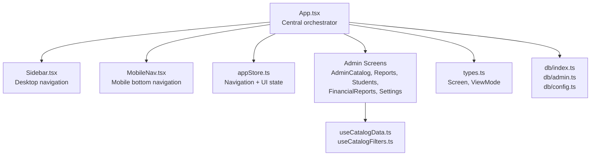
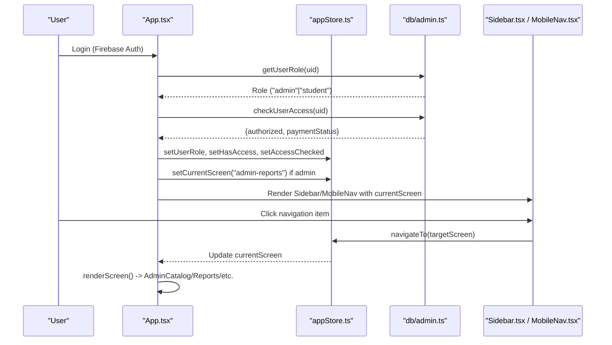
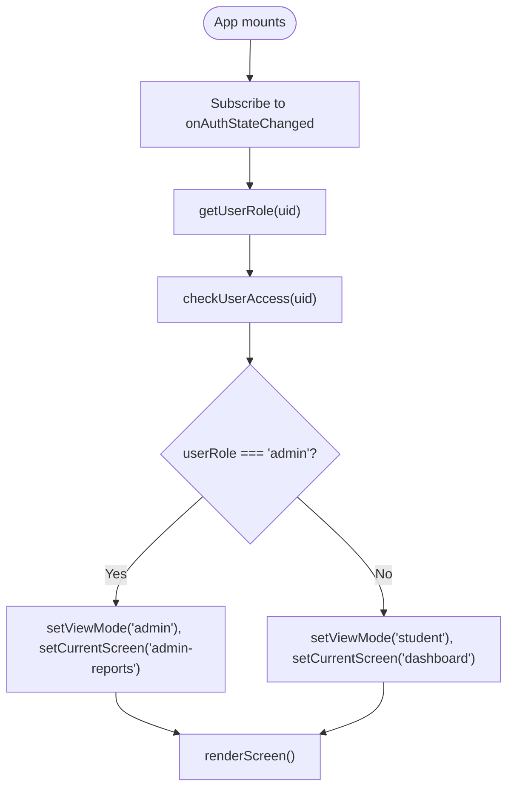
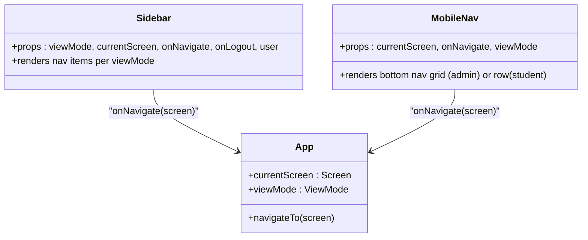
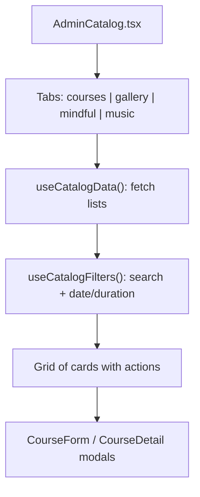
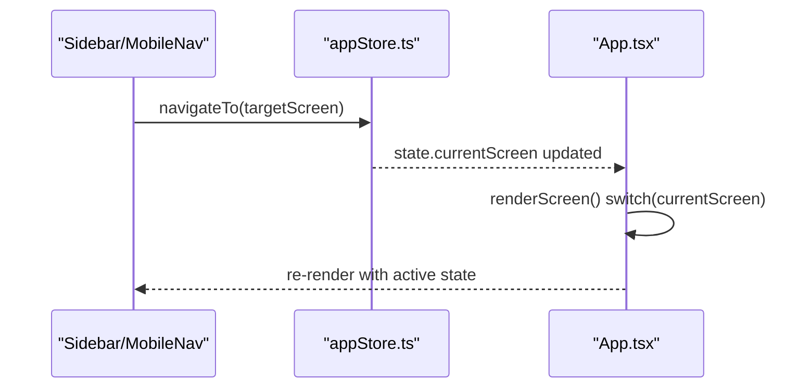
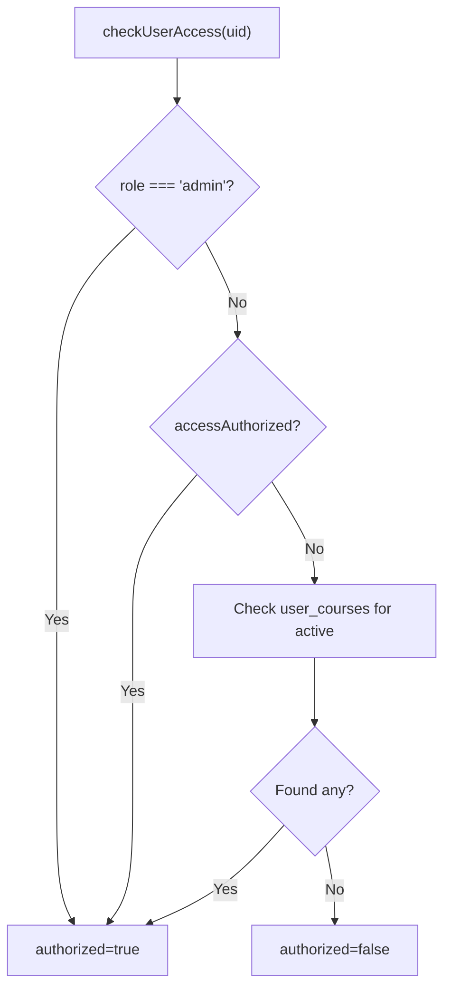
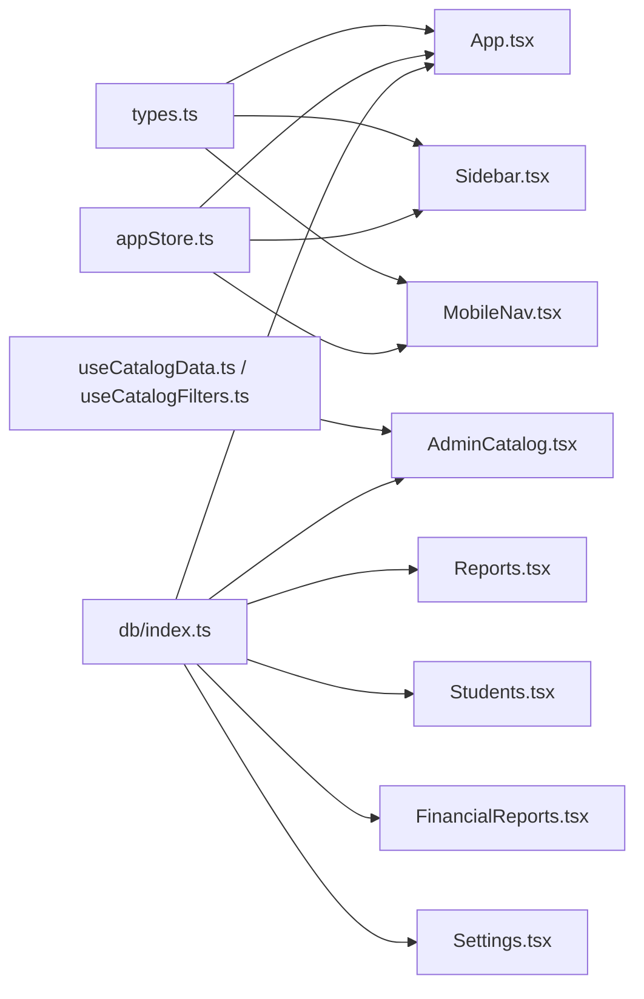

# Admin Dashboard Overview

<cite>
**Referenced Files in This Document**
- [App.tsx](file://App.tsx)
- [Sidebar.tsx](file://components/Sidebar.tsx)
- [MobileNav.tsx](file://components/MobileNav.tsx)
- [AdminCatalog.tsx](file://components/AdminCatalog.tsx)
- [Reports.tsx](file://components/Reports.tsx)
- [Students.tsx](file://components/Students.tsx)
- [FinancialReports.tsx](file://components/FinancialReports.tsx)
- [Settings.tsx](file://components/Settings.tsx)
- [StudentDashboard.tsx](file://components/StudentDashboard.tsx)
- [appStore.ts](file://lib/stores/appStore.ts)
- [types.ts](file://types.ts)
- [db/index.ts](file://lib/db/index.ts)
- [db/config.ts](file://lib/db/config.ts)
- [db/admin.ts](file://lib/db/admin.ts)
- [useCatalogData.ts](file://hooks/useCatalogData.ts)
- [useCatalogFilters.ts](file://hooks/useCatalogFilters.ts)
</cite>

## Table of Contents
1. [Introduction](#introduction)
2. [Project Structure](#project-structure)
3. [Core Components](#core-components)
4. [Architecture Overview](#architecture-overview)
5. [Detailed Component Analysis](#detailed-component-analysis)
6. [Dependency Analysis](#dependency-analysis)
7. [Performance Considerations](#performance-considerations)
8. [Troubleshooting Guide](#troubleshooting-guide)
9. [Conclusion](#conclusion)

## Introduction
This document explains the centralized admin dashboard overview and navigation system. It covers the unified admin interface design, sidebar and mobile navigation, dashboard layout, tab-based content organization, and admin-specific UI patterns. It also documents the integration between navigation components and routing, admin role permissions, and dashboard accessibility features. Practical examples of dashboard navigation workflows, responsive design considerations, and customization options are included.

## Project Structure
The admin dashboard is built as a single-page application with a central App container orchestrating navigation, authentication, and screen rendering. Navigation is provided by a desktop sidebar and a mobile bottom navigation bar. Admin screens include catalog management, reports, student management, financial reports, and settings. State management is handled by a Zustand store, while navigation and screen routing are defined by a shared Screen union type.

**Diagram sources**
- [App.tsx](file://App.tsx#L40-L447)
- [Sidebar.tsx](file://components/Sidebar.tsx#L27-L124)
- [MobileNav.tsx](file://components/MobileNav.tsx#L11-L94)
- [appStore.ts](file://lib/stores/appStore.ts#L48-L81)
- [types.ts](file://types.ts#L1-L26)
- [db/index.ts](file://lib/db/index.ts#L1-L38)
- [db/admin.ts](file://lib/db/admin.ts#L67-L127)
- [db/config.ts](file://lib/db/config.ts#L1-L19)
- [useCatalogData.ts](file://hooks/useCatalogData.ts#L20-L156)
- [useCatalogFilters.ts](file://hooks/useCatalogFilters.ts#L8-L85)

**Section sources**
- [App.tsx](file://App.tsx#L40-L447)
- [types.ts](file://types.ts#L1-L26)

## Core Components
- Central App container manages authentication, role checks, screen routing, and renders either the admin or student view.
- Sidebar provides desktop navigation with distinct routes for admin and student modes.
- MobileNav provides a five-item grid for admin mode and a four-item row for student mode on mobile.
- AdminCatalog implements tabbed content organization for courses, galleries, mindful flows, and music.
- Reports displays real-time analytics and charts.
- Students lists enrolled users, supports adding and managing access.
- FinancialReports shows revenue, active plans, expiring/expired counts, and allows plan edits.
- Settings organizes admin controls across users, courses, and gamification.
- StudentDashboard presents learner progress and statistics.

**Section sources**
- [App.tsx](file://App.tsx#L240-L324)
- [Sidebar.tsx](file://components/Sidebar.tsx#L27-L124)
- [MobileNav.tsx](file://components/MobileNav.tsx#L11-L94)
- [AdminCatalog.tsx](file://components/AdminCatalog.tsx#L37-L254)
- [Reports.tsx](file://components/Reports.tsx#L21-L282)
- [Students.tsx](file://components/Students.tsx#L8-L542)
- [FinancialReports.tsx](file://components/FinancialReports.tsx#L17-L535)
- [Settings.tsx](file://components/Settings.tsx#L45-L915)
- [StudentDashboard.tsx](file://components/StudentDashboard.tsx#L16-L135)

## Architecture Overview
The admin navigation system integrates tightly with routing and state management. The App component subscribes to authentication state, determines user role and access, and sets the current screen. The store exposes navigateTo and toggleViewMode actions. Desktop navigation is handled by Sidebar, while MobileNav adapts to view mode. Admin screens are rendered lazily and organized by tabs where applicable.

**Diagram sources**
- [App.tsx](file://App.tsx#L65-L108)
- [db/admin.ts](file://lib/db/admin.ts#L67-L127)
- [appStore.ts](file://lib/stores/appStore.ts#L62-L65)
- [Sidebar.tsx](file://components/Sidebar.tsx#L42-L100)
- [MobileNav.tsx](file://components/MobileNav.tsx#L13-L93)

## Detailed Component Analysis

### Centralized Admin Interface Design
- Single-page app with lazy-loaded admin routes for performance.
- Role-based rendering: admin view uses viewMode='admin' and maps to admin screens; student view uses viewMode='student'.
- Admin-only floating toggle switches between student and admin views; restricted to admin users.

**Diagram sources**
- [App.tsx](file://App.tsx#L65-L108)
- [db/admin.ts](file://lib/db/admin.ts#L67-L127)
- [appStore.ts](file://lib/stores/appStore.ts#L67-L78)

**Section sources**
- [App.tsx](file://App.tsx#L240-L256)
- [appStore.ts](file://lib/stores/appStore.ts#L67-L78)

### Navigation Components: Sidebar and Mobile Navigation
- Desktop: Sidebar groups admin routes (Painel, Conteúdo, Alunos, Financeiro, Configurações) and shows logout.
- Mobile: Bottom navigation adapts to view mode; admin mode uses a five-item grid; student mode uses a four-item row.
- Both components receive currentScreen and onNavigate, ensuring consistent navigation state.

**Diagram sources**
- [Sidebar.tsx](file://components/Sidebar.tsx#L19-L124)
- [MobileNav.tsx](file://components/MobileNav.tsx#L5-L94)
- [App.tsx](file://App.tsx#L341-L347)

**Section sources**
- [Sidebar.tsx](file://components/Sidebar.tsx#L27-L124)
- [MobileNav.tsx](file://components/MobileNav.tsx#L11-L94)

### Dashboard Layout and Tab-Based Organization
- AdminCatalog uses a horizontal tab bar to switch between courses, galleries, mindful flows, and music. Each tab loads its respective dataset and displays a grid of cards with actions.
- Filtering and search are integrated into AdminCatalog, with dropdown filters for release date and duration.
- Reports displays real-time charts and recent activity, while FinancialReports aggregates revenue and plan statuses.

**Diagram sources**
- [AdminCatalog.tsx](file://components/AdminCatalog.tsx#L37-L254)
- [useCatalogData.ts](file://hooks/useCatalogData.ts#L20-L156)
- [useCatalogFilters.ts](file://hooks/useCatalogFilters.ts#L8-L85)

**Section sources**
- [AdminCatalog.tsx](file://components/AdminCatalog.tsx#L37-L254)
- [useCatalogData.ts](file://hooks/useCatalogData.ts#L20-L156)
- [useCatalogFilters.ts](file://hooks/useCatalogFilters.ts#L8-L85)

### Admin-Specific UI Patterns
- Floating toggle button appears only for admin users to switch view modes.
- Admin screens use prominent orange accents, dark theme, and card-based layouts with subtle shadows.
- Modals and dropdowns are used for editing, filtering, and confirming destructive actions.
- Status badges and color-coded indicators communicate access and plan states.

**Section sources**
- [App.tsx](file://App.tsx#L428-L441)
- [FinancialReports.tsx](file://components/FinancialReports.tsx#L217-L272)
- [Settings.tsx](file://components/Settings.tsx#L444-L514)

### Integration Between Navigation and Routing
- Screen transitions are driven by the store’s navigateTo action, which updates currentScreen and scrolls to top.
- App.renderScreen maps currentScreen to the appropriate component, with admin screens under viewMode='admin'.

**Diagram sources**
- [appStore.ts](file://lib/stores/appStore.ts#L62-L65)
- [App.tsx](file://App.tsx#L240-L324)

**Section sources**
- [appStore.ts](file://lib/stores/appStore.ts#L62-L65)
- [App.tsx](file://App.tsx#L240-L324)

### Admin Role Permissions and Access Control
- Roles are stored in Firestore; admins gain immediate access and special payment status.
- Access checks combine explicit flags and course enrollment; admins bypass checks.
- Admin-only operations are protected by requireAdmin guards in backend functions.
- Admin emails are centrally managed; primary admin cannot be removed.

**Diagram sources**
- [db/admin.ts](file://lib/db/admin.ts#L86-L127)
- [db/config.ts](file://lib/db/config.ts#L1-L19)

**Section sources**
- [db/admin.ts](file://lib/db/admin.ts#L67-L127)
- [db/config.ts](file://lib/db/config.ts#L1-L19)

### Dashboard Accessibility Features
- Keyboard navigable buttons and modals with focus management.
- Sufficient color contrast and clear status indicators.
- Responsive layouts adapt to mobile and desktop breakpoints.
- Focus outlines and ARIA-friendly labels present in UI primitives.

[No sources needed since this section provides general guidance]

### Practical Examples: Navigation Workflows
- Switching from student to admin view: Click floating toggle; admin view opens with Reports as default.
- Managing content: Open AdminCatalog, select a tab, search/filter, open form modal to edit, confirm deletion.
- Monitoring students: Navigate to Students, search by name/email, manage course access, add new students.
- Financial oversight: Open FinancialReports, apply filters (active/expiring/expired), edit plan details.

**Section sources**
- [App.tsx](file://App.tsx#L428-L441)
- [AdminCatalog.tsx](file://components/AdminCatalog.tsx#L234-L251)
- [Students.tsx](file://components/Students.tsx#L51-L126)
- [FinancialReports.tsx](file://components/FinancialReports.tsx#L172-L179)

### Responsive Design Considerations
- Desktop: Fixed sidebar with active state indicators and hover effects.
- Tablet/Mobile: Collapsible mobile navigation; bottom navigation bars optimized for thumb-friendly taps.
- Dark theme with translucent backgrounds and subtle gradients for depth.

**Section sources**
- [Sidebar.tsx](file://components/Sidebar.tsx#L31-L122)
- [MobileNav.tsx](file://components/MobileNav.tsx#L15-L93)

### Admin Interface Customization Options
- Floating toggle to switch between student and admin views.
- Tabbed content organization for catalog management.
- Filter panels for search and date/duration criteria.
- Settings tabs for users, courses, and gamification configurations.

**Section sources**
- [App.tsx](file://App.tsx#L428-L441)
- [AdminCatalog.tsx](file://components/AdminCatalog.tsx#L84-L199)
- [Settings.tsx](file://components/Settings.tsx#L423-L439)

## Dependency Analysis
The admin dashboard relies on a small set of cohesive dependencies:
- App orchestrates auth, roles, and routing.
- Sidebar and MobileNav depend on Screen and ViewMode types.
- AdminCatalog depends on useCatalogData and useCatalogFilters.
- Reports and FinancialReports rely on Firestore subscriptions and admin functions.
- Settings coordinates admin management and access control.

**Diagram sources**
- [types.ts](file://types.ts#L1-L26)
- [App.tsx](file://App.tsx#L40-L447)
- [Sidebar.tsx](file://components/Sidebar.tsx#L27-L124)
- [MobileNav.tsx](file://components/MobileNav.tsx#L11-L94)
- [appStore.ts](file://lib/stores/appStore.ts#L48-L81)
- [useCatalogData.ts](file://hooks/useCatalogData.ts#L20-L156)
- [useCatalogFilters.ts](file://hooks/useCatalogFilters.ts#L8-L85)
- [db/index.ts](file://lib/db/index.ts#L1-L38)

**Section sources**
- [db/index.ts](file://lib/db/index.ts#L1-L38)

## Performance Considerations
- Lazy loading of route components reduces initial bundle size.
- Zustand store avoids unnecessary re-renders by updating only relevant state slices.
- Filtering and search are client-side; large datasets should be paginated or server-filtered in future iterations.
- Real-time subscriptions should be unsubscribed on unmount to prevent memory leaks.

[No sources needed since this section provides general guidance]

## Troubleshooting Guide
- Access denied errors: Verify admin role and payment status; ensure admin-only operations are guarded.
- Navigation not updating: Confirm navigateTo is called and currentScreen is updated in the store.
- Mobile navigation missing: Check viewMode prop passed to MobileNav; ensure active state logic aligns with currentScreen.
- Catalog not loading: Confirm useCatalogData fetches the correct tab list and useCatalogFilters applies filters correctly.

**Section sources**
- [db/admin.ts](file://lib/db/admin.ts#L6-L22)
- [appStore.ts](file://lib/stores/appStore.ts#L62-L65)
- [MobileNav.tsx](file://components/MobileNav.tsx#L13-L93)
- [useCatalogData.ts](file://hooks/useCatalogData.ts#L51-L59)
- [useCatalogFilters.ts](file://hooks/useCatalogFilters.ts#L28-L63)

## Conclusion
The admin dashboard provides a centralized, role-aware interface with robust navigation across desktop and mobile. The design emphasizes clarity and efficiency: tabbed content for catalog management, real-time reporting, and streamlined administrative controls. The integration of state management, routing, and permission checks ensures a secure and responsive experience tailored for administrators.