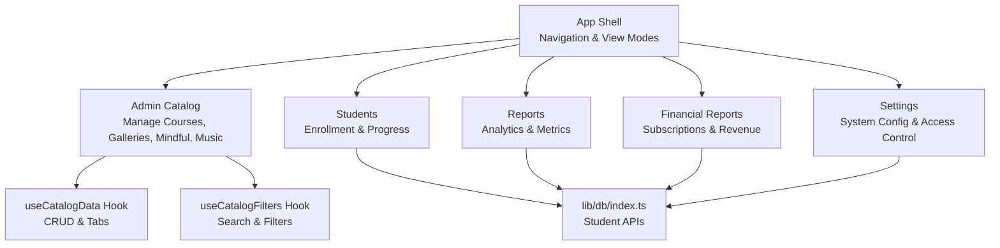
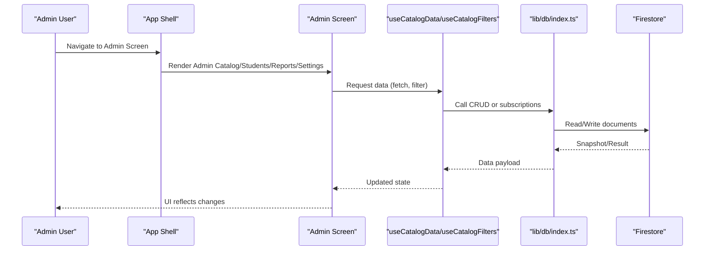
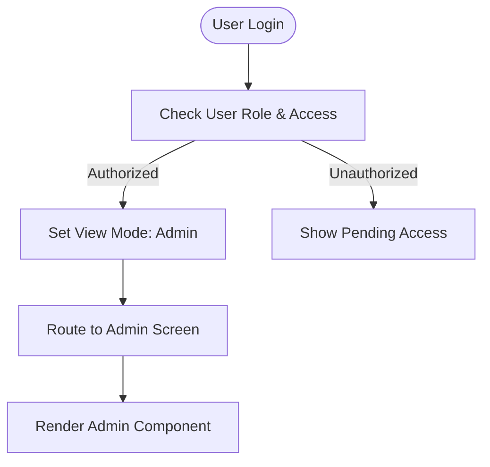
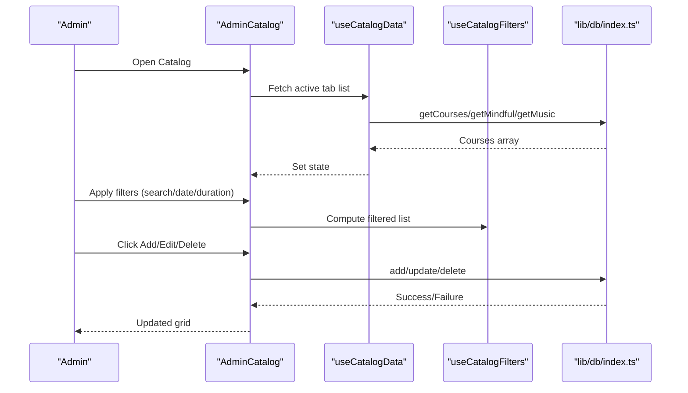
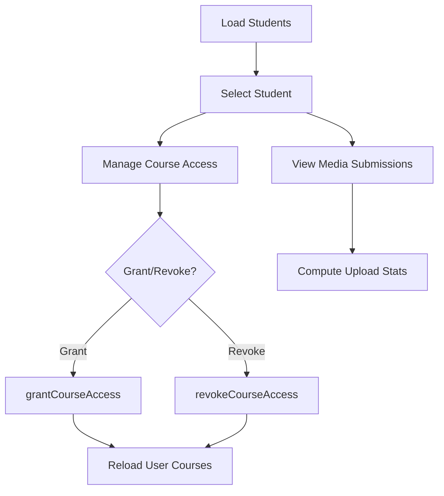
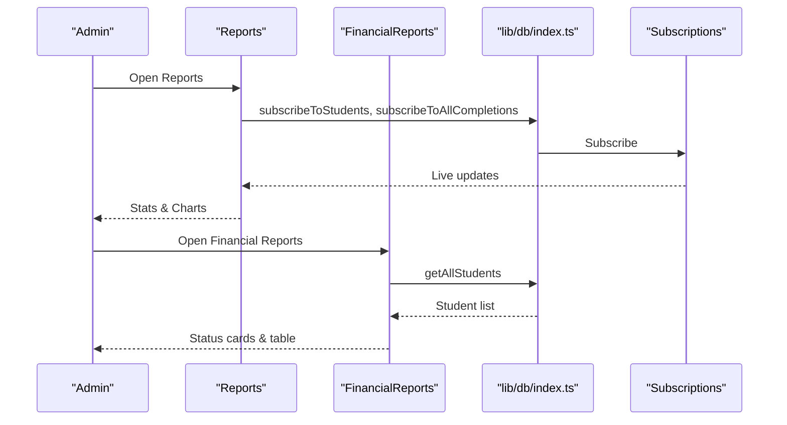
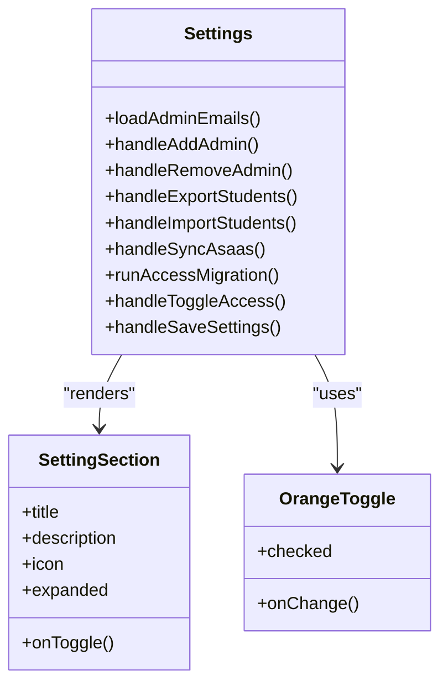
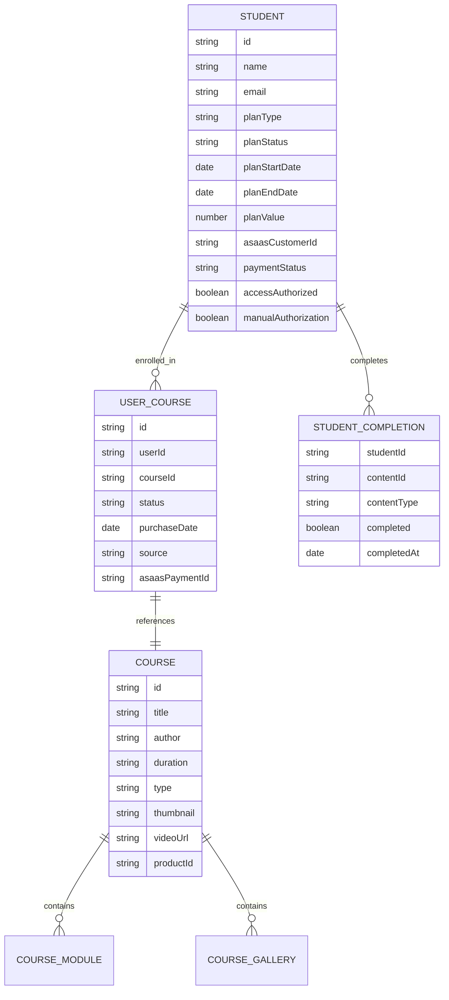
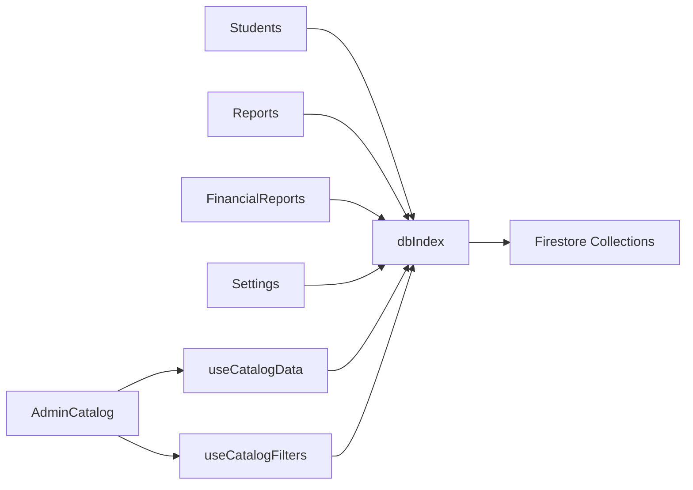

# Administrative Features

<cite>
**Referenced Files in This Document**
- [App.tsx](file://App.tsx)
- [AdminCatalog.tsx](file://components/AdminCatalog.tsx)
- [Students.tsx](file://components/Students.tsx)
- [Reports.tsx](file://components/Reports.tsx)
- [FinancialReports.tsx](file://components/FinancialReports.tsx)
- [Settings.tsx](file://components/Settings.tsx)
- [useCatalogData.ts](file://hooks/useCatalogData.ts)
- [useCatalogFilters.ts](file://hooks/useCatalogFilters.ts)
- [db/index.ts](file://lib/db/index.ts)
- [db/types.ts](file://lib/db/types.ts)
- [db/config.ts](file://lib/db/config.ts)
- [SettingSection.tsx](file://components/ui/SettingSection.tsx)
- [toggle.tsx](file://components/ui/toggle.tsx)
</cite>

## Table of Contents
1. [Introduction](#introduction)
2. [Project Structure](#project-structure)
3. [Core Components](#core-components)
4. [Architecture Overview](#architecture-overview)
5. [Detailed Component Analysis](#detailed-component-analysis)
6. [Dependency Analysis](#dependency-analysis)
7. [Performance Considerations](#performance-considerations)
8. [Troubleshooting Guide](#troubleshooting-guide)
9. [Conclusion](#conclusion)

## Introduction
This document explains the administrative features and dashboard system of the platform. It covers the admin dashboard overview, student management (including enrollment tracking and progress monitoring), course administration tools, system configuration and access control, reporting systems (student performance analytics, financial reports, and usage metrics), settings management, maintenance tools, and user administration workflows. It also describes how administrative actions integrate with real-time system updates, audit logging, and change tracking, and provides practical administrative workflows.

## Project Structure
The administrative features are implemented as React components organized under the components directory, with supporting hooks and database integration under lib and hooks. The App shell orchestrates navigation and view modes (student vs admin), while dedicated screens power each administrative area.

**Diagram sources**
- [App.tsx](file://App.tsx#L240-L324)
- [AdminCatalog.tsx](file://components/AdminCatalog.tsx#L37-L254)
- [Students.tsx](file://components/Students.tsx#L8-L542)
- [Reports.tsx](file://components/Reports.tsx#L21-L80)
- [FinancialReports.tsx](file://components/FinancialReports.tsx#L17-L46)
- [Settings.tsx](file://components/Settings.tsx#L45-L118)
- [useCatalogData.ts](file://hooks/useCatalogData.ts#L20-L156)
- [useCatalogFilters.ts](file://hooks/useCatalogFilters.ts#L8-L85)
- [db/index.ts](file://lib/db/index.ts#L1-L38)

**Section sources**
- [App.tsx](file://App.tsx#L240-L324)
- [AdminCatalog.tsx](file://components/AdminCatalog.tsx#L37-L254)
- [Students.tsx](file://components/Students.tsx#L8-L542)
- [Reports.tsx](file://components/Reports.tsx#L21-L80)
- [FinancialReports.tsx](file://components/FinancialReports.tsx#L17-L46)
- [Settings.tsx](file://components/Settings.tsx#L45-L118)
- [useCatalogData.ts](file://hooks/useCatalogData.ts#L20-L156)
- [useCatalogFilters.ts](file://hooks/useCatalogFilters.ts#L8-L85)
- [db/index.ts](file://lib/db/index.ts#L1-L38)

## Core Components
- Admin Dashboard routing and view mode switching (student/admin) controlled by the App shell.
- Admin Catalog: manage courses, galleries, mindful content, and music with filtering, CRUD, and preview.
- Students: enroll/unenroll students, review media submissions, and manage access.
- Reports: real-time engagement metrics, monthly trends, and recent activity.
- Financial Reports: subscription plans, revenue estimates, expiring/expired students, and plan edits.
- Settings: admin user management, access control, import/export, Asaas sync, migration, and gamification/course defaults.

**Section sources**
- [App.tsx](file://App.tsx#L240-L324)
- [AdminCatalog.tsx](file://components/AdminCatalog.tsx#L37-L254)
- [Students.tsx](file://components/Students.tsx#L8-L542)
- [Reports.tsx](file://components/Reports.tsx#L21-L80)
- [FinancialReports.tsx](file://components/FinancialReports.tsx#L17-L46)
- [Settings.tsx](file://components/Settings.tsx#L45-L118)

## Architecture Overview
Administrative actions are handled by React components that call database functions exported from lib/db. Hooks encapsulate catalog data and filters. Real-time subscriptions feed analytics and recent activity. Settings persist configuration and trigger maintenance tasks.

**Diagram sources**
- [App.tsx](file://App.tsx#L240-L324)
- [AdminCatalog.tsx](file://components/AdminCatalog.tsx#L37-L254)
- [Students.tsx](file://components/Students.tsx#L8-L542)
- [Reports.tsx](file://components/Reports.tsx#L21-L80)
- [FinancialReports.tsx](file://components/FinancialReports.tsx#L17-L46)
- [Settings.tsx](file://components/Settings.tsx#L45-L118)
- [useCatalogData.ts](file://hooks/useCatalogData.ts#L20-L156)
- [useCatalogFilters.ts](file://hooks/useCatalogFilters.ts#L8-L85)
- [db/index.ts](file://lib/db/index.ts#L1-L38)

## Detailed Component Analysis

### Admin Dashboard Overview
- The App shell sets viewMode to admin and routes to admin screens based on currentScreen.
- Admin screens include catalog, students, reports, financial reports, and settings.
- Real-time role and access checks ensure only authorized users enter admin mode.

**Diagram sources**
- [App.tsx](file://App.tsx#L65-L108)
- [App.tsx](file://App.tsx#L240-L324)

**Section sources**
- [App.tsx](file://App.tsx#L65-L108)
- [App.tsx](file://App.tsx#L240-L324)

### Admin Catalog: Course Administration Tools
- Tabs for Courses/Videos, Galleries, Mindful Flow, Music.
- Filtering by search term, release date, and duration.
- CRUD operations via CourseForm and CourseDetail modals.
- Real-time grid rendering with edit/delete/view actions.

**Diagram sources**
- [AdminCatalog.tsx](file://components/AdminCatalog.tsx#L37-L254)
- [useCatalogData.ts](file://hooks/useCatalogData.ts#L20-L156)
- [useCatalogFilters.ts](file://hooks/useCatalogFilters.ts#L8-L85)
- [db/index.ts](file://lib/db/index.ts#L9-L16)

**Section sources**
- [AdminCatalog.tsx](file://components/AdminCatalog.tsx#L37-L254)
- [useCatalogData.ts](file://hooks/useCatalogData.ts#L20-L156)
- [useCatalogFilters.ts](file://hooks/useCatalogFilters.ts#L8-L85)
- [db/index.ts](file://lib/db/index.ts#L9-L16)

### Student Management: Enrollment Tracking and Progress Monitoring
- Lists students with search and manages access per course.
- Media submission viewer grouped by date and course.
- Grants/revokes course access and updates user-course records.
- Progress monitoring via enrolled courses and completion events.

**Diagram sources**
- [Students.tsx](file://components/Students.tsx#L33-L85)
- [db/index.ts](file://lib/db/index.ts#L22-L34)

**Section sources**
- [Students.tsx](file://components/Students.tsx#L8-L542)
- [db/index.ts](file://lib/db/index.ts#L22-L34)

### Reporting Systems: Analytics, Financial Reports, and Usage Metrics
- Reports: real-time total students, monthly completion trends, recent activity.
- FinancialReports: active/expired/expiring counts, revenue estimation, plan editing.
- Both leverage Firestore subscriptions for live updates.

**Diagram sources**
- [Reports.tsx](file://components/Reports.tsx#L21-L80)
- [FinancialReports.tsx](file://components/FinancialReports.tsx#L17-L46)
- [db/index.ts](file://lib/db/index.ts#L28-L28)

**Section sources**
- [Reports.tsx](file://components/Reports.tsx#L21-L282)
- [FinancialReports.tsx](file://components/FinancialReports.tsx#L17-L535)
- [db/index.ts](file://lib/db/index.ts#L28-L28)

### Settings Management: System Configuration and Access Control
- Users & Permissions: admin user management, import/export student data, Asaas sync, access control toggles, migration.
- Courses & Content: default course settings, completion criteria, media limits.
- Gamification: XP values, level cap, achievements, streak rules.
- Centralized admin configuration and UI helpers (SettingSection, OrangeToggle).

**Diagram sources**
- [Settings.tsx](file://components/Settings.tsx#L45-L350)
- [SettingSection.tsx](file://components/ui/SettingSection.tsx#L15-L53)
- [toggle.tsx](file://components/ui/toggle.tsx#L36-L61)

**Section sources**
- [Settings.tsx](file://components/Settings.tsx#L45-L915)
- [SettingSection.tsx](file://components/ui/SettingSection.tsx#L15-L53)
- [toggle.tsx](file://components/ui/toggle.tsx#L36-L61)
- [db/config.ts](file://lib/db/config.ts#L1-L19)

### Data Models and Relationships
Administrative features rely on shared data models for courses, completions, and students.

**Diagram sources**
- [db/types.ts](file://lib/db/types.ts#L36-L89)

**Section sources**
- [db/types.ts](file://lib/db/types.ts#L1-L90)

## Dependency Analysis
Administrative screens depend on lib/db for data access and hooks for state logic. Real-time updates come from Firestore subscriptions.

**Diagram sources**
- [AdminCatalog.tsx](file://components/AdminCatalog.tsx#L19-L28)
- [Students.tsx](file://components/Students.tsx#L3-L6)
- [Reports.tsx](file://components/Reports.tsx#L19-L19)
- [FinancialReports.tsx](file://components/FinancialReports.tsx#L15-L15)
- [Settings.tsx](file://components/Settings.tsx#L36-L43)
- [useCatalogData.ts](file://hooks/useCatalogData.ts#L1-L16)
- [useCatalogFilters.ts](file://hooks/useCatalogFilters.ts#L1-L6)
- [db/index.ts](file://lib/db/index.ts#L1-L38)

**Section sources**
- [db/index.ts](file://lib/db/index.ts#L1-L38)

## Performance Considerations
- UseCatalogData consolidates fetching and CRUD operations per tab to minimize redundant queries.
- useCatalogFilters computes filtered lists memoized by dependencies to avoid heavy recomputations.
- Real-time subscriptions in Reports and FinancialReports update incrementally, reducing polling overhead.
- Lazy loading of admin screens reduces initial bundle size.

[No sources needed since this section provides general guidance]

## Troubleshooting Guide
- Unauthorized access: The App shell blocks non-admin users except those with admin emails; pending access displays guidance and logout.
- Role synchronization: On login, roles are fetched and admin emails are enforced; access checks include payment status.
- Settings persistence: Save button logs settings to console; implement Firestore writes to persist changes.
- Data export/import: CSV export/import alerts indicate success/error; ensure CSV format matches expectations.
- Asaas sync/migration: Buttons prompt confirmations; errors are surfaced via alerts; reload data after completion.

**Section sources**
- [App.tsx](file://App.tsx#L175-L238)
- [Settings.tsx](file://components/Settings.tsx#L144-L334)
- [FinancialReports.tsx](file://components/FinancialReports.tsx#L259-L289)

## Conclusion
The administrative system integrates a modular React component architecture with Firestore-backed data access and real-time subscriptions. Admins can manage content, enrollments, access control, and system settings, while reports provide actionable insights. The design emphasizes separation of concerns via hooks, reusable UI components, and centralized configuration for maintainability and scalability.