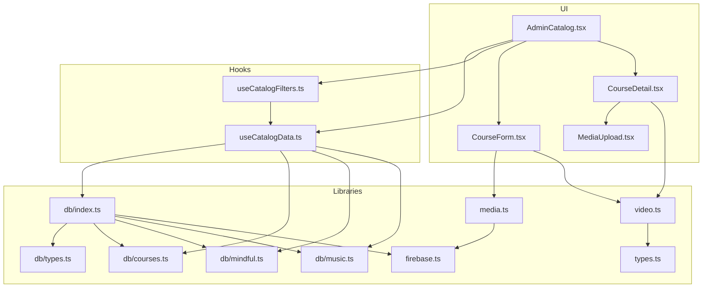
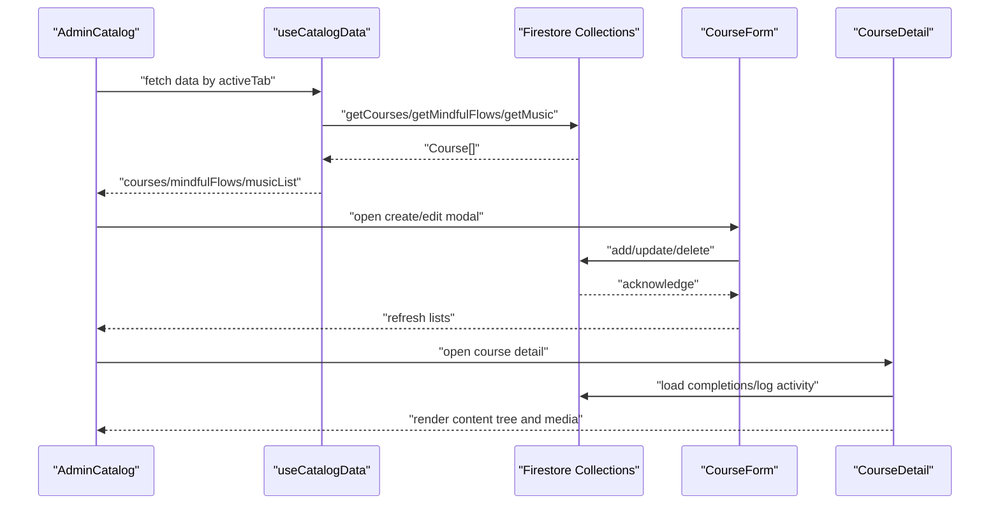
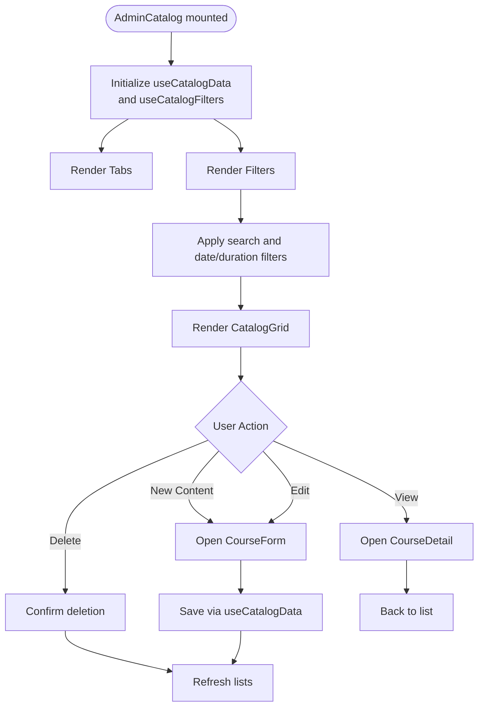
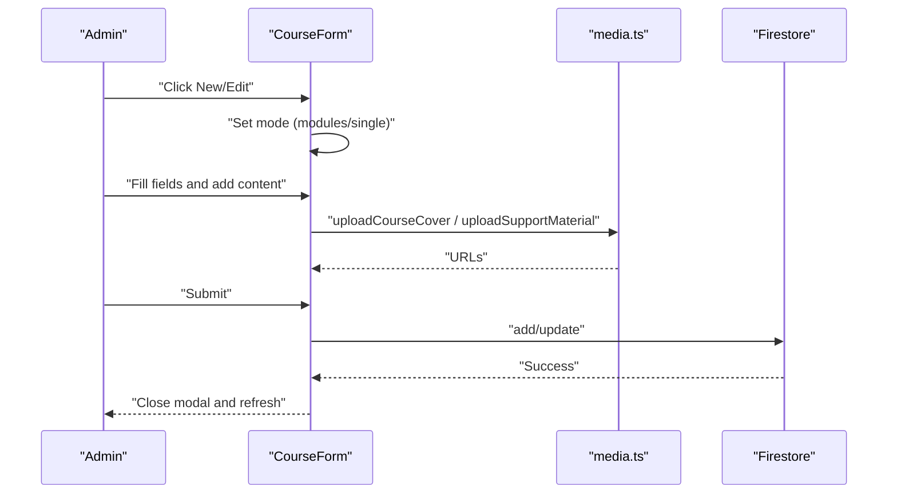
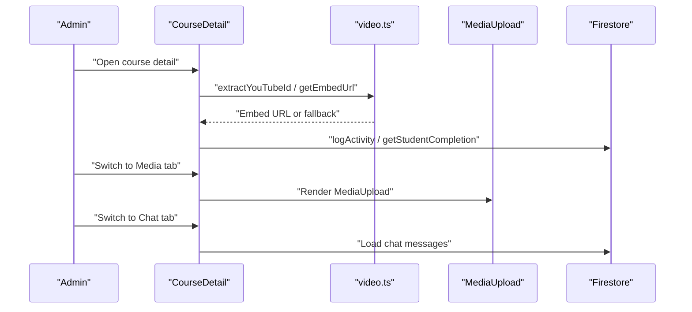
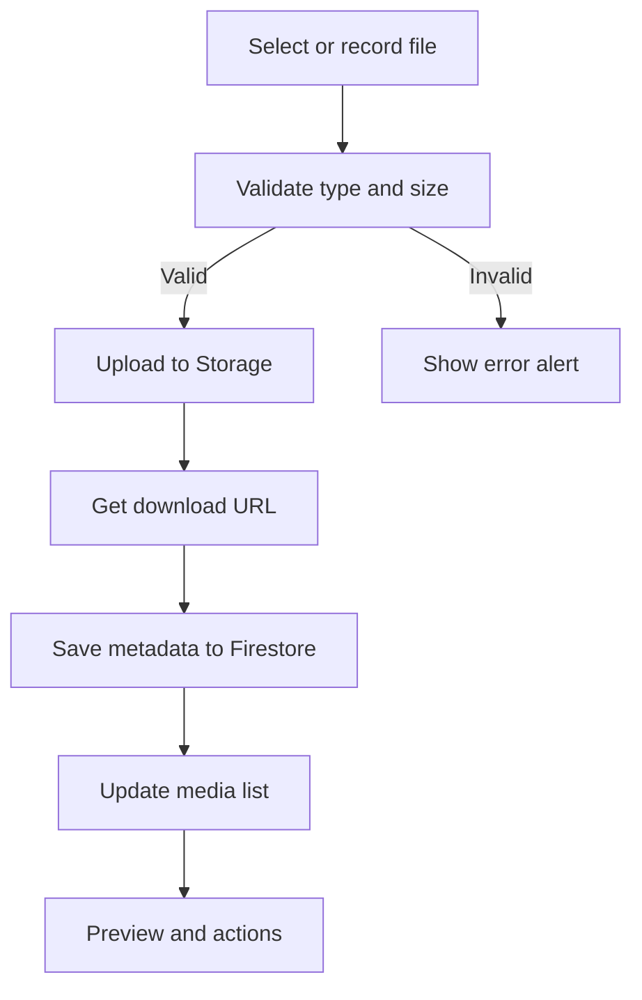
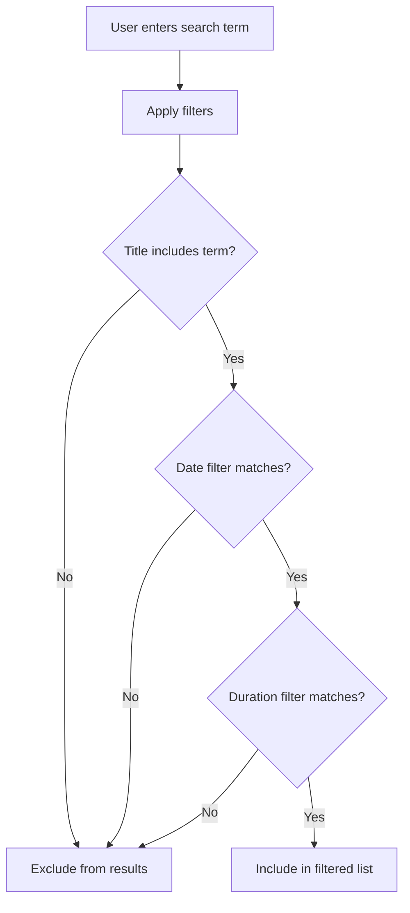
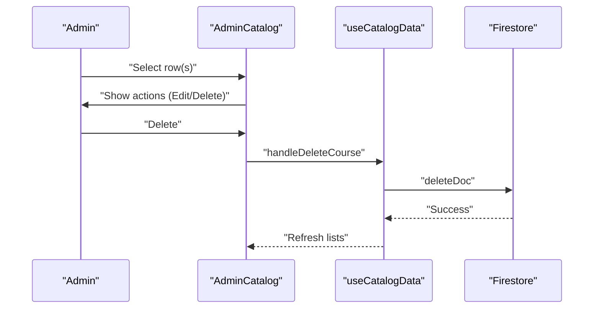
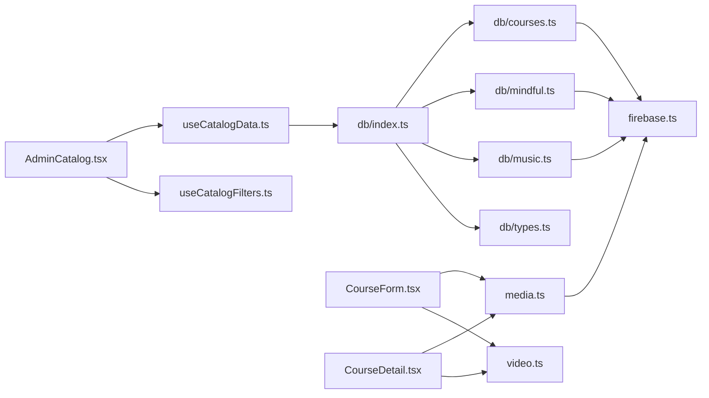

# Course Administration

<cite>
**Referenced Files in This Document**
- [AdminCatalog.tsx](file://components/AdminCatalog.tsx)
- [CourseForm.tsx](file://components/CourseForm.tsx)
- [CourseDetail.tsx](file://components/CourseDetail.tsx)
- [MediaUpload.tsx](file://components/MediaUpload.tsx)
- [useCatalogData.ts](file://hooks/useCatalogData.ts)
- [useCatalogFilters.ts](file://hooks/useCatalogFilters.ts)
- [firebase.ts](file://lib/firebase.ts)
- [db/index.ts](file://lib/db/index.ts)
- [db/types.ts](file://lib/db/types.ts)
- [db/courses.ts](file://lib/db/courses.ts)
- [db/mindful.ts](file://lib/db/mindful.ts)
- [db/music.ts](file://lib/db/music.ts)
- [media.ts](file://lib/media.ts)
- [video.ts](file://lib/video.ts)
- [types.ts](file://types.ts)
</cite>

## Table of Contents
1. [Introduction](#introduction)
2. [Project Structure](#project-structure)
3. [Core Components](#core-components)
4. [Architecture Overview](#architecture-overview)
5. [Detailed Component Analysis](#detailed-component-analysis)
6. [Dependency Analysis](#dependency-analysis)
7. [Performance Considerations](#performance-considerations)
8. [Troubleshooting Guide](#troubleshooting-guide)
9. [Conclusion](#conclusion)
10. [Appendices](#appendices)

## Introduction
This document explains the course administration system for managing content catalogs, creating and editing course materials, and handling media uploads. It covers:
- The course catalog management interface and navigation
- Content creation workflows for courses, modules, lessons, and galleries
- Media management for course covers, support materials, and student submissions
- Filtering and search capabilities
- Bulk operations and administrative actions
- Integration with Firebase Firestore and Firebase Storage
- Validation processes and upload handling
- Practical examples for administrators to create, edit, and manage content

## Project Structure
The system is organized around:
- Admin UI components for catalog browsing and editing
- Hooks for data fetching and filtering
- Libraries for Firebase integration, media handling, and video utilities
- Database abstraction for Firestore collections

**Diagram sources**
- [AdminCatalog.tsx](file://components/AdminCatalog.tsx#L37-L254)
- [CourseForm.tsx](file://components/CourseForm.tsx#L43-L131)
- [CourseDetail.tsx](file://components/CourseDetail.tsx#L19-L523)
- [MediaUpload.tsx](file://components/MediaUpload.tsx#L14-L589)
- [useCatalogData.ts](file://hooks/useCatalogData.ts#L20-L156)
- [useCatalogFilters.ts](file://hooks/useCatalogFilters.ts#L8-L85)
- [firebase.ts](file://lib/firebase.ts#L1-L25)
- [db/index.ts](file://lib/db/index.ts#L1-L38)
- [db/types.ts](file://lib/db/types.ts#L1-L90)
- [db/courses.ts](file://lib/db/courses.ts#L8-L98)
- [db/mindful.ts](file://lib/db/mindful.ts#L8-L93)
- [db/music.ts](file://lib/db/music.ts#L8-L93)
- [media.ts](file://lib/media.ts#L1-L369)
- [video.ts](file://lib/video.ts#L1-L149)
- [types.ts](file://types.ts#L71-L82)

**Section sources**
- [AdminCatalog.tsx](file://components/AdminCatalog.tsx#L37-L254)
- [useCatalogData.ts](file://hooks/useCatalogData.ts#L20-L156)
- [useCatalogFilters.ts](file://hooks/useCatalogFilters.ts#L8-L85)
- [firebase.ts](file://lib/firebase.ts#L1-L25)
- [db/index.ts](file://lib/db/index.ts#L1-L38)
- [media.ts](file://lib/media.ts#L1-L369)
- [video.ts](file://lib/video.ts#L1-L149)
- [types.ts](file://types.ts#L71-L82)

## Core Components
- AdminCatalog: Central admin interface for browsing, filtering, and managing courses, galleries, mindful flows, and music.
- CourseForm: Form for creating/editing courses, modules, lessons, and galleries; handles cover uploads and support material uploads.
- CourseDetail: Course viewer with embedded player, content tree, media upload panel, and chat integration.
- MediaUpload: Student-facing media submission panel with drag-and-drop, recording, and file previews.
- useCatalogData: Hook orchestrating data fetching, saving, and deletion across tabs.
- useCatalogFilters: Hook implementing search and filters (date range, duration).
- Firebase integration: Firestore and Storage initialization and usage across libraries.
- Media utilities: Cover and support material upload, file type detection, and progress handling.
- Video utilities: YouTube and Google Drive URL parsing and embedding.

**Section sources**
- [AdminCatalog.tsx](file://components/AdminCatalog.tsx#L37-L254)
- [CourseForm.tsx](file://components/CourseForm.tsx#L43-L131)
- [CourseDetail.tsx](file://components/CourseDetail.tsx#L19-L523)
- [MediaUpload.tsx](file://components/MediaUpload.tsx#L14-L589)
- [useCatalogData.ts](file://hooks/useCatalogData.ts#L20-L156)
- [useCatalogFilters.ts](file://hooks/useCatalogFilters.ts#L8-L85)
- [firebase.ts](file://lib/firebase.ts#L1-L25)
- [media.ts](file://lib/media.ts#L1-L369)
- [video.ts](file://lib/video.ts#L1-L149)

## Architecture Overview
The admin catalog integrates UI, hooks, and data access layers with Firebase. Administrators can:
- Switch between tabs (courses, galleries, mindful, music)
- Apply search and filters
- Open forms to create or edit content
- Manage content via CRUD actions
- View content details with embedded players and side panels

**Diagram sources**
- [AdminCatalog.tsx](file://components/AdminCatalog.tsx#L37-L254)
- [useCatalogData.ts](file://hooks/useCatalogData.ts#L30-L111)
- [db/courses.ts](file://lib/db/courses.ts#L8-L52)
- [db/mindful.ts](file://lib/db/mindful.ts#L8-L52)
- [db/music.ts](file://lib/db/music.ts#L8-L52)
- [CourseForm.tsx](file://components/CourseForm.tsx#L99-L131)
- [CourseDetail.tsx](file://components/CourseDetail.tsx#L56-L71)

## Detailed Component Analysis

### AdminCatalog: Catalog Management Interface
- Tabs: Courses/Videos, Galleries, Mindful Flow, Music
- Filter bar: Search term, release date filter, duration filter
- Grid layout: Cards with thumbnails, badges, and action menus
- Actions: View, Edit, Delete; New Content button opens CourseForm
- Responsive design with modals and fixed detail panel

**Diagram sources**
- [AdminCatalog.tsx](file://components/AdminCatalog.tsx#L37-L254)
- [useCatalogData.ts](file://hooks/useCatalogData.ts#L61-L126)
- [useCatalogFilters.ts](file://hooks/useCatalogFilters.ts#L28-L63)

**Section sources**
- [AdminCatalog.tsx](file://components/AdminCatalog.tsx#L37-L254)
- [useCatalogFilters.ts](file://hooks/useCatalogFilters.ts#L8-L85)

### CourseForm: Course Creation and Editing
- Modes: Modules/Galleries vs Single Video
- Fields: Title, author, duration, launch date, description, video URL, cover image
- Galleries: Add/remove galleries, expand/collapse, set cover images
- Modules: Add/remove modules, expand/collapse, set cover images
- Lessons: Add/remove lessons, set type (video/audio/pdf), duration, description
- Support materials: Upload PDFs, images, audio with size/type checks
- Cover uploads: Link or file upload
- Validation: Clears conflicting fields based on mode; productId selection depends on tab

**Diagram sources**
- [CourseForm.tsx](file://components/CourseForm.tsx#L43-L131)
- [media.ts](file://lib/media.ts#L120-L161)
- [media.ts](file://lib/media.ts#L301-L368)
- [db/courses.ts](file://lib/db/courses.ts#L19-L42)

**Section sources**
- [CourseForm.tsx](file://components/CourseForm.tsx#L43-L131)
- [media.ts](file://lib/media.ts#L120-L161)
- [media.ts](file://lib/media.ts#L301-L368)
- [db/types.ts](file://lib/db/types.ts#L36-L51)

### CourseDetail: Content Viewer and Side Panels
- Embedded player: YouTube, Google Drive, or direct video URL
- Content tree: Galleries → Modules → Lessons with expand/collapse
- Completion tracking: Mark course complete/incomplete
- Media panel: Integrates MediaUpload for submissions
- Chat panel: CourseChat integration

**Diagram sources**
- [CourseDetail.tsx](file://components/CourseDetail.tsx#L19-L523)
- [video.ts](file://lib/video.ts#L12-L107)
- [MediaUpload.tsx](file://components/MediaUpload.tsx#L14-L589)

**Section sources**
- [CourseDetail.tsx](file://components/CourseDetail.tsx#L19-L523)
- [video.ts](file://lib/video.ts#L12-L107)
- [MediaUpload.tsx](file://components/MediaUpload.tsx#L14-L589)

### Media Management
- Course covers: uploadCourseCover with progress callbacks
- Support materials: uploadSupportMaterial with type and size validation
- Student submissions: MediaUpload with drag-and-drop, recording, previews, and deletions
- Storage: Firebase Storage refs and download URLs
- Metadata: Firestore documents for media submissions

**Diagram sources**
- [media.ts](file://lib/media.ts#L120-L161)
- [media.ts](file://lib/media.ts#L301-L368)
- [MediaUpload.tsx](file://components/MediaUpload.tsx#L86-L155)

**Section sources**
- [media.ts](file://lib/media.ts#L1-L369)
- [MediaUpload.tsx](file://components/MediaUpload.tsx#L14-L589)

### Filtering and Search
- Search: Case-insensitive substring match on course title
- Date filter: Recent (30 days), Upcoming, Past
- Duration filter: Short (<10 min), Medium (10–30 min), Long (>30 min)
- Clear filters resets all filter states

**Diagram sources**
- [useCatalogFilters.ts](file://hooks/useCatalogFilters.ts#L28-L63)

**Section sources**
- [useCatalogFilters.ts](file://hooks/useCatalogFilters.ts#L8-L85)

### Bulk Operations and Administrative Actions
- Bulk delete: Confirm dialog before deletion; refreshes lists per tab
- Bulk create/edit: Use CourseForm to add galleries/modules/lessons
- Cross-tab management: Courses, Galleries, Mindful, Music each use dedicated collections

**Diagram sources**
- [AdminCatalog.tsx](file://components/AdminCatalog.tsx#L37-L254)
- [useCatalogData.ts](file://hooks/useCatalogData.ts#L113-L126)
- [db/courses.ts](file://lib/db/courses.ts#L42-L52)

**Section sources**
- [AdminCatalog.tsx](file://components/AdminCatalog.tsx#L37-L254)
- [useCatalogData.ts](file://hooks/useCatalogData.ts#L113-L126)

## Dependency Analysis
- UI components depend on hooks for state and data
- Hooks depend on db/index.ts barrel exports for collection access
- db/index.ts re-exports types and collection-specific functions
- Firebase integration centralized in firebase.ts
- Media and video utilities are standalone but integrated by components

**Diagram sources**
- [AdminCatalog.tsx](file://components/AdminCatalog.tsx#L37-L254)
- [useCatalogData.ts](file://hooks/useCatalogData.ts#L20-L156)
- [useCatalogFilters.ts](file://hooks/useCatalogFilters.ts#L8-L85)
- [db/index.ts](file://lib/db/index.ts#L1-L38)
- [db/courses.ts](file://lib/db/courses.ts#L8-L98)
- [db/mindful.ts](file://lib/db/mindful.ts#L8-L93)
- [db/music.ts](file://lib/db/music.ts#L8-L93)
- [media.ts](file://lib/media.ts#L1-L369)
- [video.ts](file://lib/video.ts#L1-L149)
- [firebase.ts](file://lib/firebase.ts#L1-L25)

**Section sources**
- [db/index.ts](file://lib/db/index.ts#L1-L38)
- [firebase.ts](file://lib/firebase.ts#L1-L25)

## Performance Considerations
- Lazy loading: CourseDetail defers heavy operations until mounted
- Memoization: useCatalogFilters uses useMemo to avoid unnecessary recomputation
- Local cache: Firestore initialized with persistent local cache for offline resilience
- Debounce: Consider debouncing search input for large catalogs
- Virtualization: For very large grids, consider virtualized lists to reduce DOM nodes

[No sources needed since this section provides general guidance]

## Troubleshooting Guide
Common issues and resolutions:
- CORS errors during media upload: Configure CORS in Firebase Storage or adjust rules as indicated in media upload logs
- Unauthorized storage access: Verify Firebase Storage rules allow authenticated writes
- Large file uploads: Ensure file size does not exceed 50 MB for support materials
- Video duration not captured: Direct video URLs must be supported formats; YouTube/Drive use iframes and are handled separately

**Section sources**
- [media.ts](file://lib/media.ts#L54-L73)
- [media.ts](file://lib/media.ts#L314-L331)
- [CourseDetail.tsx](file://components/CourseDetail.tsx#L73-L126)

## Conclusion
The course administration system provides a comprehensive toolkit for managing educational content. Administrators can efficiently browse, filter, and edit courses, modules, and galleries while leveraging robust media handling and Firebase integration. The modular architecture ensures maintainability and scalability across courses, mindful flows, and music content.

[No sources needed since this section summarizes without analyzing specific files]

## Appendices

### Practical Workflows

- Create a new course with modules and lessons
  - Open AdminCatalog, click “New Content,” choose “Galleries” mode
  - Fill course info and add galleries/modules/lessons
  - Upload cover images and support materials
  - Save; the system persists to Firestore and refreshes the grid

- Edit an existing course
  - From AdminCatalog, select “Edit” from the content card menu
  - Modify fields, add/remove galleries/modules/lessons
  - Save to update Firestore

- Upload support materials for a lesson
  - In CourseDetail, go to the “Media” tab
  - Drag-and-drop or select a PDF/image/audio under 50 MB
  - The system validates type and size, uploads to Storage, and saves metadata

- Manage student-submitted media
  - In CourseDetail “Media” tab, instructors can view, download, and delete submissions
  - Students see their own submissions and can delete them

- Filter and search content
  - Use the search bar to filter by title
  - Apply date and duration filters to narrow results
  - Clear filters to reset

**Section sources**
- [AdminCatalog.tsx](file://components/AdminCatalog.tsx#L76-L82)
- [CourseForm.tsx](file://components/CourseForm.tsx#L99-L131)
- [CourseDetail.tsx](file://components/CourseDetail.tsx#L498-L506)
- [media.ts](file://lib/media.ts#L301-L368)
- [useCatalogFilters.ts](file://hooks/useCatalogFilters.ts#L28-L63)