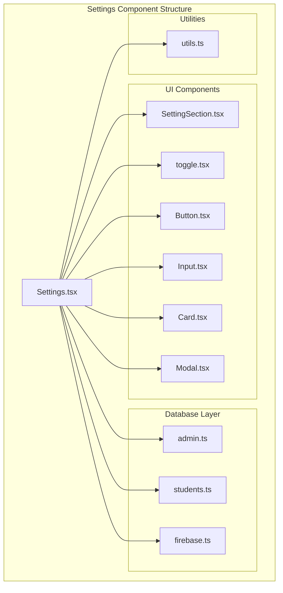
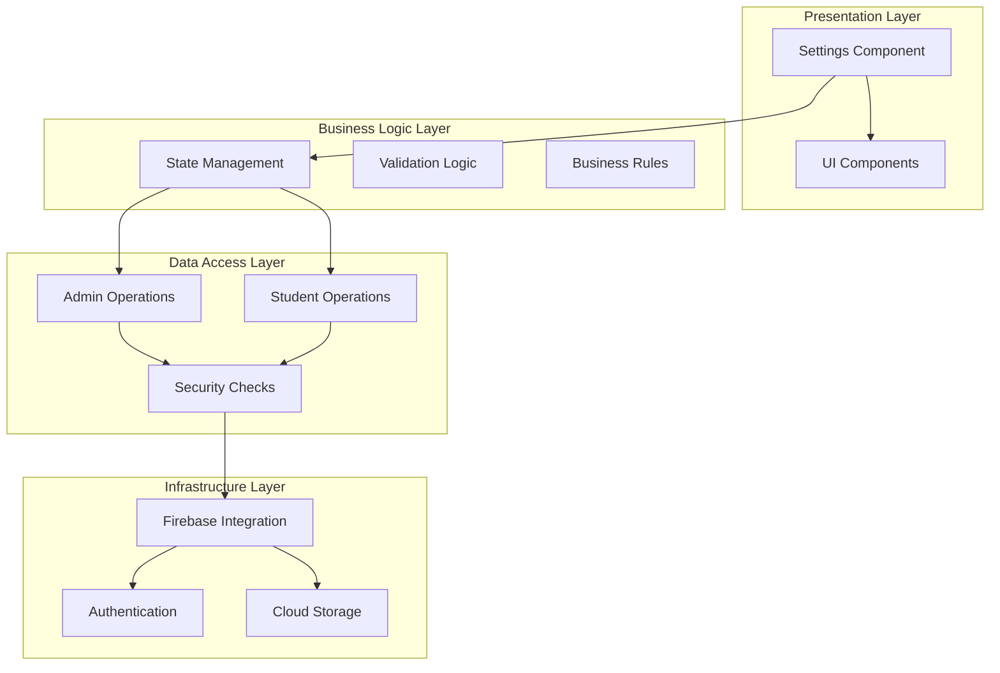
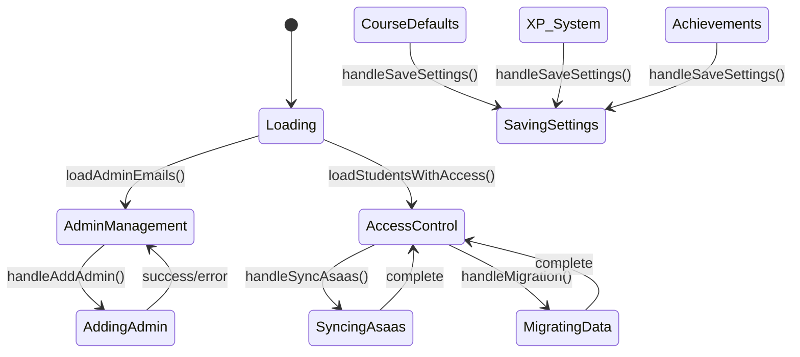
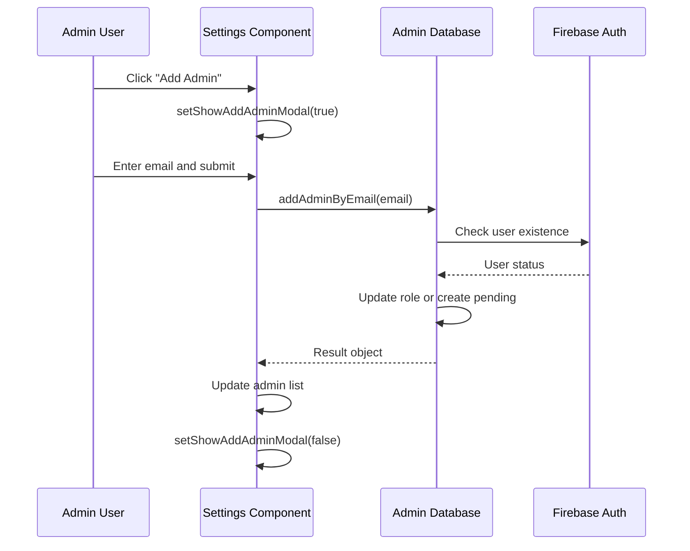
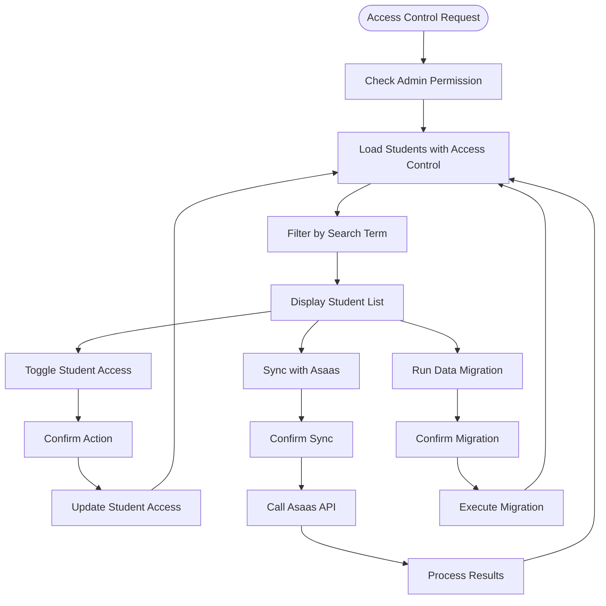
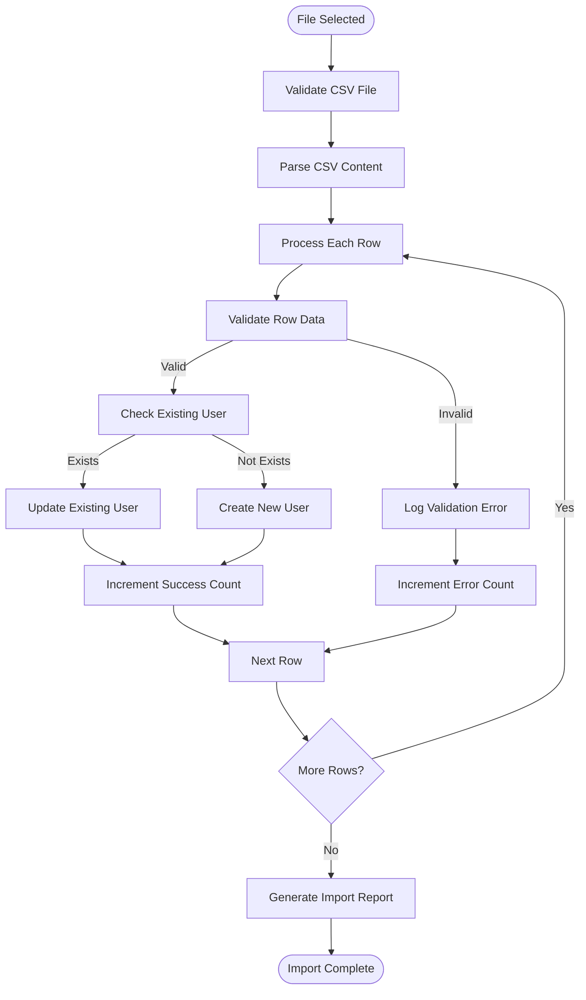
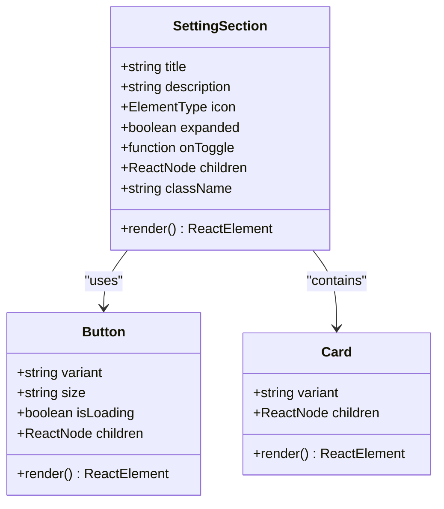
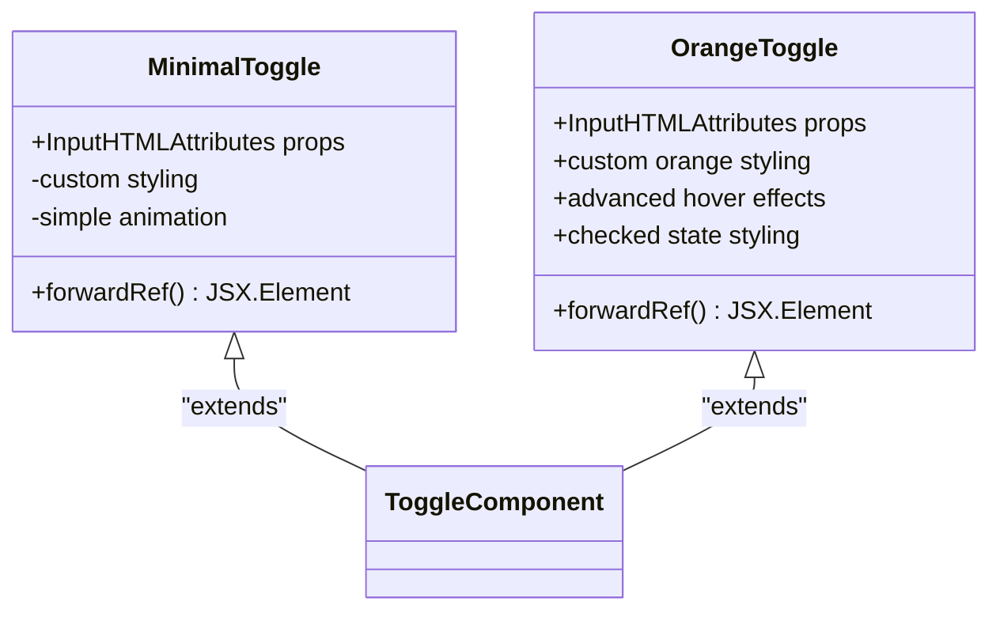
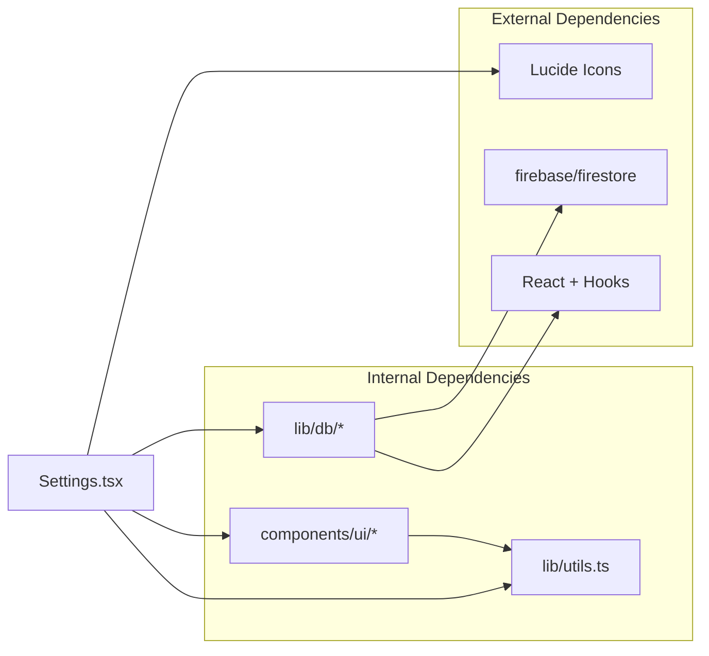
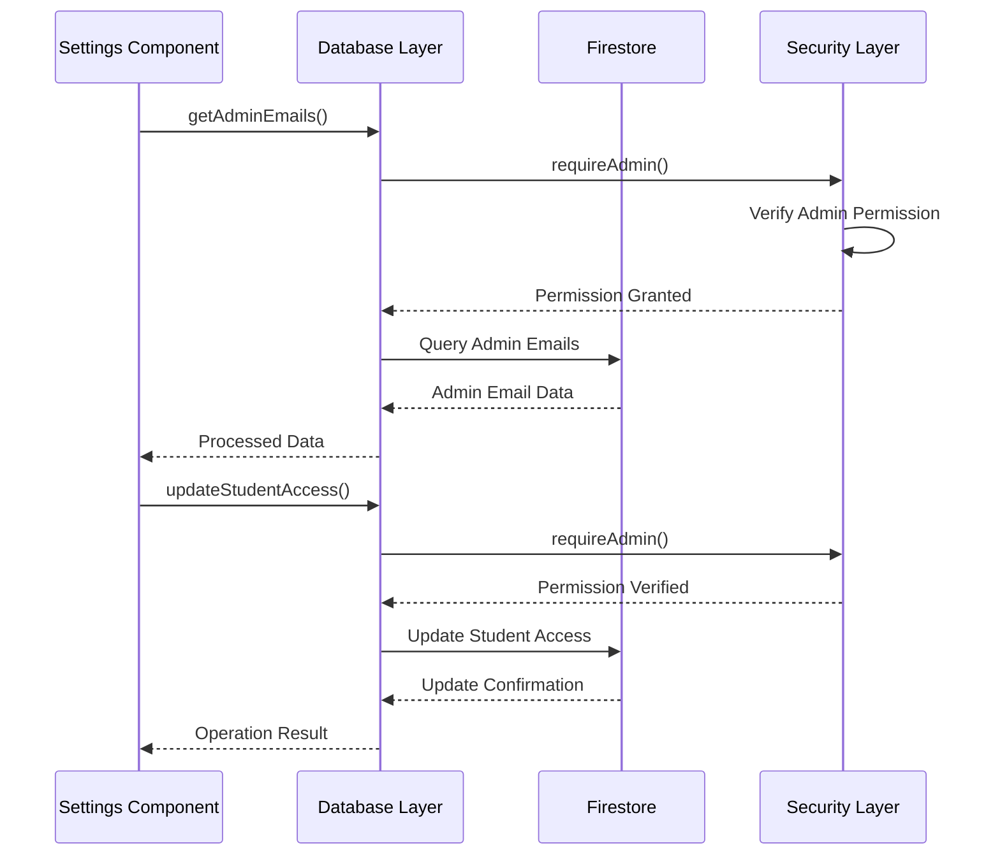

# Enhanced Settings Component

<cite>
**Referenced Files in This Document**
- [Settings.tsx](file://components/Settings.tsx)
- [SettingSection.tsx](file://components/ui/SettingSection.tsx)
- [toggle.tsx](file://components/ui/toggle.tsx)
- [Button.tsx](file://components/ui/Button.tsx)
- [Input.tsx](file://components/ui/Input.tsx)
- [Card.tsx](file://components/ui/Card.tsx)
- [Modal.tsx](file://components/ui/Modal.tsx)
- [admin.ts](file://lib/db/admin.ts)
- [students.ts](file://lib/db/students.ts)
- [firebase.ts](file://lib/firebase.ts)
- [utils.ts](file://lib/utils.ts)
</cite>

## Table of Contents
1. [Introduction](#introduction)
2. [Project Structure](#project-structure)
3. [Core Components](#core-components)
4. [Architecture Overview](#architecture-overview)
5. [Detailed Component Analysis](#detailed-component-analysis)
6. [Dependency Analysis](#dependency-analysis)
7. [Performance Considerations](#performance-considerations)
8. [Troubleshooting Guide](#troubleshooting-guide)
9. [Conclusion](#conclusion)

## Introduction
The Enhanced Settings Component is a comprehensive administrative interface for the Fluentoria platform, designed to manage users, permissions, course configurations, and gamification systems. This component provides a centralized location for administrators to control various aspects of the learning management system, including user administration, access control, content management, and reward systems.

The component follows modern React patterns with TypeScript integration, utilizing a modular architecture that separates concerns across different functional areas. It leverages Firebase for data persistence and authentication, implementing robust security measures and real-time synchronization capabilities.

## Project Structure
The Enhanced Settings Component is organized within the components/settings directory, following a structured approach that promotes maintainability and scalability. The component integrates with reusable UI primitives located in the components/ui directory, ensuring consistency across the application.

**Diagram sources**
- [Settings.tsx:1-50](file://components/Settings.tsx#L1-L50)
- [SettingSection.tsx:1-25](file://components/ui/SettingSection.tsx#L1-L25)
- [admin.ts:1-30](file://lib/db/admin.ts#L1-L30)

**Section sources**
- [Settings.tsx:1-120](file://components/Settings.tsx#L1-L120)
- [utils.ts:1-7](file://lib/utils.ts#L1-L7)

## Core Components

### Settings Container Component
The main Settings component serves as the primary orchestrator, managing state for all administrative functions while delegating UI rendering to specialized child components. It implements a tabbed interface structure that organizes functionality into logical categories.

Key responsibilities include:
- State management for all administrative operations
- Tab navigation and content organization
- Integration with database operations
- User interface coordination and validation

### SettingSection Component
A reusable container component that provides collapsible sections with consistent styling and behavior. Each section includes an icon, title, description, and expandable content area with smooth animations.

### Toggle Components
Two distinct toggle implementations provide different visual styles for boolean state management:
- MinimalToggle: Lightweight implementation with subtle styling
- OrangeToggle: Feature-rich toggle with custom styling and hover effects

### Utility Components
Supporting components that handle specific UI patterns:
- Button: Consistent button styling with loading states
- Input: Styled input fields with optional icons
- Card: Flexible card containers with glass effect options
- Modal: Full-screen modal dialogs with backdrop blur

**Section sources**
- [Settings.tsx:45-120](file://components/Settings.tsx#L45-L120)
- [SettingSection.tsx:15-53](file://components/ui/SettingSection.tsx#L15-L53)
- [toggle.tsx:36-61](file://components/ui/toggle.tsx#L36-L61)

## Architecture Overview

The Enhanced Settings Component follows a layered architecture pattern that separates concerns across multiple abstraction levels:

**Diagram sources**
- [Settings.tsx:115-142](file://components/Settings.tsx#L115-L142)
- [admin.ts:7-22](file://lib/db/admin.ts#L7-L22)
- [firebase.ts:16-25](file://lib/firebase.ts#L16-L25)

The architecture implements several key design patterns:
- **Separation of Concerns**: Clear boundaries between presentation, business logic, and data access layers
- **Reusability**: Shared UI components and utility functions across the application
- **Security**: Centralized authentication and authorization checks
- **Scalability**: Modular design allowing for easy extension of functionality

## Detailed Component Analysis

### Settings Component State Management

The Settings component manages multiple state objects that control different aspects of the administrative interface:

**Diagram sources**
- [Settings.tsx:115-142](file://components/Settings.tsx#L115-L142)
- [Settings.tsx:144-186](file://components/Settings.tsx#L144-L186)
- [Settings.tsx:259-289](file://components/Settings.tsx#L259-L289)

#### Admin Management System
The admin management functionality provides comprehensive control over administrative users:

**Admin Operations Flow:**

**Diagram sources**
- [Settings.tsx:144-167](file://components/Settings.tsx#L144-L167)
- [admin.ts:168-205](file://lib/db/admin.ts#L168-L205)

#### Student Access Control System
The access control system manages student permissions and payment-based authorization:

**Access Control Flow:**

**Diagram sources**
- [Settings.tsx:313-334](file://components/Settings.tsx#L313-L334)
- [Settings.tsx:259-289](file://components/Settings.tsx#L259-L289)
- [Settings.tsx:291-311](file://components/Settings.tsx#L291-L311)

#### Data Import/Export System
The data management system provides bulk operations for student records:

**Data Import Process:**

**Diagram sources**
- [Settings.tsx:215-257](file://components/Settings.tsx#L215-L257)
- [students.ts:180-257](file://lib/db/students.ts#L180-L257)

**Section sources**
- [Settings.tsx:58-118](file://components/Settings.tsx#L58-L118)
- [Settings.tsx:144-334](file://components/Settings.tsx#L144-L334)

### UI Component Architecture

The Settings component leverages a comprehensive set of reusable UI components that provide consistent styling and behavior:

#### SettingSection Component
The SettingSection component implements a collapsible accordion pattern with animated transitions:

**Component Structure:**

**Diagram sources**
- [SettingSection.tsx:5-23](file://components/ui/SettingSection.tsx#L5-L23)
- [Button.tsx:4-18](file://components/ui/Button.tsx#L4-L18)
- [Card.tsx:4-16](file://components/ui/Card.tsx#L4-L16)

#### Toggle Component Variants
The toggle system provides two distinct implementations for different use cases:

**Toggle Implementation Comparison:**

**Diagram sources**
- [toggle.tsx:6-33](file://components/ui/toggle.tsx#L6-L33)
- [toggle.tsx:36-58](file://components/ui/toggle.tsx#L36-L58)

**Section sources**
- [SettingSection.tsx:15-53](file://components/ui/SettingSection.tsx#L15-L53)
- [toggle.tsx:36-61](file://components/ui/toggle.tsx#L36-L61)

## Dependency Analysis

The Enhanced Settings Component has well-defined dependencies that promote modularity and maintainability:

**Diagram sources**
- [Settings.tsx:1-44](file://components/Settings.tsx#L1-L44)
- [utils.ts:1-7](file://lib/utils.ts#L1-L7)

### Database Integration Pattern
The component follows a clean separation between UI logic and database operations:

**Database Operation Flow:**

**Diagram sources**
- [Settings.tsx:120-142](file://components/Settings.tsx#L120-L142)
- [admin.ts:280-306](file://lib/db/admin.ts#L280-L306)

**Section sources**
- [Settings.tsx:36-44](file://components/Settings.tsx#L36-L44)
- [admin.ts:7-22](file://lib/db/admin.ts#L7-L22)

## Performance Considerations

The Enhanced Settings Component implements several performance optimization strategies:

### State Management Optimization
- **Selective State Updates**: Individual state objects prevent unnecessary re-renders
- **Efficient Filtering**: Client-side filtering reduces server requests
- **Loading States**: Proper loading indicators improve perceived performance

### Memory Management
- **Cleanup Functions**: Proper cleanup in useEffect hooks prevents memory leaks
- **Event Handler Optimization**: useCallback prevents handler recreation
- **Conditional Rendering**: Dynamic component rendering based on state

### Data Fetching Strategies
- **Batch Operations**: Combined database queries reduce network overhead
- **Caching**: Local state caching minimizes repeated API calls
- **Error Boundaries**: Graceful error handling prevents application crashes

## Troubleshooting Guide

### Common Issues and Solutions

#### Authentication Problems
**Issue**: Admin permission denied errors
**Solution**: Verify user authentication and role verification in the security layer

#### Database Connection Issues
**Issue**: Firebase connection timeouts or permission errors
**Solution**: Check Firebase configuration and security rules

#### Performance Issues
**Issue**: Slow loading of large datasets
**Solution**: Implement pagination or virtualization for large lists

#### UI Responsiveness
**Issue**: Unresponsive buttons during operations
**Solution**: Implement proper loading states and disable interactive elements during async operations

**Section sources**
- [admin.ts:7-22](file://lib/db/admin.ts#L7-L22)
- [firebase.ts:16-25](file://lib/firebase.ts#L16-L25)

## Conclusion

The Enhanced Settings Component represents a comprehensive solution for administrative management in the Fluentoria platform. Its modular architecture, robust security implementation, and user-friendly interface design demonstrate best practices in modern web application development.

Key strengths of the implementation include:
- **Modular Design**: Clean separation of concerns promotes maintainability
- **Security Focus**: Comprehensive authentication and authorization checks
- **User Experience**: Intuitive interface with responsive feedback
- **Extensibility**: Well-structured codebase allows for easy feature additions
- **Performance**: Optimized data fetching and state management

The component successfully balances functionality with usability, providing administrators with powerful tools while maintaining system stability and security. The implementation serves as a solid foundation for future enhancements and extensions to the administrative capabilities of the Fluentoria platform.