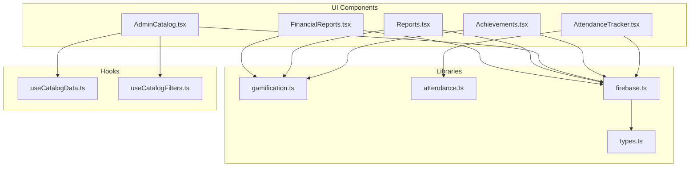
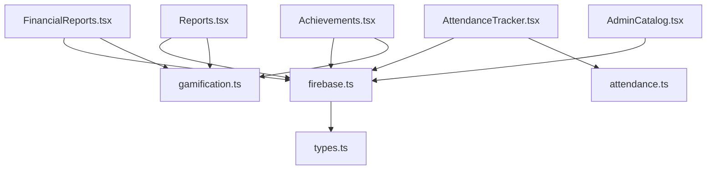
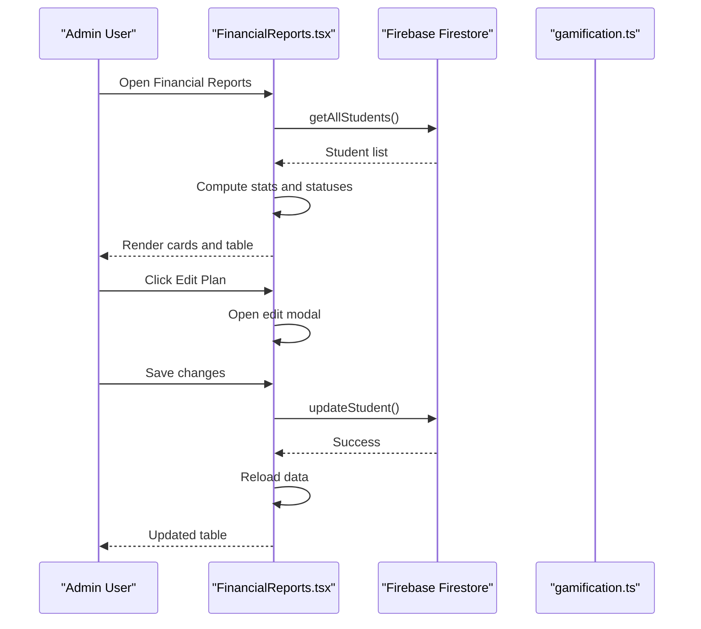
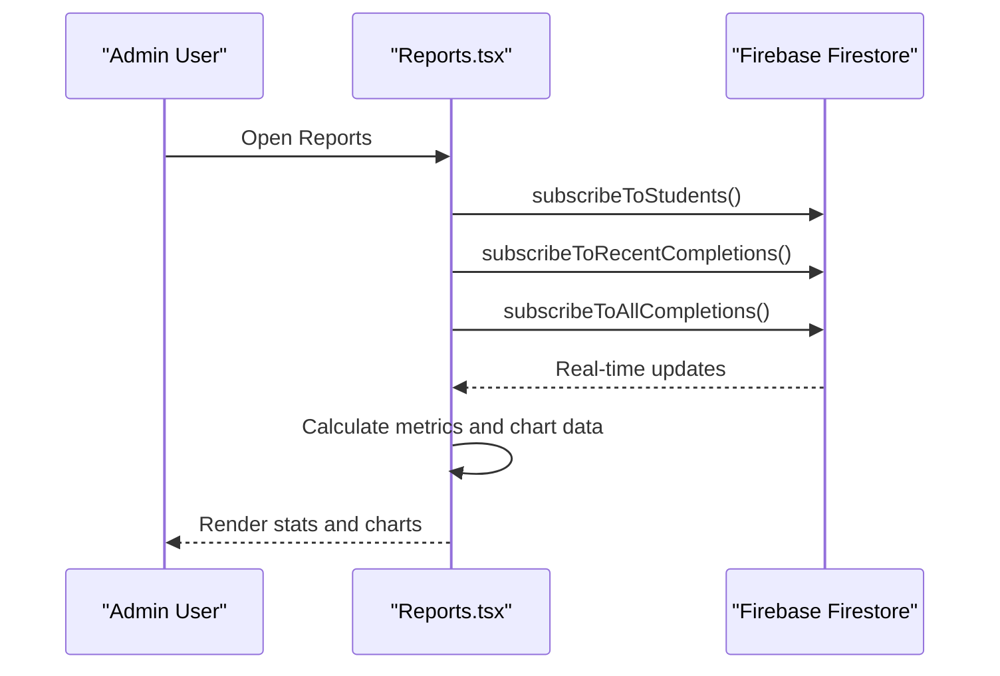
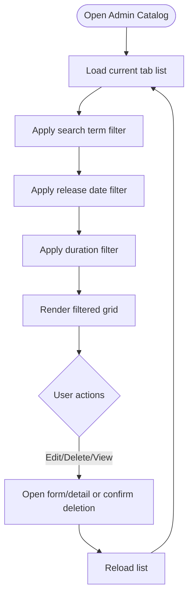
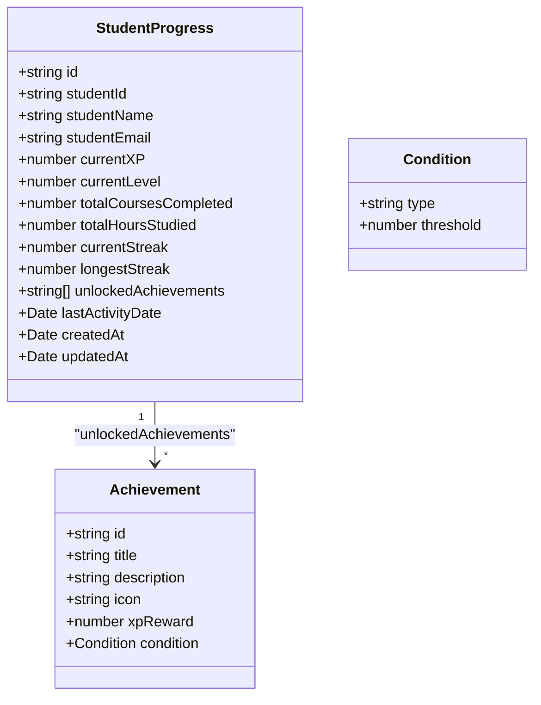
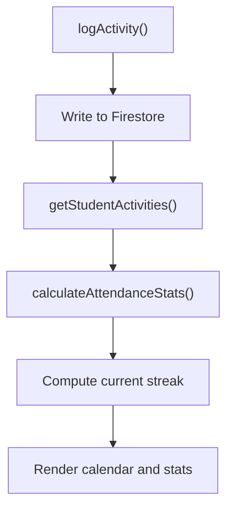
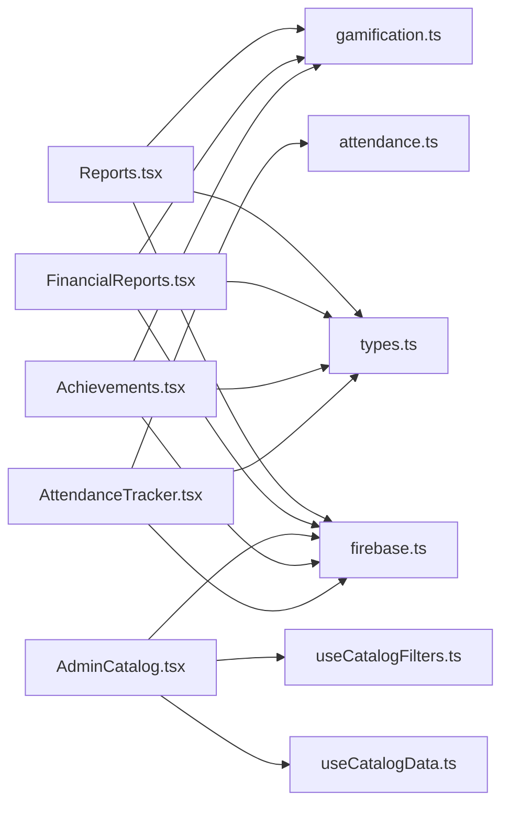

# Reporting Systems

<cite>
**Referenced Files in This Document**
- [FinancialReports.tsx](file://components/FinancialReports.tsx)
- [Reports.tsx](file://components/Reports.tsx)
- [AdminCatalog.tsx](file://components/AdminCatalog.tsx)
- [Achievements.tsx](file://components/Achievements.tsx)
- [AttendanceTracker.tsx](file://components/AttendanceTracker.tsx)
- [gamification.ts](file://lib/gamification.ts)
- [attendance.ts](file://lib/attendance.ts)
- [firebase.ts](file://lib/firebase.ts)
- [types.ts](file://types.ts)
- [useCatalogData.ts](file://hooks/useCatalogData.ts)
- [useCatalogFilters.ts](file://hooks/useCatalogFilters.ts)
</cite>

## Table of Contents
1. [Introduction](#introduction)
2. [Project Structure](#project-structure)
3. [Core Components](#core-components)
4. [Architecture Overview](#architecture-overview)
5. [Detailed Component Analysis](#detailed-component-analysis)
6. [Dependency Analysis](#dependency-analysis)
7. [Performance Considerations](#performance-considerations)
8. [Troubleshooting Guide](#troubleshooting-guide)
9. [Conclusion](#conclusion)

## Introduction
This document describes the administrative reporting systems for student performance analytics, financial reporting, and system usage metrics. It covers the report generation interface, data visualization components, export functionality, integration with gamification data for achievement tracking, attendance analytics, and financial data processing. Practical workflows for creating reports, filtering data, and monitoring platform performance are included.

## Project Structure
The reporting system spans React components, Firebase integration, and domain-specific libraries for gamification and attendance. Key areas:
- Administrative dashboards for financial and general reports
- Real-time charts and statistics for engagement
- Filtering and catalog management for content administration
- Gamification and attendance analytics for performance insights
- Firebase-backed persistence and security rules

**Diagram sources**
- [FinancialReports.tsx](file://components/FinancialReports.tsx#L1-L535)
- [Reports.tsx](file://components/Reports.tsx#L1-L282)
- [AdminCatalog.tsx](file://components/AdminCatalog.tsx#L1-L430)
- [Achievements.tsx](file://components/Achievements.tsx#L1-L346)
- [AttendanceTracker.tsx](file://components/AttendanceTracker.tsx#L1-L249)
- [gamification.ts](file://lib/gamification.ts#L1-L349)
- [attendance.ts](file://lib/attendance.ts#L1-L177)
- [firebase.ts](file://lib/firebase.ts#L1-L24)
- [types.ts](file://types.ts#L1-L125)
- [useCatalogData.ts](file://hooks/useCatalogData.ts#L1-L157)
- [useCatalogFilters.ts](file://hooks/useCatalogFilters.ts#L1-L86)

**Section sources**
- [FinancialReports.tsx](file://components/FinancialReports.tsx#L1-L535)
- [Reports.tsx](file://components/Reports.tsx#L1-L282)
- [AdminCatalog.tsx](file://components/AdminCatalog.tsx#L1-L430)
- [Achievements.tsx](file://components/Achievements.tsx#L1-L346)
- [AttendanceTracker.tsx](file://components/AttendanceTracker.tsx#L1-L249)
- [gamification.ts](file://lib/gamification.ts#L1-L349)
- [attendance.ts](file://lib/attendance.ts#L1-L177)
- [firebase.ts](file://lib/firebase.ts#L1-L24)
- [types.ts](file://types.ts#L1-L125)
- [useCatalogData.ts](file://hooks/useCatalogData.ts#L1-L157)
- [useCatalogFilters.ts](file://hooks/useCatalogFilters.ts#L1-L86)

## Core Components
- Financial Reports: Subscription and revenue analytics with filters, status computation, and plan management modal.
- General Reports: Real-time engagement metrics, monthly completion trends, and recent activity feed.
- Admin Catalog: Content administration with search, date/duration filters, and CRUD operations.
- Gamification: XP, level progression, achievement unlocking, and leaderboard computation.
- Attendance Analytics: Activity logging, streak calculation, and calendar visualization.

**Section sources**
- [FinancialReports.tsx](file://components/FinancialReports.tsx#L17-L123)
- [Reports.tsx](file://components/Reports.tsx#L21-L80)
- [AdminCatalog.tsx](file://components/AdminCatalog.tsx#L37-L254)
- [gamification.ts](file://lib/gamification.ts#L43-L195)
- [attendance.ts](file://lib/attendance.ts#L7-L161)

## Architecture Overview
The reporting system integrates UI components with Firebase Firestore for real-time data and with domain libraries for gamification and attendance analytics. Security rules restrict access to administrative features.

**Diagram sources**
- [FinancialReports.tsx](file://components/FinancialReports.tsx#L1-L17)
- [Reports.tsx](file://components/Reports.tsx#L1-L19)
- [AdminCatalog.tsx](file://components/AdminCatalog.tsx#L1-L28)
- [Achievements.tsx](file://components/Achievements.tsx#L1-L4)
- [AttendanceTracker.tsx](file://components/AttendanceTracker.tsx#L1-L5)
- [gamification.ts](file://lib/gamification.ts#L1-L6)
- [attendance.ts](file://lib/attendance.ts#L1-L3)
- [firebase.ts](file://lib/firebase.ts#L1-L24)
- [types.ts](file://types.ts#L1-L125)

## Detailed Component Analysis

### Financial Reporting
- Data ingestion: Loads all students and computes revenue, active plans, expiring soon, and expired counts.
- Status normalization: Derives computed status from payment and plan fields, with special handling for admin accounts and end dates.
- Filters: Supports all, active, expiring, and expired views.
- Edit modal: Allows changing plan type, status, and end date; updates Firestore and refreshes data.
- Export: Provides CSV export button for financial data.

**Diagram sources**
- [FinancialReports.tsx](file://components/FinancialReports.tsx#L47-L170)
- [gamification.ts](file://lib/gamification.ts#L100-L129)

**Section sources**
- [FinancialReports.tsx](file://components/FinancialReports.tsx#L17-L123)
- [FinancialReports.tsx](file://components/FinancialReports.tsx#L125-L179)
- [FinancialReports.tsx](file://components/FinancialReports.tsx#L181-L531)

### General Reporting and Engagement Analytics
- Real-time subscriptions: Tracks total students, recent completions, and aggregates monthly completion trends.
- Metrics: Computes average completions per month, average per student, and engagement rate.
- Visualizations: Area chart for monthly activity and a recent activity timeline.
- Export: Provides export button for general report data.

**Diagram sources**
- [Reports.tsx](file://components/Reports.tsx#L30-L80)

**Section sources**
- [Reports.tsx](file://components/Reports.tsx#L21-L80)
- [Reports.tsx](file://components/Reports.tsx#L100-L130)
- [Reports.tsx](file://components/Reports.tsx#L163-L278)

### Admin Catalog and Content Filtering
- Tabs: Courses/Videos, Galleries, Mindful Flow, Music.
- Filters: Search term, release date presets (recent, upcoming, past), and duration buckets (short, medium, long).
- Grid: Displays content with thumbnails, badges, and action menu.
- Hooks: Centralized data and filter logic via useCatalogData and useCatalogFilters.

**Diagram sources**
- [AdminCatalog.tsx](file://components/AdminCatalog.tsx#L37-L254)
- [useCatalogData.ts](file://hooks/useCatalogData.ts#L30-L156)
- [useCatalogFilters.ts](file://hooks/useCatalogFilters.ts#L28-L63)

**Section sources**
- [AdminCatalog.tsx](file://components/AdminCatalog.tsx#L37-L254)
- [useCatalogData.ts](file://hooks/useCatalogData.ts#L20-L156)
- [useCatalogFilters.ts](file://hooks/useCatalogFilters.ts#L8-L85)

### Gamification Integration
- XP and leveling: Calculates level from XP and progress within level.
- Progress tracking: Retrieves and updates student progress, including streaks and achievements.
- Achievement system: Fetches achievements, checks conditions, and unlocks when met.
- Leaderboard: Orders students by XP descending.

**Diagram sources**
- [gamification.ts](file://lib/gamification.ts#L109-L125)
- [gamification.ts](file://lib/gamification.ts#L96-L106)
- [types.ts](file://types.ts#L109-L125)

**Section sources**
- [gamification.ts](file://lib/gamification.ts#L19-L40)
- [gamification.ts](file://lib/gamification.ts#L43-L98)
- [gamification.ts](file://lib/gamification.ts#L100-L161)
- [gamification.ts](file://lib/gamification.ts#L163-L195)
- [gamification.ts](file://lib/gamification.ts#L278-L302)
- [Achievements.tsx](file://components/Achievements.tsx#L10-L32)

### Attendance Analytics
- Activity logging: Records student activities with timestamps and metadata.
- Streak calculation: Computes current streak by scanning recent activities.
- Calendar visualization: Renders a 30-day grid indicating activity per day.
- Recent activity feed: Lists recent events with human-readable labels.

**Diagram sources**
- [attendance.ts](file://lib/attendance.ts#L7-L30)
- [attendance.ts](file://lib/attendance.ts#L32-L62)
- [attendance.ts](file://lib/attendance.ts#L122-L161)
- [AttendanceTracker.tsx](file://components/AttendanceTracker.tsx#L24-L37)

**Section sources**
- [attendance.ts](file://lib/attendance.ts#L7-L62)
- [attendance.ts](file://lib/attendance.ts#L122-L177)
- [AttendanceTracker.tsx](file://components/AttendanceTracker.tsx#L12-L96)

## Dependency Analysis
- UI components depend on Firebase for real-time subscriptions and writes.
- Gamification and attendance libraries encapsulate domain logic and are consumed by UI components.
- Hooks abstract data and filter logic for the catalog.
- Types define shared interfaces across components and libraries.

**Diagram sources**
- [Reports.tsx](file://components/Reports.tsx#L1-L19)
- [FinancialReports.tsx](file://components/FinancialReports.tsx#L1-L17)
- [AdminCatalog.tsx](file://components/AdminCatalog.tsx#L1-L28)
- [Achievements.tsx](file://components/Achievements.tsx#L1-L4)
- [AttendanceTracker.tsx](file://components/AttendanceTracker.tsx#L1-L5)
- [useCatalogData.ts](file://hooks/useCatalogData.ts#L1-L16)
- [useCatalogFilters.ts](file://hooks/useCatalogFilters.ts#L1-L6)
- [types.ts](file://types.ts#L1-L125)
- [firebase.ts](file://lib/firebase.ts#L1-L24)
- [gamification.ts](file://lib/gamification.ts#L1-L6)
- [attendance.ts](file://lib/attendance.ts#L1-L3)

**Section sources**
- [firebase.ts](file://lib/firebase.ts#L1-L24)
- [types.ts](file://types.ts#L1-L125)
- [useCatalogData.ts](file://hooks/useCatalogData.ts#L1-L16)
- [useCatalogFilters.ts](file://hooks/useCatalogFilters.ts#L1-L6)

## Performance Considerations
- Real-time subscriptions: Use targeted queries and limit result sets to reduce bandwidth and improve responsiveness.
- Memoization: The catalog filters use memoization to avoid unnecessary recomputation when lists are unchanged.
- Batch updates: Group Firestore writes for plan updates to minimize network overhead.
- Lazy rendering: Large grids and tables should leverage virtualization for improved scrolling performance.

[No sources needed since this section provides general guidance]

## Troubleshooting Guide
- Authentication and permissions: Ensure the user has admin role or email to access administrative screens and modify plans.
- Data availability: Confirm Firestore collections exist and security rules permit reads/writes for the relevant documents.
- Network connectivity: Real-time features rely on Firestore connectivity; monitor connection status and retry logic.
- Export/import: Verify CSV formatting and handle errors returned during import operations.

**Section sources**
- [firebase.ts](file://lib/firebase.ts#L1-L24)
- [firestore.rules](file://firestore.rules#L1-L48)

## Conclusion
The administrative reporting system combines real-time engagement metrics, financial analytics, content administration, and gamification/attendance insights. Its modular architecture leverages Firebase for data and domain libraries for specialized logic, enabling efficient monitoring and operational workflows.