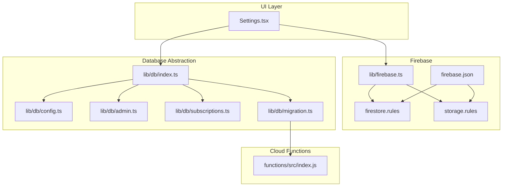
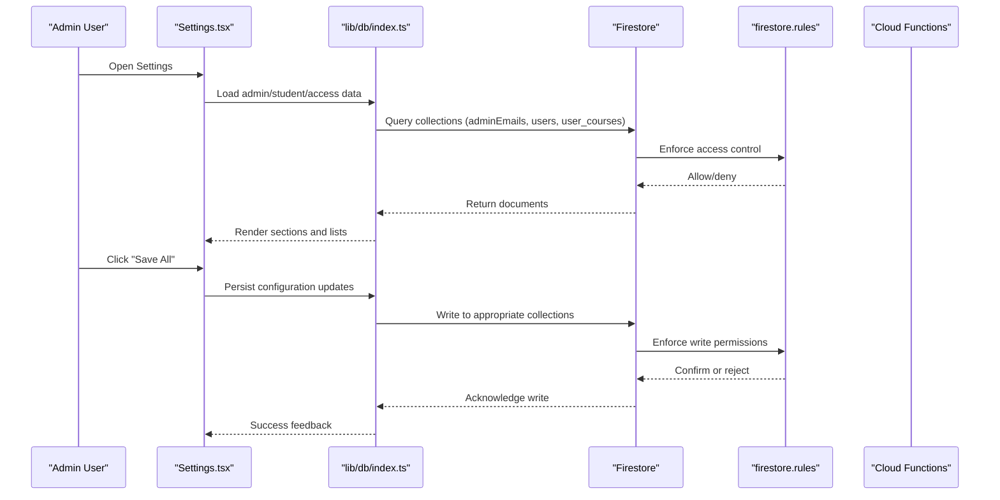
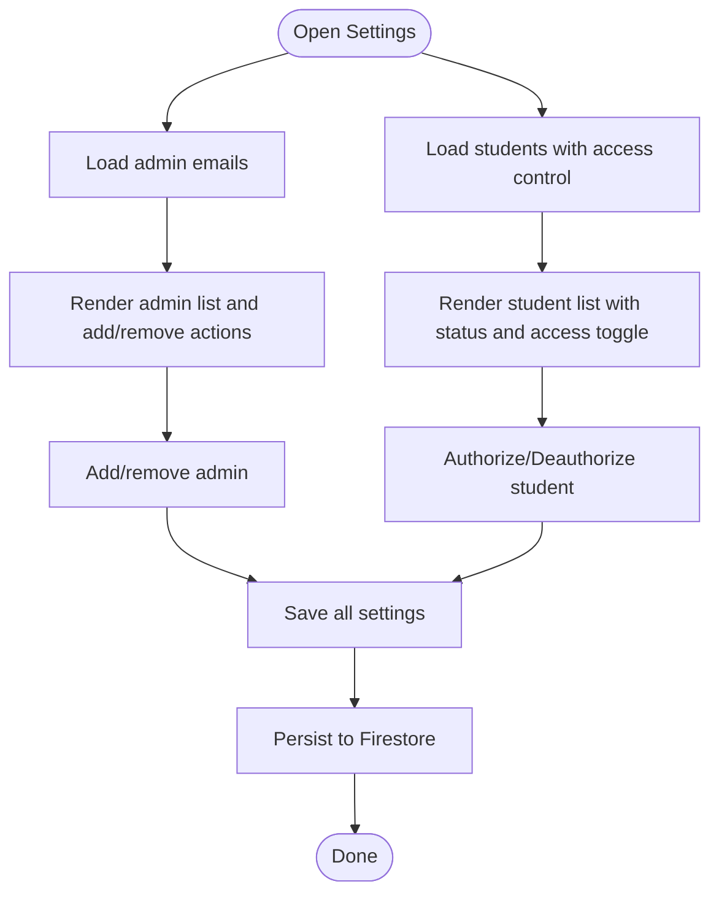
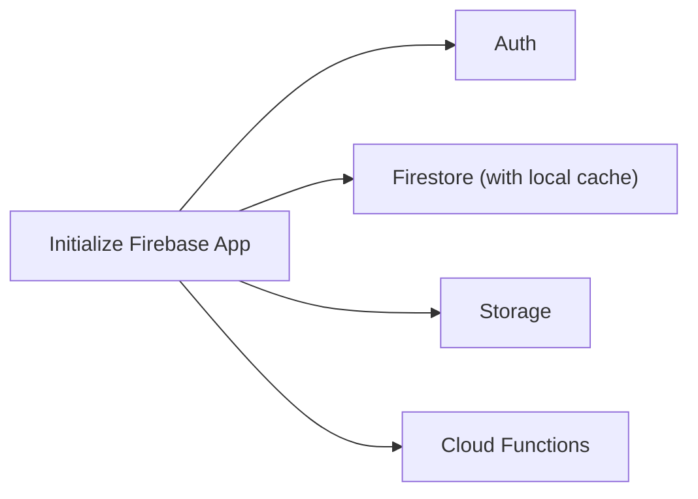
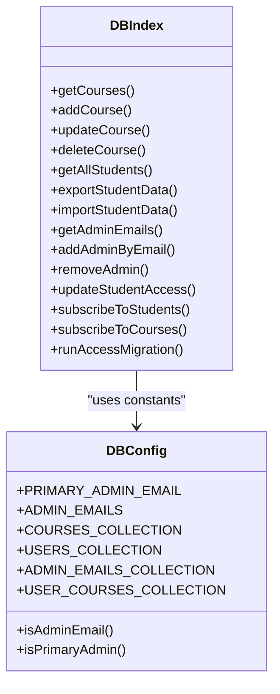
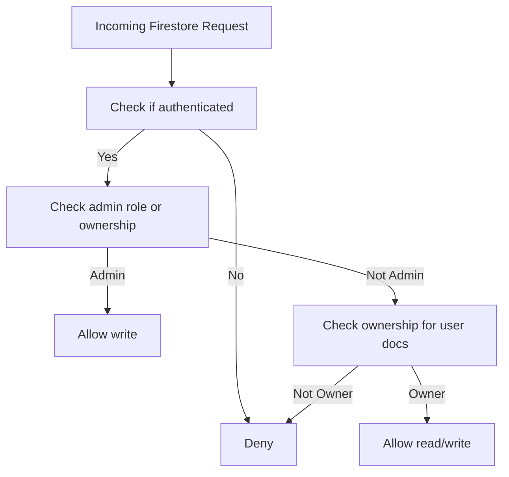
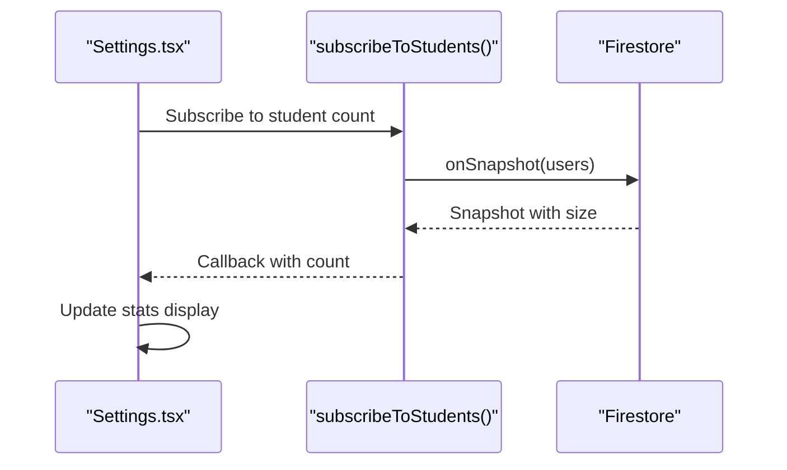
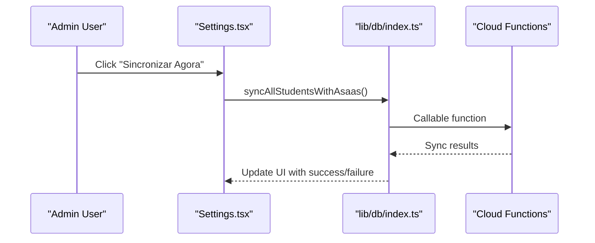
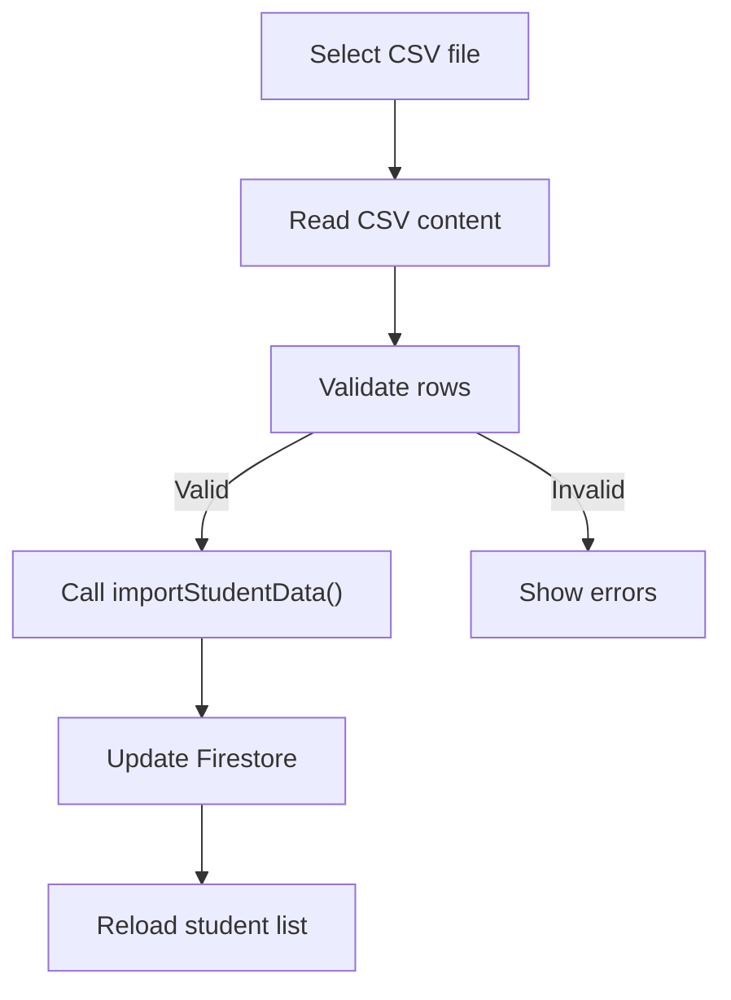
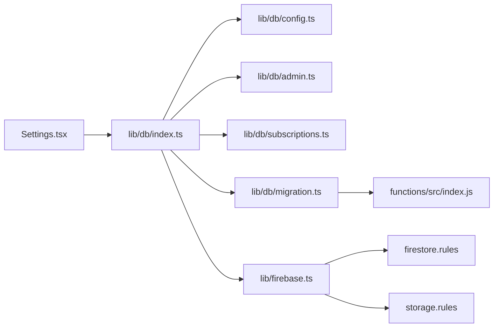

# Settings & Configuration

<cite>
**Referenced Files in This Document**
- [Settings.tsx](file://components/Settings.tsx)
- [firebase.ts](file://lib/firebase.ts)
- [db/index.ts](file://lib/db/index.ts)
- [db/config.ts](file://lib/db/config.ts)
- [db/admin.ts](file://lib/db/admin.ts)
- [db/migration.ts](file://lib/db/migration.ts)
- [db/subscriptions.ts](file://lib/db/subscriptions.ts)
- [firestore.rules](file://firestore.rules)
- [storage.rules](file://storage.rules)
- [firebase.json](file://firebase.json)
- [functions/src/index.js](file://functions/src/index.js)
- [package.json](file://package.json)
</cite>

## Table of Contents
1. [Introduction](#introduction)
2. [Project Structure](#project-structure)
3. [Core Components](#core-components)
4. [Architecture Overview](#architecture-overview)
5. [Detailed Component Analysis](#detailed-component-analysis)
6. [Dependency Analysis](#dependency-analysis)
7. [Performance Considerations](#performance-considerations)
8. [Troubleshooting Guide](#troubleshooting-guide)
9. [Conclusion](#conclusion)
10. [Appendices](#appendices)

## Introduction
This document explains the settings and configuration management system used to operate the platform. It covers:
- System-wide configuration options exposed in the Settings interface
- User preferences and administrative controls
- Configuration data model and persistence via Firestore
- Real-time configuration updates and subscriptions
- Integration with Firebase for storage and security rules
- Configuration validation and access control for settings modifications
- Practical workflows for configuration changes, backups, and migrations

## Project Structure
The settings system spans UI components, Firebase initialization, database abstractions, Firestore security rules, and Cloud Functions:
- UI: Settings page aggregates configuration sections and actions
- Firebase: Initialization and client-side SDK exports
- Database layer: Re-exported APIs for admin, students, subscriptions, and migration
- Security: Firestore and Storage rules enforce access control
- Functions: Cloud Functions implement server-side logic for sensitive operations

**Diagram sources**
- [Settings.tsx](file://components/Settings.tsx#L1-L914)
- [firebase.ts](file://lib/firebase.ts#L1-L25)
- [db/index.ts](file://lib/db/index.ts#L1-L38)
- [db/config.ts](file://lib/db/config.ts#L1-L19)
- [db/admin.ts](file://lib/db/admin.ts#L281-L286)
- [db/subscriptions.ts](file://lib/db/subscriptions.ts#L1-L93)
- [db/migration.ts](file://lib/db/migration.ts#L1-L64)
- [firestore.rules](file://firestore.rules#L1-L97)
- [storage.rules](file://storage.rules#L1-L10)
- [firebase.json](file://firebase.json#L1-L20)
- [functions/src/index.js](file://functions/src/index.js#L1-L387)

**Section sources**
- [Settings.tsx](file://components/Settings.tsx#L1-L914)
- [firebase.ts](file://lib/firebase.ts#L1-L25)
- [db/index.ts](file://lib/db/index.ts#L1-L38)
- [db/config.ts](file://lib/db/config.ts#L1-L19)
- [db/admin.ts](file://lib/db/admin.ts#L281-L286)
- [db/subscriptions.ts](file://lib/db/subscriptions.ts#L1-L93)
- [db/migration.ts](file://lib/db/migration.ts#L1-L64)
- [firestore.rules](file://firestore.rules#L1-L97)
- [storage.rules](file://storage.rules#L1-L10)
- [firebase.json](file://firebase.json#L1-L20)
- [functions/src/index.js](file://functions/src/index.js#L1-L387)

## Core Components
- Settings UI: Hosts configuration sections for administrators, including admin management, student account policies, access control with Asaas, course defaults, gamification, and achievements.
- Firebase initialization: Provides initialized auth, Firestore, Storage, and Functions clients.
- Database abstraction: Centralized exports for admin operations, student data, subscriptions, and migration helpers.
- Security rules: Firestore and Storage rules define who can read/write and under what conditions.
- Cloud Functions: Implement server-side tasks such as access migration and Asaas webhooks.

Key responsibilities:
- Settings.tsx orchestrates state for all configuration sections and delegates to database APIs for persistence and operations.
- lib/firebase.ts initializes Firebase clients and enables local persistence for Firestore.
- lib/db/* exposes typed APIs for CRUD and specialized operations (admin, students, subscriptions, migration).
- firestore.rules and storage.rules govern access control and data integrity.
- functions/src/index.js implements server-side logic for migration and payment webhook handling.

**Section sources**
- [Settings.tsx](file://components/Settings.tsx#L45-L118)
- [firebase.ts](file://lib/firebase.ts#L1-L25)
- [db/index.ts](file://lib/db/index.ts#L1-L38)
- [firestore.rules](file://firestore.rules#L1-L97)
- [storage.rules](file://storage.rules#L1-L10)
- [functions/src/index.js](file://functions/src/index.js#L1-L387)

## Architecture Overview
The settings system follows a layered architecture:
- UI layer (React) renders configuration forms and triggers actions
- Database abstraction layer (lib/db) encapsulates Firestore operations
- Security enforced by Firestore and Storage rules
- Server-side logic via Cloud Functions for privileged operations

**Diagram sources**
- [Settings.tsx](file://components/Settings.tsx#L340-L349)
- [db/index.ts](file://lib/db/index.ts#L1-L38)
- [firestore.rules](file://firestore.rules#L31-L89)
- [functions/src/index.js](file://functions/src/index.js#L1-L387)

## Detailed Component Analysis

### Settings UI Component
The Settings component organizes configuration into logical tabs and sections:
- Users & Permissions: Admin management, student account policies, bulk import/export, Asaas access control, and manual authorizations
- Courses & Content: Default course settings, content expiration, and gamification parameters
- Gamification: XP values, level cap, achievements, and streak rules

It manages:
- Active tab selection and expandable sections
- Loading states for admin and student data
- Bulk CSV export/import for student data
- Asaas synchronization and legacy data migration
- Manual access toggles per student

**Diagram sources**
- [Settings.tsx](file://components/Settings.tsx#L115-L142)
- [Settings.tsx](file://components/Settings.tsx#L144-L186)
- [Settings.tsx](file://components/Settings.tsx#L313-L334)
- [Settings.tsx](file://components/Settings.tsx#L340-L349)

**Section sources**
- [Settings.tsx](file://components/Settings.tsx#L45-L118)
- [Settings.tsx](file://components/Settings.tsx#L115-L186)
- [Settings.tsx](file://components/Settings.tsx#L188-L257)
- [Settings.tsx](file://components/Settings.tsx#L259-L311)
- [Settings.tsx](file://components/Settings.tsx#L313-L349)

### Firebase Initialization and Persistence
Firebase is initialized with:
- Auth, Firestore, Storage, and Functions clients
- Persistent local cache for Firestore with multi-tab support

This ensures offline resilience and fast reads/writes for configuration data.

**Diagram sources**
- [firebase.ts](file://lib/firebase.ts#L1-L25)

**Section sources**
- [firebase.ts](file://lib/firebase.ts#L1-L25)

### Database Abstraction and Collections
The database layer re-exports APIs for:
- Admin management: add/remove admins, check roles
- Students: export/import, access control, queries
- Subscriptions: real-time listeners for counts and recent completions
- Migration: run access migration via callable functions

Collection names and constants are centralized for consistency.

**Diagram sources**
- [db/index.ts](file://lib/db/index.ts#L1-L38)
- [db/config.ts](file://lib/db/config.ts#L1-L19)

**Section sources**
- [db/index.ts](file://lib/db/index.ts#L1-L38)
- [db/config.ts](file://lib/db/config.ts#L1-L19)

### Access Control and Validation
Security is enforced by Firestore and Storage rules:
- Authentication checks and admin role verification
- Ownership checks for personal data
- Granular permissions for admin-only writes
- Storage limits and authenticated read/write

**Diagram sources**
- [firestore.rules](file://firestore.rules#L5-L21)
- [firestore.rules](file://firestore.rules#L31-L89)
- [storage.rules](file://storage.rules#L1-L10)

**Section sources**
- [firestore.rules](file://firestore.rules#L1-L97)
- [storage.rules](file://storage.rules#L1-L10)

### Real-Time Configuration Updates
Real-time listeners enable live updates for:
- Student counts
- Course counts and listings
- Recent completions

These subscriptions keep the UI synchronized without polling.

**Diagram sources**
- [db/subscriptions.ts](file://lib/db/subscriptions.ts#L6-L13)

**Section sources**
- [db/subscriptions.ts](file://lib/db/subscriptions.ts#L1-L93)

### Administrative Settings Interfaces
Administrators can:
- Manage admin accounts (add/remove)
- Configure student account policies (auto-delete)
- Bulk import/export student data
- Authorize or block student access
- Trigger Asaas synchronization
- Run legacy data migration

**Diagram sources**
- [Settings.tsx](file://components/Settings.tsx#L259-L289)
- [db/index.ts](file://lib/db/index.ts#L31-L31)

**Section sources**
- [Settings.tsx](file://components/Settings.tsx#L444-L758)
- [db/index.ts](file://lib/db/index.ts#L21-L31)

### Configuration Workflows
Common workflows:
- Bulk student import/export: Use CSV files to import/export student records
- Access control: Toggle individual student access and synchronize with Asaas
- Migration: Run legacy data migration to align with new product/course model
- Save settings: Persist configuration changes to Firestore

**Diagram sources**
- [Settings.tsx](file://components/Settings.tsx#L215-L257)
- [db/index.ts](file://lib/db/index.ts#L21-L22)

**Section sources**
- [Settings.tsx](file://components/Settings.tsx#L188-L257)
- [db/index.ts](file://lib/db/index.ts#L21-L22)

### Backup Procedures
Backup strategies:
- Export student data as CSV for off-platform storage
- Use Firestore snapshots for point-in-time backups (via CLI or admin tools)
- Maintain versioned configurations in source control where applicable

Practical steps:
- Navigate to the Students section in Settings
- Click Export to download a CSV archive
- Store the file securely and separately from the platform

**Section sources**
- [Settings.tsx](file://components/Settings.tsx#L188-L213)
- [db/index.ts](file://lib/db/index.ts#L21-L22)

### Administrative System Customization
Customization options include:
- Admin email lists and primary admin designation
- Course defaults (visibility, auto-publish, certificates, completion criteria, media size/format)
- Gamification parameters (XP values, level cap, achievements, streak rules)
- Access control policies (manual vs. automated via Asaas)

These are persisted to Firestore collections and enforced by security rules.

**Section sources**
- [db/config.ts](file://lib/db/config.ts#L1-L19)
- [Settings.tsx](file://components/Settings.tsx#L82-L112)
- [firestore.rules](file://firestore.rules#L31-L89)

## Dependency Analysis
The settings system exhibits clear separation of concerns:
- UI depends on database abstraction
- Database abstraction depends on Firebase initialization
- Security rules depend on Firestore collections and constants
- Cloud Functions depend on Firestore and admin SDK

**Diagram sources**
- [Settings.tsx](file://components/Settings.tsx#L1-L914)
- [db/index.ts](file://lib/db/index.ts#L1-L38)
- [db/config.ts](file://lib/db/config.ts#L1-L19)
- [db/admin.ts](file://lib/db/admin.ts#L281-L286)
- [db/subscriptions.ts](file://lib/db/subscriptions.ts#L1-L93)
- [db/migration.ts](file://lib/db/migration.ts#L1-L64)
- [firebase.ts](file://lib/firebase.ts#L1-L25)
- [firestore.rules](file://firestore.rules#L1-L97)
- [storage.rules](file://storage.rules#L1-L10)
- [functions/src/index.js](file://functions/src/index.js#L1-L387)

**Section sources**
- [Settings.tsx](file://components/Settings.tsx#L1-L914)
- [db/index.ts](file://lib/db/index.ts#L1-L38)
- [db/config.ts](file://lib/db/config.ts#L1-L19)
- [db/admin.ts](file://lib/db/admin.ts#L281-L286)
- [db/subscriptions.ts](file://lib/db/subscriptions.ts#L1-L93)
- [db/migration.ts](file://lib/db/migration.ts#L1-L64)
- [firebase.ts](file://lib/firebase.ts#L1-L25)
- [firestore.rules](file://firestore.rules#L1-L97)
- [storage.rules](file://storage.rules#L1-L10)
- [functions/src/index.js](file://functions/src/index.js#L1-L387)

## Performance Considerations
- Use Firestore local persistence to reduce network latency and improve responsiveness
- Batch operations for bulk imports/exports to minimize round trips
- Debounce search/filter operations in lists to avoid excessive queries
- Leverage real-time subscriptions for frequently changing data (students, courses)
- Limit query result sizes and apply pagination for large datasets

## Troubleshooting Guide
Common issues and resolutions:
- Permission denied when saving settings: Ensure the user has admin role; Firestore rules restrict writes to admins
- Unauthenticated migration: Authenticate and ensure the user has admin privileges; fallback HTTP endpoint requires a valid ID token
- Webhook token mismatch: Verify Asaas webhook token configuration; requests without a matching token are rejected
- Storage size exceeded: Ensure uploads are under the 100 MB limit enforced by Storage rules

Operational checks:
- Confirm Firebase initialization and environment variables are present
- Validate Firestore and Storage rules deployment via firebase.json
- Review Cloud Function logs for migration and webhook errors

**Section sources**
- [firestore.rules](file://firestore.rules#L1-L97)
- [storage.rules](file://storage.rules#L1-L10)
- [db/migration.ts](file://lib/db/migration.ts#L17-L51)
- [functions/src/index.js](file://functions/src/index.js#L162-L179)
- [firebase.json](file://firebase.json#L1-L20)

## Conclusion
The settings and configuration system integrates a robust UI, Firebase-backed persistence, strict access control, and server-side functions to provide a secure and extensible platform for administrative configuration. Administrators can manage users, configure course defaults, customize gamification, and maintain access control with real-time updates and reliable backups.

## Appendices

### Configuration Data Model Summary
- Admin management: adminEmails collection and user role fields
- Student data: users collection with access flags and payment status
- Access mapping: user_courses collection linking users to products/courses
- Content: courses, mindful_flow, music collections
- Activities and progress: student_activities, student_progress, student_completions, achievements

**Section sources**
- [db/config.ts](file://lib/db/config.ts#L11-L19)
- [firestore.rules](file://firestore.rules#L23-L89)

### Environment and Deployment Notes
- Firebase configuration is loaded from environment variables
- Firestore and Storage rules are deployed via firebase.json
- Cloud Functions implement privileged operations and webhooks

**Section sources**
- [firebase.ts](file://lib/firebase.ts#L7-L14)
- [firebase.json](file://firebase.json#L1-L20)
- [package.json](file://package.json#L13-L23)