# Student Management

<cite>
**Referenced Files in This Document**
- [Students.tsx](file://components/Students.tsx)
- [StudentDashboard.tsx](file://components/StudentDashboard.tsx)
- [Auth.tsx](file://components/Auth.tsx)
- [firebase.ts](file://lib/firebase.ts)
- [db/index.ts](file://lib/db/index.ts)
- [db/students.ts](file://lib/db/students.ts)
- [db/userCourses.ts](file://lib/db/userCourses.ts)
- [db/asaas.ts](file://lib/db/asaas.ts)
- [db/types.ts](file://lib/db/types.ts)
- [db/config.ts](file://lib/db/config.ts)
- [media.ts](file://lib/media.ts)
- [AttendanceTracker.tsx](file://components/AttendanceTracker.tsx)
- [FinancialReports.tsx](file://components/FinancialReports.tsx)
- [AdminCatalog.tsx](file://components/AdminCatalog.tsx)
- [types.ts](file://types.ts)
- [courses.ts](file://lib/db/courses.ts)
- [check-payment-status.js](file://netlify/functions/check-payment-status.js)
</cite>

## Update Summary
**Changes Made**
- Enhanced Students component with comprehensive course access control management
- Added user course management interface with granular access permissions
- Improved enrollment tracking with source attribution (Asaas vs manual)
- Integrated course access auditing and status management
- Added tabbed interface for media and course management in student modal

## Table of Contents
1. [Introduction](#introduction)
2. [Project Structure](#project-structure)
3. [Core Components](#core-components)
4. [Architecture Overview](#architecture-overview)
5. [Detailed Component Analysis](#detailed-component-analysis)
6. [Dependency Analysis](#dependency-analysis)
7. [Performance Considerations](#performance-considerations)
8. [Troubleshooting Guide](#troubleshooting-guide)
9. [Conclusion](#conclusion)
10. [Appendices](#appendices)

## Introduction
This document describes the student management system for Fluentoria, focusing on student enrollment tracking, progress monitoring, and user administration workflows. The system now features enhanced course access controls, user course management, and improved enrollment tracking capabilities. It explains how the system integrates Firebase Authentication for student accounts, synchronizes progress data, tracks student activity, and manages course access through granular permissions. Practical workflows are included for student onboarding, progress assessment, and administrative management with comprehensive course access control.

## Project Structure
The system is organized around React components, Firebase integration, and backend functions:
- UI components for student listing, dashboards, catalogs, and financial reporting
- Firebase services for authentication, Firestore, and Cloud Storage
- Backend functions for third-party payment status checks
- Libraries for gamification, attendance, media, and database operations
- Enhanced course access management system with user-course relationships

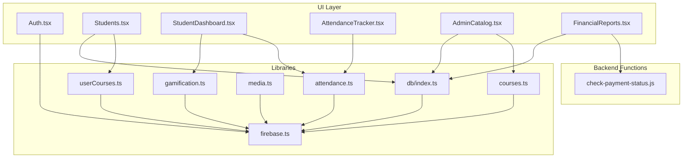

**Diagram sources**
- [Auth.tsx:1-265](file://components/Auth.tsx#L1-L265)
- [Students.tsx:1-539](file://components/Students.tsx#L1-L539)
- [StudentDashboard.tsx:1-135](file://components/StudentDashboard.tsx#L1-L135)
- [AttendanceTracker.tsx:1-249](file://components/AttendanceTracker.tsx#L1-L249)
- [AdminCatalog.tsx:1-430](file://components/AdminCatalog.tsx#L1-L430)
- [FinancialReports.tsx:1-535](file://components/FinancialReports.tsx#L1-L535)
- [firebase.ts:1-25](file://lib/firebase.ts#L1-L25)
- [db/index.ts:1-38](file://lib/db/index.ts#L1-L38)
- [userCourses.ts:1-112](file://lib/db/userCourses.ts#L1-L112)
- [courses.ts:1-120](file://lib/db/courses.ts#L1-L120)
- [check-payment-status.js:1-152](file://netlify/functions/check-payment-status.js#L1-L152)

**Section sources**
- [firebase.ts:1-25](file://lib/firebase.ts#L1-L25)
- [db/index.ts:1-38](file://lib/db/index.ts#L1-L38)

## Core Components
- Student listing and administration: [Students.tsx:1-539](file://components/Students.tsx#L1-L539)
- Student dashboard and progress: [StudentDashboard.tsx:1-135](file://components/StudentDashboard.tsx#L1-L135), [gamification.ts:1-349](file://lib/gamification.ts#L1-L349)
- Attendance and activity tracking: [AttendanceTracker.tsx:1-249](file://components/AttendanceTracker.tsx#L1-L249), [attendance.ts:1-177](file://lib/attendance.ts#L1-L177)
- Media submission and progress analytics: [media.ts:1-369](file://lib/media.ts#L1-L369)
- Authentication and user roles: [Auth.tsx:1-265](file://components/Auth.tsx#L1-L265), [firebase.ts:1-25](file://lib/firebase.ts#L1-L25)
- **Enhanced** Course access control: [userCourses.ts:1-112](file://lib/db/userCourses.ts#L1-L112), [courses.ts:54-97](file://lib/db/courses.ts#L54-L97)
- Payment and financial reporting: [db/asaas.ts:1-145](file://lib/db/asaas.ts#L1-L145), [FinancialReports.tsx:1-535](file://components/FinancialReports.tsx#L1-L535)
- Catalog and content management: [AdminCatalog.tsx:1-430](file://components/AdminCatalog.tsx#L1-L430)

**Section sources**
- [Students.tsx:1-539](file://components/Students.tsx#L1-L539)
- [StudentDashboard.tsx:1-135](file://components/StudentDashboard.tsx#L1-L135)
- [gamification.ts:1-349](file://lib/gamification.ts#L1-L349)
- [AttendanceTracker.tsx:1-249](file://components/AttendanceTracker.tsx#L1-L249)
- [attendance.ts:1-177](file://lib/attendance.ts#L1-L177)
- [media.ts:1-369](file://lib/media.ts#L1-L369)
- [Auth.tsx:1-265](file://components/Auth.tsx#L1-L265)
- [firebase.ts:1-25](file://lib/firebase.ts#L1-L25)
- [userCourses.ts:1-112](file://lib/db/userCourses.ts#L1-L112)
- [courses.ts:54-97](file://lib/db/courses.ts#L54-L97)
- [db/asaas.ts:1-145](file://lib/db/asaas.ts#L1-L145)
- [FinancialReports.tsx:1-535](file://components/FinancialReports.tsx#L1-L535)
- [AdminCatalog.tsx:1-430](file://components/AdminCatalog.tsx#L1-L430)

## Architecture Overview
The system uses Firebase for identity, data, and storage, with Netlify functions for external payment status verification. Students and instructors interact through React components; administrative tasks are handled via dedicated screens. The enhanced architecture now includes comprehensive course access management through user-course relationships.

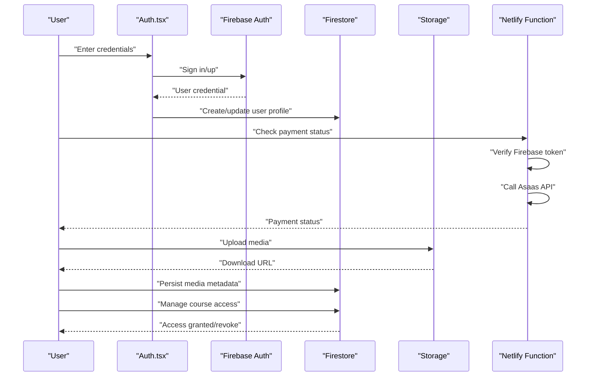

**Diagram sources**
- [Auth.tsx:21-60](file://components/Auth.tsx#L21-L60)
- [firebase.ts:1-25](file://lib/firebase.ts#L1-L25)
- [db/asaas.ts:6-37](file://lib/db/asaas.ts#L6-L37)
- [check-payment-status.js:20-151](file://netlify/functions/check-payment-status.js#L20-L151)
- [media.ts:8-117](file://lib/media.ts#L8-L117)
- [userCourses.ts:25-87](file://lib/db/userCourses.ts#L25-L87)

## Detailed Component Analysis

### Enhanced Student Enrollment Tracking
- Onboarding new students: Admins add students via the student listing modal, persisted to Firestore.
- **Enhanced** Course enrollment management: Grant or revoke course access per student with granular control and source attribution.
- Payment integration: Sync with Asaas to authorize access based on payment status with automatic enrollment tracking.
- **New** Access control auditing: Track access source (Asaas webhook vs manual admin action) and status changes.

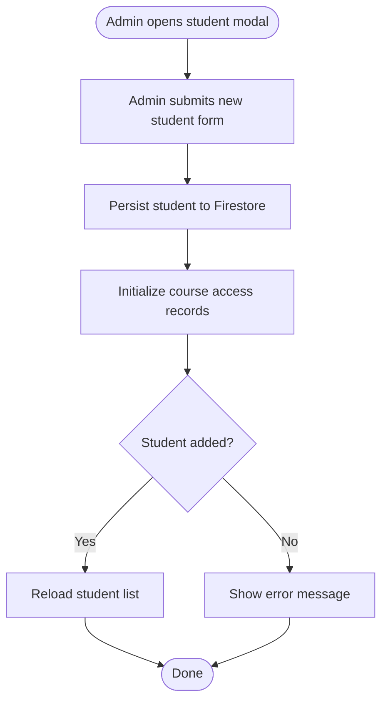

**Diagram sources**
- [Students.tsx:91-126](file://components/Students.tsx#L91-L126)
- [db/students.ts:65-84](file://lib/db/students.ts#L65-L84)
- [userCourses.ts:25-87](file://lib/db/userCourses.ts#L25-L87)

**Section sources**
- [Students.tsx:91-126](file://components/Students.tsx#L91-L126)
- [db/students.ts:65-84](file://lib/db/students.ts#L65-L84)
- [userCourses.ts:25-87](file://lib/db/userCourses.ts#L25-L87)

### Progress Monitoring Capabilities
- Student progress: Initialize and update XP, level, streaks, and achievements.
- Attendance tracking: Compute streaks and activity calendar from logged events.
- Analytics: Dashboard cards display XP, achievements, and ranking.

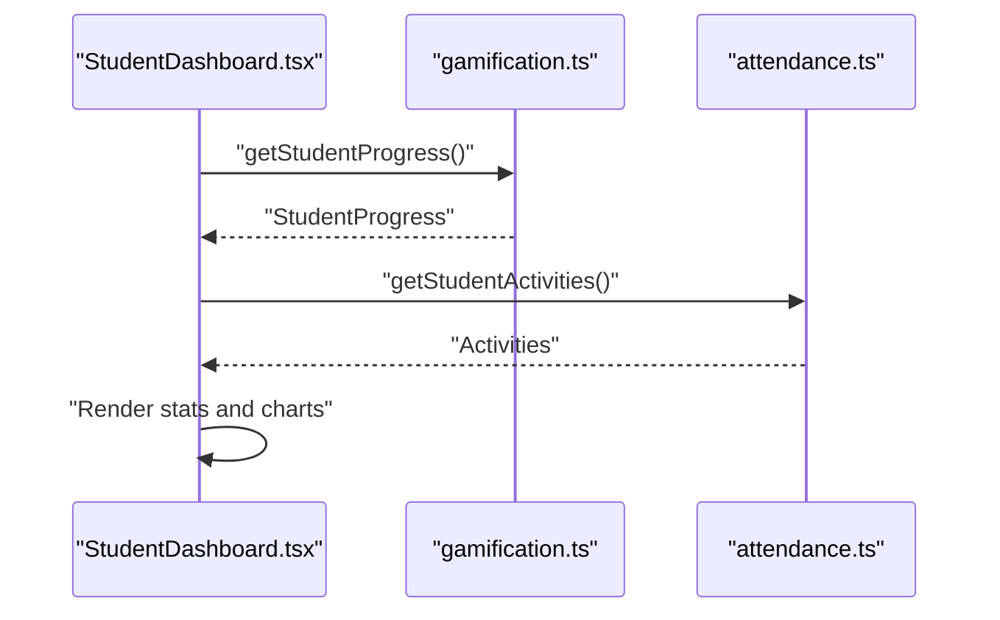

**Diagram sources**
- [StudentDashboard.tsx:27-43](file://components/StudentDashboard.tsx#L27-L43)
- [gamification.ts:43-64](file://lib/gamification.ts#L43-L64)
- [attendance.ts:32-62](file://lib/attendance.ts#L32-L62)

**Section sources**
- [StudentDashboard.tsx:16-135](file://components/StudentDashboard.tsx#L16-L135)
- [gamification.ts:43-349](file://lib/gamification.ts#L43-L349)
- [attendance.ts:32-177](file://lib/attendance.ts#L32-L177)
- [AttendanceTracker.tsx:1-249](file://components/AttendanceTracker.tsx#L1-L249)

### Enhanced User Administration Workflows
- Student listing and filtering: Search by name or email; view media submissions grouped by date and course.
- **Enhanced** Course access control: Toggle access per course with audit trail, source attribution, and status management.
- Financial reporting: View plan status, revenue estimates, and manage plan details.
- **New** Tabbed interface: Separate tabs for media management and course access control within student modal.

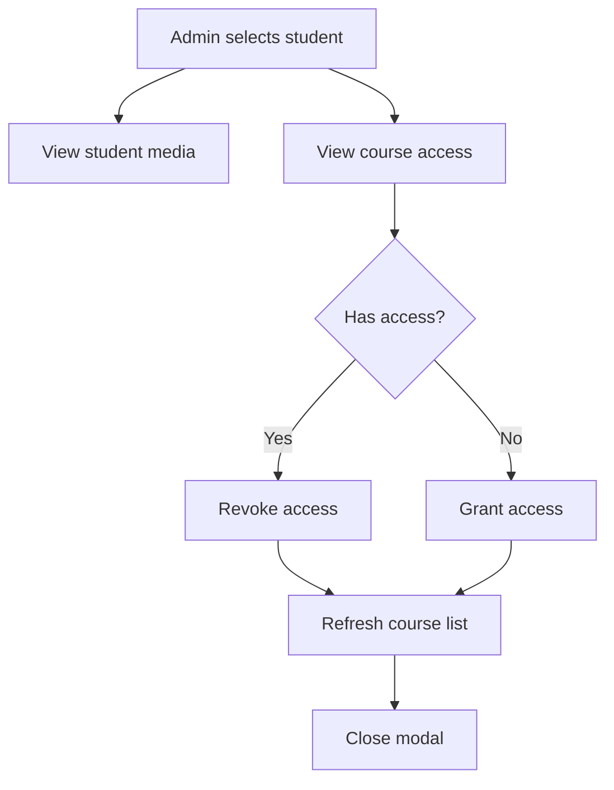

**Diagram sources**
- [Students.tsx:51-85](file://components/Students.tsx#L51-L85)
- [userCourses.ts:70-111](file://lib/db/userCourses.ts#L70-L111)

**Section sources**
- [Students.tsx:51-85](file://components/Students.tsx#L51-L85)
- [userCourses.ts:70-111](file://lib/db/userCourses.ts#L70-L111)
- [FinancialReports.tsx:17-123](file://components/FinancialReports.tsx#L17-L123)

### Integration with Firebase Authentication
- Authentication flow: Email/password and Google sign-in; creates or updates user profiles in Firestore.
- Role-based access: Admin-only operations enforced via server-side checks.

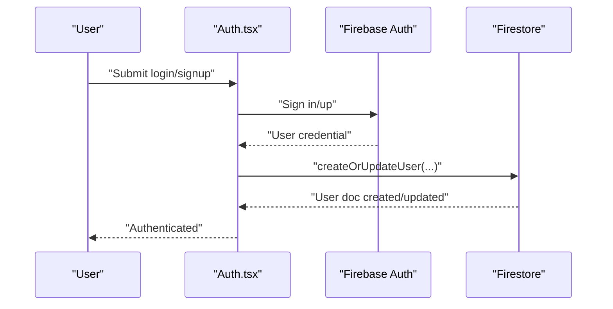

**Diagram sources**
- [Auth.tsx:21-60](file://components/Auth.tsx#L21-L60)
- [firebase.ts:1-25](file://lib/firebase.ts#L1-L25)
- [db/students.ts:110-144](file://lib/db/students.ts#L110-L144)

**Section sources**
- [Auth.tsx:12-92](file://components/Auth.tsx#L12-L92)
- [firebase.ts:1-25](file://lib/firebase.ts#L1-L25)
- [db/students.ts:110-144](file://lib/db/students.ts#L110-L144)

### Enhanced Progress Data Synchronization
- Activity logging: Track course completions, lessons, mindful flows, and more.
- Streak calculation: Compute current and longest streaks from recent activity.
- XP and achievements: Award XP and unlock achievements based on conditions.
- **Enhanced** Course access tracking: Monitor course enrollment status and access changes.

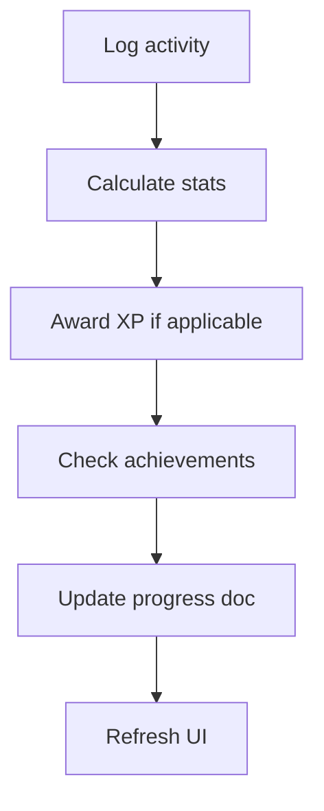

**Diagram sources**
- [attendance.ts:7-30](file://lib/attendance.ts#L7-L30)
- [attendance.ts:122-161](file://lib/attendance.ts#L122-L161)
- [gamification.ts:100-129](file://lib/gamification.ts#L100-L129)
- [gamification.ts:232-275](file://lib/gamification.ts#L232-L275)

**Section sources**
- [attendance.ts:7-177](file://lib/attendance.ts#L7-L177)
- [gamification.ts:100-275](file://lib/gamification.ts#L100-L275)

### Student Activity Tracking
- Calendar view: Visualize activity over the last 30 days.
- Recent activity feed: Show latest actions with course context.

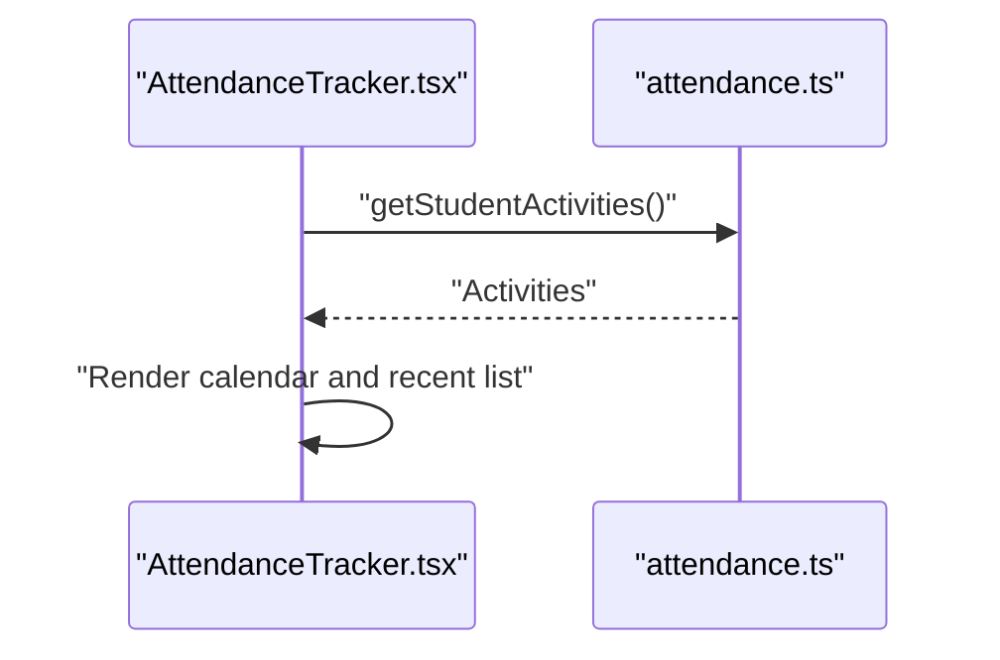

**Diagram sources**
- [AttendanceTracker.tsx:28-37](file://components/AttendanceTracker.tsx#L28-L37)
- [attendance.ts:32-62](file://lib/attendance.ts#L32-L62)

**Section sources**
- [AttendanceTracker.tsx:12-249](file://components/AttendanceTracker.tsx#L12-L249)
- [attendance.ts:32-177](file://lib/attendance.ts#L32-L177)

### Enhanced Administrative Student Management Procedures
- Bulk sync with Asaas: Update payment and plan statuses for all students.
- Manual overrides: Admins can edit plan types, statuses, and end dates.
- Access control: Enforce admin-only operations for sensitive actions.
- **Enhanced** Course access management: Comprehensive course assignment and revocation with audit trails.

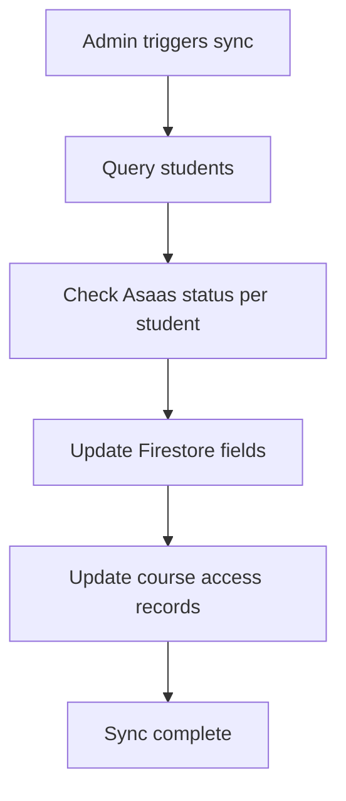

**Diagram sources**
- [db/asaas.ts:87-144](file://lib/db/asaas.ts#L87-L144)
- [FinancialReports.tsx:47-123](file://components/FinancialReports.tsx#L47-L123)
- [userCourses.ts:25-87](file://lib/db/userCourses.ts#L25-L87)

**Section sources**
- [db/asaas.ts:87-144](file://lib/db/asaas.ts#L87-L144)
- [FinancialReports.tsx:17-123](file://components/FinancialReports.tsx#L17-L123)
- [userCourses.ts:25-87](file://lib/db/userCourses.ts#L25-L87)

### Enhanced Course Access Control System
- **New** User-course relationship management: Track individual course enrollments per student.
- **New** Granular access permissions: Active/expired/pending status with source attribution.
- **New** Audit trail: Track who granted/revoked access and when.
- **New** Multi-source integration: Support both Asaas automated enrollment and manual admin actions.

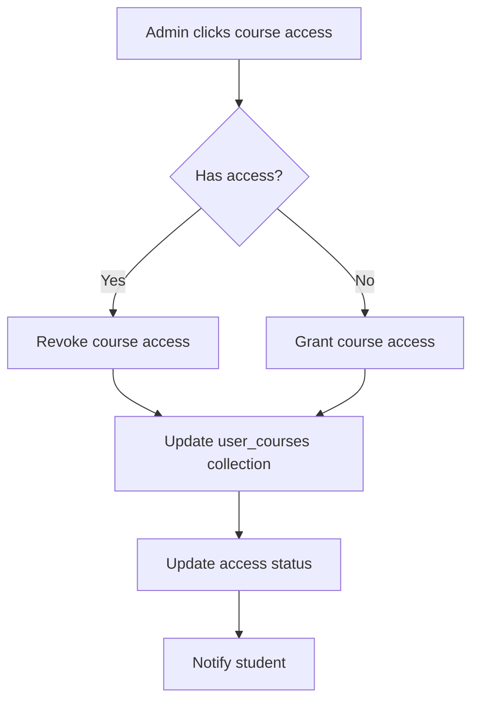

**Diagram sources**
- [Students.tsx:69-82](file://components/Students.tsx#L69-L82)
- [userCourses.ts:25-87](file://lib/db/userCourses.ts#L25-L87)

**Section sources**
- [Students.tsx:408-428](file://components/Students.tsx#L408-L428)
- [userCourses.ts:25-87](file://lib/db/userCourses.ts#L25-L87)
- [db/types.ts:53-61](file://lib/db/types.ts#L53-L61)

## Dependency Analysis
The system exhibits clear separation of concerns with enhanced course access management:
- UI components depend on libraries for data access and services.
- Libraries encapsulate Firebase interactions and business logic.
- Backend functions provide secure access to external APIs.
- **Enhanced** Course access management through dedicated user-course relationships.

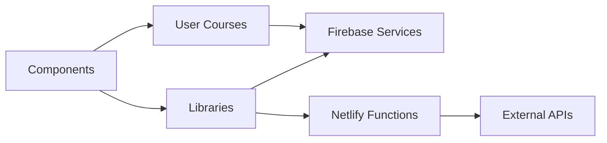

**Diagram sources**
- [Students.tsx:1-8](file://components/Students.tsx#L1-L8)
- [db/index.ts:1-38](file://lib/db/index.ts#L1-L38)
- [firebase.ts:1-25](file://lib/firebase.ts#L1-L25)
- [userCourses.ts:1-112](file://lib/db/userCourses.ts#L1-L112)
- [check-payment-status.js:1-152](file://netlify/functions/check-payment-status.js#L1-L152)

**Section sources**
- [db/index.ts:1-38](file://lib/db/index.ts#L1-L38)
- [types.ts:1-125](file://types.ts#L1-L125)
- [db/types.ts:1-90](file://lib/db/types.ts#L1-L90)

## Performance Considerations
- Client-side sorting: Student lists are sorted client-side to avoid Firestore index overhead.
- Periodic refresh: Dashboards poll for updates at intervals to keep data fresh.
- Lazy loading: Media and course lists are paginated or filtered to reduce render cost.
- Storage uploads: Progress callbacks enable responsive feedback during large uploads.
- **Enhanced** Course access caching: User course data is cached locally to reduce Firestore queries.

## Troubleshooting Guide
Common issues and resolutions:
- Authentication errors: Validate email format and password strength; handle popup blockers for Google sign-in.
- Media upload failures: Check CORS configuration and storage rules; verify file types and sizes.
- Payment status checks: Ensure Asaas access token is configured; verify Firebase token verification in functions.
- Attendance anomalies: Confirm activity timestamps and date normalization logic.
- **Enhanced** Course access issues: Verify user-course relationships in Firestore; check admin permissions for access changes.
- **Enhanced** Access control conflicts: Ensure proper source attribution (Asaas vs manual) when managing course access.

**Section sources**
- [Auth.tsx:45-57](file://components/Auth.tsx#L45-L57)
- [media.ts:54-76](file://lib/media.ts#L54-L76)
- [check-payment-status.js:76-86](file://netlify/functions/check-payment-status.js#L76-L86)
- [attendance.ts:122-161](file://lib/attendance.ts#L122-L161)
- [userCourses.ts:32-35](file://lib/db/userCourses.ts#L32-L35)

## Conclusion
The student management system integrates Firebase Authentication, Firestore, and Cloud Storage with Netlify functions to provide robust enrollment tracking, progress monitoring, and administrative controls. The enhanced architecture now includes comprehensive course access management through user-course relationships, granular permission controls, and audit trails. The modular architecture supports scalable enhancements while maintaining clear separation between UI, business logic, and external integrations.

## Appendices

### Practical Examples

- Student Onboarding Process
  - Admin adds a new student via the modal; the system persists the record and initializes course access records.
  - Reference: [Students.tsx:91-126](file://components/Students.tsx#L91-L126), [db/students.ts:65-84](file://lib/db/students.ts#L65-L84)

- Enhanced Progress Assessment Workflow
  - Student completes lessons and uploads media; activities are logged and XP is awarded.
  - Course access is automatically managed based on payment status or manual admin intervention.
  - Reference: [attendance.ts:7-30](file://lib/attendance.ts#L7-L30), [gamification.ts:100-129](file://lib/gamification.ts#L100-L129), [media.ts:8-117](file://lib/media.ts#L8-L117), [userCourses.ts:25-87](file://lib/db/userCourses.ts#L25-L87)

- Enhanced Administrative Student Management Procedure
  - Admin grants or revokes course access with source attribution; views financial reports and updates plan details.
  - Course access changes are tracked with audit trails and notifications.
  - Reference: [userCourses.ts:25-87](file://lib/db/userCourses.ts#L25-L87), [FinancialReports.tsx:146-170](file://components/FinancialReports.tsx#L146-L170), [Students.tsx:408-428](file://components/Students.tsx#L408-L428)

- **New** Course Access Control Workflow
  - Admin manages individual course enrollments per student with granular status control.
  - Access changes trigger immediate updates to student course availability.
  - Reference: [Students.tsx:69-82](file://components/Students.tsx#L69-L82), [userCourses.ts:25-87](file://lib/db/userCourses.ts#L25-L87), [courses.ts:54-97](file://lib/db/courses.ts#L54-L97)