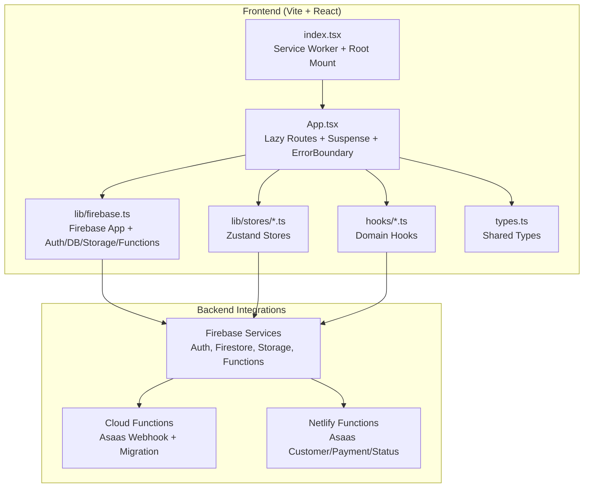
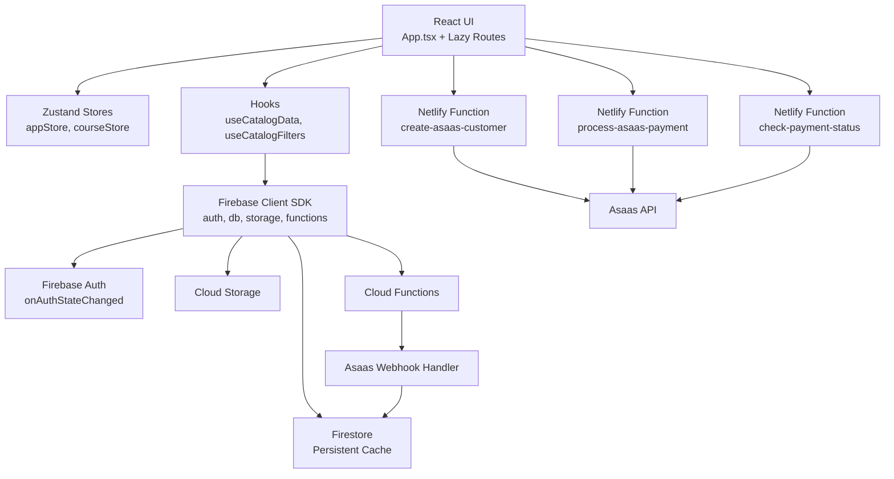
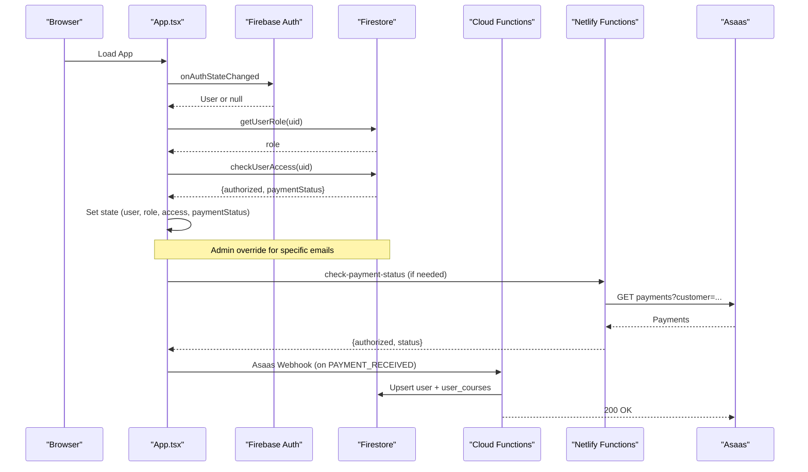
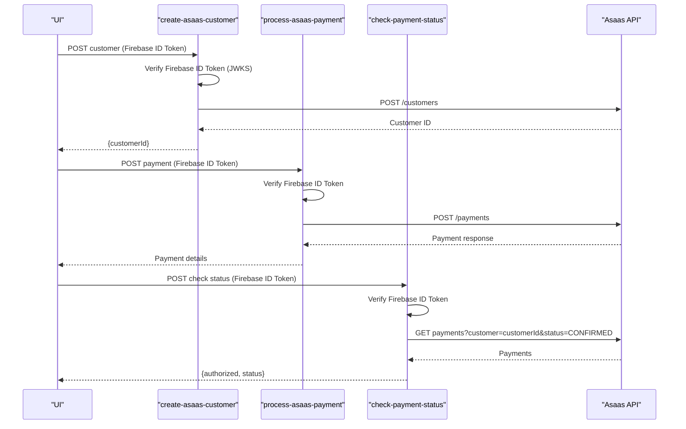
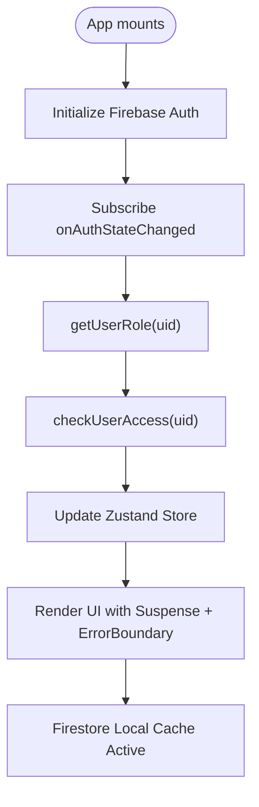
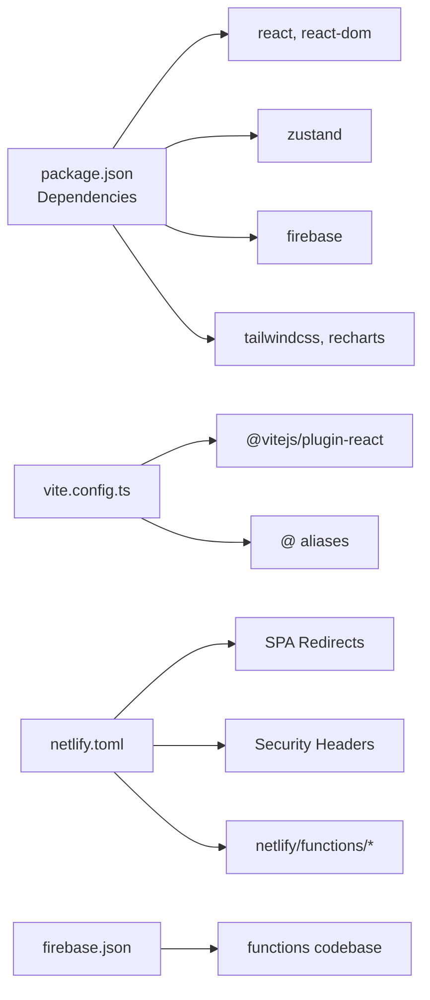

# Architecture Overview

<cite>
**Referenced Files in This Document**
- [package.json](file://package.json)
- [index.tsx](file://index.tsx)
- [App.tsx](file://App.tsx)
- [lib/firebase.ts](file://lib/firebase.ts)
- [vite.config.ts](file://vite.config.ts)
- [netlify.toml](file://netlify.toml)
- [firebase.json](file://firebase.json)
- [types.ts](file://types.ts)
- [lib/stores/appStore.ts](file://lib/stores/appStore.ts)
- [lib/stores/courseStore.ts](file://lib/stores/courseStore.ts)
- [hooks/useCatalogData.ts](file://hooks/useCatalogData.ts)
- [hooks/useCatalogFilters.ts](file://hooks/useCatalogFilters.ts)
- [lib/db/index.ts](file://lib/db/index.ts)
- [functions/src/index.js](file://functions/src/index.js)
- [netlify/functions/create-asaas-customer.js](file://netlify/functions/create-asaas-customer.js)
- [netlify/functions/process-asaas-payment.js](file://netlify/functions/process-asaas-payment.js)
- [netlify/functions/check-payment-status.js](file://netlify/functions/check-payment-status.js)
</cite>

## Table of Contents
1. [Introduction](#introduction)
2. [Project Structure](#project-structure)
3. [Core Components](#core-components)
4. [Architecture Overview](#architecture-overview)
5. [Detailed Component Analysis](#detailed-component-analysis)
6. [Dependency Analysis](#dependency-analysis)
7. [Performance Considerations](#performance-considerations)
8. [Troubleshooting Guide](#troubleshooting-guide)
9. [Conclusion](#conclusion)
10. [Appendices](#appendices)

## Introduction
This document describes the Fluentoria system architecture, focusing on the frontend built with React 19.2.0 using concurrent rendering, Zustand-based state management, and Firebase integration. It explains the component hierarchy, data flow, and integration patterns with Firebase services and external APIs (Asaas). Cross-cutting concerns such as authentication, authorization, real-time updates, and error handling are documented alongside deployment topology and security configurations.

## Project Structure
Fluentoria is a Vite-powered React application with:
- Frontend: React 19.2.0 with concurrent features, lazy loading, and Suspense
- State Management: Zustand stores for global and course-scoped state
- Backend Integration: Firebase Authentication, Firestore, Cloud Storage, and Cloud Functions
- Edge Functions: Netlify Functions for Asaas customer creation, payment processing, and status checks
- Build and Dev: Vite with React plugin, TypeScript, Tailwind CSS, and PostCSS

**Diagram sources**
- [index.tsx](file://index.tsx#L1-L65)
- [App.tsx](file://App.tsx#L1-L449)
- [lib/firebase.ts](file://lib/firebase.ts#L1-L25)
- [lib/stores/appStore.ts](file://lib/stores/appStore.ts#L1-L82)
- [lib/stores/courseStore.ts](file://lib/stores/courseStore.ts#L1-L27)
- [hooks/useCatalogData.ts](file://hooks/useCatalogData.ts#L1-L157)
- [hooks/useCatalogFilters.ts](file://hooks/useCatalogFilters.ts#L1-L86)
- [types.ts](file://types.ts#L1-L125)
- [functions/src/index.js](file://functions/src/index.js#L1-L387)
- [netlify/functions/create-asaas-customer.js](file://netlify/functions/create-asaas-customer.js#L1-L146)
- [netlify/functions/process-asaas-payment.js](file://netlify/functions/process-asaas-payment.js#L1-L121)
- [netlify/functions/check-payment-status.js](file://netlify/functions/check-payment-status.js#L1-L152)

**Section sources**
- [package.json](file://package.json#L1-L44)
- [vite.config.ts](file://vite.config.ts#L1-L33)
- [netlify.toml](file://netlify.toml#L1-L65)
- [firebase.json](file://firebase.json#L1-L20)

## Core Components
- React 19.2.0 with concurrent rendering and Suspense
  - Lazy-loaded route components with React.lazy and Suspense fallback
  - Error boundaries wrap route rendering
- Zustand stores
  - Global app state (authentication, navigation, UI flags)
  - Course-scoped selection state
- Firebase integration
  - Auth state subscription, user role resolution, and access checks
  - Persistent Firestore cache with multi-tab support
- Domain hooks
  - Catalog data fetching and CRUD orchestration
  - Filtering logic for catalog lists
- Netlify Functions
  - Secure proxy endpoints for Asaas customer creation, payment processing, and status checks
- Cloud Functions
  - Asaas webhook handler for payment lifecycle events
  - Access migration callable and HTTP endpoints

**Section sources**
- [App.tsx](file://App.tsx#L1-L449)
- [lib/stores/appStore.ts](file://lib/stores/appStore.ts#L1-L82)
- [lib/stores/courseStore.ts](file://lib/stores/courseStore.ts#L1-L27)
- [lib/firebase.ts](file://lib/firebase.ts#L1-L25)
- [hooks/useCatalogData.ts](file://hooks/useCatalogData.ts#L1-L157)
- [hooks/useCatalogFilters.ts](file://hooks/useCatalogFilters.ts#L1-L86)
- [functions/src/index.js](file://functions/src/index.js#L144-L339)
- [netlify/functions/create-asaas-customer.js](file://netlify/functions/create-asaas-customer.js#L1-L146)
- [netlify/functions/process-asaas-payment.js](file://netlify/functions/process-asaas-payment.js#L1-L121)
- [netlify/functions/check-payment-status.js](file://netlify/functions/check-payment-status.js#L1-L152)

## Architecture Overview
The system follows a layered architecture:
- Presentation Layer: React components with concurrent rendering and lazy loading
- State Layer: Zustand stores for predictable state updates
- Domain Layer: Hooks orchestrating data operations and filters
- Integration Layer: Firebase client SDK and serverless functions
- External Systems: Asaas payment provider via Netlify Functions and Cloud Functions

**Diagram sources**
- [App.tsx](file://App.tsx#L1-L449)
- [lib/stores/appStore.ts](file://lib/stores/appStore.ts#L1-L82)
- [lib/stores/courseStore.ts](file://lib/stores/courseStore.ts#L1-L27)
- [hooks/useCatalogData.ts](file://hooks/useCatalogData.ts#L1-L157)
- [hooks/useCatalogFilters.ts](file://hooks/useCatalogFilters.ts#L1-L86)
- [lib/firebase.ts](file://lib/firebase.ts#L1-L25)
- [functions/src/index.js](file://functions/src/index.js#L144-L339)
- [netlify/functions/create-asaas-customer.js](file://netlify/functions/create-asaas-customer.js#L1-L146)
- [netlify/functions/process-asaas-payment.js](file://netlify/functions/process-asaas-payment.js#L1-L121)
- [netlify/functions/check-payment-status.js](file://netlify/functions/check-payment-status.js#L1-L152)

## Detailed Component Analysis

### Authentication and Authorization Flow
The authentication flow integrates Firebase Authentication with Firestore-based access control and Asaas payment status.

**Diagram sources**
- [App.tsx](file://App.tsx#L65-L108)
- [lib/firebase.ts](file://lib/firebase.ts#L1-L25)
- [functions/src/index.js](file://functions/src/index.js#L144-L339)
- [netlify/functions/check-payment-status.js](file://netlify/functions/check-payment-status.js#L1-L152)

**Section sources**
- [App.tsx](file://App.tsx#L65-L108)
- [lib/firebase.ts](file://lib/firebase.ts#L1-L25)
- [functions/src/index.js](file://functions/src/index.js#L144-L339)
- [netlify/functions/check-payment-status.js](file://netlify/functions/check-payment-status.js#L1-L152)

### Payment Lifecycle with Asaas
Asaas customer creation, payment processing, and status checking are proxied through Netlify Functions with JWT verification against Firebase Auth.

**Diagram sources**
- [netlify/functions/create-asaas-customer.js](file://netlify/functions/create-asaas-customer.js#L1-L146)
- [netlify/functions/process-asaas-payment.js](file://netlify/functions/process-asaas-payment.js#L1-L121)
- [netlify/functions/check-payment-status.js](file://netlify/functions/check-payment-status.js#L1-L152)

**Section sources**
- [netlify/functions/create-asaas-customer.js](file://netlify/functions/create-asaas-customer.js#L1-L146)
- [netlify/functions/process-asaas-payment.js](file://netlify/functions/process-asaas-payment.js#L1-L121)
- [netlify/functions/check-payment-status.js](file://netlify/functions/check-payment-status.js#L1-L152)

### Data Flow and Component Hierarchy
The UI renders screens based on view mode and current screen, with lazy routes and Suspense fallbacks. State is managed by Zustand stores, while domain logic is encapsulated in hooks.

```mermaid
graph TB
App["App.tsx<br/>Auth + Navigation + Screens"] --> Sidebar["Sidebar.tsx"]
App --> Main["Main Content Area"]
App --> MobileNav["MobileNav.tsx"]
Main --> LazyDash["StudentDashboard (lazy)"]
Main --> LazyAdmin["AdminCatalog (lazy)"]
Main --> LazyStudents["Students (lazy)"]
Main --> LazyReports["Reports (lazy)"]
Main --> LazyFin["FinancialReports (lazy)"]
Main --> LazySettings["Settings (lazy)"]
Main --> LazyCourses["CourseList (lazy)"]
Main --> LazyGallery["GalleryList (lazy)"]
Main --> LazyDetail["CourseDetail (lazy)"]
Main --> LazyModules["ModuleSelection (lazy)"]
Main --> LazyMindful["MindfulFlowList (lazy)"]
Main --> LazyMusic["MusicList (lazy)"]
Main --> LazyProfile["Profile (lazy)"]
Main --> LazyAchieve["Achievements (lazy)"]
Main --> LazyLeader["Leaderboard (lazy)"]
Main --> LazyAttend["AttendanceTracker (lazy)"]
App --> Stores["Zustand Stores<br/>appStore, courseStore"]
App --> Hooks["Domain Hooks<br/>useCatalogData, useCatalogFilters"]
App --> Types["Shared Types<br/>types.ts"]
```

**Diagram sources**
- [App.tsx](file://App.tsx#L6-L23)
- [lib/stores/appStore.ts](file://lib/stores/appStore.ts#L1-L82)
- [lib/stores/courseStore.ts](file://lib/stores/courseStore.ts#L1-L27)
- [hooks/useCatalogData.ts](file://hooks/useCatalogData.ts#L1-L157)
- [hooks/useCatalogFilters.ts](file://hooks/useCatalogFilters.ts#L1-L86)
- [types.ts](file://types.ts#L1-L125)

**Section sources**
- [App.tsx](file://App.tsx#L240-L324)
- [lib/stores/appStore.ts](file://lib/stores/appStore.ts#L1-L82)
- [lib/stores/courseStore.ts](file://lib/stores/courseStore.ts#L1-L27)
- [hooks/useCatalogData.ts](file://hooks/useCatalogData.ts#L1-L157)
- [hooks/useCatalogFilters.ts](file://hooks/useCatalogFilters.ts#L1-L86)
- [types.ts](file://types.ts#L1-L125)

### Real-Time Updates and Persistence
- Firestore persistence: Local cache enabled with multi-tab manager for shared state across tabs
- Auth state subscription: Reactive updates to user role and access flags
- Domain hooks: Encapsulate CRUD and filtering logic for catalog data

**Diagram sources**
- [lib/firebase.ts](file://lib/firebase.ts#L18-L22)
- [App.tsx](file://App.tsx#L65-L108)
- [lib/stores/appStore.ts](file://lib/stores/appStore.ts#L1-L82)

**Section sources**
- [lib/firebase.ts](file://lib/firebase.ts#L18-L22)
- [App.tsx](file://App.tsx#L65-L108)
- [hooks/useCatalogData.ts](file://hooks/useCatalogData.ts#L1-L157)

## Dependency Analysis
- Frontend dependencies: React 19.2.0, React DOM, Zustand, Firebase JS SDK, Tailwind CSS, Recharts
- Build toolchain: Vite with React plugin, TypeScript, PostCSS/Tailwind
- Deployment: Netlify static hosting with serverless functions and redirects
- Security: CSP headers, strict transport security, and service worker update strategy

**Diagram sources**
- [package.json](file://package.json#L13-L24)
- [vite.config.ts](file://vite.config.ts#L1-L33)
- [netlify.toml](file://netlify.toml#L1-L65)
- [firebase.json](file://firebase.json#L1-L20)

**Section sources**
- [package.json](file://package.json#L13-L24)
- [vite.config.ts](file://vite.config.ts#L1-L33)
- [netlify.toml](file://netlify.toml#L1-L65)
- [firebase.json](file://firebase.json#L1-L20)

## Performance Considerations
- Concurrent Rendering and Suspense
  - Lazy loading of route components reduces initial bundle size
  - Suspense fallback provides smooth loading UX during data fetches
- Code Splitting
  - Route components imported via React.lazy enable per-route chunks
- State Management
  - Zustand minimizes re-renders by scoping state to stores and avoiding unnecessary subscriptions
- Offline and Updates
  - Service Worker registration with skip-waiting prompt ensures users receive updates without stale content
- Firestore
  - Persistent local cache improves responsiveness and offline availability

**Section sources**
- [App.tsx](file://App.tsx#L6-L38)
- [index.tsx](file://index.tsx#L19-L65)
- [lib/firebase.ts](file://lib/firebase.ts#L18-L22)
- [lib/stores/appStore.ts](file://lib/stores/appStore.ts#L1-L82)

## Troubleshooting Guide
- Authentication Issues
  - Verify Firebase configuration variables are present in environment
  - Confirm onAuthStateChanged subscription is active and user role is resolved
- Access Denied Screen
  - Check payment status and access flags derived from Firestore and Asaas
  - Admin-only actions guarded by view mode toggle and role checks
- Asaas Integration
  - Ensure Netlify Functions receive a valid Firebase ID token
  - Validate Asaas access token and API URL environment variables
  - Review Cloud Functions webhook token configuration and signature verification
- Build and Deploy
  - Confirm Vite dev server host/port and HMR settings
  - Verify Netlify redirects to SPA entry and security headers

**Section sources**
- [lib/firebase.ts](file://lib/firebase.ts#L7-L14)
- [App.tsx](file://App.tsx#L175-L238)
- [netlify/functions/create-asaas-customer.js](file://netlify/functions/create-asaas-customer.js#L44-L62)
- [functions/src/index.js](file://functions/src/index.js#L160-L179)
- [vite.config.ts](file://vite.config.ts#L8-L20)
- [netlify.toml](file://netlify.toml#L16-L35)

## Conclusion
Fluentoria employs a modern, scalable architecture combining React 19.2.0’s concurrent rendering, Zustand for efficient state management, and robust Firebase integrations. The system leverages lazy loading, Suspense, and a service worker for performance and reliability. Asaas payment processing is securely handled through Netlify Functions with Firebase token verification, while Cloud Functions manage asynchronous payment lifecycle events. The deployment topology emphasizes security headers, SPA routing, and serverless compute for external API interactions.

## Appendices
- Technology Stack
  - Frontend: React 19.2.0, TypeScript, Tailwind CSS, Zustand, Recharts
  - Build: Vite, PostCSS, Autoprefixer
  - Backend: Firebase (Auth, Firestore, Storage, Functions), Netlify (Static + Functions)
  - Payments: Asaas via Netlify Functions and Cloud Functions
- Environment Variables
  - Firebase: API key, Auth domain, Project ID, Storage bucket, Messaging sender ID, App ID
  - Asaas: Access token, API URL
  - Gemini: API key (defined in Vite config)
- Security Headers
  - Content-Security-Policy, X-Frame-Options, X-Content-Type-Options, Strict-Transport-Security, Referrer-Policy

**Section sources**
- [lib/firebase.ts](file://lib/firebase.ts#L7-L14)
- [netlify/functions/create-asaas-customer.js](file://netlify/functions/create-asaas-customer.js#L76-L86)
- [netlify/functions/process-asaas-payment.js](file://netlify/functions/process-asaas-payment.js#L67-L77)
- [netlify/functions/check-payment-status.js](file://netlify/functions/check-payment-status.js#L76-L86)
- [vite.config.ts](file://vite.config.ts#L22-L25)
- [netlify.toml](file://netlify.toml#L39-L47)