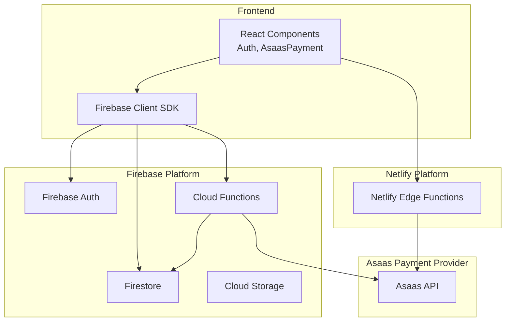
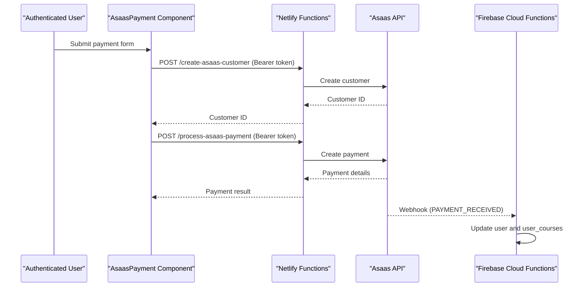
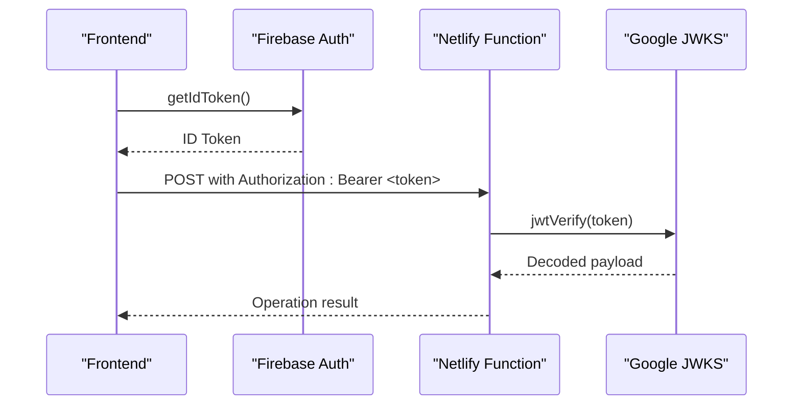
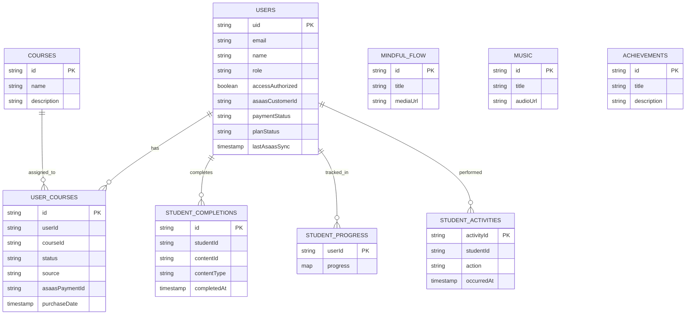
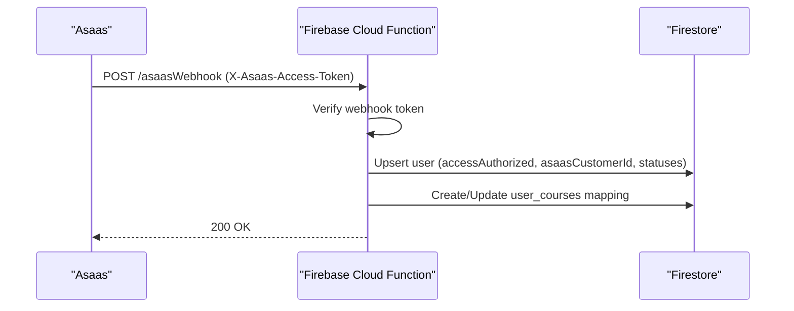
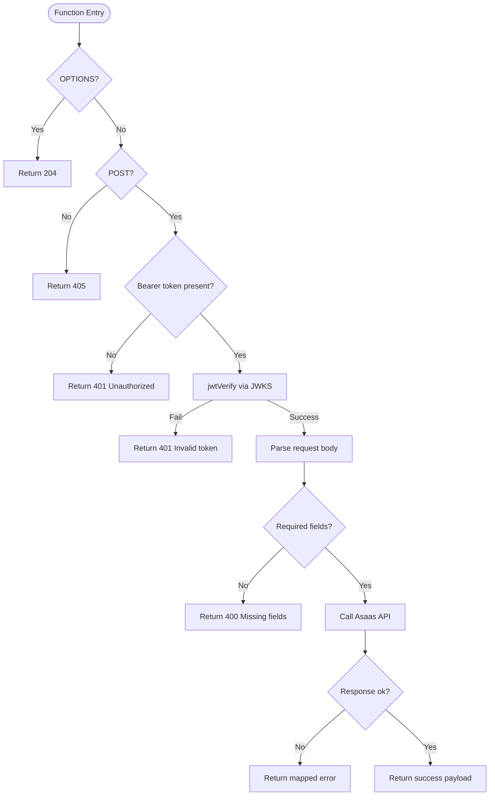
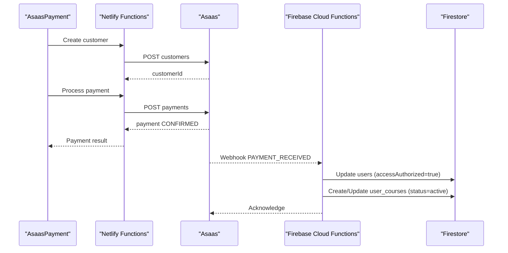
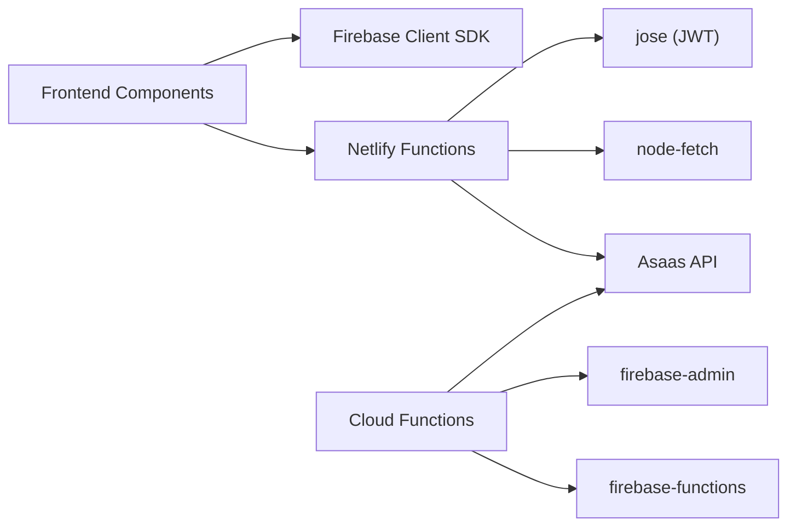

# Backend Services Architecture

<cite>
**Referenced Files in This Document**
- [firebase.json](file://firebase.json)
- [netlify.toml](file://netlify.toml)
- [functions/src/index.js](file://functions/src/index.js)
- [functions/src/api/updateUserCustomerId.js](file://functions/src/api/updateUserCustomerId.js)
- [functions/package.json](file://functions/package.json)
- [netlify/functions/create-asaas-customer.js](file://netlify/functions/create-asaas-customer.js)
- [netlify/functions/process-asaas-payment.js](file://netlify/functions/process-asaas-payment.js)
- [netlify/functions/check-payment-status.js](file://netlify/functions/check-payment-status.js)
- [lib/firebase.ts](file://lib/firebase.ts)
- [firestore.rules](file://firestore.rules)
- [storage.rules](file://storage.rules)
- [components/AsaasPayment.tsx](file://components/AsaasPayment.tsx)
- [components/Auth.tsx](file://components/Auth.tsx)
- [lib/db/index.ts](file://lib/db/index.ts)
- [package.json](file://package.json)
</cite>

## Table of Contents
1. [Introduction](#introduction)
2. [Project Structure](#project-structure)
3. [Core Components](#core-components)
4. [Architecture Overview](#architecture-overview)
5. [Detailed Component Analysis](#detailed-component-analysis)
6. [Dependency Analysis](#dependency-analysis)
7. [Performance Considerations](#performance-considerations)
8. [Troubleshooting Guide](#troubleshooting-guide)
9. [Conclusion](#conclusion)
10. [Appendices](#appendices)

## Introduction
This document describes the backend services architecture for Fluentoria's serverless infrastructure. It covers Firebase integration patterns (Authentication, Firestore, and Cloud Functions), the dual backend approach combining Firebase Cloud Functions and Netlify Functions for payment processing, the Asaas payment integration workflow, customer management, and payment status tracking. It also documents Firebase security rules, real-time synchronization, authentication token management, serverless function deployment, environment variable configuration, error handling strategies, API gateway patterns, and how frontend components interact with backend services.

## Project Structure
The backend is organized into two complementary serverless platforms:
- Firebase: Hosting, Firestore, Cloud Functions, Authentication, and Storage
- Netlify: Edge Functions for payment processing and status checks

Key areas:
- Firebase configuration and deployment targeting
- Firestore security rules and collections
- Cloud Functions for webhooks and administrative tasks
- Netlify Functions for secure payment operations
- Frontend integration via Firebase SDK and HTTP calls to Netlify Functions

**Diagram sources**
- [firebase.json](file://firebase.json#L1-L20)
- [netlify.toml](file://netlify.toml#L1-L65)
- [lib/firebase.ts](file://lib/firebase.ts#L1-L25)
- [functions/src/index.js](file://functions/src/index.js#L1-L387)
- [netlify/functions/create-asaas-customer.js](file://netlify/functions/create-asaas-customer.js#L1-L146)
- [netlify/functions/process-asaas-payment.js](file://netlify/functions/process-asaas-payment.js#L1-L121)
- [netlify/functions/check-payment-status.js](file://netlify/functions/check-payment-status.js#L1-L152)

**Section sources**
- [firebase.json](file://firebase.json#L1-L20)
- [netlify.toml](file://netlify.toml#L1-L65)
- [lib/firebase.ts](file://lib/firebase.ts#L1-L25)

## Core Components
- Firebase Authentication: User sign-up/sign-in and token management
- Firestore: Real-time database for users, courses, progress, and access mapping
- Cloud Functions: Webhook handler for Asaas events, administrative migration endpoints, and customer ID updater
- Netlify Functions: Secure payment creation, payment processing, and payment status checking
- Frontend Components: Auth and AsaasPayment orchestrate flows using Firebase Auth tokens and Netlify Functions

**Section sources**
- [components/Auth.tsx](file://components/Auth.tsx#L1-L265)
- [components/AsaasPayment.tsx](file://components/AsaasPayment.tsx#L1-L491)
- [lib/firebase.ts](file://lib/firebase.ts#L1-L25)
- [firestore.rules](file://firestore.rules#L1-L97)
- [functions/src/index.js](file://functions/src/index.js#L1-L387)
- [netlify/functions/create-asaas-customer.js](file://netlify/functions/create-asaas-customer.js#L1-L146)
- [netlify/functions/process-asaas-payment.js](file://netlify/functions/process-asaas-payment.js#L1-L121)
- [netlify/functions/check-payment-status.js](file://netlify/functions/check-payment-status.js#L1-L152)

## Architecture Overview
The system uses a hybrid serverless model:
- Firebase Authentication issues ID tokens used by frontend and validated by Netlify Functions
- Netlify Functions act as API gateways for sensitive operations (creating customers, processing payments, checking status)
- Firebase Cloud Functions handle asynchronous events (Asaas webhooks) and administrative tasks
- Firestore enforces fine-grained security rules and supports real-time subscriptions
- Storage rules protect uploaded assets

**Diagram sources**
- [components/AsaasPayment.tsx](file://components/AsaasPayment.tsx#L86-L181)
- [netlify/functions/create-asaas-customer.js](file://netlify/functions/create-asaas-customer.js#L20-L146)
- [netlify/functions/process-asaas-payment.js](file://netlify/functions/process-asaas-payment.js#L20-L121)
- [functions/src/index.js](file://functions/src/index.js#L144-L339)

## Detailed Component Analysis

### Firebase Authentication and Token Management
- Frontend initializes Firebase and obtains ID tokens via Firebase Auth
- Netlify Functions verify ID tokens using Google JWKS
- Token verification ensures only authenticated users can create customers, process payments, and check status
- Tokens are passed in Authorization headers to Netlify Functions

**Diagram sources**
- [lib/firebase.ts](file://lib/firebase.ts#L1-L25)
- [netlify/functions/create-asaas-customer.js](file://netlify/functions/create-asaas-customer.js#L6-L18)
- [netlify/functions/process-asaas-payment.js](file://netlify/functions/process-asaas-payment.js#L6-L18)
- [netlify/functions/check-payment-status.js](file://netlify/functions/check-payment-status.js#L6-L18)

**Section sources**
- [lib/firebase.ts](file://lib/firebase.ts#L1-L25)
- [netlify/functions/create-asaas-customer.js](file://netlify/functions/create-asaas-customer.js#L6-L18)
- [netlify/functions/process-asaas-payment.js](file://netlify/functions/process-asaas-payment.js#L6-L18)
- [netlify/functions/check-payment-status.js](file://netlify/functions/check-payment-status.js#L6-L18)

### Firestore Database and Security Rules
- Collections include users, courses, mindful_flow, music, student_completions, student_progress, student_activities, achievements, and user_courses
- Security rules enforce:
  - Authenticated access for reads
  - Owner-only updates for user profiles
  - Admin-only writes for most collections
  - Fine-grained access for user_courses and activities
- Real-time subscriptions enable live updates in the UI

**Diagram sources**
- [firestore.rules](file://firestore.rules#L1-L97)

**Section sources**
- [firestore.rules](file://firestore.rules#L1-L97)
- [lib/db/index.ts](file://lib/db/index.ts#L1-L38)

### Firebase Cloud Functions
- Webhook endpoint validates Asaas webhook signatures and updates Firestore accordingly
- Administrative endpoints support legacy migrations and customer ID updates
- Functions use Admin SDK for privileged operations and enforce admin-only access

**Diagram sources**
- [functions/src/index.js](file://functions/src/index.js#L144-L339)

**Section sources**
- [functions/src/index.js](file://functions/src/index.js#L1-L387)
- [functions/src/api/updateUserCustomerId.js](file://functions/src/api/updateUserCustomerId.js#L1-L74)

### Netlify Functions (Dual Backend for Payments)
- create-asaas-customer: Creates a customer in Asaas using a Bearer token and returns a customer ID
- process-asaas-payment: Proxies payment creation to Asaas after validating the token
- check-payment-status: Fetches CONFIRMED payments for a customer and determines access status

**Diagram sources**
- [netlify/functions/create-asaas-customer.js](file://netlify/functions/create-asaas-customer.js#L20-L146)
- [netlify/functions/process-asaas-payment.js](file://netlify/functions/process-asaas-payment.js#L20-L121)
- [netlify/functions/check-payment-status.js](file://netlify/functions/check-payment-status.js#L20-L152)

**Section sources**
- [netlify/functions/create-asaas-customer.js](file://netlify/functions/create-asaas-customer.js#L1-L146)
- [netlify/functions/process-asaas-payment.js](file://netlify/functions/process-asaas-payment.js#L1-L121)
- [netlify/functions/check-payment-status.js](file://netlify/functions/check-payment-status.js#L1-L152)

### Asaas Payment Integration Workflow
- Frontend collects user and card details
- Netlify Functions create a customer and process a payment
- On successful payment confirmation, Firebase Cloud Functions update user and course access
- Overdue payments trigger course/course plan deactivation and global access revocation when applicable

**Diagram sources**
- [components/AsaasPayment.tsx](file://components/AsaasPayment.tsx#L86-L244)
- [netlify/functions/create-asaas-customer.js](file://netlify/functions/create-asaas-customer.js#L88-L132)
- [netlify/functions/process-asaas-payment.js](file://netlify/functions/process-asaas-payment.js#L79-L107)
- [functions/src/index.js](file://functions/src/index.js#L188-L266)

**Section sources**
- [components/AsaasPayment.tsx](file://components/AsaasPayment.tsx#L1-L491)
- [functions/src/index.js](file://functions/src/index.js#L144-L339)

### Real-Time Database Synchronization
- Firestore rules enable real-time subscriptions for authenticated users
- Components subscribe to user-specific data to reflect changes instantly
- Access updates propagate to user_courses and related collections upon payment events

**Section sources**
- [firestore.rules](file://firestore.rules#L1-L97)
- [lib/db/index.ts](file://lib/db/index.ts#L27-L28)

### Authentication Token Management
- Frontend obtains ID tokens from Firebase Auth
- Netlify Functions validate tokens against Google JWKS
- Token verification occurs at the beginning of each function execution
- Errors are returned as 401 Unauthorized for missing or invalid tokens

**Section sources**
- [lib/firebase.ts](file://lib/firebase.ts#L1-L25)
- [netlify/functions/create-asaas-customer.js](file://netlify/functions/create-asaas-customer.js#L6-L18)
- [netlify/functions/process-asaas-payment.js](file://netlify/functions/process-asaas-payment.js#L6-L18)
- [netlify/functions/check-payment-status.js](file://netlify/functions/check-payment-status.js#L6-L18)

### API Gateway Patterns and Frontend Integration
- Netlify Functions serve as API gateways for sensitive operations
- Frontend components call Netlify Functions via HTTPS with Authorization headers
- Firebase Cloud Functions expose HTTPS endpoints for administrative tasks and webhooks
- Redirects and headers in netlify.toml configure routing and security headers

**Section sources**
- [netlify.toml](file://netlify.toml#L1-L65)
- [components/AsaasPayment.tsx](file://components/AsaasPayment.tsx#L108-L181)
- [functions/src/index.js](file://functions/src/index.js#L342-L387)

## Dependency Analysis
- Frontend depends on Firebase SDK for auth and Firestore
- Netlify Functions depend on jose for JWT verification and node-fetch for HTTP calls
- Firebase Functions depend on firebase-admin and firebase-functions
- Environment variables are used for Asaas credentials and API URLs

**Diagram sources**
- [package.json](file://package.json#L13-L24)
- [functions/package.json](file://functions/package.json#L16-L19)
- [netlify/functions/create-asaas-customer.js](file://netlify/functions/create-asaas-customer.js#L1-L2)
- [netlify/functions/process-asaas-payment.js](file://netlify/functions/process-asaas-payment.js#L1-L2)
- [netlify/functions/check-payment-status.js](file://netlify/functions/check-payment-status.js#L1-L2)

**Section sources**
- [package.json](file://package.json#L1-L44)
- [functions/package.json](file://functions/package.json#L1-L25)

## Performance Considerations
- Use server timestamps for consistency across regions
- Minimize function cold starts by keeping functions small and avoiding heavy initialization
- Cache Asaas access tokens securely and reuse where appropriate
- Monitor function logs and set up alerts for webhook failures
- Optimize Firestore queries and consider indexing for frequent filters

## Troubleshooting Guide
Common issues and resolutions:
- Missing or invalid ID token: Ensure frontend retrieves a fresh token before calling Netlify Functions
- Asaas webhook token misconfiguration: Verify webhook token is set in Firebase config
- Payment status discrepancies: Use the payment status checker to reconcile CONFIRMED vs OVERDUE
- Admin-only errors: Confirm user role is admin or use callable/admin endpoints appropriately

**Section sources**
- [functions/src/index.js](file://functions/src/index.js#L160-L179)
- [netlify/functions/create-asaas-customer.js](file://netlify/functions/create-asaas-customer.js#L76-L86)
- [netlify/functions/check-payment-status.js](file://netlify/functions/check-payment-status.js#L67-L77)

## Conclusion
Fluentoria employs a robust serverless backend combining Firebase and Netlify to deliver secure, scalable payment processing and user management. Firebase Authentication and Firestore provide the foundation for identity and data, while Firebase Cloud Functions handle asynchronous events and administrative tasks. Netlify Functions encapsulate sensitive payment operations behind token-verified endpoints, ensuring secure and auditable payment flows. The system’s security model relies on Firebase security rules, strict token verification, and controlled access patterns.

## Appendices

### Deployment and Environment Variables
- Firebase Functions deployment targets the functions directory with ignore patterns
- Netlify builds and publishes functions from the netlify/functions directory
- Environment variables:
  - Asaas: access token and API URL
  - Firebase: project ID for JWT verification

**Section sources**
- [firebase.json](file://firebase.json#L8-L19)
- [netlify.toml](file://netlify.toml#L36-L37)
- [netlify/functions/create-asaas-customer.js](file://netlify/functions/create-asaas-customer.js#L76-L77)
- [netlify/functions/process-asaas-payment.js](file://netlify/functions/process-asaas-payment.js#L67-L68)
- [netlify/functions/check-payment-status.js](file://netlify/functions/check-payment-status.js#L76-L77)