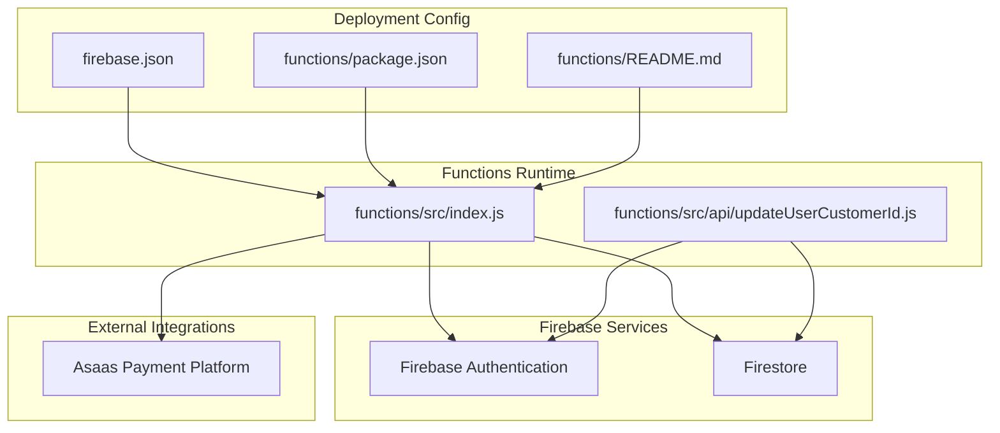
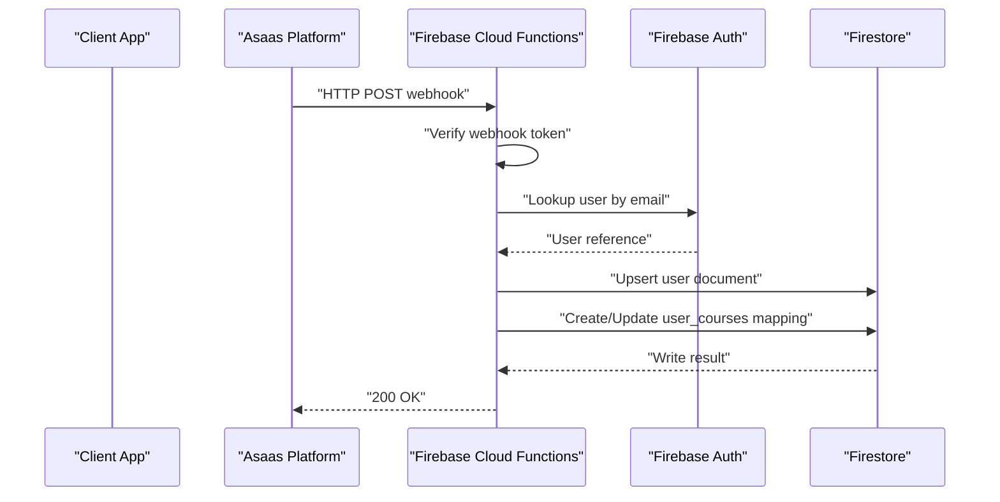
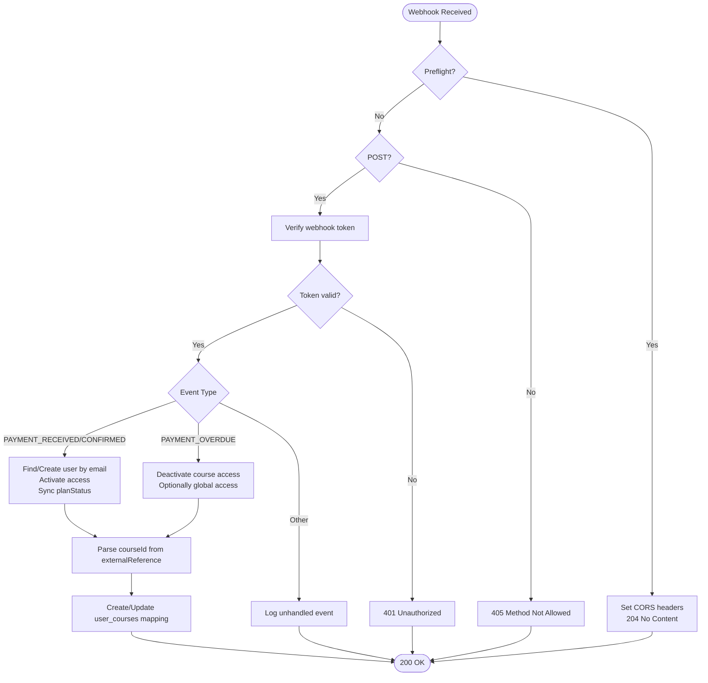
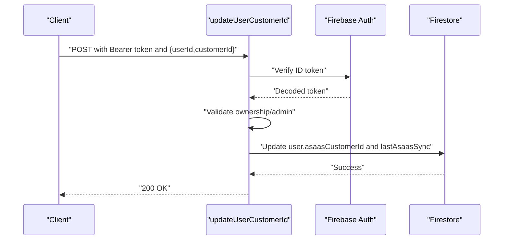
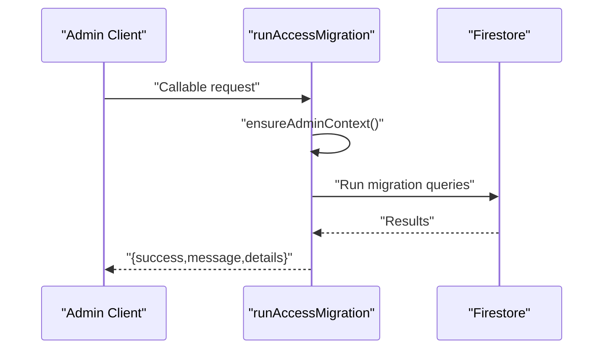
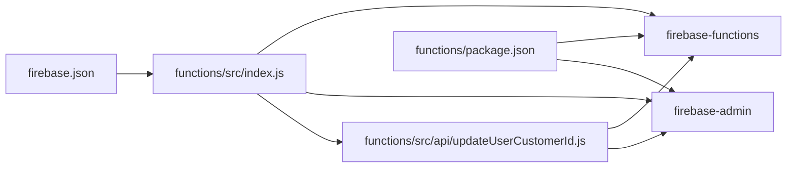

# Cloud Functions

<cite>
**Referenced Files in This Document**
- [functions/src/index.js](file://functions/src/index.js)
- [functions/src/api/updateUserCustomerId.js](file://functions/src/api/updateUserCustomerId.js)
- [firebase.json](file://firebase.json)
- [functions/package.json](file://functions/package.json)
- [functions/README.md](file://functions/README.md)
- [firestore.rules](file://firestore.rules)
- [netlify/functions/check-payment-status.js](file://netlify/functions/check-payment-status.js)
- [netlify/functions/create-asaas-customer.js](file://netlify/functions/create-asaas-customer.js)
- [netlify/functions/process-asaas-payment.js](file://netlify/functions/process-asaas-payment.js)
- [netlify.toml](file://netlify.toml)
</cite>

## Table of Contents
1. [Introduction](#introduction)
2. [Project Structure](#project-structure)
3. [Core Components](#core-components)
4. [Architecture Overview](#architecture-overview)
5. [Detailed Component Analysis](#detailed-component-analysis)
6. [Dependency Analysis](#dependency-analysis)
7. [Performance Considerations](#performance-considerations)
8. [Troubleshooting Guide](#troubleshooting-guide)
9. [Conclusion](#conclusion)
10. [Appendices](#appendices)

## Introduction
This document describes the Firebase Cloud Functions implementation in Fluentoria, focusing on the serverless architecture, function structure, deployment configuration, and API endpoints. It explains how functions are triggered, how event-driven programming is applied, and how they integrate with Firebase services such as Firestore and Authentication. It also covers environment variable management, security and authentication requirements, error handling strategies, scaling and cold start considerations, monitoring approaches, and the development workflow including local testing and debugging.

## Project Structure
The Cloud Functions implementation resides under the functions directory and is organized around two primary concerns:
- HTTP-triggered functions for webhooks and administrative tasks
- An API module for user-related updates

Key files:
- Entry point and function exports: functions/src/index.js
- updateUserCustomerId endpoint: functions/src/api/updateUserCustomerId.js
- Deployment configuration: firebase.json
- Scripts and runtime: functions/package.json
- Function-specific guidance: functions/README.md
- Firestore security rules: firestore.rules
- Supporting Netlify Functions (for comparison and cross-platform context): netlify/functions/*.js
- Netlify build and headers: netlify.toml

**Diagram sources**
- [functions/src/index.js](file://functions/src/index.js#L1-L387)
- [functions/src/api/updateUserCustomerId.js](file://functions/src/api/updateUserCustomerId.js#L1-L74)
- [firebase.json](file://firebase.json#L1-L20)
- [functions/package.json](file://functions/package.json#L1-L25)
- [functions/README.md](file://functions/README.md#L1-L61)

**Section sources**
- [functions/src/index.js](file://functions/src/index.js#L1-L387)
- [functions/src/api/updateUserCustomerId.js](file://functions/src/api/updateUserCustomerId.js#L1-L74)
- [firebase.json](file://firebase.json#L1-L20)
- [functions/package.json](file://functions/package.json#L1-L25)
- [functions/README.md](file://functions/README.md#L1-L61)

## Core Components
This section outlines the primary Cloud Functions and their responsibilities.

- asaasWebhook
  - Purpose: Receives asynchronous notifications from Asaas, validates the webhook token, and updates user access and course enrollment based on payment events.
  - Triggers: HTTPS request (HTTP-triggered function).
  - Key behaviors:
    - Preflight handling for CORS.
    - Signature verification using a stored token.
    - Event-type branching for payment received/confirmed and overdue scenarios.
    - User creation/updating and course mapping via externalReference parsing.
  - Security: Enforces token verification and logs critical misconfigurations.

- updateUserCustomerId
  - Purpose: Updates a user’s Asaas customer identifier in Firestore after verifying the caller’s identity.
  - Triggers: HTTPS request (HTTP-triggered function).
  - Key behaviors:
    - Preflight handling for CORS.
    - ID token verification against Firebase Auth.
    - Ownership/admin checks to ensure only the user or admins can update records.
    - Firestore update with timestamps.

- runAccessMigration (Callable)
  - Purpose: Executes a legacy access migration using Admin SDK, bypassing client-side Firestore rules.
  - Triggers: Callable function.
  - Key behaviors:
    - Validates admin context via the callable context.
    - Performs bulk updates across collections.

- runAccessMigrationHttp (HTTP)
  - Purpose: HTTP-equivalent migration endpoint using explicit Bearer token authentication.
  - Triggers: HTTPS request (HTTP-triggered function).
  - Key behaviors:
    - Preflight handling for CORS.
    - Explicit Bearer token verification.
    - Returns structured errors mapped to HTTP status codes.

**Section sources**
- [functions/src/index.js](file://functions/src/index.js#L144-L387)
- [functions/src/api/updateUserCustomerId.js](file://functions/src/api/updateUserCustomerId.js#L12-L74)

## Architecture Overview
The Cloud Functions architecture follows an event-driven model:
- External events (Asaas webhooks) trigger HTTP functions.
- Functions validate authenticity and extract meaningful data from payloads.
- Functions update Firestore documents and maintain audit trails via timestamps.
- Administrative tasks are executed via callable functions with Admin SDK privileges.

**Diagram sources**
- [functions/src/index.js](file://functions/src/index.js#L144-L339)

**Section sources**
- [functions/src/index.js](file://functions/src/index.js#L144-L339)

## Detailed Component Analysis

### asaasWebhook
- Function signature: HTTP request handler.
- CORS handling: Supports preflight and restricts allowed methods/headers.
- Authentication and security:
  - Requires a webhook token via a dedicated header.
  - Uses constant-time comparison to mitigate timing attacks.
  - Logs critical misconfigurations and rejects requests when secrets are missing.
- Event processing:
  - PAYMENT_RECEIVED/PAYMENT_CONFIRMED: Creates or activates user access and optionally maps course access via externalReference.
  - PAYMENT_OVERDUE: Deactivates course access and, if applicable, global access.
- Data extraction:
  - Parses courseId/productId from externalReference using flexible strategies (JSON, query-like keys, raw string).
- Error handling:
  - Returns appropriate HTTP status codes and logs errors.

**Diagram sources**
- [functions/src/index.js](file://functions/src/index.js#L144-L339)

**Section sources**
- [functions/src/index.js](file://functions/src/index.js#L144-L339)

### updateUserCustomerId
- Function signature: HTTP request handler.
- Authentication:
  - Verifies Authorization header bearer token against Firebase Auth.
  - Ensures the caller is either the user themselves or an administrator.
- Validation:
  - Checks presence of required fields (userId, customerId).
- Side effects:
  - Updates the user document with the Asaas customer ID and a last sync timestamp.
- Error handling:
  - Returns structured errors for missing tokens, invalid tokens, forbidden actions, and internal failures.

**Diagram sources**
- [functions/src/api/updateUserCustomerId.js](file://functions/src/api/updateUserCustomerId.js#L12-L74)

**Section sources**
- [functions/src/api/updateUserCustomerId.js](file://functions/src/api/updateUserCustomerId.js#L12-L74)

### runAccessMigration (Callable) and runAccessMigrationHttp (HTTP)
- runAccessMigration (Callable):
  - Uses Admin SDK to bypass Firestore client rules.
  - Validates admin context from the callable context.
  - Performs bulk migrations across courses, mindful_flow, and music collections.
- runAccessMigrationHttp (HTTP):
  - Accepts explicit Bearer token authentication.
  - Mirrors callable logic but uses HTTP status mapping for errors.

**Diagram sources**
- [functions/src/index.js](file://functions/src/index.js#L344-L356)

**Section sources**
- [functions/src/index.js](file://functions/src/index.js#L344-L387)

## Dependency Analysis
- Internal dependencies:
  - functions/src/index.js imports the updateUserCustomerId handler from functions/src/api/updateUserCustomerId.js.
- External dependencies:
  - firebase-admin and firebase-functions are declared in functions/package.json.
- Deployment configuration:
  - firebase.json defines the functions codebase and ignores for packaging.
- Security and rules:
  - Firestore rules enforce per-collection access policies and admin checks.
- Cross-platform context:
  - Netlify Functions demonstrate similar patterns for JWT verification and external API calls, useful for comparative understanding.

**Diagram sources**
- [functions/src/index.js](file://functions/src/index.js#L1-L387)
- [functions/src/api/updateUserCustomerId.js](file://functions/src/api/updateUserCustomerId.js#L1-L74)
- [firebase.json](file://firebase.json#L1-L20)
- [functions/package.json](file://functions/package.json#L1-L25)

**Section sources**
- [functions/src/index.js](file://functions/src/index.js#L141-L142)
- [functions/package.json](file://functions/package.json#L16-L22)
- [firebase.json](file://firebase.json#L8-L19)

## Performance Considerations
- Cold starts:
  - Keep dependencies minimal and avoid heavy initialization inside the handler.
  - Reuse admin clients across invocations when possible.
- Concurrency and scaling:
  - Cloud Functions automatically scale; design handlers to be stateless.
- Network latency:
  - Minimize outbound calls; batch writes when feasible.
- Monitoring:
  - Use Cloud Logging and Cloud Trace to profile function execution.
- Environment:
  - Pin Node.js runtime to a supported version as configured in functions/package.json.

[No sources needed since this section provides general guidance]

## Troubleshooting Guide
- Webhook token misconfiguration:
  - The webhook handler logs a critical message when the token is missing and returns a 500 error. Ensure the token is set via Firebase Functions config.
- Unauthorized access attempts:
  - Both HTTP and callable migration endpoints return 401/403 for invalid or insufficient credentials.
- CORS issues:
  - Preflight handling sets Access-Control-Allow-* headers; verify client requests include proper headers.
- Firestore permission errors:
  - Callable migration uses Admin SDK to bypass client rules; ensure the caller context is properly validated.
- Local testing:
  - Use Firebase Emulators to test locally; expose endpoints via tunneling for webhook testing.

**Section sources**
- [functions/src/index.js](file://functions/src/index.js#L162-L167)
- [functions/src/index.js](file://functions/src/index.js#L378-L382)
- [functions/README.md](file://functions/README.md#L37-L45)

## Conclusion
Fluentoria’s Cloud Functions implementation leverages Firebase’s serverless platform to handle payment webhooks, user updates, and administrative migrations. The design emphasizes explicit authentication, robust error handling, and clear separation of concerns. By adhering to the outlined deployment and operational practices, teams can maintain secure, scalable, and observable functions that integrate seamlessly with Firebase services and external platforms like Asaas.

[No sources needed since this section summarizes without analyzing specific files]

## Appendices

### API Endpoints
- asaasWebhook
  - Method: POST
  - Headers: Content-Type, X-Asaas-Access-Token (for webhook token)
  - Body: Asaas webhook payload
  - Behavior: Processes payment events and updates user/course access
- updateUserCustomerId
  - Method: POST
  - Headers: Authorization: Bearer <ID_TOKEN>, Content-Type
  - Body: { userId, customerId }
  - Behavior: Updates user’s Asaas customer ID after validation

**Section sources**
- [functions/src/index.js](file://functions/src/index.js#L144-L339)
- [functions/src/api/updateUserCustomerId.js](file://functions/src/api/updateUserCustomerId.js#L12-L74)

### Deployment Configuration
- Functions codebase definition and ignore patterns are configured in firebase.json.
- Scripts for serving, deploying, and viewing logs are defined in functions/package.json.
- Runtime is pinned to Node.js 20.

**Section sources**
- [firebase.json](file://firebase.json#L8-L19)
- [functions/package.json](file://functions/package.json#L6-L11)
- [functions/package.json](file://functions/package.json#L13-L15)

### Environment Variables and Secrets
- Webhook token for signature verification is stored in Firebase Functions config.
- Asaas access token and base URL are referenced by functions (via environment variables) in supporting Netlify Functions for comparison.

**Section sources**
- [functions/src/index.js](file://functions/src/index.js#L162-L167)
- [functions/README.md](file://functions/README.md#L18-L22)
- [netlify/functions/check-payment-status.js](file://netlify/functions/check-payment-status.js#L76-L77)

### Security and Authentication
- ID token verification against Firebase Auth is enforced for user-facing endpoints.
- Admin-only endpoints validate caller roles or emails.
- Firestore rules define fine-grained permissions for users, admins, and collections.

**Section sources**
- [functions/src/api/updateUserCustomerId.js](file://functions/src/api/updateUserCustomerId.js#L29-L45)
- [functions/src/index.js](file://functions/src/index.js#L10-L19)
- [firestore.rules](file://firestore.rules#L10-L21)

### Development Workflow and Local Testing
- Serve locally using Firebase Emulators.
- Expose local endpoints for webhook testing using a tunneling tool.
- Set up webhook URLs pointing to the emulated function.

**Section sources**
- [functions/package.json](file://functions/package.json#L7)
- [functions/README.md](file://functions/README.md#L32-L45)

### Monitoring and Observability
- Use Cloud Functions logs and traces to monitor execution and latency.
- Log critical configuration issues and unexpected conditions.

**Section sources**
- [functions/src/index.js](file://functions/src/index.js#L164-L166)
- [functions/src/index.js](file://functions/src/index.js#L335-L337)