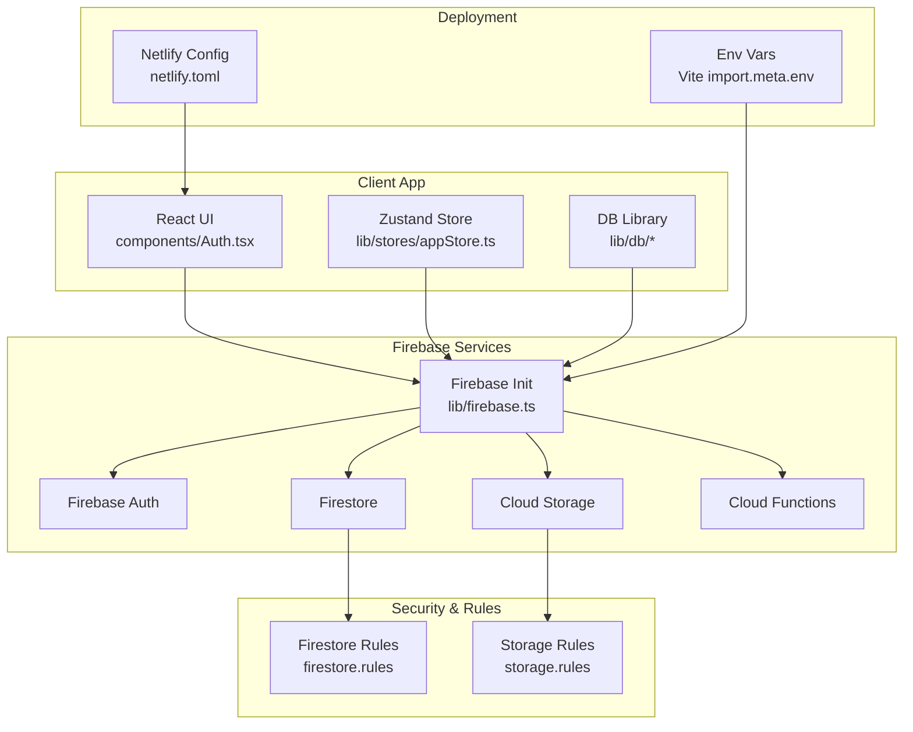
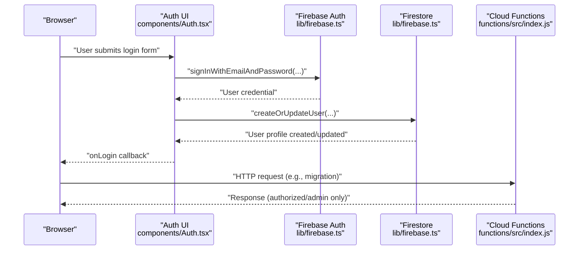
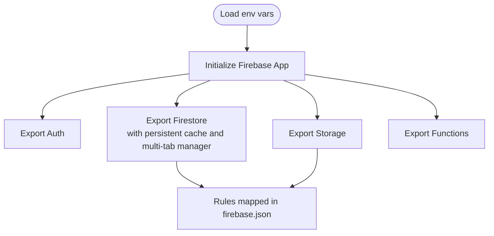
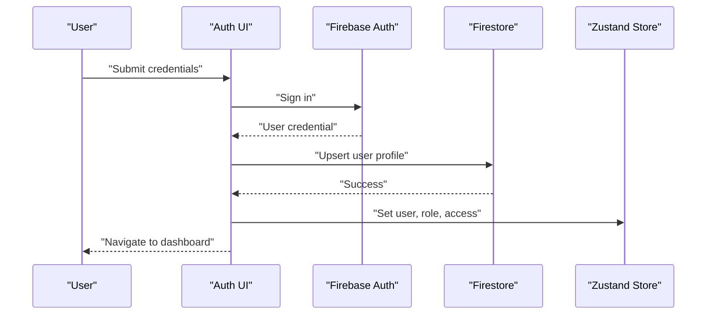
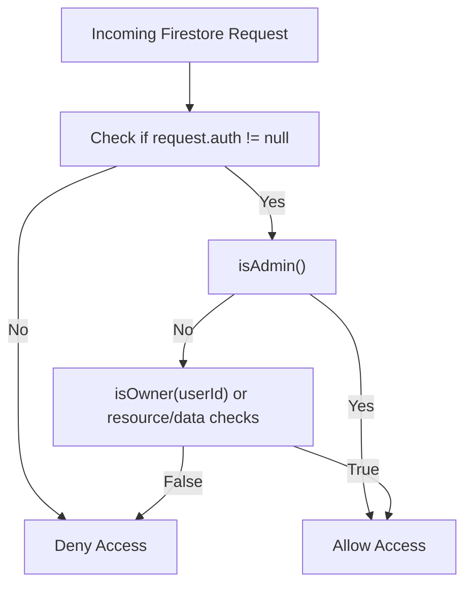
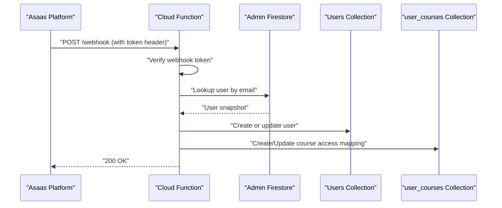
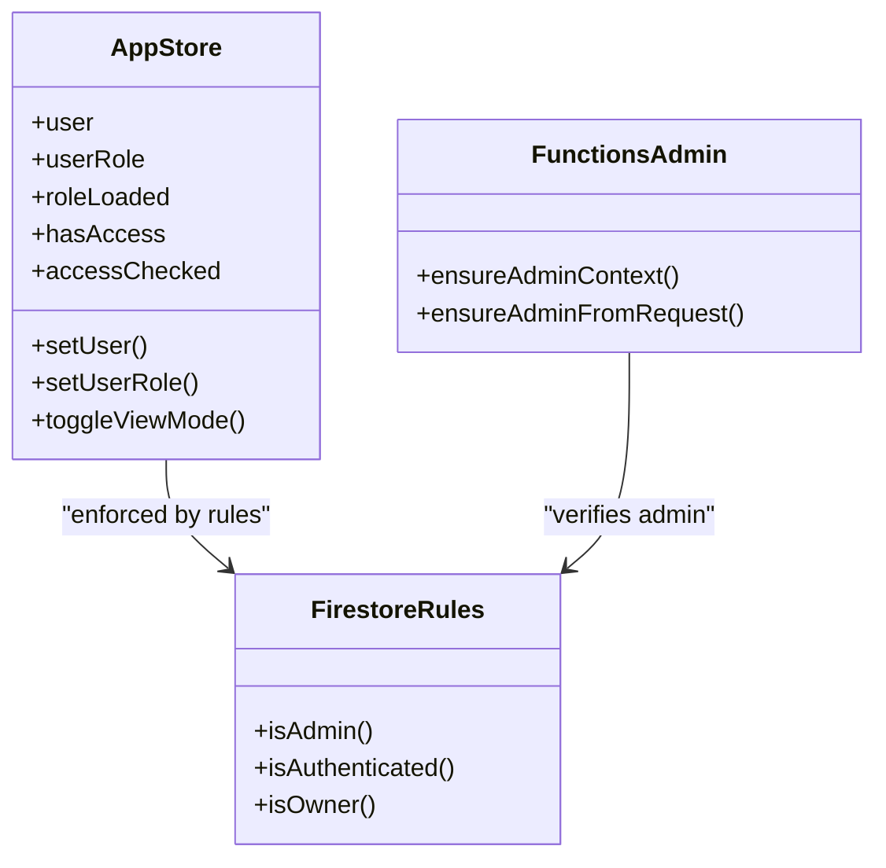
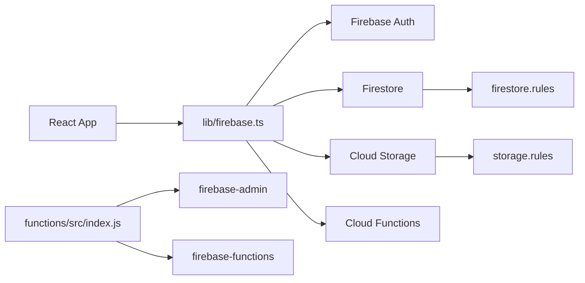

# Firebase Integration

<cite>
**Referenced Files in This Document**
- [lib/firebase.ts](file://lib/firebase.ts)
- [firebase.json](file://firebase.json)
- [firestore.rules](file://firestore.rules)
- [storage.rules](file://storage.rules)
- [functions/src/index.js](file://functions/src/index.js)
- [components/Auth.tsx](file://components/Auth.tsx)
- [netlify.toml](file://netlify.toml)
- [package.json](file://package.json)
- [lib/db/config.ts](file://lib/db/config.ts)
- [lib/db/types.ts](file://lib/db/types.ts)
- [lib/stores/appStore.ts](file://lib/stores/appStore.ts)
</cite>

## Table of Contents
1. [Introduction](#introduction)
2. [Project Structure](#project-structure)
3. [Core Components](#core-components)
4. [Architecture Overview](#architecture-overview)
5. [Detailed Component Analysis](#detailed-component-analysis)
6. [Dependency Analysis](#dependency-analysis)
7. [Performance Considerations](#performance-considerations)
8. [Troubleshooting Guide](#troubleshooting-guide)
9. [Conclusion](#conclusion)
10. [Appendices](#appendices)

## Introduction
This document explains the Firebase integration in Fluentoria, focusing on initialization, authentication, Firestore, Cloud Storage, and Cloud Functions. It also covers security rules, real-time synchronization, offline persistence, multi-tab cache management, environment configuration, deployment settings, and role-based access control.

## Project Structure
Firebase resources are configured and integrated across several areas:
- Initialization and exports are centralized in a single module.
- Security rules define read/write policies for Firestore and Storage.
- Cloud Functions implement server-side logic and webhooks.
- Authentication UI integrates Firebase Auth with Firestore user profiles.
- Environment variables are loaded via Vite’s import.meta.env.
- Netlify configuration supports static hosting and redirects.

**Diagram sources**
- [lib/firebase.ts](file://lib/firebase.ts#L1-L25)
- [components/Auth.tsx](file://components/Auth.tsx#L1-L265)
- [lib/stores/appStore.ts](file://lib/stores/appStore.ts#L1-L82)
- [firestore.rules](file://firestore.rules#L1-L97)
- [storage.rules](file://storage.rules#L1-L11)
- [netlify.toml](file://netlify.toml#L1-L65)

**Section sources**
- [lib/firebase.ts](file://lib/firebase.ts#L1-L25)
- [firebase.json](file://firebase.json#L1-L20)
- [netlify.toml](file://netlify.toml#L1-L65)

## Core Components
- Firebase initialization module exports initialized instances for Auth, Firestore, Storage, and Functions.
- Environment variables are loaded from Vite’s meta environment.
- Firestore is configured with persistent local cache and multi-tab manager for offline and multi-window scenarios.
- Authentication UI handles email/password and Google sign-in, and creates/upserts user profiles in Firestore.
- Cloud Functions implement:
  - Asaas webhook handler for payment events and user/course access updates.
  - Admin-only callable and HTTP endpoints for legacy data migration.
  - Utility helpers to enforce admin-only access and verify tokens.

**Section sources**
- [lib/firebase.ts](file://lib/firebase.ts#L7-L24)
- [components/Auth.tsx](file://components/Auth.tsx#L21-L92)
- [functions/src/index.js](file://functions/src/index.js#L10-L104)
- [functions/src/index.js](file://functions/src/index.js#L344-L387)

## Architecture Overview
The client initializes Firebase and uses Auth for identity, Firestore for structured data, Storage for media, and Functions for server logic. Security rules govern access, while Netlify handles static hosting and redirects.

**Diagram sources**
- [components/Auth.tsx](file://components/Auth.tsx#L21-L60)
- [lib/firebase.ts](file://lib/firebase.ts#L17-L24)
- [functions/src/index.js](file://functions/src/index.js#L358-L387)

## Detailed Component Analysis

### Firebase Initialization and Environment Variables
- Initializes Firebase app with keys from Vite environment variables.
- Exports auth, Firestore with persistent local cache and multi-tab manager, Storage, and Functions.
- firebase.json maps rules and functions codebase.

**Diagram sources**
- [lib/firebase.ts](file://lib/firebase.ts#L7-L24)
- [firebase.json](file://firebase.json#L1-L20)

**Section sources**
- [lib/firebase.ts](file://lib/firebase.ts#L7-L24)
- [firebase.json](file://firebase.json#L1-L20)

### Authentication Flow and User Session Handling
- Supports email/password and Google OAuth sign-in.
- On successful login, creates or updates a Firestore user document.
- Uses Zustand store to track user identity, role, access, and view mode.

**Diagram sources**
- [components/Auth.tsx](file://components/Auth.tsx#L21-L92)
- [lib/stores/appStore.ts](file://lib/stores/appStore.ts#L48-L81)

**Section sources**
- [components/Auth.tsx](file://components/Auth.tsx#L21-L92)
- [lib/stores/appStore.ts](file://lib/stores/appStore.ts#L5-L33)

### Firestore Security Rules and Access Control
- Centralized helpers enforce authenticated access, ownership checks, and admin roles.
- Admin role is determined by a user document field or a predefined email.
- Collections are scoped with granular read/write rules:
  - Users: read allowed; create/update/delete restricted by ownership or admin.
  - Admin-only collections: read/write restricted to admins.
  - Courses, mindful_flow, music: read allowed to authenticated; write restricted to admins.
  - Student progress and activities: read/write allowed for owners or admins.
  - User courses: read allowed for owners or admins; create/update allowed for authenticated; delete restricted to admins.
- Default deny ensures least privilege.

**Diagram sources**
- [firestore.rules](file://firestore.rules#L5-L21)
- [firestore.rules](file://firestore.rules#L23-L94)

**Section sources**
- [firestore.rules](file://firestore.rules#L1-L97)
- [lib/db/config.ts](file://lib/db/config.ts#L1-L19)

### Cloud Storage Security Rules
- Read and write require authenticated users.
- Enforces a 100 MB maximum file size.

**Section sources**
- [storage.rules](file://storage.rules#L1-L11)

### Cloud Functions: Webhooks and Admin Operations
- Asaas webhook endpoint validates a secret token, processes payment events, and updates user and course access.
- Admin-only callable and HTTP endpoints trigger legacy data migration with token verification.
- Utility helpers verify admin context and decode tokens.

**Diagram sources**
- [functions/src/index.js](file://functions/src/index.js#L144-L339)

**Section sources**
- [functions/src/index.js](file://functions/src/index.js#L10-L19)
- [functions/src/index.js](file://functions/src/index.js#L21-L41)
- [functions/src/index.js](file://functions/src/index.js#L144-L339)
- [functions/src/index.js](file://functions/src/index.js#L344-L387)

### Real-time Synchronization, Offline Persistence, and Multi-tab Cache
- Firestore is initialized with persistent local cache and multi-tab manager to enable offline reads/writes and synchronized state across tabs.
- This setup supports real-time listeners and offline-first behavior.

**Section sources**
- [lib/firebase.ts](file://lib/firebase.ts#L18-L22)

### Environment Variable Configuration and Deployment
- Environment variables are loaded via Vite’s import.meta.env and used during Firebase initialization.
- Netlify configuration defines build settings, redirects for SPA routing, and CSP headers for secure resource loading.

**Section sources**
- [lib/firebase.ts](file://lib/firebase.ts#L8-L14)
- [netlify.toml](file://netlify.toml#L1-L65)
- [package.json](file://package.json#L1-L44)

### Role-Based Access Control Implementation
- Admin role is enforced via Firestore rules and verified in Cloud Functions.
- UI controls navigation and view mode based on user role stored in the Zustand store.

**Diagram sources**
- [lib/stores/appStore.ts](file://lib/stores/appStore.ts#L5-L33)
- [firestore.rules](file://firestore.rules#L10-L21)
- [functions/src/index.js](file://functions/src/index.js#L10-L41)

**Section sources**
- [lib/stores/appStore.ts](file://lib/stores/appStore.ts#L67-L78)
- [firestore.rules](file://firestore.rules#L10-L21)
- [functions/src/index.js](file://functions/src/index.js#L10-L41)

## Dependency Analysis
- Client dependencies include Firebase SDK and React ecosystem.
- Cloud Functions depend on firebase-admin and firebase-functions.
- Firestore and Storage rules are enforced server-side and apply to all clients.

**Diagram sources**
- [package.json](file://package.json#L13-L24)
- [functions/src/index.js](file://functions/src/index.js#L1-L6)
- [lib/firebase.ts](file://lib/firebase.ts#L1-L5)
- [firestore.rules](file://firestore.rules#L1-L2)
- [storage.rules](file://storage.rules#L1-L2)

**Section sources**
- [package.json](file://package.json#L13-L24)
- [functions/src/index.js](file://functions/src/index.js#L1-L6)
- [lib/firebase.ts](file://lib/firebase.ts#L1-L5)

## Performance Considerations
- Persistent local cache reduces network usage and improves offline responsiveness.
- Multi-tab manager prevents conflicts across browser tabs.
- Firestore queries and listeners should be scoped to minimize bandwidth and improve perceived performance.
- Cloud Functions should avoid unnecessary writes and leverage batch operations when applicable.

[No sources needed since this section provides general guidance]

## Troubleshooting Guide
- Authentication errors: Review error codes returned by Auth UI and adjust user feedback accordingly.
- Firestore permission denied: Verify user authentication, ownership checks, and admin role in Firestore rules.
- Cloud Functions unauthorized: Confirm admin context verification and token validity.
- Storage upload failures: Ensure file size constraints and authenticated user context.
- Environment variables: Confirm Vite environment variables are present and correctly named.

**Section sources**
- [components/Auth.tsx](file://components/Auth.tsx#L45-L59)
- [firestore.rules](file://firestore.rules#L91-L94)
- [functions/src/index.js](file://functions/src/index.js#L344-L387)
- [storage.rules](file://storage.rules#L6-L8)
- [lib/firebase.ts](file://lib/firebase.ts#L8-L14)

## Conclusion
Fluentoria integrates Firebase Auth, Firestore, Cloud Storage, and Cloud Functions with robust security rules and offline capabilities. Authentication flows seamlessly into Firestore user profiles, while Cloud Functions automate administrative tasks and payment integrations. The system leverages environment variables, Netlify deployment, and role-based access control to maintain a secure, scalable platform.

[No sources needed since this section summarizes without analyzing specific files]

## Appendices

### Firebase Project Structure and Deployment Settings
- firebase.json maps Firestore rules, Storage rules, and Functions codebase.
- Netlify configuration sets build commands, environment, redirects, and CSP headers.

**Section sources**
- [firebase.json](file://firebase.json#L1-L20)
- [netlify.toml](file://netlify.toml#L1-L65)

### Data Model Highlights
- User, Course, Student, and UserCourse types define core entities and relationships.

**Section sources**
- [lib/db/types.ts](file://lib/db/types.ts#L53-L90)