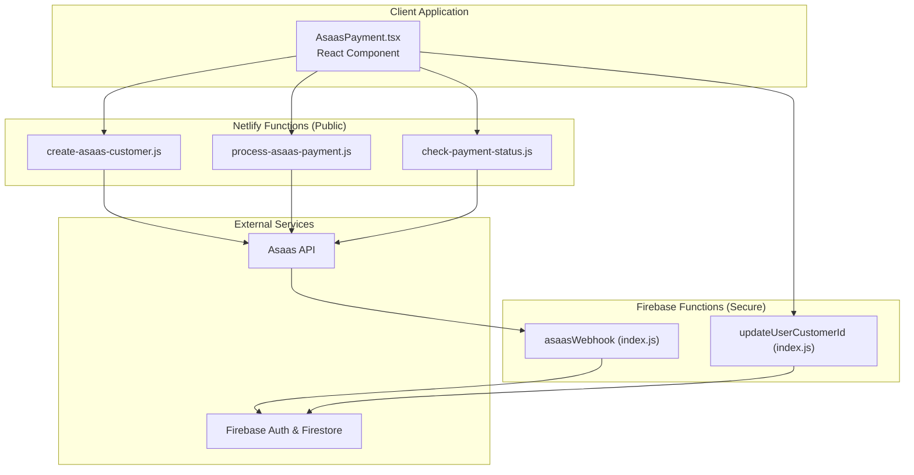
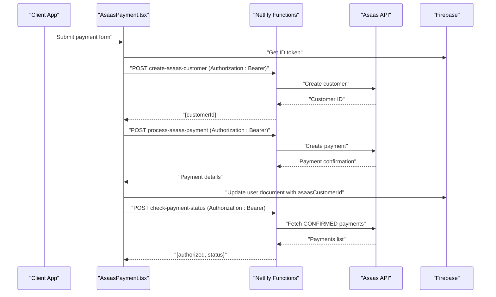
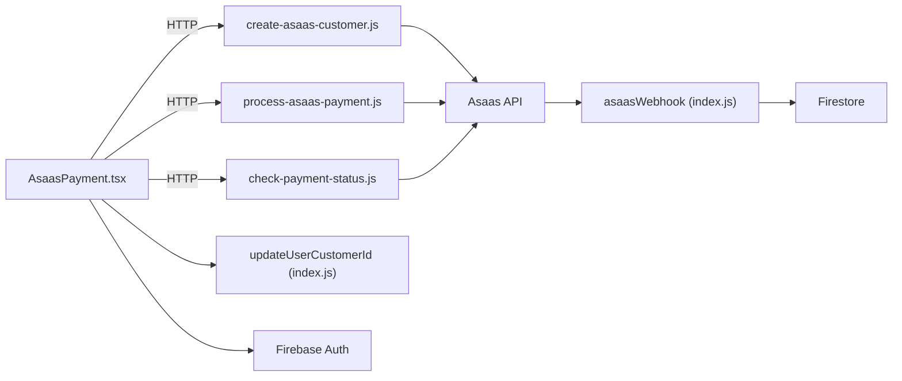

# Payment Processing

<cite>
**Referenced Files in This Document**
- [create-asaas-customer.js](file://netlify/functions/create-asaas-customer.js)
- [process-asaas-payment.js](file://netlify/functions/process-asaas-payment.js)
- [check-payment-status.js](file://netlify/functions/check-payment-status.js)
- [AsaasPayment.tsx](file://components/AsaasPayment.tsx)
- [index.js](file://functions/src/index.js)
- [updateUserCustomerId.js](file://functions/src/api/updateUserCustomerId.js)
- [netlify.toml](file://netlify.toml)
- [package.json](file://package.json)
- [firebase.json](file://firebase.json)
- [firebase.ts](file://lib/firebase.ts)
- [README.md](file://README.md)
- [functions/README.md](file://functions/README.md)
- [test-asass-webhook.js](file://test-asass-webhook.js)
</cite>

## Table of Contents
1. [Introduction](#introduction)
2. [Project Structure](#project-structure)
3. [Core Components](#core-components)
4. [Architecture Overview](#architecture-overview)
5. [Detailed Component Analysis](#detailed-component-analysis)
6. [Dependency Analysis](#dependency-analysis)
7. [Performance Considerations](#performance-considerations)
8. [Troubleshooting Guide](#troubleshooting-guide)
9. [Conclusion](#conclusion)
10. [Appendices](#appendices)

## Introduction
This document describes the payment processing system integrating the Asaas payment provider within the Fluentoria platform. It covers the three-tier workflow: customer creation, payment processing, and payment status checking. It also documents webhook integration patterns, payment status synchronization, subscription management, Netlify Functions deployment, environment variable configuration, API endpoint specifications, error handling strategies, retry mechanisms, payment failure scenarios, security considerations, PCI compliance posture, data encryption, and integration with Firebase for user data updates and access control based on payment status.

## Project Structure
The payment system spans client-side React components, Netlify Functions for public-facing payment operations, and Firebase Functions for secure webhook handling and user data updates.

**Diagram sources**
- [AsaasPayment.tsx](file://components/AsaasPayment.tsx#L86-L244)
- [create-asaas-customer.js](file://netlify/functions/create-asaas-customer.js#L20-L145)
- [process-asaas-payment.js](file://netlify/functions/process-asaas-payment.js#L20-L120)
- [check-payment-status.js](file://netlify/functions/check-payment-status.js#L20-L151)
- [index.js](file://functions/src/index.js#L144-L339)
- [updateUserCustomerId.js](file://functions/src/api/updateUserCustomerId.js#L12-L74)

**Section sources**
- [netlify.toml](file://netlify.toml#L1-L65)
- [firebase.json](file://firebase.json#L1-L20)
- [package.json](file://package.json#L1-L44)

## Core Components
- AsaasPayment React component orchestrates the customer creation, payment submission, and UI feedback.
- Netlify Functions provide public endpoints for customer creation, payment processing, and status checks.
- Firebase Functions handle secure webhook events from Asaas, synchronize user access, and update Firestore records.
- Firebase client SDK is used for authentication and Firestore access in the UI.

Key responsibilities:
- Customer lifecycle: create customer in Asaas via Netlify Function, persist Asaas customer ID in Firebase.
- Payment lifecycle: submit payment via Netlify Function, receive confirmation, and update UI state.
- Status lifecycle: query Asaas for active/overdue payments and derive authorization state.
- Webhook lifecycle: receive Asaas events, update user access and course enrollment accordingly.

**Section sources**
- [AsaasPayment.tsx](file://components/AsaasPayment.tsx#L86-L244)
- [create-asaas-customer.js](file://netlify/functions/create-asaas-customer.js#L64-L133)
- [process-asaas-payment.js](file://netlify/functions/process-asaas-payment.js#L64-L107)
- [check-payment-status.js](file://netlify/functions/check-payment-status.js#L64-L138)
- [index.js](file://functions/src/index.js#L144-L339)
- [firebase.ts](file://lib/firebase.ts#L1-L25)

## Architecture Overview
The system follows a hybrid architecture:
- Public endpoints (Netlify Functions) handle customer creation, payment processing, and status checks with Firebase JWT verification.
- Secure webhook endpoint (Firebase Function) handles Asaas notifications, performs signature verification, and synchronizes user access and course enrollments.

**Diagram sources**
- [AsaasPayment.tsx](file://components/AsaasPayment.tsx#L86-L244)
- [create-asaas-customer.js](file://netlify/functions/create-asaas-customer.js#L64-L133)
- [process-asaas-payment.js](file://netlify/functions/process-asaas-payment.js#L64-L107)
- [check-payment-status.js](file://netlify/functions/check-payment-status.js#L64-L138)
- [firebase.ts](file://lib/firebase.ts#L1-L25)

## Detailed Component Analysis

### AsaasPayment Component
Responsibilities:
- Validates form inputs and formats Brazilian identifiers (CPF, phone).
- Creates a customer in Asaas via a Netlify Function.
- Stores the Asaas customer ID in the user’s Firestore document.
- Submits a payment using the returned customer ID.
- Navigates user through processing, success, and error states.

Key flows:
- Customer creation: Calls the Netlify Function endpoint and expects a customer ID.
- Payment creation: Sends payment data to the Netlify Function endpoint.
- Access control: Uses Firebase Auth to authorize requests and update Firestore.

Security and UX:
- Real-time input formatting for CPF, phone, card number, and expiry date.
- Loading and success/error modals during payment lifecycle.

**Section sources**
- [AsaasPayment.tsx](file://components/AsaasPayment.tsx#L86-L244)

### Netlify Functions: Customer Creation
Endpoint: POST /.netlify/functions/create-asaas-customer
- Verifies Firebase ID token from Authorization header.
- Validates required fields (name, email, cpfCnpj).
- Proxies request to Asaas customers endpoint using access token from environment.
- Returns customer ID and customer data on success.

Error handling:
- Missing/invalid token returns 401.
- Missing fields return 400.
- Asaas errors return mapped HTTP status with error details.
- Internal errors return 500.

Environment variables:
- ASAAS_ACCESS_TOKEN
- ASAAS_API_URL (defaults to sandbox)

CORS and preflight:
- Supports OPTIONS and sets appropriate headers.

**Section sources**
- [create-asaas-customer.js](file://netlify/functions/create-asaas-customer.js#L20-L145)

### Netlify Functions: Payment Processing
Endpoint: POST /.netlify/functions/process-asaas-payment
- Verifies Firebase ID token.
- Proxies payment request to Asaas payments endpoint.
- Returns payment details on success.

Error handling mirrors customer creation.

Environment variables:
- ASAAS_ACCESS_TOKEN
- ASAAS_API_URL

**Section sources**
- [process-asaas-payment.js](file://netlify/functions/process-asaas-payment.js#L20-L120)

### Netlify Functions: Payment Status Checking
Endpoint: POST /.netlify/functions/check-payment-status
- Verifies Firebase ID token.
- Queries Asaas payments for a given customer filtered by CONFIRMED status.
- Computes authorization state: active (has CONFIRMED payment due today or in the future), overdue (has payments but none active), no_payment (no payments at all).
- Returns authorization flag and normalized status.

Error handling:
- Missing customerId returns 400.
- Asaas errors return mapped HTTP status with details.
- Internal errors return 500.

**Section sources**
- [check-payment-status.js](file://netlify/functions/check-payment-status.js#L20-L151)

### Firebase Functions: Asaas Webhook
Endpoint: HTTPS onRequest (asaasWebhook)
- Preflight handling and strict method checks.
- Signature verification using a secret stored in Firebase Functions config.
- Event handling:
  - PAYMENT_RECEIVED/PAYMENT_CONFIRMED: Activate access, set paymentStatus and planStatus to active, and manage course enrollment mapping.
  - PAYMENT_OVERDUE: Deactivate access for specific course or globally depending on course mapping and manual authorization flags.
- Multi-product support via externalReference parsing.

Access control:
- Requires valid webhook token in header X-Asaas-Access-Token.

**Section sources**
- [index.js](file://functions/src/index.js#L144-L339)

### Firebase Functions: Update User Customer ID
Endpoint: HTTPS onRequest (updateUserCustomerId)
- Verifies ID token from Authorization header.
- Allows self-update or admin override.
- Updates Firestore user document with asaasCustomerId and last sync timestamp.

**Section sources**
- [updateUserCustomerId.js](file://functions/src/api/updateUserCustomerId.js#L12-L74)

### Client Integration and Access Control
- The UI uses Firebase Auth to obtain an ID token and passes it to Netlify Functions.
- Firestore rules and security are enforced server-side; the UI reads protected data after access is granted by webhook-driven updates.

**Section sources**
- [firebase.ts](file://lib/firebase.ts#L1-L25)
- [index.js](file://functions/src/index.js#L144-L339)

## Dependency Analysis
External dependencies and integrations:
- Asaas API for customer and payment operations.
- Firebase Authentication and Firestore for user identity and data persistence.
- Netlify Functions runtime for public endpoints.
- Firebase Functions runtime for secure webhook handling.

**Diagram sources**
- [AsaasPayment.tsx](file://components/AsaasPayment.tsx#L86-L244)
- [create-asaas-customer.js](file://netlify/functions/create-asaas-customer.js#L64-L133)
- [process-asaas-payment.js](file://netlify/functions/process-asaas-payment.js#L64-L107)
- [check-payment-status.js](file://netlify/functions/check-payment-status.js#L64-L138)
- [index.js](file://functions/src/index.js#L144-L339)
- [updateUserCustomerId.js](file://functions/src/api/updateUserCustomerId.js#L12-L74)

**Section sources**
- [package.json](file://package.json#L13-L24)
- [netlify.toml](file://netlify.toml#L36-L37)
- [firebase.json](file://firebase.json#L8-L19)

## Performance Considerations
- Minimize synchronous work in functions; rely on external APIs for heavy lifting.
- Cache environment variables at cold start boundaries; avoid repeated parsing.
- Use efficient queries in Firestore (indexed fields) for user lookups and course mappings.
- Consider rate limiting and circuit breakers for Asaas API calls.
- Offload long-running tasks to background jobs if needed.

[No sources needed since this section provides general guidance]

## Troubleshooting Guide
Common issues and resolutions:
- Missing or invalid ID token:
  - Ensure the client obtains a fresh ID token and attaches Authorization: Bearer header.
  - Verify Firebase Auth state and token validity.
- Asaas configuration errors:
  - Confirm ASAAS_ACCESS_TOKEN and ASAAS_API_URL are set in environment.
  - Check sandbox vs production base URLs.
- Webhook signature mismatch:
  - Ensure X-Asaas-Access-Token matches the configured token in Firebase Functions config.
  - Verify webhook URL in Asaas points to the deployed function.
- Payment status discrepancies:
  - Use check-payment-status to verify CONFIRMED payments and due dates.
  - Confirm externalReference mapping for multi-product purchases.
- CORS and preflight failures:
  - Verify Allow-Origin, Allow-Methods, and Allow-Headers headers in functions.
  - Ensure client sends proper preflight OPTIONS requests.

Operational testing:
- Use the provided test script to simulate webhook events locally or against deployed functions.
- Validate Firestore writes and user access flags after webhook reception.

**Section sources**
- [create-asaas-customer.js](file://netlify/functions/create-asaas-customer.js#L43-L62)
- [process-asaas-payment.js](file://netlify/functions/process-asaas-payment.js#L43-L62)
- [check-payment-status.js](file://netlify/functions/check-payment-status.js#L43-L62)
- [index.js](file://functions/src/index.js#L160-L179)
- [test-asass-webhook.js](file://test-asass-webhook.js#L1-L81)

## Conclusion
The payment system integrates Asaas securely and scalably using a clear separation of concerns: public operations via Netlify Functions, secure webhook handling via Firebase Functions, and robust client-side orchestration. The architecture supports multi-product purchases, granular course enrollment mapping, and resilient status synchronization. Proper environment configuration, signature verification, and access control ensure a secure and reliable payment experience.

[No sources needed since this section summarizes without analyzing specific files]

## Appendices

### API Endpoint Specifications
- POST /.netlify/functions/create-asaas-customer
  - Headers: Authorization: Bearer <id_token>, Content-Type: application/json
  - Body: customer fields (name, email, cpfCnpj, phone, mobilePhone, address, addressNumber, province, postalCode)
  - Response: { success: boolean, customerId: string, customer: object }

- POST /.netlify/functions/process-asaas-payment
  - Headers: Authorization: Bearer <id_token>, Content-Type: application/json
  - Body: payment payload compatible with Asaas payments endpoint
  - Response: Asaas payment object

- POST /.netlify/functions/check-payment-status
  - Headers: Authorization: Bearer <id_token>, Content-Type: application/json
  - Body: { customerId: string }
  - Response: { authorized: boolean, status: "no_payment"|"active"|"overdue", payments: array }

- HTTPS onRequest asaasWebhook (Firebase)
  - Method: POST
  - Headers: X-Asaas-Access-Token: <configured_token>
  - Body: Asaas event payload (event, payment, customer)
  - Response: 200 on success, 401 on invalid token, 500 on internal error

- HTTPS onRequest updateUserCustomerId (Firebase)
  - Method: POST
  - Headers: Authorization: Bearer <id_token>, Content-Type: application/json
  - Body: { userId: string, customerId: string }
  - Response: 200 on success, 400/401/403/500 on error

**Section sources**
- [create-asaas-customer.js](file://netlify/functions/create-asaas-customer.js#L20-L145)
- [process-asaas-payment.js](file://netlify/functions/process-asaas-payment.js#L20-L120)
- [check-payment-status.js](file://netlify/functions/check-payment-status.js#L20-L151)
- [index.js](file://functions/src/index.js#L144-L339)
- [updateUserCustomerId.js](file://functions/src/api/updateUserCustomerId.js#L12-L74)

### Environment Variables
- Netlify Functions:
  - ASAAS_ACCESS_TOKEN: Asaas access token
  - ASAAS_API_URL: Asaas base URL (defaults to sandbox)
- Firebase Functions:
  - functions.config().asaas.webhook_token: Webhook signature token
  - FIREBASE_PROJECT_ID: Used for JWT issuer verification

Deployment and configuration:
- Netlify: bundler and redirects configured in netlify.toml
- Firebase: functions codebase defined in firebase.json
- Client: Firebase config loaded from environment variables

**Section sources**
- [create-asaas-customer.js](file://netlify/functions/create-asaas-customer.js#L76-L77)
- [process-asaas-payment.js](file://netlify/functions/process-asaas-payment.js#L67-L68)
- [check-payment-status.js](file://netlify/functions/check-payment-status.js#L76-L77)
- [index.js](file://functions/src/index.js#L162-L167)
- [netlify.toml](file://netlify.toml#L1-L65)
- [firebase.json](file://firebase.json#L8-L19)
- [firebase.ts](file://lib/firebase.ts#L7-L14)

### Security Considerations and PCI Compliance
- Never collect, store, or transmit Primary Account Numbers (PAN) or CVV in your systems.
- Use Asaas-hosted PCI-compliant payment pages or tokens where applicable; the current implementation submits card data via Netlify Functions to Asaas.
- Enforce JWT verification for all public endpoints using Firebase Auth.
- Enable and enforce webhook signature verification with a strong secret.
- Apply CSP headers and secure transport policies in netlify.toml.
- Restrict access to sensitive operations (e.g., admin-only migrations) with role-based checks.

**Section sources**
- [AsaasPayment.tsx](file://components/AsaasPayment.tsx#L130-L181)
- [create-asaas-customer.js](file://netlify/functions/create-asaas-customer.js#L4-L18)
- [process-asaas-payment.js](file://netlify/functions/process-asaas-payment.js#L4-L18)
- [check-payment-status.js](file://netlify/functions/check-payment-status.js#L4-L18)
- [index.js](file://functions/src/index.js#L160-L179)
- [netlify.toml](file://netlify.toml#L39-L47)

### Retry Mechanisms and Failure Scenarios
- Idempotency: Use externalReference in payment creation to deduplicate and reconcile later.
- Retries: Implement exponential backoff for transient Asaas errors; surface actionable messages to users.
- Failures:
  - Token errors: Prompt user to sign in again.
  - Validation errors: Show field-specific messages.
  - Asaas errors: Display friendly messages and suggest retry or contact support.
  - Webhook mismatches: Log and reject unauthorized events; monitor logs for repeated failures.

**Section sources**
- [AsaasPayment.tsx](file://components/AsaasPayment.tsx#L183-L244)
- [create-asaas-customer.js](file://netlify/functions/create-asaas-customer.js#L134-L144)
- [process-asaas-payment.js](file://netlify/functions/process-asaas-payment.js#L109-L120)
- [check-payment-status.js](file://netlify/functions/check-payment-status.js#L140-L151)
- [index.js](file://functions/src/index.js#L160-L179)

### Subscription Management and Access Control
- Payment confirmation activates access and plan status; overdue events deactivate access for specific course or globally.
- Course enrollment mapping is created/updated based on externalReference courseId/productId.
- Manual authorization flags prevent automatic deactivation for admin-managed accounts.

**Section sources**
- [index.js](file://functions/src/index.js#L188-L330)