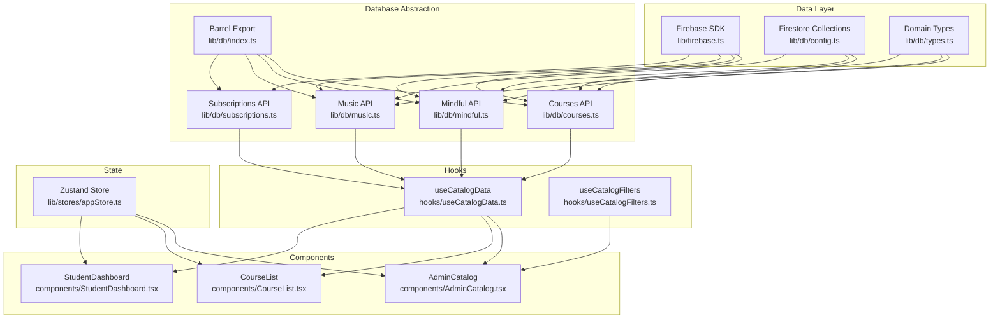
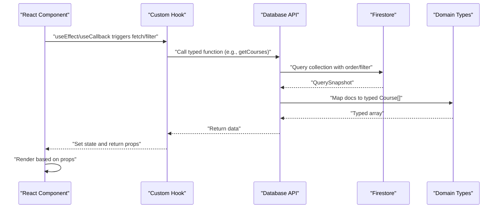
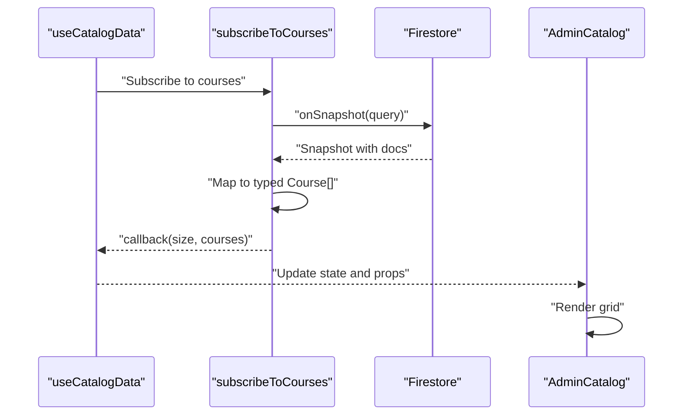
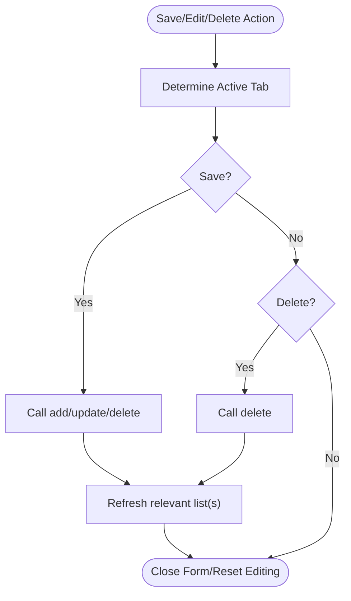
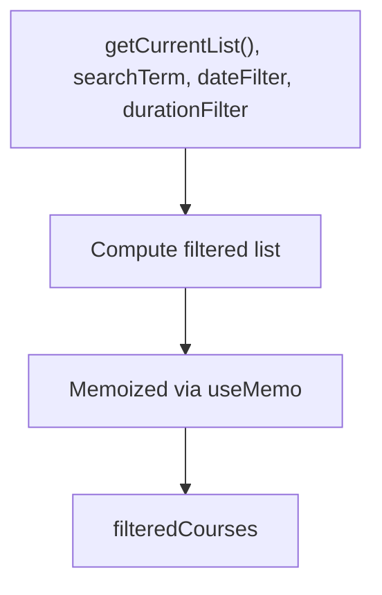
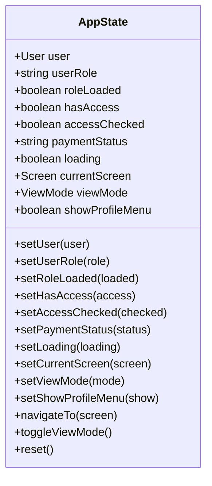
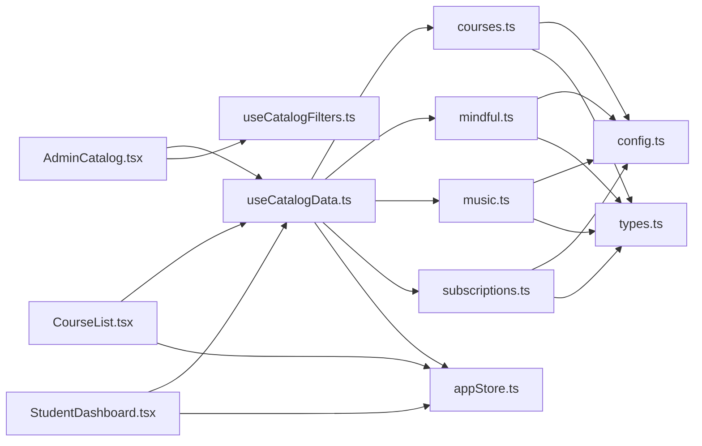

# Data Flow Architecture

<cite>
**Referenced Files in This Document**
- [firebase.ts](file://lib/firebase.ts)
- [types.ts](file://types.ts)
- [db/index.ts](file://lib/db/index.ts)
- [db/config.ts](file://lib/db/config.ts)
- [db/types.ts](file://lib/db/types.ts)
- [db/courses.ts](file://lib/db/courses.ts)
- [db/mindful.ts](file://lib/db/mindful.ts)
- [db/music.ts](file://lib/db/music.ts)
- [db/subscriptions.ts](file://lib/db/subscriptions.ts)
- [hooks/useCatalogData.ts](file://hooks/useCatalogData.ts)
- [hooks/useCatalogFilters.ts](file://hooks/useCatalogFilters.ts)
- [lib/stores/appStore.ts](file://lib/stores/appStore.ts)
- [components/AdminCatalog.tsx](file://components/AdminCatalog.tsx)
- [components/CourseList.tsx](file://components/CourseList.tsx)
- [components/StudentDashboard.tsx](file://components/StudentDashboard.tsx)
</cite>

## Table of Contents
1. [Introduction](#introduction)
2. [Project Structure](#project-structure)
3. [Core Components](#core-components)
4. [Architecture Overview](#architecture-overview)
5. [Detailed Component Analysis](#detailed-component-analysis)
6. [Dependency Analysis](#dependency-analysis)
7. [Performance Considerations](#performance-considerations)
8. [Troubleshooting Guide](#troubleshooting-guide)
9. [Conclusion](#conclusion)

## Introduction
This document describes the data flow architecture of Fluentoria, focusing on the unidirectional data flow from Firebase Firestore through custom hooks and Zustand-based stores to React components. It explains how Firestore documents are fetched, transformed, synchronized, and rendered, along with state management patterns, real-time synchronization, caching, query optimization, and error handling strategies.

## Project Structure
The data flow spans several layers:
- Firebase initialization and persistence configuration
- Database abstraction layer exporting typed CRUD and subscription helpers
- Custom React hooks orchestrating data fetching and transformations
- Zustand store for global UI and auth state
- React components consuming data and driving UI updates

**Diagram sources**
- [firebase.ts](file://lib/firebase.ts#L1-L25)
- [db/config.ts](file://lib/db/config.ts#L11-L19)
- [db/types.ts](file://lib/db/types.ts#L1-L90)
- [db/courses.ts](file://lib/db/courses.ts#L1-L98)
- [db/mindful.ts](file://lib/db/mindful.ts#L1-L93)
- [db/music.ts](file://lib/db/music.ts#L1-L93)
- [db/subscriptions.ts](file://lib/db/subscriptions.ts#L1-L93)
- [db/index.ts](file://lib/db/index.ts#L1-L38)
- [hooks/useCatalogData.ts](file://hooks/useCatalogData.ts#L1-L157)
- [hooks/useCatalogFilters.ts](file://hooks/useCatalogFilters.ts#L1-L86)
- [lib/stores/appStore.ts](file://lib/stores/appStore.ts#L1-L82)
- [components/AdminCatalog.tsx](file://components/AdminCatalog.tsx#L1-L430)
- [components/CourseList.tsx](file://components/CourseList.tsx#L1-L216)
- [components/StudentDashboard.tsx](file://components/StudentDashboard.tsx#L1-L135)

**Section sources**
- [firebase.ts](file://lib/firebase.ts#L1-L25)
- [db/index.ts](file://lib/db/index.ts#L1-L38)
- [hooks/useCatalogData.ts](file://hooks/useCatalogData.ts#L1-L157)
- [hooks/useCatalogFilters.ts](file://hooks/useCatalogFilters.ts#L1-L86)
- [lib/stores/appStore.ts](file://lib/stores/appStore.ts#L1-L82)
- [components/AdminCatalog.tsx](file://components/AdminCatalog.tsx#L1-L430)
- [components/CourseList.tsx](file://components/CourseList.tsx#L1-L216)
- [components/StudentDashboard.tsx](file://components/StudentDashboard.tsx#L1-L135)

## Core Components
- Firebase initialization and persistence: Local cache configured for multi-tab persistence to enable offline-first behavior and reduce redundant network requests.
- Database APIs: Typed functions for CRUD operations and queries per domain (courses, mindful flows, music), plus subscriptions for real-time updates.
- Hooks: Orchestrate fetching, filtering, and form actions; coordinate multiple data sources and maintain component-local state.
- Zustand store: Global state for auth, navigation, UI flags, and view mode toggling.
- Components: Consume data from hooks and store, render lists and details, and trigger actions.

Key implementation references:
- Firebase initialization and cache: [lib/firebase.ts](file://lib/firebase.ts#L16-L22)
- Domain types: [lib/db/types.ts](file://lib/db/types.ts#L36-L51)
- CRUD and user-scoped queries: [lib/db/courses.ts](file://lib/db/courses.ts#L8-L97), [lib/db/mindful.ts](file://lib/db/mindful.ts#L8-L92), [lib/db/music.ts](file://lib/db/music.ts#L8-L92)
- Real-time subscriptions: [lib/db/subscriptions.ts](file://lib/db/subscriptions.ts#L6-L92)
- Catalog hook orchestration: [hooks/useCatalogData.ts](file://hooks/useCatalogData.ts#L20-L156)
- Filtering logic: [hooks/useCatalogFilters.ts](file://hooks/useCatalogFilters.ts#L28-L63)
- Global store: [lib/stores/appStore.ts](file://lib/stores/appStore.ts#L48-L81)
- Component consumers: [components/AdminCatalog.tsx](file://components/AdminCatalog.tsx#L37-L253), [components/CourseList.tsx](file://components/CourseList.tsx#L17-L32), [components/StudentDashboard.tsx](file://components/StudentDashboard.tsx#L16-L43)

**Section sources**
- [firebase.ts](file://lib/firebase.ts#L16-L22)
- [db/types.ts](file://lib/db/types.ts#L36-L51)
- [db/courses.ts](file://lib/db/courses.ts#L8-L97)
- [db/mindful.ts](file://lib/db/mindful.ts#L8-L92)
- [db/music.ts](file://lib/db/music.ts#L8-L92)
- [db/subscriptions.ts](file://lib/db/subscriptions.ts#L6-L92)
- [hooks/useCatalogData.ts](file://hooks/useCatalogData.ts#L20-L156)
- [hooks/useCatalogFilters.ts](file://hooks/useCatalogFilters.ts#L28-L63)
- [lib/stores/appStore.ts](file://lib/stores/appStore.ts#L48-L81)
- [components/AdminCatalog.tsx](file://components/AdminCatalog.tsx#L37-L253)
- [components/CourseList.tsx](file://components/CourseList.tsx#L17-L32)
- [components/StudentDashboard.tsx](file://components/StudentDashboard.tsx#L16-L43)

## Architecture Overview
The system follows a unidirectional data flow:
- Data originates from Firestore collections.
- Database APIs transform documents into domain types.
- Hooks fetch and optionally subscribe to data, applying filters and coordinating CRUD operations.
- Components receive derived props and dispatch actions.
- Zustand manages global UI and auth state, while hooks manage component-local state.

**Diagram sources**
- [hooks/useCatalogData.ts](file://hooks/useCatalogData.ts#L30-L59)
- [db/courses.ts](file://lib/db/courses.ts#L8-L17)
- [db/types.ts](file://lib/db/types.ts#L36-L51)
- [components/AdminCatalog.tsx](file://components/AdminCatalog.tsx#L37-L70)

## Detailed Component Analysis

### Firestore Initialization and Caching
- Initializes Firebase app and Firestore with persistent local cache and multi-tab manager for offline-first behavior.
- Ensures consistent client-side cache across tabs and reduces network usage.

Implementation references:
- [lib/firebase.ts](file://lib/firebase.ts#L16-L22)

**Section sources**
- [firebase.ts](file://lib/firebase.ts#L16-L22)

### Database Abstraction and Typed Data
- Centralized exports for CRUD and subscriptions.
- Typed domain model for courses and related entities.
- Collection names and admin utilities.

Implementation references:
- [lib/db/index.ts](file://lib/db/index.ts#L1-L38)
- [lib/db/config.ts](file://lib/db/config.ts#L11-L19)
- [lib/db/types.ts](file://lib/db/types.ts#L36-L51)

**Section sources**
- [db/index.ts](file://lib/db/index.ts#L1-L38)
- [db/config.ts](file://lib/db/config.ts#L11-L19)
- [db/types.ts](file://lib/db/types.ts#L36-L51)

### Real-Time Subscriptions and Synchronization
- Subscriptions to counts and recent completions with onSnapshot listeners.
- Fetch-and-merge pattern enriches completion records with related document data.

Implementation references:
- [lib/db/subscriptions.ts](file://lib/db/subscriptions.ts#L6-L92)

**Diagram sources**
- [hooks/useCatalogData.ts](file://hooks/useCatalogData.ts#L51-L59)
- [db/subscriptions.ts](file://lib/db/subscriptions.ts#L15-L23)
- [components/AdminCatalog.tsx](file://components/AdminCatalog.tsx#L224-L232)

**Section sources**
- [db/subscriptions.ts](file://lib/db/subscriptions.ts#L6-L92)
- [hooks/useCatalogData.ts](file://hooks/useCatalogData.ts#L51-L59)
- [components/AdminCatalog.tsx](file://components/AdminCatalog.tsx#L224-L232)

### Catalog Data Hook: Fetching, Editing, Deleting
- Manages active tab, lists for courses/mindful/music, and form/view states.
- Delegates to typed database functions and refreshes lists after mutations.
- Handles gallery merging logic during save.

Implementation references:
- [hooks/useCatalogData.ts](file://hooks/useCatalogData.ts#L20-L156)

**Diagram sources**
- [hooks/useCatalogData.ts](file://hooks/useCatalogData.ts#L69-L126)

**Section sources**
- [hooks/useCatalogData.ts](file://hooks/useCatalogData.ts#L20-L156)

### Catalog Filters Hook: Search and Duration
- Implements search term filtering and dropdown-driven date/duration filters.
- Uses memoization to avoid unnecessary recomputation.

Implementation references:
- [hooks/useCatalogFilters.ts](file://hooks/useCatalogFilters.ts#L28-L63)

**Diagram sources**
- [hooks/useCatalogFilters.ts](file://hooks/useCatalogFilters.ts#L28-L63)

**Section sources**
- [hooks/useCatalogFilters.ts](file://hooks/useCatalogFilters.ts#L28-L63)

### Zustand Store: Global State Coordination
- Provides user, role, access, payment status, navigation, and UI flags.
- Includes navigation and view-mode toggling actions.

Implementation references:
- [lib/stores/appStore.ts](file://lib/stores/appStore.ts#L48-L81)

**Diagram sources**
- [lib/stores/appStore.ts](file://lib/stores/appStore.ts#L5-L33)

**Section sources**
- [lib/stores/appStore.ts](file://lib/stores/appStore.ts#L48-L81)

### Components: Consumers and Renderers
- AdminCatalog composes useCatalogData and useCatalogFilters to render grids and forms.
- CourseList fetches user-scoped course lists and renders cards.
- StudentDashboard loads progress periodically and renders stats.

Implementation references:
- [components/AdminCatalog.tsx](file://components/AdminCatalog.tsx#L37-L253)
- [components/CourseList.tsx](file://components/CourseList.tsx#L17-L32)
- [components/StudentDashboard.tsx](file://components/StudentDashboard.tsx#L16-L43)

**Section sources**
- [components/AdminCatalog.tsx](file://components/AdminCatalog.tsx#L37-L253)
- [components/CourseList.tsx](file://components/CourseList.tsx#L17-L32)
- [components/StudentDashboard.tsx](file://components/StudentDashboard.tsx#L16-L43)

## Dependency Analysis
- Hooks depend on database APIs and types.
- Components depend on hooks and store.
- Database APIs depend on Firebase and collection constants.
- Store depends on types and Firebase auth for user context.

**Diagram sources**
- [components/AdminCatalog.tsx](file://components/AdminCatalog.tsx#L19-L54)
- [components/CourseList.tsx](file://components/CourseList.tsx#L1-L10)
- [components/StudentDashboard.tsx](file://components/StudentDashboard.tsx#L1-L10)
- [hooks/useCatalogData.ts](file://hooks/useCatalogData.ts#L1-L16)
- [hooks/useCatalogFilters.ts](file://hooks/useCatalogFilters.ts#L1-L2)
- [db/courses.ts](file://lib/db/courses.ts#L1-L6)
- [db/mindful.ts](file://lib/db/mindful.ts#L1-L6)
- [db/music.ts](file://lib/db/music.ts#L1-L6)
- [db/subscriptions.ts](file://lib/db/subscriptions.ts#L1-L4)
- [db/config.ts](file://lib/db/config.ts#L11-L19)
- [db/types.ts](file://lib/db/types.ts#L1-L9)
- [lib/stores/appStore.ts](file://lib/stores/appStore.ts#L1-L4)

**Section sources**
- [components/AdminCatalog.tsx](file://components/AdminCatalog.tsx#L19-L54)
- [components/CourseList.tsx](file://components/CourseList.tsx#L1-L10)
- [components/StudentDashboard.tsx](file://components/StudentDashboard.tsx#L1-L10)
- [hooks/useCatalogData.ts](file://hooks/useCatalogData.ts#L1-L16)
- [hooks/useCatalogFilters.ts](file://hooks/useCatalogFilters.ts#L1-L2)
- [db/courses.ts](file://lib/db/courses.ts#L1-L6)
- [db/mindful.ts](file://lib/db/mindful.ts#L1-L6)
- [db/music.ts](file://lib/db/music.ts#L1-L6)
- [db/subscriptions.ts](file://lib/db/subscriptions.ts#L1-L4)
- [db/config.ts](file://lib/db/config.ts#L11-L19)
- [db/types.ts](file://lib/db/types.ts#L1-L9)
- [lib/stores/appStore.ts](file://lib/stores/appStore.ts#L1-L4)

## Performance Considerations
- Pagination and limits: Use Firestore query limits for recent completion feeds to cap payload sizes.
- Filtering: Apply server-side ordering and where clauses where feasible; client-side filters are acceptable for small datasets.
- Batch operations: Group writes where possible; avoid frequent small writes in hot loops.
- Caching: Leverage persistent local cache to minimize network usage and improve perceived performance.
- Debouncing: Debounce search inputs to reduce re-computation and network churn.
- Memoization: Keep computed lists memoized to prevent unnecessary renders.
- Real-time vs polling: Prefer onSnapshot for live updates; fallback to periodic polling only when necessary.

[No sources needed since this section provides general guidance]

## Troubleshooting Guide
- Error handling in data fetching: Database APIs log errors and return safe defaults (empty arrays). Ensure callers handle empty results gracefully.
- Access control: Admin-only operations throw if unauthorized; verify roles before mutating data.
- Real-time subscription errors: Subscription callbacks log errors; confirm Firestore rules and listener cleanup.
- UI state resets: Use hook-provided actions to reset forms and editing state after mutations.

Implementation references:
- [lib/db/courses.ts](file://lib/db/courses.ts#L13-L16)
- [lib/db/mindful.ts](file://lib/db/mindful.ts#L13-L16)
- [lib/db/music.ts](file://lib/db/music.ts#L13-L16)
- [lib/db/subscriptions.ts](file://lib/db/subscriptions.ts#L10-L12)
- [hooks/useCatalogData.ts](file://hooks/useCatalogData.ts#L69-L126)

**Section sources**
- [db/courses.ts](file://lib/db/courses.ts#L13-L16)
- [db/mindful.ts](file://lib/db/mindful.ts#L13-L16)
- [db/music.ts](file://lib/db/music.ts#L13-L16)
- [db/subscriptions.ts](file://lib/db/subscriptions.ts#L10-L12)
- [hooks/useCatalogData.ts](file://hooks/useCatalogData.ts#L69-L126)

## Conclusion
Fluentoria’s data flow is structured around typed Firestore abstractions, custom hooks for orchestration, and a Zustand store for global state. Real-time synchronization complements cached reads, while filtering and memoization keep rendering efficient. The architecture supports admin and student views, with clear separation of concerns enabling maintainability and scalability.