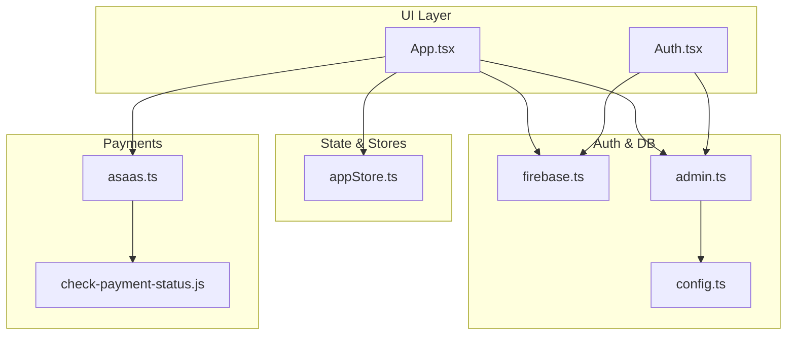
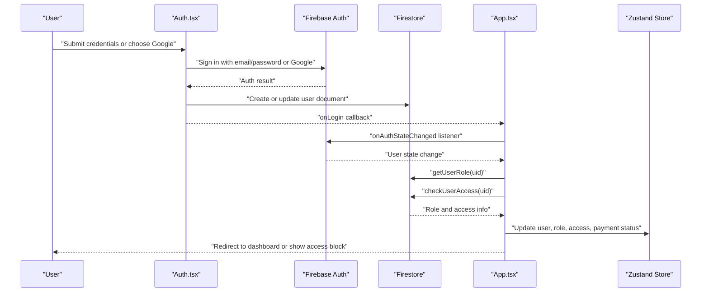
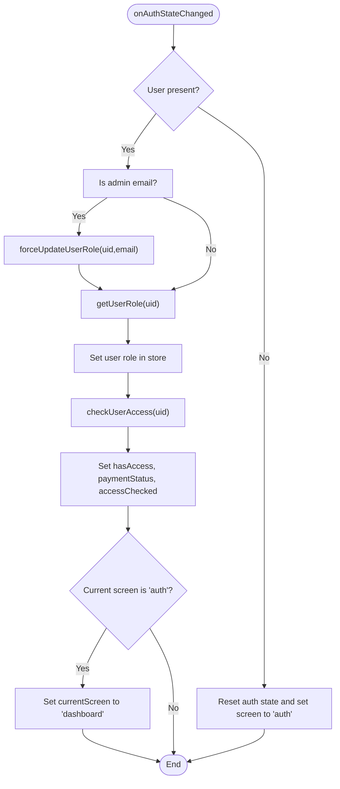
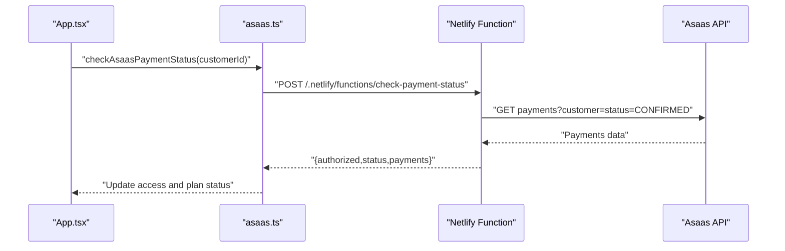
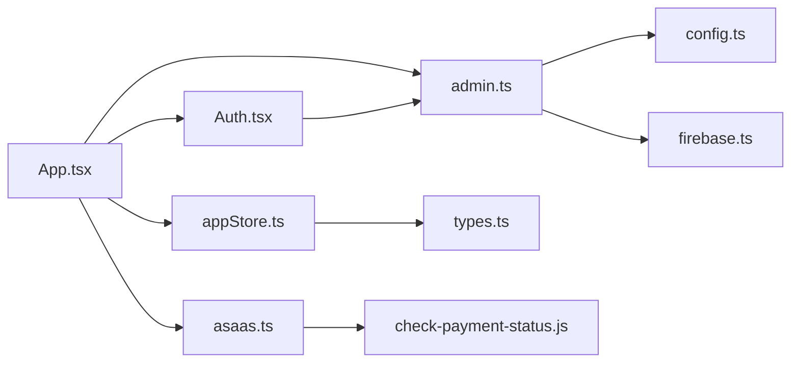

# Authentication & Access Control

<cite>
**Referenced Files in This Document**
- [App.tsx](file://App.tsx)
- [Auth.tsx](file://components/Auth.tsx)
- [firebase.ts](file://lib/firebase.ts)
- [admin.ts](file://lib/db/admin.ts)
- [config.ts](file://lib/db/config.ts)
- [appStore.ts](file://lib/stores/appStore.ts)
- [check-payment-status.js](file://netlify/functions/check-payment-status.js)
- [students.ts](file://lib/db/students.ts)
- [asaas.ts](file://lib/db/asaas.ts)
- [types.ts](file://types.ts)
</cite>

## Table of Contents
1. [Introduction](#introduction)
2. [Project Structure](#project-structure)
3. [Core Components](#core-components)
4. [Architecture Overview](#architecture-overview)
5. [Detailed Component Analysis](#detailed-component-analysis)
6. [Dependency Analysis](#dependency-analysis)
7. [Performance Considerations](#performance-considerations)
8. [Troubleshooting Guide](#troubleshooting-guide)
9. [Conclusion](#conclusion)

## Introduction
This document explains the authentication and access control system for the Fluentoria application. It covers how Firebase Authentication is integrated with onAuthStateChanged for real-time monitoring, how user roles are detected and enforced, and how access is validated against payment status and course enrollment. It documents the admin email detection system, role enforcement, and the blocking mechanism for unauthorized users. It also describes Firestore integration for user data retrieval, authentication state persistence across page reloads, logout handling, security considerations, error handling during authentication failures, and seamless transitions between authenticated and unauthenticated states.

## Project Structure
The authentication and access control logic spans several modules:
- Firebase initialization and persistence
- Authentication UI and flows
- Real-time auth state monitoring and role/access checks
- Firestore-backed user roles and access control
- Payment status integration via Netlify Functions and Asaas
- Global state management for auth and access

**Diagram sources**
- [App.tsx](file://App.tsx#L25-L108)
- [Auth.tsx](file://components/Auth.tsx#L1-L265)
- [firebase.ts](file://lib/firebase.ts#L1-L25)
- [admin.ts](file://lib/db/admin.ts#L1-L307)
- [config.ts](file://lib/db/config.ts#L1-L19)
- [appStore.ts](file://lib/stores/appStore.ts#L1-L82)
- [asaas.ts](file://lib/db/asaas.ts#L1-L129)
- [check-payment-status.js](file://netlify/functions/check-payment-status.js#L1-L152)

**Section sources**
- [App.tsx](file://App.tsx#L1-L449)
- [Auth.tsx](file://components/Auth.tsx#L1-L265)
- [firebase.ts](file://lib/firebase.ts#L1-L25)
- [admin.ts](file://lib/db/admin.ts#L1-L307)
- [config.ts](file://lib/db/config.ts#L1-L19)
- [appStore.ts](file://lib/stores/appStore.ts#L1-L82)
- [asaas.ts](file://lib/db/asaas.ts#L1-L129)
- [check-payment-status.js](file://netlify/functions/check-payment-status.js#L1-L152)

## Core Components
- Firebase initialization and persistence: Initializes Firebase app, auth, Firestore with multi-tab persistence, and exposes auth/db instances.
- Authentication UI: Provides email/password and Google OAuth login flows, error handling, and user creation/update in Firestore.
- Real-time auth monitoring: Uses onAuthStateChanged to hydrate user, role, and access state; enforces admin role for admin emails; redirects to dashboard after login; blocks unauthorized users.
- Role and access control: Determines role from Firestore; checks access via accessAuthorized flag or active course enrollment; supports admin override.
- Admin email detection: Centralized admin email lists and helpers; forces admin role for matching emails; manages admin email lists.
- Payment integration: Calls Netlify Function to check Asaas payment status; updates access and plan status accordingly.
- Global state: Zustand store tracks user, role, access, payment status, navigation, and view mode.

**Section sources**
- [firebase.ts](file://lib/firebase.ts#L1-L25)
- [Auth.tsx](file://components/Auth.tsx#L1-L265)
- [App.tsx](file://App.tsx#L65-L108)
- [admin.ts](file://lib/db/admin.ts#L66-L127)
- [config.ts](file://lib/db/config.ts#L1-L19)
- [asaas.ts](file://lib/db/asaas.ts#L1-L129)
- [appStore.ts](file://lib/stores/appStore.ts#L1-L82)

## Architecture Overview
The authentication and access control architecture integrates Firebase Authentication with Firestore-backed user roles and access flags. It leverages onAuthStateChanged for real-time state updates, ensures admin privileges for designated emails, validates access via payment status and course enrollment, and enforces a blocking UI for unauthorized users.

**Diagram sources**
- [Auth.tsx](file://components/Auth.tsx#L21-L92)
- [firebase.ts](file://lib/firebase.ts#L1-L25)
- [admin.ts](file://lib/db/admin.ts#L24-L83)
- [App.tsx](file://App.tsx#L65-L108)
- [appStore.ts](file://lib/stores/appStore.ts#L48-L81)

## Detailed Component Analysis

### Firebase Initialization and Persistence
- Initializes Firebase app and exports auth, Firestore with multi-tab local cache, storage, and Cloud Functions.
- Ensures authentication state persists across tabs and page reloads via Firestore local cache configuration.

**Section sources**
- [firebase.ts](file://lib/firebase.ts#L1-L25)

### Authentication UI and Flows
- Email/password login and registration:
  - Validates form inputs and calls Firebase Auth APIs.
  - On registration, sets display name and creates/updates user in Firestore.
  - Maps Firebase error codes to user-friendly messages.
- Google OAuth login:
  - Uses popup provider with explicit account selection.
  - Merges Google user data into Firestore and triggers onLogin.
- Error handling:
  - Catches and displays localized error messages for common auth failures.
  - Handles popup-closed and popup-blocked scenarios.

**Section sources**
- [Auth.tsx](file://components/Auth.tsx#L21-L92)

### Real-Time Authentication Monitoring and Access Control
- onAuthStateChanged listener:
  - On user presence: forces admin role for admin emails, loads role and access, sets payment status, and redirects to dashboard if currently on auth.
  - On user absence: resets state and routes to auth screen.
- Access enforcement:
  - Blocks unauthorized users (non-admins) who lack access authorization or active courses.
  - Renders a dedicated access-pending UI with logout option.

**Diagram sources**
- [App.tsx](file://App.tsx#L65-L108)
- [admin.ts](file://lib/db/admin.ts#L129-L165)
- [admin.ts](file://lib/db/admin.ts#L66-L83)
- [admin.ts](file://lib/db/admin.ts#L85-L127)

**Section sources**
- [App.tsx](file://App.tsx#L65-L108)
- [App.tsx](file://App.tsx#L175-L238)

### Role Detection and Management
- Role determination:
  - getUserRole reads role from Firestore user document.
  - Default fallback to student if user not found.
- Admin enforcement:
  - forceUpdateUserRole updates role based on admin email list; ensures admin display name if missing.
  - requireAdmin guards sensitive admin operations by verifying role or primary admin email.
- Admin email management:
  - Centralized constants and helpers for admin detection and primary admin.
  - getAdminEmails aggregates existing admins and pending admin emails.

**Section sources**
- [admin.ts](file://lib/db/admin.ts#L66-L83)
- [admin.ts](file://lib/db/admin.ts#L129-L165)
- [admin.ts](file://lib/db/admin.ts#L207-L239)
- [config.ts](file://lib/db/config.ts#L1-L19)

### Access Control Validation
- Access rules:
  - Admins always authorized.
  - Students authorized if accessAuthorized flag is true OR they have at least one active course.
  - Payment status returned for UI display.
- Unauthorized user blocking:
  - When accessChecked is true and hasAccess is false and role is not admin, renders an access-pending screen with logout.

**Section sources**
- [admin.ts](file://lib/db/admin.ts#L85-L127)
- [App.tsx](file://App.tsx#L175-L238)

### Admin Email Detection System
- Primary admin and secondary admin lists are centrally managed.
- Case-insensitive admin detection and primary admin checks.
- Admin email lists include existing admin users and pending entries.

**Section sources**
- [config.ts](file://lib/db/config.ts#L1-L19)
- [admin.ts](file://lib/db/admin.ts#L207-L239)

### User Role Enforcement and Blocking Mechanism
- Enforcement:
  - Admin emails are forced to admin role on login.
  - requireAdmin ensures only admins can perform privileged actions.
- Blocking:
  - Unauthorized non-admin users are shown an access-pending screen until authorized or paid.

**Section sources**
- [App.tsx](file://App.tsx#L65-L108)
- [admin.ts](file://lib/db/admin.ts#L7-L22)
- [App.tsx](file://App.tsx#L175-L238)

### Firestore Integration for User Data Retrieval
- User creation/update:
  - createOrUpdateUser writes user document with role, access flags, and payment status; merges with existing student records for Google sign-in.
- Role and access queries:
  - getUserRole and checkUserAccess read from Firestore users collection.
- Student management:
  - findAndMergeStudentByEmail merges Google user data into existing student records.

**Section sources**
- [admin.ts](file://lib/db/admin.ts#L24-L64)
- [admin.ts](file://lib/db/admin.ts#L66-L83)
- [admin.ts](file://lib/db/admin.ts#L85-L127)
- [students.ts](file://lib/db/students.ts#L110-L144)

### Authentication State Persistence Across Page Reloads
- Firestore local cache with multi-tab manager enables offline persistence and cross-tab synchronization.
- onAuthStateChanged runs on mount and updates state, ensuring continuity after reloads.

**Section sources**
- [firebase.ts](file://lib/firebase.ts#L18-L22)
- [App.tsx](file://App.tsx#L65-L108)

### Logout Handling
- handleLogout invokes Firebase Auth signOut.
- UI logout button triggers handleLogout and closes profile menu.

**Section sources**
- [App.tsx](file://App.tsx#L155-L161)

### Payment Status Checking and Access Authorization
- Frontend payment check:
  - asaas.ts calls Netlify Function to verify Asaas customer payments and returns authorized status and payment state.
- Backend payment verification:
  - check-payment-status.js validates Firebase ID token, queries Asaas API for confirmed payments, and returns status.
- Access updates:
  - Payment status influences access authorization and plan status.

**Diagram sources**
- [asaas.ts](file://lib/db/asaas.ts#L6-L33)
- [check-payment-status.js](file://netlify/functions/check-payment-status.js#L20-L151)

**Section sources**
- [asaas.ts](file://lib/db/asaas.ts#L6-L33)
- [check-payment-status.js](file://netlify/functions/check-payment-status.js#L20-L151)

### Global State Management
- Zustand store holds user, role, access flags, payment status, loading state, navigation, and view mode.
- Actions manage state transitions and enforce admin-only view toggling.

**Section sources**
- [appStore.ts](file://lib/stores/appStore.ts#L1-L82)
- [App.tsx](file://App.tsx#L42-L61)

## Dependency Analysis
Key dependencies and interactions:
- App.tsx depends on Firebase auth and Firestore, and on DB functions for role and access checks.
- Auth.tsx depends on Firebase Auth and DB user creation/update.
- DB admin module centralizes role and access logic and admin email management.
- Netlify Function depends on Asaas API and Firebase JWT verification.
- Zustand store coordinates UI state and auth/access state.

**Diagram sources**
- [App.tsx](file://App.tsx#L25-L108)
- [Auth.tsx](file://components/Auth.tsx#L1-L265)
- [admin.ts](file://lib/db/admin.ts#L1-L307)
- [config.ts](file://lib/db/config.ts#L1-L19)
- [firebase.ts](file://lib/firebase.ts#L1-L25)
- [appStore.ts](file://lib/stores/appStore.ts#L1-L82)
- [types.ts](file://types.ts#L1-L125)
- [asaas.ts](file://lib/db/asaas.ts#L1-L129)
- [check-payment-status.js](file://netlify/functions/check-payment-status.js#L1-L152)

**Section sources**
- [App.tsx](file://App.tsx#L25-L108)
- [admin.ts](file://lib/db/admin.ts#L1-L307)
- [config.ts](file://lib/db/config.ts#L1-L19)
- [firebase.ts](file://lib/firebase.ts#L1-L25)
- [appStore.ts](file://lib/stores/appStore.ts#L1-L82)
- [asaas.ts](file://lib/db/asaas.ts#L1-L129)
- [check-payment-status.js](file://netlify/functions/check-payment-status.js#L1-L152)

## Performance Considerations
- Local cache and multi-tab persistence reduce network usage and improve responsiveness after reloads.
- Role and access checks are performed once per session and cached in the store to minimize repeated Firestore reads.
- Conditional rendering avoids unnecessary computations for unauthorized users.

## Troubleshooting Guide
Common issues and resolutions:
- Authentication errors:
  - Invalid email, user disabled, wrong credentials, weak password, and duplicate email are mapped to user-friendly messages.
- Google login issues:
  - Popup closed by user or blocked prompts users to allow popups.
- Access denied:
  - Non-admin users without access authorization or active courses are shown an access-pending screen; they can log out from this screen.
- Admin operations:
  - requireAdmin throws if current user lacks admin privileges; ensure admin email is properly configured and user role is set.

**Section sources**
- [Auth.tsx](file://components/Auth.tsx#L45-L91)
- [App.tsx](file://App.tsx#L175-L238)
- [admin.ts](file://lib/db/admin.ts#L7-L22)

## Conclusion
The Fluentoria authentication and access control system provides a robust, real-time monitoring of user state, centralized role and access management, and a clear blocking mechanism for unauthorized users. By combining Firebase Authentication with Firestore-backed roles and access flags, integrating payment verification via Netlify Functions and Asaas, and maintaining state persistence across reloads, the system ensures secure and seamless transitions between authenticated and unauthenticated states while supporting admin workflows and user self-service.