# Component Hierarchy & Composition

<cite>
**Referenced Files in This Document**
- [App.tsx](file://App.tsx)
- [index.tsx](file://index.tsx)
- [Sidebar.tsx](file://components/Sidebar.tsx)
- [MobileNav.tsx](file://components/MobileNav.tsx)
- [Auth.tsx](file://components/Auth.tsx)
- [ErrorBoundary.tsx](file://components/ErrorBoundary.tsx)
- [StudentDashboard.tsx](file://components/StudentDashboard.tsx)
- [AdminCatalog.tsx](file://components/AdminCatalog.tsx)
- [types.ts](file://types.ts)
- [appStore.ts](file://lib/stores/appStore.ts)
- [courseStore.ts](file://lib/stores/courseStore.ts)
</cite>

## Table of Contents
1. [Introduction](#introduction)
2. [Project Structure](#project-structure)
3. [Core Components](#core-components)
4. [Architecture Overview](#architecture-overview)
5. [Detailed Component Analysis](#detailed-component-analysis)
6. [Dependency Analysis](#dependency-analysis)
7. [Performance Considerations](#performance-considerations)
8. [Troubleshooting Guide](#troubleshooting-guide)
9. [Conclusion](#conclusion)

## Introduction
This document explains the component hierarchy and composition patterns of the Fluentoria React application. It focuses on the root App.tsx as the central orchestrator for authentication state, screen routing, and user role management. It documents the sidebar and mobile navigation systems, authentication wrapper behavior, conditional rendering for student vs admin views, screen-based routing with lazy loading, and lifecycle management. It also covers the relationship between parent and child components, prop passing patterns, error boundaries, and suspense loading states.

## Project Structure
The application bootstraps at the root index.tsx and renders the App component. App.tsx manages global state, authentication, role checks, and routes to screen-specific components. UI navigation is handled by Sidebar (desktop) and MobileNav (mobile). Authentication is encapsulated in Auth.tsx, while error handling and loading states are provided by ErrorBoundary and Suspense around lazily loaded screens.

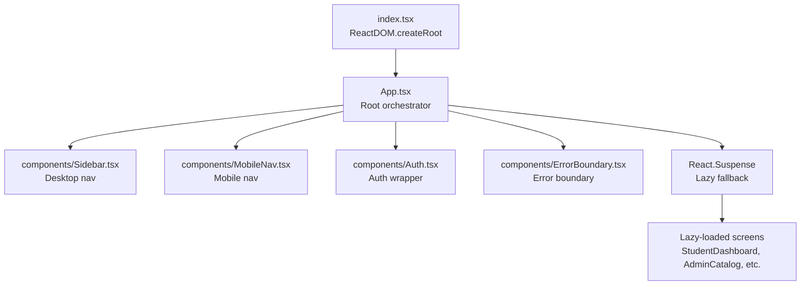

**Diagram sources**
- [index.tsx](file://index.tsx#L12-L17)
- [App.tsx](file://App.tsx#L40-L447)
- [Sidebar.tsx](file://components/Sidebar.tsx#L27-L124)
- [MobileNav.tsx](file://components/MobileNav.tsx#L11-L94)
- [Auth.tsx](file://components/Auth.tsx#L12-L265)
- [ErrorBoundary.tsx](file://components/ErrorBoundary.tsx#L13-L82)

**Section sources**
- [index.tsx](file://index.tsx#L1-L65)
- [App.tsx](file://App.tsx#L1-L449)

## Core Components
- App.tsx: Central orchestrator managing authentication state, user role, access checks, screen routing, and view mode toggling. Integrates Sidebar, MobileNav, Auth, ErrorBoundary, and Suspense.
- Sidebar.tsx: Desktop navigation drawer with role-aware items and logout action.
- MobileNav.tsx: Bottom mobile navigation bar with role-aware items and logout action.
- Auth.tsx: Authentication wrapper handling login/signup and Google OAuth flows.
- ErrorBoundary.tsx: Error boundary catching rendering errors and offering retry/reload actions.
- Lazy-loaded screens: StudentDashboard and AdminCatalog (and others) rendered conditionally based on view mode and current screen.

Key state and types:
- Types define Screen union and ViewMode, enabling strict routing and view-mode control.
- Zustand stores manage global state (appStore) and course selection (courseStore).

**Section sources**
- [App.tsx](file://App.tsx#L40-L447)
- [Sidebar.tsx](file://components/Sidebar.tsx#L27-L124)
- [MobileNav.tsx](file://components/MobileNav.tsx#L11-L94)
- [Auth.tsx](file://components/Auth.tsx#L12-L265)
- [ErrorBoundary.tsx](file://components/ErrorBoundary.tsx#L13-L82)
- [types.ts](file://types.ts#L1-L125)
- [appStore.ts](file://lib/stores/appStore.ts#L1-L82)
- [courseStore.ts](file://lib/stores/courseStore.ts#L1-L27)

## Architecture Overview
The App component coordinates three major subsystems:
- Authentication and Role Management: Listens to Firebase auth state, loads user role and access, and sets initial screen.
- Navigation and Routing: Uses a Screen union type and a renderScreen() switch to select the appropriate lazy-loaded component.
- Presentation and UX: Wraps content with ErrorBoundary and Suspense for robust error handling and smooth loading.

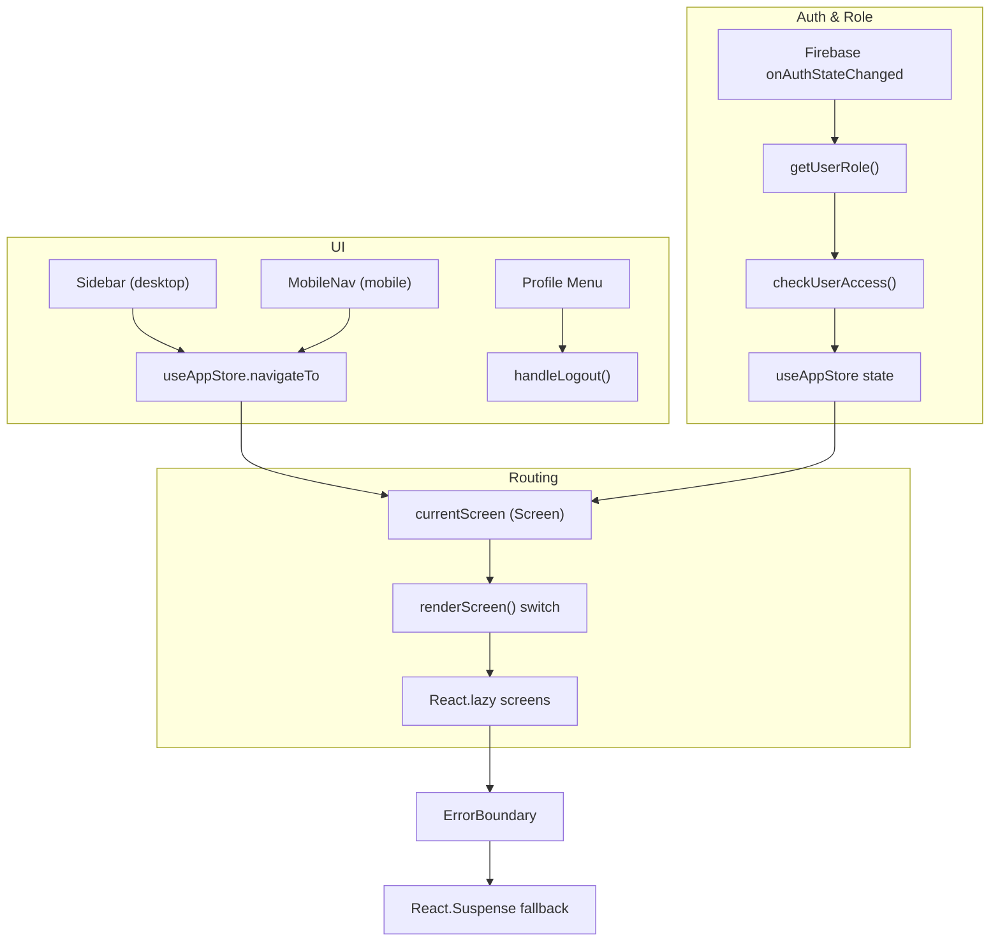

**Diagram sources**
- [App.tsx](file://App.tsx#L65-L108)
- [App.tsx](file://App.tsx#L240-L324)
- [Sidebar.tsx](file://components/Sidebar.tsx#L27-L124)
- [MobileNav.tsx](file://components/MobileNav.tsx#L11-L94)
- [ErrorBoundary.tsx](file://components/ErrorBoundary.tsx#L13-L82)

## Detailed Component Analysis

### App.tsx: Root Orchestrator
Responsibilities:
- Authentication lifecycle: Subscribes to onAuthStateChanged, loads role and access, normalizes admin emails, and redirects to dashboard after login.
- Access gating: Blocks unauthorized users (except admin) with a dedicated pending-access UI.
- View mode switching: Toggles between student and admin modes; admin gets a floating toggle button.
- Screen routing: renderScreen() selects the active screen based on viewMode and currentScreen.
- Lazy loading: All screens are imported lazily; Suspense provides a spinner fallback.
- Error handling: ErrorBoundary wraps the main content area.

Prop drilling pattern:
- App passes down onNavigate (navigateTo), viewMode, currentScreen, and onLogout to Sidebar and MobileNav.
- Selected course/gallery/module are passed to screens via props (e.g., CourseList -> GalleryList -> ModuleSelection -> CourseDetail).

Lifecycle management:
- useEffect subscriptions for auth state and click-outside detection.
- Cleanup of listeners on unmount.
- PWA shortcut handling to pre-select a screen on first visit.

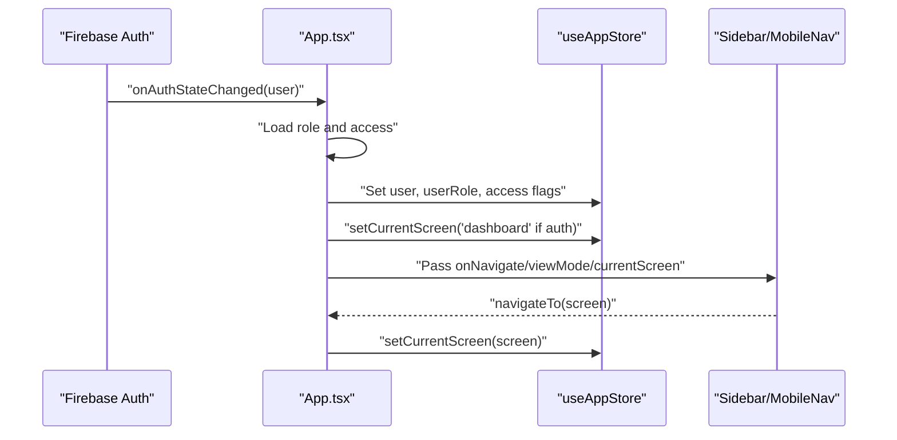

**Diagram sources**
- [App.tsx](file://App.tsx#L65-L108)
- [App.tsx](file://App.tsx#L341-L347)
- [Sidebar.tsx](file://components/Sidebar.tsx#L27-L124)
- [MobileNav.tsx](file://components/MobileNav.tsx#L11-L94)

**Section sources**
- [App.tsx](file://App.tsx#L40-L447)
- [appStore.ts](file://lib/stores/appStore.ts#L48-L81)

### Sidebar.tsx and MobileNav.tsx: Navigation Systems
- Both components receive viewMode, currentScreen, onNavigate, and onLogout.
- Sidebar is desktop-only; MobileNav adapts to mobile with a bottom bar.
- Conditional rendering for admin vs student items; active state determined by currentScreen.

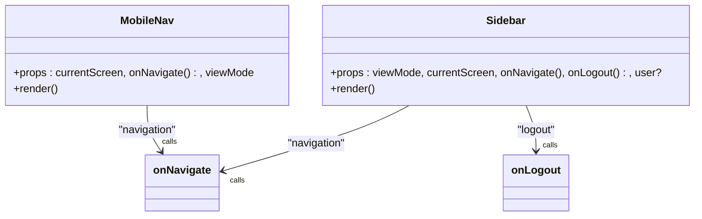

**Diagram sources**
- [Sidebar.tsx](file://components/Sidebar.tsx#L19-L25)
- [MobileNav.tsx](file://components/MobileNav.tsx#L5-L9)

**Section sources**
- [Sidebar.tsx](file://components/Sidebar.tsx#L27-L124)
- [MobileNav.tsx](file://components/MobileNav.tsx#L11-L94)

### Auth.tsx: Authentication Wrapper
- Handles email/password and Google OAuth flows.
- On successful auth, invokes onLogin() to signal App.tsx to proceed.
- Provides form validation feedback and error messaging.

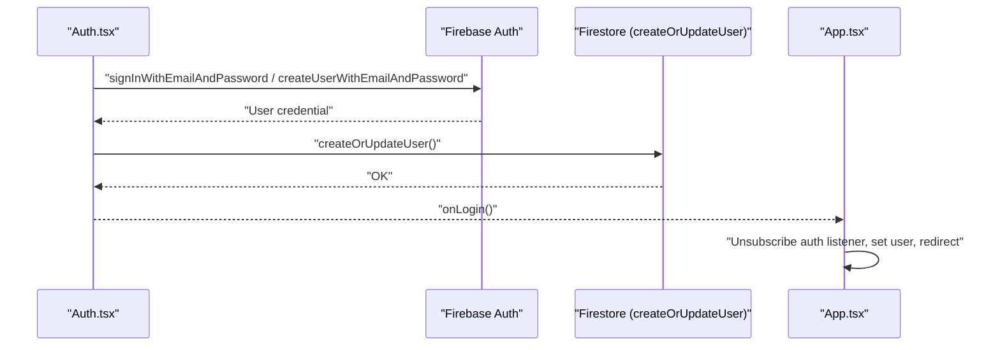

**Diagram sources**
- [Auth.tsx](file://components/Auth.tsx#L21-L60)
- [Auth.tsx](file://components/Auth.tsx#L62-L92)
- [App.tsx](file://App.tsx#L65-L108)

**Section sources**
- [Auth.tsx](file://components/Auth.tsx#L12-L265)
- [App.tsx](file://App.tsx#L151-L173)

### ErrorBoundary.tsx and Suspense: Robust Rendering
- ErrorBoundary catches rendering errors and offers retry/reload actions.
- Suspense wraps lazy-loaded screens with a spinner fallback.

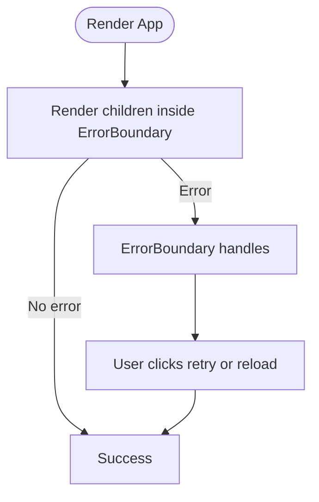

**Diagram sources**
- [ErrorBoundary.tsx](file://components/ErrorBoundary.tsx#L13-L82)
- [App.tsx](file://App.tsx#L421-L425)

**Section sources**
- [ErrorBoundary.tsx](file://components/ErrorBoundary.tsx#L13-L82)
- [App.tsx](file://App.tsx#L34-L38)
- [App.tsx](file://App.tsx#L421-L425)

### Conditional Rendering: Student vs Admin
- ViewMode drives two distinct navigation trees and screen sets.
- Admin viewMode enables admin screens and a floating toggle button.
- Access checks gate non-admin unauthorized users with a pending-access page.

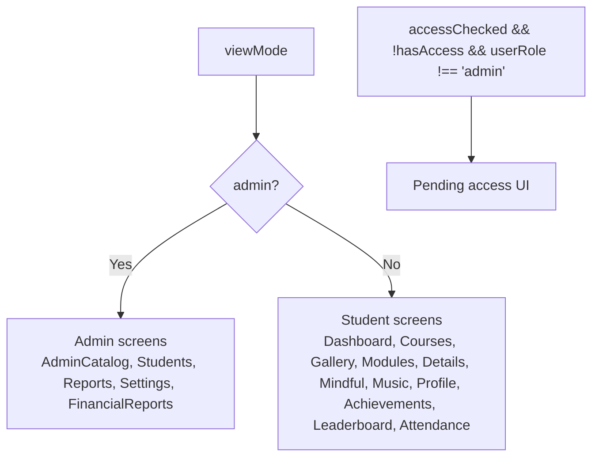

**Diagram sources**
- [App.tsx](file://App.tsx#L240-L324)
- [App.tsx](file://App.tsx#L175-L238)

**Section sources**
- [App.tsx](file://App.tsx#L240-L324)
- [App.tsx](file://App.tsx#L175-L238)

### Screen-Based Routing with Lazy Loading
- All screen components are imported lazily.
- Suspense provides a consistent loading spinner while chunks download.
- renderScreen() maps currentScreen to the appropriate lazy component.

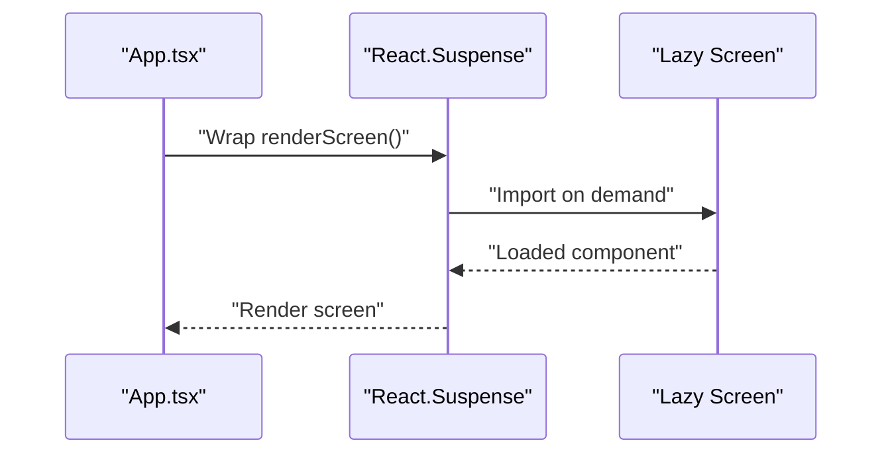

**Diagram sources**
- [App.tsx](file://App.tsx#L6-L22)
- [App.tsx](file://App.tsx#L421-L425)

**Section sources**
- [App.tsx](file://App.tsx#L6-L22)
- [App.tsx](file://App.tsx#L421-L425)

### Component Composition Patterns
- Parent-to-child props: App passes onNavigate, viewMode, currentScreen, onLogout to Sidebar and MobileNav.
- Child-to-parent callbacks: Sidebar/MobileNav call navigateTo to update currentScreen.
- State-driven composition: renderScreen() composes the active screen based on state.
- Cross-cutting concerns: ErrorBoundary and Suspense wrap the screen area.

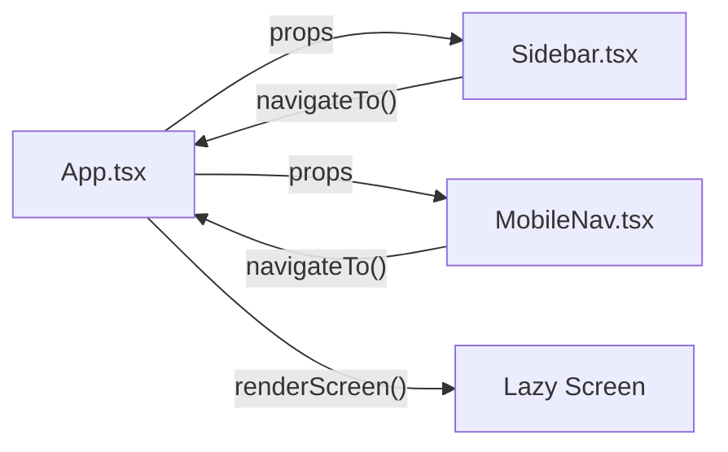

**Diagram sources**
- [App.tsx](file://App.tsx#L341-L347)
- [Sidebar.tsx](file://components/Sidebar.tsx#L27-L124)
- [MobileNav.tsx](file://components/MobileNav.tsx#L11-L94)

**Section sources**
- [App.tsx](file://App.tsx#L341-L347)
- [Sidebar.tsx](file://components/Sidebar.tsx#L27-L124)
- [MobileNav.tsx](file://components/MobileNav.tsx#L11-L94)

### Example Screens: StudentDashboard and AdminCatalog
- StudentDashboard: Displays progress and stats, navigates to achievements and attendance.
- AdminCatalog: Manages content catalog with tabs, filters, forms, and modals.

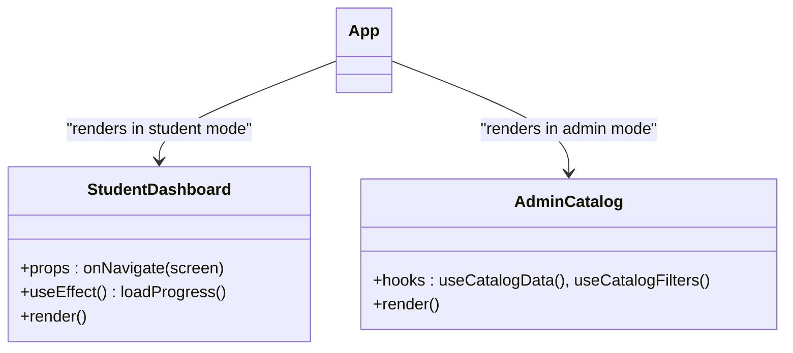

**Diagram sources**
- [StudentDashboard.tsx](file://components/StudentDashboard.tsx#L16-L135)
- [AdminCatalog.tsx](file://components/AdminCatalog.tsx#L37-L200)

**Section sources**
- [StudentDashboard.tsx](file://components/StudentDashboard.tsx#L16-L135)
- [AdminCatalog.tsx](file://components/AdminCatalog.tsx#L37-L200)

## Dependency Analysis
- App.tsx depends on:
  - Firebase auth for authentication lifecycle.
  - Zustand stores for global state and course selection.
  - Types for strict Screen and ViewMode definitions.
  - Lazy-loaded screens for feature modules.
- UI components depend on shared UI primitives (Button, Card, Input) and icons.
- Sidebar and MobileNav depend on types and call navigateTo from App’s store.

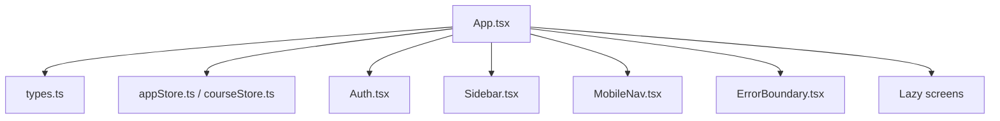

**Diagram sources**
- [App.tsx](file://App.tsx#L24-L31)
- [types.ts](file://types.ts#L1-L25)
- [appStore.ts](file://lib/stores/appStore.ts#L1-L82)
- [courseStore.ts](file://lib/stores/courseStore.ts#L1-L27)
- [Auth.tsx](file://components/Auth.tsx#L12-L265)
- [Sidebar.tsx](file://components/Sidebar.tsx#L27-L124)
- [MobileNav.tsx](file://components/MobileNav.tsx#L11-L94)
- [ErrorBoundary.tsx](file://components/ErrorBoundary.tsx#L13-L82)

**Section sources**
- [App.tsx](file://App.tsx#L24-L31)
- [types.ts](file://types.ts#L1-L25)
- [appStore.ts](file://lib/stores/appStore.ts#L1-L82)
- [courseStore.ts](file://lib/stores/courseStore.ts#L1-L27)

## Performance Considerations
- Lazy loading reduces initial bundle size; ensure fallback UI remains responsive.
- Avoid unnecessary re-renders by keeping navigation callbacks stable and minimizing prop drift.
- Use Suspense boundaries close to the UI that needs them to avoid blocking unrelated areas.
- Debounce or throttle frequent state updates (e.g., filters) to reduce re-renders.

## Troubleshooting Guide
Common issues and where to look:
- Authentication loops or incorrect redirects: Verify onAuthStateChanged subscription and setCurrentScreen transitions.
- Unauthorized access UI appears unexpectedly: Check accessChecked, hasAccess, and userRole updates.
- Navigation does not change screen: Confirm navigateTo is called and currentScreen updates in the store.
- Error boundary shows frequently: Inspect child components’ error boundaries and logs.
- Mobile navigation missing: Ensure viewMode is passed and currentScreen is mapped correctly.

**Section sources**
- [App.tsx](file://App.tsx#L65-L108)
- [App.tsx](file://App.tsx#L175-L238)
- [appStore.ts](file://lib/stores/appStore.ts#L62-L78)
- [ErrorBoundary.tsx](file://components/ErrorBoundary.tsx#L19-L25)

## Conclusion
App.tsx serves as the central orchestrator, coordinating authentication, role management, access checks, navigation, and screen rendering. Sidebar and MobileNav provide role-aware navigation, while Auth, ErrorBoundary, and Suspense ensure a resilient user experience. The component tree adapts dynamically to user state and screen mode, with clear separation of concerns and predictable prop flows.