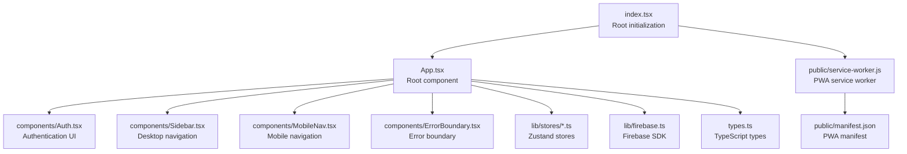
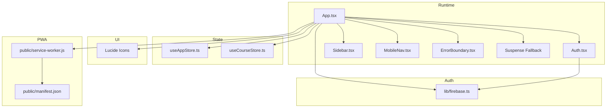
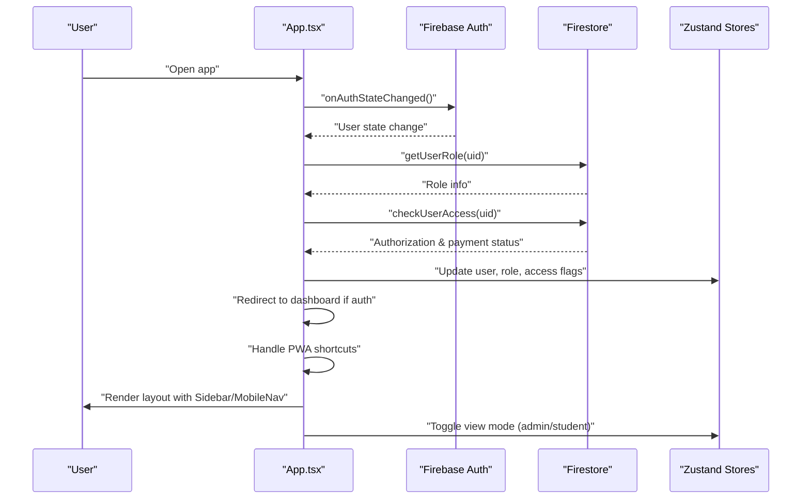
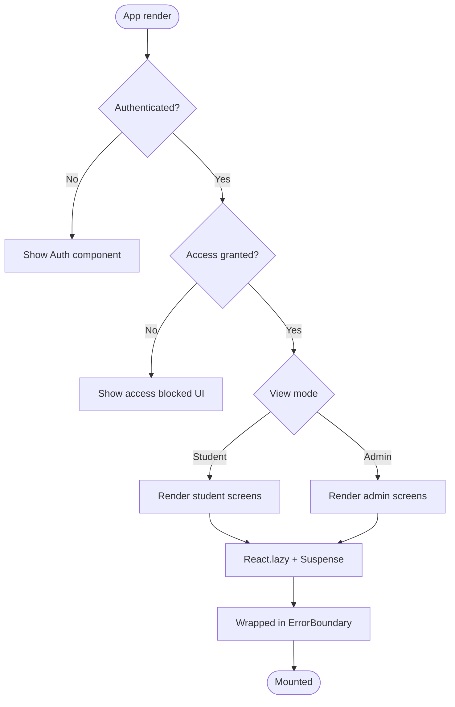
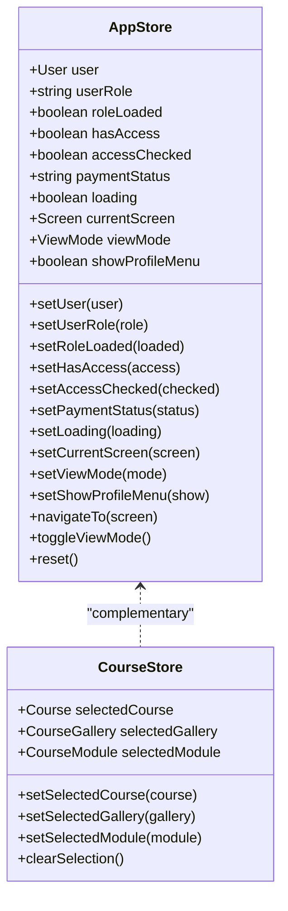
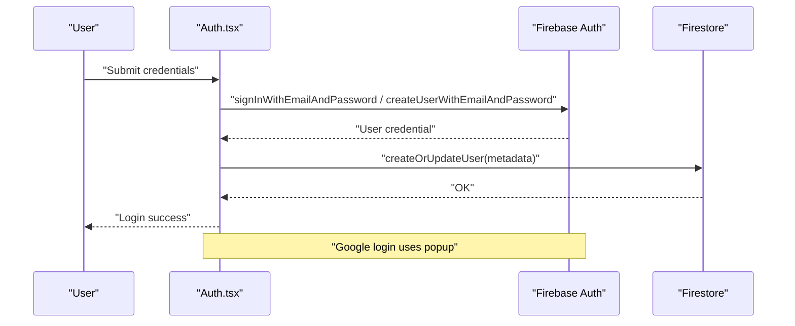
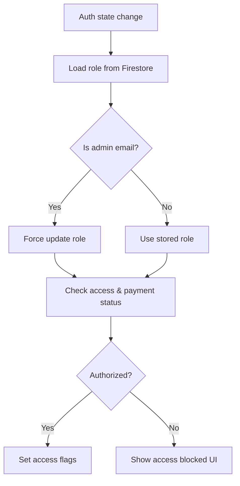
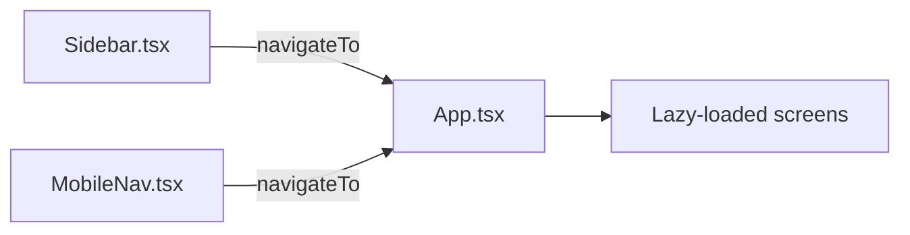
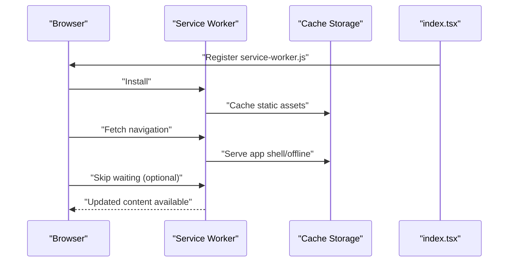
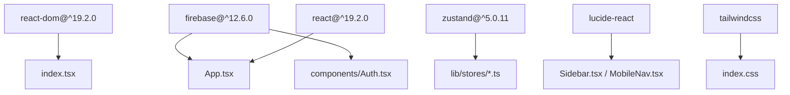

# Frontend Architecture

<cite>
**Referenced Files in This Document**
- [App.tsx](file://App.tsx)
- [index.tsx](file://index.tsx)
- [package.json](file://package.json)
- [vite.config.ts](file://vite.config.ts)
- [lib/firebase.ts](file://lib/firebase.ts)
- [lib/stores/appStore.ts](file://lib/stores/appStore.ts)
- [lib/stores/courseStore.ts](file://lib/stores/courseStore.ts)
- [components/Auth.tsx](file://components/Auth.tsx)
- [components/ErrorBoundary.tsx](file://components/ErrorBoundary.tsx)
- [components/Sidebar.tsx](file://components/Sidebar.tsx)
- [components/MobileNav.tsx](file://components/MobileNav.tsx)
- [types.ts](file://types.ts)
- [public/manifest.json](file://public/manifest.json)
- [public/service-worker.js](file://public/service-worker.js)
</cite>

## Table of Contents
1. [Introduction](#introduction)
2. [Project Structure](#project-structure)
3. [Core Components](#core-components)
4. [Architecture Overview](#architecture-overview)
5. [Detailed Component Analysis](#detailed-component-analysis)
6. [Dependency Analysis](#dependency-analysis)
7. [Performance Considerations](#performance-considerations)
8. [Troubleshooting Guide](#troubleshooting-guide)
9. [Conclusion](#conclusion)
10. [Appendices](#appendices)

## Introduction
This document describes the frontend architecture of the Fluentoria React application. It covers the component hierarchy starting from the root App component, the screen-based routing system with lazy loading and code-splitting, state management using Zustand stores, authentication integration with Firebase, user role management and access control, responsive design with mobile navigation and sidebar layout, Progressive Web App (PWA) capabilities, component composition patterns, error boundaries, and suspense-based loading states. It also addresses performance optimizations enabled by React 19.2.0 and Vite tooling.

## Project Structure
The application follows a feature-based structure with clear separation of concerns:
- Root entry initializes the React application and registers the service worker for PWA support.
- App orchestrates authentication, role checks, access control, navigation, and renders the main layout with sidebar, mobile navigation, and screen content.
- Components are grouped under a components directory, with reusable UI elements under a dedicated ui folder.
- State management is centralized via Zustand stores located under lib/stores.
- Authentication integrates with Firebase for auth state monitoring, credential-based login, and Google OAuth.
- PWA assets and service worker are served from the public directory.

**Diagram sources**
- [index.tsx](file://index.tsx#L1-L65)
- [App.tsx](file://App.tsx#L1-L449)
- [components/Auth.tsx](file://components/Auth.tsx#L1-L265)
- [components/Sidebar.tsx](file://components/Sidebar.tsx#L1-L152)
- [components/MobileNav.tsx](file://components/MobileNav.tsx#L1-L118)
- [components/ErrorBoundary.tsx](file://components/ErrorBoundary.tsx#L1-L86)
- [lib/stores/appStore.ts](file://lib/stores/appStore.ts#L1-L82)
- [lib/stores/courseStore.ts](file://lib/stores/courseStore.ts#L1-L27)
- [lib/firebase.ts](file://lib/firebase.ts#L1-L25)
- [types.ts](file://types.ts#L1-L125)
- [public/service-worker.js](file://public/service-worker.js#L1-L261)
- [public/manifest.json](file://public/manifest.json#L1-L128)

**Section sources**
- [index.tsx](file://index.tsx#L1-L65)
- [App.tsx](file://App.tsx#L1-L449)
- [types.ts](file://types.ts#L1-L125)

## Core Components
- App: Orchestrates authentication state, user roles, access control, navigation, and renders the layout with sidebar, mobile navigation, and screen content. Implements PWA shortcut handling and admin view toggling.
- Auth: Provides form-based login/signup and Google OAuth integration, with user creation/update in Firestore.
- Sidebar: Desktop navigation drawer with icons and labels, switching between student and admin views.
- MobileNav: Bottom tab bar for mobile navigation, adapting to view modes.
- ErrorBoundary: Class-based error boundary to gracefully handle rendering errors.
- Zustand stores: Global state for user, roles, access flags, current screen, view mode, and selected course/gallery/module.

Key responsibilities:
- App manages lifecycle hooks for auth state, role loading, access checks, and PWA shortcuts.
- Auth handles credential and popup-based authentication flows and persists user metadata to Firestore.
- Sidebar and MobileNav provide unified navigation across devices.
- ErrorBoundary wraps Suspense to ensure graceful degradation.
- Zustand stores encapsulate state transitions and actions.

**Section sources**
- [App.tsx](file://App.tsx#L40-L108)
- [components/Auth.tsx](file://components/Auth.tsx#L12-L92)
- [components/Sidebar.tsx](file://components/Sidebar.tsx#L27-L124)
- [components/MobileNav.tsx](file://components/MobileNav.tsx#L11-L94)
- [components/ErrorBoundary.tsx](file://components/ErrorBoundary.tsx#L13-L82)
- [lib/stores/appStore.ts](file://lib/stores/appStore.ts#L48-L81)
- [lib/stores/courseStore.ts](file://lib/stores/courseStore.ts#L14-L26)

## Architecture Overview
The architecture centers around a single-page application with:
- Lazy-loaded route components for code-splitting.
- Suspense-based fallbacks during component loading.
- ErrorBoundary wrapping Suspense to handle rendering errors.
- Zustand stores for global state management.
- Firebase for authentication and Firestore persistence.
- Responsive layout with desktop sidebar and mobile bottom navigation.
- PWA support via service worker and manifest.

**Diagram sources**
- [App.tsx](file://App.tsx#L1-L449)
- [components/Auth.tsx](file://components/Auth.tsx#L1-L265)
- [components/Sidebar.tsx](file://components/Sidebar.tsx#L1-L152)
- [components/MobileNav.tsx](file://components/MobileNav.tsx#L1-L118)
- [components/ErrorBoundary.tsx](file://components/ErrorBoundary.tsx#L1-L86)
- [lib/stores/appStore.ts](file://lib/stores/appStore.ts#L1-L82)
- [lib/stores/courseStore.ts](file://lib/stores/courseStore.ts#L1-L27)
- [lib/firebase.ts](file://lib/firebase.ts#L1-L25)
- [public/service-worker.js](file://public/service-worker.js#L1-L261)
- [public/manifest.json](file://public/manifest.json#L1-L128)

## Detailed Component Analysis

### App Component
Responsibilities:
- Initialize and monitor Firebase auth state.
- Load and persist user role, check access permissions, and manage payment status.
- Render Auth when unauthenticated or pending access.
- Switch between admin and student view modes.
- Manage PWA shortcuts and trigger navigation accordingly.
- Compose layout with Sidebar, MobileNav, ErrorBoundary, and Suspense.

**Diagram sources**
- [App.tsx](file://App.tsx#L65-L108)
- [lib/firebase.ts](file://lib/firebase.ts#L1-L25)
- [lib/stores/appStore.ts](file://lib/stores/appStore.ts#L48-L81)

**Section sources**
- [App.tsx](file://App.tsx#L40-L108)
- [lib/stores/appStore.ts](file://lib/stores/appStore.ts#L48-L81)

### Routing and Code-Splitting
- Route components are lazily imported and rendered conditionally based on currentScreen.
- Suspense fallback spinner is shown while lazy chunks load.
- ErrorBoundary wraps Suspense to present a friendly error UI.

**Diagram sources**
- [App.tsx](file://App.tsx#L240-L324)
- [components/ErrorBoundary.tsx](file://components/ErrorBoundary.tsx#L13-L82)

**Section sources**
- [App.tsx](file://App.tsx#L6-L23)
- [App.tsx](file://App.tsx#L420-L425)

### State Management with Zustand
- useAppStore: Manages user, role, access flags, loading state, current screen, view mode, and UI flags. Includes navigation and view-mode toggle actions.
- useCourseStore: Tracks selected course, gallery, and module for cross-component coordination.

**Diagram sources**
- [lib/stores/appStore.ts](file://lib/stores/appStore.ts#L5-L33)
- [lib/stores/courseStore.ts](file://lib/stores/courseStore.ts#L4-L12)

**Section sources**
- [lib/stores/appStore.ts](file://lib/stores/appStore.ts#L48-L81)
- [lib/stores/courseStore.ts](file://lib/stores/courseStore.ts#L14-L26)

### Authentication Flow with Firebase
- Auth component supports email/password and Google OAuth.
- On successful sign-in, user metadata is created/updated in Firestore.
- App listens to auth state changes, loads roles, and enforces access control.

**Diagram sources**
- [components/Auth.tsx](file://components/Auth.tsx#L21-L92)
- [lib/firebase.ts](file://lib/firebase.ts#L1-L25)

**Section sources**
- [components/Auth.tsx](file://components/Auth.tsx#L12-L92)
- [lib/firebase.ts](file://lib/firebase.ts#L1-L25)

### Access Control and Role Management
- Admin emails are force-updated to ensure correct role.
- Access checks combine authorization and payment status.
- Non-admin unauthorized users see a controlled-access UI.

**Diagram sources**
- [App.tsx](file://App.tsx#L65-L108)

**Section sources**
- [App.tsx](file://App.tsx#L65-L108)

### Responsive Design and Navigation
- Desktop: Fixed sidebar with navigation items; active item highlighting.
- Mobile: Bottom tab bar with concise labels; adapts to view mode.
- Both layouts integrate with the same navigation actions.

**Diagram sources**
- [components/Sidebar.tsx](file://components/Sidebar.tsx#L27-L124)
- [components/MobileNav.tsx](file://components/MobileNav.tsx#L11-L94)
- [App.tsx](file://App.tsx#L240-L324)

**Section sources**
- [components/Sidebar.tsx](file://components/Sidebar.tsx#L27-L124)
- [components/MobileNav.tsx](file://components/MobileNav.tsx#L11-L94)

### PWA Functionality
- Service worker registers and manages static/dynamic caches.
- Navigation requests fall back to app shell or offline page.
- Manifest defines icons, screenshots, categories, and launch behavior.
- Root registers service worker and handles updates.

**Diagram sources**
- [index.tsx](file://index.tsx#L19-L64)
- [public/service-worker.js](file://public/service-worker.js#L32-L75)
- [public/manifest.json](file://public/manifest.json#L1-L128)

**Section sources**
- [index.tsx](file://index.tsx#L19-L64)
- [public/service-worker.js](file://public/service-worker.js#L1-L261)
- [public/manifest.json](file://public/manifest.json#L1-L128)

## Dependency Analysis
External libraries and their roles:
- React 19.2.0: Enables concurrent rendering and modern React features.
- Zustand 5.x: Lightweight state management with minimal boilerplate.
- Firebase: Authentication, Firestore persistence, and storage.
- Tailwind CSS: Utility-first styling framework.
- Lucide React: SVG icon library.

**Diagram sources**
- [package.json](file://package.json#L13-L24)
- [index.tsx](file://index.tsx#L1-L17)
- [App.tsx](file://App.tsx#L1-L31)
- [lib/stores/appStore.ts](file://lib/stores/appStore.ts#L1)
- [lib/firebase.ts](file://lib/firebase.ts#L1-L25)

**Section sources**
- [package.json](file://package.json#L13-L24)
- [vite.config.ts](file://vite.config.ts#L1-L33)

## Performance Considerations
- Lazy loading and code-splitting: Route components are dynamically imported to reduce initial bundle size.
- Concurrent rendering benefits: React 19.2.0 enables automatic batching and concurrent features for smoother UI updates.
- Suspense fallbacks: Provide immediate feedback while chunks load.
- Service worker caching: Static assets and app shell improve load performance and enable offline usage.
- Zustand stores: Efficient state updates with minimal re-renders.
- Memory management: Cleanup subscriptions (auth state listener) and event listeners (click-outside) in effects.

Recommendations:
- Keep lazy chunks appropriately sized; group related routes for optimal caching.
- Monitor long tasks and use React startTransition for non-urgent navigations.
- Optimize images and fonts; leverage CDN caching configured in the service worker.
- Use selective store subscriptions to avoid unnecessary re-renders.

**Section sources**
- [App.tsx](file://App.tsx#L6-L23)
- [App.tsx](file://App.tsx#L110-L125)
- [public/service-worker.js](file://public/service-worker.js#L163-L208)

## Troubleshooting Guide
Common issues and resolutions:
- Authentication errors: Validate Firebase configuration and environment variables. Check error messages mapped in the Auth component for user-friendly feedback.
- Access blocked UI: Confirm Firestore access rules and payment status updates. Verify admin email forcing logic.
- Service worker not updating: Ensure skip waiting message is sent and controller change triggers reload.
- Suspense fallback stuck: Verify lazy imports resolve and network conditions; confirm ErrorBoundary fallback is reachable.
- Click-outside menu not closing: Ensure event listener cleanup and ref checks are executed properly.

**Section sources**
- [components/Auth.tsx](file://components/Auth.tsx#L45-L59)
- [App.tsx](file://App.tsx#L175-L238)
- [index.tsx](file://index.tsx#L36-L63)
- [components/ErrorBoundary.tsx](file://components/ErrorBoundary.tsx#L19-L25)

## Conclusion
Fluentoria’s frontend architecture combines modern React features with robust state management, secure authentication, and a responsive, accessible UI. The app leverages lazy loading, Suspense, and ErrorBoundary for resilient user experiences, while Firebase and Firestore provide reliable identity and data services. The PWA stack ensures fast, reliable access across devices. The design promotes maintainability through clear component boundaries, centralized stores, and consistent navigation patterns.

## Appendices

### Component Composition Patterns
- Higher-order composition: App composes Auth, Sidebar, MobileNav, ErrorBoundary, and Suspense.
- Props-driven navigation: Sidebar and MobileNav accept onNavigate handlers to keep navigation decoupled.
- Store-driven state: Zustand stores centralize cross-component state, reducing prop drilling.

**Section sources**
- [App.tsx](file://App.tsx#L326-L446)
- [components/Sidebar.tsx](file://components/Sidebar.tsx#L19-L25)
- [components/MobileNav.tsx](file://components/MobileNav.tsx#L5-L9)

### Types Reference
- ViewMode: 'student' | 'admin'
- Screen: Union of all navigable screens
- Additional domain types for messages, media submissions, activities, achievements, and progress are defined for strong typing across components.

**Section sources**
- [types.ts](file://types.ts#L1-L125)