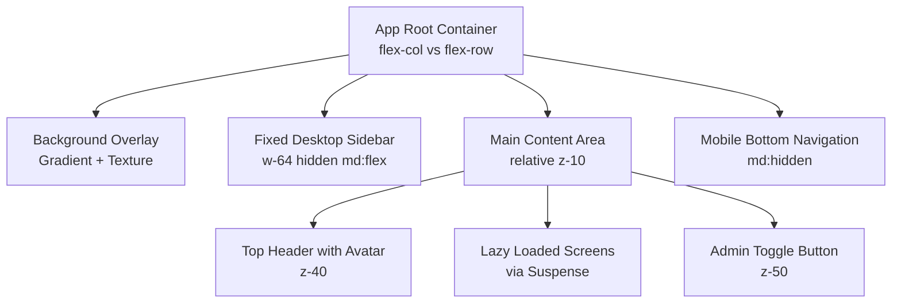
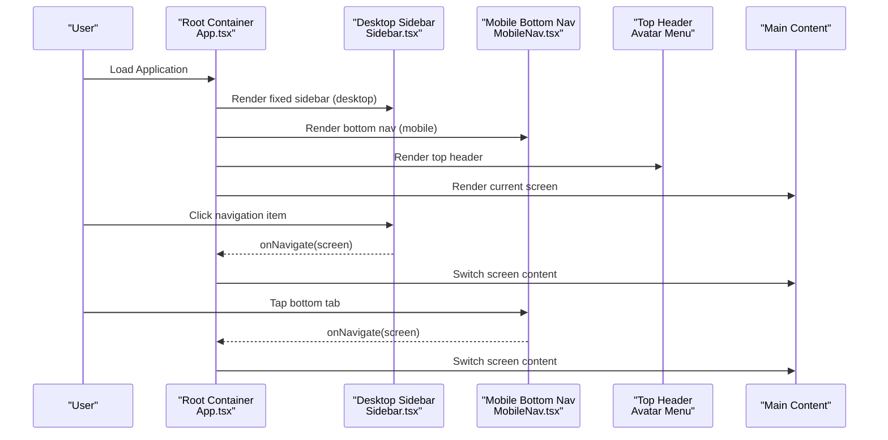
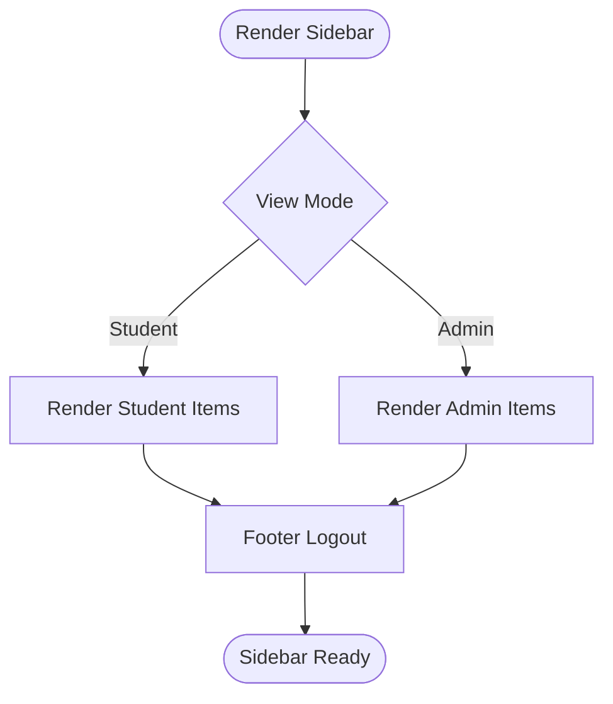
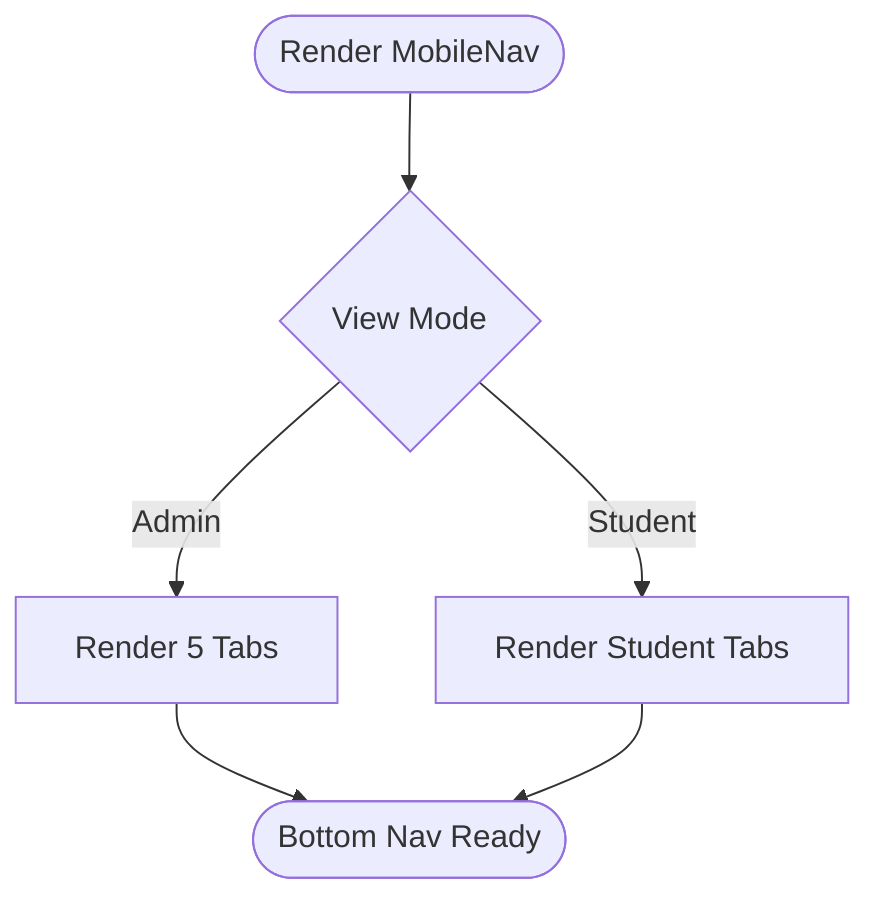
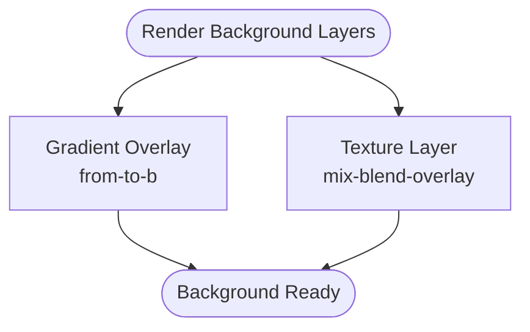
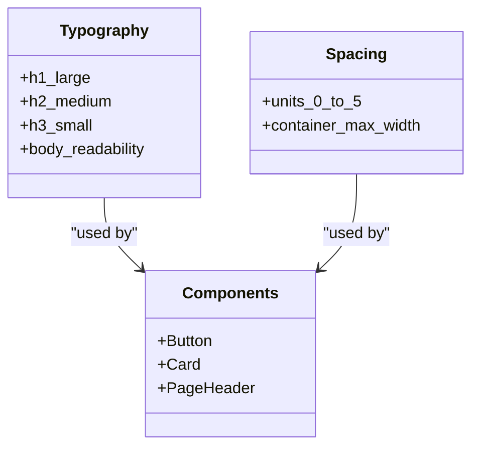
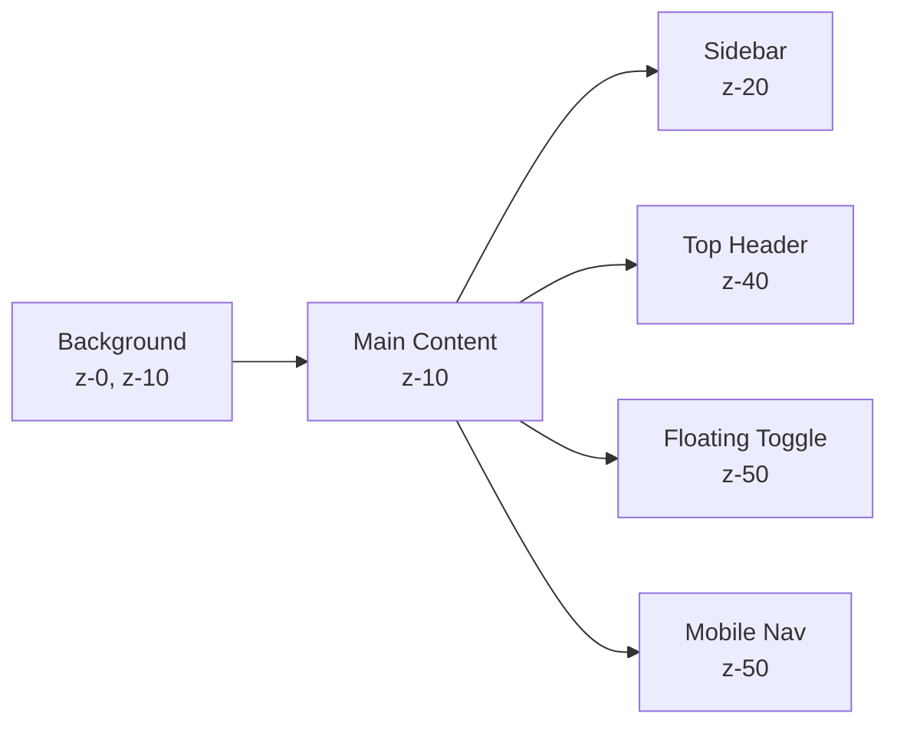
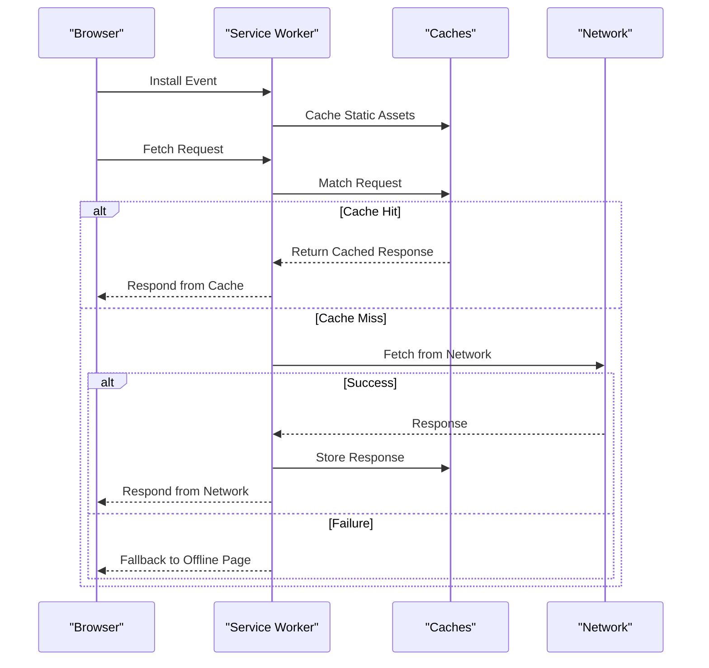
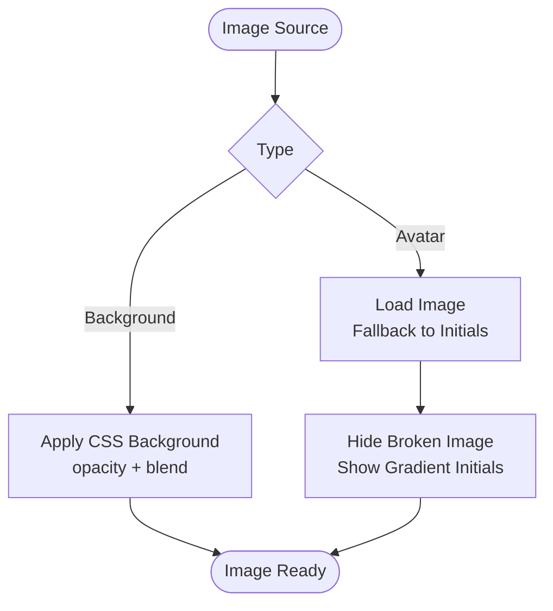
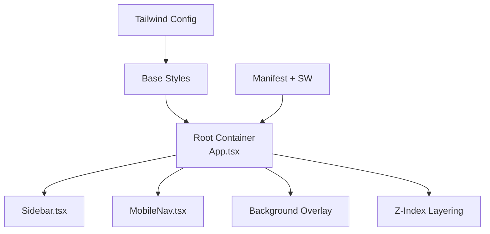

# Responsive Design & Layout System

<cite>
**Referenced Files in This Document**
- [index.css](file://index.css)
- [tailwind.config.js](file://tailwind.config.js)
- [index.html](file://index.html)
- [App.tsx](file://App.tsx)
- [Sidebar.tsx](file://components/Sidebar.tsx)
- [MobileNav.tsx](file://components/MobileNav.tsx)
- [PageHeader.tsx](file://components/ui/PageHeader.tsx)
- [Card.tsx](file://components/ui/Card.tsx)
- [Button.tsx](file://components/ui/Button.tsx)
- [manifest.json](file://public/manifest.json)
- [service-worker.js](file://public/service-worker.js)
- [types.ts](file://types.ts)
</cite>

## Table of Contents
1. [Introduction](#introduction)
2. [Project Structure](#project-structure)
3. [Core Components](#core-components)
4. [Architecture Overview](#architecture-overview)
5. [Detailed Component Analysis](#detailed-component-analysis)
6. [Dependency Analysis](#dependency-analysis)
7. [Performance Considerations](#performance-considerations)
8. [Troubleshooting Guide](#troubleshooting-guide)
9. [Conclusion](#conclusion)
10. [Appendices](#appendices)

## Introduction
This document describes the responsive design and layout system of the Fluentoria application. It explains how the layout adapts across mobile, tablet, and desktop form factors using Tailwind CSS utilities and breakpoint-driven patterns. It covers the fixed desktop sidebar, dynamic mobile bottom navigation, overlay background system with gradient effects, responsive typography and component sizing, z-index layering, PWA-related considerations, touch interactions, and responsive image loading strategies. The goal is to provide a clear understanding of the adaptive architecture while remaining accessible to readers with varying technical backgrounds.

## Project Structure
The responsive layout is implemented primarily through:
- Tailwind CSS configuration and base styles
- A root container that switches direction at larger screens
- A fixed desktop sidebar with a consistent width
- A mobile bottom navigation bar
- Overlay background layers with gradient effects
- Component-level responsive utilities and z-index stacking

**Diagram sources**
- [App.tsx](file://App.tsx#L326-L349)
- [Sidebar.tsx](file://components/Sidebar.tsx#L31-L31)
- [MobileNav.tsx](file://components/MobileNav.tsx#L52-L52)

**Section sources**
- [index.css](file://index.css#L1-L158)
- [tailwind.config.js](file://tailwind.config.js#L1-L72)
- [App.tsx](file://App.tsx#L326-L349)

## Core Components
- Root container: Uses a responsive flex direction to stack vertically on small screens and horizontally on medium screens and above.
- Fixed desktop sidebar: A persistent navigation column with a fixed width that remains visible on desktop.
- Mobile bottom navigation: A five-item bottom tab bar that replaces the desktop sidebar on small screens.
- Overlay background system: A layered background with gradient overlays and a repeating texture for depth.
- Z-index layering: Carefully managed stacking contexts for header, main content, floating controls, and navigation.
- Typography and spacing: Tailwind spacing scale and font sizing tuned for readability across devices.
- PWA integration: Manifest and service worker support for offline and installability.

**Section sources**
- [App.tsx](file://App.tsx#L326-L349)
- [Sidebar.tsx](file://components/Sidebar.tsx#L31-L31)
- [MobileNav.tsx](file://components/MobileNav.tsx#L52-L52)
- [index.css](file://index.css#L40-L59)
- [tailwind.config.js](file://tailwind.config.js#L50-L67)

## Architecture Overview
The layout architecture follows a two-tier navigation pattern:
- Desktop: Fixed sidebar with persistent navigation and a main content area.
- Mobile: Bottom navigation bar replacing the sidebar, with a top header for user actions.

**Diagram sources**
- [App.tsx](file://App.tsx#L326-L349)
- [Sidebar.tsx](file://components/Sidebar.tsx#L42-L121)
- [MobileNav.tsx](file://components/MobileNav.tsx#L51-L92)

## Detailed Component Analysis

### Desktop Sidebar Implementation
- Fixed position and width: The sidebar is fixed on the left and hidden on small screens, appearing at medium breakpoint and above.
- Persistent navigation: Contains navigation items tailored to student and admin roles.
- Backdrop blur and elevated styling: Provides a glass-like appearance with subtle borders and shadows.
- Dynamic active states: Active items highlight with a vertical accent bar and subtle glow.

**Diagram sources**
- [Sidebar.tsx](file://components/Sidebar.tsx#L27-L121)

**Section sources**
- [Sidebar.tsx](file://components/Sidebar.tsx#L31-L121)

### Mobile Bottom Navigation Adaptation
- Five-tab layout for admin; streamlined tabs for students.
- Icon-only design with minimal labels for compact touch targets.
- Active state styling with subtle scaling and colored background.
- Fixed positioning at the bottom with backdrop blur and elevated shadow.

**Diagram sources**
- [MobileNav.tsx](file://components/MobileNav.tsx#L11-L93)

**Section sources**
- [MobileNav.tsx](file://components/MobileNav.tsx#L52-L93)

### Overlay Background System with Gradient Effects
- Two-layer background:
  - Gradient overlay with directional blending for depth.
  - Repeating texture background with reduced opacity and mix-blend mode.
- Pointer events disabled on background layers to prevent interference with interactive content.
- Positioned absolutely and sized to cover the viewport.

**Diagram sources**
- [App.tsx](file://App.tsx#L329-L339)

**Section sources**
- [App.tsx](file://App.tsx#L329-L339)

### Responsive Typography Scaling and Component Sizing Strategies
- Base typography:
  - Headings use large, bold sizes with tight leading for impact.
  - Body text is optimized for readability with anti-aliasing and font feature settings.
- Tailwind spacing scale:
  - Custom spacing units mapped to consistent pixel values for predictable layouts.
  - Component padding and margins use these scales for uniform rhythm.
- Component sizing:
  - Buttons and cards use consistent padding and border radii.
  - Cards apply glass or solid backgrounds depending on variant.

**Diagram sources**
- [index.css](file://index.css#L48-L59)
- [tailwind.config.js](file://tailwind.config.js#L50-L67)
- [Button.tsx](file://components/ui/Button.tsx#L20-L25)
- [Card.tsx](file://components/ui/Card.tsx#L13-L16)
- [PageHeader.tsx](file://components/ui/PageHeader.tsx#L24-L27)

**Section sources**
- [index.css](file://index.css#L40-L59)
- [tailwind.config.js](file://tailwind.config.js#L50-L67)
- [Button.tsx](file://components/ui/Button.tsx#L20-L25)
- [Card.tsx](file://components/ui/Card.tsx#L13-L16)
- [PageHeader.tsx](file://components/ui/PageHeader.tsx#L24-L27)

### Z-Index Layering System for Stacking Context
- Background layers: z-0 and z-10 for gradient and texture respectively.
- Top header with avatar menu: z-40 to stay above content.
- Main content area: z-10 to place content above background but below header.
- Floating admin toggle: z-50 to ensure visibility above all else.
- Sidebar: z-20 to appear above background and content.
- Mobile bottom navigation: z-50 to overlay content and header.

**Diagram sources**
- [App.tsx](file://App.tsx#L329-L339)
- [App.tsx](file://App.tsx#L349-L349)
- [App.tsx](file://App.tsx#L351-L351)
- [App.tsx](file://App.tsx#L428-L441)
- [App.tsx](file://App.tsx#L444-L444)

**Section sources**
- [App.tsx](file://App.tsx#L329-L339)
- [App.tsx](file://App.tsx#L349-L349)
- [App.tsx](file://App.tsx#L351-L351)
- [App.tsx](file://App.tsx#L428-L441)
- [App.tsx](file://App.tsx#L444-L444)

### PWA-Specific Considerations and Touch Interaction Handling
- Manifest configuration:
  - Shortcuts support deep linking to specific screens via query parameters.
  - Standalone display mode and portrait orientation.
  - Icons and screenshots for multiple device form factors.
- Service worker:
  - Static asset caching during installation.
  - Navigation fallback to offline page when appropriate.
  - Separate caching strategies for static assets, dynamic content, and API calls.
  - Skips video/audio requests to avoid range request issues.
- Touch interactions:
  - Bottom navigation designed for thumb-friendly tap targets.
  - Consistent active states and transitions for tactile feedback.
  - Backdrop blur and shadows to enhance perceived depth on mobile.

**Diagram sources**
- [manifest.json](file://public/manifest.json#L78-L118)
- [service-worker.js](file://public/service-worker.js#L32-L55)
- [service-worker.js](file://public/service-worker.js#L77-L161)
- [service-worker.js](file://public/service-worker.js#L232-L254)

**Section sources**
- [manifest.json](file://public/manifest.json#L1-L128)
- [service-worker.js](file://public/service-worker.js#L1-L261)
- [App.tsx](file://App.tsx#L127-L149)

### Responsive Image Loading Strategies
- Background images:
  - Repeating texture applied via CSS with controlled opacity and blend mode.
  - Pointer events disabled on background layers to avoid blocking interactions.
- User avatars:
  - Graceful fallback to gradient initials when image fails to load.
  - Error handling prevents broken image rendering.
- PWA assets:
  - Service worker caches key images for offline availability.

**Diagram sources**
- [App.tsx](file://App.tsx#L331-L339)
- [App.tsx](file://App.tsx#L360-L368)

**Section sources**
- [App.tsx](file://App.tsx#L331-L339)
- [App.tsx](file://App.tsx#L360-L368)

## Dependency Analysis
The responsive layout depends on:
- Tailwind configuration for spacing, colors, and container widths.
- Root container switching between column and row layouts at the medium breakpoint.
- Sidebar and mobile navigation components that adapt to view mode and current screen.
- Overlay background system and z-index stacking to manage layering.
- PWA assets and service worker for caching and offline behavior.

**Diagram sources**
- [tailwind.config.js](file://tailwind.config.js#L1-L72)
- [index.css](file://index.css#L1-L158)
- [App.tsx](file://App.tsx#L326-L349)
- [Sidebar.tsx](file://components/Sidebar.tsx#L31-L31)
- [MobileNav.tsx](file://components/MobileNav.tsx#L52-L52)
- [manifest.json](file://public/manifest.json#L1-L128)
- [service-worker.js](file://public/service-worker.js#L1-L261)

**Section sources**
- [tailwind.config.js](file://tailwind.config.js#L1-L72)
- [index.css](file://index.css#L1-L158)
- [App.tsx](file://App.tsx#L326-L349)
- [Sidebar.tsx](file://components/Sidebar.tsx#L31-L31)
- [MobileNav.tsx](file://components/MobileNav.tsx#L52-L52)
- [manifest.json](file://public/manifest.json#L1-L128)
- [service-worker.js](file://public/service-worker.js#L1-L261)

## Performance Considerations
- CSS optimization:
  - Use Tailwind utilities consistently to minimize custom CSS.
  - Leverage preflight resets and base styles to reduce duplication.
  - Keep z-index values organized to avoid excessive stacking contexts.
- Rendering:
  - Fixed elements (sidebar, bottom nav) help avoid layout shifts.
  - Backdrop blur and shadows are applied selectively to maintain smooth scrolling.
- PWA caching:
  - Separate static and dynamic caches to balance freshness and performance.
  - Navigation fallback reduces server load and improves reliability.
- Images:
  - Background textures use low-opacity and blend modes for minimal overhead.
  - Avatar fallback avoids extra network requests on failures.

[No sources needed since this section provides general guidance]

## Troubleshooting Guide
- Layout shifts on navigation:
  - Ensure fixed elements do not change width unexpectedly.
  - Verify z-index stacking does not cause overlapping content.
- Mobile navigation not responding:
  - Confirm bottom navigation is rendered only on small screens.
  - Check that active state classes are applied correctly.
- Background overlay interfering with interactions:
  - Ensure pointer events are disabled on background layers.
- PWA offline behavior:
  - Verify service worker installation and cache population.
  - Confirm offline page fallback for navigation requests.

**Section sources**
- [App.tsx](file://App.tsx#L329-L339)
- [MobileNav.tsx](file://components/MobileNav.tsx#L52-L52)
- [service-worker.js](file://public/service-worker.js#L32-L55)
- [service-worker.js](file://public/service-worker.js#L138-L161)

## Conclusion
Fluentoria’s responsive design leverages Tailwind CSS utilities and a clear two-tier navigation model: a fixed desktop sidebar and a mobile bottom navigation bar. The overlay background system, carefully managed z-index layers, and PWA integration deliver a cohesive experience across devices. By maintaining consistent spacing, typography, and component sizing, the layout remains predictable and performant. The PWA setup further enhances reliability and accessibility through caching and offline support.

[No sources needed since this section summarizes without analyzing specific files]

## Appendices
- Breakpoint references:
  - Desktop sidebar appears at the medium breakpoint and above.
  - Mobile bottom navigation is hidden at the medium breakpoint and above.
- View modes:
  - Student and admin view modes influence navigation items and floating controls.
- Accessibility:
  - Focus states and transitions improve keyboard and touch usability.
  - Contrast and typography choices support readability.

**Section sources**
- [types.ts](file://types.ts#L1-L25)
- [Sidebar.tsx](file://components/Sidebar.tsx#L27-L28)
- [MobileNav.tsx](file://components/MobileNav.tsx#L11-L13)
- [App.tsx](file://App.tsx#L428-L441)