# Routing & Navigation System

<cite>
**Referenced Files in This Document**
- [index.tsx](file://index.tsx)
- [App.tsx](file://App.tsx)
- [types.ts](file://types.ts)
- [Sidebar.tsx](file://components/Sidebar.tsx)
- [MobileNav.tsx](file://components/MobileNav.tsx)
- [appStore.ts](file://lib/stores/appStore.ts)
- [manifest.json](file://public/manifest.json)
- [service-worker.js](file://public/service-worker.js)
</cite>

## Table of Contents
1. [Introduction](#introduction)
2. [Project Structure](#project-structure)
3. [Core Components](#core-components)
4. [Architecture Overview](#architecture-overview)
5. [Detailed Component Analysis](#detailed-component-analysis)
6. [Dependency Analysis](#dependency-analysis)
7. [Performance Considerations](#performance-considerations)
8. [Troubleshooting Guide](#troubleshooting-guide)
9. [Conclusion](#conclusion)

## Introduction
This document describes the routing and navigation system of the Fluentoria application. It explains the screen-based routing model, navigation patterns, authentication and access control guards, responsive navigation (desktop sidebar and mobile adaptation), PWA shortcut handling, URL parameter processing, navigation state management, and view mode switching between student and admin modes. The system is built around a centralized store for navigation state and a set of route-aware components that render lazily loaded views.

## Project Structure
The routing and navigation logic is implemented primarily in the application shell and a small set of UI components:
- Application shell orchestrates authentication state, access checks, lazy-loaded routes, and responsive layout.
- Store manages navigation state and exposes a navigateTo function.
- Sidebar and MobileNav provide desktop and mobile navigation respectively.
- Types define the Screen union and ViewMode.
- PWA manifest and service worker support offline and app-like behavior.

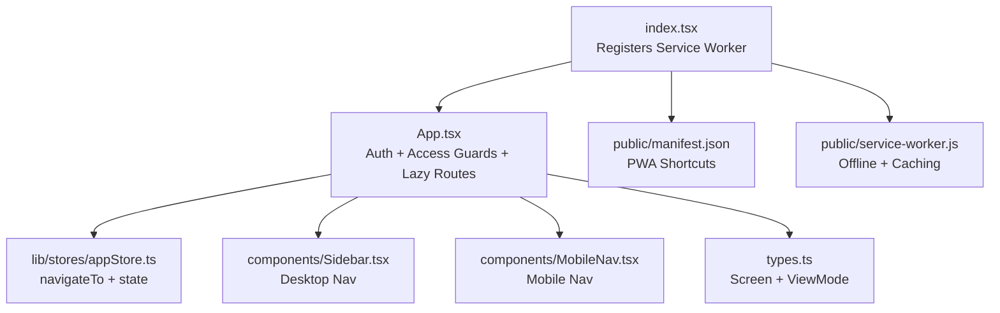

**Diagram sources**
- [index.tsx](file://index.tsx#L1-L65)
- [App.tsx](file://App.tsx#L1-L449)
- [appStore.ts](file://lib/stores/appStore.ts#L1-L82)
- [Sidebar.tsx](file://components/Sidebar.tsx#L1-L152)
- [MobileNav.tsx](file://components/MobileNav.tsx#L1-L118)
- [types.ts](file://types.ts#L1-L125)
- [manifest.json](file://public/manifest.json#L1-L128)
- [service-worker.js](file://public/service-worker.js#L1-L261)

**Section sources**
- [index.tsx](file://index.tsx#L1-L65)
- [App.tsx](file://App.tsx#L1-L449)
- [types.ts](file://types.ts#L1-L125)

## Core Components
- Screen type: Defines all navigable screens, including student-facing screens (dashboard, courses, gallery, module-selection, course-detail, mindful, music, profile, achievements, leaderboard, attendance), plus admin screens (admin-catalog, admin-students, admin-reports, admin-financial, admin-settings).
- ViewMode: Controls whether the UI renders student or admin navigation and content.
- navigateTo: Centralized navigation function that updates currentScreen and scrolls to top.
- Access control: Authentication and authorization checks gate access to protected areas.

Key implementation references:
- Screen union and ViewMode: [types.ts](file://types.ts#L1-L25)
- navigateTo and toggleViewMode: [appStore.ts](file://lib/stores/appStore.ts#L62-L78)
- Rendering and guards: [App.tsx](file://App.tsx#L163-L238)

**Section sources**
- [types.ts](file://types.ts#L1-L25)
- [appStore.ts](file://lib/stores/appStore.ts#L62-L78)
- [App.tsx](file://App.tsx#L163-L238)

## Architecture Overview
The navigation architecture centers on a single-page application (SPA) with:
- Route resolution via a switch statement in the application shell.
- Lazy loading of route components using React Suspense.
- Responsive navigation via desktop sidebar and mobile bottom navigation.
- PWA shortcuts that trigger navigation after authentication.
- Access control enforced during authentication state changes.

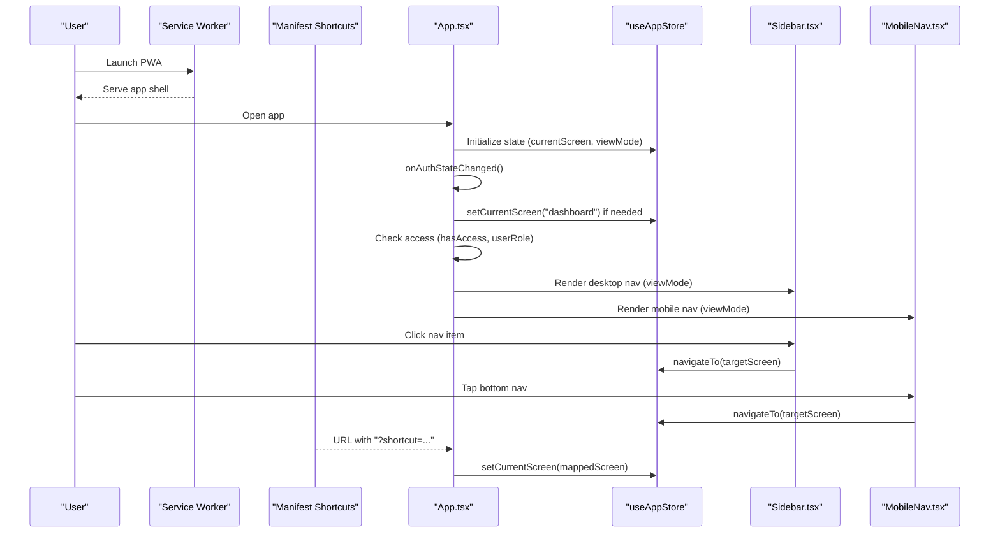

**Diagram sources**
- [App.tsx](file://App.tsx#L65-L149)
- [appStore.ts](file://lib/stores/appStore.ts#L62-L65)
- [Sidebar.tsx](file://components/Sidebar.tsx#L42-L100)
- [MobileNav.tsx](file://components/MobileNav.tsx#L11-L93)
- [manifest.json](file://public/manifest.json#L78-L118)
- [service-worker.js](file://public/service-worker.js#L232-L254)

## Detailed Component Analysis

### Screen-Based Routing Model
The application defines a comprehensive Screen union that enumerates all navigable locations. The rendering logic switches on currentScreen to select the appropriate lazy-loaded component. Navigation is initiated by calling navigateTo, which updates the current screen and scrolls to the top of the viewport.

Available screens:
- Student: auth, dashboard, courses, gallery, module-selection, course-detail, mindful, mindful-detail, music, music-detail, profile, achievements, leaderboard, attendance
- Admin: admin-catalog, admin-students, admin-reports, admin-financial, admin-settings

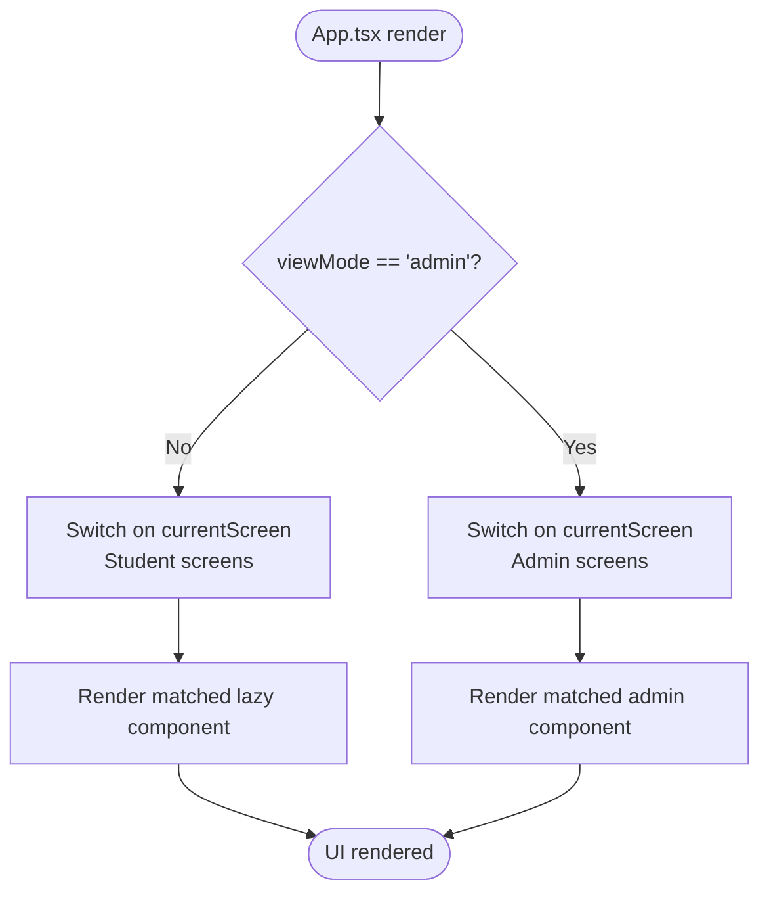

**Diagram sources**
- [App.tsx](file://App.tsx#L240-L324)
- [types.ts](file://types.ts#L3-L25)

**Section sources**
- [types.ts](file://types.ts#L3-L25)
- [App.tsx](file://App.tsx#L240-L324)

### Navigation Patterns with navigateTo
The navigateTo function is the central mechanism for programmatic navigation:
- Updates currentScreen in the store.
- Scrolls the viewport to the top after navigation.

Usage examples:
- Sidebar and MobileNav trigger navigateTo when users click items.
- Course selection flows call navigateTo to move between screens (e.g., courses → gallery → module-selection → course-detail).
- Profile menu triggers navigateTo('profile').
- PWA shortcuts trigger navigateTo after mapping the shortcut to a screen.

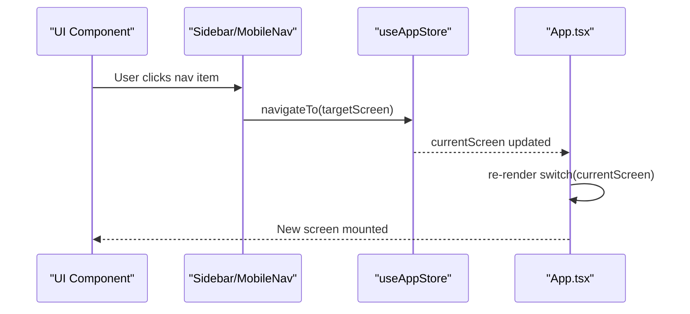

**Diagram sources**
- [Sidebar.tsx](file://components/Sidebar.tsx#L44-L100)
- [MobileNav.tsx](file://components/MobileNav.tsx#L54-L92)
- [appStore.ts](file://lib/stores/appStore.ts#L62-L65)
- [App.tsx](file://App.tsx#L258-L324)

**Section sources**
- [appStore.ts](file://lib/stores/appStore.ts#L62-L65)
- [Sidebar.tsx](file://components/Sidebar.tsx#L44-L100)
- [MobileNav.tsx](file://components/MobileNav.tsx#L54-L92)
- [App.tsx](file://App.tsx#L258-L324)

### Route Guards: Authentication and Access Control
Access control is enforced during authentication state changes:
- On user change, the app loads role and access status from Firestore.
- If access is denied and the user is not admin, a dedicated unauthorized view is shown.
- Authenticated users are redirected to the dashboard if they were on the auth screen.

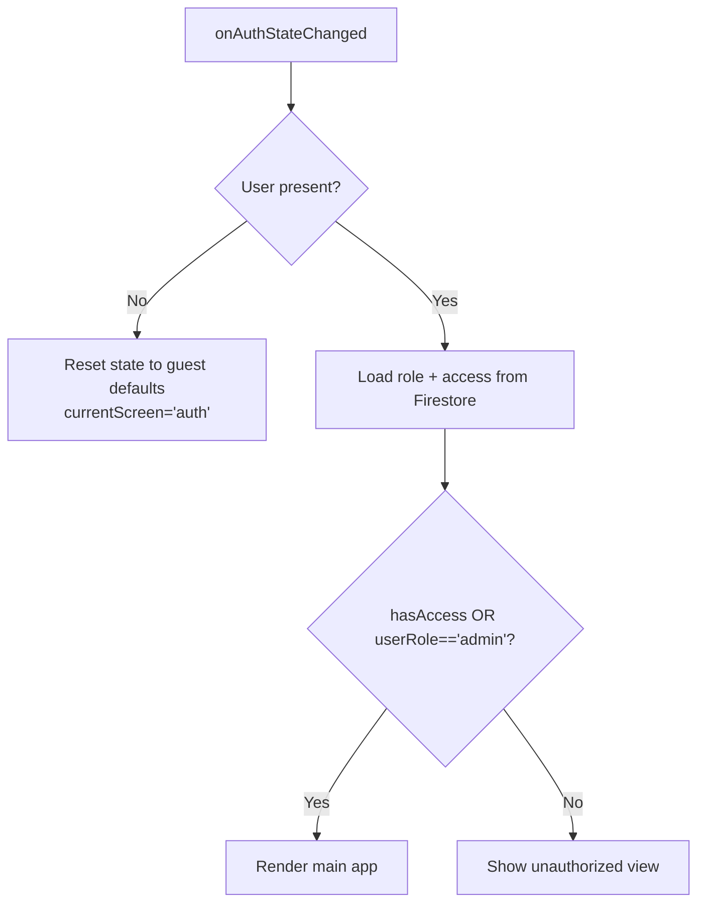

**Diagram sources**
- [App.tsx](file://App.tsx#L65-L108)
- [App.tsx](file://App.tsx#L175-L238)

**Section sources**
- [App.tsx](file://App.tsx#L65-L108)
- [App.tsx](file://App.tsx#L175-L238)

### Responsive Navigation System
Responsive navigation adapts to screen size:
- Desktop: Fixed sidebar with grouped navigation items. Active state highlights the current screen.
- Mobile: Bottom tab bar with icons and labels. Admin and student views differ in available items.

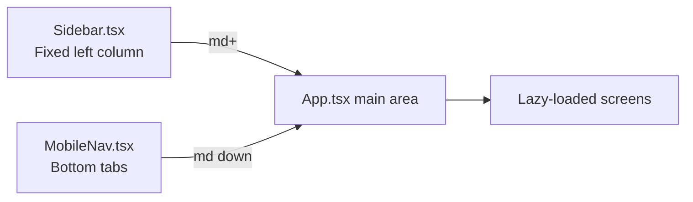

**Diagram sources**
- [Sidebar.tsx](file://components/Sidebar.tsx#L31-L122)
- [MobileNav.tsx](file://components/MobileNav.tsx#L11-L93)
- [App.tsx](file://App.tsx#L326-L446)

**Section sources**
- [Sidebar.tsx](file://components/Sidebar.tsx#L31-L122)
- [MobileNav.tsx](file://components/MobileNav.tsx#L11-L93)
- [App.tsx](file://App.tsx#L326-L446)

### PWA Shortcut Handling and URL Parameter Processing
The app supports PWA shortcuts that pass a shortcut parameter in the URL:
- On load, the app reads the shortcut query parameter.
- A mapping converts shortcut identifiers to Screen values.
- The app sets currentScreen accordingly and clears the parameter from the URL.

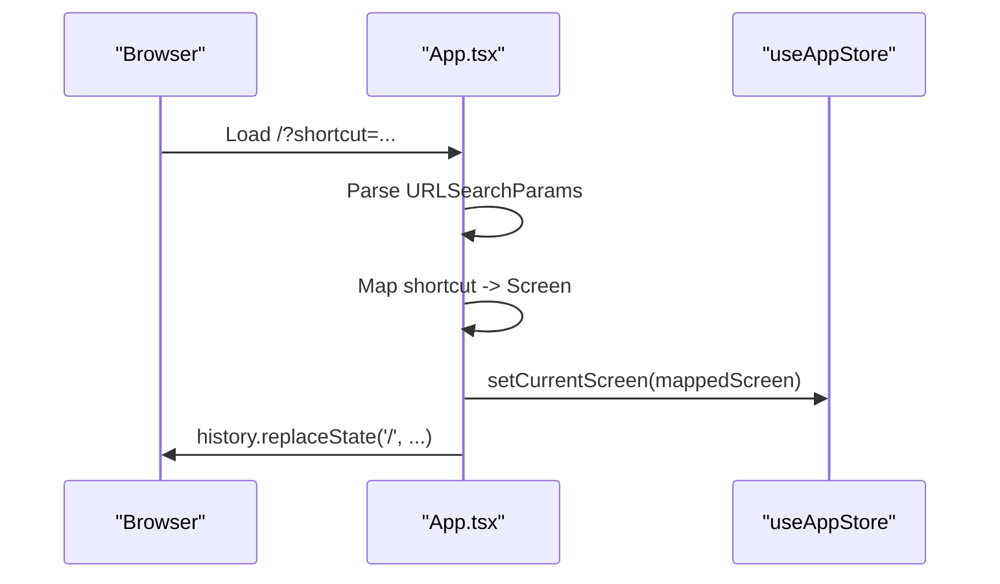

**Diagram sources**
- [App.tsx](file://App.tsx#L127-L149)
- [manifest.json](file://public/manifest.json#L78-L118)

**Section sources**
- [App.tsx](file://App.tsx#L127-L149)
- [manifest.json](file://public/manifest.json#L78-L118)

### Navigation State Management
Navigation state is managed centrally in the Zustand store:
- State includes user, userRole, hasAccess, accessChecked, paymentStatus, loading, currentScreen, viewMode, showProfileMenu.
- Actions include setUser, setUserRole, setHasAccess, setAccessChecked, setPaymentStatus, setLoading, setCurrentScreen, setViewMode, setShowProfileMenu, navigateTo, toggleViewMode, reset.
- toggleViewMode enforces admin-only access and resets currentScreen to appropriate defaults when switching modes.

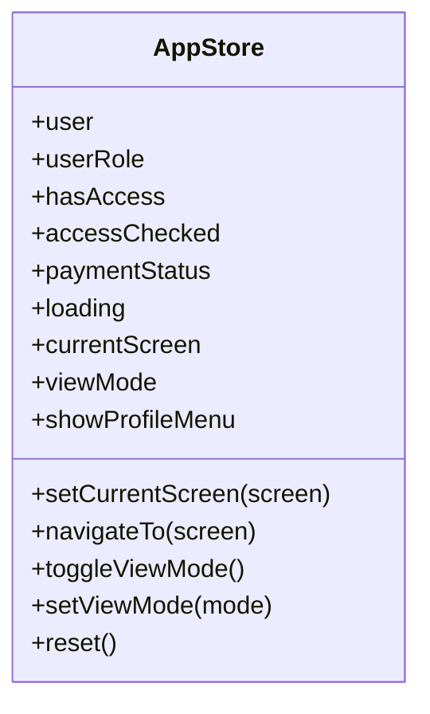

**Diagram sources**
- [appStore.ts](file://lib/stores/appStore.ts#L5-L33)

**Section sources**
- [appStore.ts](file://lib/stores/appStore.ts#L5-L33)
- [appStore.ts](file://lib/stores/appStore.ts#L62-L78)

### View Mode Switching: Student vs Admin
The app supports switching between student and admin views:
- Only admins can toggle viewMode.
- Toggling switches currentScreen to admin-reports (admin → student) or dashboard (student → admin).
- The floating toggle button is visible only to admin users.

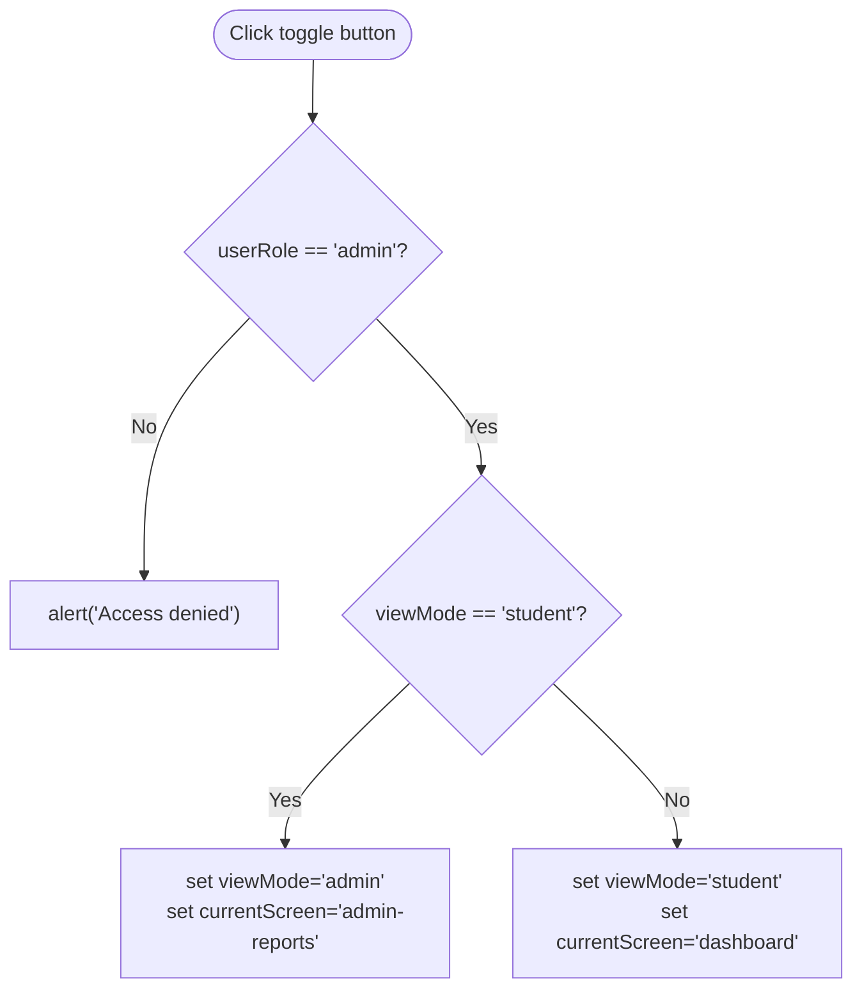

**Diagram sources**
- [appStore.ts](file://lib/stores/appStore.ts#L67-L78)
- [App.tsx](file://App.tsx#L428-L441)

**Section sources**
- [appStore.ts](file://lib/stores/appStore.ts#L67-L78)
- [App.tsx](file://App.tsx#L428-L441)

### Lazy Loading and Performance Optimization
Route components are lazy-loaded using React.lazy and wrapped in Suspense:
- Components are imported on-demand to reduce initial bundle size.
- A shared loading spinner is shown while components load.
- Service worker caching improves offline and repeat-load performance.

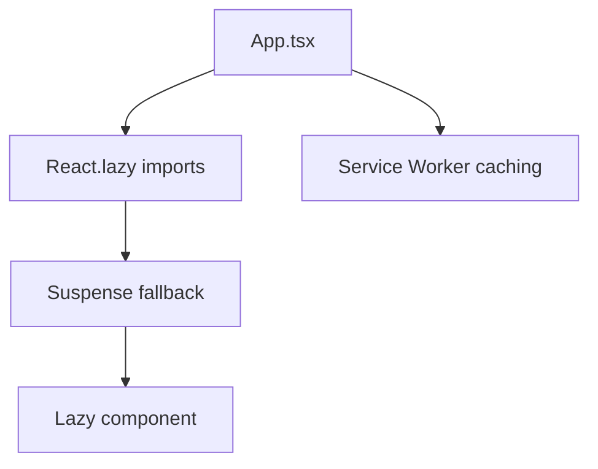

**Diagram sources**
- [App.tsx](file://App.tsx#L6-L22)
- [App.tsx](file://App.tsx#L34-L38)
- [service-worker.js](file://public/service-worker.js#L1-L261)

**Section sources**
- [App.tsx](file://App.tsx#L6-L22)
- [App.tsx](file://App.tsx#L34-L38)
- [service-worker.js](file://public/service-worker.js#L1-L261)

## Dependency Analysis
The routing system exhibits clear separation of concerns:
- App.tsx depends on types.ts for Screen and ViewMode, on appStore.ts for navigation state/actions, and on Sidebar.tsx and MobileNav.tsx for UI navigation.
- Sidebar.tsx and MobileNav.tsx depend on types.ts and call navigateTo from the store.
- index.tsx registers the service worker and indirectly enables offline behavior that benefits navigation.

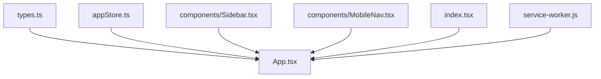

**Diagram sources**
- [types.ts](file://types.ts#L1-L25)
- [appStore.ts](file://lib/stores/appStore.ts#L1-L82)
- [App.tsx](file://App.tsx#L1-L449)
- [Sidebar.tsx](file://components/Sidebar.tsx#L1-L152)
- [MobileNav.tsx](file://components/MobileNav.tsx#L1-L118)
- [index.tsx](file://index.tsx#L1-L65)
- [service-worker.js](file://public/service-worker.js#L1-L261)

**Section sources**
- [types.ts](file://types.ts#L1-L25)
- [appStore.ts](file://lib/stores/appStore.ts#L1-L82)
- [App.tsx](file://App.tsx#L1-L449)
- [Sidebar.tsx](file://components/Sidebar.tsx#L1-L152)
- [MobileNav.tsx](file://components/MobileNav.tsx#L1-L118)
- [index.tsx](file://index.tsx#L1-L65)
- [service-worker.js](file://public/service-worker.js#L1-L261)

## Performance Considerations
- Lazy loading reduces initial payload and improves startup time.
- Suspense ensures smooth transitions between screens.
- Service worker caching accelerates subsequent visits and enables offline navigation to the app shell.
- Avoid heavy synchronous work in render paths; keep navigation actions lightweight.

## Troubleshooting Guide
Common issues and resolutions:
- Navigation does not update active state: Verify that Sidebar and MobileNav pass the correct currentScreen and that onNavigate calls navigateTo.
- Unauthorized screen appears unexpectedly: Confirm access checks occur on auth state changes and that admin users bypass restrictions.
- PWA shortcut does nothing: Ensure the shortcut URL includes a supported shortcut parameter and that the mapping exists in the handler.
- View mode toggle disabled: Confirm the user has admin role; non-admins cannot switch modes.
- Lazy component fails to load: Check Suspense fallback and network connectivity; verify service worker caching behavior.

**Section sources**
- [App.tsx](file://App.tsx#L127-L149)
- [Sidebar.tsx](file://components/Sidebar.tsx#L42-L100)
- [MobileNav.tsx](file://components/MobileNav.tsx#L11-L93)
- [appStore.ts](file://lib/stores/appStore.ts#L67-L78)

## Conclusion
The Fluentoria routing and navigation system combines a centralized store for state, a strict Screen type, and responsive UI components to deliver a seamless SPA experience. Authentication and access control are enforced early in the lifecycle, while PWA shortcuts and lazy loading enhance usability and performance. The view mode switching provides a secure and intuitive way to toggle between student and admin experiences.