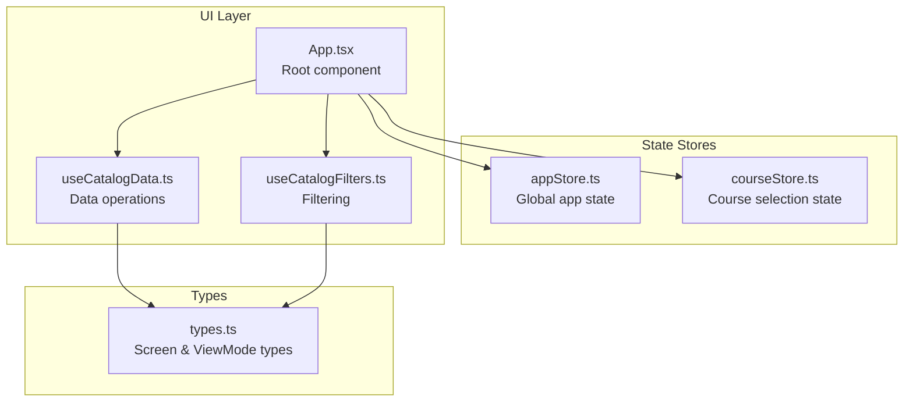
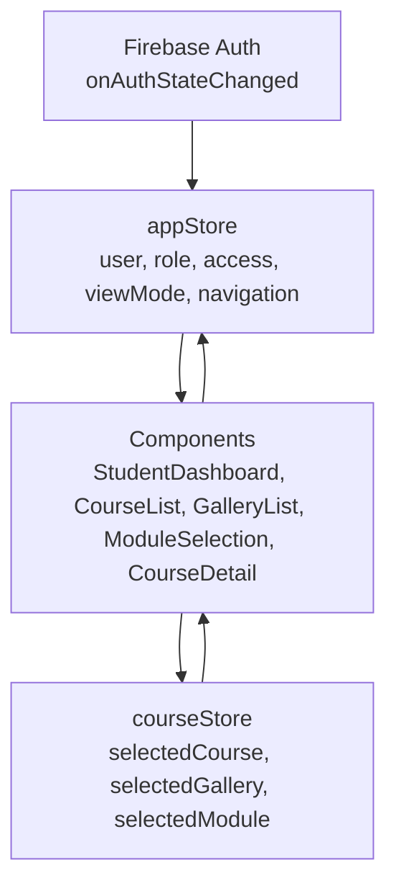
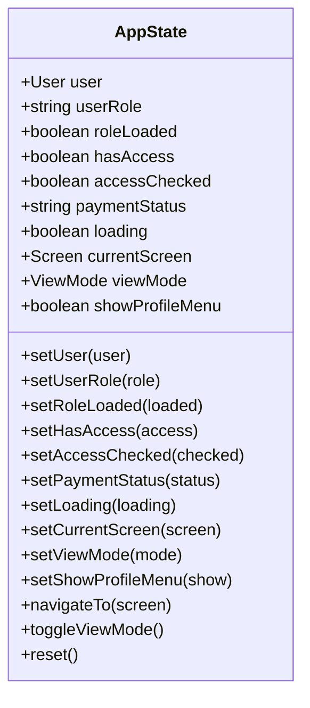
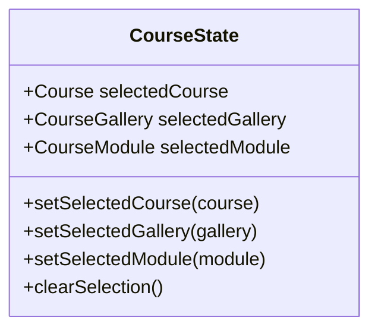
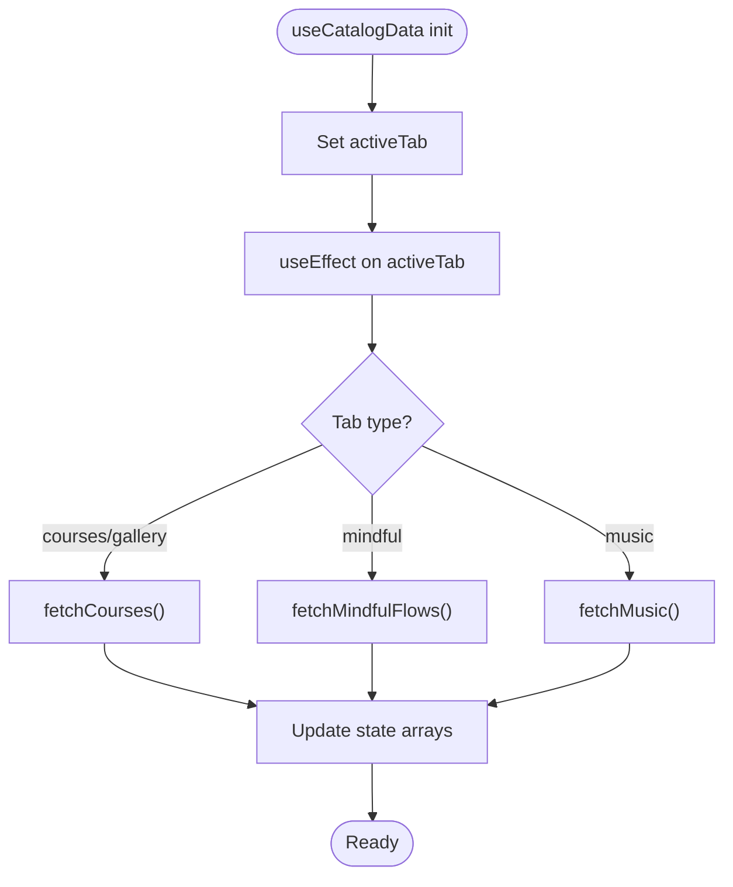
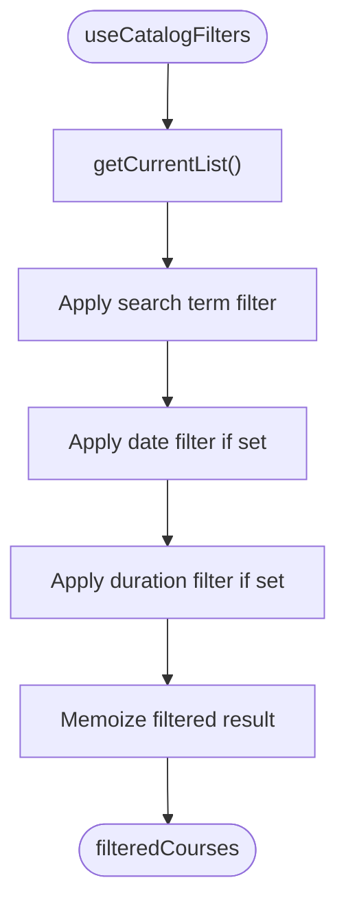
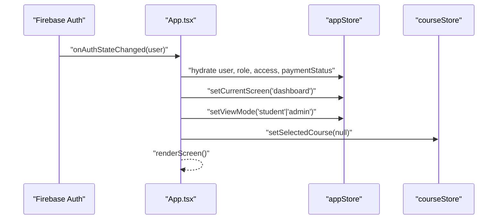
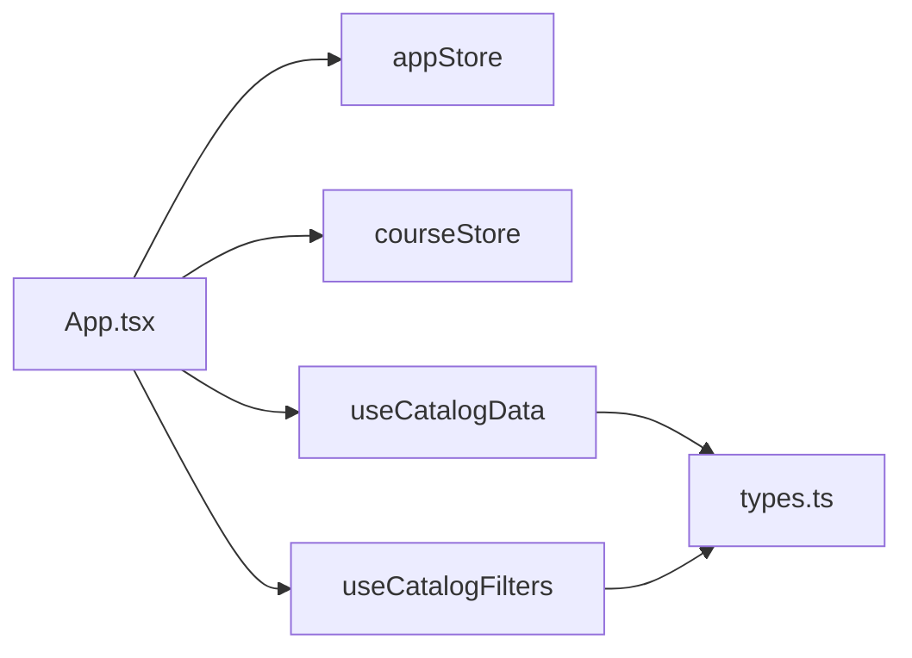

# State Management Architecture

<cite>
**Referenced Files in This Document**
- [App.tsx](file://App.tsx)
- [appStore.ts](file://lib/stores/appStore.ts)
- [courseStore.ts](file://lib/stores/courseStore.ts)
- [useCatalogData.ts](file://hooks/useCatalogData.ts)
- [useCatalogFilters.ts](file://hooks/useCatalogFilters.ts)
- [types.ts](file://types.ts)
</cite>

## Table of Contents
1. [Introduction](#introduction)
2. [Project Structure](#project-structure)
3. [Core Components](#core-components)
4. [Architecture Overview](#architecture-overview)
5. [Detailed Component Analysis](#detailed-component-analysis)
6. [Dependency Analysis](#dependency-analysis)
7. [Performance Considerations](#performance-considerations)
8. [Troubleshooting Guide](#troubleshooting-guide)
9. [Conclusion](#conclusion)

## Introduction
This document explains the state management architecture of the Fluentoria application, focusing on the dual-store design powered by Zustand. It covers:
- The appStore for global application state (authentication, navigation, view modes)
- The courseStore for course-related selections (selected course, gallery, module)
- Store initialization patterns, state update mechanisms, and subscription handling
- Custom hooks useCatalogData and useCatalogFilters for data fetching and filtering
- State persistence strategies, performance optimizations, and best practices
- Integration between local component state and global store state, including hydration during authentication and user role changes

## Project Structure
The state management is organized around two primary Zustand stores located under lib/stores, with supporting hooks and types:
- lib/stores/appStore.ts: Global application state and actions
- lib/stores/courseStore.ts: Course selection state and actions
- hooks/useCatalogData.ts: Data fetching and CRUD operations for catalog content
- hooks/useCatalogFilters.ts: Filtering logic for catalog lists
- types.ts: Shared type definitions for screens and view modes

**Diagram sources**
- [App.tsx](file://App.tsx#L40-L108)
- [appStore.ts](file://lib/stores/appStore.ts#L48-L81)
- [courseStore.ts](file://lib/stores/courseStore.ts#L14-L26)
- [useCatalogData.ts](file://hooks/useCatalogData.ts#L20-L156)
- [useCatalogFilters.ts](file://hooks/useCatalogFilters.ts#L8-L84)
- [types.ts](file://types.ts#L1-L25)

**Section sources**
- [App.tsx](file://App.tsx#L40-L108)
- [appStore.ts](file://lib/stores/appStore.ts#L48-L81)
- [courseStore.ts](file://lib/stores/courseStore.ts#L14-L26)
- [useCatalogData.ts](file://hooks/useCatalogData.ts#L20-L156)
- [useCatalogFilters.ts](file://hooks/useCatalogFilters.ts#L8-L84)
- [types.ts](file://types.ts#L1-L25)

## Core Components
- appStore: Manages authentication state, access checks, payment status, navigation, view mode, and UI flags. Provides actions to update state and navigate between screens.
- courseStore: Tracks the currently selected course, gallery, and module, enabling navigation-driven state transitions.
- useCatalogData: Local hook orchestrating data fetching and mutations for courses, mindful flows, and music, while maintaining local UI state (active tab, forms, views).
- useCatalogFilters: Local hook implementing search and filter logic with memoization for performance.

Key responsibilities:
- appStore: Hydration of user identity, role, and permissions; navigation control; view mode toggling; resetting state.
- courseStore: Selection state for course progression; clearing selections when navigating away.
- useCatalogData: Tab-aware data loading; save/delete/edit handlers; form open/close state.
- useCatalogFilters: Search term, date filters (recent/upcoming/past), duration filters (short/medium/long); click-outside dropdown behavior.

**Section sources**
- [appStore.ts](file://lib/stores/appStore.ts#L5-L33)
- [courseStore.ts](file://lib/stores/courseStore.ts#L4-L12)
- [useCatalogData.ts](file://hooks/useCatalogData.ts#L20-L156)
- [useCatalogFilters.ts](file://hooks/useCatalogFilters.ts#L8-L84)

## Architecture Overview
The application uses a dual-store architecture:
- Global appStore handles cross-cutting concerns (auth, navigation, view modes).
- Course-specific courseStore manages selection state for course progression.
- Hooks encapsulate domain logic for catalog data and filtering, operating independently but coordinating with stores for navigation and selection.

**Diagram sources**
- [App.tsx](file://App.tsx#L65-L108)
- [appStore.ts](file://lib/stores/appStore.ts#L48-L81)
- [courseStore.ts](file://lib/stores/courseStore.ts#L14-L26)

## Detailed Component Analysis

### appStore: Global Application State
Responsibilities:
- Authentication: user, userRole, roleLoaded, hasAccess, accessChecked, paymentStatus, loading
- Navigation: currentScreen, viewMode
- UI: showProfileMenu
- Actions: setUser, setUserRole, setRoleLoaded, setHasAccess, setAccessChecked, setPaymentStatus, setLoading, setCurrentScreen, setViewMode, setShowProfileMenu, navigateTo, toggleViewMode, reset

Initialization pattern:
- Uses Zustand’s create with an initial state object and action setters.
- Actions update state immutably via set.

Subscription handling:
- Components subscribe via useAppStore, receiving reactive updates when state changes.

State update mechanisms:
- Direct setters for primitive fields.
- navigateTo updates currentScreen and scrolls to top.
- toggleViewMode switches viewMode and resets currentScreen based on mode; guarded by userRole.

**Diagram sources**
- [appStore.ts](file://lib/stores/appStore.ts#L5-L33)

**Section sources**
- [appStore.ts](file://lib/stores/appStore.ts#L35-L81)
- [types.ts](file://types.ts#L1-L25)

### courseStore: Course Selection State
Responsibilities:
- Track selectedCourse, selectedGallery, selectedModule
- Provide setSelectedCourse, setSelectedGallery, setSelectedModule
- Clear selection with clearSelection

Usage:
- Components set selections after user actions (e.g., selecting a course navigates to gallery, selecting a gallery navigates to module selection).
- On navigation away from course flow, clearSelection can be used to reset state.

**Diagram sources**
- [courseStore.ts](file://lib/stores/courseStore.ts#L4-L12)

**Section sources**
- [courseStore.ts](file://lib/stores/courseStore.ts#L14-L26)

### useCatalogData: Catalog Data Operations
Responsibilities:
- Manage activeTab and local UI state (isFormOpen, editingCourse, viewingCourse)
- Fetch courses, mindful flows, and music lists
- Save course (add/update), delete course, edit/view handlers
- Compute current list based on activeTab (including gallery filtering)
- Trigger refetches after mutations

Patterns:
- useCallback for fetchers and handlers to avoid recreating functions on each render.
- useEffect to fetch data when activeTab changes.
- Conditional logic to branch between courses/gallery, mindful, and music.

**Diagram sources**
- [useCatalogData.ts](file://hooks/useCatalogData.ts#L51-L59)

**Section sources**
- [useCatalogData.ts](file://hooks/useCatalogData.ts#L20-L156)

### useCatalogFilters: Filtering Logic
Responsibilities:
- Maintain search term and filter dropdown states
- Filter current list by search term, date filter (recent/upcoming/past), and duration (short/medium/long)
- Click-outside behavior to close dropdowns
- Provide clearFilters

Patterns:
- useMemo to compute filteredCourses efficiently.
- useCallback for handlers to prevent unnecessary re-renders.
- useEffect for click-outside listener cleanup.

**Diagram sources**
- [useCatalogFilters.ts](file://hooks/useCatalogFilters.ts#L28-L63)

**Section sources**
- [useCatalogFilters.ts](file://hooks/useCatalogFilters.ts#L8-L84)

### Integration Between Stores and Hooks
- App.tsx subscribes to both stores and hydrates state on auth change:
  - Sets user, role, access, payment status, and viewMode
  - Redirects to dashboard when auth completes
  - Resets state and viewMode when user logs out
- Navigation actions:
  - Components call navigateTo from appStore to update currentScreen
  - courseStore is updated with selections during navigation (e.g., selectedCourse, selectedGallery, selectedModule)
- Hook-driven data operations:
  - useCatalogData triggers refetches after mutations and updates local UI state
  - useCatalogFilters consumes getCurrentList from useCatalogData to filter results

**Diagram sources**
- [App.tsx](file://App.tsx#L65-L108)
- [appStore.ts](file://lib/stores/appStore.ts#L58-L78)
- [courseStore.ts](file://lib/stores/courseStore.ts#L18-L20)

**Section sources**
- [App.tsx](file://App.tsx#L40-L108)
- [appStore.ts](file://lib/stores/appStore.ts#L48-L81)
- [courseStore.ts](file://lib/stores/courseStore.ts#L14-L26)

## Dependency Analysis
- App.tsx depends on:
  - appStore for authentication, navigation, and view mode
  - courseStore for selection state
  - useCatalogData and useCatalogFilters for data and filtering
- Types are shared via types.ts for screens and view modes
- No circular dependencies observed among stores and hooks

**Diagram sources**
- [App.tsx](file://App.tsx#L30-L61)
- [useCatalogData.ts](file://hooks/useCatalogData.ts#L20-L156)
- [useCatalogFilters.ts](file://hooks/useCatalogFilters.ts#L8-L84)
- [types.ts](file://types.ts#L1-L25)

**Section sources**
- [App.tsx](file://App.tsx#L30-L61)
- [types.ts](file://types.ts#L1-L25)

## Performance Considerations
- Memoization:
  - useCatalogFilters uses useMemo to compute filtered results, preventing unnecessary recomputation when inputs are unchanged.
  - useCatalogData uses useCallback for fetchers and handlers to avoid recreating functions on each render.
- Efficient state updates:
  - appStore actions use immutable updates via set to minimize re-renders.
  - courseStore setters update only the targeted field.
- Rendering control:
  - App.tsx uses Suspense boundaries to lazy-load route components, reducing initial bundle size and improving perceived performance.
- Avoiding redundant fetches:
  - useCatalogData fetches data only when activeTab changes, and refetches after mutations.

Best practices:
- Keep store state flat and granular to reduce re-renders.
- Use callbacks and memoization for derived computations.
- Prefer direct field updates in actions rather than deep merges.
- Clear selection state when leaving course flows to prevent stale references.

[No sources needed since this section provides general guidance]

## Troubleshooting Guide
Common issues and resolutions:
- Stale navigation state after logout:
  - Ensure appStore.reset or explicit state resets are called on sign out to clear user and role state.
- Role not updating:
  - Verify onAuthStateChanged logic updates userRole and forces admin role when applicable.
- Access blocked unexpectedly:
  - Confirm accessChecked and hasAccess flags are properly set after checking user access.
- Course selection not persisting:
  - Ensure setSelectedCourse, setSelectedGallery, and setSelectedModule are called on selection events.
- Filters not applying:
  - Confirm getCurrentList returns the correct list for the active tab and that useMemo inputs are stable.

**Section sources**
- [App.tsx](file://App.tsx#L94-L103)
- [appStore.ts](file://lib/stores/appStore.ts#L67-L78)
- [courseStore.ts](file://lib/stores/courseStore.ts#L18-L20)
- [useCatalogFilters.ts](file://hooks/useCatalogFilters.ts#L28-L63)

## Conclusion
The Fluentoria state management architecture leverages a clean dual-store design:
- appStore centralizes global state and navigation, integrating tightly with Firebase authentication and user roles.
- courseStore encapsulates course progression selections, enabling predictable navigation-driven state transitions.
- useCatalogData and useCatalogFilters provide efficient, local data operations and filtering with memoization and callback optimizations.
Together, these patterns deliver a maintainable, performant, and scalable state layer suitable for both student and admin experiences.