# Integration Patterns

<cite>
**Referenced Files in This Document**
- [firebase.ts](file://lib/firebase.ts)
- [media.ts](file://lib/media.ts)
- [video.ts](file://lib/video.ts)
- [gamification.ts](file://lib/gamification.ts)
- [attendance.ts](file://lib/attendance.ts)
- [AsaasPayment.tsx](file://components/AsaasPayment.tsx)
- [create-asaas-customer.js](file://netlify/functions/create-asaas-customer.js)
- [process-asaas-payment.js](file://netlify/functions/process-asaas-payment.js)
- [check-payment-status.js](file://netlify/functions/check-payment-status.js)
- [MindfulFlow.tsx](file://components/MindfulFlow.tsx)
- [MediaUpload.tsx](file://components/MediaUpload.tsx)
- [Achievements.tsx](file://components/Achievements.tsx)
- [AttendanceTracker.tsx](file://components/AttendanceTracker.tsx)
- [types.ts](file://types.ts)
</cite>

## Table of Contents
1. [Introduction](#introduction)
2. [Project Structure](#project-structure)
3. [Core Components](#core-components)
4. [Architecture Overview](#architecture-overview)
5. [Detailed Component Analysis](#detailed-component-analysis)
6. [Dependency Analysis](#dependency-analysis)
7. [Performance Considerations](#performance-considerations)
8. [Troubleshooting Guide](#troubleshooting-guide)
9. [Conclusion](#conclusion)
10. [Appendices](#appendices)

## Introduction
This document describes integration patterns for Fluentoria’s third-party services and external systems. It covers:
- Firebase ecosystem integration (Authentication, Firestore, Cloud Functions, Storage)
- Asaas payment processing integration with webhook handling and status synchronization
- YouTube and Google Drive video integration patterns, media upload workflows, and content delivery optimization
- Mindful Flow and Music integration patterns
- Achievement system integration with gamification APIs
- Attendance tracking with external calendar services
- Error handling strategies, retry mechanisms, and fallback patterns
- Configuration management for different environments and service credentials

## Project Structure
The integration surface spans client-side UI components, shared libraries for Firebase and third-party utilities, and serverless functions for secure payment orchestration.

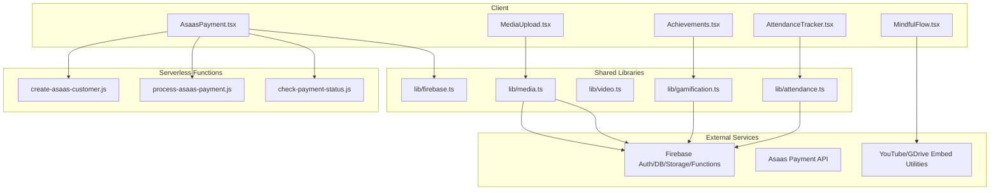

**Diagram sources**
- [AsaasPayment.tsx](file://components/AsaasPayment.tsx#L1-L491)
- [MediaUpload.tsx](file://components/MediaUpload.tsx#L1-L589)
- [MindfulFlow.tsx](file://components/MindfulFlow.tsx#L1-L71)
- [Achievements.tsx](file://components/Achievements.tsx#L1-L346)
- [AttendanceTracker.tsx](file://components/AttendanceTracker.tsx#L1-L249)
- [firebase.ts](file://lib/firebase.ts#L1-L25)
- [media.ts](file://lib/media.ts#L1-L369)
- [video.ts](file://lib/video.ts#L1-L149)
- [gamification.ts](file://lib/gamification.ts#L1-L349)
- [attendance.ts](file://lib/attendance.ts#L1-L177)
- [create-asaas-customer.js](file://netlify/functions/create-asaas-customer.js#L1-L146)
- [process-asaas-payment.js](file://netlify/functions/process-asaas-payment.js#L1-L121)
- [check-payment-status.js](file://netlify/functions/check-payment-status.js#L1-L152)

**Section sources**
- [firebase.ts](file://lib/firebase.ts#L1-L25)
- [media.ts](file://lib/media.ts#L1-L369)
- [video.ts](file://lib/video.ts#L1-L149)
- [gamification.ts](file://lib/gamification.ts#L1-L349)
- [attendance.ts](file://lib/attendance.ts#L1-L177)
- [AsaasPayment.tsx](file://components/AsaasPayment.tsx#L1-L491)
- [create-asaas-customer.js](file://netlify/functions/create-asaas-customer.js#L1-L146)
- [process-asaas-payment.js](file://netlify/functions/process-asaas-payment.js#L1-L121)
- [check-payment-status.js](file://netlify/functions/check-payment-status.js#L1-L152)
- [MindfulFlow.tsx](file://components/MindfulFlow.tsx#L1-L71)
- [MediaUpload.tsx](file://components/MediaUpload.tsx#L1-L589)
- [Achievements.tsx](file://components/Achievements.tsx#L1-L346)
- [AttendanceTracker.tsx](file://components/AttendanceTracker.tsx#L1-L249)
- [types.ts](file://types.ts#L1-L125)

## Core Components
- Firebase initialization and exports for Auth, Firestore, Storage, and Functions
- Media upload pipeline with resumable uploads, metadata persistence, and deletion
- Video utilities for YouTube and Google Drive embed URL generation and thumbnail extraction
- Gamification engine for XP, leveling, achievements, and leaderboard computation
- Attendance logging and calendar-style activity visualization
- Asaas payment orchestration via Netlify functions with Firebase JWT verification
- UI components for Mindful Flow, Media Upload, Achievements, and Attendance

**Section sources**
- [firebase.ts](file://lib/firebase.ts#L1-L25)
- [media.ts](file://lib/media.ts#L1-L369)
- [video.ts](file://lib/video.ts#L1-L149)
- [gamification.ts](file://lib/gamification.ts#L1-L349)
- [attendance.ts](file://lib/attendance.ts#L1-L177)
- [AsaasPayment.tsx](file://components/AsaasPayment.tsx#L1-L491)
- [MindfulFlow.tsx](file://components/MindfulFlow.tsx#L1-L71)
- [MediaUpload.tsx](file://components/MediaUpload.tsx#L1-L589)
- [Achievements.tsx](file://components/Achievements.tsx#L1-L346)
- [AttendanceTracker.tsx](file://components/AttendanceTracker.tsx#L1-L249)

## Architecture Overview
The system integrates three primary layers:
- Client UI: Renders interactive experiences and orchestrates calls to shared libraries and serverless functions
- Shared Libraries: Encapsulate Firebase SDK usage, media workflows, video utilities, gamification, and attendance
- Serverless Functions: Provide secure, authenticated proxies to Asaas with Firebase JWT verification and CORS handling

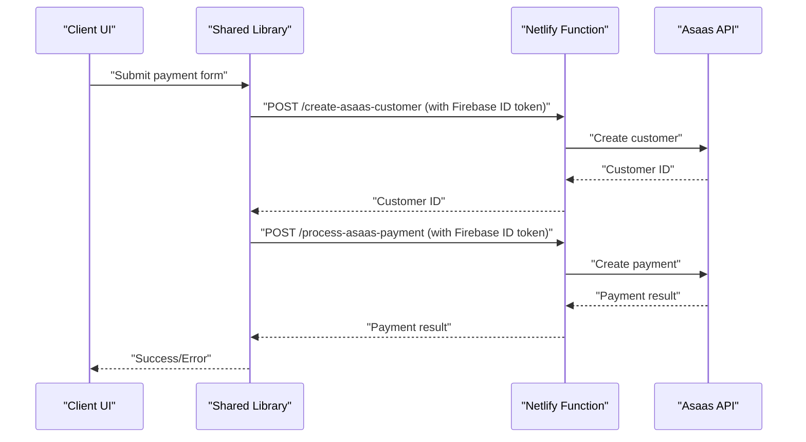

**Diagram sources**
- [AsaasPayment.tsx](file://components/AsaasPayment.tsx#L86-L181)
- [create-asaas-customer.js](file://netlify/functions/create-asaas-customer.js#L20-L133)
- [process-asaas-payment.js](file://netlify/functions/process-asaas-payment.js#L20-L107)

## Detailed Component Analysis

### Firebase Ecosystem Integration
- Initialization and exports for Auth, Firestore, Storage, and Functions
- Environment variables loaded from Vite meta env for configuration
- Firestore configured with persistent local cache and multi-tab manager

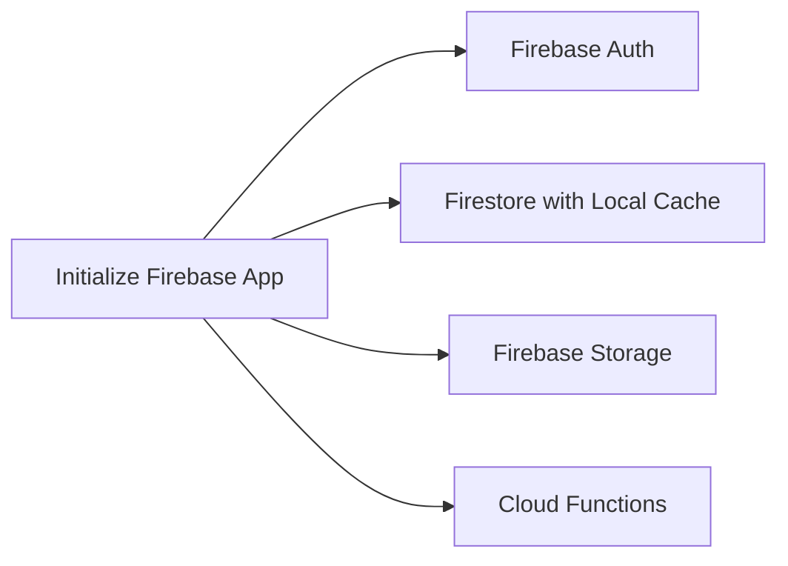

**Diagram sources**
- [firebase.ts](file://lib/firebase.ts#L1-L25)

**Section sources**
- [firebase.ts](file://lib/firebase.ts#L1-L25)

### Media Upload and Content Delivery
- Resumable uploads to Firebase Storage with progress callbacks
- Metadata persisted to Firestore collection with timestamps and derived file type
- Support material upload constrained by type and size
- Cover image upload for courses
- Deletion of files and associated Firestore documents
- File size formatting and grouping utilities

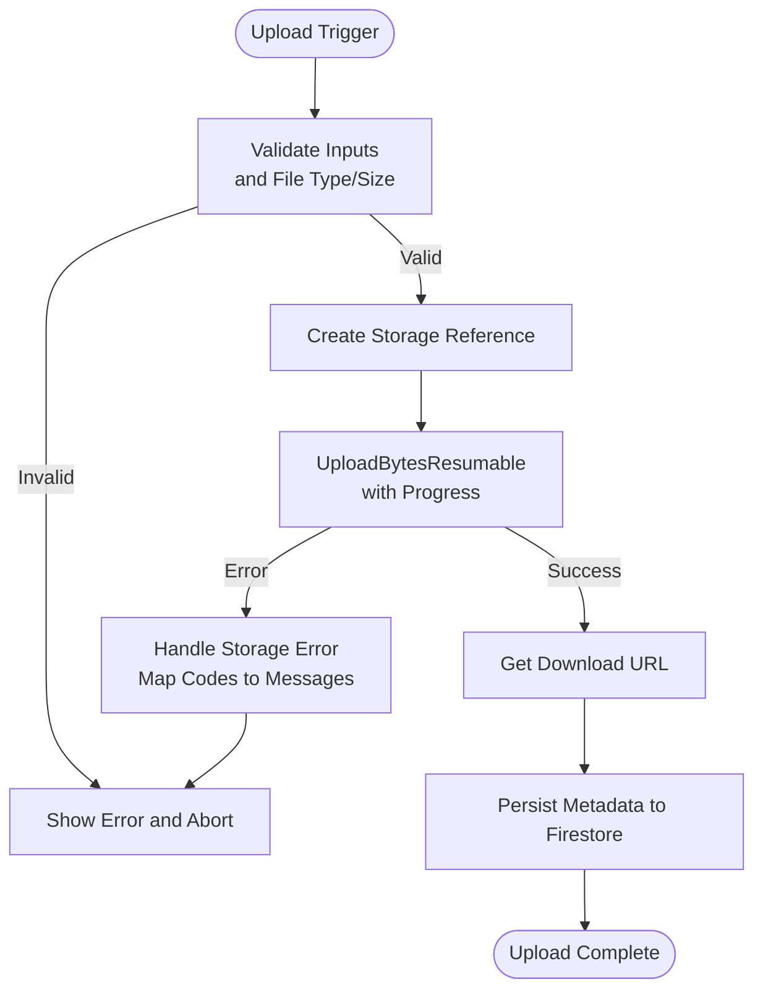

**Diagram sources**
- [media.ts](file://lib/media.ts#L8-L117)
- [media.ts](file://lib/media.ts#L301-L368)

**Section sources**
- [media.ts](file://lib/media.ts#L1-L369)

### YouTube and Google Drive Integration
- URL parsing and normalization for YouTube and Google Drive
- Embed URL generation and thumbnail retrieval
- Duration helpers for HTML5 video elements

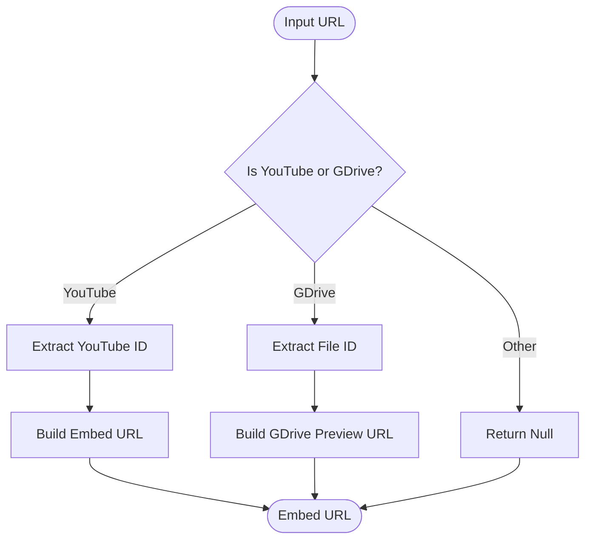

**Diagram sources**
- [video.ts](file://lib/video.ts#L12-L107)

**Section sources**
- [video.ts](file://lib/video.ts#L1-L149)

### Asaas Payment Processing Integration
- Client-side payment form collects personal and card details
- Creates Firebase ID token and calls Netlify functions
- Customer creation and payment processing proxied through functions
- Payment status check against Asaas API filtered by customer and status
- JWT verification against Google JWK Set for Firebase project

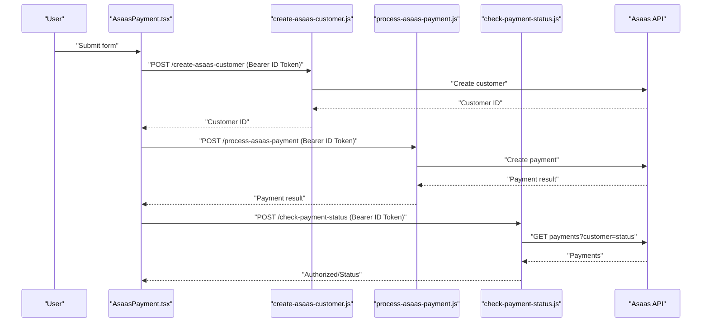

**Diagram sources**
- [AsaasPayment.tsx](file://components/AsaasPayment.tsx#L86-L244)
- [create-asaas-customer.js](file://netlify/functions/create-asaas-customer.js#L20-L133)
- [process-asaas-payment.js](file://netlify/functions/process-asaas-payment.js#L20-L107)
- [check-payment-status.js](file://netlify/functions/check-payment-status.js#L20-L138)

**Section sources**
- [AsaasPayment.tsx](file://components/AsaasPayment.tsx#L1-L491)
- [create-asaas-customer.js](file://netlify/functions/create-asaas-customer.js#L1-L146)
- [process-asaas-payment.js](file://netlify/functions/process-asaas-payment.js#L1-L121)
- [check-payment-status.js](file://netlify/functions/check-payment-status.js#L1-L152)

### Mindful Flow and Music Integration
- Mindful Flow component renders session cards and featured content
- Music integration is present in the UI types and screens but no dedicated library or component is shown in the provided files

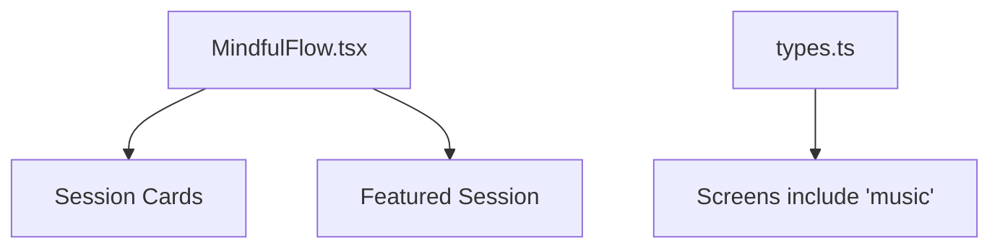

**Diagram sources**
- [MindfulFlow.tsx](file://components/MindfulFlow.tsx#L1-L71)
- [types.ts](file://types.ts#L1-L25)

**Section sources**
- [MindfulFlow.tsx](file://components/MindfulFlow.tsx#L1-L71)
- [types.ts](file://types.ts#L1-L25)

### Achievement System Integration
- XP calculation, leveling, streak bonuses, and achievement unlocking
- Achievement conditions evaluated against student progress
- Leaderboard computed from Firestore documents
- Default achievements seeded for initial setup

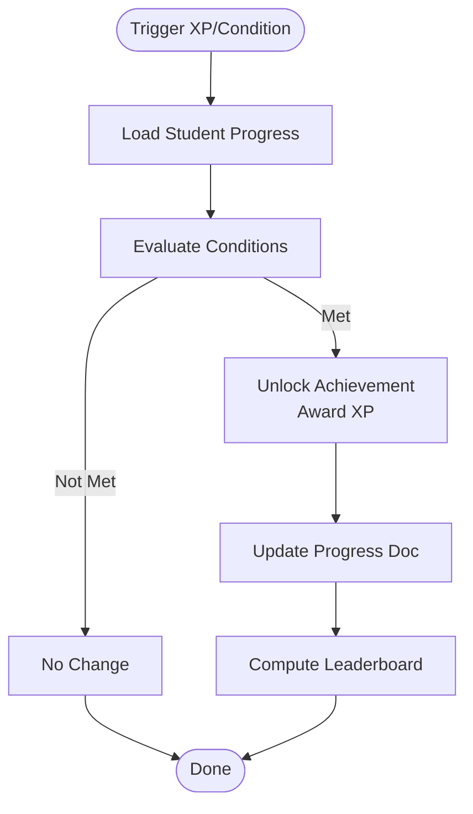

**Diagram sources**
- [gamification.ts](file://lib/gamification.ts#L232-L275)
- [gamification.ts](file://lib/gamification.ts#L278-L302)

**Section sources**
- [gamification.ts](file://lib/gamification.ts#L1-L349)

### Attendance Tracking Integration
- Logs activities to Firestore with timestamps and metadata
- Computes streaks and aggregates stats over recent activities
- Visualizes activity calendar over the last 30 days

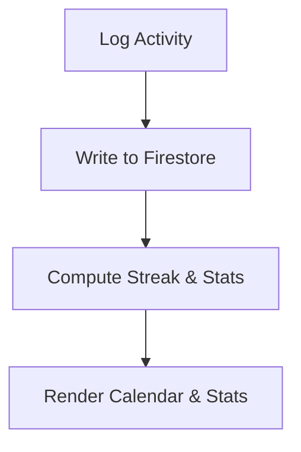

**Diagram sources**
- [attendance.ts](file://lib/attendance.ts#L7-L62)
- [attendance.ts](file://lib/attendance.ts#L122-L161)

**Section sources**
- [attendance.ts](file://lib/attendance.ts#L1-L177)

### UI Components and Workflows
- MediaUpload: Drag-and-drop, preview, recording, progress, and deletion
- Achievements: Unlocked vs locked display, progress bars, leaderboard table
- AttendanceTracker: Stats grid, activity calendar, recent activities list

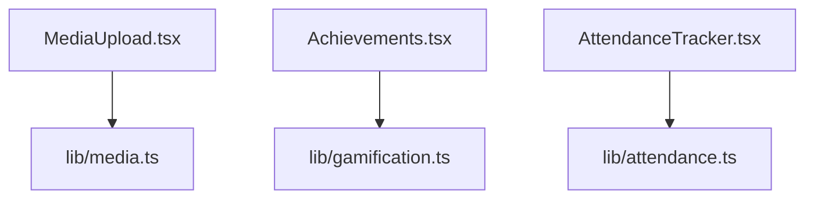

**Diagram sources**
- [MediaUpload.tsx](file://components/MediaUpload.tsx#L1-L589)
- [Achievements.tsx](file://components/Achievements.tsx#L1-L346)
- [AttendanceTracker.tsx](file://components/AttendanceTracker.tsx#L1-L249)
- [media.ts](file://lib/media.ts#L1-L369)
- [gamification.ts](file://lib/gamification.ts#L1-L349)
- [attendance.ts](file://lib/attendance.ts#L1-L177)

**Section sources**
- [MediaUpload.tsx](file://components/MediaUpload.tsx#L1-L589)
- [Achievements.tsx](file://components/Achievements.tsx#L1-L346)
- [AttendanceTracker.tsx](file://components/AttendanceTracker.tsx#L1-L249)

## Dependency Analysis
- Client components depend on shared libraries for Firebase operations and utility functions
- AsaasPayment depends on Firebase Auth for ID tokens and Netlify functions for secure API calls
- Netlify functions depend on Asaas API and Firebase JWT verification
- Firestore collections are used across gamification, attendance, and media metadata

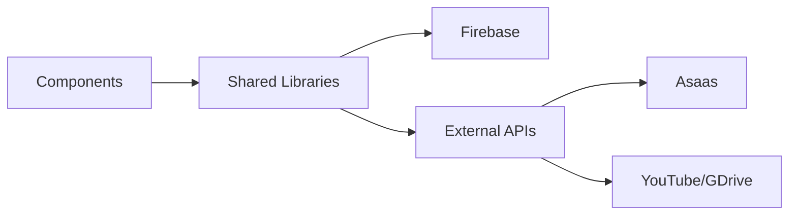

**Diagram sources**
- [AsaasPayment.tsx](file://components/AsaasPayment.tsx#L1-L491)
- [media.ts](file://lib/media.ts#L1-L369)
- [gamification.ts](file://lib/gamification.ts#L1-L349)
- [attendance.ts](file://lib/attendance.ts#L1-L177)
- [video.ts](file://lib/video.ts#L1-L149)
- [create-asaas-customer.js](file://netlify/functions/create-asaas-customer.js#L1-L146)
- [process-asaas-payment.js](file://netlify/functions/process-asaas-payment.js#L1-L121)
- [check-payment-status.js](file://netlify/functions/check-payment-status.js#L1-L152)

**Section sources**
- [AsaasPayment.tsx](file://components/AsaasPayment.tsx#L1-L491)
- [media.ts](file://lib/media.ts#L1-L369)
- [gamification.ts](file://lib/gamification.ts#L1-L349)
- [attendance.ts](file://lib/attendance.ts#L1-L177)
- [video.ts](file://lib/video.ts#L1-L149)
- [create-asaas-customer.js](file://netlify/functions/create-asaas-customer.js#L1-L146)
- [process-asaas-payment.js](file://netlify/functions/process-asaas-payment.js#L1-L121)
- [check-payment-status.js](file://netlify/functions/check-payment-status.js#L1-L152)

## Performance Considerations
- Use resumable uploads for large media to improve reliability and reduce bandwidth waste
- Cache Firestore queries with local persistence to minimize network usage
- Debounce and batch UI updates during progress reporting
- Optimize video thumbnails and embed URLs for faster rendering
- Limit leaderboard and recent activity fetch sizes to reduce payload

## Troubleshooting Guide
Common issues and resolutions:
- Firebase Storage CORS errors: Configure CORS rules or run the suggested gsutil command
- Unauthorized or missing ID token in Netlify functions: Ensure client sends a valid Firebase ID token
- Asaas API errors: Inspect error payloads and HTTP status codes returned by functions
- Upload failures: Validate file types and sizes; handle storage error codes appropriately

**Section sources**
- [media.ts](file://lib/media.ts#L54-L77)
- [create-asaas-customer.js](file://netlify/functions/create-asaas-customer.js#L44-L62)
- [process-asaas-payment.js](file://netlify/functions/process-asaas-payment.js#L44-L62)
- [check-payment-status.js](file://netlify/functions/check-payment-status.js#L44-L62)

## Conclusion
Fluentoria’s integration patterns leverage Firebase for core data and identity services, Netlify functions for secure payment orchestration, and utility libraries for media and video workflows. The system emphasizes resilient uploads, gamified engagement, and attendance insights while maintaining clear separation of concerns between UI, shared logic, and serverless backend.

## Appendices

### Configuration Management
- Firebase configuration is environment-driven via Vite meta env variables
- Asaas credentials are managed via environment variables in Netlify functions
- Ensure separate configurations for development, staging, and production environments

**Section sources**
- [firebase.ts](file://lib/firebase.ts#L7-L14)
- [create-asaas-customer.js](file://netlify/functions/create-asaas-customer.js#L76-L77)
- [process-asaas-payment.js](file://netlify/functions/process-asaas-payment.js#L67-L68)
- [check-payment-status.js](file://netlify/functions/check-payment-status.js#L76-L77)