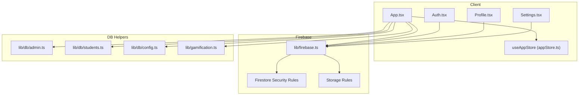
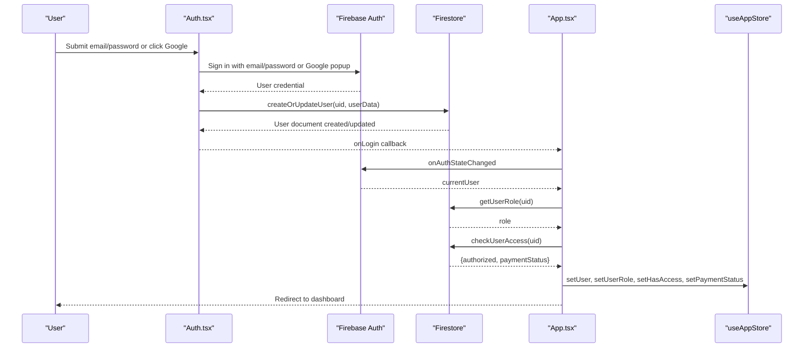
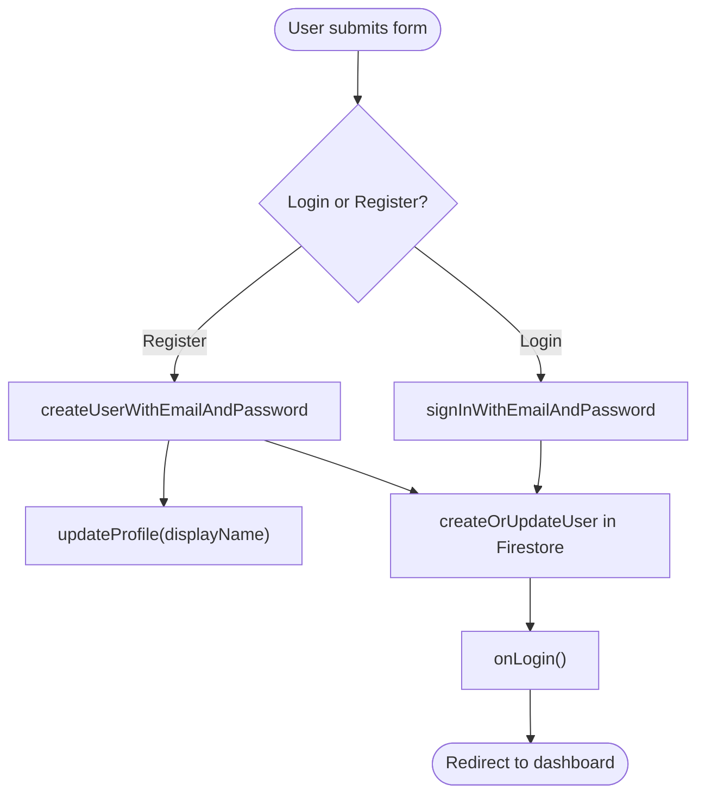
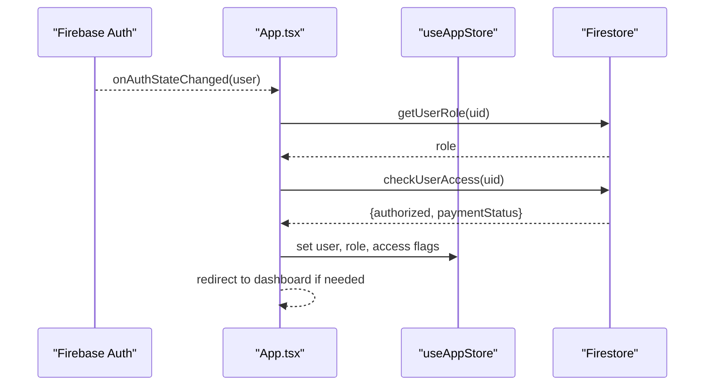
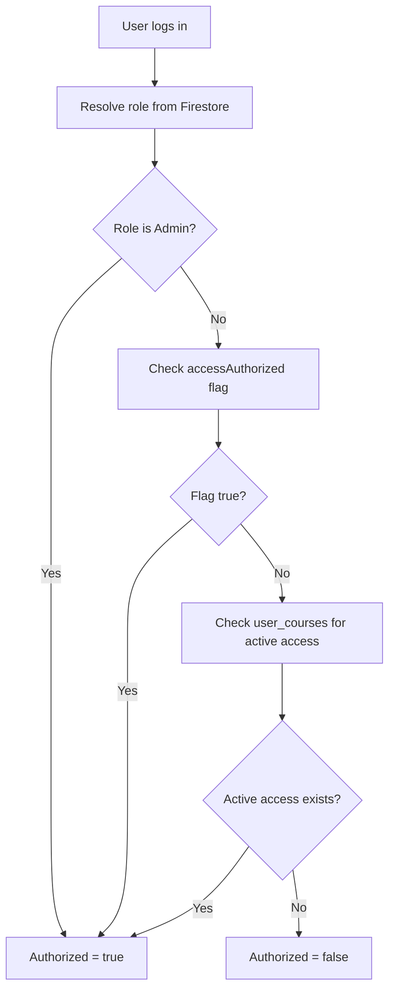
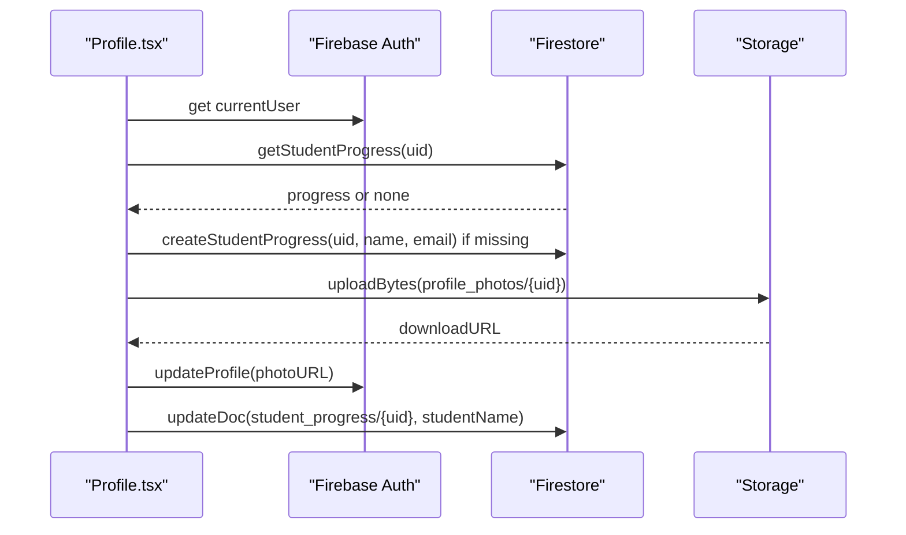
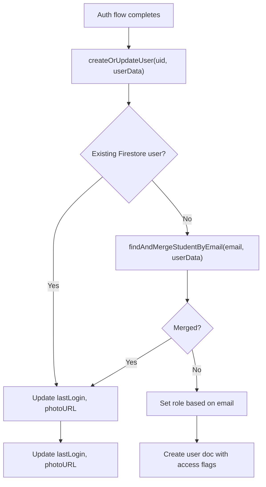
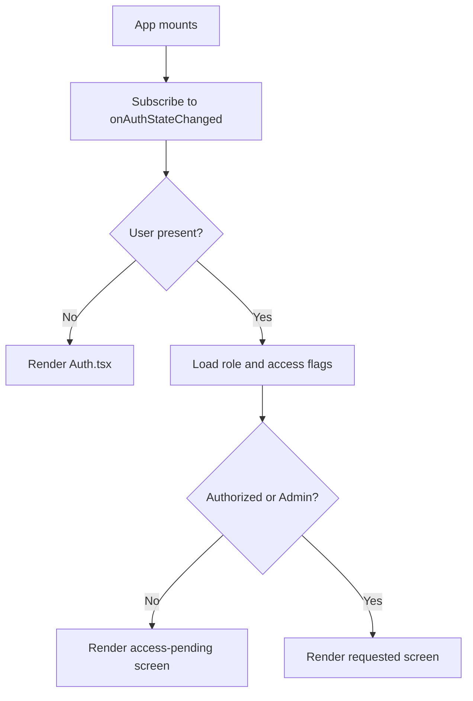
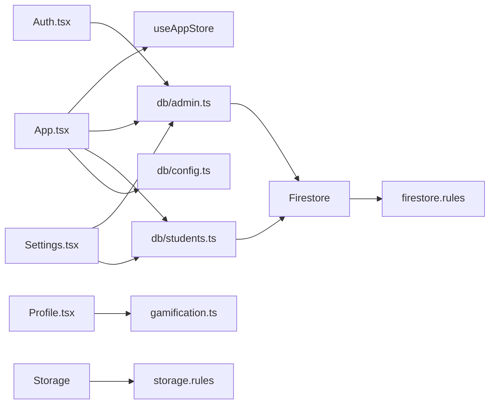

# Authentication & User Management

<cite>
**Referenced Files in This Document**
- [firebase.ts](file://lib/firebase.ts)
- [Auth.tsx](file://components/Auth.tsx)
- [App.tsx](file://App.tsx)
- [appStore.ts](file://lib/stores/appStore.ts)
- [types.ts](file://types.ts)
- [db/index.ts](file://lib/db/index.ts)
- [db/config.ts](file://lib/db/config.ts)
- [db/admin.ts](file://lib/db/admin.ts)
- [db/students.ts](file://lib/db/students.ts)
- [gamification.ts](file://lib/gamification.ts)
- [Profile.tsx](file://components/Profile.tsx)
- [Settings.tsx](file://components/Settings.tsx)
- [firestore.rules](file://firestore.rules)
- [storage.rules](file://storage.rules)
</cite>

## Table of Contents
1. [Introduction](#introduction)
2. [Project Structure](#project-structure)
3. [Core Components](#core-components)
4. [Architecture Overview](#architecture-overview)
5. [Detailed Component Analysis](#detailed-component-analysis)
6. [Dependency Analysis](#dependency-analysis)
7. [Performance Considerations](#performance-considerations)
8. [Troubleshooting Guide](#troubleshooting-guide)
9. [Conclusion](#conclusion)

## Introduction
This document explains the authentication and user management system built with Firebase Authentication and Firestore. It covers:
- Email/password and Google OAuth flows
- User registration and profile management
- Session lifecycle and real-time state updates
- Role-based access control (Student vs Admin)
- Permission hierarchies enforced by Firestore Security Rules
- Password reset and account verification workflows
- Practical examples of authentication guards and protected routes
- Real-time user status updates and access control checks

## Project Structure
The authentication system spans several layers:
- Firebase initialization and client SDK wiring
- UI components for login and profile
- Centralized state management for user roles and permissions
- Backend helpers for user creation, role resolution, and access checks
- Firestore Security Rules enforcing access policies
- Storage rules for media uploads

**Diagram sources**
- [App.tsx](file://App.tsx#L24-L108)
- [Auth.tsx](file://components/Auth.tsx#L1-L265)
- [Profile.tsx](file://components/Profile.tsx#L1-L386)
- [Settings.tsx](file://components/Settings.tsx#L1-L915)
- [appStore.ts](file://lib/stores/appStore.ts#L1-L82)
- [firebase.ts](file://lib/firebase.ts#L1-L25)
- [db/admin.ts](file://lib/db/admin.ts#L1-L302)
- [db/students.ts](file://lib/db/students.ts#L1-L285)
- [db/config.ts](file://lib/db/config.ts#L1-L19)
- [gamification.ts](file://lib/gamification.ts#L1-L349)
- [firestore.rules](file://firestore.rules#L1-L90)
- [storage.rules](file://storage.rules#L1-L11)

**Section sources**
- [firebase.ts](file://lib/firebase.ts#L1-L25)
- [App.tsx](file://App.tsx#L24-L108)
- [db/index.ts](file://lib/db/index.ts#L1-L38)

## Core Components
- Firebase initialization and SDK exports for auth, Firestore, Storage, Cloud Functions
- Authentication UI component supporting email/password and Google OAuth
- Application shell orchestrating auth state, role resolution, and access checks
- Centralized store for user state, role, access flags, and navigation
- Database helpers for user creation, role retrieval, access checks, and admin operations
- Firestore Security Rules and Storage Rules enforcing access policies
- Profile and Settings components for user data and administrative controls

**Section sources**
- [firebase.ts](file://lib/firebase.ts#L1-L25)
- [Auth.tsx](file://components/Auth.tsx#L1-L265)
- [App.tsx](file://App.tsx#L40-L108)
- [appStore.ts](file://lib/stores/appStore.ts#L1-L82)
- [db/admin.ts](file://lib/db/admin.ts#L1-L302)
- [db/students.ts](file://lib/db/students.ts#L1-L285)
- [firestore.rules](file://firestore.rules#L1-L90)
- [storage.rules](file://storage.rules#L1-L11)

## Architecture Overview
The system integrates Firebase Authentication with Firestore to maintain synchronized user profiles and access control. The App component listens to auth state changes and resolves user roles and permissions. UI components render based on role and access flags, while Firestore Security Rules enforce read/write boundaries.

**Diagram sources**
- [Auth.tsx](file://components/Auth.tsx#L21-L92)
- [db/admin.ts](file://lib/db/admin.ts#L20-L59)
- [App.tsx](file://App.tsx#L65-L104)
- [appStore.ts](file://lib/stores/appStore.ts#L48-L82)

## Detailed Component Analysis

### Firebase Initialization
- Initializes Firebase app and exports auth, Firestore, Storage, and Cloud Functions clients
- Enables persistence and multi-tab cache for Firestore

**Section sources**
- [firebase.ts](file://lib/firebase.ts#L1-L25)

### Authentication UI (Email/Password and Google OAuth)
- Handles form submission for login and registration
- On registration, sets display name and creates/updates user in Firestore
- On Google OAuth, opens a popup, merges or creates user record, and proceeds to dashboard
- Provides localized error feedback for common auth errors

**Diagram sources**
- [Auth.tsx](file://components/Auth.tsx#L21-L60)
- [Auth.tsx](file://components/Auth.tsx#L62-L92)
- [db/admin.ts](file://lib/db/admin.ts#L20-L59)

**Section sources**
- [Auth.tsx](file://components/Auth.tsx#L1-L265)
- [db/admin.ts](file://lib/db/admin.ts#L20-L59)

### Session Management and Real-Time Updates
- Subscribes to auth state changes; on sign-in, loads role and access flags once per session
- Forces admin role for configured admin emails
- Redirects authenticated users to dashboard; unauthenticated users see Auth UI
- Exposes a logout handler

**Diagram sources**
- [App.tsx](file://App.tsx#L65-L104)
- [db/admin.ts](file://lib/db/admin.ts#L62-L122)
- [appStore.ts](file://lib/stores/appStore.ts#L48-L82)

**Section sources**
- [App.tsx](file://App.tsx#L65-L108)
- [db/admin.ts](file://lib/db/admin.ts#L62-L122)
- [appStore.ts](file://lib/stores/appStore.ts#L1-L82)

### Role-Based Access Control (RBAC)
- Roles: Student and Admin
- Role determination:
  - Admin emails are granted Admin role during user creation
  - All other users are Students
  - Admins always have access; Students require either explicit authorization or active course access
- Access enforcement:
  - UI blocks non-admin unauthorized users
  - Firestore Security Rules restrict reads/writes based on ownership and role
  - Storage Rules require authentication for read/write

**Diagram sources**
- [db/admin.ts](file://lib/db/admin.ts#L62-L122)
- [db/admin.ts](file://lib/db/admin.ts#L80-L122)
- [firestore.rules](file://firestore.rules#L10-L19)
- [firestore.rules](file://firestore.rules#L21-L27)

**Section sources**
- [db/admin.ts](file://lib/db/admin.ts#L62-L122)
- [App.tsx](file://App.tsx#L175-L238)
- [firestore.rules](file://firestore.rules#L10-L19)
- [firestore.rules](file://firestore.rules#L21-L27)
- [storage.rules](file://storage.rules#L1-L11)

### User Registration and Profile Management
- Registration:
  - Email/password: Creates user, sets display name, persists user record in Firestore
  - Google OAuth: Opens popup, merges with existing student if email matches, persists user record
- Profile:
  - Displays avatar, name, email, and progress stats
  - Allows editing display name and uploading/removing profile photos
  - Progress initialized on-demand and refreshed periodically

**Diagram sources**
- [Profile.tsx](file://components/Profile.tsx#L20-L45)
- [Profile.tsx](file://components/Profile.tsx#L60-L85)
- [Profile.tsx](file://components/Profile.tsx#L87-L151)

**Section sources**
- [Auth.tsx](file://components/Auth.tsx#L21-L92)
- [db/admin.ts](file://lib/db/admin.ts#L20-L59)
- [Profile.tsx](file://components/Profile.tsx#L1-L386)
- [gamification.ts](file://lib/gamification.ts#L43-L98)

### Data Synchronization Between Authentication and Firestore
- User creation/upsert:
  - Determines role based on email
  - Sets access flags and timestamps
  - Merges Google user data with existing student records when applicable
- Role enforcement:
  - Admin emails are forced to Admin role on subsequent logins
- Access control:
  - Access determined by explicit flag or active course mapping

**Diagram sources**
- [db/admin.ts](file://lib/db/admin.ts#L20-L59)
- [db/students.ts](file://lib/db/students.ts#L111-L144)
- [db/admin.ts](file://lib/db/admin.ts#L124-L160)

**Section sources**
- [db/admin.ts](file://lib/db/admin.ts#L20-L59)
- [db/students.ts](file://lib/db/students.ts#L111-L144)
- [db/admin.ts](file://lib/db/admin.ts#L124-L160)

### Security Rules Implementation
- Firestore:
  - Users collection: authenticated read; self-write; admin-write; admin-delete
  - Admin emails: admin-only read/write
  - Courses, mindful_flow, music: authenticated read; admin write
  - Student completions: authenticated read/create; admin write/delete
  - Student progress: owner or admin read/write
  - Student activities: owner or admin read/create; admin write/delete
  - User courses: owner/admin read; admin write
- Storage:
  - Authenticated read/write; size limits enforced

**Section sources**
- [firestore.rules](file://firestore.rules#L1-L90)
- [storage.rules](file://storage.rules#L1-L11)

### Password Reset and Account Verification Workflows
- Password reset:
  - The Auth UI includes a “Forgot your password?” link; the underlying mechanism relies on Firebase Authentication’s standard APIs
- Account verification:
  - Not explicitly implemented in the provided code; typical Firebase verification flows would involve sending a verification email and redirecting users to a verification page

**Section sources**
- [Auth.tsx](file://components/Auth.tsx#L253-L257)

### Practical Examples: Authentication Guards and Protected Routes
- Authentication guard:
  - App.tsx subscribes to auth state and redirects to Auth UI when signed out
- Protected routes:
  - Unauthorized non-admin users are shown a dedicated access-pending screen
- Role-based navigation:
  - Admins can toggle view mode to access admin screens

**Diagram sources**
- [App.tsx](file://App.tsx#L65-L108)
- [App.tsx](file://App.tsx#L175-L238)

**Section sources**
- [App.tsx](file://App.tsx#L65-L108)
- [App.tsx](file://App.tsx#L175-L238)
- [appStore.ts](file://lib/stores/appStore.ts#L67-L78)

### User State Management Throughout the Application
- Central store tracks:
  - Current user, role, access flags, payment status, loading state, navigation, and view mode
- Actions:
  - Setters for user state and navigation
  - Toggle view mode restricted to Admins
  - Reset store to initial state

**Section sources**
- [appStore.ts](file://lib/stores/appStore.ts#L1-L82)
- [types.ts](file://types.ts#L1-L26)

## Dependency Analysis
Key dependencies and relationships:
- App.tsx depends on Firebase Auth, Firestore, and DB helpers to resolve roles and access
- Auth.tsx depends on Firebase Auth and DB helpers to create/update users
- Profile.tsx depends on Auth and Storage for profile updates
- Settings.tsx depends on DB helpers for admin operations and access control
- Firestore Security Rules depend on user roles stored in Firestore documents

**Diagram sources**
- [App.tsx](file://App.tsx#L24-L31)
- [Auth.tsx](file://components/Auth.tsx#L3-L6)
- [Profile.tsx](file://components/Profile.tsx#L1-L10)
- [Settings.tsx](file://components/Settings.tsx#L36-L43)
- [db/admin.ts](file://lib/db/admin.ts#L1-L5)
- [db/students.ts](file://lib/db/students.ts#L1-L5)
- [db/config.ts](file://lib/db/config.ts#L1-L19)
- [gamification.ts](file://lib/gamification.ts#L1-L6)
- [firestore.rules](file://firestore.rules#L1-L90)
- [storage.rules](file://storage.rules#L1-L11)

**Section sources**
- [App.tsx](file://App.tsx#L24-L31)
- [db/index.ts](file://lib/db/index.ts#L1-L38)

## Performance Considerations
- Firestore persistence and multi-tab caching reduce network usage and improve responsiveness
- Role and access checks are performed once per session to minimize redundant queries
- Profile auto-refresh uses periodic polling; consider debouncing or reactive updates for heavy usage
- Storage uploads are limited to prevent oversized files

[No sources needed since this section provides general guidance]

## Troubleshooting Guide
Common issues and resolutions:
- Popup blocked during Google login:
  - Ensure browser allows popups for the domain
- Weak password or email already in use:
  - UI surfaces localized error messages for common auth errors
- Access denied:
  - Confirm payment status and authorization flags; admins bypass checks
- Profile photo errors:
  - Verify Storage rules allow authenticated writes and file size limits

**Section sources**
- [Auth.tsx](file://components/Auth.tsx#L45-L59)
- [Auth.tsx](file://components/Auth.tsx#L81-L91)
- [App.tsx](file://App.tsx#L175-L238)
- [storage.rules](file://storage.rules#L5-L8)

## Conclusion
The system provides a robust, extensible authentication and user management solution:
- Seamless email/password and Google OAuth flows
- Clear separation of concerns between UI, state, and backend helpers
- Strong RBAC enforced by Firestore Security Rules and Storage Rules
- Real-time session management and access control checks
- Practical admin tools for managing users, access, and integrations

[No sources needed since this section summarizes without analyzing specific files]