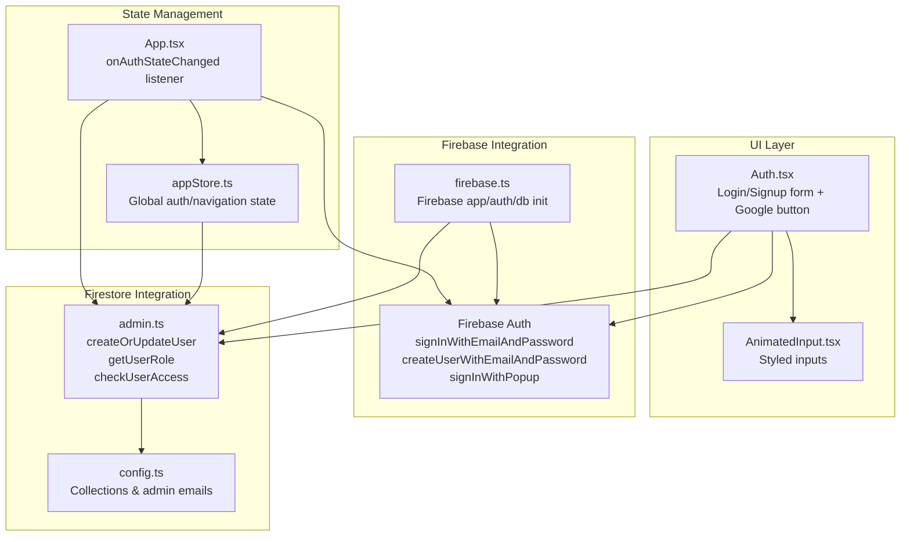
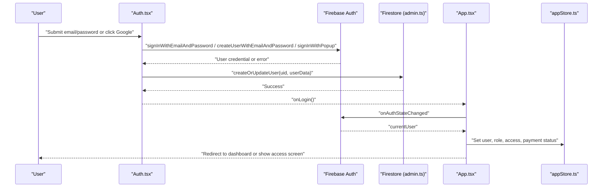
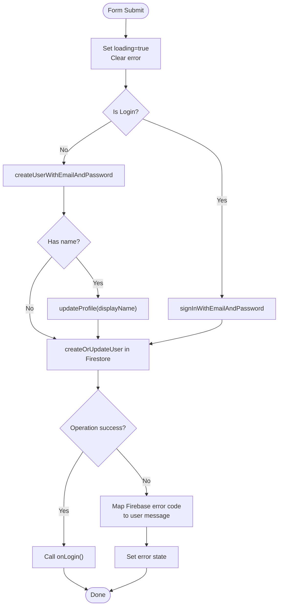
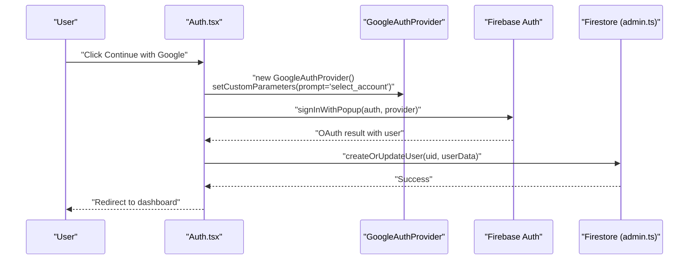
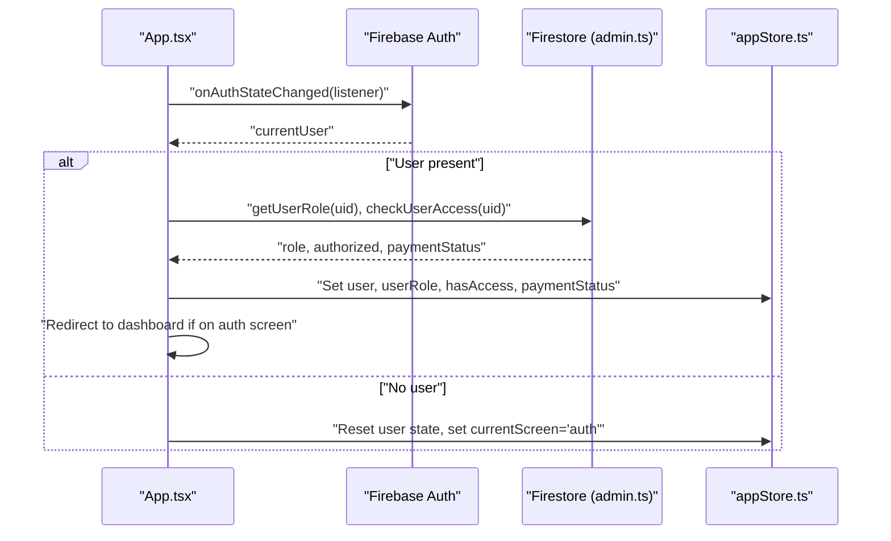
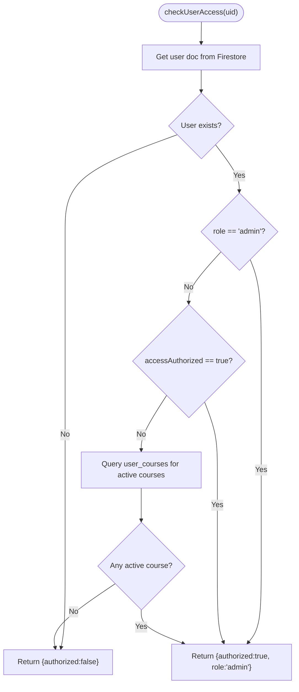
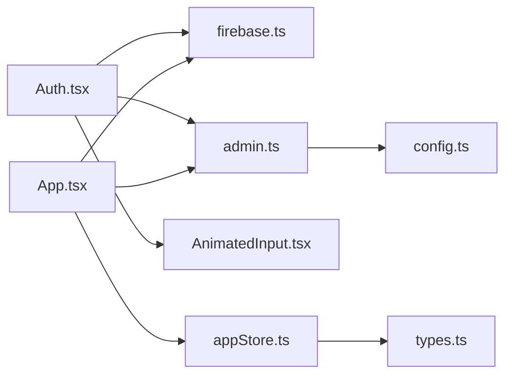

# Authentication Flows

<cite>
**Referenced Files in This Document**
- [Auth.tsx](file://components/Auth.tsx)
- [App.tsx](file://App.tsx)
- [firebase.ts](file://lib/firebase.ts)
- [admin.ts](file://lib/db/admin.ts)
- [config.ts](file://lib/db/config.ts)
- [appStore.ts](file://lib/stores/appStore.ts)
- [AnimatedInput.tsx](file://components/ui/AnimatedInput.tsx)
- [ErrorBoundary.tsx](file://components/ErrorBoundary.tsx)
- [types.ts](file://types.ts)
</cite>

## Table of Contents
1. [Introduction](#introduction)
2. [Project Structure](#project-structure)
3. [Core Components](#core-components)
4. [Architecture Overview](#architecture-overview)
5. [Detailed Component Analysis](#detailed-component-analysis)
6. [Dependency Analysis](#dependency-analysis)
7. [Performance Considerations](#performance-considerations)
8. [Troubleshooting Guide](#troubleshooting-guide)
9. [Conclusion](#conclusion)

## Introduction
This document explains the complete authentication flows implemented in the project, covering:
- Email/password authentication (sign-in and sign-up)
- Google OAuth integration via popup
- Social login mechanisms
- Form validation, error handling, loading states, and user feedback
- Authentication state management, session persistence, and automatic sign-in flows
- Real-time authentication status updates and navigation control

The authentication system integrates Firebase Authentication for identity and Firebase Firestore for user metadata and access control.

## Project Structure
Authentication spans several layers:
- UI layer: Login/signup form and Google login button
- State management: Global store for user, roles, permissions, and navigation
- Backend integration: Firebase initialization and Firestore user synchronization
- Access control: Role-based routing and authorization checks

**Diagram sources**
- [Auth.tsx](file://components/Auth.tsx#L1-L265)
- [App.tsx](file://App.tsx#L40-L108)
- [firebase.ts](file://lib/firebase.ts#L1-L25)
- [admin.ts](file://lib/db/admin.ts#L19-L122)
- [config.ts](file://lib/db/config.ts#L1-L19)
- [appStore.ts](file://lib/stores/appStore.ts#L1-L82)
- [AnimatedInput.tsx](file://components/ui/AnimatedInput.tsx#L1-L112)

**Section sources**
- [Auth.tsx](file://components/Auth.tsx#L1-L265)
- [App.tsx](file://App.tsx#L40-L108)
- [firebase.ts](file://lib/firebase.ts#L1-L25)
- [admin.ts](file://lib/db/admin.ts#L19-L122)
- [config.ts](file://lib/db/config.ts#L1-L19)
- [appStore.ts](file://lib/stores/appStore.ts#L1-L82)
- [AnimatedInput.tsx](file://components/ui/AnimatedInput.tsx#L1-L112)

## Core Components
- Auth.tsx: Implements email/password and Google OAuth flows, form state, validation feedback, and loading indicators.
- App.tsx: Listens to Firebase authentication state changes, manages navigation, and enforces access control.
- firebase.ts: Initializes Firebase app, auth, Firestore with persistence, storage, and Cloud Functions.
- admin.ts: Synchronizes user data to Firestore, determines roles, and checks access authorization.
- appStore.ts: Centralized state for user, role, permissions, loading, and navigation.
- AnimatedInput.tsx: Reusable animated input component used in forms.
- ErrorBoundary.tsx: Provides graceful error handling around authenticated routes.
- types.ts: Defines screens and navigation types used during authentication flows.

Key Firebase API usage:
- signInWithEmailAndPassword: Email/password sign-in
- createUserWithEmailAndPassword: Email/password sign-up
- updateProfile: Sets display name after sign-up
- signInWithPopup: Google OAuth via popup
- onAuthStateChanged: Automatic sign-in and session persistence
- signOut: Logout

**Section sources**
- [Auth.tsx](file://components/Auth.tsx#L21-L92)
- [App.tsx](file://App.tsx#L65-L108)
- [firebase.ts](file://lib/firebase.ts#L16-L24)
- [admin.ts](file://lib/db/admin.ts#L19-L122)
- [appStore.ts](file://lib/stores/appStore.ts#L5-L33)

## Architecture Overview
The authentication lifecycle is event-driven:
1. User submits credentials or clicks Google login
2. UI triggers Firebase Auth operations
3. On success, Firestore is synchronized and user metadata is created/updated
4. App listens to onAuthStateChanged to set global state and redirect to dashboard
5. Access control checks determine whether to render content or show pending access screen

**Diagram sources**
- [Auth.tsx](file://components/Auth.tsx#L21-L92)
- [admin.ts](file://lib/db/admin.ts#L19-L59)
- [App.tsx](file://App.tsx#L65-L108)
- [appStore.ts](file://lib/stores/appStore.ts#L48-L81)

## Detailed Component Analysis

### Email/Password Authentication Flow
- Form handling:
  - Controlled inputs for email, password, and optional name (for sign-up)
  - AnimatedInput provides consistent styling and icons
- Validation and submission:
  - Prevent default form submit, set loading state, clear previous errors
  - Sign-in path: signInWithEmailAndPassword
  - Sign-up path: createUserWithEmailAndPassword, optionally updateProfile, then synchronize user to Firestore
- Error handling:
  - Catches Firebase Auth error codes and maps to user-friendly messages
  - Displays error banner and keeps loading indicator until finally block
- Feedback:
  - Loading spinner during async operations
  - Disabled button while loading

**Diagram sources**
- [Auth.tsx](file://components/Auth.tsx#L21-L60)
- [admin.ts](file://lib/db/admin.ts#L19-L59)

**Section sources**
- [Auth.tsx](file://components/Auth.tsx#L13-L60)
- [AnimatedInput.tsx](file://components/ui/AnimatedInput.tsx#L14-L109)

### Google OAuth Integration
- Provider configuration:
  - Uses GoogleAuthProvider with prompt set to select_account to improve UX
- Popup flow:
  - signInWithPopup opens Google’s OAuth dialog
  - On success, synchronizes user to Firestore
- Error handling:
  - Handles popup-closed-by-user, popup-blocked, and cancelled-popup-request gracefully
- Feedback:
  - Loading state and error banner similar to email/password flow

**Diagram sources**
- [Auth.tsx](file://components/Auth.tsx#L62-L92)
- [admin.ts](file://lib/db/admin.ts#L19-L59)

**Section sources**
- [Auth.tsx](file://components/Auth.tsx#L62-L92)

### Authentication State Management and Automatic Sign-In
- onAuthStateChanged listener:
  - Runs on app mount and whenever auth state changes
  - Loads user role and access status from Firestore only once per session
  - Forces admin role for configured admin emails
  - Redirects from auth screen to dashboard upon successful sign-in
  - Resets state and redirects to auth screen when signed out
- Session persistence:
  - Firebase Auth automatically persists sessions across browser reloads
  - Firestore initialized with persistent local cache for offline readiness

**Diagram sources**
- [App.tsx](file://App.tsx#L65-L108)
- [admin.ts](file://lib/db/admin.ts#L61-L122)
- [appStore.ts](file://lib/stores/appStore.ts#L48-L81)

**Section sources**
- [App.tsx](file://App.tsx#L65-L108)
- [firebase.ts](file://lib/firebase.ts#L18-L24)

### Access Control and Authorization
- Role determination:
  - Admin emails are granted admin role; others default to student
- Access checks:
  - Admins always authorized
  - Students require either explicit accessAuthorized flag or at least one active course
- Payment status:
  - Stored in Firestore and reflected in UI for pending access scenarios

**Diagram sources**
- [admin.ts](file://lib/db/admin.ts#L80-L122)
- [config.ts](file://lib/db/config.ts#L16-L19)

**Section sources**
- [admin.ts](file://lib/db/admin.ts#L80-L122)
- [config.ts](file://lib/db/config.ts#L16-L19)

### Form Handling, Validation, and User Feedback
- Form handling:
  - Controlled components for email, password, and name
  - AnimatedInput supports icons and focus effects
- Validation:
  - Client-side: ensure fields are non-empty before submit
  - Server-side: Firebase Auth validates credentials and returns error codes
- Feedback:
  - Loading state disables buttons and shows spinner
  - Error banners display mapped Firebase error messages
  - Success transitions to dashboard via onLogin callback

**Section sources**
- [Auth.tsx](file://components/Auth.tsx#L17-L60)
- [AnimatedInput.tsx](file://components/ui/AnimatedInput.tsx#L14-L109)

## Dependency Analysis
Authentication depends on:
- Firebase SDK for Auth and Firestore
- Firestore collections for user profiles and access control
- Zustand store for cross-component state sharing
- React Router/Suspense boundaries for navigation and lazy loading

**Diagram sources**
- [Auth.tsx](file://components/Auth.tsx#L1-L10)
- [App.tsx](file://App.tsx#L26-L31)
- [firebase.ts](file://lib/firebase.ts#L1-L25)
- [admin.ts](file://lib/db/admin.ts#L1-L5)
- [config.ts](file://lib/db/config.ts#L1-L19)
- [appStore.ts](file://lib/stores/appStore.ts#L1-L4)
- [types.ts](file://types.ts#L1-L26)

**Section sources**
- [Auth.tsx](file://components/Auth.tsx#L1-L10)
- [App.tsx](file://App.tsx#L26-L31)
- [firebase.ts](file://lib/firebase.ts#L1-L25)
- [admin.ts](file://lib/db/admin.ts#L1-L5)
- [config.ts](file://lib/db/config.ts#L1-L19)
- [appStore.ts](file://lib/stores/appStore.ts#L1-L4)
- [types.ts](file://types.ts#L1-L26)

## Performance Considerations
- Minimize Firestore reads:
  - Load role and access only once per session using roleLoaded flag
- Optimize UI responsiveness:
  - Keep async operations short; avoid blocking UI during long-running tasks
- Network resilience:
  - Firestore persistence helps maintain offline readiness; rely on Firebase Auth auto-recovery
- Error logging:
  - Console logs assist in diagnosing issues without exposing internal details to users

[No sources needed since this section provides general guidance]

## Troubleshooting Guide
Common authentication errors and resolutions:
- auth/invalid-email
  - Cause: Malformed email address
  - Resolution: Prompt user to enter a valid email
- auth/user-disabled
  - Cause: Disabled account
  - Resolution: Contact support to enable account
- auth/user-not-found, auth/wrong-password, auth/invalid-credential
  - Cause: Incorrect credentials
  - Resolution: Prompt user to verify email/password
- auth/email-already-in-use
  - Cause: Email already registered
  - Resolution: Suggest sign-in or reset password
- auth/weak-password
  - Cause: Password below minimum length
  - Resolution: Enforce minimum 6 characters
- auth/popup-closed-by-user
  - Cause: User closed OAuth popup
  - Resolution: Allow retry; inform user to close other popups
- auth/popup-blocked
  - Cause: Browser blocked popup
  - Resolution: Enable popups for the site
- auth/cancelled-popup-request
  - Cause: Request canceled
  - Resolution: Retry login flow

Error handling strategy:
- Map Firebase error codes to user-friendly messages
- Clear previous errors before new attempts
- Disable submit button during loading to prevent duplicate requests
- Provide retry actions and clear feedback

**Section sources**
- [Auth.tsx](file://components/Auth.tsx#L45-L56)
- [Auth.tsx](file://components/Auth.tsx#L81-L88)

## Conclusion
The authentication system provides a robust, user-friendly experience:
- Seamless email/password and Google OAuth flows
- Real-time authentication state management with automatic sign-in
- Clear error handling and user feedback
- Strong access control integrated with Firestore
- Persistent state and responsive UI

Future enhancements could include:
- Passwordless authentication options
- Two-factor authentication
- Enhanced error telemetry and user guidance
- Additional social providers

[No sources needed since this section summarizes without analyzing specific files]