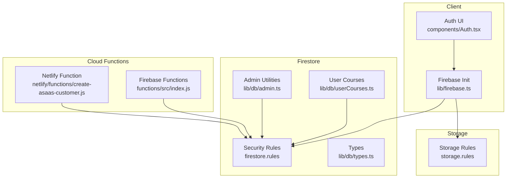
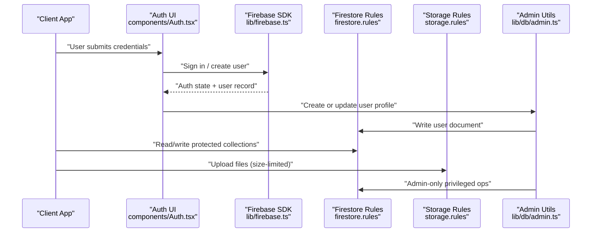
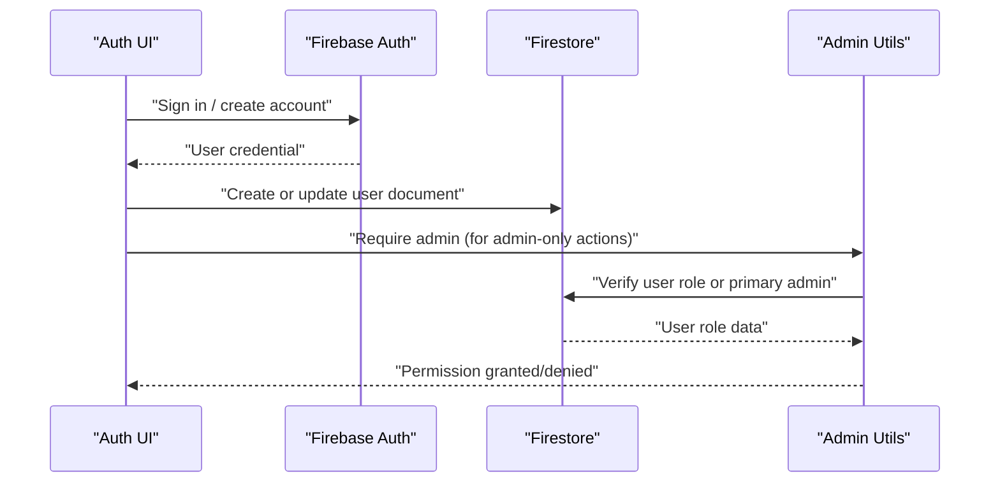
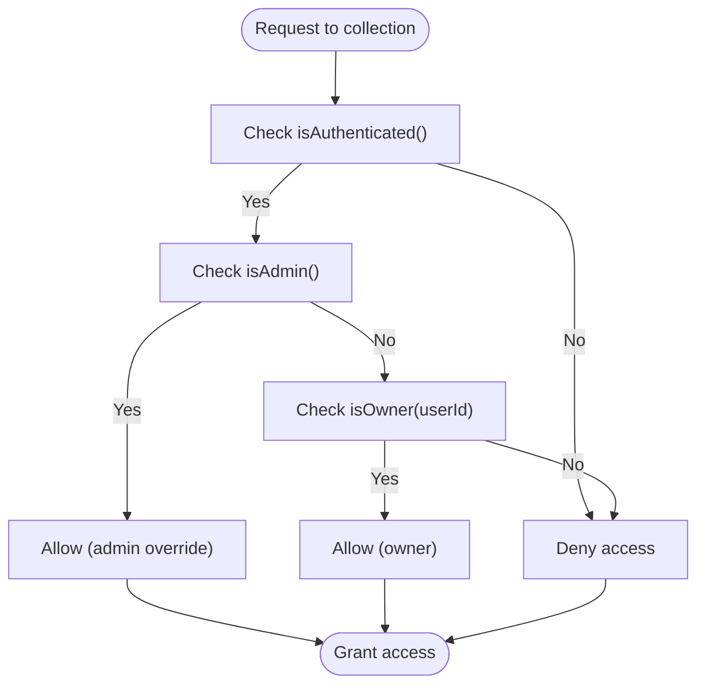
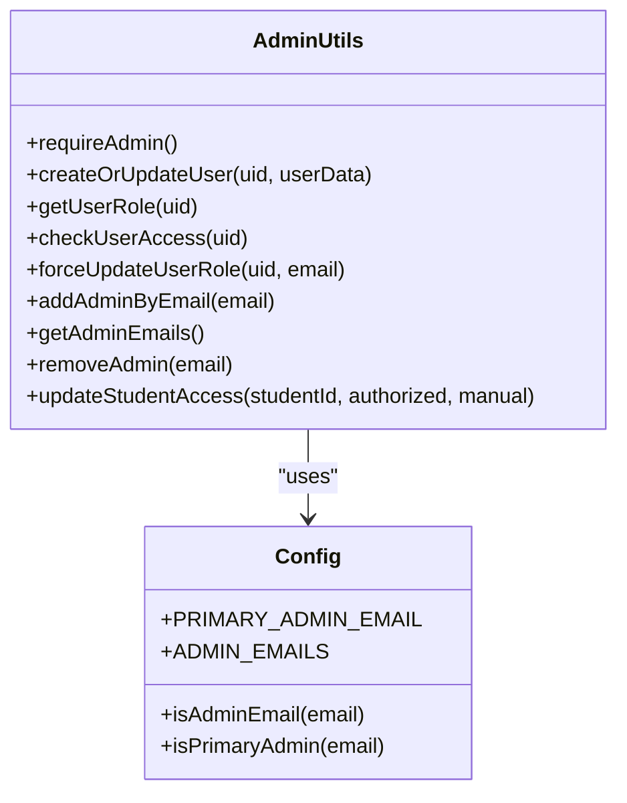
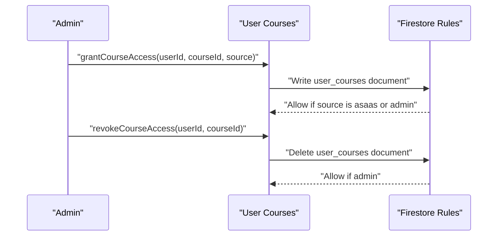
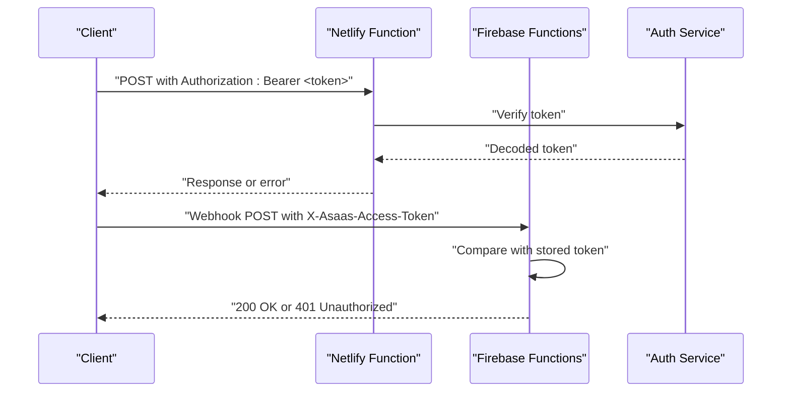
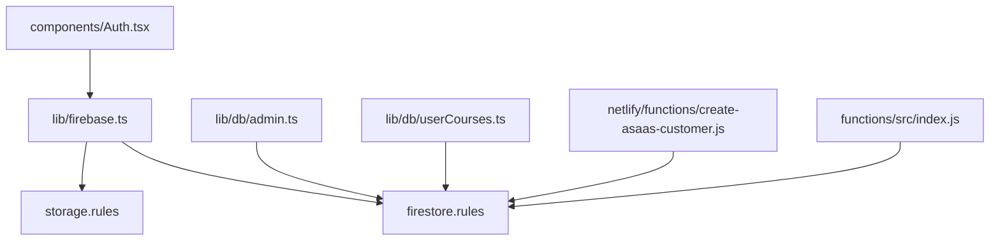

# Security Rules & Access Control

<cite>
**Referenced Files in This Document**
- [firestore.rules](file://firestore.rules)
- [storage.rules](file://storage.rules)
- [firebase.json](file://firebase.json)
- [lib/firebase.ts](file://lib/firebase.ts)
- [components/Auth.tsx](file://components/Auth.tsx)
- [lib/db/admin.ts](file://lib/db/admin.ts)
- [lib/db/config.ts](file://lib/db/config.ts)
- [lib/db/index.ts](file://lib/db/index.ts)
- [lib/db/types.ts](file://lib/db/types.ts)
- [lib/db/userCourses.ts](file://lib/db/userCourses.ts)
- [netlify/functions/create-asaas-customer.js](file://netlify/functions/create-asaas-customer.js)
- [functions/src/index.js](file://functions/src/index.js)
- [test/db/config.test.ts](file://test/db/config.test.ts)
</cite>

## Table of Contents
1. [Introduction](#introduction)
2. [Project Structure](#project-structure)
3. [Core Components](#core-components)
4. [Architecture Overview](#architecture-overview)
5. [Detailed Component Analysis](#detailed-component-analysis)
6. [Dependency Analysis](#dependency-analysis)
7. [Performance Considerations](#performance-considerations)
8. [Troubleshooting Guide](#troubleshooting-guide)
9. [Conclusion](#conclusion)
10. [Appendices](#appendices)

## Introduction
This document explains the Firestore security rules and access control mechanisms that protect user data and system resources in the application. It details the rule structure for user collections, course data, and administrative functions; describes authentication-based access control, role-based data filtering, and data validation patterns; and documents the security rule syntax, conditional logic, and wildcard patterns used across the system. Practical examples illustrate read/write permissions, data masking strategies, and privilege escalation prevention. Common security vulnerabilities and mitigations are addressed, along with testing approaches, debugging techniques, and best practices for maintaining secure access control policies.

## Project Structure
The security model spans client-side initialization, Firestore security rules, Storage rules, and backend functions. Authentication is handled by Firebase Authentication; Firestore rules enforce fine-grained access control; Storage rules limit uploads; and Cloud Functions provide privileged operations and webhooks with token verification.

**Diagram sources**
- [components/Auth.tsx](file://components/Auth.tsx#L1-L265)
- [lib/firebase.ts](file://lib/firebase.ts#L1-L25)
- [firestore.rules](file://firestore.rules#L1-L97)
- [storage.rules](file://storage.rules#L1-L11)
- [lib/db/admin.ts](file://lib/db/admin.ts#L1-L307)
- [lib/db/userCourses.ts](file://lib/db/userCourses.ts#L1-L112)
- [lib/db/types.ts](file://lib/db/types.ts#L1-L90)
- [netlify/functions/create-asaas-customer.js](file://netlify/functions/create-asaas-customer.js#L38-L83)
- [functions/src/index.js](file://functions/src/index.js#L146-L183)

**Section sources**
- [firebase.json](file://firebase.json#L1-L20)
- [lib/firebase.ts](file://lib/firebase.ts#L1-L25)
- [components/Auth.tsx](file://components/Auth.tsx#L1-L265)
- [firestore.rules](file://firestore.rules#L1-L97)
- [storage.rules](file://storage.rules#L1-L11)
- [lib/db/admin.ts](file://lib/db/admin.ts#L1-L307)
- [lib/db/userCourses.ts](file://lib/db/userCourses.ts#L1-L112)
- [lib/db/types.ts](file://lib/db/types.ts#L1-L90)
- [netlify/functions/create-asaas-customer.js](file://netlify/functions/create-asaas-customer.js#L38-L83)
- [functions/src/index.js](file://functions/src/index.js#L146-L183)

## Core Components
- Authentication and Initialization
  - Firebase app initialized with Auth, Firestore, Storage, and Functions clients.
  - Authentication UI handles sign-in/sign-up and Google OAuth, then creates or updates user profiles in Firestore.

- Firestore Security Rules
  - Central helpers: authentication checks, admin checks, ownership checks.
  - Collection-level rules define who can read/write and under what conditions.
  - Special handling for user-specific documents, course access mapping, and activity ownership.

- Admin Utilities and Role Management
  - Admin utilities enforce admin-only operations and derive admin status from Firestore user roles or a primary admin email.
  - User creation logic assigns roles based on admin email lists and initializes access flags.

- User Courses and Access Control
  - Access granted via user_courses entries; helpers check active access for users.
  - Admins can grant/revoke access; non-admins can create/update their own access records.

- Storage Rules
  - Read/write requires authenticated users; upload size limited to prevent abuse.

- Backend Functions and Webhooks
  - Netlify function verifies Authorization header and decodes a Firebase token before processing.
  - Firebase Functions webhook validates a shared token and rejects unauthorized requests.

**Section sources**
- [lib/firebase.ts](file://lib/firebase.ts#L1-L25)
- [components/Auth.tsx](file://components/Auth.tsx#L1-L265)
- [firestore.rules](file://firestore.rules#L1-L97)
- [lib/db/admin.ts](file://lib/db/admin.ts#L1-L307)
- [lib/db/config.ts](file://lib/db/config.ts#L1-L19)
- [lib/db/userCourses.ts](file://lib/db/userCourses.ts#L1-L112)
- [storage.rules](file://storage.rules#L1-L11)
- [netlify/functions/create-asaas-customer.js](file://netlify/functions/create-asaas-customer.js#L38-L83)
- [functions/src/index.js](file://functions/src/index.js#L146-L183)

## Architecture Overview
The security architecture combines client authentication, server-side Firestore rules, Storage constraints, and backend functions with token verification. Admin privileges are enforced both in Firestore rules and client-side utilities.

**Diagram sources**
- [components/Auth.tsx](file://components/Auth.tsx#L1-L265)
- [lib/firebase.ts](file://lib/firebase.ts#L1-L25)
- [firestore.rules](file://firestore.rules#L1-L97)
- [storage.rules](file://storage.rules#L1-L11)
- [lib/db/admin.ts](file://lib/db/admin.ts#L1-L307)

## Detailed Component Analysis

### Firestore Security Rules: Helpers and Collections
- Helpers
  - isAuthenticated(): Requires a non-null request.auth.
  - isAdmin(): Checks user role or a primary admin email.
  - isOwner(userId): Confirms the requesting user owns the target document.

- Collections and Permissions
  - users: Readable by authenticated users; create/update restricted to owners; delete reserved for admins.
  - adminEmails: Read/write restricted to admins.
  - courses, mindful_flow, music: Readable by authenticated users; write restricted to admins.
  - student_completions: Readable by authenticated users; create allowed for authenticated users; update/delete restricted to admins.
  - student_progress: Read/write allowed for owners or admins.
  - student_activities: Read allowed for owners or admins; create allowed for owners; update/delete restricted to admins.
  - achievements: Read/write restricted to admins.
  - user_courses: Read allowed for owners or admins; create/update allowed for authenticated users; delete restricted to admins.

- Default Deny
  - A catch-all rule denies read/write on any unmatched path.

**Section sources**
- [firestore.rules](file://firestore.rules#L1-L97)

### Authentication-Based Access Control
- Client-side authentication is handled by the Auth component, which signs users in and updates Firestore user documents with role and access flags.
- The admin utilities enforce admin-only operations and derive admin status from Firestore user roles or a primary admin email.

**Diagram sources**
- [components/Auth.tsx](file://components/Auth.tsx#L1-L265)
- [lib/db/admin.ts](file://lib/db/admin.ts#L1-L307)

**Section sources**
- [components/Auth.tsx](file://components/Auth.tsx#L1-L265)
- [lib/db/admin.ts](file://lib/db/admin.ts#L1-L307)

### Role-Based Data Filtering and Ownership Checks
- Ownership filtering ensures users can only access their own documents in collections like student_progress and student_activities.
- Admin filtering allows administrators to bypass ownership checks and access all relevant data.

**Diagram sources**
- [firestore.rules](file://firestore.rules#L1-L97)

**Section sources**
- [firestore.rules](file://firestore.rules#L1-L97)

### Data Validation Rules and Conditional Logic
- Conditional logic uses helpers and explicit checks for request.auth, resource.data, and request.resource.data.
- Wildcard patterns match arbitrary document IDs and nested paths, ensuring consistent enforcement across collections.

Key patterns observed:
- request.auth != null for authentication gating.
- resource == null for create operations where resource does not yet exist.
- resource.data.field == value for ownership checks on nested fields.
- request.resource.data.field == value for validating incoming writes.

**Section sources**
- [firestore.rules](file://firestore.rules#L1-L97)

### Administrative Functions and Privilege Escalation Prevention
- Admin utilities enforce admin-only operations and derive admin status from Firestore user roles or a primary admin email.
- User creation logic assigns roles based on admin email lists and initializes access flags appropriately.
- Admin email management supports both existing users and pending admin emails.

**Diagram sources**
- [lib/db/admin.ts](file://lib/db/admin.ts#L1-L307)
- [lib/db/config.ts](file://lib/db/config.ts#L1-L19)

**Section sources**
- [lib/db/admin.ts](file://lib/db/admin.ts#L1-L307)
- [lib/db/config.ts](file://lib/db/config.ts#L1-L19)

### User Courses and Access Mapping
- Access control for course materials is managed via user_courses entries.
- Helpers check active access for users and allow admins to grant/revoke access.
- Non-admins can create/update their own access records; admin-only operations enforce stricter checks.

**Diagram sources**
- [lib/db/userCourses.ts](file://lib/db/userCourses.ts#L1-L112)
- [firestore.rules](file://firestore.rules#L78-L89)

**Section sources**
- [lib/db/userCourses.ts](file://lib/db/userCourses.ts#L1-L112)
- [firestore.rules](file://firestore.rules#L78-L89)

### Storage Security Rules
- Read and write require authenticated users.
- Upload size limited to prevent abuse.

**Section sources**
- [storage.rules](file://storage.rules#L1-L11)

### Backend Functions and Webhooks: Token Verification
- Netlify function verifies Authorization header and decodes a Firebase token before processing.
- Firebase Functions webhook validates a shared token and rejects unauthorized requests.

**Diagram sources**
- [netlify/functions/create-asaas-customer.js](file://netlify/functions/create-asaas-customer.js#L38-L83)
- [functions/src/index.js](file://functions/src/index.js#L146-L183)

**Section sources**
- [netlify/functions/create-asaas-customer.js](file://netlify/functions/create-asaas-customer.js#L38-L83)
- [functions/src/index.js](file://functions/src/index.js#L146-L183)

## Dependency Analysis
The security model depends on consistent integration between client initialization, Firestore rules, admin utilities, and backend functions.

**Diagram sources**
- [lib/firebase.ts](file://lib/firebase.ts#L1-L25)
- [firestore.rules](file://firestore.rules#L1-L97)
- [storage.rules](file://storage.rules#L1-L11)
- [components/Auth.tsx](file://components/Auth.tsx#L1-L265)
- [lib/db/admin.ts](file://lib/db/admin.ts#L1-L307)
- [lib/db/userCourses.ts](file://lib/db/userCourses.ts#L1-L112)
- [netlify/functions/create-asaas-customer.js](file://netlify/functions/create-asaas-customer.js#L38-L83)
- [functions/src/index.js](file://functions/src/index.js#L146-L183)

**Section sources**
- [lib/firebase.ts](file://lib/firebase.ts#L1-L25)
- [firestore.rules](file://firestore.rules#L1-L97)
- [storage.rules](file://storage.rules#L1-L11)
- [components/Auth.tsx](file://components/Auth.tsx#L1-L265)
- [lib/db/admin.ts](file://lib/db/admin.ts#L1-L307)
- [lib/db/userCourses.ts](file://lib/db/userCourses.ts#L1-L112)
- [netlify/functions/create-asaas-customer.js](file://netlify/functions/create-asaas-customer.js#L38-L83)
- [functions/src/index.js](file://functions/src/index.js#L146-L183)

## Performance Considerations
- Rule Complexity: Keep helpers concise and avoid deep nested get() calls in hot paths.
- Indexing: Ensure Firestore indexes exist for queries used in admin operations (e.g., user_courses filters) to minimize latency.
- Batch Operations: Prefer batched writes for bulk admin operations to reduce rule evaluation overhead.
- Caching: Client-side caching of user roles and access flags can reduce repeated reads.

## Troubleshooting Guide
Common issues and mitigations:
- Unauthorized Access
  - Symptom: Requests denied despite being authenticated.
  - Check: Ensure request.auth is present and user roles are correctly set in Firestore.
  - Mitigation: Verify admin utilities and user creation logic.

- Ownership Violations
  - Symptom: Users cannot access their own documents.
  - Check: Confirm isOwner() logic and resource.data fields match expectations.
  - Mitigation: Align client writes with expected ownership fields.

- Admin Privileges Not Applied
  - Symptom: Admin-only operations failing.
  - Check: Confirm Firestore rules and admin utilities enforce admin checks consistently.
  - Mitigation: Review admin email configuration and primary admin fallback.

- Storage Upload Failures
  - Symptom: Uploads rejected due to size or lack of auth.
  - Check: Verify Storage rules and client authentication state.
  - Mitigation: Ensure users are authenticated and files are within size limits.

Testing and Debugging:
- Unit Tests: Admin configuration tests validate admin email detection and constants.
- Local Emulator: Use Firestore and Auth emulators to test rules and simulate scenarios.
- Logging: Add targeted logs in admin utilities and functions to trace permission decisions.

**Section sources**
- [test/db/config.test.ts](file://test/db/config.test.ts#L1-L25)

## Conclusion
The application enforces robust access control through a layered security model: client authentication, Firestore security rules with helpers, Storage constraints, and backend functions with token verification. Admin utilities and user-course mapping provide precise role-based filtering and ownership checks. By following the recommended practices and testing strategies, the system maintains strong protection against unauthorized access and privilege escalation while supporting scalable administration and user workflows.

## Appendices

### Security Rule Syntax and Patterns Reference
- Authentication gating: request.auth != null
- Admin checks: get() on user document and role comparison
- Ownership checks: request.auth.uid vs resource.data.userId
- Create-time validation: request.resource.data.field presence
- Wildcards: {userId}, {docId}, {document=**}

**Section sources**
- [firestore.rules](file://firestore.rules#L1-L97)