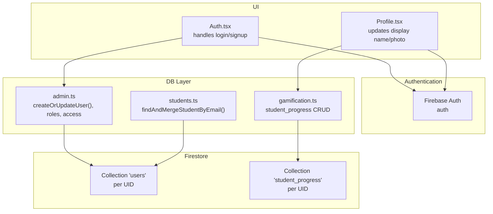
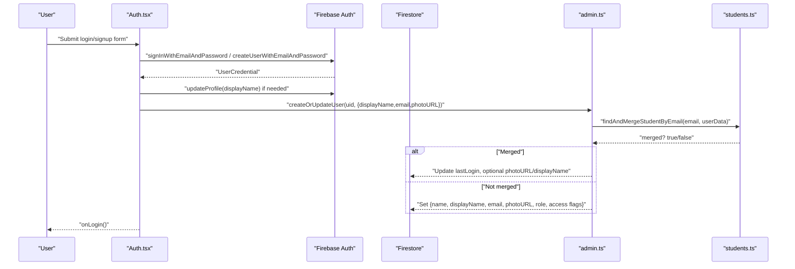
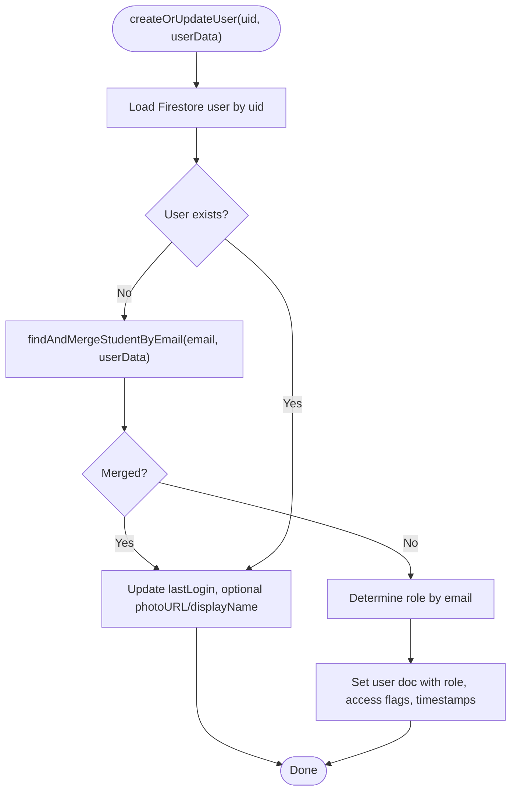
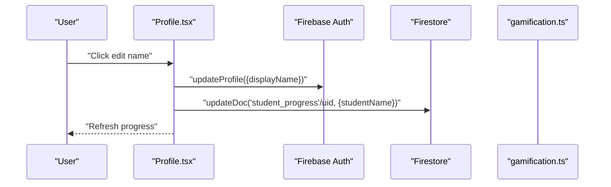
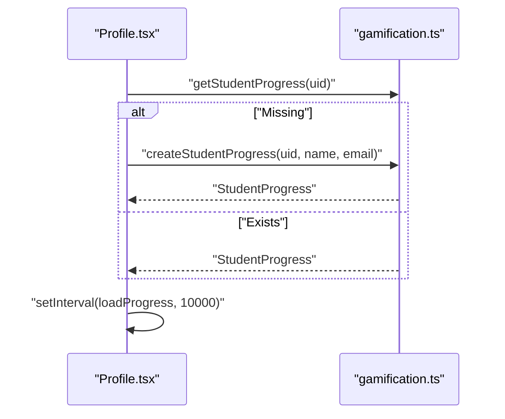
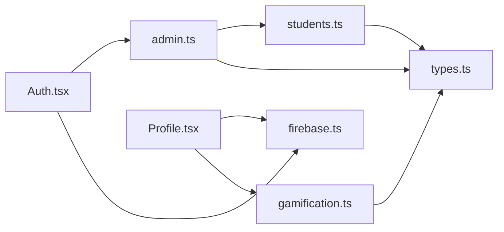

# User Data Management

<cite>
**Referenced Files in This Document**
- [firebase.ts](file://lib/firebase.ts)
- [Auth.tsx](file://components/Auth.tsx)
- [Profile.tsx](file://components/Profile.tsx)
- [admin.ts](file://lib/db/admin.ts)
- [students.ts](file://lib/db/students.ts)
- [gamification.ts](file://lib/gamification.ts)
- [types.ts](file://types.ts)
- [db/index.ts](file://lib/db/index.ts)
</cite>

## Table of Contents
1. [Introduction](#introduction)
2. [Project Structure](#project-structure)
3. [Core Components](#core-components)
4. [Architecture Overview](#architecture-overview)
5. [Detailed Component Analysis](#detailed-component-analysis)
6. [Dependency Analysis](#dependency-analysis)
7. [Performance Considerations](#performance-considerations)
8. [Troubleshooting Guide](#troubleshooting-guide)
9. [Conclusion](#conclusion)
10. [Appendices](#appendices)

## Introduction
This document explains how user data is managed across Firebase Authentication and Firestore, focusing on:
- Automatic user creation and profile updates upon authentication
- Synchronization of display name and profile picture between Authentication and Firestore
- Real-time and periodic user data updates
- User document structure and consistency strategies
- Practical CRUD operations and validation patterns
- Privacy and compliance considerations

## Project Structure
Key areas involved in user data management:
- Authentication initialization and client exports
- Authentication UI and flows
- Firestore user document management
- Student progress and gamification data
- Shared types for user and progress models

**Diagram sources**
- [firebase.ts](file://lib/firebase.ts#L16-L24)
- [Auth.tsx](file://components/Auth.tsx#L21-L92)
- [Profile.tsx](file://components/Profile.tsx#L47-L151)
- [admin.ts](file://lib/db/admin.ts#L24-L64)
- [students.ts](file://lib/db/students.ts#L110-L144)
- [gamification.ts](file://lib/gamification.ts#L43-L98)

**Section sources**
- [firebase.ts](file://lib/firebase.ts#L1-L25)
- [Auth.tsx](file://components/Auth.tsx#L1-L265)
- [Profile.tsx](file://components/Profile.tsx#L1-L386)
- [admin.ts](file://lib/db/admin.ts#L1-L307)
- [students.ts](file://lib/db/students.ts#L1-L285)
- [gamification.ts](file://lib/gamification.ts#L1-L349)
- [types.ts](file://types.ts#L108-L125)
- [db/index.ts](file://lib/db/index.ts#L1-L38)

## Core Components
- Firebase initialization exports auth, db, storage, functions
- Auth.tsx orchestrates sign-in/sign-up and triggers Firestore user creation/update
- admin.ts implements createOrUpdateUser with role determination and merge logic
- students.ts supports merging Google users with existing Firestore records
- Profile.tsx updates display name and photo, and refreshes progress
- gamification.ts manages student_progress documents and XP/streak logic
- types.ts defines StudentProgress and supporting interfaces

**Section sources**
- [firebase.ts](file://lib/firebase.ts#L16-L24)
- [Auth.tsx](file://components/Auth.tsx#L21-L92)
- [admin.ts](file://lib/db/admin.ts#L24-L64)
- [students.ts](file://lib/db/students.ts#L110-L144)
- [Profile.tsx](file://components/Profile.tsx#L47-L151)
- [gamification.ts](file://lib/gamification.ts#L43-L98)
- [types.ts](file://types.ts#L108-L125)

## Architecture Overview
End-to-end flow for user profile creation and synchronization:

**Diagram sources**
- [Auth.tsx](file://components/Auth.tsx#L21-L92)
- [admin.ts](file://lib/db/admin.ts#L24-L64)
- [students.ts](file://lib/db/students.ts#L110-L144)

## Detailed Component Analysis

### createOrUpdateUser Implementation
Responsibilities:
- Upsert Firestore user document keyed by uid
- Role determination: admin vs student based on email lists
- Access flags: accessAuthorized and paymentStatus defaults
- Last login timestamp update
- Optional photoURL and displayName updates on subsequent logins
- Merge Google user data with existing Firestore student records by email

**Diagram sources**
- [admin.ts](file://lib/db/admin.ts#L24-L64)
- [students.ts](file://lib/db/students.ts#L110-L144)

**Section sources**
- [admin.ts](file://lib/db/admin.ts#L24-L64)
- [students.ts](file://lib/db/students.ts#L110-L144)

### User Document Structure in Firestore
- Collection: users
- Document ID: auth uid
- Fields:
  - name: string
  - displayName: string
  - email: string (lowercased)
  - photoURL: string
  - role: 'admin' | 'student'
  - accessAuthorized: boolean (default false for non-admins)
  - paymentStatus: 'admin' | 'pending' | 'active' | 'overdue' | 'no_payment'
  - createdAt: server timestamp
  - lastLogin: server timestamp

Consistency strategies:
- On login, lastLogin is refreshed
- Optional photoURL and displayName are updated if provided
- Role and access flags are set during first creation based on email membership

**Section sources**
- [admin.ts](file://lib/db/admin.ts#L39-L50)
- [admin.ts](file://lib/db/admin.ts#L54-L59)
- [types.ts](file://types.ts#L108-L125)

### Display Name and Profile Picture Synchronization
- Authentication profile updates:
  - Auth.tsx sets displayName during sign-up
  - Profile.tsx updates displayName via updateProfile
- Firestore synchronization:
  - createOrUpdateUser updates displayName on subsequent logins
  - Profile.tsx also updates student_progress studentName when name changes

**Diagram sources**
- [Profile.tsx](file://components/Profile.tsx#L60-L85)
- [gamification.ts](file://lib/gamification.ts#L66-L98)

**Section sources**
- [Auth.tsx](file://components/Auth.tsx#L30-L42)
- [Profile.tsx](file://components/Profile.tsx#L60-L85)
- [gamification.ts](file://lib/gamification.ts#L66-L98)

### Real-Time and Periodic Updates
- Profile.tsx periodically reloads student progress every 10 seconds to reflect XP/streak changes
- Student progress document is created lazily if missing and initialized with defaults

**Diagram sources**
- [Profile.tsx](file://components/Profile.tsx#L20-L45)
- [gamification.ts](file://lib/gamification.ts#L43-L98)

**Section sources**
- [Profile.tsx](file://components/Profile.tsx#L20-L45)
- [gamification.ts](file://lib/gamification.ts#L43-L98)

### Practical Examples: CRUD Operations and Validation Patterns
- Create user on sign-up:
  - Auth.tsx calls createOrUpdateUser after successful sign-up and optional displayName update
- Update display name:
  - Profile.tsx validates non-empty input, calls updateProfile, and synchronizes student_progress
- Update profile photo:
  - Profile.tsx uploads to Firebase Storage, obtains download URL, and updates auth profile
- Delete profile photo:
  - Profile.tsx clears auth photoURL and attempts to delete storage object
- Access control checks:
  - admin.ts provides getUserRole and checkUserAccess for authorization decisions

Validation patterns:
- Auth.tsx validates email/password and maps error codes to user-friendly messages
- Profile.tsx prevents saving empty names
- students.ts import/export includes basic CSV parsing and email validation

**Section sources**
- [Auth.tsx](file://components/Auth.tsx#L21-L92)
- [Profile.tsx](file://components/Profile.tsx#L60-L151)
- [admin.ts](file://lib/db/admin.ts#L66-L127)
- [students.ts](file://lib/db/students.ts#L183-L259)

### Data Consistency Strategies
- Single source of truth:
  - Authentication provides identity and profile metadata
  - Firestore users collection holds structured user data and access flags
- Two-way synchronization:
  - Auth displayName/photoURL updates trigger Firestore updates
  - Firestore student_progress mirrors name for progress tracking
- Idempotent operations:
  - createOrUpdateUser updates lastLogin and optional fields without duplication
- Lazy initialization:
  - student_progress is created on demand with safe defaults

**Section sources**
- [admin.ts](file://lib/db/admin.ts#L24-L64)
- [Profile.tsx](file://components/Profile.tsx#L60-L85)
- [gamification.ts](file://lib/gamification.ts#L66-L98)

### Integration Between Authentication Tokens and Firestore Documents
- Token handling:
  - Firebase Auth manages session tokens; Firestore reads use the authenticated client
- Automatic user creation:
  - createOrUpdateUser creates a Firestore user document on first login
- Profile updates:
  - Both Auth and Firestore profiles are kept in sync via explicit updates

**Section sources**
- [firebase.ts](file://lib/firebase.ts#L16-L24)
- [admin.ts](file://lib/db/admin.ts#L24-L64)

## Dependency Analysis
Relationships among modules:

**Diagram sources**
- [Auth.tsx](file://components/Auth.tsx#L1-L265)
- [Profile.tsx](file://components/Profile.tsx#L1-L386)
- [admin.ts](file://lib/db/admin.ts#L1-L307)
- [students.ts](file://lib/db/students.ts#L1-L285)
- [gamification.ts](file://lib/gamification.ts#L1-L349)
- [types.ts](file://types.ts#L108-L125)
- [firebase.ts](file://lib/firebase.ts#L1-L25)

**Section sources**
- [db/index.ts](file://lib/db/index.ts#L1-L38)

## Performance Considerations
- Local cache:
  - Firestore is configured with persistent local cache and multi-tab manager to reduce network usage and improve responsiveness
- Batch operations:
  - Prefer single updateDoc calls for multiple field updates to minimize writes
- Debounce UI actions:
  - Name/photo updates in Profile.tsx should avoid rapid successive writes
- Lazy progress initialization:
  - student_progress creation occurs only when needed, reducing unnecessary writes

**Section sources**
- [firebase.ts](file://lib/firebase.ts#L18-L22)
- [Profile.tsx](file://components/Profile.tsx#L60-L151)
- [gamification.ts](file://lib/gamification.ts#L66-L98)

## Troubleshooting Guide
Common issues and resolutions:
- Authentication errors:
  - Auth.tsx maps common error codes to user-friendly messages; inspect console logs for underlying causes
- Name update failures:
  - Ensure non-empty input and verify updateProfile permissions; confirm student_progress update completes
- Photo upload failures:
  - Confirm storage rules allow uploads under profile_photos/{uid}; handle exceptions and retry gracefully
- Access denied:
  - checkUserAccess returns authorized based on role and access flags; admins bypass checks

Privacy and compliance:
- Data minimization:
  - Store only required fields in Firestore users
- Consent and transparency:
  - Provide clear notices for profile photo uploads and data processing
- Data deletion:
  - Implement user-initiated deletion flows; consider anonymizing records per policy

**Section sources**
- [Auth.tsx](file://components/Auth.tsx#L45-L59)
- [Profile.tsx](file://components/Profile.tsx#L111-L151)
- [admin.ts](file://lib/db/admin.ts#L85-L127)

## Conclusion
The system ensures robust user data management by:
- Automatically creating and updating Firestore user documents on authentication events
- Synchronizing display name and profile picture across Authentication and Firestore
- Maintaining real-time-like updates through periodic refreshes and targeted writes
- Enforcing access control and role-based permissions
- Providing clear separation of concerns between Auth, Firestore, and gamification layers

## Appendices

### User Data Model Reference
- StudentProgress fields:
  - studentId, studentName, studentEmail, currentXP, currentLevel, totalCoursesCompleted, totalHoursStudied, currentStreak, longestStreak, unlockedAchievements, lastActivityDate, createdAt, updatedAt

**Section sources**
- [types.ts](file://types.ts#L108-L125)