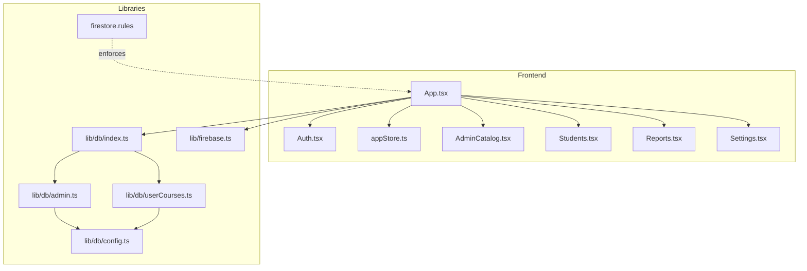
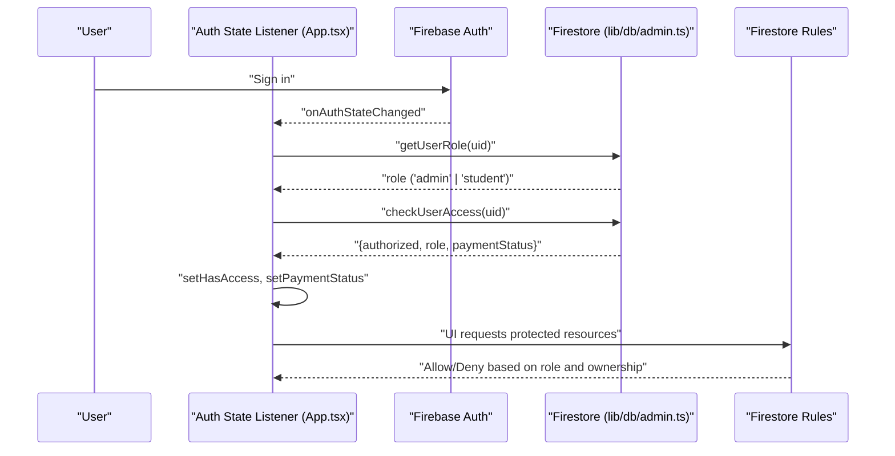
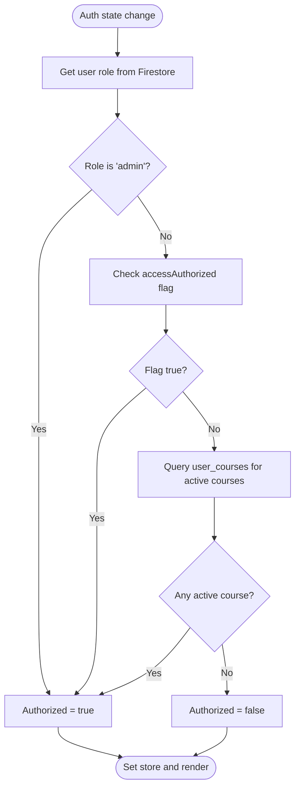
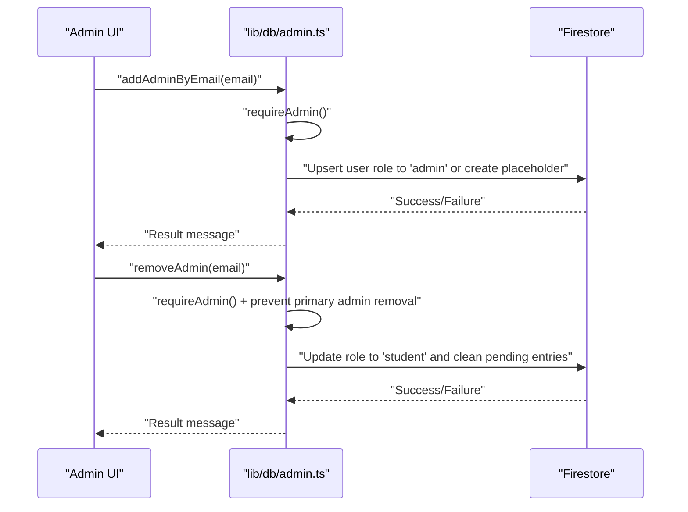
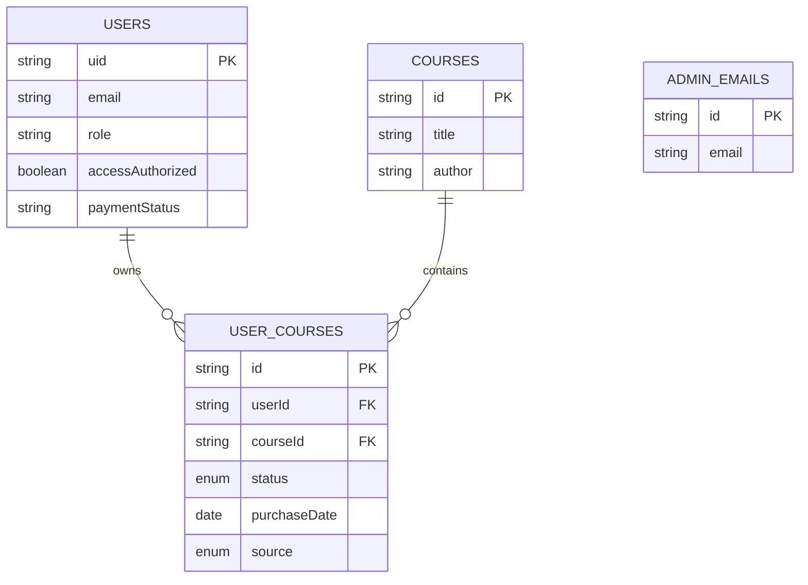
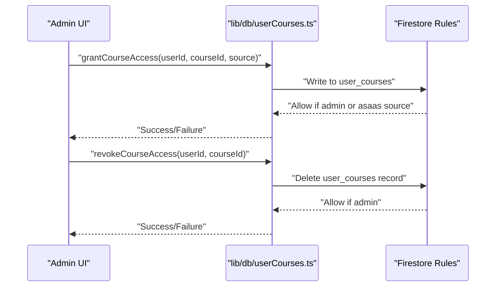
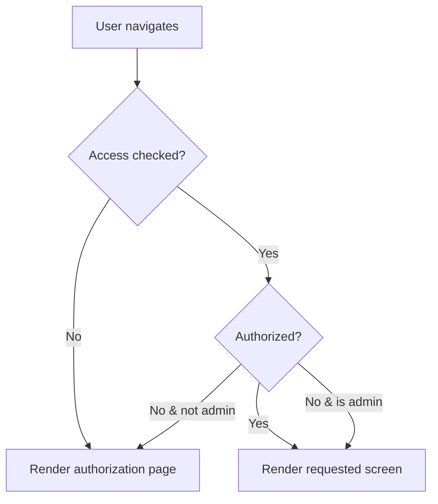
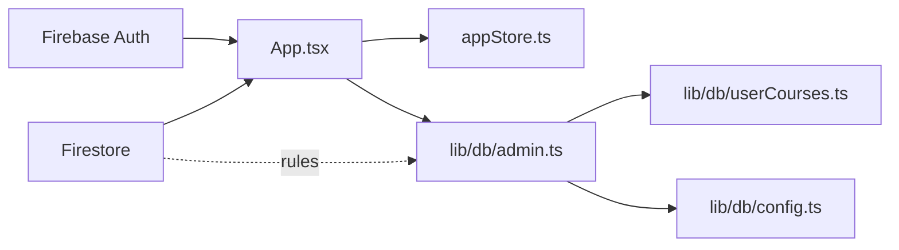

# User Roles & Permissions

<cite>
**Referenced Files in This Document**
- [App.tsx](file://App.tsx)
- [types.ts](file://types.ts)
- [firebase.ts](file://lib/firebase.ts)
- [firestore.rules](file://firestore.rules)
- [Auth.tsx](file://components/Auth.tsx)
- [admin.ts](file://lib/db/admin.ts)
- [config.ts](file://lib/db/config.ts)
- [index.ts](file://lib/db/index.ts)
- [appStore.ts](file://lib/stores/appStore.ts)
- [AdminCatalog.tsx](file://components/AdminCatalog.tsx)
- [Students.tsx](file://components/Students.tsx)
- [Reports.tsx](file://components/Reports.tsx)
- [Settings.tsx](file://components/Settings.tsx)
- [userCourses.ts](file://lib/db/userCourses.ts)
</cite>

## Table of Contents
1. [Introduction](#introduction)
2. [Project Structure](#project-structure)
3. [Core Components](#core-components)
4. [Architecture Overview](#architecture-overview)
5. [Detailed Component Analysis](#detailed-component-analysis)
6. [Dependency Analysis](#dependency-analysis)
7. [Performance Considerations](#performance-considerations)
8. [Troubleshooting Guide](#troubleshooting-guide)
9. [Conclusion](#conclusion)

## Introduction
This document describes the role-based access control (RBAC) system for the application, focusing on two user types: Student and Admin. It explains how roles are determined, stored, and enforced across the frontend and backend, how admin verification and role assignment work, and how permissions are enforced in Firestore. It also covers UI behavior conditioned on roles, administrative controls, and best practices for maintaining access control integrity.

## Project Structure
The RBAC system spans several layers:
- Authentication and initialization: Firebase Auth and Firestore are initialized and used to drive role checks and access enforcement.
- Frontend stores and routing: A central store tracks user role, access status, and view mode. Conditional rendering and navigation depend on these values.
- Backend enforcement: Firestore security rules enforce read/write policies based on user role and ownership.
- Administrative controls: Dedicated screens and APIs enable admin-only actions such as granting/revoke course access, managing admins, and synchronizing payments.

**Diagram sources**
- [App.tsx](file://App.tsx#L1-L449)
- [Auth.tsx](file://components/Auth.tsx#L1-L265)
- [appStore.ts](file://lib/stores/appStore.ts#L1-L82)
- [AdminCatalog.tsx](file://components/AdminCatalog.tsx#L1-L430)
- [Students.tsx](file://components/Students.tsx#L1-L542)
- [Reports.tsx](file://components/Reports.tsx#L1-L282)
- [Settings.tsx](file://components/Settings.tsx#L1-L915)
- [index.ts](file://lib/db/index.ts#L1-L38)
- [admin.ts](file://lib/db/admin.ts#L1-L307)
- [config.ts](file://lib/db/config.ts#L1-L19)
- [userCourses.ts](file://lib/db/userCourses.ts#L1-L112)
- [firestore.rules](file://firestore.rules#L1-L97)
- [firebase.ts](file://lib/firebase.ts#L1-L25)

**Section sources**
- [App.tsx](file://App.tsx#L1-L449)
- [firebase.ts](file://lib/firebase.ts#L1-L25)
- [firestore.rules](file://firestore.rules#L1-L97)
- [index.ts](file://lib/db/index.ts#L1-L38)

## Core Components
- Role determination and enforcement:
  - On authentication state changes, the app fetches the user’s role from Firestore and checks access authorization.
  - Admins are always granted access; students must either be explicitly authorized or have active course access.
- Store-driven UI:
  - The central store holds user role, access status, and view mode. Admins can toggle between student and admin views.
- Firestore security rules:
  - Enforce read/write policies based on authentication, ownership, and admin role.
- Admin controls:
  - Admins can manage course access, synchronize Asaas payments, manage admin emails, and export/import student data.

**Section sources**
- [App.tsx](file://App.tsx#L65-L108)
- [admin.ts](file://lib/db/admin.ts#L67-L127)
- [appStore.ts](file://lib/stores/appStore.ts#L48-L81)
- [firestore.rules](file://firestore.rules#L10-L96)

## Architecture Overview
The RBAC architecture combines client-side role caching with server-side Firestore rules for strong enforcement.

**Diagram sources**
- [App.tsx](file://App.tsx#L65-L108)
- [admin.ts](file://lib/db/admin.ts#L67-L127)
- [firestore.rules](file://firestore.rules#L10-L96)

## Detailed Component Analysis

### Role Determination and Access Control
- Role determination:
  - On sign-in, the app retrieves the user’s role from Firestore. If not found, defaults to student.
- Access authorization:
  - Admins are always authorized.
  - Students are authorized if explicitly marked authorized or if they have at least one active course in the user_courses collection.
- Admin override:
  - If a user signs in with an admin email, the system forces the role to admin and updates the Firestore record accordingly.

**Diagram sources**
- [admin.ts](file://lib/db/admin.ts#L86-L127)
- [userCourses.ts](file://lib/db/userCourses.ts#L89-L99)

**Section sources**
- [App.tsx](file://App.tsx#L65-L108)
- [admin.ts](file://lib/db/admin.ts#L67-L127)
- [userCourses.ts](file://lib/db/userCourses.ts#L1-L112)

### Admin Verification and Role Assignment
- Admin verification:
  - Certain privileged operations require explicit admin verification. The system checks the current user’s role or falls back to a primary admin email.
- Role assignment:
  - New users receive a role based on whether their email is in the admin list. Newly created users are not automatically authorized; admins must explicitly authorize them or rely on payment synchronization.
- Admin email management:
  - Admin emails can be added or removed. Removing the primary admin is prevented.

**Diagram sources**
- [admin.ts](file://lib/db/admin.ts#L168-L205)
- [admin.ts](file://lib/db/admin.ts#L242-L278)

**Section sources**
- [admin.ts](file://lib/db/admin.ts#L6-L22)
- [admin.ts](file://lib/db/admin.ts#L129-L165)
- [admin.ts](file://lib/db/admin.ts#L168-L205)
- [admin.ts](file://lib/db/admin.ts#L242-L278)

### Permission Matrix and Firestore Enforcement
- Users collection:
  - Readable by authenticated users; self-updates allowed; admin-only deletions.
- Admin emails:
  - Read/write restricted to admins.
- Courses, mindful flow, music:
  - Readable by authenticated users; writable only by admins.
- Student completions and activities:
  - Readable by owners or admins; creation allowed for owners; admin-only deletions.
- Gamification:
  - Self-owned progress and activities readable/writable by owners; admin access permitted.
- User courses:
  - Readable by owners or admins; creation/update allowed for authenticated users; admin-only deletions.

**Diagram sources**
- [firestore.rules](file://firestore.rules#L24-L96)
- [config.ts](file://lib/db/config.ts#L11-L19)

**Section sources**
- [firestore.rules](file://firestore.rules#L1-L97)
- [config.ts](file://lib/db/config.ts#L1-L19)

### Administrative Controls and Feature Gating
- Admin catalog:
  - Admins can create, edit, and delete courses and related content.
- Students management:
  - Admins can view student media submissions, grant/revoke course access, and add students.
- Reports:
  - Admins can view platform-wide engagement metrics.
- Settings:
  - Admins can manage admin users, configure access control, synchronize Asaas payments, and run migrations.

**Diagram sources**
- [Students.tsx](file://components/Students.tsx#L72-L85)
- [userCourses.ts](file://lib/db/userCourses.ts#L25-L87)
- [firestore.rules](file://firestore.rules#L78-L89)

**Section sources**
- [AdminCatalog.tsx](file://components/AdminCatalog.tsx#L1-L430)
- [Students.tsx](file://components/Students.tsx#L1-L542)
- [Reports.tsx](file://components/Reports.tsx#L1-L282)
- [Settings.tsx](file://components/Settings.tsx#L1-L915)
- [userCourses.ts](file://lib/db/userCourses.ts#L1-L112)

### Conditional Rendering and Route Protection
- Unauthorized users (non-admins) are blocked from most routes until authorized. The app renders a dedicated page guiding them through the authorization steps.
- Admins can toggle between student and admin views via a floating button. The store enforces that only admins can enter admin mode.

**Diagram sources**
- [App.tsx](file://App.tsx#L175-L238)
- [appStore.ts](file://lib/stores/appStore.ts#L67-L78)

**Section sources**
- [App.tsx](file://App.tsx#L175-L238)
- [appStore.ts](file://lib/stores/appStore.ts#L67-L78)

### Role-Based UI Components and Navigation
- View mode switching:
  - Admins see a floating toggle to switch between student and admin modes. The store prevents non-admins from toggling.
- Navigation:
  - Admins have access to admin-specific screens (catalog, students, reports, settings).
- Conditional visibility:
  - Admin-only UI elements (e.g., toggle button) are shown only when the user role is admin.

**Section sources**
- [App.tsx](file://App.tsx#L428-L441)
- [appStore.ts](file://lib/stores/appStore.ts#L67-L78)
- [types.ts](file://types.ts#L1-L25)

## Dependency Analysis
- Frontend depends on:
  - Firebase Auth for identity and Firestore for role/access data.
  - Central store for UI state and view mode.
- Backend depends on:
  - Firestore security rules to enforce access.
- Admin functions depend on:
  - Admin verification wrappers and Firestore operations.

**Diagram sources**
- [App.tsx](file://App.tsx#L25-L31)
- [admin.ts](file://lib/db/admin.ts#L1-L307)
- [userCourses.ts](file://lib/db/userCourses.ts#L1-L112)
- [config.ts](file://lib/db/config.ts#L1-L19)
- [firestore.rules](file://firestore.rules#L1-L97)

**Section sources**
- [App.tsx](file://App.tsx#L25-L31)
- [admin.ts](file://lib/db/admin.ts#L1-L307)
- [userCourses.ts](file://lib/db/userCourses.ts#L1-L112)
- [config.ts](file://lib/db/config.ts#L1-L19)
- [firestore.rules](file://firestore.rules#L1-L97)

## Performance Considerations
- Minimize repeated role checks:
  - The app caches the role per session and only refreshes when the user changes or the role is flagged as not loaded.
- Efficient queries:
  - Access checks query user_courses for active enrollments; keep filters tight to reduce document scans.
- Store-driven navigation:
  - Avoid unnecessary re-renders by relying on the central store for role and access state.

[No sources needed since this section provides general guidance]

## Troubleshooting Guide
- User appears stuck on authorization page:
  - Verify that the user has either been explicitly authorized or has an active course in user_courses.
- Admin cannot toggle view mode:
  - Ensure the user role is admin; the store prevents non-admins from entering admin mode.
- Admin operations failing:
  - Confirm that the current user is verified as admin; privileged operations call requireAdmin and may fall back to the primary admin email.
- Payments not authorizing access:
  - Use the settings panel to synchronize with Asaas or manually authorize students.

**Section sources**
- [App.tsx](file://App.tsx#L175-L238)
- [appStore.ts](file://lib/stores/appStore.ts#L67-L78)
- [admin.ts](file://lib/db/admin.ts#L6-L22)
- [Settings.tsx](file://components/Settings.tsx#L259-L289)

## Conclusion
The RBAC system integrates Firebase Auth, a central store, Firestore security rules, and admin-only UI/components to provide robust access control. Roles are determined server-side and cached client-side, while Firestore rules ensure strong enforcement. Admins can manage access, synchronize payments, and govern platform features, while unauthorized users are gated behind an authorization flow. Following the best practices outlined here helps maintain integrity and scalability.