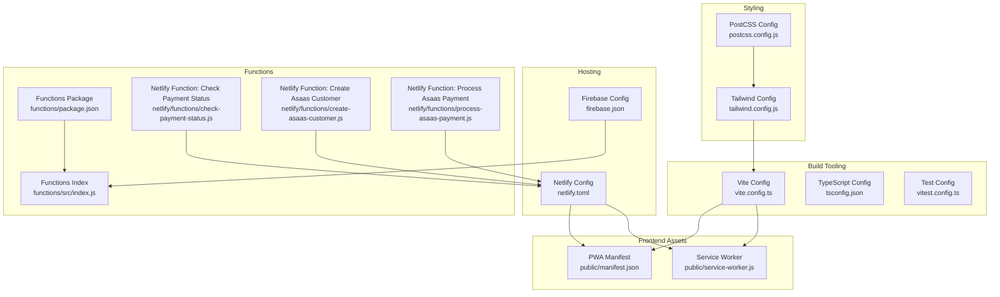
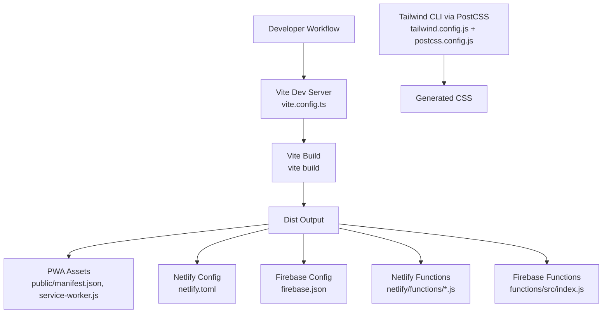
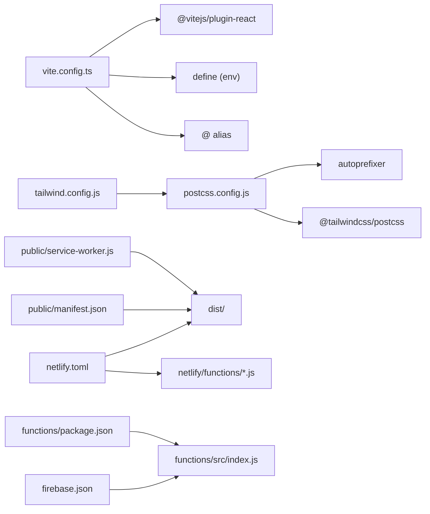

# Build & Deployment

<cite>
**Referenced Files in This Document**
- [vite.config.ts](file://vite.config.ts)
- [package.json](file://package.json)
- [tailwind.config.js](file://tailwind.config.js)
- [postcss.config.js](file://postcss.config.js)
- [tsconfig.json](file://tsconfig.json)
- [vitest.config.ts](file://vitest.config.ts)
- [firebase.json](file://firebase.json)
- [netlify.toml](file://netlify.toml)
- [public/service-worker.js](file://public/service-worker.js)
- [public/manifest.json](file://public/manifest.json)
- [functions/package.json](file://functions/package.json)
- [functions/src/index.js](file://functions/src/index.js)
- [netlify/functions/check-payment-status.js](file://netlify/functions/check-payment-status.js)
- [netlify/functions/create-asaas-customer.js](file://netlify/functions/create-asaas-customer.js)
- [netlify/functions/process-asaas-payment.js](file://netlify/functions/process-asaas-payment.js)
</cite>

## Table of Contents
1. [Introduction](#introduction)
2. [Project Structure](#project-structure)
3. [Core Components](#core-components)
4. [Architecture Overview](#architecture-overview)
5. [Detailed Component Analysis](#detailed-component-analysis)
6. [Dependency Analysis](#dependency-analysis)
7. [Performance Considerations](#performance-considerations)
8. [Troubleshooting Guide](#troubleshooting-guide)
9. [Conclusion](#conclusion)
10. [Appendices](#appendices)

## Introduction
This document explains the build configuration and deployment processes for the project. It covers Vite build configuration, environment variable management, CSS and asset optimization, deployment strategies for Firebase Hosting and Netlify, Progressive Web App (PWA) configuration and service worker implementation, CI/CD considerations, automated testing, and troubleshooting guidance. The goal is to help developers configure, optimize, and deploy the application reliably across environments.

## Project Structure
The project is a React application using Vite for development and build, Tailwind CSS for styling, and Netlify for hosting and serverless functions. Firebase is used for backend services and hosting of functions. PWA assets and service worker are included under the public directory.

**Diagram sources**
- [vite.config.ts](file://vite.config.ts#L1-L33)
- [tsconfig.json](file://tsconfig.json#L1-L30)
- [vitest.config.ts](file://vitest.config.ts#L1-L19)
- [tailwind.config.js](file://tailwind.config.js#L1-L72)
- [postcss.config.js](file://postcss.config.js#L1-L7)
- [public/manifest.json](file://public/manifest.json#L1-L128)
- [public/service-worker.js](file://public/service-worker.js#L1-L261)
- [netlify.toml](file://netlify.toml#L1-L65)
- [firebase.json](file://firebase.json#L1-L20)
- [functions/package.json](file://functions/package.json#L1-L25)
- [functions/src/index.js](file://functions/src/index.js#L1-L387)
- [netlify/functions/check-payment-status.js](file://netlify/functions/check-payment-status.js#L1-L152)
- [netlify/functions/create-asaas-customer.js](file://netlify/functions/create-asaas-customer.js#L1-L146)
- [netlify/functions/process-asaas-payment.js](file://netlify/functions/process-asaas-payment.js#L1-L121)

**Section sources**
- [vite.config.ts](file://vite.config.ts#L1-L33)
- [package.json](file://package.json#L1-L44)
- [tailwind.config.js](file://tailwind.config.js#L1-L72)
- [postcss.config.js](file://postcss.config.js#L1-L7)
- [tsconfig.json](file://tsconfig.json#L1-L30)
- [vitest.config.ts](file://vitest.config.ts#L1-L19)
- [firebase.json](file://firebase.json#L1-L20)
- [netlify.toml](file://netlify.toml#L1-L65)
- [public/manifest.json](file://public/manifest.json#L1-L128)
- [public/service-worker.js](file://public/service-worker.js#L1-L261)
- [functions/package.json](file://functions/package.json#L1-L25)
- [functions/src/index.js](file://functions/src/index.js#L1-L387)
- [netlify/functions/check-payment-status.js](file://netlify/functions/check-payment-status.js#L1-L152)
- [netlify/functions/create-asaas-customer.js](file://netlify/functions/create-asaas-customer.js#L1-L146)
- [netlify/functions/process-asaas-payment.js](file://netlify/functions/process-asaas-payment.js#L1-L121)

## Core Components
- Vite build and dev server configuration, including environment variable exposure and path aliases.
- Tailwind CSS configuration for design tokens, color palette, spacing, and typography.
- PostCSS pipeline integrating Tailwind and autoprefixer.
- TypeScript configuration for module resolution and JSX support.
- Testing configuration with Vitest and jsdom.
- Firebase Hosting and Functions configuration.
- Netlify configuration for build commands, redirects, headers, and serverless functions bundler.
- PWA assets and service worker for offline support and caching strategies.
- Serverless functions for Asaas payment integration and Firebase Admin-backed endpoints.

**Section sources**
- [vite.config.ts](file://vite.config.ts#L1-L33)
- [package.json](file://package.json#L1-L44)
- [tailwind.config.js](file://tailwind.config.js#L1-L72)
- [postcss.config.js](file://postcss.config.js#L1-L7)
- [tsconfig.json](file://tsconfig.json#L1-L30)
- [vitest.config.ts](file://vitest.config.ts#L1-L19)
- [firebase.json](file://firebase.json#L1-L20)
- [netlify.toml](file://netlify.toml#L1-L65)
- [public/manifest.json](file://public/manifest.json#L1-L128)
- [public/service-worker.js](file://public/service-worker.js#L1-L261)
- [functions/package.json](file://functions/package.json#L1-L25)
- [functions/src/index.js](file://functions/src/index.js#L1-L387)
- [netlify/functions/check-payment-status.js](file://netlify/functions/check-payment-status.js#L1-L152)
- [netlify/functions/create-asaas-customer.js](file://netlify/functions/create-asaas-customer.js#L1-L146)
- [netlify/functions/process-asaas-payment.js](file://netlify/functions/process-asaas-payment.js#L1-L121)

## Architecture Overview
The build and deployment pipeline integrates Vite for bundling, Tailwind CSS for styling, and Netlify for static hosting and serverless functions. Firebase is used for backend services and hosting of Cloud Functions. The PWA assets and service worker enable offline capabilities and app-like behavior.

**Diagram sources**
- [vite.config.ts](file://vite.config.ts#L1-L33)
- [tailwind.config.js](file://tailwind.config.js#L1-L72)
- [postcss.config.js](file://postcss.config.js#L1-L7)
- [public/manifest.json](file://public/manifest.json#L1-L128)
- [public/service-worker.js](file://public/service-worker.js#L1-L261)
- [netlify.toml](file://netlify.toml#L1-L65)
- [firebase.json](file://firebase.json#L1-L20)
- [netlify/functions/check-payment-status.js](file://netlify/functions/check-payment-status.js#L1-L152)
- [netlify/functions/create-asaas-customer.js](file://netlify/functions/create-asaas-customer.js#L1-L146)
- [netlify/functions/process-asaas-payment.js](file://netlify/functions/process-asaas-payment.js#L1-L121)
- [functions/src/index.js](file://functions/src/index.js#L1-L387)

## Detailed Component Analysis

### Vite Build Configuration
- Dev server settings: host binding, port, strict port, WebSocket HMR configuration, and polling-based file watching.
- Plugin: React plugin for JSX transform and Fast Refresh.
- Environment variables: exposes selected API keys to client code via define.
- Path alias: resolves @ to repository root for imports.

Optimization strategies:
- Enable minification and chunk splitting via Vite defaults during production builds.
- Consider dynamic imports for route-based code splitting.
- Use environment-specific .env files and mode-based overrides.

Environment variable management:
- Load environment variables per mode and expose only necessary keys to the client.
- Keep secrets out of client bundles; use serverless functions for sensitive operations.

**Section sources**
- [vite.config.ts](file://vite.config.ts#L1-L33)
- [package.json](file://package.json#L1-L44)

### Tailwind CSS Configuration
- Content scanning includes HTML and all TypeScript/JavaScript files.
- Theme extensions:
  - Font family using Inter and system UI fallbacks.
  - CSS variables-based semantic color tokens mapped to design tokens.
  - Brand color palette for the project.
  - Border radius, shadows, spacing scale, transitions, and max widths tailored to product needs.
- Plugins: none currently enabled.

PostCSS processing:
- Tailwind PostCSS plugin and autoprefixer are configured.

Asset optimization:
- Use PurgeCSS via Tailwind’s content globs to remove unused styles.
- Keep color and spacing scales consistent to reduce CSS bloat.

**Section sources**
- [tailwind.config.js](file://tailwind.config.js#L1-L72)
- [postcss.config.js](file://postcss.config.js#L1-L7)

### TypeScript Configuration
- Modern ECMAScript target and module system.
- DOM and DOM.Iterable libraries for browser APIs.
- Bundler module resolution and detection for Vite.
- JSX runtime aligned with React plugin.
- Path alias @/* mapped to repository root.

Testing alignment:
- Vitest mirrors React and DOM environments via jsdom.

**Section sources**
- [tsconfig.json](file://tsconfig.json#L1-L30)
- [vitest.config.ts](file://vitest.config.ts#L1-L19)

### Testing Configuration
- Vitest runs with jsdom environment, global setup, and test file inclusion pattern.
- Aligns with Vite’s module resolution and React plugin.

**Section sources**
- [vitest.config.ts](file://vitest.config.ts#L1-L19)

### Firebase Hosting and Functions
- Firestore and Storage rules files referenced.
- Functions codebase configured with ignore patterns for packaging.

Deployment notes:
- Use Firebase CLI to deploy hosting and functions.
- Ensure environment variables are configured in Firebase Functions config for server-side logic.

**Section sources**
- [firebase.json](file://firebase.json#L1-L20)
- [functions/package.json](file://functions/package.json#L1-L25)
- [functions/src/index.js](file://functions/src/index.js#L1-L387)

### Netlify Configuration
- Build command and publish directory for static site.
- Functions directory for serverless functions.
- Environment: pinned Node.js version.
- Redirects:
  - Service worker, manifest, and offline page served with 200 status.
  - Catch-all SPA fallback to index.html.
- Headers:
  - Comprehensive CSP for secure resource loading.
  - Security headers (X-Frame-Options, X-Content-Type-Options, HSTS).
  - Special headers for service worker and manifest caching.
- Functions bundler: esbuild.

Serverless functions:
- Token verification against Google JWKS for Firebase Auth.
- Asaas integration endpoints:
  - Create customer
  - Process payment
  - Check payment status

**Section sources**
- [netlify.toml](file://netlify.toml#L1-L65)
- [netlify/functions/check-payment-status.js](file://netlify/functions/check-payment-status.js#L1-L152)
- [netlify/functions/create-asaas-customer.js](file://netlify/functions/create-asaas-customer.js#L1-L146)
- [netlify/functions/process-asaas-payment.js](file://netlify/functions/process-asaas-payment.js#L1-L121)

### PWA Configuration and Service Worker
- Manifest defines app identity, icons, screenshots, shortcuts, launch handler, display, theme/background colors, and scope.
- Service worker:
  - Versioned static and dynamic caches.
  - Static assets cached on install.
  - Strategies:
    - Cache-first for same-origin and known CDN resources.
    - Network-first for Firebase and external API calls.
    - Navigation requests fall back to app shell or offline page.
  - Skips unsafe requests (non-GET, non-http(s), video/audio range requests).
  - Safe caching of opaque responses from CDNs.
  - Message bus to skip waiting.

Offline capabilities:
- Offline page served when network fails for navigations.
- App shell fallback ensures SPA remains usable offline.

**Section sources**
- [public/manifest.json](file://public/manifest.json#L1-L128)
- [public/service-worker.js](file://public/service-worker.js#L1-L261)

### CI/CD Pipeline Setup
Recommended approach:
- Use GitHub Actions or similar to run tests and build on pull requests and main branch.
- Build steps:
  - Install dependencies (Node.js version aligned with Netlify config).
  - Run tests.
  - Build with Vite.
- Deploy steps:
  - Firebase: deploy hosting and functions after successful build.
  - Netlify: deploy dist folder; ensure functions are built/packaged accordingly.
- Release management:
  - Tag releases and automate changelog generation.
  - Promote staging to production after QA approval.

[No sources needed since this section provides general guidance]

### Automated Testing Integration
- Vitest configured with jsdom and setup files.
- Run unit tests locally and in CI.
- Snapshot and component tests can leverage Testing Library integrations.

**Section sources**
- [vitest.config.ts](file://vitest.config.ts#L1-L19)

### Bundle Analysis and Performance Optimization
- Use Vite’s built-in preview server to inspect bundle sizes and network behavior.
- Analyze dist output for chunk sizes and duplication.
- Optimize:
  - Lazy-load routes and heavy components.
  - Minimize third-party dependencies.
  - Leverage CSS-in-JS or scoped styles carefully to avoid duplication.
  - Ensure images are optimized and served efficiently.

[No sources needed since this section provides general guidance]

### Deployment Verification Procedures
- Local preview:
  - Build and preview locally to simulate production behavior.
- Firebase:
  - Verify hosting and functions endpoints.
  - Confirm Firestore and Storage rules apply as expected.
- Netlify:
  - Check redirects and headers.
  - Validate serverless functions logs and response codes.
- PWA:
  - Lighthouse PWA audit.
  - Test offline behavior and service worker activation.

**Section sources**
- [vite.config.ts](file://vite.config.ts#L1-L33)
- [netlify.toml](file://netlify.toml#L1-L65)
- [public/service-worker.js](file://public/service-worker.js#L1-L261)

## Dependency Analysis
The build and deployment stack connects Vite, Tailwind, Netlify, and Firebase Functions. The following diagram shows key dependencies and interactions.

**Diagram sources**
- [vite.config.ts](file://vite.config.ts#L1-L33)
- [tailwind.config.js](file://tailwind.config.js#L1-L72)
- [postcss.config.js](file://postcss.config.js#L1-L7)
- [netlify.toml](file://netlify.toml#L1-L65)
- [firebase.json](file://firebase.json#L1-L20)
- [functions/package.json](file://functions/package.json#L1-L25)
- [functions/src/index.js](file://functions/src/index.js#L1-L387)
- [public/manifest.json](file://public/manifest.json#L1-L128)
- [public/service-worker.js](file://public/service-worker.js#L1-L261)

**Section sources**
- [vite.config.ts](file://vite.config.ts#L1-L33)
- [tailwind.config.js](file://tailwind.config.js#L1-L72)
- [postcss.config.js](file://postcss.config.js#L1-L7)
- [netlify.toml](file://netlify.toml#L1-L65)
- [firebase.json](file://firebase.json#L1-L20)
- [functions/package.json](file://functions/package.json#L1-L25)
- [functions/src/index.js](file://functions/src/index.js#L1-L387)
- [public/manifest.json](file://public/manifest.json#L1-L128)
- [public/service-worker.js](file://public/service-worker.js#L1-L261)

## Performance Considerations
- Code splitting: Split routes and heavy components to reduce initial bundle size.
- Asset optimization: Compress images and use modern formats; lazy-load non-critical assets.
- CSS optimization: Rely on Tailwind’s purge and minimize custom CSS.
- Caching: Configure long-term caching for immutable assets; use cache-busting strategies.
- Network reliability: Service worker strategies reduce reliance on network for static assets.

[No sources needed since this section provides general guidance]

## Troubleshooting Guide
Common issues and resolutions:
- Build errors:
  - Review Vite and TypeScript configuration for module resolution mismatches.
  - Ensure PostCSS and Tailwind plugins are installed and configured.
- Environment variables:
  - Confirm variables are loaded per mode and exposed via define.
  - Avoid leaking secrets; keep sensitive data in serverless functions or environment config.
- Netlify redirects and headers:
  - Validate redirect rules and CSP for fonts, scripts, and external domains.
  - Check headers for service worker and manifest caching.
- Service worker:
  - Inspect cache names and versions; clear old caches if updating strategies.
  - Verify offline page and app shell fallback.
- Firebase Functions:
  - Confirm function triggers and environment variables.
  - Check logs for permission and token verification failures.

**Section sources**
- [vite.config.ts](file://vite.config.ts#L1-L33)
- [tsconfig.json](file://tsconfig.json#L1-L30)
- [postcss.config.js](file://postcss.config.js#L1-L7)
- [netlify.toml](file://netlify.toml#L1-L65)
- [public/service-worker.js](file://public/service-worker.js#L1-L261)
- [functions/src/index.js](file://functions/src/index.js#L1-L387)

## Conclusion
The project’s build and deployment pipeline leverages Vite for fast development and optimized production builds, Tailwind CSS for scalable styling, and Netlify for static hosting and serverless functions. Firebase complements backend needs and function hosting. The PWA assets and service worker provide robust offline capabilities. By following the outlined configuration, optimization, and troubleshooting practices, teams can maintain reliable and performant deployments across environments.

## Appendices

### Build Customization Examples
- Add a new environment variable:
  - Define in .env files per mode.
  - Load via Vite and expose via define for client access.
- Introduce a new PostCSS plugin:
  - Add plugin to postcss.config.js.
  - Re-run build to include transformations.
- Extend Tailwind theme:
  - Add new colors, spacing, or typography scales to tailwind.config.js.
  - Regenerate CSS and rebuild.

**Section sources**
- [vite.config.ts](file://vite.config.ts#L1-L33)
- [postcss.config.js](file://postcss.config.js#L1-L7)
- [tailwind.config.js](file://tailwind.config.js#L1-L72)

### Environment-Specific Configurations
- Development:
  - Use .env.local for local overrides.
  - Enable HMR and polling-based file watching.
- Production:
  - Set NODE_ENV and mode-specific variables.
  - Ensure CSP and security headers are applied.

**Section sources**
- [vite.config.ts](file://vite.config.ts#L1-L33)
- [netlify.toml](file://netlify.toml#L1-L65)

### Deployment Verification Checklist
- Build and preview locally.
- Validate Netlify redirects and headers.
- Confirm service worker registration and caching behavior.
- Test Firebase Functions endpoints and logs.
- Run PWA audits and offline scenarios.

**Section sources**
- [netlify.toml](file://netlify.toml#L1-L65)
- [public/service-worker.js](file://public/service-worker.js#L1-L261)
- [functions/src/index.js](file://functions/src/index.js#L1-L387)