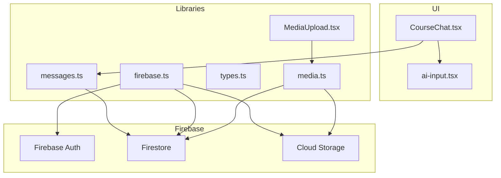
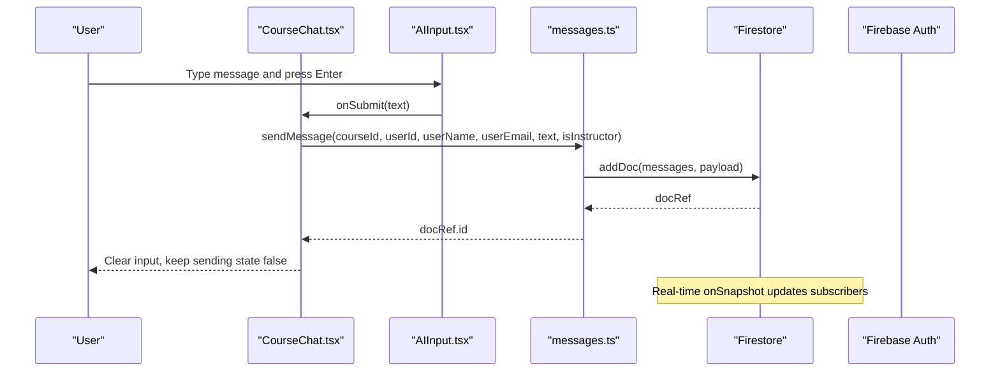
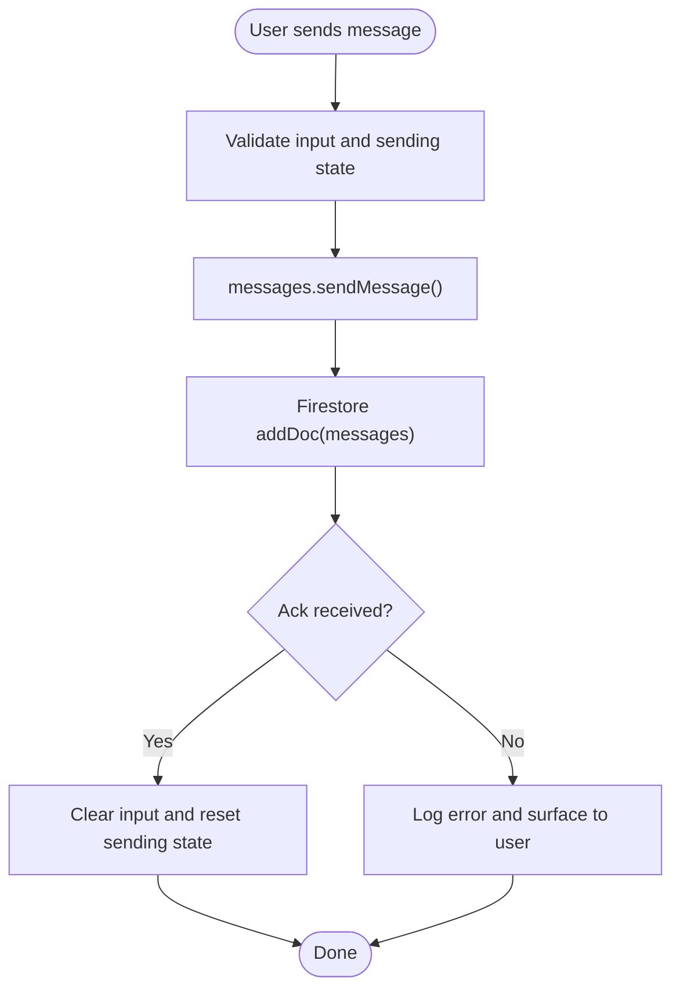
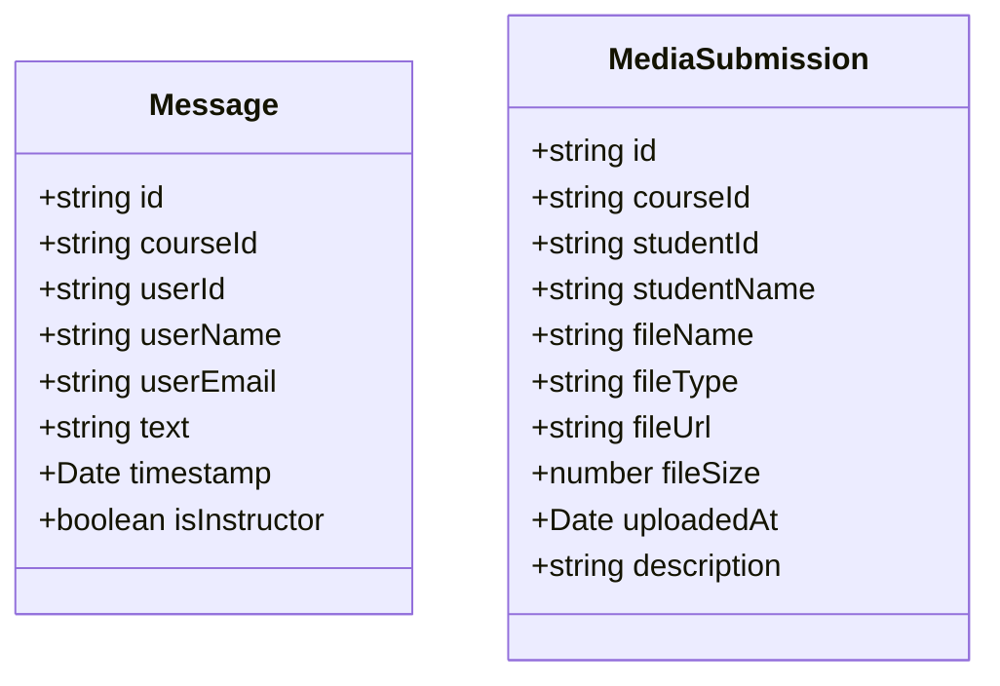
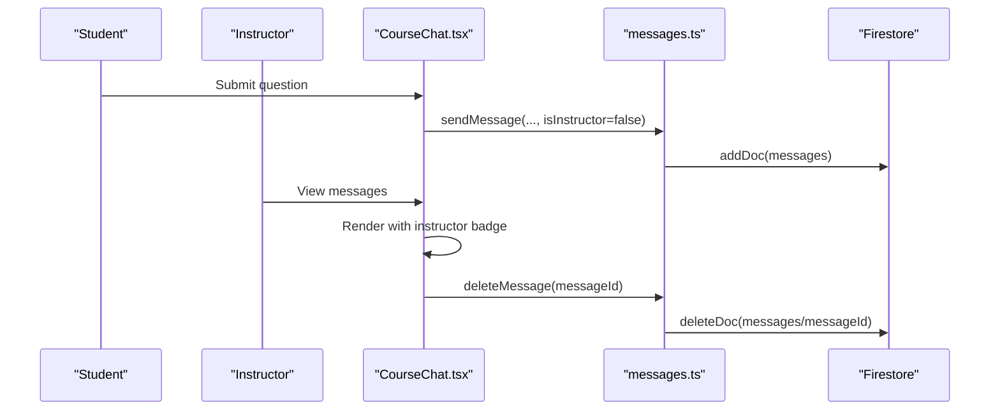
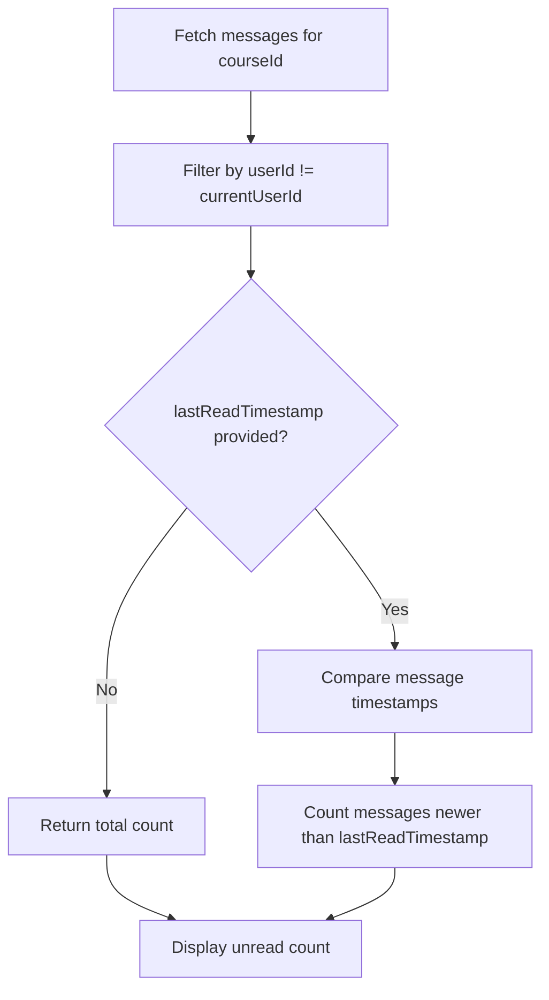
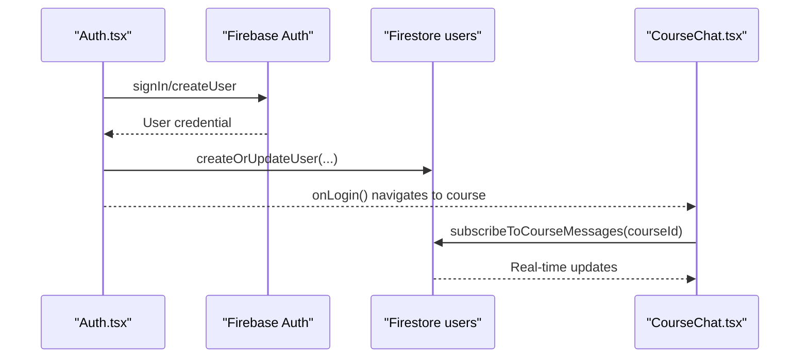
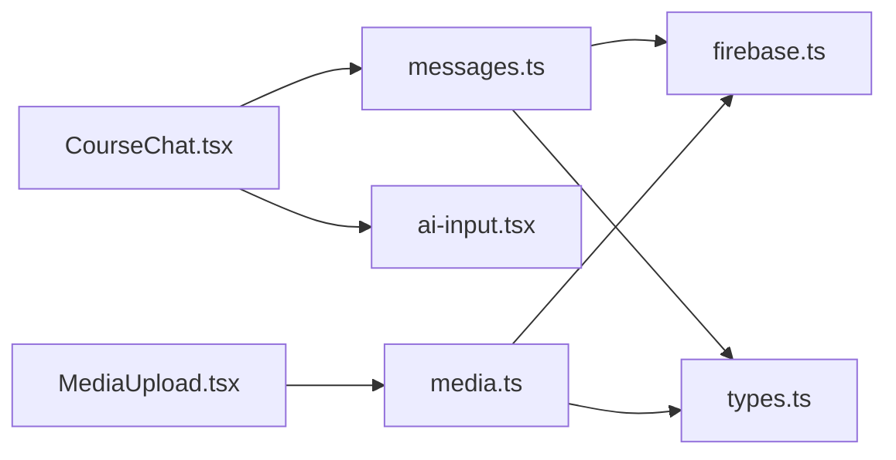

# Chat & Communication

<cite>
**Referenced Files in This Document**
- [CourseChat.tsx](file://components/CourseChat.tsx)
- [messages.ts](file://lib/messages.ts)
- [firebase.ts](file://lib/firebase.ts)
- [types.ts](file://types.ts)
- [ai-input.tsx](file://components/ui/ai-input.tsx)
- [Auth.tsx](file://components/Auth.tsx)
- [firestore.rules](file://firestore.rules)
- [storage.rules](file://storage.rules)
- [MediaUpload.tsx](file://components/MediaUpload.tsx)
- [media.ts](file://lib/media.ts)
- [StudentDashboard.tsx](file://components/StudentDashboard.tsx)
- [service-worker.js](file://public/service-worker.js)
</cite>

## Table of Contents
1. [Introduction](#introduction)
2. [Project Structure](#project-structure)
3. [Core Components](#core-components)
4. [Architecture Overview](#architecture-overview)
5. [Detailed Component Analysis](#detailed-component-analysis)
6. [Dependency Analysis](#dependency-analysis)
7. [Performance Considerations](#performance-considerations)
8. [Troubleshooting Guide](#troubleshooting-guide)
9. [Conclusion](#conclusion)
10. [Appendices](#appendices)

## Introduction
This document explains the chat and communication system built with Firebase. It covers real-time messaging, message persistence, delivery confirmation, course discussions, instructor–student interactions, group communication, message types, formatting, attachments, authentication integration, threading, notifications, offline behavior, synchronization, security, moderation, and privacy. It also provides integration patterns and user interaction workflows.

## Project Structure
The chat system centers around a dedicated UI component for course-level chat, a library module for Firestore interactions, and Firebase initialization. Attachments are supported via a separate media subsystem integrated with Firebase Storage and Firestore metadata. Authentication is handled centrally and enforced by Firestore and Storage security rules.

**Diagram sources**
- [CourseChat.tsx](file://components/CourseChat.tsx#L1-L231)
- [messages.ts](file://lib/messages.ts#L1-L124)
- [firebase.ts](file://lib/firebase.ts#L1-L25)
- [types.ts](file://types.ts#L58-L68)
- [ai-input.tsx](file://components/ui/ai-input.tsx#L1-L91)
- [MediaUpload.tsx](file://components/MediaUpload.tsx#L1-L589)
- [media.ts](file://lib/media.ts#L1-L369)

**Section sources**
- [CourseChat.tsx](file://components/CourseChat.tsx#L1-L231)
- [messages.ts](file://lib/messages.ts#L1-L124)
- [firebase.ts](file://lib/firebase.ts#L1-L25)
- [types.ts](file://types.ts#L58-L68)
- [ai-input.tsx](file://components/ui/ai-input.tsx#L1-L91)
- [MediaUpload.tsx](file://components/MediaUpload.tsx#L1-L589)
- [media.ts](file://lib/media.ts#L1-L369)

## Core Components
- CourseChat: Real-time chat UI for course discussions, message display, deletion, and input handling.
- messages library: Firestore operations for sending, subscribing, counting unread messages, and deleting messages.
- firebase initialization: Centralized Firebase setup with persistence enabled.
- AIInput: Flexible, auto-resizing text input with submit handling.
- MediaUpload and media library: Attachment support for images, videos, audio, PDFs, and documents; uploads to Storage and persists metadata to Firestore.
- Security rules: Firestore and Storage rules enforcing authentication and access control.

**Section sources**
- [CourseChat.tsx](file://components/CourseChat.tsx#L16-L231)
- [messages.ts](file://lib/messages.ts#L7-L124)
- [firebase.ts](file://lib/firebase.ts#L1-L25)
- [ai-input.tsx](file://components/ui/ai-input.tsx#L10-L91)
- [MediaUpload.tsx](file://components/MediaUpload.tsx#L14-L589)
- [media.ts](file://lib/media.ts#L8-L117)
- [firestore.rules](file://firestore.rules#L1-L92)
- [storage.rules](file://storage.rules#L1-L11)

## Architecture Overview
The system uses Firestore for real-time message synchronization and Cloud Storage for attachments. Authentication is enforced at the UI and database layers. Persistence is enabled for offline readiness.

**Diagram sources**
- [CourseChat.tsx](file://components/CourseChat.tsx#L46-L67)
- [ai-input.tsx](file://components/ui/ai-input.tsx#L26-L42)
- [messages.ts](file://lib/messages.ts#L7-L32)
- [firebase.ts](file://lib/firebase.ts#L17-L22)

## Detailed Component Analysis

### Real-Time Messaging and Persistence
- Real-time subscription: The chat subscribes to messages filtered by courseId and ordered by timestamp, receiving updates via onSnapshot.
- Persistence: Firestore local cache is enabled with multi-tab manager for offline readiness and cross-tab sync.
- Delivery confirmation: The UI considers a send operation successful when the server returns a document identifier; errors are surfaced to the user.

**Diagram sources**
- [CourseChat.tsx](file://components/CourseChat.tsx#L46-L67)
- [messages.ts](file://lib/messages.ts#L7-L32)
- [firebase.ts](file://lib/firebase.ts#L18-L22)

**Section sources**
- [CourseChat.tsx](file://components/CourseChat.tsx#L30-L67)
- [messages.ts](file://lib/messages.ts#L57-L85)
- [firebase.ts](file://lib/firebase.ts#L18-L22)

### Message Types, Formatting, and Attachments
- Message model: Includes courseId, userId, userName, userEmail, text, timestamp, and isInstructor flag.
- Formatting: Messages are grouped by date, styled differently for own/instructor/student messages, and display timestamps.
- Attachments: Supported file types include images, videos, audio, PDFs, and generic documents. Uploads are resumable, progress tracked, and metadata stored in Firestore while files are stored in Cloud Storage.

**Diagram sources**
- [types.ts](file://types.ts#L58-L68)
- [media.ts](file://lib/media.ts#L70-L95)

**Section sources**
- [types.ts](file://types.ts#L58-L68)
- [CourseChat.tsx](file://components/CourseChat.tsx#L105-L119)
- [MediaUpload.tsx](file://components/MediaUpload.tsx#L210-L226)
- [media.ts](file://lib/media.ts#L282-L288)

### Course Discussion and Instructor–Student Interaction
- Role differentiation: isInstructor flag distinguishes instructor messages visually and grants deletion rights.
- Deletion: Only the author or an instructor can delete a message; confirmation is requested before deletion.
- Grouping: Messages are grouped by human-friendly dates (Today, Yesterday, or localized date) and displayed in chronological order.

**Diagram sources**
- [CourseChat.tsx](file://components/CourseChat.tsx#L69-L78)
- [messages.ts](file://lib/messages.ts#L114-L123)

**Section sources**
- [CourseChat.tsx](file://components/CourseChat.tsx#L160-L200)
- [messages.ts](file://lib/messages.ts#L114-L123)

### Group Communication Features
- Course-scoped threads: All messages are associated with a courseId, enabling course-specific discussions.
- Unread counting: A helper computes unread counts for other users’ messages, supporting notification-like indicators.

**Diagram sources**
- [messages.ts](file://lib/messages.ts#L87-L112)

**Section sources**
- [messages.ts](file://lib/messages.ts#L87-L112)

### Message Threading and Display
- Thread model: One logical thread per courseId; messages are ordered chronologically.
- UI threading: Messages are grouped by date and rendered in bubbles with sender identity and timestamps.

**Section sources**
- [CourseChat.tsx](file://components/CourseChat.tsx#L105-L119)
- [messages.ts](file://lib/messages.ts#L34-L55)

### Notification Systems
- Unread indicators: The unread count helper can be used to drive notification badges or counters elsewhere in the app.
- Integration suggestion: Combine unread count with a global state or a dashboard component to surface notifications.

**Section sources**
- [messages.ts](file://lib/messages.ts#L87-L112)
- [StudentDashboard.tsx](file://components/StudentDashboard.tsx#L16-L43)

### Offline Behavior and Synchronization
- Local persistence: Firestore local cache with multi-tab manager ensures offline readiness and cross-tab synchronization.
- Service worker: Provides an app shell and offline page handling for navigation fallbacks.

**Section sources**
- [firebase.ts](file://lib/firebase.ts#L18-L22)
- [service-worker.js](file://public/service-worker.js#L232-L254)

### Security and Privacy Controls
- Authentication enforcement: Firestore and Storage rules require authentication for reads and writes.
- Access control: Firestore rules define owners and admin roles; Storage limits file size and requires authentication.
- Moderation hooks: The message model supports instructor visibility and deletion; Firestore rules can be extended to enforce content policies.

**Section sources**
- [firestore.rules](file://firestore.rules#L1-L92)
- [storage.rules](file://storage.rules#L1-L11)
- [messages.ts](file://lib/messages.ts#L114-L123)

### Integration Patterns and Workflows
- Chat integration: Embed CourseChat in course pages, passing courseId, user profile, and isInstructor flag.
- Attachment workflow: Use MediaUpload to collect files, record audio, and persist metadata; link to download URLs for playback or viewing.
- Authentication flow: Use Auth component to sign in users; Firestore user records can be created/updated during login.

**Diagram sources**
- [Auth.tsx](file://components/Auth.tsx#L21-L44)
- [messages.ts](file://lib/messages.ts#L57-L85)

**Section sources**
- [CourseChat.tsx](file://components/CourseChat.tsx#L16-L36)
- [MediaUpload.tsx](file://components/MediaUpload.tsx#L86-L155)
- [Auth.tsx](file://components/Auth.tsx#L21-L44)

## Dependency Analysis
- CourseChat depends on messages.ts for sending and subscribing, and on AIInput for text input.
- messages.ts depends on firebase.ts for Firestore initialization and on types.ts for the Message interface.
- MediaUpload depends on media.ts for upload and metadata operations.
- Security rules depend on authenticated users for access to Firestore and Storage.

**Diagram sources**
- [CourseChat.tsx](file://components/CourseChat.tsx#L1-L5)
- [messages.ts](file://lib/messages.ts#L1-L3)
- [firebase.ts](file://lib/firebase.ts#L1-L25)
- [types.ts](file://types.ts#L58-L68)
- [MediaUpload.tsx](file://components/MediaUpload.tsx#L1-L4)
- [media.ts](file://lib/media.ts#L1-L4)

**Section sources**
- [CourseChat.tsx](file://components/CourseChat.tsx#L1-L5)
- [messages.ts](file://lib/messages.ts#L1-L3)
- [media.ts](file://lib/media.ts#L1-L4)

## Performance Considerations
- Use pagination or server-side filtering for very large message histories.
- Debounce or batch UI updates when rendering large arrays of messages.
- Limit attachment sizes and leverage resumable uploads; monitor progress to improve perceived performance.
- Keep the UI responsive by avoiding heavy computations in render paths.

## Troubleshooting Guide
- Real-time not updating:
  - Verify courseId filter and that onSnapshot is attached.
  - Confirm Firestore rules allow reads for authenticated users.
- Sending fails silently:
  - Check console logs in messages.ts for error returns.
  - Ensure isInstructor flag is passed correctly when needed.
- CORS errors on uploads:
  - Review storage.rules and configure CORS as indicated in media.ts error handling.
- Offline issues:
  - Confirm local cache initialization and service worker caching behavior.

**Section sources**
- [messages.ts](file://lib/messages.ts#L28-L31)
- [media.ts](file://lib/media.ts#L54-L76)
- [firebase.ts](file://lib/firebase.ts#L18-L22)
- [storage.rules](file://storage.rules#L1-L11)

## Conclusion
The chat and communication system leverages Firebase Firestore for real-time, persistent messaging and Cloud Storage for attachments. It integrates authentication centrally, enforces access control via security rules, and provides a flexible UI with role-aware interactions. With persistence and resumable uploads, it supports reliable offline and low-connectivity experiences. Extending moderation and notification features is straightforward given the current architecture.

## Appendices

### API and Function Reference
- sendMessage(courseId, userId, userName, userEmail, text, isInstructor?): Returns document identifier or null.
- subscribeToCourseMessages(courseId, callback): Returns unsubscribe function.
- getUnreadMessageCount(courseId, userId, lastReadTimestamp?): Returns unread count.
- deleteMessage(messageId): Returns boolean success.
- uploadMedia(file, courseId, studentId, studentName, description?, onProgress?): Returns media document identifier or null.
- getCourseMedia(courseId): Returns array of MediaSubmission.
- deleteMedia(mediaId, fileUrl): Deletes file and metadata.

**Section sources**
- [messages.ts](file://lib/messages.ts#L7-L124)
- [media.ts](file://lib/media.ts#L8-L117)
- [media.ts](file://lib/media.ts#L163-L191)
- [media.ts](file://lib/media.ts#L266-L280)