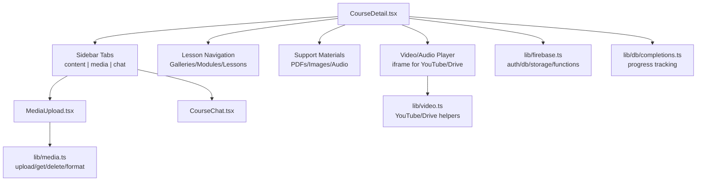
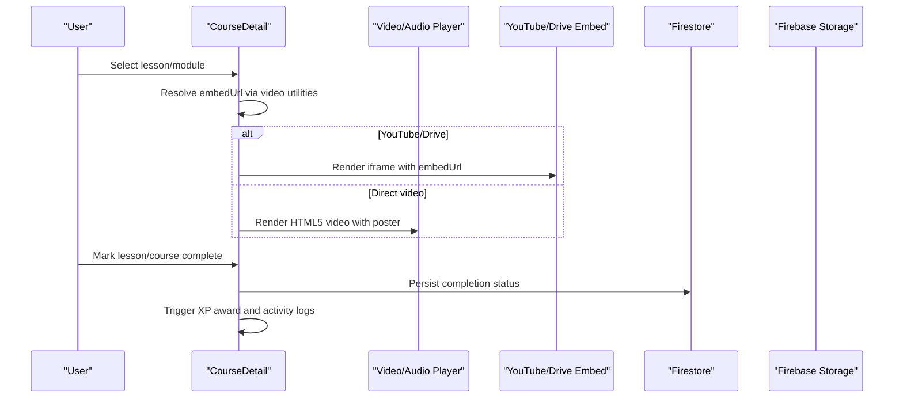
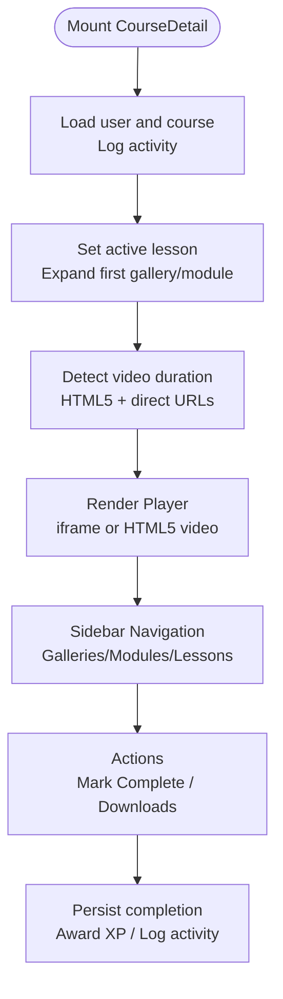
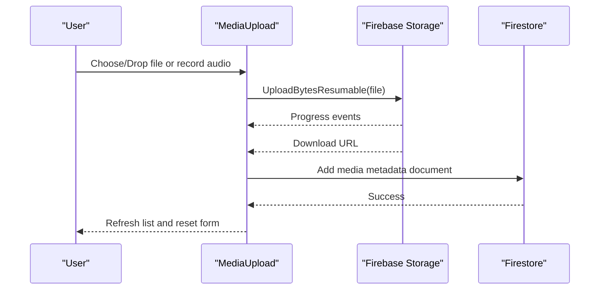
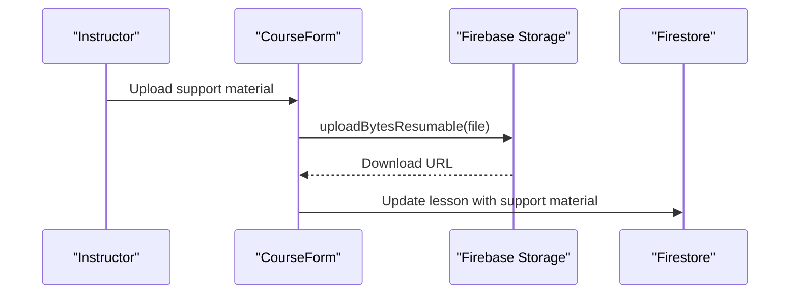
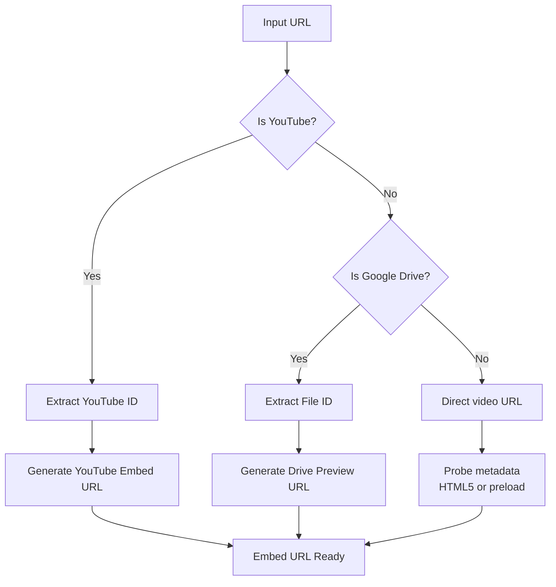
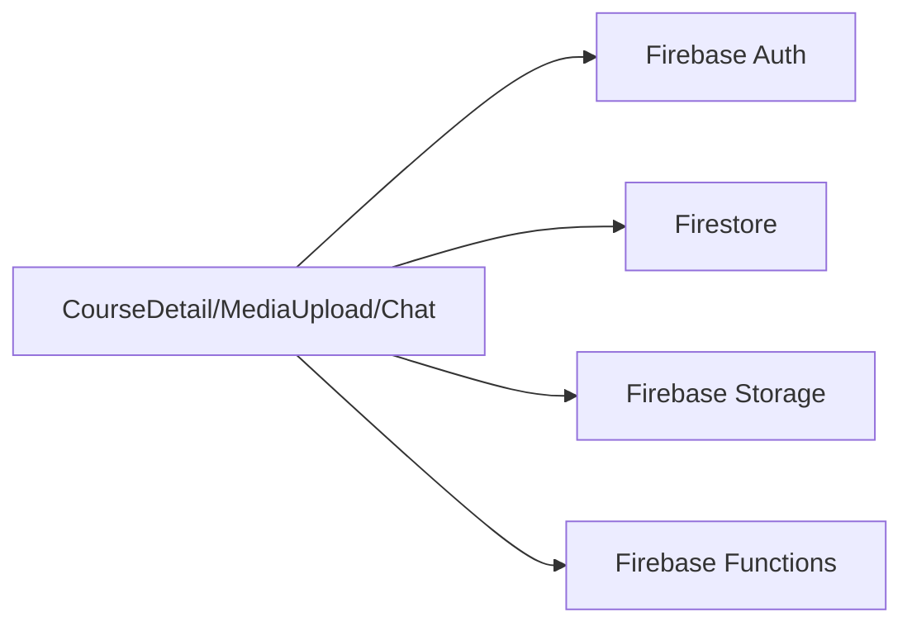

# Content Delivery & Management

<cite>
**Referenced Files in This Document**
- [CourseDetail.tsx](file://components/CourseDetail.tsx)
- [MediaUpload.tsx](file://components/MediaUpload.tsx)
- [media.ts](file://lib/media.ts)
- [video.ts](file://lib/video.ts)
- [CourseChat.tsx](file://components/CourseChat.tsx)
- [types.ts](file://types.ts)
- [firebase.ts](file://lib/firebase.ts)
- [completions.ts](file://lib/db/completions.ts)
</cite>

## Table of Contents
1. [Introduction](#introduction)
2. [Project Structure](#project-structure)
3. [Core Components](#core-components)
4. [Architecture Overview](#architecture-overview)
5. [Detailed Component Analysis](#detailed-component-analysis)
6. [Dependency Analysis](#dependency-analysis)
7. [Performance Considerations](#performance-considerations)
8. [Troubleshooting Guide](#troubleshooting-guide)
9. [Conclusion](#conclusion)

## Introduction
This document describes the Content Delivery & Management system with a focus on the CourseDetail component and related media management capabilities. It explains lesson navigation, content playback controls, progress tracking, and support for multiple content types (video with YouTube integration, audio, and PDF resources). It also documents the media upload pipeline, storage integration via Firebase, and chat integration for course discussions. Accessibility, responsive design, and performance optimization strategies for media-heavy content are included.

## Project Structure
The system centers around a course-centric UI with three primary panes:
- Main player area for video/audio/PDF content
- Sidebar tabs for content navigation, media uploads, and chat

**Diagram sources**
- [CourseDetail.tsx](file://components/CourseDetail.tsx#L19-L523)
- [MediaUpload.tsx](file://components/MediaUpload.tsx#L14-L586)
- [media.ts](file://lib/media.ts#L8-L368)
- [video.ts](file://lib/video.ts#L12-L148)
- [CourseChat.tsx](file://components/CourseChat.tsx#L16-L230)
- [firebase.ts](file://lib/firebase.ts#L1-L24)
- [completions.ts](file://lib/db/completions.ts#L6-L55)

**Section sources**
- [CourseDetail.tsx](file://components/CourseDetail.tsx#L19-L523)
- [MediaUpload.tsx](file://components/MediaUpload.tsx#L14-L586)
- [media.ts](file://lib/media.ts#L8-L368)
- [video.ts](file://lib/video.ts#L12-L148)
- [CourseChat.tsx](file://components/CourseChat.tsx#L16-L230)
- [firebase.ts](file://lib/firebase.ts#L1-L24)
- [completions.ts](file://lib/db/completions.ts#L6-L55)

## Core Components
- CourseDetail: Orchestrates lesson navigation, content playback, progress tracking, and sidebar tabs.
- MediaUpload: Handles file uploads (images, videos, audio, PDFs), drag-and-drop, recording, previews, and deletion.
- video utilities: Extract YouTube IDs, produce embed URLs, detect Google Drive links, and format durations.
- media utilities: Upload to Firebase Storage, persist metadata to Firestore, list and delete submissions, format file sizes, and upload lesson support materials.
- CourseChat: Real-time chat with message grouping, timestamps, and instructor moderation.

**Section sources**
- [CourseDetail.tsx](file://components/CourseDetail.tsx#L19-L523)
- [MediaUpload.tsx](file://components/MediaUpload.tsx#L14-L586)
- [media.ts](file://lib/media.ts#L8-L368)
- [video.ts](file://lib/video.ts#L12-L148)
- [CourseChat.tsx](file://components/CourseChat.tsx#L16-L230)

## Architecture Overview
The CourseDetail component integrates:
- Playback: iframe for YouTube/Drive, HTML5 video fallback, and image placeholders
- Navigation: Hierarchical galleries/modules/lessons with expand/collapse and active selection
- Progress: Completion toggling persisted to Firestore
- Media: Uploads to Firebase Storage with metadata stored in Firestore
- Chat: Real-time messaging with grouping and moderation

**Diagram sources**
- [CourseDetail.tsx](file://components/CourseDetail.tsx#L148-L157)
- [video.ts](file://lib/video.ts#L96-L107)
- [completions.ts](file://lib/db/completions.ts#L31-L55)

## Detailed Component Analysis

### CourseDetail Component
Responsibilities:
- Initialize course context, load completion status, and log activity
- Manage active lesson, expanded galleries/modules, and lesson durations
- Render video/audio/PDF content with YouTube/Drive integration
- Provide support materials listing and downloads
- Toggle course completion and award XP

Key behaviors:
- Lesson selection defaults to the first lesson in the first gallery/module
- Duration detection for HTML5 videos and direct URLs
- YouTube/Drive URL detection and embed URL generation
- Support materials display with icons and sizes

**Diagram sources**
- [CourseDetail.tsx](file://components/CourseDetail.tsx#L29-L146)
- [video.ts](file://lib/video.ts#L96-L148)

**Section sources**
- [CourseDetail.tsx](file://components/CourseDetail.tsx#L19-L523)
- [video.ts](file://lib/video.ts#L12-L148)
- [types.ts](file://types.ts#L71-L82)
- [completions.ts](file://lib/db/completions.ts#L6-L55)

### Media Management System
Responsibilities:
- Upload media submissions (images, videos, audio, PDFs) with progress callbacks
- Upload course covers and lesson support materials
- List, group, and delete media submissions
- Format file sizes and enforce type/size constraints

Upload flow:

Support materials flow:

**Diagram sources**
- [MediaUpload.tsx](file://components/MediaUpload.tsx#L86-L155)
- [media.ts](file://lib/media.ts#L8-L117)
- [media.ts](file://lib/media.ts#L301-L368)

**Section sources**
- [MediaUpload.tsx](file://components/MediaUpload.tsx#L14-L586)
- [media.ts](file://lib/media.ts#L8-L368)

### Video and Audio Integration
Capabilities:
- YouTube URL parsing and embed URL generation
- Google Drive URL detection and preview embedding
- HTML5 video duration extraction and formatting
- Direct video URL duration probing for MP4/WebM/Ogg

**Diagram sources**
- [video.ts](file://lib/video.ts#L12-L107)
- [video.ts](file://lib/video.ts#L113-L148)
- [CourseDetail.tsx](file://components/CourseDetail.tsx#L94-L126)

**Section sources**
- [video.ts](file://lib/video.ts#L12-L148)
- [CourseDetail.tsx](file://components/CourseDetail.tsx#L94-L126)

### PDF Resources and Support Materials
- Support materials are lesson-scoped attachments (PDFs, images, audio)
- Instructors can upload via CourseForm; students can view/download from CourseDetail
- File type validation and size limits enforced during upload
- Display includes filename, size, and optional description

**Section sources**
- [CourseDetail.tsx](file://components/CourseDetail.tsx#L283-L321)
- [media.ts](file://lib/media.ts#L301-L368)

### Chat Integration
- Real-time messaging scoped to course
- Message grouping by date, timestamps, and sender roles
- Instructor moderation (delete own and others’ messages)
- Auto-scroll to latest message and expandable history

**Section sources**
- [CourseChat.tsx](file://components/CourseChat.tsx#L16-L230)

### Progress Tracking Integration
- Completion toggles for course and individual lessons
- Persistence in Firestore under a dedicated completions collection
- Activity logging and XP award on completion

**Section sources**
- [CourseDetail.tsx](file://components/CourseDetail.tsx#L128-L146)
- [completions.ts](file://lib/db/completions.ts#L6-L55)

## Dependency Analysis
External integrations:
- Firebase Authentication for user context
- Firestore for metadata (media, messages, completions)
- Firebase Storage for media assets
- Firebase Functions for serverless workflows (configured)

**Diagram sources**
- [firebase.ts](file://lib/firebase.ts#L1-L24)
- [CourseDetail.tsx](file://components/CourseDetail.tsx#L1-L11)
- [MediaUpload.tsx](file://components/MediaUpload.tsx#L1-L4)
- [CourseChat.tsx](file://components/CourseChat.tsx#L1-L5)

**Section sources**
- [firebase.ts](file://lib/firebase.ts#L1-L24)
- [CourseDetail.tsx](file://components/CourseDetail.tsx#L1-L11)
- [MediaUpload.tsx](file://components/MediaUpload.tsx#L1-L4)
- [CourseChat.tsx](file://components/CourseChat.tsx#L1-L5)

## Performance Considerations
- Lazy initialization of lesson durations to avoid blocking render
- Preload metadata for direct video URLs to compute duration efficiently
- Use iframe embeds for YouTube/Drive to offload decoding and playback to browser/external providers
- Debounce or batch UI updates for large galleries/modules
- Optimize media thumbnails and previews; defer heavy assets until needed
- Use responsive aspect ratios and lazy loading for images/PDFs
- Minimize re-renders by memoizing derived values (e.g., lesson durations)

[No sources needed since this section provides general guidance]

## Troubleshooting Guide
Common issues and resolutions:
- CORS errors on upload: Configure CORS for Firebase Storage or adjust rules in the Firebase Console
- Unauthorized storage access: Verify Firebase Storage rules allow authenticated writes
- Large file uploads: Enforce client-side size checks and inform users of limits
- Unsupported file types: Validate MIME types and restrict allowed extensions
- Chat not loading: Confirm Firestore security rules and real-time listeners are configured

**Section sources**
- [media.ts](file://lib/media.ts#L54-L77)
- [media.ts](file://lib/media.ts#L314-L331)
- [CourseChat.tsx](file://components/CourseChat.tsx#L30-L36)

## Conclusion
The Content Delivery & Management system provides a cohesive learning experience with robust media handling, flexible content playback, and integrated collaboration tools. CourseDetail orchestrates navigation and progress, while MediaUpload and media utilities enable rich, multi-type content distribution. Integrations with Firebase deliver scalable storage, real-time chat, and reliable progress tracking, supporting both learners and instructors in managing and delivering educational content effectively.