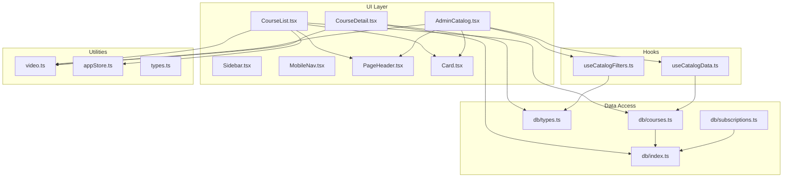
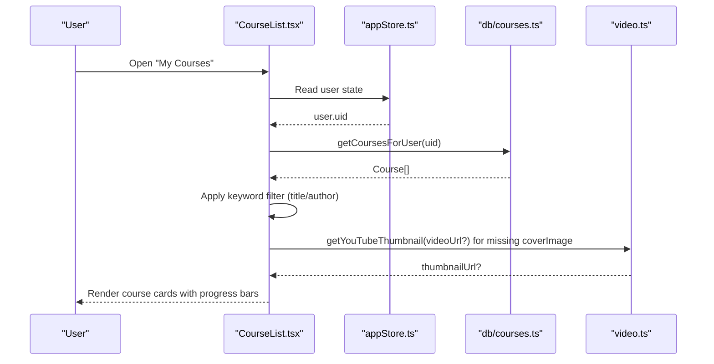
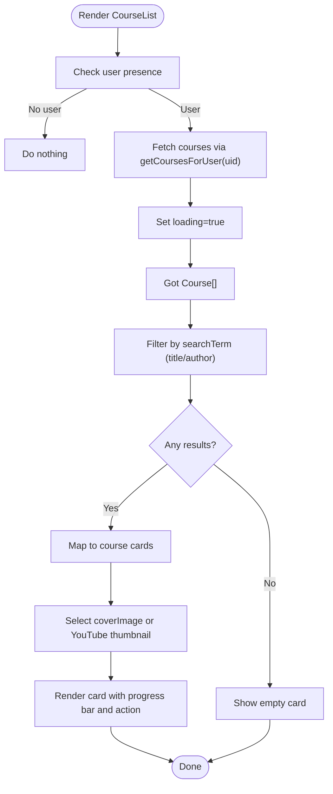
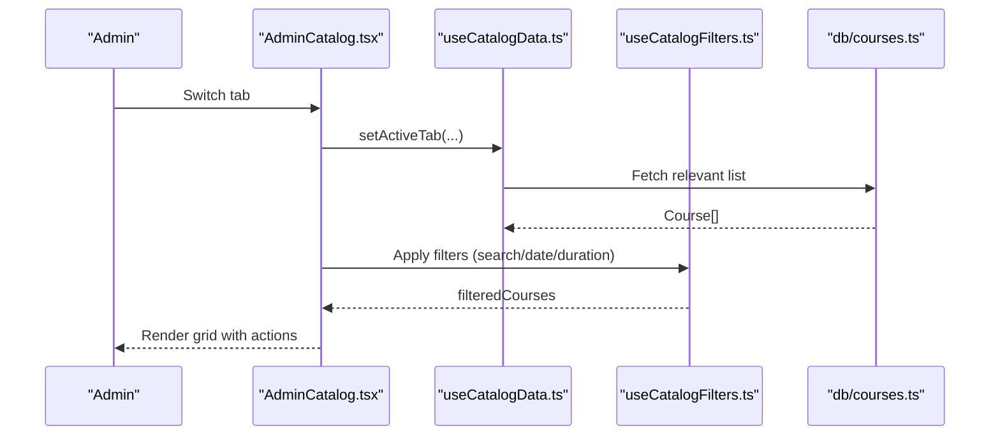
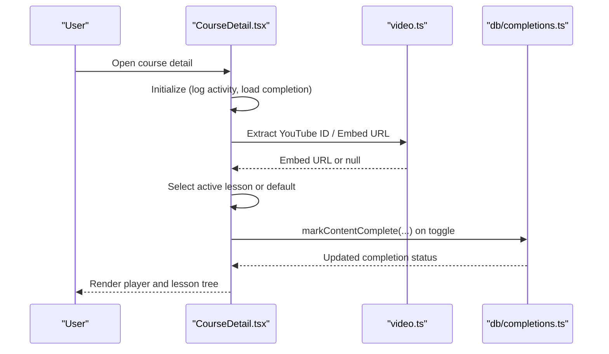
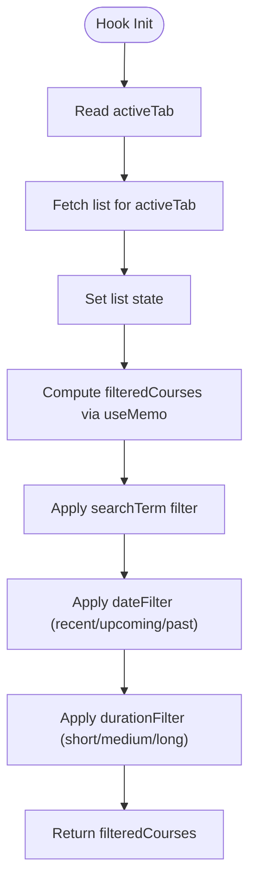
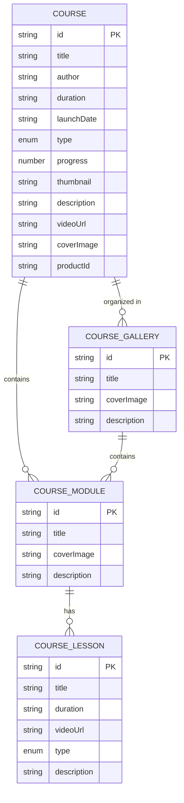
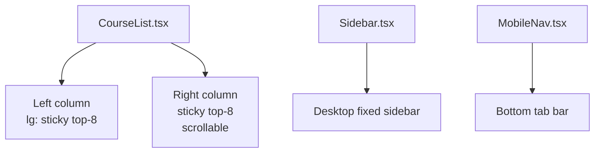
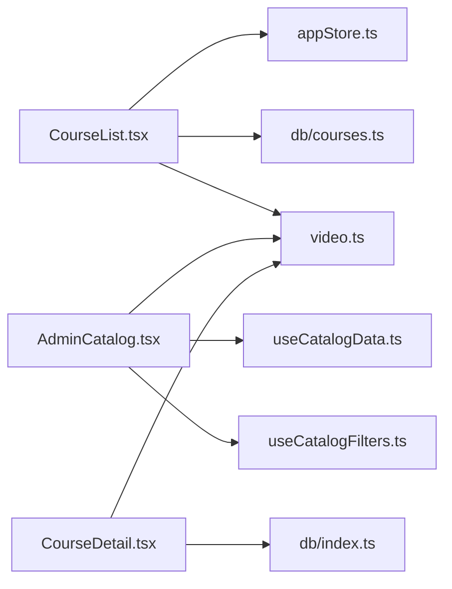

# Course Catalog & Organization

<cite>
**Referenced Files in This Document**
- [CourseList.tsx](file://components/CourseList.tsx)
- [AdminCatalog.tsx](file://components/AdminCatalog.tsx)
- [CourseDetail.tsx](file://components/CourseDetail.tsx)
- [useCatalogData.ts](file://hooks/useCatalogData.ts)
- [useCatalogFilters.ts](file://hooks/useCatalogFilters.ts)
- [db/index.ts](file://lib/db/index.ts)
- [db/courses.ts](file://lib/db/courses.ts)
- [db/types.ts](file://lib/db/types.ts)
- [db/subscriptions.ts](file://lib/db/subscriptions.ts)
- [video.ts](file://lib/video.ts)
- [appStore.ts](file://lib/stores/appStore.ts)
- [types.ts](file://types.ts)
- [Sidebar.tsx](file://components/Sidebar.tsx)
- [MobileNav.tsx](file://components/MobileNav.tsx)
- [Card.tsx](file://components/ui/Card.tsx)
- [PageHeader.tsx](file://components/ui/PageHeader.tsx)
- [CourseForm.tsx](file://components/CourseForm.tsx)
</cite>

## Table of Contents
1. [Introduction](#introduction)
2. [Project Structure](#project-structure)
3. [Core Components](#core-components)
4. [Architecture Overview](#architecture-overview)
5. [Detailed Component Analysis](#detailed-component-analysis)
6. [Dependency Analysis](#dependency-analysis)
7. [Performance Considerations](#performance-considerations)
8. [Troubleshooting Guide](#troubleshooting-guide)
9. [Conclusion](#conclusion)

## Introduction
This document explains the course catalog system and organization features, focusing on how courses are fetched, filtered, displayed, and navigated. It covers:
- CourseList component: display logic, thumbnail generation, progress tracking visualization, and responsive layout
- Search and filtering: keyword search by title and author, date and duration filters, and progress-based sorting
- Responsive design: course cards, sticky sidebar behavior, and mobile navigation
- Real-time updates and user-specific filtering
- Integration with YouTube thumbnails and cover image fallbacks
- Performance optimizations and lazy-loading strategies

## Project Structure
The course catalog spans components, hooks, and data utilities:
- UI and layout: CourseList, AdminCatalog, CourseDetail, Sidebar, MobileNav, PageHeader, Card
- Hooks: useCatalogData, useCatalogFilters
- Data access: db/index, db/courses, db/types, db/subscriptions
- Utilities: video (YouTube thumbnail extraction), appStore (user state), types (shared types)

**Diagram sources**
- [CourseList.tsx](file://components/CourseList.tsx#L1-L216)
- [AdminCatalog.tsx](file://components/AdminCatalog.tsx#L1-L430)
- [CourseDetail.tsx](file://components/CourseDetail.tsx#L1-L526)
- [useCatalogData.ts](file://hooks/useCatalogData.ts#L1-L157)
- [useCatalogFilters.ts](file://hooks/useCatalogFilters.ts#L1-L86)
- [db/index.ts](file://lib/db/index.ts#L1-L38)
- [db/courses.ts](file://lib/db/courses.ts#L1-L98)
- [db/types.ts](file://lib/db/types.ts#L1-L90)
- [db/subscriptions.ts](file://lib/db/subscriptions.ts#L1-L93)
- [video.ts](file://lib/video.ts#L1-L149)
- [appStore.ts](file://lib/stores/appStore.ts#L1-L82)
- [types.ts](file://types.ts#L1-L125)
- [Sidebar.tsx](file://components/Sidebar.tsx#L1-L152)
- [MobileNav.tsx](file://components/MobileNav.tsx#L1-L118)
- [PageHeader.tsx](file://components/ui/PageHeader.tsx#L1-L38)
- [Card.tsx](file://components/ui/Card.tsx#L1-L24)

**Section sources**
- [CourseList.tsx](file://components/CourseList.tsx#L1-L216)
- [AdminCatalog.tsx](file://components/AdminCatalog.tsx#L1-L430)
- [useCatalogData.ts](file://hooks/useCatalogData.ts#L1-L157)
- [useCatalogFilters.ts](file://hooks/useCatalogFilters.ts#L1-L86)
- [db/index.ts](file://lib/db/index.ts#L1-L38)
- [db/courses.ts](file://lib/db/courses.ts#L1-L98)
- [db/types.ts](file://lib/db/types.ts#L1-L90)
- [db/subscriptions.ts](file://lib/db/subscriptions.ts#L1-L93)
- [video.ts](file://lib/video.ts#L1-L149)
- [appStore.ts](file://lib/stores/appStore.ts#L1-L82)
- [types.ts](file://types.ts#L1-L125)
- [Sidebar.tsx](file://components/Sidebar.tsx#L1-L152)
- [MobileNav.tsx](file://components/MobileNav.tsx#L1-L118)
- [PageHeader.tsx](file://components/ui/PageHeader.tsx#L1-L38)
- [Card.tsx](file://components/ui/Card.tsx#L1-L24)

## Core Components
- CourseList: renders the logged-in user’s course list, applies keyword search, and displays course cards with thumbnails, progress bars, and action buttons.
- AdminCatalog: admin-facing catalog with tabs, advanced filters (date and duration), and grid layout for managing content.
- CourseDetail: detailed view with video player, lesson navigation, support materials, and completion tracking.
- useCatalogData: manages active tab, lists, CRUD operations, and loading states for courses, mindful flows, and music.
- useCatalogFilters: handles search term and filter toggles for date and duration, with memoized filtering.
- db/courses: fetches courses, adds, updates, deletes, and filters by user access.
- video utilities: extracts YouTube IDs, generates thumbnails, and embed URLs.

**Section sources**
- [CourseList.tsx](file://components/CourseList.tsx#L17-L213)
- [AdminCatalog.tsx](file://components/AdminCatalog.tsx#L37-L254)
- [CourseDetail.tsx](file://components/CourseDetail.tsx#L19-L525)
- [useCatalogData.ts](file://hooks/useCatalogData.ts#L20-L156)
- [useCatalogFilters.ts](file://hooks/useCatalogFilters.ts#L8-L85)
- [db/courses.ts](file://lib/db/courses.ts#L54-L97)
- [video.ts](file://lib/video.ts#L48-L107)

## Architecture Overview
The system integrates user state, data fetching, filtering, and UI rendering across screens. The CourseList component depends on user context and course data retrieval. Filtering is applied client-side on the current list, while AdminCatalog centralizes CRUD and filtering for administrators.

**Diagram sources**
- [CourseList.tsx](file://components/CourseList.tsx#L18-L32)
- [appStore.ts](file://lib/stores/appStore.ts#L48-L81)
- [db/courses.ts](file://lib/db/courses.ts#L54-L97)
- [video.ts](file://lib/video.ts#L48-L54)

## Detailed Component Analysis

### CourseList Component
- Fetching: Uses user context to call getCoursesForUser and sets loading state during fetch.
- Filtering: Case-insensitive substring match on title and author.
- Rendering:
  - Thumbnail selection: coverImage takes precedence; otherwise YouTube thumbnail fallback.
  - Progress visualization: horizontal progress bar sized by course.progress.
  - Action button text adapts to progress (start, review, continue).
- Layout:
  - Sticky left column for course cards (lg: sticky, top-8).
  - Right welcome panel with gradient background and sticky top behavior.
  - Responsive grid for cards and adaptive widths.

**Diagram sources**
- [CourseList.tsx](file://components/CourseList.tsx#L23-L32)
- [CourseList.tsx](file://components/CourseList.tsx#L34-L37)
- [CourseList.tsx](file://components/CourseList.tsx#L79-L140)
- [CourseList.tsx](file://components/CourseList.tsx#L80-L82)
- [CourseList.tsx](file://components/CourseList.tsx#L111-L113)

**Section sources**
- [CourseList.tsx](file://components/CourseList.tsx#L17-L213)

### AdminCatalog Component
- Tabs: Courses, Galleries, Mindful Flow, Music, with active state and content switching.
- Filters:
  - Keyword search input bound to state.
  - Date filter: recent, upcoming, past (with click-outside behavior).
  - Duration filter: short, medium, long (based on duration parsing).
- Grid rendering: Cards with thumbnails, badges, and action menu per item.
- CRUD: Delegated to useCatalogData hook; supports add/update/delete with confirmation.

**Diagram sources**
- [AdminCatalog.tsx](file://components/AdminCatalog.tsx#L37-L69)
- [useCatalogData.ts](file://hooks/useCatalogData.ts#L51-L59)
- [useCatalogFilters.ts](file://hooks/useCatalogFilters.ts#L28-L63)

**Section sources**
- [AdminCatalog.tsx](file://components/AdminCatalog.tsx#L37-L254)
- [useCatalogFilters.ts](file://hooks/useCatalogFilters.ts#L8-L85)
- [useCatalogData.ts](file://hooks/useCatalogData.ts#L20-L156)

### CourseDetail Component
- Initializes course context, logs activity, and loads completion status.
- Video playback: embeds YouTube/Drive or falls back to direct video; captures duration for HTML5 videos.
- Lesson navigation: supports new gallery/module/lesson hierarchy and legacy module/lesson.
- Completion tracking: marks/unmarks course completion and awards XP.

**Diagram sources**
- [CourseDetail.tsx](file://components/CourseDetail.tsx#L29-L71)
- [CourseDetail.tsx](file://components/CourseDetail.tsx#L94-L126)
- [CourseDetail.tsx](file://components/CourseDetail.tsx#L128-L146)
- [video.ts](file://lib/video.ts#L96-L107)

**Section sources**
- [CourseDetail.tsx](file://components/CourseDetail.tsx#L19-L525)
- [video.ts](file://lib/video.ts#L12-L107)

### Hooks: useCatalogData and useCatalogFilters
- useCatalogData:
  - Manages activeTab and lists for courses, mindful flows, and music.
  - Provides CRUD handlers and loaders for each tab.
  - getCurrentList returns the appropriate subset based on activeTab.
- useCatalogFilters:
  - Memoized filtering pipeline: search term, date range, and duration buckets.
  - Handles click-outside to close dropdowns and exposes clearFilters.

**Diagram sources**
- [useCatalogData.ts](file://hooks/useCatalogData.ts#L51-L67)
- [useCatalogFilters.ts](file://hooks/useCatalogFilters.ts#L28-L63)

**Section sources**
- [useCatalogData.ts](file://hooks/useCatalogData.ts#L20-L156)
- [useCatalogFilters.ts](file://hooks/useCatalogFilters.ts#L8-L85)

### Data Access and Types
- Course model supports both legacy modules and new galleries/modules/lessons structure.
- getCoursesForUser enforces access control: admins see all, unauthorized users see none, otherwise filtered by assigned course IDs and product linkage.

**Diagram sources**
- [db/types.ts](file://lib/db/types.ts#L36-L51)
- [db/types.ts](file://lib/db/types.ts#L20-L34)
- [db/types.ts](file://lib/db/types.ts#L1-L18)

**Section sources**
- [db/types.ts](file://lib/db/types.ts#L1-L90)
- [db/courses.ts](file://lib/db/courses.ts#L54-L97)

### Responsive Layout and Navigation
- CourseList:
  - Left column: lg: sticky, top-8, self-start.
  - Right column: sticky top-8 with max height and scrollable content.
- Sidebar and MobileNav:
  - Desktop: fixed sidebar with navigation items.
  - Mobile: bottom-fixed tab bar with icons and labels.

**Diagram sources**
- [CourseList.tsx](file://components/CourseList.tsx#L70-L72)
- [CourseList.tsx](file://components/CourseList.tsx#L144-L208)
- [Sidebar.tsx](file://components/Sidebar.tsx#L31-L123)
- [MobileNav.tsx](file://components/MobileNav.tsx#L11-L93)

**Section sources**
- [CourseList.tsx](file://components/CourseList.tsx#L70-L208)
- [Sidebar.tsx](file://components/Sidebar.tsx#L27-L123)
- [MobileNav.tsx](file://components/MobileNav.tsx#L11-L93)

## Dependency Analysis
- CourseList depends on:
  - User state (appStore)
  - Course data (db/courses)
  - YouTube thumbnail utility (video)
  - UI primitives (PageHeader, Card, Button)
- AdminCatalog depends on:
  - useCatalogData and useCatalogFilters
  - Video utilities for thumbnails
  - UI components for forms and grids
- CourseDetail depends on:
  - Video utilities for embed URLs
  - Completion and activity logging
  - Media upload and chat components

**Diagram sources**
- [CourseList.tsx](file://components/CourseList.tsx#L1-L15)
- [AdminCatalog.tsx](file://components/AdminCatalog.tsx#L1-L28)
- [CourseDetail.tsx](file://components/CourseDetail.tsx#L1-L11)
- [useCatalogData.ts](file://hooks/useCatalogData.ts#L1-L16)
- [useCatalogFilters.ts](file://hooks/useCatalogFilters.ts#L1-L2)
- [db/index.ts](file://lib/db/index.ts#L1-L38)

**Section sources**
- [CourseList.tsx](file://components/CourseList.tsx#L1-L15)
- [AdminCatalog.tsx](file://components/AdminCatalog.tsx#L1-L28)
- [CourseDetail.tsx](file://components/CourseDetail.tsx#L1-L11)
- [useCatalogData.ts](file://hooks/useCatalogData.ts#L1-L16)
- [useCatalogFilters.ts](file://hooks/useCatalogFilters.ts#L1-L2)
- [db/index.ts](file://lib/db/index.ts#L1-L38)

## Performance Considerations
- Client-side filtering:
  - useCatalogFilters uses useMemo to avoid recomputation when inputs are unchanged.
  - Filtering pipeline: search term, date range, duration buckets.
- Lazy loading and thumbnails:
  - CourseList defers to YouTube thumbnails only when coverImage is missing.
  - CourseDetail defers to iframe embedding for YouTube/Drive and uses direct video tag fallback.
- Real-time updates:
  - Subscriptions for courses and completions enable live updates in admin dashboards and leaderboards.
- Recommendations:
  - Prefer server-side ordering (e.g., Firestore queries with orderBy) to reduce client work.
  - Batch updates and avoid unnecessary re-renders by keeping filter state local to AdminCatalog.

[No sources needed since this section provides general guidance]

## Troubleshooting Guide
- Courses not visible for a user:
  - Verify access control in getCoursesForUser: unauthorized users return an empty list; admins see all.
  - Confirm user role and assignment of course access.
- Missing thumbnails:
  - Ensure coverImage is set; otherwise YouTube thumbnail is generated from videoUrl.
- Filters not applying:
  - Confirm dateFilterOpen is closed (click-outside handler) and durationFilterOpen is toggled off when not needed.
  - Clear filters to reset state.
- Video playback issues:
  - For direct MP4/WebM, duration is captured via metadata; for YouTube/Drive, embed URLs are used.
  - Check URL formats supported by video utilities.

**Section sources**
- [db/courses.ts](file://lib/db/courses.ts#L54-L97)
- [useCatalogFilters.ts](file://hooks/useCatalogFilters.ts#L15-L26)
- [video.ts](file://lib/video.ts#L48-L107)
- [CourseDetail.tsx](file://components/CourseDetail.tsx#L94-L126)

## Conclusion
The course catalog system combines user-aware data fetching, flexible filtering, and responsive UI to deliver an efficient learning experience. Administrators benefit from powerful management tools, while learners enjoy a streamlined course discovery and progress visualization interface. Integrations with YouTube thumbnails and real-time subscriptions enhance usability and maintain performance at scale.