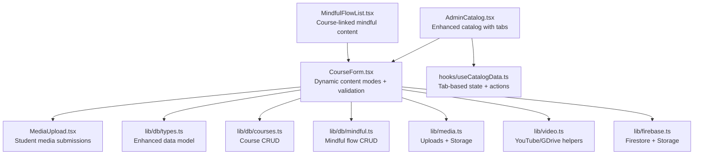
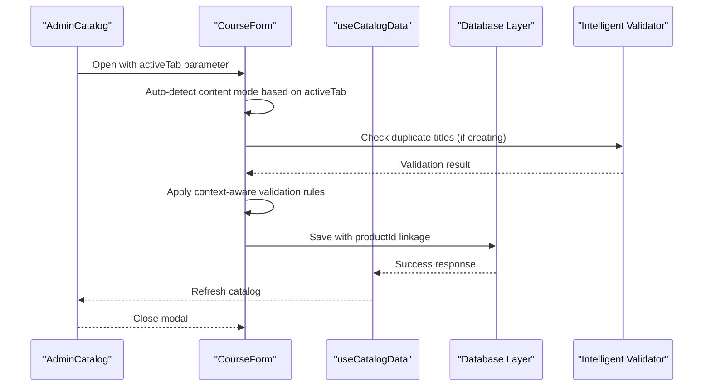
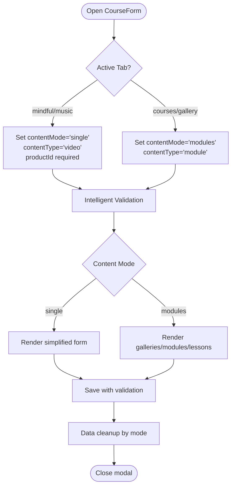
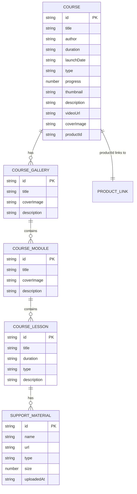
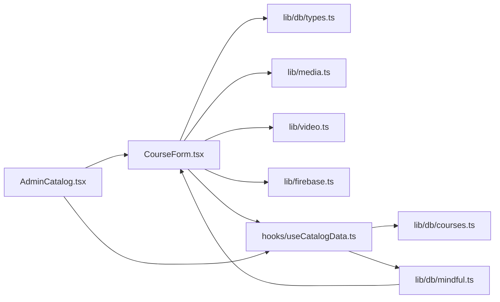

# Course Creation & Editing

<cite>
**Referenced Files in This Document**
- [components/CourseForm.tsx](file://components/CourseForm.tsx)
- [components/AdminCatalog.tsx](file://components/AdminCatalog.tsx)
- [components/MediaUpload.tsx](file://components/MediaUpload.tsx)
- [components/MindfulFlowList.tsx](file://components/MindfulFlowList.tsx)
- [lib/db/types.ts](file://lib/db/types.ts)
- [lib/db/courses.ts](file://lib/db/courses.ts)
- [lib/db/mindful.ts](file://lib/db/mindful.ts)
- [lib/db/index.ts](file://lib/db/index.ts)
- [lib/media.ts](file://lib/media.ts)
- [lib/video.ts](file://lib/video.ts)
- [lib/firebase.ts](file://lib/firebase.ts)
- [hooks/useCatalogData.ts](file://hooks/useCatalogData.ts)
- [types.ts](file://types.ts)
</cite>

## Update Summary
**Changes Made**
- Enhanced CourseForm component with dynamic content modes supporting both single video and modular gallery structures
- Added mindful flow and music content linking with intelligent validation requiring course association
- Implemented intelligent validation system with duplicate title checking and required field enforcement
- Added dynamic content mode switching based on active tab (mindful/music vs courses/gallery)
- Enhanced form validation with productId requirement for mindful and music content
- Improved user experience with contextual form titles and conversion buttons between content modes

## Table of Contents
1. [Introduction](#introduction)
2. [Project Structure](#project-structure)
3. [Core Components](#core-components)
4. [Architecture Overview](#architecture-overview)
5. [Detailed Component Analysis](#detailed-component-analysis)
6. [Dynamic Content Modes](#dynamic-content-modes)
7. [Mindful Flow & Music Integration](#mindful-flow--music-integration)
8. [Intelligent Validation System](#intelligent-validation-system)
9. [Dependency Analysis](#dependency-analysis)
10. [Performance Considerations](#performance-considerations)
11. [Troubleshooting Guide](#troubleshooting-guide)
12. [Conclusion](#conclusion)

## Introduction
This document explains the enhanced course creation and editing functionality in the Fluentoria platform. The system now features sophisticated dynamic content modes, mindful flow support, music content integration, and intelligent validation mechanisms. The CourseForm component serves as the central hub for creating and editing courses, supporting both traditional single-video content and modern modular gallery structures with hierarchical organization of modules and lessons.

The platform now seamlessly integrates mindful flow content and music resources, requiring them to be linked to specific base courses for proper access control and delivery. Intelligent validation ensures data integrity with duplicate title checking and required field enforcement across different content types.

## Project Structure
The course creation/editing feature spans UI components, database types, and utility libraries with enhanced integration points:

- **UI Components**: CourseForm renders dynamic creation/editing modals with intelligent content mode switching; AdminCatalog orchestrates catalog views and opens CourseForm; MediaUpload handles student media submissions; MindfulFlowList displays mindful content organized by linked courses.
- **Data Model**: Enhanced Course, CourseModule, CourseLesson, CourseGallery, and SupportMaterial types with productId linking for mindful/music content.
- **Database Integration**: Separate collections for courses, mindful flows, and music content with unified access control through productId relationships.
- **Validation System**: Intelligent form validation with duplicate checking, required field enforcement, and context-aware field requirements.
- **Utility Libraries**: Firebase integration for Firestore and Cloud Storage; media upload helpers; video URL parsing and thumbnails.

**Diagram sources**
- [components/AdminCatalog.tsx:230-248](file://components/AdminCatalog.tsx#L230-L248)
- [components/CourseForm.tsx:43-122](file://components/CourseForm.tsx#L43-L122)
- [components/MindfulFlowList.tsx:1-37](file://components/MindfulFlowList.tsx#L1-L37)
- [hooks/useCatalogData.ts:17-20](file://hooks/useCatalogData.ts#L17-L20)

## Core Components

### Enhanced CourseForm Component
The CourseForm component now features sophisticated dynamic content modes with intelligent validation:

- **Dynamic Content Modes**: Automatic switching between 'modules' and 'single' modes based on active tab and content type
- **Intelligent Validation**: Duplicate title checking, required field enforcement, and context-aware field requirements
- **Content Type Management**: Support for both 'module' (structured galleries/modules/lessons) and 'video' (single video) content types
- **ProductId Linking**: Mandatory course association for mindful and music content with automatic productId population
- **Contextual UI**: Dynamic form titles and conversion buttons between content modes based on active tab

### AdminCatalog Enhancement
Enhanced catalog system with tab-based navigation supporting four distinct content categories:
- **Courses**: Traditional course content with gallery structure
- **Gallery**: Structured content with galleries, modules, and lessons
- **Mindful**: Mindful flow content requiring course linkage
- **Music**: Music content requiring course linkage

### MindfulFlowList Integration
New component for displaying mindful flow content organized by linked courses, providing students with access to mindful content associated with their purchased courses.

### Database Integration
Enhanced database operations supporting separate collections for different content types while maintaining unified access control through productId relationships.

**Section sources**
- [components/CourseForm.tsx:43-122](file://components/CourseForm.tsx#L43-L122)
- [components/AdminCatalog.tsx:230-248](file://components/AdminCatalog.tsx#L230-L248)
- [components/MindfulFlowList.tsx:1-37](file://components/MindfulFlowList.tsx#L1-L37)
- [hooks/useCatalogData.ts:17-20](file://hooks/useCatalogData.ts#L17-L20)

## Architecture Overview
The enhanced CourseForm integrates dynamic content modes, intelligent validation, and contextual UI based on active tab selection:

- **Dynamic State Management**: Form state automatically adapts to content type and active tab with intelligent defaults
- **Context-Aware Validation**: Validation rules change based on content type and tab context with real-time feedback
- **Unified Access Control**: productId field ensures mindful and music content is properly linked to base courses
- **Tab-Based Navigation**: Active tab determines form behavior, validation requirements, and UI presentation

**Diagram sources**
- [components/AdminCatalog.tsx:240-247](file://components/AdminCatalog.tsx#L240-L247)
- [components/CourseForm.tsx:124-170](file://components/CourseForm.tsx#L124-L170)
- [hooks/useCatalogData.ts:72-98](file://hooks/useCatalogData.ts#L72-L98)

## Detailed Component Analysis

### Enhanced CourseForm Component Architecture
The CourseForm now features sophisticated state management and dynamic content mode switching:

- **State Management**: Comprehensive form state with contentMode, contentType, coverType, and upload state tracking
- **Dynamic Mode Detection**: Automatic content mode selection based on active tab (mindful/music vs courses/gallery)
- **Context-Aware Defaults**: Intelligent default values for mindful and music content requiring course linkage
- **Enhanced Validation**: Real-time duplicate checking, required field enforcement, and context-specific validation rules

**Diagram sources**
- [components/CourseForm.tsx:68-122](file://components/CourseForm.tsx#L68-L122)
- [components/CourseForm.tsx:124-170](file://components/CourseForm.tsx#L124-L170)

**Section sources**
- [components/CourseForm.tsx:43-122](file://components/CourseForm.tsx#L43-L122)
- [components/CourseForm.tsx:124-170](file://components/CourseForm.tsx#L124-L170)

### Data Model Enhancements
The data model now supports enhanced content organization with productId linking for mindful and music content:

- **Course Structure**: Supports both legacy modules array and new galleries array for backward compatibility
- **ProductId Integration**: Mandatory field for mindful and music content linking to base courses
- **Enhanced Types**: Support for video, audio, and pdf content types with proper type discrimination
- **Metadata Enhancement**: Additional fields for launch dates, thumbnails, and progress tracking

**Diagram sources**
- [lib/db/types.ts:36-51](file://lib/db/types.ts#L36-L51)

**Section sources**
- [lib/db/types.ts:1-90](file://lib/db/types.ts#L1-L90)

### Media Upload and Support Materials
Enhanced media handling with improved validation and type detection:

- **Type Detection**: Automatic file type detection for images, audio, and PDFs with proper validation
- **Upload Tracking**: Individual upload state tracking for support materials within lessons
- **Size Validation**: Client-side size validation with user feedback for large files
- **Progress Tracking**: Real-time upload progress for better user experience

**Section sources**
- [components/CourseForm.tsx:497-557](file://components/CourseForm.tsx#L497-L557)
- [lib/media.ts:301-369](file://lib/media.ts#L301-L369)

## Dynamic Content Modes
The system now supports sophisticated content mode switching based on user context and content type:

### Automatic Content Mode Detection
The CourseForm automatically detects and sets appropriate content modes based on the active tab:

- **Mindful/Music Tabs**: Automatically set to single video mode with productId requirement
- **Courses/Gallery Tabs**: Default to module-based structure with galleries and lessons
- **Contextual Defaults**: Intelligent default values for course titles and authors when creating new content

### Content Mode Conversion
Users can seamlessly convert between content modes with intelligent data preservation:

- **Module to Video Conversion**: Preserves course metadata while clearing module structure
- **Video to Module Conversion**: Maintains course information while setting up gallery structure
- **Data Cleanup**: Automatic cleanup of conflicting data when switching modes

**Section sources**
- [components/CourseForm.tsx:68-122](file://components/CourseForm.tsx#L68-L122)
- [components/CourseForm.tsx:594-627](file://components/CourseForm.tsx#L594-L627)

## Mindful Flow & Music Integration
Enhanced integration with mindful flow and music content requiring course linkage:

### Course Association Requirement
Mindful flow and music content now require mandatory association with base courses:

- **ProductId Field**: Mandatory dropdown for selecting base course from available courses
- **Contextual Validation**: Required field validation specifically for mindful and music content
- **Access Control**: Unified access control through productId relationships

### Tab-Based Content Organization
Separate tab navigation for different content types with specialized UI:

- **Mindful Tab**: Dedicated interface for mindful flow content with course linkage
- **Music Tab**: Specialized interface for music content with course association
- **Unified Experience**: Consistent form behavior across all content types

**Section sources**
- [components/CourseForm.tsx:679-723](file://components/CourseForm.tsx#L679-L723)
- [components/CourseForm.tsx:1098-1142](file://components/CourseForm.tsx#L1098-L1142)
- [components/AdminCatalog.tsx:314-324](file://components/AdminCatalog.tsx#L314-L324)

## Intelligent Validation System
The enhanced validation system provides context-aware validation with real-time feedback:

### Duplicate Title Prevention
Automatic duplicate title checking prevents content duplication:

- **Real-time Checking**: Validation triggers when creating new content
- **Normalized Comparison**: Case-insensitive comparison with whitespace normalization
- **User-Friendly Errors**: Clear error messages with suggested alternatives

### Context-Aware Field Requirements
Validation rules adapt based on content type and tab context:

- **Required Fields**: Different required fields for mindful/music vs courses/gallery
- **Conditional Validation**: productId field becomes required for mindful/music content
- **Dynamic Form Titles**: Form titles change based on active tab and content type

### Error Handling and User Feedback
Comprehensive error handling with clear user feedback:

- **Loading States**: Visual feedback during validation and submission
- **Error Messages**: Context-specific error messages for different validation failures
- **Success Feedback**: Confirmation of successful content creation/editing

**Section sources**
- [components/CourseForm.tsx:124-170](file://components/CourseForm.tsx#L124-L170)
- [components/CourseForm.tsx:651-655](file://components/CourseForm.tsx#L651-L655)

## Dependency Analysis
Enhanced dependency structure supporting dynamic content modes and intelligent validation:

- **CourseForm Dependencies**: UI primitives, data types, media utilities, video helpers, Firebase services, and tab-based catalog hook
- **AdminCatalog Integration**: Enhanced with tab-based navigation and dynamic form opening
- **Database Layer**: Separate collections for courses, mindful flows, and music with unified access control
- **Validation System**: Integrated validation with real-time feedback and context-aware rules

**Diagram sources**
- [components/CourseForm.tsx:23-30](file://components/CourseForm.tsx#L23-L30)
- [components/AdminCatalog.tsx:240-247](file://components/AdminCatalog.tsx#L240-L247)
- [hooks/useCatalogData.ts:72-98](file://hooks/useCatalogData.ts#L72-L98)

**Section sources**
- [components/CourseForm.tsx:23-30](file://components/CourseForm.tsx#L23-L30)
- [components/AdminCatalog.tsx:240-247](file://components/AdminCatalog.tsx#L240-L247)
- [hooks/useCatalogData.ts:72-98](file://hooks/useCatalogData.ts#L72-L98)

## Performance Considerations
Enhanced performance optimizations for dynamic content modes:

- **Lazy Loading**: Content modes load only when needed based on active tab
- **Efficient Validation**: Real-time validation with debouncing to prevent excessive checks
- **State Optimization**: Intelligent state updates to minimize re-renders during mode switching
- **Memory Management**: Proper cleanup of temporary data during content mode conversion

## Troubleshooting Guide
Common issues and resolutions for the enhanced system:

### Content Mode Switching Issues
- **Symptom**: Content mode doesn't switch when changing tabs
- **Resolution**: Verify activeTab prop is passed correctly to CourseForm
- **Reference**: Check CourseForm useEffect for activeTab dependency

### Validation Errors
- **Symptom**: Duplicate title validation triggers unexpectedly
- **Resolution**: Ensure title comparison uses normalized values and check availableCourses prop
- **Reference**: Review handleSubmit validation logic

### Mindful/Music Content Issues
- **Symptom**: productId field validation fails for mindful/music content
- **Resolution**: Verify availableCourses prop contains valid course data and productId is properly set
- **Reference**: Check productId dropdown rendering logic

**Section sources**
- [components/CourseForm.tsx:68-122](file://components/CourseForm.tsx#L68-L122)
- [components/CourseForm.tsx:124-170](file://components/CourseForm.tsx#L124-L170)

## Conclusion
The enhanced CourseForm component provides a sophisticated, flexible interface for creating and editing courses across multiple content types. The dynamic content modes seamlessly switch between single video and modular gallery structures based on user context and tab selection. Intelligent validation ensures data integrity with duplicate prevention and context-aware field requirements. The mindful flow and music integration maintains proper course linkage through productId relationships, enabling unified access control and delivery.

The system balances advanced functionality with user-friendly interfaces, providing seamless experiences for both administrators creating complex course structures and users accessing mindful content linked to their purchased courses. The enhanced validation system, dynamic content modes, and intelligent form behavior represent significant improvements in content management capabilities while maintaining strong data integrity and user experience standards.