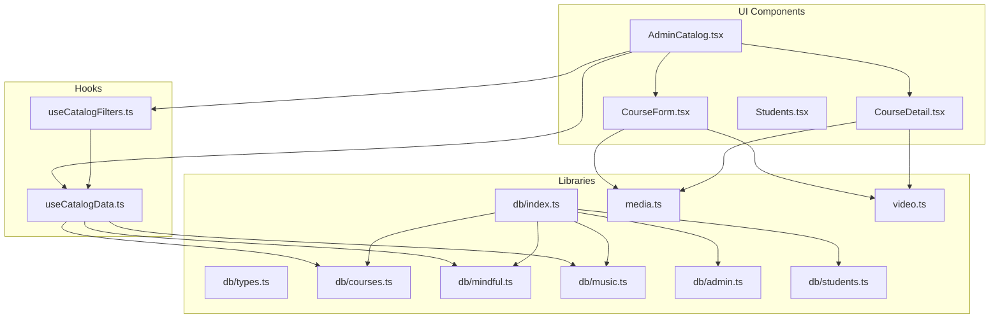
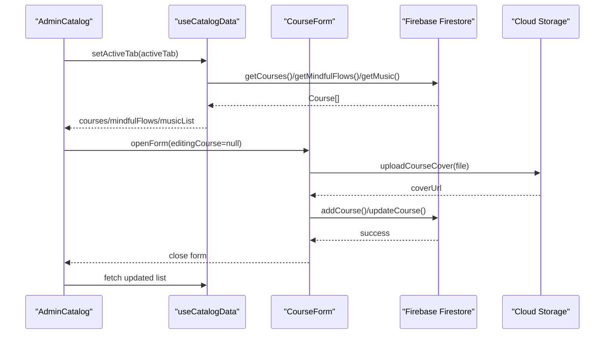
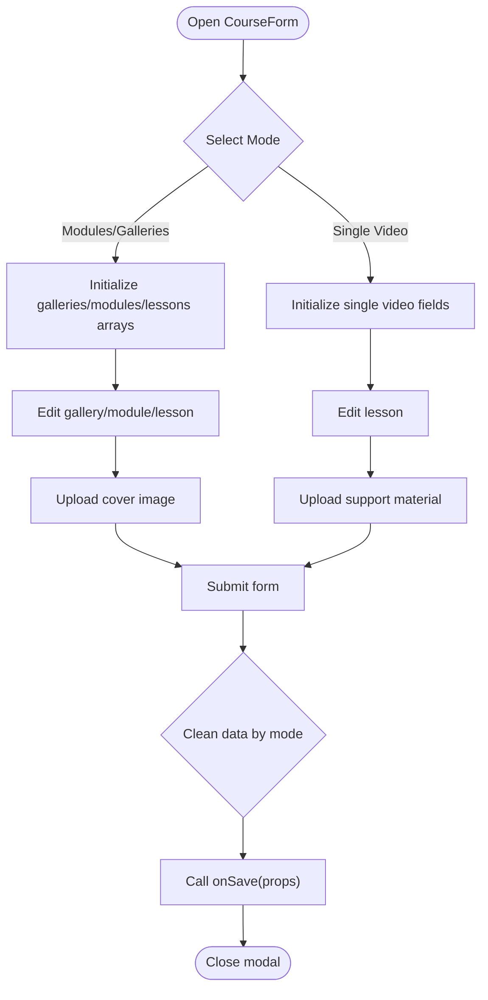
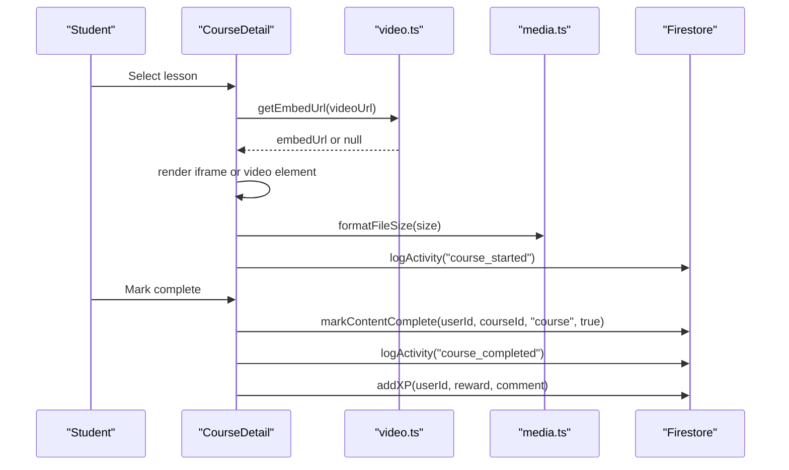
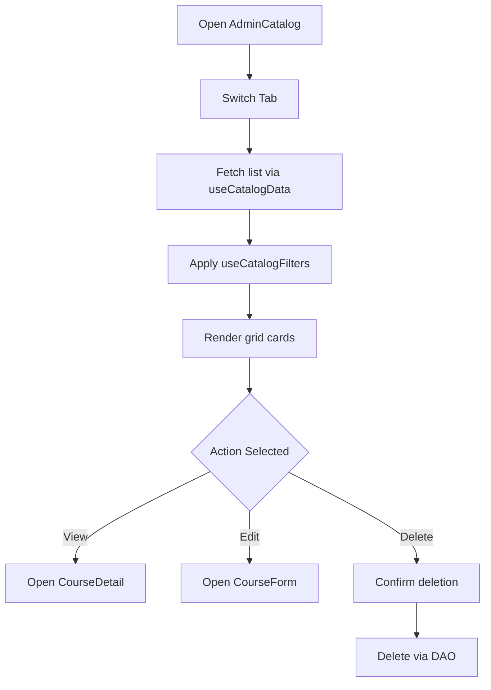
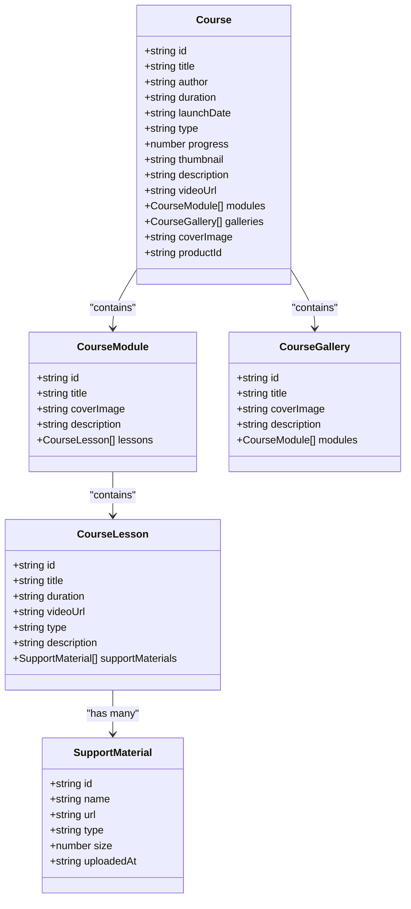
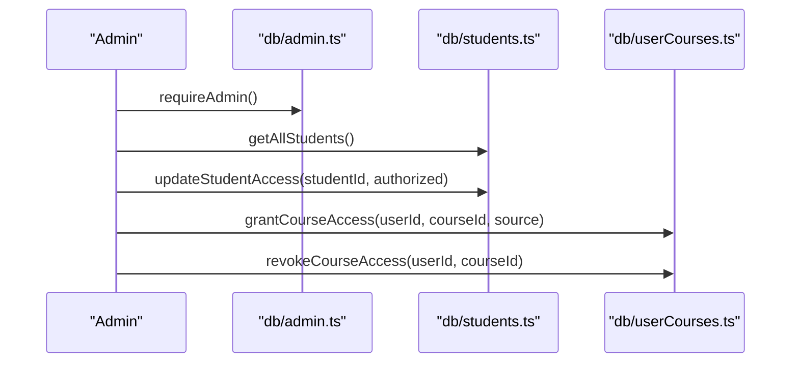
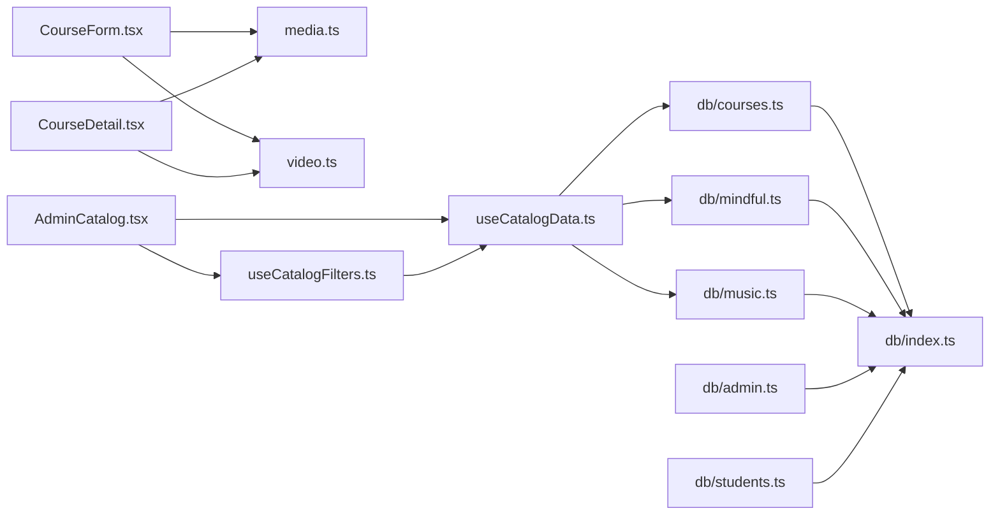

# Course Management System

<cite>
**Referenced Files in This Document**
- [AdminCatalog.tsx](file://components/AdminCatalog.tsx)
- [CourseForm.tsx](file://components/CourseForm.tsx)
- [CourseDetail.tsx](file://components/CourseDetail.tsx)
- [useCatalogData.ts](file://hooks/useCatalogData.ts)
- [useCatalogFilters.ts](file://hooks/useCatalogFilters.ts)
- [db/index.ts](file://lib/db/index.ts)
- [db/types.ts](file://lib/db/types.ts)
- [db/courses.ts](file://lib/db/courses.ts)
- [db/mindful.ts](file://lib/db/mindful.ts)
- [db/music.ts](file://lib/db/music.ts)
- [db/admin.ts](file://lib/db/admin.ts)
- [db/students.ts](file://lib/db/students.ts)
- [media.ts](file://lib/media.ts)
- [video.ts](file://lib/video.ts)
- [Students.tsx](file://components/Students.tsx)
</cite>

## Table of Contents
1. [Introduction](#introduction)
2. [Project Structure](#project-structure)
3. [Core Components](#core-components)
4. [Architecture Overview](#architecture-overview)
5. [Detailed Component Analysis](#detailed-component-analysis)
6. [Dependency Analysis](#dependency-analysis)
7. [Performance Considerations](#performance-considerations)
8. [Troubleshooting Guide](#troubleshooting-guide)
9. [Conclusion](#conclusion)

## Introduction
This document explains the course management system that powers content creation, organization, discovery, and delivery. It covers:
- Course structure and workflows (creation, editing, deletion)
- Supported content types (video lessons, audio materials, PDF resources, interactive modules)
- Course catalog architecture, search and filtering, and content delivery
- Administrative features for approvals, scheduling, and access control
- The relationship between courses, modules, lessons, and student progress tracking
- Practical examples for course creation, content uploads, and student enrollment management

## Project Structure
The system is organized around React components, shared hooks, and a library of utilities for database operations, media handling, and video processing. Key areas:
- Admin catalog and forms for managing content
- Course detail and player for learners
- Hooks for catalog data and filters
- Database layer for courses, mindful flows, music, and students
- Media utilities for uploads and support materials
- Video utilities for YouTube and Google Drive embedding

**Diagram sources**
- [AdminCatalog.tsx](file://components/AdminCatalog.tsx#L1-L430)
- [CourseForm.tsx](file://components/CourseForm.tsx#L1-L1144)
- [CourseDetail.tsx](file://components/CourseDetail.tsx#L1-L526)
- [useCatalogData.ts](file://hooks/useCatalogData.ts#L1-L157)
- [useCatalogFilters.ts](file://hooks/useCatalogFilters.ts#L1-L86)
- [db/index.ts](file://lib/db/index.ts#L1-L38)
- [db/types.ts](file://lib/db/types.ts#L1-L90)
- [db/courses.ts](file://lib/db/courses.ts#L1-L97)
- [db/mindful.ts](file://lib/db/mindful.ts#L1-L87)
- [db/music.ts](file://lib/db/music.ts#L1-L87)
- [db/admin.ts](file://lib/db/admin.ts#L1-L302)
- [db/students.ts](file://lib/db/students.ts#L1-L285)
- [media.ts](file://lib/media.ts#L1-L369)
- [video.ts](file://lib/video.ts#L1-L149)

**Section sources**
- [AdminCatalog.tsx](file://components/AdminCatalog.tsx#L1-L430)
- [CourseForm.tsx](file://components/CourseForm.tsx#L1-L1144)
- [CourseDetail.tsx](file://components/CourseDetail.tsx#L1-L526)
- [useCatalogData.ts](file://hooks/useCatalogData.ts#L1-L157)
- [useCatalogFilters.ts](file://hooks/useCatalogFilters.ts#L1-L86)
- [db/index.ts](file://lib/db/index.ts#L1-L38)

## Core Components
- AdminCatalog: Central admin interface for browsing, filtering, and managing courses, mindful flows, and music. Provides create/edit/delete actions and a modal-based CourseForm.
- CourseForm: Full-featured form supporting two modes:
  - Modules/Galleries: Hierarchical structure with galleries, modules, and lessons; supports cover uploads and support material attachments.
  - Single video: Direct single-lesson course with video URL and cover image.
- CourseDetail: Learner-facing page with video player, sidebar navigation, support materials, chat, and media upload integration.
- useCatalogData/useCatalogFilters: Shared hooks for fetching lists, applying filters, and coordinating CRUD operations across tabs.
- Database layer: Typed models and DAOs for courses, mindful flows, music, completions, students, and access control.
- Media utilities: Uploads for course covers, support materials, and learner media submissions with progress callbacks and file validation.
- Video utilities: YouTube and Google Drive URL parsing, embed generation, and duration helpers.

**Section sources**
- [AdminCatalog.tsx](file://components/AdminCatalog.tsx#L1-L430)
- [CourseForm.tsx](file://components/CourseForm.tsx#L1-L1144)
- [CourseDetail.tsx](file://components/CourseDetail.tsx#L1-L526)
- [useCatalogData.ts](file://hooks/useCatalogData.ts#L1-L157)
- [useCatalogFilters.ts](file://hooks/useCatalogFilters.ts#L1-L86)
- [db/types.ts](file://lib/db/types.ts#L1-L90)
- [media.ts](file://lib/media.ts#L1-L369)
- [video.ts](file://lib/video.ts#L1-L149)

## Architecture Overview
The system follows a layered architecture:
- Presentation layer: React components (AdminCatalog, CourseForm, CourseDetail, Students)
- Business logic layer: Hooks (useCatalogData, useCatalogFilters) and utilities (media, video)
- Data access layer: Firebase Firestore collections via typed DAOs
- Persistence layer: Firestore documents and Cloud Storage for media

**Diagram sources**
- [AdminCatalog.tsx](file://components/AdminCatalog.tsx#L37-L254)
- [useCatalogData.ts](file://hooks/useCatalogData.ts#L20-L156)
- [CourseForm.tsx](file://components/CourseForm.tsx#L119-L131)
- [media.ts](file://lib/media.ts#L120-L161)
- [db/courses.ts](file://lib/db/courses.ts#L8-L52)

**Section sources**
- [AdminCatalog.tsx](file://components/AdminCatalog.tsx#L1-L430)
- [useCatalogData.ts](file://hooks/useCatalogData.ts#L1-L157)
- [media.ts](file://lib/media.ts#L1-L369)
- [db/courses.ts](file://lib/db/courses.ts#L1-L97)

## Detailed Component Analysis

### CourseForm: Creation, Editing, and Deletion Workflows
CourseForm supports:
- Mode switching between modules/galleries and single video
- Hierarchical content management (galleries → modules → lessons)
- Cover image upload and URL input
- Support material uploads (PDF, image, audio) with progress and validation
- Automatic cleanup of conflicting fields based on mode

**Diagram sources**
- [CourseForm.tsx](file://components/CourseForm.tsx#L43-L131)
- [CourseForm.tsx](file://components/CourseForm.tsx#L150-L260)
- [CourseForm.tsx](file://components/CourseForm.tsx#L381-L421)
- [CourseForm.tsx](file://components/CourseForm.tsx#L458-L518)

Practical examples:
- Creating a gallery-based course: Switch to modules mode, add a gallery, add modules and lessons, upload covers, attach support materials, and save.
- Creating a single video course: Switch to single mode, enter title, author, duration, and video URL, upload cover, and save.

**Section sources**
- [CourseForm.tsx](file://components/CourseForm.tsx#L1-L1144)
- [media.ts](file://lib/media.ts#L120-L161)
- [media.ts](file://lib/media.ts#L301-L369)

### CourseDetail: Content Delivery and Progress Tracking
CourseDetail renders:
- Video player supporting YouTube, Google Drive, and direct video URLs
- Sidebar navigation across galleries, modules, and lessons
- Support materials display with icons and file size formatting
- Completion toggling and XP rewards logging
- Media upload and chat integration

**Diagram sources**
- [CourseDetail.tsx](file://components/CourseDetail.tsx#L19-L146)
- [video.ts](file://lib/video.ts#L96-L107)
- [media.ts](file://lib/media.ts#L290-L296)
- [db/index.ts](file://lib/db/index.ts#L18-L25)

**Section sources**
- [CourseDetail.tsx](file://components/CourseDetail.tsx#L1-L526)
- [video.ts](file://lib/video.ts#L1-L149)
- [media.ts](file://lib/media.ts#L290-L296)

### AdminCatalog: Catalog Architecture, Search, and Filtering
AdminCatalog provides:
- Tabbed navigation across courses, galleries, mindful flows, and music
- Search bar and filter dropdowns (launch date and duration)
- Grid view with thumbnails, badges, and action menus
- Integration with CourseForm for create/edit and CourseDetail for preview

**Diagram sources**
- [AdminCatalog.tsx](file://components/AdminCatalog.tsx#L37-L254)
- [useCatalogData.ts](file://hooks/useCatalogData.ts#L20-L156)
- [useCatalogFilters.ts](file://hooks/useCatalogFilters.ts#L8-L85)

**Section sources**
- [AdminCatalog.tsx](file://components/AdminCatalog.tsx#L1-L430)
- [useCatalogData.ts](file://hooks/useCatalogData.ts#L1-L157)
- [useCatalogFilters.ts](file://hooks/useCatalogFilters.ts#L1-L86)

### Data Models: Courses, Modules, Lessons, and Support Materials
The system defines typed models for hierarchical content and support materials.

**Diagram sources**
- [db/types.ts](file://lib/db/types.ts#L1-L90)

**Section sources**
- [db/types.ts](file://lib/db/types.ts#L1-L90)

### Administrative Features: Approval, Scheduling, Access Control
Administrative capabilities include:
- Role enforcement for privileged operations
- Access control checks for students
- Student management (add, authorize, revoke access)
- Course access control via user-course mapping

**Diagram sources**
- [db/admin.ts](file://lib/db/admin.ts#L7-L17)
- [db/admin.ts](file://lib/db/admin.ts#L81-L122)
- [db/students.ts](file://lib/db/students.ts#L7-L63)
- [db/students.ts](file://lib/db/students.ts#L262-L284)

**Section sources**
- [db/admin.ts](file://lib/db/admin.ts#L1-L302)
- [db/students.ts](file://lib/db/students.ts#L1-L285)

### Content Types and Management Through CourseForm
Supported content types:
- Video lessons (YouTube, Google Drive, direct MP4/WebM/Ogg)
- Audio lessons (via support materials)
- PDF resources (via support materials)
- Interactive modules (galleries → modules → lessons)

CourseForm manages:
- Cover uploads for courses, galleries, and modules
- Support material uploads with type validation and size limits
- Lesson duration detection for direct videos
- Embed URL generation for YouTube and Google Drive

**Section sources**
- [CourseForm.tsx](file://components/CourseForm.tsx#L1-L1144)
- [media.ts](file://lib/media.ts#L301-L369)
- [video.ts](file://lib/video.ts#L96-L148)

### Relationship Between Courses, Modules, Lessons, and Progress Tracking
- Courses can be single-lesson or hierarchical (galleries → modules → lessons)
- Progress tracking is handled via completion records keyed by content type
- Administrators can grant/revoke access to courses per student
- Learners can mark courses complete and receive XP rewards

**Section sources**
- [db/types.ts](file://lib/db/types.ts#L63-L69)
- [db/courses.ts](file://lib/db/courses.ts#L54-L96)
- [CourseDetail.tsx](file://components/CourseDetail.tsx#L128-L146)

### Practical Examples

#### Course Creation Workflow
- Open AdminCatalog and click “New Content”
- Choose modules/galleries mode to create a structured course or single video mode for a direct lesson
- Fill in title, author, duration, and cover image (upload or link)
- Add galleries, modules, and lessons; upload covers and support materials
- Save and verify in the grid view

**Section sources**
- [AdminCatalog.tsx](file://components/AdminCatalog.tsx#L72-L82)
- [CourseForm.tsx](file://components/CourseForm.tsx#L43-L131)

#### Content Upload Process
- Use the cover upload button to select an image for courses, galleries, or modules
- Attach support materials to lessons using the upload handler; supported types include PDF, images, and audio
- Progress callbacks provide real-time feedback during uploads

**Section sources**
- [CourseForm.tsx](file://components/CourseForm.tsx#L442-L456)
- [CourseForm.tsx](file://components/CourseForm.tsx#L458-L518)
- [media.ts](file://lib/media.ts#L301-L369)

#### Student Enrollment Management
- Navigate to the Students view to manage enrollments
- Toggle course access for individual students (grant or revoke)
- Authorize or revoke student access globally
- Review student media submissions grouped by date and course

**Section sources**
- [Students.tsx](file://components/Students.tsx#L1-L542)
- [db/students.ts](file://lib/db/students.ts#L262-L284)
- [db/admin.ts](file://lib/db/admin.ts#L276-L301)

## Dependency Analysis
The system exhibits clear separation of concerns:
- Components depend on hooks for data orchestration
- Hooks depend on DAOs for persistence
- Utilities encapsulate cross-cutting concerns (media, video)
- Admin and student modules enforce access control

**Diagram sources**
- [CourseForm.tsx](file://components/CourseForm.tsx#L1-L31)
- [CourseDetail.tsx](file://components/CourseDetail.tsx#L1-L11)
- [AdminCatalog.tsx](file://components/AdminCatalog.tsx#L19-L28)
- [useCatalogData.ts](file://hooks/useCatalogData.ts#L1-L16)
- [useCatalogFilters.ts](file://hooks/useCatalogFilters.ts#L1-L6)
- [db/index.ts](file://lib/db/index.ts#L1-L38)

**Section sources**
- [db/index.ts](file://lib/db/index.ts#L1-L38)
- [db/courses.ts](file://lib/db/courses.ts#L1-L97)
- [db/mindful.ts](file://lib/db/mindful.ts#L1-L87)
- [db/music.ts](file://lib/db/music.ts#L1-L87)
- [db/admin.ts](file://lib/db/admin.ts#L1-L302)
- [db/students.ts](file://lib/db/students.ts#L1-L285)

## Performance Considerations
- Lazy initialization: CourseDetail defers duration capture until the active lesson changes to avoid unnecessary computations.
- Debounced filtering: useCatalogFilters computes filtered results via memoization to minimize re-renders.
- Efficient uploads: Media utilities provide progress callbacks and validate file types/sizes early to reduce wasted bandwidth.
- Embedding: Prefer iframe-based embeds for YouTube and Google Drive to offload playback to external providers.

[No sources needed since this section provides general guidance]

## Troubleshooting Guide
Common issues and resolutions:
- CORS errors during media uploads: Configure CORS in Firebase Storage or adjust rules as indicated in the media utility logs.
- Unsupported file types for support materials: Ensure uploads are PDF, image, or audio; otherwise, the upload is rejected.
- Duration not captured for direct videos: The system attempts to load metadata; ensure the URL points to a valid MP4/WebM/Ogg file.
- Access denied for admin operations: Ensure the current user has admin role; operations are gated by requireAdmin.

**Section sources**
- [media.ts](file://lib/media.ts#L54-L73)
- [media.ts](file://lib/media.ts#L314-L331)
- [CourseDetail.tsx](file://components/CourseDetail.tsx#L94-L126)
- [db/admin.ts](file://lib/db/admin.ts#L7-L17)

## Conclusion
The course management system provides a robust, extensible foundation for creating, organizing, delivering, and governing educational content. Its modular design enables administrators to efficiently manage diverse content types while offering learners a seamless experience for consumption and progress tracking. Administrative controls ensure proper access governance and student enrollment management, backed by typed models and utility libraries for media and video handling.