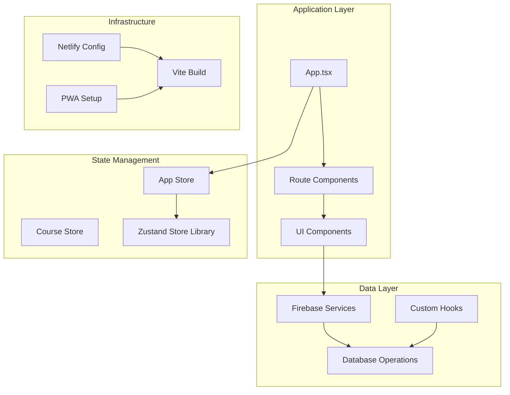
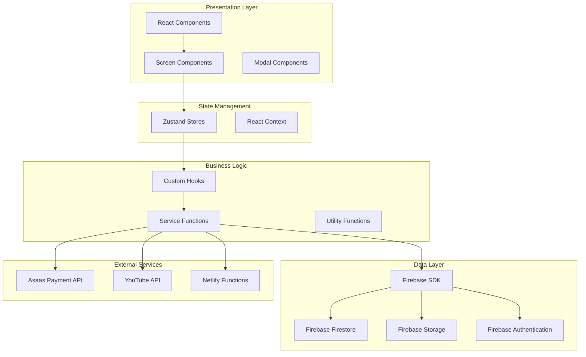
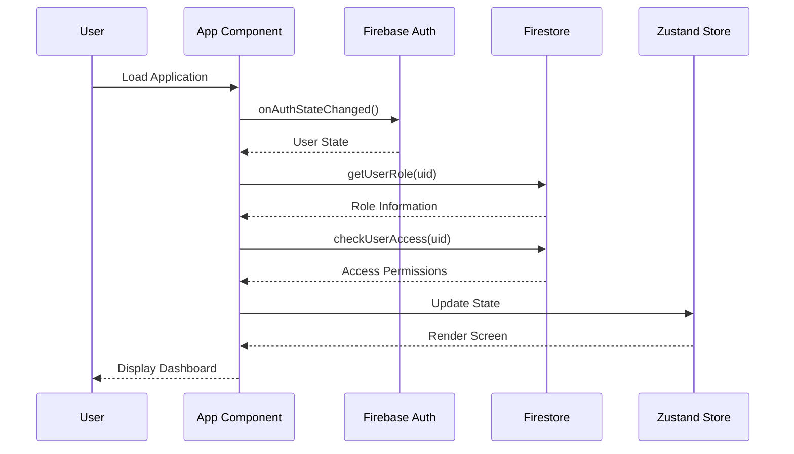
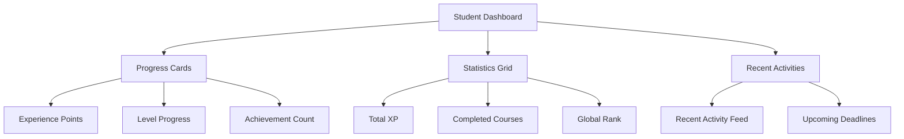
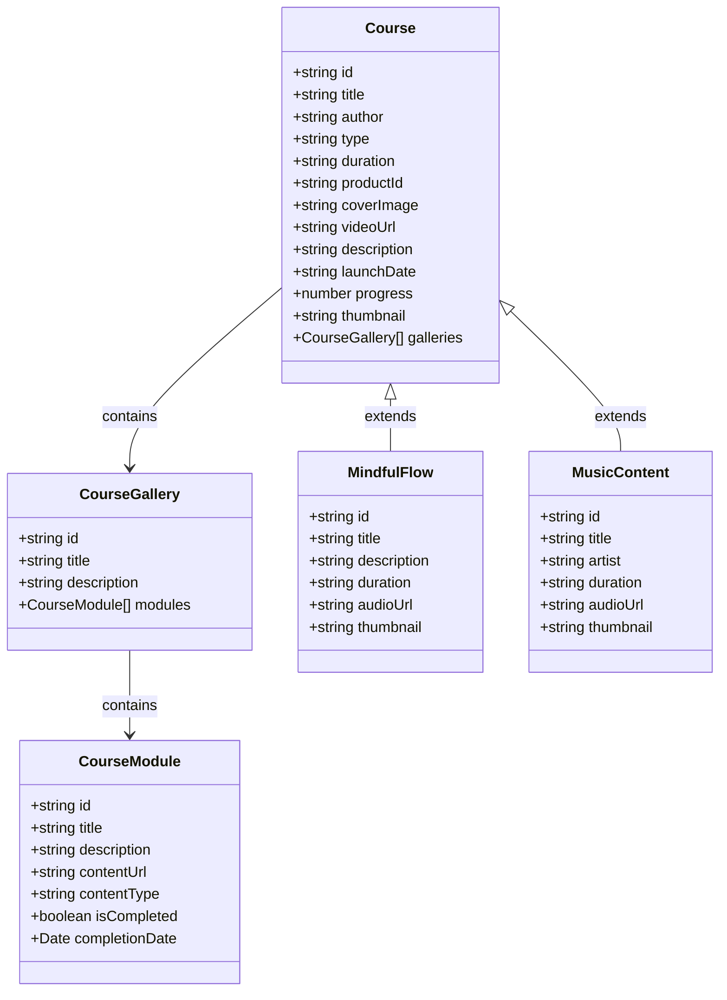
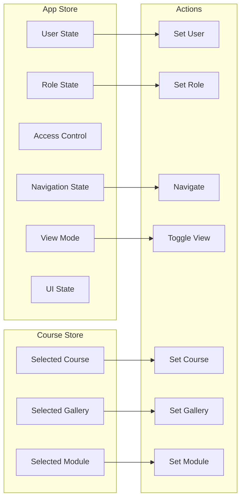
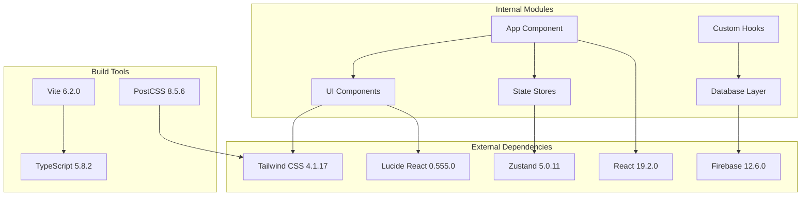

# Multi-Product Course Management System

<cite>
**Referenced Files in This Document**
- [App.tsx](file://App.tsx)
- [index.tsx](file://index.tsx)
- [package.json](file://package.json)
- [netlify.toml](file://netlify.toml)
- [lib/stores/appStore.ts](file://lib/stores/appStore.ts)
- [lib/stores/courseStore.ts](file://lib/stores/courseStore.ts)
- [lib/db/index.ts](file://lib/db/index.ts)
- [lib/firebase.ts](file://lib/firebase.ts)
- [types.ts](file://types.ts)
- [components/CourseList.tsx](file://components/CourseList.tsx)
- [components/StudentDashboard.tsx](file://components/StudentDashboard.tsx)
- [components/AdminCatalog.tsx](file://components/AdminCatalog.tsx)
- [hooks/useCatalogData.ts](file://hooks/useCatalogData.ts)
- [hooks/useCatalogFilters.ts](file://hooks/useCatalogFilters.ts)
</cite>

## Table of Contents
1. [Introduction](#introduction)
2. [Project Structure](#project-structure)
3. [Core Components](#core-components)
4. [Architecture Overview](#architecture-overview)
5. [Detailed Component Analysis](#detailed-component-analysis)
6. [Dependency Analysis](#dependency-analysis)
7. [Performance Considerations](#performance-considerations)
8. [Troubleshooting Guide](#troubleshooting-guide)
9. [Conclusion](#conclusion)

## Introduction
The Multi-Product Course Management System (Fluentoria) is a comprehensive learning management platform designed to support multiple educational products including traditional courses, mindful flow content, and music-based learning materials. Built with modern React and TypeScript, this system provides a unified interface for students and administrators while supporting complex content management workflows.

The platform emphasizes immersive user experiences through progressive web app capabilities, sophisticated gamification systems, and seamless multi-product content delivery. It integrates with Firebase for authentication and real-time database operations, while leveraging Asaas for payment processing and Netlify for deployment infrastructure.

## Project Structure
The project follows a modular React architecture with clear separation of concerns across components, libraries, and services:

**Diagram sources**
- [App.tsx:1-491](file://App.tsx#L1-L491)
- [lib/stores/appStore.ts:1-82](file://lib/stores/appStore.ts#L1-L82)
- [lib/firebase.ts:1-25](file://lib/firebase.ts#L1-L25)

**Section sources**
- [App.tsx:1-491](file://App.tsx#L1-L491)
- [package.json:1-44](file://package.json#L1-L44)
- [netlify.toml:1-65](file://netlify.toml#L1-L65)

## Core Components
The system is built around several core architectural components that work together to provide a seamless educational experience:

### Authentication and Authorization System
The authentication system leverages Firebase Authentication with custom role-based access control. The system supports both student and administrator roles with dynamic permission checking and payment status verification.

### State Management Architecture
Two primary Zustand stores manage application state:
- **App Store**: Handles user authentication, navigation state, and global UI state
- **Course Store**: Manages selected course context and navigation state

### Multi-Product Content Management
The system supports three distinct content types:
- Traditional courses with video/audio/pdf materials
- Mindful Flow content for meditation and wellness
- Music-based learning materials

**Section sources**
- [lib/stores/appStore.ts:1-82](file://lib/stores/appStore.ts#L1-L82)
- [lib/stores/courseStore.ts:1-34](file://lib/stores/courseStore.ts#L1-L34)
- [lib/db/index.ts:1-38](file://lib/db/index.ts#L1-L38)

## Architecture Overview
The system employs a layered architecture with clear separation between presentation, business logic, and data persistence:

**Diagram sources**
- [App.tsx:40-491](file://App.tsx#L40-L491)
- [lib/firebase.ts:1-25](file://lib/firebase.ts#L1-L25)
- [lib/db/index.ts:1-38](file://lib/db/index.ts#L1-L38)

## Detailed Component Analysis

### Application Root Component
The main App component serves as the application's central orchestrator, managing authentication state, navigation, and screen rendering:

**Diagram sources**
- [App.tsx:67-110](file://App.tsx#L67-L110)
- [lib/stores/appStore.ts:48-81](file://lib/stores/appStore.ts#L48-L81)

The component implements several key features:
- **Lazy Loading**: Uses React.lazy for code-splitting of route components
- **Error Boundary**: Wraps application in ErrorBoundary for robust error handling
- **PWA Integration**: Supports service worker registration and offline functionality
- **Responsive Design**: Adapts layout for mobile and desktop environments

**Section sources**
- [App.tsx:1-491](file://App.tsx#L1-L491)
- [index.tsx:1-65](file://index.tsx#L1-L65)

### Student Dashboard
The Student Dashboard provides personalized learning analytics and progress tracking:

**Diagram sources**
- [components/StudentDashboard.tsx:16-135](file://components/StudentDashboard.tsx#L16-L135)

The dashboard integrates with the gamification system to display:
- Current level and experience points
- Achievement statistics and rankings
- Attendance tracking and streak calculations
- Personalized learning recommendations

**Section sources**
- [components/StudentDashboard.tsx:1-135](file://components/StudentDashboard.tsx#L1-L135)

### Course Management System
The course management system supports three distinct product lines with unified administration:

**Diagram sources**
- [types.ts:27-125](file://types.ts#L27-L125)
- [components/AdminCatalog.tsx:37-437](file://components/AdminCatalog.tsx#L37-L437)

**Section sources**
- [components/AdminCatalog.tsx:1-437](file://components/AdminCatalog.tsx#L1-L437)
- [hooks/useCatalogData.ts:1-146](file://hooks/useCatalogData.ts#L1-L146)
- [hooks/useCatalogFilters.ts:1-86](file://hooks/useCatalogFilters.ts#L1-L86)

### State Management Architecture
The system uses Zustand for efficient state management with clear separation of concerns:

**Diagram sources**
- [lib/stores/appStore.ts:5-82](file://lib/stores/appStore.ts#L5-L82)
- [lib/stores/courseStore.ts:4-34](file://lib/stores/courseStore.ts#L4-L34)

**Section sources**
- [lib/stores/appStore.ts:1-82](file://lib/stores/appStore.ts#L1-L82)
- [lib/stores/courseStore.ts:1-34](file://lib/stores/courseStore.ts#L1-L34)

## Dependency Analysis
The system maintains clean dependency relationships through strategic module organization:

**Diagram sources**
- [package.json:13-42](file://package.json#L13-L42)
- [App.tsx:1-491](file://App.tsx#L1-L491)

**Section sources**
- [package.json:1-44](file://package.json#L1-L44)
- [netlify.toml:1-65](file://netlify.toml#L1-L65)

## Performance Considerations
The system implements several performance optimization strategies:

### Code Splitting and Lazy Loading
- Route components are dynamically imported using React.lazy
- Suspense boundaries provide graceful loading states
- Component-specific bundles reduce initial payload size

### State Management Efficiency
- Zustand eliminates unnecessary re-renders through selective state updates
- Deep copying prevents mutation-related performance issues
- Local caching reduces database query frequency

### Progressive Web App Features
- Service worker enables offline functionality
- App manifest supports native app installation
- Background synchronization for data consistency

## Troubleshooting Guide

### Authentication Issues
Common authentication problems and solutions:
- **User Role Not Persisting**: Verify Firebase authentication state synchronization
- **Access Denied Errors**: Check payment status and user role permissions
- **Session Timeout**: Implement automatic re-authentication flows

### Database Connectivity
- **Slow Queries**: Monitor Firestore query performance and optimize indexes
- **Offline Data**: Verify local cache configuration and synchronization
- **Permission Errors**: Review Firestore security rules and user permissions

### Performance Issues
- **Slow Navigation**: Analyze lazy loading bundle sizes and split points
- **Memory Leaks**: Check for proper cleanup of event listeners and subscriptions
- **Large Payloads**: Implement pagination and virtualization for large lists

**Section sources**
- [App.tsx:171-181](file://App.tsx#L171-L181)
- [lib/firebase.ts:16-25](file://lib/firebase.ts#L16-L25)

## Conclusion
The Multi-Product Course Management System represents a sophisticated educational technology platform that successfully balances complexity with usability. Through its modular architecture, comprehensive state management, and integrated multi-product support, the system provides an extensible foundation for educational content delivery.

Key strengths include:
- **Scalable Architecture**: Clean separation of concerns enables easy feature expansion
- **Modern Technology Stack**: Leverages cutting-edge React patterns and Firebase integration
- **User-Centric Design**: Responsive interface with progressive web app capabilities
- **Robust State Management**: Efficient Zustand implementation with clear data flow

The system's modular design and comprehensive documentation framework position it well for continued evolution and adaptation to emerging educational technology trends.