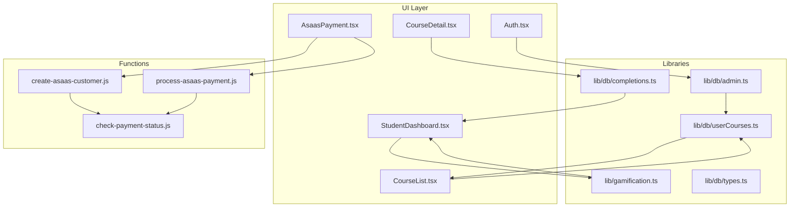
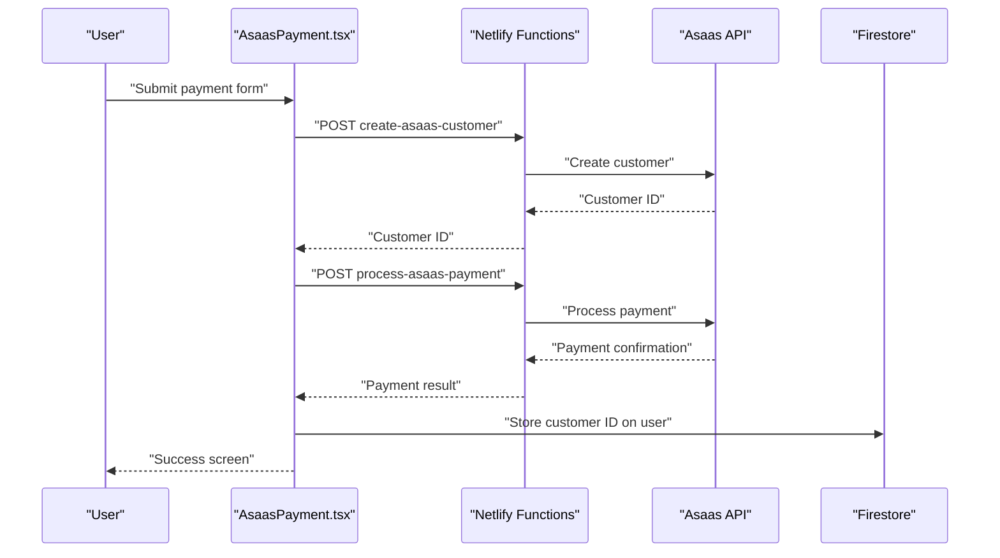
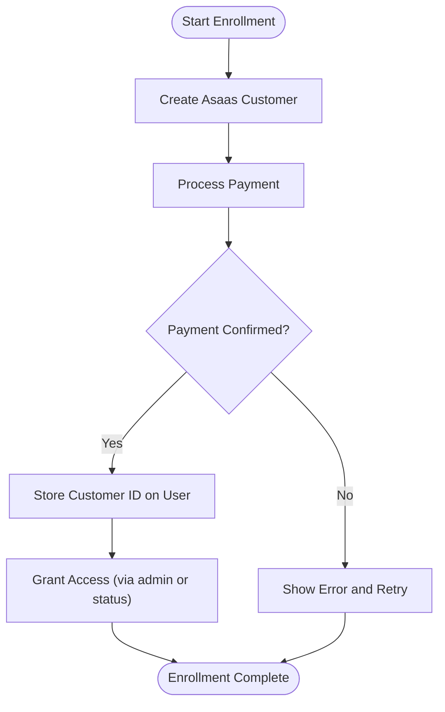
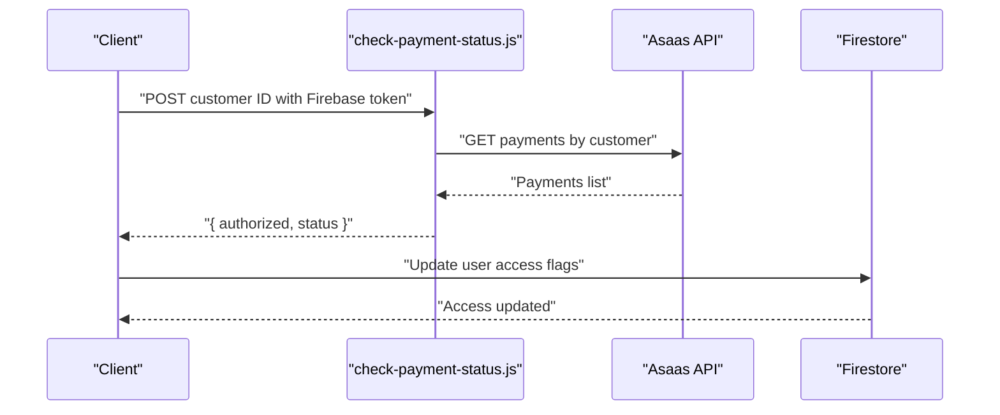
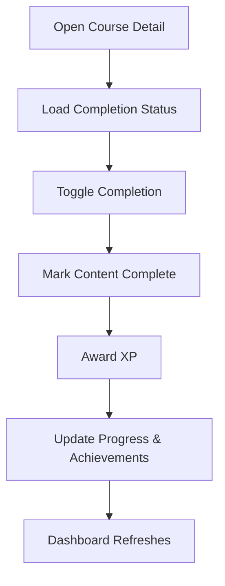
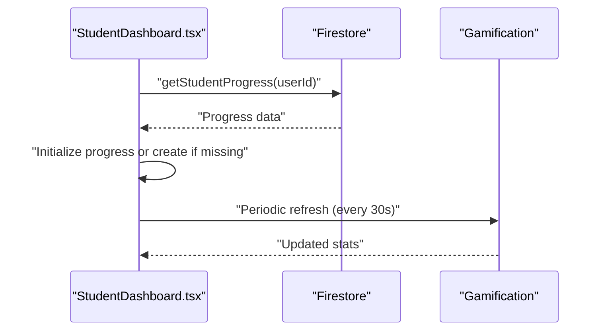
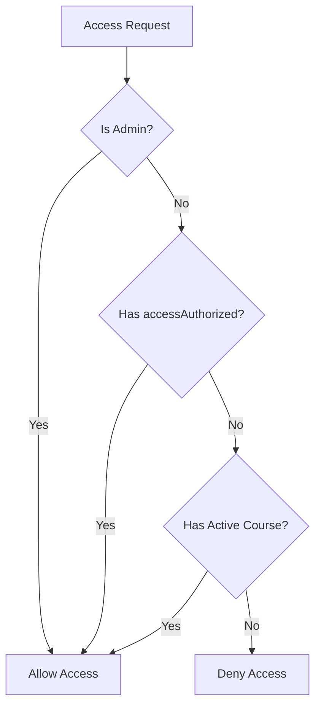
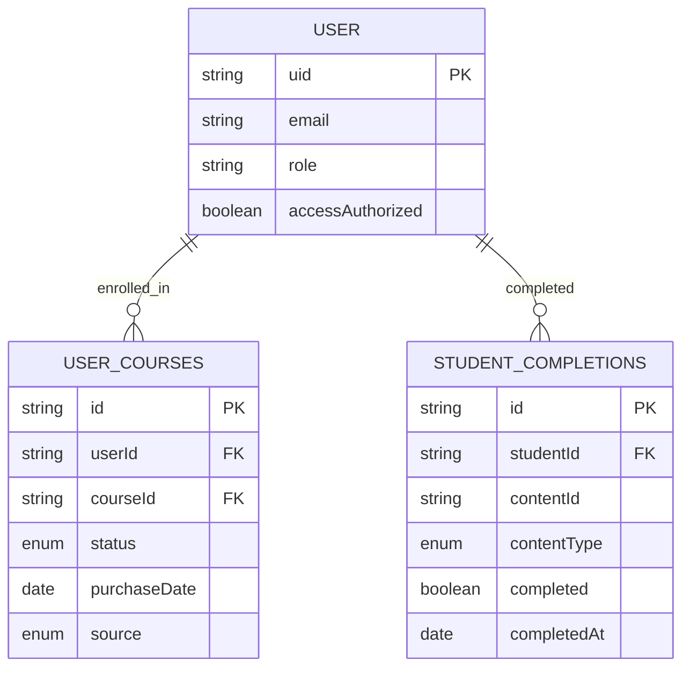
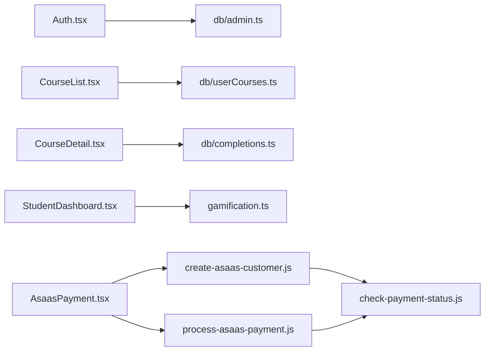

# Student Enrollment & Access Control

<cite>
**Referenced Files in This Document**
- [StudentDashboard.tsx](file://components/StudentDashboard.tsx)
- [CourseList.tsx](file://components/CourseList.tsx)
- [CourseDetail.tsx](file://components/CourseDetail.tsx)
- [AsaasPayment.tsx](file://components/AsaasPayment.tsx)
- [Auth.tsx](file://components/Auth.tsx)
- [gamification.ts](file://lib/gamification.ts)
- [db/index.ts](file://lib/db/index.ts)
- [db/types.ts](file://lib/db/types.ts)
- [db/userCourses.ts](file://lib/db/userCourses.ts)
- [db/admin.ts](file://lib/db/admin.ts)
- [db/completions.ts](file://lib/db/completions.ts)
- [check-payment-status.js](file://netlify/functions/check-payment-status.js)
- [process-asaas-payment.js](file://netlify/functions/process-asaas-payment.js)
- [create-asaas-customer.js](file://netlify/functions/create-asaas-customer.js)
- [types.ts](file://types.ts)
</cite>

## Table of Contents
1. [Introduction](#introduction)
2. [Project Structure](#project-structure)
3. [Core Components](#core-components)
4. [Architecture Overview](#architecture-overview)
5. [Detailed Component Analysis](#detailed-component-analysis)
6. [Dependency Analysis](#dependency-analysis)
7. [Performance Considerations](#performance-considerations)
8. [Troubleshooting Guide](#troubleshooting-guide)
9. [Conclusion](#conclusion)

## Introduction
This document explains the student enrollment and access control mechanisms in the platform. It covers the enrollment workflow (course registration, payment processing, and access authorization), integration between course availability and student progress tracking, access control logic based on payment status, and the student dashboard features for enrolled course management, progress monitoring, and course navigation. It also documents validation logic, role-based permissions, and the relationship between enrollment records, course completion tracking, and achievement unlocking.

## Project Structure
The enrollment and access control system spans UI components, client-side libraries, and serverless functions:
- UI components orchestrate user actions (authentication, course browsing, payment, and course detail views)
- Client libraries manage progress, completions, and access checks
- Netlify functions integrate with Asaas for customer creation, payment processing, and payment status verification
- Firestore collections store user roles, course enrollments, and completion records

**Diagram sources**
- [Auth.tsx](file://components/Auth.tsx#L1-L265)
- [CourseList.tsx](file://components/CourseList.tsx#L1-L216)
- [CourseDetail.tsx](file://components/CourseDetail.tsx#L1-L526)
- [StudentDashboard.tsx](file://components/StudentDashboard.tsx#L1-L135)
- [AsaasPayment.tsx](file://components/AsaasPayment.tsx#L1-L491)
- [db/admin.ts](file://lib/db/admin.ts#L1-L307)
- [db/userCourses.ts](file://lib/db/userCourses.ts#L1-L112)
- [db/completions.ts](file://lib/db/completions.ts#L1-L56)
- [gamification.ts](file://lib/gamification.ts#L1-L349)
- [create-asaas-customer.js](file://netlify/functions/create-asaas-customer.js#L1-L146)
- [process-asaas-payment.js](file://netlify/functions/process-asaas-payment.js#L1-L121)
- [check-payment-status.js](file://netlify/functions/check-payment-status.js#L1-L152)

**Section sources**
- [Auth.tsx](file://components/Auth.tsx#L1-L265)
- [CourseList.tsx](file://components/CourseList.tsx#L1-L216)
- [CourseDetail.tsx](file://components/CourseDetail.tsx#L1-L526)
- [StudentDashboard.tsx](file://components/StudentDashboard.tsx#L1-L135)
- [AsaasPayment.tsx](file://components/AsaasPayment.tsx#L1-L491)
- [db/admin.ts](file://lib/db/admin.ts#L1-L307)
- [db/userCourses.ts](file://lib/db/userCourses.ts#L1-L112)
- [db/completions.ts](file://lib/db/completions.ts#L1-L56)
- [gamification.ts](file://lib/gamification.ts#L1-L349)
- [create-asaas-customer.js](file://netlify/functions/create-asaas-customer.js#L1-L146)
- [process-asaas-payment.js](file://netlify/functions/process-asaas-payment.js#L1-L121)
- [check-payment-status.js](file://netlify/functions/check-payment-status.js#L1-L152)

## Core Components
- Authentication and user creation: Handles sign-in/sign-up and creates/updates user profiles with roles and access flags
- Course catalog and enrollment: Lists enrolled courses and supports course selection
- Course detail and progress: Manages lesson navigation, completion tracking, and XP rewards
- Payment and access control: Processes payments via Asaas, validates payment status, and grants/restricts access
- Student dashboard: Displays progress, XP, level, achievements, and ranking

Key responsibilities:
- Enforce access control based on admin status, explicit authorization, or active course enrollment
- Track and reward student progress and achievements
- Persist completion records and maintain real-time progress indicators

**Section sources**
- [Auth.tsx](file://components/Auth.tsx#L1-L265)
- [CourseList.tsx](file://components/CourseList.tsx#L1-L216)
- [CourseDetail.tsx](file://components/CourseDetail.tsx#L1-L526)
- [StudentDashboard.tsx](file://components/StudentDashboard.tsx#L1-L135)
- [AsaasPayment.tsx](file://components/AsaasPayment.tsx#L1-L491)
- [db/admin.ts](file://lib/db/admin.ts#L86-L127)
- [db/userCourses.ts](file://lib/db/userCourses.ts#L89-L111)
- [db/completions.ts](file://lib/db/completions.ts#L6-L29)
- [gamification.ts](file://lib/gamification.ts#L43-L98)

## Architecture Overview
The enrollment and access control pipeline integrates client-side components with Firestore and Netlify functions:
- Payments: Frontend collects customer and card data, creates an Asaas customer, processes a payment, and receives a confirmation status
- Access control: Backend verifies Firebase tokens, queries Asaas for payment status, and updates user access flags
- Course access: Users gain access either by payment authorization or by having active course enrollments
- Progress and achievements: Completion events trigger XP awards and achievement unlocks

**Diagram sources**
- [AsaasPayment.tsx](file://components/AsaasPayment.tsx#L86-L181)
- [create-asaas-customer.js](file://netlify/functions/create-asaas-customer.js#L88-L132)
- [process-asaas-payment.js](file://netlify/functions/process-asaas-payment.js#L79-L107)

## Detailed Component Analysis

### Enrollment Workflow: Registration, Payment, Access
- Customer creation: The frontend submits personal and card details; the function creates a customer record in Asaas and returns a customer ID
- Payment processing: The frontend sends payment data to the function, which proxies the request to Asaas and returns the payment result
- Access authorization: After successful payment, the frontend stores the Asaas customer ID on the user profile; backend functions can later verify payment status and update access flags

**Diagram sources**
- [AsaasPayment.tsx](file://components/AsaasPayment.tsx#L86-L244)
- [create-asaas-customer.js](file://netlify/functions/create-asaas-customer.js#L88-L132)
- [process-asaas-payment.js](file://netlify/functions/process-asaas-payment.js#L79-L107)

**Section sources**
- [AsaasPayment.tsx](file://components/AsaasPayment.tsx#L12-L491)
- [create-asaas-customer.js](file://netlify/functions/create-asaas-customer.js#L1-L146)
- [process-asaas-payment.js](file://netlify/functions/process-asaas-payment.js#L1-L121)

### Payment Verification and Access Control
- Payment status check: A function verifies a Firebase token, queries Asaas for confirmed payments linked to a customer, and returns whether the user is authorized
- Access determination: The system grants access if the user is admin, has explicit authorization, or has active course enrollments

**Diagram sources**
- [check-payment-status.js](file://netlify/functions/check-payment-status.js#L64-L139)
- [db/admin.ts](file://lib/db/admin.ts#L86-L127)

**Section sources**
- [check-payment-status.js](file://netlify/functions/check-payment-status.js#L1-L152)
- [db/admin.ts](file://lib/db/admin.ts#L86-L127)

### Course Availability, Progress Tracking, and Access
- Course list: Displays enrolled courses with progress indicators and navigation to course details
- Course detail: Manages lesson navigation, completion toggling, and XP rewards upon completion
- Progress and achievements: Loads and initializes student progress, periodically refreshes, and triggers achievement checks

**Diagram sources**
- [CourseDetail.tsx](file://components/CourseDetail.tsx#L56-L146)
- [db/completions.ts](file://lib/db/completions.ts#L31-L55)
- [gamification.ts](file://lib/gamification.ts#L100-L129)
- [StudentDashboard.tsx](file://components/StudentDashboard.tsx#L20-L43)

**Section sources**
- [CourseList.tsx](file://components/CourseList.tsx#L17-L32)
- [CourseDetail.tsx](file://components/CourseDetail.tsx#L19-L71)
- [db/completions.ts](file://lib/db/completions.ts#L1-L56)
- [gamification.ts](file://lib/gamification.ts#L43-L98)
- [StudentDashboard.tsx](file://components/StudentDashboard.tsx#L16-L43)

### Student Dashboard: Enrolled Courses, Progress, Navigation
- Progress initialization: On mount, loads or creates student progress and refreshes every 30 seconds
- Stats display: Shows total XP, unlocked achievements, and global rank
- Navigation: Links to achievements and attendance tracker

**Diagram sources**
- [StudentDashboard.tsx](file://components/StudentDashboard.tsx#L20-L43)
- [gamification.ts](file://lib/gamification.ts#L43-L64)

**Section sources**
- [StudentDashboard.tsx](file://components/StudentDashboard.tsx#L16-L135)
- [gamification.ts](file://lib/gamification.ts#L43-L98)

### Role-Based Permissions and Access Restriction Logic
- Admin enforcement: Certain operations require admin privileges; the system verifies roles and enforces access
- Access checks: Determines if a user can access content based on admin status, explicit authorization, or active course enrollment
- Course access APIs: Provide helpers to check and manage course access for users

**Diagram sources**
- [db/admin.ts](file://lib/db/admin.ts#L86-L127)
- [db/userCourses.ts](file://lib/db/userCourses.ts#L89-L111)

**Section sources**
- [db/admin.ts](file://lib/db/admin.ts#L6-L22)
- [db/admin.ts](file://lib/db/admin.ts#L86-L127)
- [db/userCourses.ts](file://lib/db/userCourses.ts#L89-L111)

### Enrollment Records, Completion Tracking, and Achievement Unlocking
- Enrollment records: Stored in a dedicated collection linking users to courses with status and source
- Completion tracking: Stores per-content completion flags with timestamps
- Achievement unlocking: Checks conditions against progress and unlocks achievements with XP rewards

**Diagram sources**
- [db/types.ts](file://lib/db/types.ts#L53-L61)
- [db/types.ts](file://lib/db/types.ts#L63-L69)
- [db/userCourses.ts](file://lib/db/userCourses.ts#L7-L23)
- [db/completions.ts](file://lib/db/completions.ts#L6-L29)

**Section sources**
- [db/types.ts](file://lib/db/types.ts#L53-L69)
- [db/userCourses.ts](file://lib/db/userCourses.ts#L1-L112)
- [db/completions.ts](file://lib/db/completions.ts#L1-L56)
- [gamification.ts](file://lib/gamification.ts#L163-L195)

## Dependency Analysis
- UI components depend on libraries for progress, completions, and access control
- Payment UI depends on Netlify functions for secure payment processing
- Access control relies on Firestore user records and course enrollment collections
- Achievement system depends on progress and condition checks

**Diagram sources**
- [Auth.tsx](file://components/Auth.tsx#L1-L265)
- [CourseList.tsx](file://components/CourseList.tsx#L1-L216)
- [CourseDetail.tsx](file://components/CourseDetail.tsx#L1-L526)
- [StudentDashboard.tsx](file://components/StudentDashboard.tsx#L1-L135)
- [AsaasPayment.tsx](file://components/AsaasPayment.tsx#L1-L491)
- [db/admin.ts](file://lib/db/admin.ts#L1-L307)
- [db/userCourses.ts](file://lib/db/userCourses.ts#L1-L112)
- [db/completions.ts](file://lib/db/completions.ts#L1-L56)
- [gamification.ts](file://lib/gamification.ts#L1-L349)
- [create-asaas-customer.js](file://netlify/functions/create-asaas-customer.js#L1-L146)
- [process-asaas-payment.js](file://netlify/functions/process-asaas-payment.js#L1-L121)
- [check-payment-status.js](file://netlify/functions/check-payment-status.js#L1-L152)

**Section sources**
- [db/index.ts](file://lib/db/index.ts#L1-L38)
- [types.ts](file://types.ts#L3-L25)

## Performance Considerations
- Real-time progress updates: The dashboard reloads progress every 30 seconds to reflect recent changes; consider throttling or subscription-based updates for scalability
- Payment function calls: Minimize redundant customer creation and payment attempts; cache customer IDs after successful creation
- Firestore queries: Use indexed fields for user-course lookups and completion checks to reduce latency
- Achievement checks: Batch or debounce achievement evaluations to avoid frequent writes

## Troubleshooting Guide
Common issues and resolutions:
- Authentication errors during payment: Ensure Firebase token verification succeeds and required headers are present
- Payment failures: Validate form inputs, card details formatting, and network connectivity; inspect function error responses
- Access denied: Confirm user role, explicit authorization flag, or active course enrollment; verify Firestore updates
- Completion not saved: Check completion ID generation and Firestore write permissions; ensure content type and IDs match

**Section sources**
- [check-payment-status.js](file://netlify/functions/check-payment-status.js#L44-L62)
- [process-asaas-payment.js](file://netlify/functions/process-asaas-payment.js#L44-L62)
- [db/admin.ts](file://lib/db/admin.ts#L86-L127)
- [db/completions.ts](file://lib/db/completions.ts#L31-L55)

## Conclusion
The enrollment and access control system combines secure payment processing, robust access checks, and integrated progress tracking. By leveraging Firestore for persistent state, Netlify functions for payment orchestration, and gamification for engagement, the platform ensures that only authorized users can access courses while rewarding progress and achievements. The modular design allows for future enhancements such as subscription plans, course bundles, and advanced analytics.