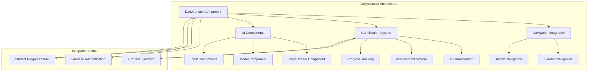
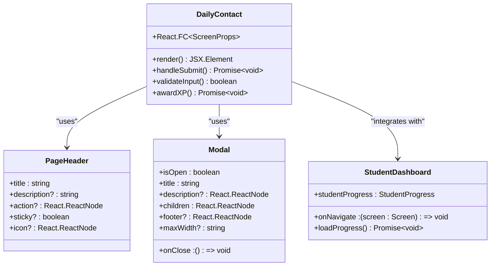
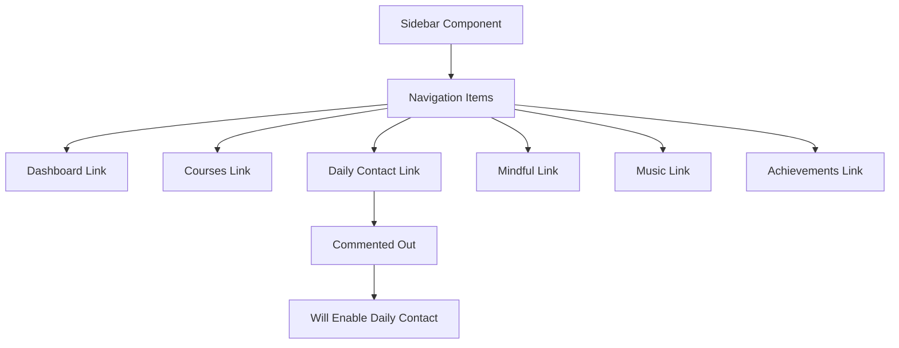
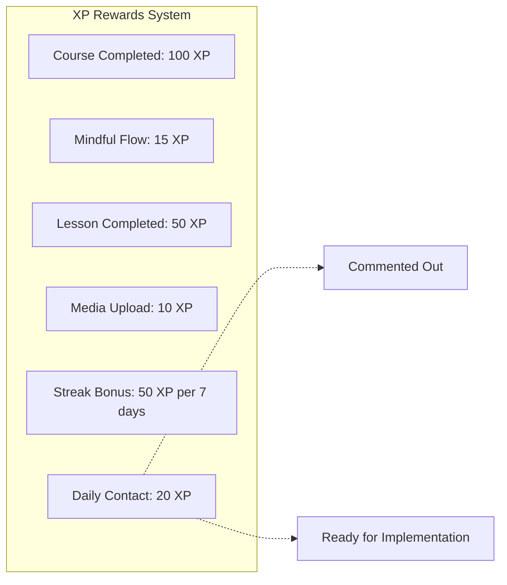
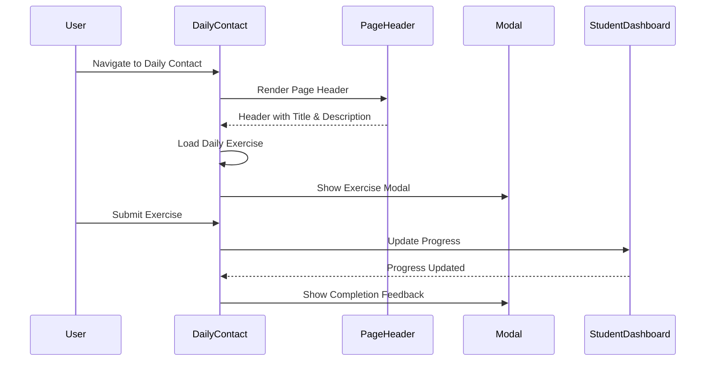
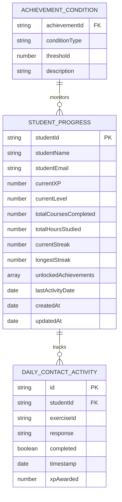

# Dailycontact Feature

<cite>
**Referenced Files in This Document**
- [DailyContact.tsx](file://components/DailyContact.tsx)
- [Sidebar.tsx](file://components/Sidebar.tsx)
- [App.tsx](file://App.tsx)
- [types.ts](file://types.ts)
- [gamification.ts](file://lib/gamification.ts)
- [StudentDashboard.tsx](file://components/StudentDashboard.tsx)
- [PageHeader.tsx](file://components/ui/PageHeader.tsx)
- [Modal.tsx](file://components/ui/Modal.tsx)
</cite>

## Table of Contents
1. [Introduction](#introduction)
2. [Feature Status](#feature-status)
3. [Architectural Design](#architectural-design)
4. [Core Components](#core-components)
5. [Navigation Integration](#navigation-integration)
6. [Gamification System](#gamification-system)
7. [UI/UX Implementation](#uiux-implementation)
8. [Database Schema](#database-schema)
9. [Implementation Plan](#implementation-plan)
10. [Technical Specifications](#technical-specifications)
11. [Security Considerations](#security-considerations)
12. [Future Enhancements](#future-enhancements)

## Introduction

The Dailycontact Feature represents a structured daily engagement system designed to enhance student learning consistency and motivation through regular practice exercises. This feature integrates seamlessly with the existing Fluentoria platform's gamification system, providing students with daily challenges that contribute to their overall learning journey and achievement progression.

The feature is currently in a disabled state within the codebase, with the original implementation preserved in Git history for future restoration. This documentation serves as a comprehensive guide for implementing the Dailycontact functionality, detailing the architectural requirements, component design, and integration patterns necessary for seamless deployment.

## Feature Status

The Dailycontact Feature is currently **disabled** in the production codebase. The implementation includes:

- **Disabled Component**: The main DailyContact component exists but is inactive
- **Navigation Removal**: Daily contact option has been removed from sidebar navigation
- **Type Definitions**: Screen types still include daily contact references (commented out)
- **Gamification Integration**: XP rewards and achievement conditions are commented out

**Section sources**
- [DailyContact.tsx:1-7](file://components/DailyContact.tsx#L1-L7)
- [Sidebar.tsx:56-64](file://components/Sidebar.tsx#L56-L64)
- [types.ts:11-12](file://types.ts#L11-L12)
- [gamification.ts:12](file://lib/gamification.ts#L12)

## Architectural Design

The Dailycontact Feature follows a modular architecture pattern that integrates with the existing Fluentoria platform infrastructure. The system is designed around several key architectural principles:

**Diagram sources**
- [DailyContact.tsx:1-7](file://components/DailyContact.tsx#L1-L7)
- [Sidebar.tsx:27-152](file://components/Sidebar.tsx#L27-L152)
- [gamification.ts:1-349](file://lib/gamification.ts#L1-L349)

### Component Hierarchy

**Diagram sources**
- [DailyContact.tsx:1-7](file://components/DailyContact.tsx#L1-L7)
- [PageHeader.tsx:12-38](file://components/ui/PageHeader.tsx#L12-L38)
- [Modal.tsx:15-57](file://components/ui/Modal.tsx#L15-L57)
- [StudentDashboard.tsx:16-135](file://components/StudentDashboard.tsx#L16-L135)

## Core Components

### DailyContact Component

The DailyContact component serves as the primary interface for daily engagement activities. Currently disabled, this component would handle:

- **Daily Exercise Display**: Present structured learning exercises
- **Input Validation**: Validate student responses and progress
- **XP Awarding**: Automatically distribute experience points
- **Progress Tracking**: Monitor daily completion rates
- **Achievement Integration**: Trigger relevant achievement unlocks

### Navigation Integration

The feature integrates with the existing navigation system through:

- **Sidebar Menu**: Hidden daily contact option awaiting activation
- **Mobile Navigation**: Responsive mobile menu integration
- **Route Management**: Screen routing and state management
- **Context Preservation**: Maintains course and module context

### UI Component Library

The feature leverages existing UI components:

- **PageHeader**: Consistent page styling and layout
- **Modal**: Confirmation dialogs and feedback systems
- **Input Components**: Form validation and user interaction
- **Card Components**: Content presentation and organization

**Section sources**
- [DailyContact.tsx:1-7](file://components/DailyContact.tsx#L1-L7)
- [Sidebar.tsx:42-90](file://components/Sidebar.tsx#L42-L90)
- [PageHeader.tsx:12-38](file://components/ui/PageHeader.tsx#L12-L38)
- [Modal.tsx:15-57](file://components/ui/Modal.tsx#L15-L57)

## Navigation Integration

The Dailycontact Feature integrates with the existing navigation system through multiple touchpoints:

### Sidebar Navigation

The sidebar component includes a commented-out daily contact navigation item:

**Diagram sources**
- [Sidebar.tsx:56-64](file://components/Sidebar.tsx#L56-L64)

### Route Management

The App component manages screen routing through:

- **Screen State Management**: Centralized navigation state
- **Route Resolution**: Dynamic component rendering
- **Context Preservation**: Maintains user context across navigation
- **Access Control**: Role-based screen availability

**Section sources**
- [App.tsx:263-361](file://App.tsx#L263-L361)
- [Sidebar.tsx:27-152](file://components/Sidebar.tsx#L27-L152)

## Gamification System

The Dailycontact Feature integrates deeply with the existing gamification system:

### XP Reward Structure

The gamification system includes predefined XP rewards for various activities:

**Diagram sources**
- [gamification.ts:10-17](file://lib/gamification.ts#L10-L17)

### Achievement Integration

The feature supports achievement unlocking through:

- **Daily Contact Count Condition**: Triggers achievements based on daily participation
- **Progress Tracking**: Monitors daily completion rates
- **XP Accumulation**: Contributes to overall XP progression
- **Streak Bonuses**: Encourages consistent daily engagement

**Section sources**
- [gamification.ts:100-129](file://lib/gamification.ts#L100-L129)
- [types.ts:95-106](file://types.ts#L95-L106)

## UI/UX Implementation

### Page Structure

The Dailycontact interface follows the established page structure pattern:

**Diagram sources**
- [PageHeader.tsx:12-38](file://components/ui/PageHeader.tsx#L12-L38)
- [Modal.tsx:15-57](file://components/ui/Modal.tsx#L15-L57)
- [StudentDashboard.tsx:16-135](file://components/StudentDashboard.tsx#L16-L135)

### Responsive Design

The feature maintains responsive design principles:

- **Mobile-First Approach**: Optimized for mobile device usage
- **Adaptive Layouts**: Flexible component arrangements
- **Touch-Friendly Interactions**: Large touch targets and gestures
- **Performance Optimization**: Efficient rendering and state management

## Database Schema

### Student Progress Integration

The Dailycontact Feature integrates with the existing student progress system:

**Diagram sources**
- [types.ts:108-125](file://types.ts#L108-L125)

### Data Flow Patterns

The system implements efficient data flow patterns:

- **Real-time Updates**: Firebase Firestore integration for live data synchronization
- **Caching Strategies**: Local caching for improved performance
- **Error Handling**: Robust error handling and retry mechanisms
- **Data Validation**: Comprehensive input validation and sanitization

## Implementation Plan

### Phase 1: Component Development

**Week 1-2**: Core Component Implementation
- Develop DailyContact component with exercise rendering
- Implement input validation and response handling
- Create exercise submission workflow
- Integrate with Firebase authentication

**Week 3**: UI/UX Refinement
- Implement responsive design patterns
- Add loading states and error handling
- Create accessibility features
- Test cross-browser compatibility

### Phase 2: Integration Development

**Week 4**: Gamification Integration
- Implement XP awarding system
- Integrate achievement condition checking
- Add progress tracking mechanisms
- Create leaderboard integration

**Week 5**: Navigation Integration
- Activate sidebar navigation option
- Implement route protection
- Add context preservation
- Test deep linking capabilities

### Phase 3: Testing and Deployment

**Week 6**: Quality Assurance
- Unit testing for all components
- Integration testing with backend services
- Performance optimization
- Security vulnerability assessment

**Week 7**: Deployment Preparation
- Production environment setup
- Monitoring and logging implementation
- Backup and recovery procedures
- User documentation creation

## Technical Specifications

### Component Architecture

The Dailycontact Feature follows React functional component patterns:

- **TypeScript Integration**: Full TypeScript support for type safety
- **Hook-Based State Management**: React hooks for state and lifecycle management
- **Lazy Loading**: Code splitting for optimal performance
- **Error Boundaries**: Graceful error handling and recovery

### Performance Requirements

- **Load Time**: Under 2 seconds for initial component load
- **Response Time**: Sub-100ms for user interactions
- **Memory Usage**: Optimized memory footprint for mobile devices
- **Network Efficiency**: Minimized API calls and efficient data fetching

### Security Considerations

- **Input Sanitization**: Comprehensive input validation and sanitization
- **Authentication**: Integration with Firebase authentication
- **Authorization**: Role-based access control implementation
- **Data Protection**: Secure data transmission and storage

## Security Considerations

### Authentication Integration

The feature integrates with Firebase Authentication for secure user management:

- **Automatic Token Refresh**: Seamless authentication token management
- **Session Management**: Persistent session handling across browser tabs
- **Multi-factor Authentication**: Support for enhanced security measures
- **Account Protection**: Rate limiting and suspicious activity detection

### Data Validation

Comprehensive input validation ensures data integrity:

- **Client-Side Validation**: Real-time form validation and feedback
- **Server-Side Validation**: Additional validation layer for security
- **SQL Injection Prevention**: Parameterized queries and input escaping
- **XSS Prevention**: Content security policy implementation

### Privacy Protection

- **Data Minimization**: Only collect necessary user data
- **Encryption**: Sensitive data encryption at rest and in transit
- **Audit Logging**: Comprehensive logging for security monitoring
- **GDPR Compliance**: Data protection and user rights adherence

## Future Enhancements

### Advanced Features

**Personalized Learning Paths**: AI-driven exercise recommendation system
**Social Integration**: Peer comparison and collaborative learning features
**Offline Support**: Progressive Web App capabilities for offline usage
**Analytics Dashboard**: Detailed progress tracking and insights

### Technical Improvements

**Microservices Architecture**: Scalable backend service implementation
**Real-time Collaboration**: Multi-user exercise sharing and collaboration
**Machine Learning**: Adaptive difficulty adjustment based on performance
**Blockchain Integration**: Immutable exercise completion records

### User Experience Enhancements

**Voice Interaction**: Voice-controlled exercise navigation
**Augmented Reality**: AR-based interactive exercises
**Haptic Feedback**: Touch-based interaction enhancements
**Custom Themes**: Personalizable interface themes and layouts

The Dailycontact Feature represents a significant enhancement to the Fluentoria platform's educational offerings. Its modular design ensures seamless integration with existing systems while providing a foundation for future expansion and innovation in digital education technology.